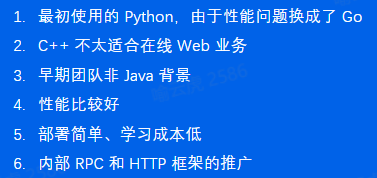

# 1. Go语言基础

## 1.1 Go简介

### 1.1.1 什么是Go语言

1. 高性能、高并发
2. 语法简单、学习曲线平缓
3. 丰富的标准库
4. 完善的工具链
5. 静态链接
6. 快速编译
7. 跨平台
8. 垃圾回收

### 1.1.2 字节为什么全面拥抱Go语言



## 1.2 基础语法

### 1.2.1 Hello World

```go
package main  // 如果要使得源文件变成可执行文件，则包名必须声明为main，且必须有一个main函数

import (
   "fmt"
)

func main() {
   fmt.Println("hello world")
}
```

### 1.2.2 变量

```go
package main

import "fmt"

func main() {
   var a = "string"
   fmt.Println(a)
   b := "sss"
   fmt.Println(b)

   c := a + b
   fmt.Println(c)

   // 常量，没有确定的类型，会根据使用的上下文自动确定类型
   const d = "const"
   const e string = "const str"
   fmt.Println(d)
   fmt.Println(e)
}
```

### 1.2.3 ifelse

```go
package main

import "fmt"

func main() {
   if 7%2 == 0 {
      fmt.Println("7 is even")
   } else {
      fmt.Println("7 is odd")
   }
   if num := 1; num < 0 {
      fmt.Println(num)
   } else {
      fmt.Println(2)
   }
}
```

### 1.2.4 for

```go
package main

import "fmt"

func main() {
   for i := 0; i < 10; i++ {
      fmt.Println(i)
   }
}
```

### 1.2.5 switch

```go
package main

import (
   "fmt"
   "time"
)

func main() {
   a := 2
   switch a {
   case 1:
      fmt.Println(1)
   case 2:
      fmt.Println(2)
   }
   t := time.Now()
   switch {
   case t.Hour() < 10:
      fmt.Println(1)
   case t.Hour() < 12:
      fmt.Println(2)
   default:
      fmt.Println(3)
   }
}
```

### 1.2.6 数组

```go
package main

import "fmt"

func main() {
   var arr [3]int
   for i := 0; i < len(arr); i++ {
      fmt.Println(arr[i]) // 未赋值，默认为0
   }

   arr1 := [3]int{1, 2, 3} // 不赋值会报错
   for i := 0; i < len(arr1); i++ {
      fmt.Println(arr1[i])
   }

   arr2 := [2][2]int{{1, 2}, {3, 4}}
   for i := 0; i < len(arr2); i++ {
      for j := 0; j < len(arr2[0]); j++ {
         fmt.Println(arr2[i][j])
      }
   }
}
```

### 1.2.7 切片

```go
package main

import "fmt"

func main() {
   s := make([]string, 3)
   s[0] = "aa"
   s[1] = "bb"
   s[2] = "cc"
   fmt.Println("get: ", s[2])
   fmt.Println("len: ", len(s))

   s = append(s, "dd")
   s = append(s, "ee", "ff")
   fmt.Println(s)

   ss := make([]string, len(s))
   copy(ss, s)
   fmt.Println(ss)

   fmt.Println(s[2:4])
   fmt.Println(s[:4])
   fmt.Println(s[2:])
}
```

### 1.2.8 map

```go
package main

import "fmt"

func main() {
   m := make(map[string]int)
   m["one"] = 1
   m["two"] = 2
   fmt.Println(m)
   fmt.Println(len(m))
   fmt.Println(m["two"])

   r, ok := m["un"]
   fmt.Println(r, ok)

   delete(m, "one")

   fmt.Println(m)

   m2 := map[string]int{"one": 1, "two": 2}
   var m3 = map[string]int{"three": 3, "four": 4}
   fmt.Println(m2, m3)
}
```

### 1.2.9 range

```go
package main

import "fmt"

func main() {
   nums := []int{2, 3, 4}
   sum := 0
   for i, num := range nums {
      sum += num
      if num == 2 {
         fmt.Println("index:", i, "num:", num) // index: 0 num: 2
      }
   }
   fmt.Println(sum) // 9

   m := map[string]string{"a": "A", "b": "B"}
   for k, v := range m {
      fmt.Println(k, v) // b 8; a A
   }
   for k := range m {
      fmt.Println("key", k) // key a; key b
   }
}
```

### 1.2.10 函数

```go
package main

import "fmt"

func add(a int, b int) int {
   return a + b
}

func add2(a, b int) int {
   return a + b
}

func exists(m map[string]string, k string) (v string, ok bool) {
   v, ok = m[k]
   return v, ok
}

func main() {
   res := add(1, 2)
   fmt.Println(res) // 3

   v, ok := exists(map[string]string{"a": "A"}, "a")
   fmt.Println(v, ok) // A True
}
```

### 1.2.11 指针

```go
package main

import "fmt"

func add2(n int) {
   n += 2
}

func add2ptr(n *int) {
   *n += 2
}

func main() {
   n := 5
   add2(n)
   fmt.Println(n) // 5
   add2ptr(&n)
   fmt.Println(n) // 7
}
```

### 1.2.12 结构体

```go
package main

import "fmt"

type user struct {
   name     string
   password string
}

func main() {
   a := user{name: "wang", password: "1024"}
   b := user{"wang", "1024"}
   c := user{name: "wang"}
   c.password = "1024"
   var d user
   d.name = "wang"
   d.password = "1024"

   fmt.Println(a, b, c, d)                 // {wang 1024} {wang 1024} {wang 1024} {wang 1024}
   fmt.Println(checkPassword(a, "haha"))   // false
   fmt.Println(checkPassword2(&a, "haha")) // false
}

func checkPassword(u user, password string) bool {
   return u.password == password
}

func checkPassword2(u *user, password string) bool {
   return u.password == password
}
```

### 1.2.13 结构体方法

```go
package main

import "fmt"

type user struct {
   name     string
   password string
}

func (u user) checkPassword(password string) bool {
   return u.password == password
}

func (u *user) resetPassword(password string) {
   u.password = password
}

func main() {
   a := user{name: "wang", password: "1024"}
   a.resetPassword("2048")
   fmt.Println(a.checkPassword("2048")) // true
}
```

### 1.2.14 错误处理

```go
package main

import (
   "errors"
   "fmt"
)

type user struct {
   name     string
   password string
}

func findUser(users []user, name string) (v *user, err error) {
   for _, u := range users {
      if u.name == name {
         return &u, nil
      }
   }
   return nil, errors.New("not found")
}

func main() {
   u, err := findUser([]user{{"wang", "1024"}}, "wang")
   if err != nil {
      fmt.Println(err)
      return
   }
   fmt.Println(u.name) // wang

   if u, err := findUser([]user{{"wang", "1024"}}, "li"); err != nil {
      fmt.Println(err) // not found
      return
   } else {
      fmt.Println(u.name)
   }
}
```

###  1.2.15 字符串操作

```go
package main

import (
   "fmt"
   "strings"
)

func main() {
   a := "hello"
   fmt.Println(strings.Contains(a, "ll"))                // true
   fmt.Println(strings.Count(a, "l"))                    // 2
   fmt.Println(strings.HasPrefix(a, "he"))               // true
   fmt.Println(strings.HasSuffix(a, "llo"))              // true
   fmt.Println(strings.Index(a, "ll"))                   // 2
   fmt.Println(strings.Join([]string{"he", "llo"}, "-")) // he-llo
   fmt.Println(strings.Repeat(a, 2))                     // hellohello
   fmt.Println(strings.Replace(a, "e", "E", -1))         // hEllo
   fmt.Println(strings.Split("a-b-c", "-"))              // [a b c]
   fmt.Println(strings.ToLower(a))                       // hello
   fmt.Println(strings.ToUpper(a))                       // HELLO
   fmt.Println(len(a))                                   // 5
   b := "你好"
   fmt.Println(len(b)) // 6
}
```

### 1.2.16 字符串格式化

```go
package main

import "fmt"

type point struct {
   x, y int
}

func main() {
   s := "hello"
   n := 123
   p := point{1, 2}
   fmt.Println(s, n) // hello 123
   fmt.Println(p)    // {1 2}

   fmt.Printf("s=%v\n", s)  // s=hello
   fmt.Printf("n=%v\n", n)  // n=123
   fmt.Printf("p=%v\n", p)  // p={1 2}
   fmt.Printf("p=%+v\n", p) // p={x:1 y:2}
   fmt.Printf("p=%#v\n", p) // p=main.point{x:1, y:2}

   f := 3.141592653
   fmt.Println(f)          // 3.141592653
   fmt.Printf("%.2f\n", f) // 3.14
}
```

### 1.2.17 json操作

```go
package main

import (
   "encoding/json"
   "fmt"
)

type userInfo struct {
   Name  string
   Age   int `json:"age"`
   Hobby []string
}

func main() {
   a := userInfo{Name: "wang", Age: 18, Hobby: []string{"Golang", "TypeScript"}}
   buf, err := json.Marshal(a)
   if err != nil {
      panic(err)
   }
   fmt.Println(buf)         // [123 34 78 97...]
   fmt.Println(string(buf)) // {"Name":"wang","age":18,"Hobby":["Golang","TypeScript"]}

   buf, err = json.MarshalIndent(a, "", "\t")
   if err != nil {
      panic(err)
   }
   fmt.Println(string(buf))

   var b userInfo
   err = json.Unmarshal(buf, &b)
   if err != nil {
      panic(err)
   }
   fmt.Printf("%#v\n", b) // main.userInfo{Name:"wang", Age:18, Hobby:[]string{"Golang", "TypeScript"}}
}
```

### 1.2.18 事件处理

```go
package main

import (
   "fmt"
   "time"
)

func main() {
   now := time.Now()
   fmt.Println(now) // 2022-03-27 18:04:59.433297 +0800 CST m=+0.000087933
   t := time.Date(2022, 3, 27, 1, 25, 36, 0, time.UTC)
   t2 := time.Date(2022, 3, 27, 2, 30, 36, 0, time.UTC)
   fmt.Println(t)                                                  // 2022-03-27 01:25:36 +0000 UTC
   fmt.Println(t.Year(), t.Month(), t.Day(), t.Hour(), t.Minute()) // 2022 March 27 1 25
   fmt.Println(t.Format("2006-01-02 15:04:05"))                    // 2022-03-27 01:25:36
   diff := t2.Sub(t)
   fmt.Println(diff)                           // 1h5m0s
   fmt.Println(diff.Minutes(), diff.Seconds()) // 65 3900
   t3, err := time.Parse("2006-01-02 15:04:05", "2022-03-27 01:25:36")
   if err != nil {
      panic(err)
   }
   fmt.Println(t3 == t)    // true
   fmt.Println(now.Unix()) // 1648738080
}
```

### 1.2.19 数字解析

```go
package main

import (
   "fmt"
   "strconv"
)

func main() {
   f, _ := strconv.ParseFloat("1.234", 64)
   fmt.Println(f) // 1.234

   n, _ := strconv.ParseInt("111", 10, 64)
   fmt.Println(n) // 111

   n, _ = strconv.ParseInt("0x1000", 0, 64)
   fmt.Println(n) // 4096

   n2, _ := strconv.Atoi("123")
   fmt.Println(n2) // 123

   n2, err := strconv.Atoi("AAA")
   fmt.Println(n2, err) // 0 strconv.Atoi: parsing "AAA": invalid syntax
}
```

### 1.2.20 进程信息

```go
package main

import (
   "fmt"
   "os"
   "os/exec"
)

func main() {
   // go run example/20-env/main.go a b c d
   fmt.Println(os.Args)           // [/var/folders/8p/n34xxfnx38dg8bv_x8l62t_m0000gn/T/go-build3406981276/b001/exe/main a b c d]
   fmt.Println(os.Getenv("PATH")) // /usr/local/go/bin...
   fmt.Println(os.Setenv("AA", "BB"))

   buf, err := exec.Command("grep", "127.0.0.1", "/etc/hosts").CombinedOutput()
   if err != nil {
      panic(err)
   }
   fmt.Println(string(buf)) // 127.0.0.1       localhost
}
```