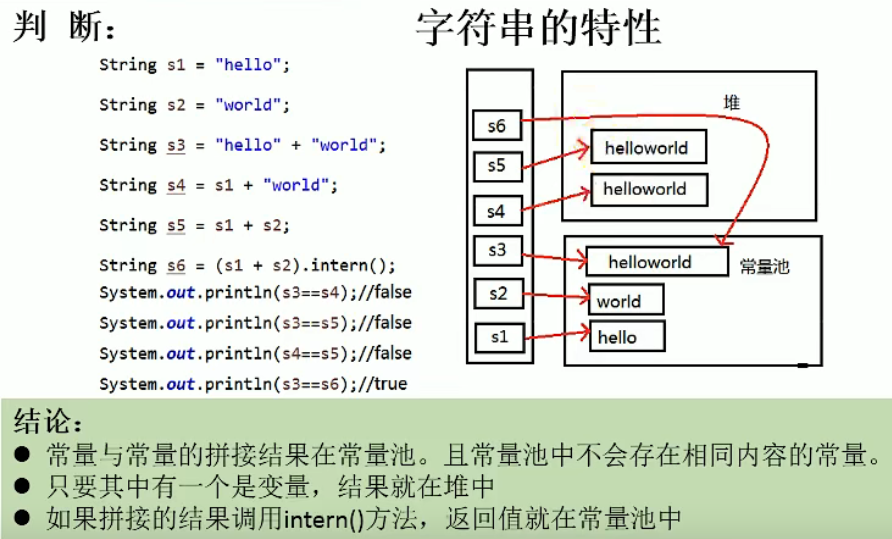
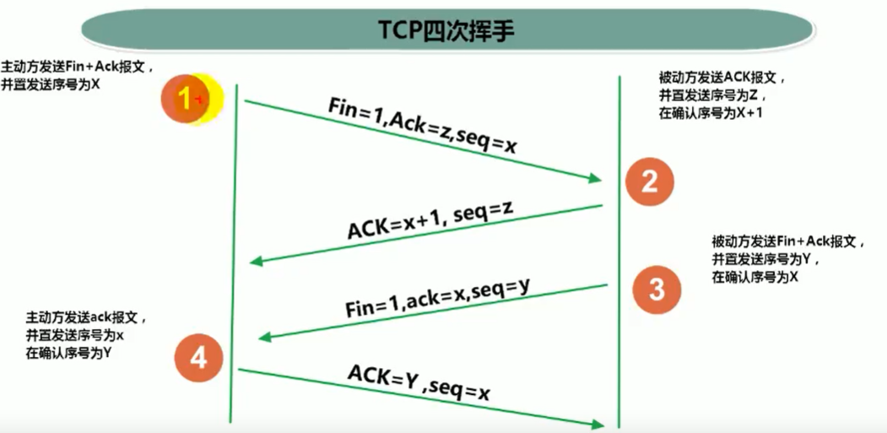
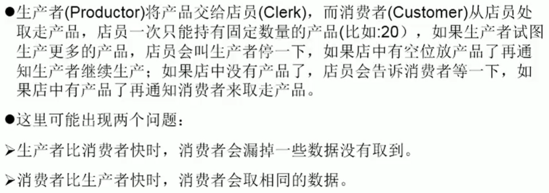
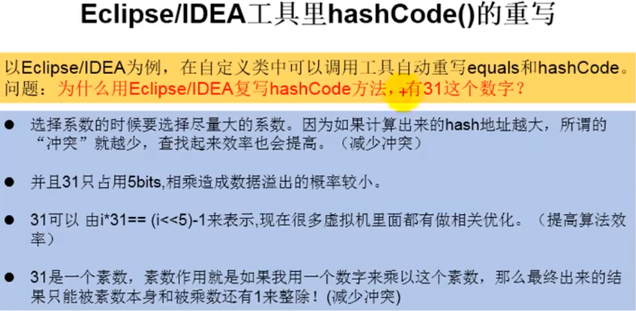

# 1. Java基础

## 1.1 语言基础

### 1.1.1 面向对象 OO（Object Oriented）

#### 1.1.1.1  面向对象与面向过程的比较

* 面向过程：强调的是功能行为，以函数为最小单位，考虑怎么做
* 面向对象：强调具备了功能的对象，以类/对象为最小单位，考虑谁来做。

比如“把大象装进冰箱”这个例子。。。。。。

#### 1.1.1.2 对象的创建和使用

* 堆（Heap）：此内存区域的唯一目的就是**存放对象实例**，几乎所有的对象实例都在这里分配内存。Java虚拟机的描述是：所有对象实例以及数组都要在堆上分配。

* 栈（VM Stack）：是指虚拟机栈，虚拟机栈用于存储局部变量等。局部变量表存放了编译器可知长度的各种基本数据类型（boolean、byte、char、short、int、float、long、double）、对象引用（reference类型，它不等同于对象本身，是对象在对内存的首地址）。方法执行完，自动释放。
* 方法区（Method Area）：用于存储已被虚拟机加载的类信息、常量、静态变量、即时编译器编译后的代码等数据


#### 1.1.1.3 面向对象的三大特征

**类**：具有相同属性和方法的对象的集合，它为属于该类的所有对象提供了统一的抽象描述，其内部包括属性和方法两个主要部分。

**对象**：是类的实体，每个对象都有状态（属性）与行为（方法）。

**面向对象**：

* 面向对象的基本特性：继承、封装和多态。

  1）继承：子类对象拥有父类全部属性和方法。

  1. 单继承：一个父类可以有多个子类，但是一个子类只能有一个父类。（但支持多重继承）
  2. java.lang.Object是Java标准根类，任何一个类，如没有明确指定从其它类中继承，默认都是继承Object。（直接或间接）
  3. 子类无法访问父类中private或default方法和成员变量
  4. 子类可以重写父类的方法（非final方法）
  5. 向上转型：通过子类实例化父类，例如：

  ```java
  public A {
      public String s = "A";
      public void test() {}
      public void func() {
          System.out.println("Afunc");
      }
  }
  public B extends A{
      public String s = "B";
      public void test() {}
      public void func() {
          System.out.println("Bfunc");
          this.test(); //子类的test()
          super.test(); //父类的test()
      }
  }
  A a = new B(); // 向上转型
  a.func(); //输出Bfunc，向上转型访问子类的方法-----虚拟方法调用
  a.s; // A 向上转型访问父类的属性
  ```

  ​	6. 构造器：子类不继承构造器，但是如果父类构造器有参数，子类必须用super(params)显式调用父类构造器。

  2）封装：封装就是把普通的对象进行封装，对象的属性设为私有的，对外提供get和set方法，其他类只能通过get和set对对象属性值进行操作。

  3）多态：多态是建立在继承的基础上的，一个父类对象可以产生多个不同的子类对象，根据这些子类对象的不同可以具备不同的方法，也就是说表现出了不同的形态即多态。换句话说就是子类继承父类方法并重写，重写的方法必须和父类的方法返值相同，方法名相同，参数列表相同。

  ```java
  Parent p = new Child();
  ```

  使用多态方式调用方法时，首先检查基类（父类）中是否有该方法，如果没有，编译出错；如果有再去调用派生类（子类）的同名方法。（编译看左边，运行看右边）

  **注意**：重载是发生在同一个类中的，方法名相同，参数不同，所以跟多态没有半毛钱关系！！！

#### 关键字

* static：静态变量或方法。即使没有创建对象，也能调用这个变量或方法。(原话来自Thinking in Java)
  如果一个类中声明了静态变量，则该静态变量的存储空间不会随着对象创建而改变，即：N个对象共享这个静态变量。

  ```java
  public StaticClass {
      static int i = 1;
      static Integer I = 2;
  }
  StaticClass s1 = new StaticClass();
  StaticClass s2 = new StaticClass();
  //s1.i 和s2.i指向统一存储空间、s1.I和s2.I指向统一存储空间，因此st1.i = st2.i = 1,st1.I = st2.I = 2。
  
  ListNode.i++;
  System.out.println(node1.i); //输出2
  System.out.println(node2.i); //输出2
  node1.i++;
  System.out.println(node1.i); //输出3
  System.out.println(node2.i); //输出3
  
  ```

* final：

  final变量：使用final关键字定义的变量不可以改变，通常由final定义的变量为**编译时常量**。在java中定义全局不可修改的变量使用```public static final```修饰。

  final方法：不可被重写。防止子类修改父类方法定义和实现方式，同时定义为final的方法执行效率要高于非final方法。类中private方法隐式指定为final方法。

  final类：不可被继承。

  **final修饰的变量与方法是否线程安全？**

* this：（来自Thinking In Java）this关键字只能在方法内部使用，表示对“调用方法的那个对象”的引用。但是注意，在方法中调用同一个类中的方法没有必要使用this，例如：

  ```java
  public Test {
      void f1() {}
      void f2() {f1();}
  }
  ```

  何时使用this？在需要返回当前对象的引用时，例如：

  ```java
  public Test {
      int i = 0;
      Test fun() {
          i ++;
          return this;
      }
  }
  ```

* synchronized：解决并发问题常用解决方案（这里只做最初步的认识，JVM模块和多线程再详细学习）

  1）修饰代码块，即同步语句块，其作用的范围是大括号{}括起来的代码，作用的对象是调用这个代码块的对象。

  2）修饰普通方法，即同步方法，其作用的范围是整个方法，作用的对象是调用这个方法的对象。

  3）修饰静态方法，其作用的范围是整个静态方法，作用的对象是这个类的所有对象。

* abstract：修饰抽象方法，没有方法体。

* const、goto作为保留字，但是目前的java版本中没有用到。


### 1.1.2 字符串处理

#### 1.1.2.1 字符串String的特性

String:字符串，使用一对""引起来表示

1. String声明为final的，不可被继承
2. String实现了Serializable接口：表示字符串是支持序列化的。
   实现了Comparable接口：表示String可以比较大小
3. String内部定义了final char[] value用于存储字符串数据
4. String：代表不可变的字符序列，简称：不可变性
   体现：
   1. 当对字符串重新赋值时，需要重新指定内存区域赋值，不能使用原有的value进行复制；
   2. 当对现有的字符串进行连接操作是，也需要指定内存区域赋值，不能使用原有的value进行赋值
   3. 当调用String的replace()方法修改指定字符或字符串时，也需要重新指定内存区域赋值，
5. 通过字面量的方式（区别于new）一个字符串赋值，此时的字符串值声明在字符串常量池中
6. 字符串常量池中不会出现相同的内容


```java
public void test1() {
    String s1 = "abc";
    String s2 = "abc";
    System.out.println(s1 == s2); //true
    s1 = "hello";
    System.out.println(s1 == s2); //false
    String s3 = "abc";
    s3 += "def";
    System.out.println(s3); // abcdef
    System.out.println(s2); // abc
    String s4 = "abc";
    String s5 = s4.replace('a', 'm');
    System.out.println(s4); // abc
    System.out.println(s5); // mbc
}
```

#### 1.1.2.2 String的实例化方式

方式一：通过字面量定义的方式

```java
// 此时s1和s2的数据abc声明在方法区中的字符串常量池中。
String s1 = "abc";
String s2 = "abc";
```

方式二：通过new + 构造器的方式

```java
// 此时的s3和s4保存的地址值，是数据在堆空间中开辟空间以后对应的地址值 
String s3 = new String("abc");
String s4 = new String("abc");
```


结论：

1. 常量与常量的拼接结果在常量池。且常量池中不会存在相同内容的常量。
2. 只要其中有一个是变量，结果就在堆中

```java
public void test2() {
    String s1 = "abc";
    String s2 = "def";
    String s3 = "abcdef";
    String s4 = "abc" + "def";
    String s5 = s1 + "def";
    String s6 = "abc" + s2;
    String s7 = s1 + s2;
    System.out.println(s3 == s4); // true
    System.out.println(s3 == s5); // false
    System.out.println(s3 == s6); // false
    System.out.println(s3 == s7); // false
    System.out.println(s5 == s6); // false
    System.out.println(s5 == s7); // false
    System.out.println(s6 == s7); // false
}
```



#### 1.1.2.3 StringBuffer 和 StringBuilder

1. String、StringBuffer、StringBuilder三者的异同？

String：不可变的字符序列；底层使用char[]存储

StringBuffer：可变的字符序列；线程安全的，效率低；底层使用char[]存储

StringBuilder：可变的字符序列；jdk5.0新增的，线程不安全的，效率高；底层使用char[]存储

源码分析：

```java
String str =  new String(); //new char[0];
String str = new String("abc"); // char[] value = new char[]{'a','b','c'}

StringBuffer sb = new StringBuffer(); // char[] value = new char[16];
sb.append('a'); value[0] = 'a';
sb.append('b'); value[0] = 'b';
StringBuffer sb1 = new StringBuffer("abc"); // char[] value = new char["abc".length() + 16];

```

问题一：System.out.println(sb1.length()); // 3

问题二：扩容问题：如果要填记得数据底层数组装不下了，那就需要扩容底层数组。默认情况下，扩容为原来的2倍+2，同时将原来数组中的元素复制到新的数组中。

指导意义：开发中建议使用StringBuffer(int capacity) 或者 StringBuilder(int capacity)

效率：StringBuilder > StringBuffer > String


#### 面试题

##### 1. String s = new String("abc");方式创建对象，在内存中创建了几个对象？

两个：一个是堆空间中new结构，另一个是char[]对应的常量池中的数据：”abc“

##### 2. 程序题

```java
class StringTest1 {
    String str = new String("good");
    char[] ch = {'t', 'e', 's', 't'};
    public void change(String str, char[] ch) {
        str = "test ok";
        ch[0] = 'b';
    }
}
public void test3() {
    StringTest1 stringTest1 = new StringTest1();
    stringTest1.change(stringTest1.str, stringTest1.ch);
    System.out.println(stringTest1.str); // good
    System.out.println(stringTest1.ch);  // best
}
```


### 1.1.4 I/O流


#### 1.1.4.1 IO流原理及分类

流（`Stream`），是一个抽象的概念，是指一连串的数据（字符或字节），是以先进先出的方式发送信息的通道。

一、IO是Input/Output的缩写，用于处理设备之间的数据传输。如读写文件、网络通讯等。

* 输入input：读取外部数据（磁盘、光盘等存储设备的数据）到程序（内存）中。
* 输出output：将程序（内存）数据输出到磁盘、光盘等存储设备中。

二、流的分类

* 按数据单位分：字节流（8bit），字符流（16bit）

* 按数据流的流向分：输入流，输出流。

* 按流的角色不同分：节点流，处理流。

  节点流：可以从一个地方（节点）读数据或者可以向一个地方（地方）写数据的流，直接作用在数据源上。（文件节点流）

  处理流：是对一个已存在的流的连接或者封装，通过所封装的流的功能调用实现数据读写，如BufferReader。处理流的构造方法总是要带一个其他的流对象作为参数，一个流对象经过其他流的多次封装，称为流的连接。

三、流的体系结构

|   抽象基类   |     节点流      | 缓冲流（处理流的一种） |
| :----------: | :-------------: | :--------------------: |
| InputStream  | FileInputStream |   BufferInputStream    |
| OutputStream | FileInputStream |   BufferOuputStream    |
|    Reader    |   FileReader    |      BufferReader      |
|    Writer    |   FileWriter    |      BufferWriter      |


#### 1.1.3.2 各种流的使用

**使用流操作文件的步骤**：

1. 实例化File类对象，指明要操作的文件；
2. 提供具体流（通道）
3. 数据读入（写出）
4. 流的关闭

##### 1.1.3.2.1 字符流操作（Writer/Reader)

1. 读取文件的例子：

```java

    /**
     * 使用FileReader 的 read()方法。
     * 将txt文件的内容读入内存
     */
    public static void fileReaderWriterTest() throws IOException {
        FileReader fileReader = null;
        try {
            // File file = new File("test.txt");  // 相对于工程目录，根目录下如果没有会报错
            // 1.实例化File类对象，指明要操作的文件
            File file = new File("F:\\projects\\java-demo\\src\\Study\\test.txt");
            //2.提供具体流（字符流）（通道）
            fileReader = new FileReader(file);
            // 3.数据读入
            // read(): 返回读入的一个字符，如果达到文件末尾返回-1
            int data;
            StringBuilder stringBuilder = new StringBuilder();
            while ((data = fileReader.read()) != -1) {
                stringBuilder.append((char) data);
            }
            System.out.println(stringBuilder);
        } catch (IOException e) {
            e.printStackTrace();
        } finally {  //把close放在finally里面防止中途出现异常导致关闭流无法执行
            // 4.流的关闭 
            try {
                if(fileReader != null) {
                	fileReader.close();
                }
            } catch (IOException e) {
                e.printStackTrace();
            }
        }
    }
    /**
     * 对read()操作升级：使用read()的重载方法。
     */
    public static void fileReaderTest1() {
        // 1、实例化File对象
        FileReader fileReader = null;
        try {
            File file = new File("F:\\projects\\java-demo\\src\\Study\\test.txt");
            // 2、FileReader流的实例化
            fileReader = new FileReader(file);
            // 3、读入操作
            char[] chars = new char[5];
            int length;
            StringBuilder stringBuilder = new StringBuilder();
            while ((length = fileReader.read(chars)) != -1) {
                // stringBuilder.append(chars); //不能直接连接，因为如果某次length<5, 那么大于length的部分会是上一次读取的字符
                // 正确写法一
//                for (int i = 0; i < length; i++) {
//                    stringBuilder.append(chars[i]);
//                }
                // 正确写法二
                String str = new String(chars, 0, length);
                stringBuilder.append(str);
            }
            System.out.println(stringBuilder);
        } catch (IOException e) {
            e.printStackTrace();
        } finally {
            try {
                // 4、关闭流
                fileReader.close();
            } catch (IOException e) {
                e.printStackTrace();
            }
        }
    }
```

2. 写文件的例子

```java
    /**
     * 使用FileWriter把内存中的数据写入文件
     * 说明：
     * 1.输出操作，对应的文件可以不存在，
     *      如果不存在会自动创建，
     *      如果存在：FileWriter(file, false)覆盖原文件
     *              FileWriter(file, true) 追加
     */
    public static void fileWriterTest() {
        FileWriter fileWriter = null;
        try {
            // 1、实例化File对象
            File file = new File("F:\\projects\\java-demo\\src\\Study\\test.txt");
            // 2、提供流（实例化FileWriter对像）
            fileWriter = new FileWriter(file, true);
            // 3、写出的操作
            fileWriter.write("hello world!");
        } catch (IOException e) {
            e.printStackTrace();
        } finally {
            // 4、流资源的关闭
            try {
                fileWriter.close();
            } catch (IOException e) {
                e.printStackTrace();
            }
        }
    }
```

##### 1.1.3.2.2 字节流操作(FileInputStream/FileOutputStream)

不能使用使用字符流读取图片、视频等非文本二进制文件，使用字符流复制非文本二进制文件，文件会变大。

**问题：为什么不能使用字符流读取非文本二进制文件，文件又为什么会变大？**

对于这个问题先复习一下操作系统相关知识：

字节（byte[baɪt]）是存储数据的基本单位，位（bit[bɪt]）是存储数据的最小单位，1byte=8bit。计算机中整型数据都是以补码来存储的，正数的补码=原码，复数的补码=（除符号位外）原码取反+1，一个字节表示的范围是`-128~127`，在以字节形式存储的非文本二进制文件中，某个字节很有可能是一个负数，然而字符型变量以char类型表示，表示的范围是0~65535，使用FileReader读取字符就会将复数编程正数，比如将字节{-1}写入文件，使用read()的返回值65533，65533这个数使用一个字节根本存不下，所以使用FileReader读出来再用FileWriter写入文件，文件会变大。（解释的不够详细，需要详细了解系统编码）

对unicode的理解：unicode只是定义了一个庞大的、全球通用的**字符集**，从0开始对每个字符进行十进制唯一编号，十进制转换成16进制就是我们常说的码点，所有文字都用两个字节来表示（2^16)，至于如何存储，存储成什么样的字节流，取决于字符编码方案，推荐的unicode编码是UTF-8（变长1-4字节）和UTF-16。

这样来看的话，也算是能理解为什么java中Reader.read()方法返回的是个int而不是char，java中int类型占用4个字节（32bit），已经足够覆盖Unicode编码范围。

还需要了解文本文件和非文本文件是如何存储的。 

输入流读取文本文件会有什么后果？看下面的这个例子：

```java
/**
* 对于这种按字节读取，如果读一个字节存不下的字符，就可能出现乱码
* GBK编码一个汉字占2个字节，utf-8通常占三个字节，扩展B区以后的汉字占4个字节
* 比如文本文件中的内容是Hello 中国人，每五个字节一读，第一次读“Hello",第二次读” 中“加国字的第一个字节，第三次读国字的后两个字节以及人的三个字节，
* 这样读出来的数据国字将会乱码。输出是：Hello 中���人
*/
public static void testFileInputStream() {
    FileInputStream in = null;
    try {
        // 1、实例化File
        File file = new File("F:\\projects\\java-demo\\src\\Study\\test.txt");
        // 2、提供流
        in = new FileInputStream(file);
        // 3、读数据
        byte[] buffer = new byte[5];
        int len;
        StringBuilder stringBuilder = new StringBuilder();
        while ((len = in.read(buffer)) != -1) { //read如果没有参数默认返回一个字节的数据
            String str = new String(buffer, 0, len);
            stringBuilder.append(str);
        }
        System.out.println(stringBuilder);
    } catch (IOException e) {
        e.printStackTrace();
    } finally {
        // 4、关闭流
        try {
            if (in != null) {
                in.close();
            }
        } catch (IOException e) {
            e.printStackTrace();
        }
    }
}
```

使用字节流操作非文本二进制文件，例子：

```java

/**
* 复制图片
*/
public static void testFileIntputOutputStream() {
    FileInputStream fis = null;
    FileOutputStream fos = null; // 如果不存在，则创建；如果存在，则覆盖
    try {
        // 1、创建File对象
        File srcFile = new File("F:\\projects\\java-demo\\src\\Study\\iostream2xx.png");
        File desFile = new File("F:\\projects\\java-demo\\src\\Study\\iostreamnew.png");
        // 2、创建流
        if (!srcFile.exists()) return;
        fis = new FileInputStream(srcFile);
        fos = new FileOutputStream(desFile, false);
        // 3、读数据
        byte[] buffer = new byte[1024];
        int len;
        while ((len = fis.read(buffer)) != -1) {
            fos.write(buffer, 0, len);
        }
    } catch (IOException e) {
        e.printStackTrace();
    } finally {
        try {
            // 4、关闭流
            if (fis != null) {
                fis.close();
            }
            if (fos != null) {
                fos.close();
            }
        } catch (IOException e) {
            e.printStackTrace();
        }
    }
}
```

值得一说的是，对于复制或转储文件，使用字节流也是没有问题的，字节流只充当搬运通道的功能。

##### 1.1.3.2.3 缓冲流的使用（处理流）

1. 缓冲流：BufferedInputStream \ BufferedOutputStream \ BufferedReader \ BufferedWriter
2. 作用：提高流的读取、写入的速度。
   提速原理是什么？答：通过缓冲输入的方式提高读写效率，在BufferedInputStream中定义了DEFAULT_BUFFER_SIZE=8192这个常量，在BufferedReader中定义了这样一个常量，这个常量代表内部缓冲区的大小为8192byte，在创建buffer对象的时候，内存中会创建一个buf[8192]的byte数组（BufferReader中是char[]cb），使用buffer读取数据的时候，会先将数据写入buf这个数组中，输出的时候，并非读一次写一次，而是积累到缓冲数组满了之后一次性通过buf数组输出。每次输出之后都会有一次flush()操作，来刷新缓冲区。

字符缓冲流的使用：

```java
/**
* BufferedReader 和 BufferedWriter
*/
public static void testBuffered() {
    FileReader fileReader = null;
    FileWriter fileWriter = null;
    BufferedReader bufferedReader = null;
    BufferedWriter bufferedWriter = null;
    try {
        // 1、实例化File对象
        File srcFile = new File("F:\\projects\\java-demo\\src\\Study\\test.txt");
        File desFile = new File("F:\\projects\\java-demo\\src\\Study\\test1.txt");
        // 2、创建节点流（字符流）
        fileReader = new FileReader(srcFile);
        fileWriter = new FileWriter(desFile);
        // 3、创建处理流（缓冲字符流）
        bufferedReader = new BufferedReader(fileReader);
        bufferedWriter = new BufferedWriter(fileWriter);
        // 4、读数据，写数据（文本文件使用char）
        char[] buffer = new char[1024];
        int len;
        while ((len = bufferedReader.read(buffer)) != -1) {
            bufferedWriter.write(buffer, 0, len);
        }
    } catch (IOException e) {
        e.printStackTrace();
    } finally {
        try {
            //关闭流：先关外层，再关内层
            bufferedReader.close();
            bufferedWriter.close();
            fileReader.close();
            fileWriter.close();
        } catch (IOException e) {
            e.printStackTrace();
        }
    }
}
```

字节缓冲流的使用：

```java
/**
* BufferedInputStream 和 BufferedOutputStream
*/
public static void testBufferedStream() {
    FileInputStream fis = null;
    FileOutputStream fos = null;
    BufferedInputStream bfis = null;
    BufferedOutputStream bfos = null;
    try {
        // 1、实例化File对象
        File srcFile = new File("F:\\projects\\java-demo\\src\\Study\\iostreamnew.png");
        File desFile = new File("F:\\projects\\java-demo\\src\\Study\\iostreamnew1.png");
        // 2、创建节点流（字节流）
        fis = new FileInputStream(srcFile);
        fos = new FileOutputStream(desFile);
        // 3、创建处理流（缓冲字节流）
        bfis = new BufferedInputStream(fis);
        bfos = new BufferedOutputStream(fos);
        // 4、读数据，写数据（非文本文件使用byte）
        byte[] buffer = new byte[1024];
        int len;
        while ((len = bfis.read(buffer)) != -1) {
            bfos.write(buffer, 0, len);
        }
    } catch (IOException e) {
        e.printStackTrace();
    } finally {
        try {
            //关闭流：先关外层，再关内层
            bfis.close();
            bfos.close();
            //说明：关闭外层流的同时，内层流也会自动进行关闭，内层流的关闭可以省略。
            fis.close();
            fos.close();
        } catch (IOException e) {
            e.printStackTrace();
        }
    }
}
```

文件加密、解密

```java
/**
* 加密
*/
public static void fileEncrypt() {
    FileInputStream fis = null;
    FileOutputStream fos = null;
    BufferedInputStream bfis = null;
    BufferedOutputStream bfos = null;
    try {
        // 1、实例化File对象
        File srcFile = new File("F:\\projects\\java-demo\\src\\Study\\iostreamnew.png");
        File desFile = new File("F:\\projects\\java-demo\\src\\Study\\iostreamnew1.png");
        // 2、创建节点流（字符流）
        fis = new FileInputStream(srcFile);
        fos = new FileOutputStream(desFile);
        // 3、创建处理流（缓冲字符流）
        bfis = new BufferedInputStream(fis);
        bfos = new BufferedOutputStream(fos);
        // 4、读数据，写数据（非文本文件使用byte）
        byte[] buffer = new byte[1024];
        int len;
        while ((len = bfis.read(buffer)) != -1) {
            // 加密操作：改变字节数组中每个字节的数据
            for (int i = 0; i < len; i++) {
                buffer[i] = (byte) (buffer[i] ^ 5);
            }
            bfos.write(buffer, 0, len);
        }
    } catch (IOException e) {
        e.printStackTrace();
    } finally {
        try {
            //关闭流：先关外层，再关内层
            bfis.close();
            bfos.close();
            fis.close();
            fos.close();
        } catch (IOException e) {
            e.printStackTrace();
        }
    }
}

/**
* 解密
*/
public static void fileDecrypt() {
    FileInputStream fis = null;
    FileOutputStream fos = null;
    BufferedInputStream bfis = null;
    BufferedOutputStream bfos = null;
    try {
        // 1、实例化File对象
        File srcFile = new File("F:\\projects\\java-demo\\src\\Study\\iostreamnew1.png");
        File desFile = new File("F:\\projects\\java-demo\\src\\Study\\iostreamnew2.png");
        // 2、创建节点流（字符流）
        fis = new FileInputStream(srcFile);
        fos = new FileOutputStream(desFile);
        // 3、创建处理流（缓冲字符流）
        bfis = new BufferedInputStream(fis);
        bfos = new BufferedOutputStream(fos);
        // 4、读数据，写数据（非文本文件使用byte）
        byte[] buffer = new byte[1024];
        int len;
        while ((len = bfis.read(buffer)) != -1) {
            // 解密操作：如何加密即如何解密，两个数相同异或为0，任何一个数与0异或都得它本身
            for (int i = 0; i < len; i++) {
                buffer[i] = (byte) (buffer[i] ^ 5);
            }
            bfos.write(buffer, 0, len);
        }
    } catch (IOException e) {
        e.printStackTrace();
    } finally {
        try {
            //关闭流：先关外层，再关内层
            bfis.close();
            bfos.close();
            fis.close();
            fos.close();
        } catch (IOException e) {
            e.printStackTrace();
        }
    }
}
```

##### 1.1.3.2.4 转换流（字符流、处理流）

项目中一般在读取文本文件内容的时候会用到，转换流其实就是解码与编码的过程，

1. 转换流：属于字符流

   InputStreamReader：将一个字节的输入流转换为字符的输入流（解码）

   OutputStreamWriter：将一个字符的输出流转换为字节的输出流（编码）

   方便记：内存中为字符

2. 作用：提供字节流与字符流之间的转换

3. 解码：字节、字节数组 --->字符数组、字符串

   编码：字符数组、字符串 ----> 字节、字节数组

4. 字符集：utf-8，或gbk

InputStreamReader使用的例子：

```java

/**
* InputStreamReader使用，实现字节输入流到字符输入流的转换
*/
public static void testInputStreamReader() {
    InputStreamReader isr = null;
    try {
        FileInputStream fis = new FileInputStream("F:\\projects\\java-demo\\src\\Study\\test.txt");
        //残数2指明了字符集，具体根据文件保存时使用的字符集
        isr = new InputStreamReader(fis, "UTF-8");
        char[] cb = new char[1024];
        int len;
        StringBuilder stringBuilder = new StringBuilder();
        while ((len = isr.read(cb)) != -1) {
            String str = new String(cb, 0, len);
            stringBuilder.append(str);
        }
        System.out.println(stringBuilder);
    } catch (IOException e) {
        e.printStackTrace();
    } finally {
        try {
            isr.close();
        } catch (IOException e) {
            e.printStackTrace();
        }
    }
}
```

OutputStreamWriter：

```java
/**
* 综合使用InputStreamReader和OutputStreamWriter，
* 实现文本文件格式转换,输入utf-8，输出gbk
*/
public static void testStreamReaderWriter() {
    InputStreamReader isr = null;
    OutputStreamWriter osr = null;
    try {
        FileInputStream fis = new FileInputStream("F:\\projects\\java-demo\\src\\Study\\test.txt");
        FileOutputStream fos = new FileOutputStream("F:\\projects\\java-demo\\src\\Study\\testgbk.txt");
        //残数2指明了字符集，具体根据文件保存时使用的字符集
        isr = new InputStreamReader(fis, StandardCharsets.UTF_8);
        osr = new OutputStreamWriter(fos, "GBK");
        char[] cb = new char[1024];
        int len;
        StringBuilder stringBuilder = new StringBuilder();
        while ((len = isr.read(cb)) != -1) {
            osr.write(cb, 0, len);
        }
    } catch (IOException e) {
        e.printStackTrace();
    } finally {
        try {
            isr.close();
            osr.close();
        } catch (IOException e) {
            e.printStackTrace();
        }
    }
}
```

##### 1.1.3.2.5 标准输入、输出流

1. Scanner

输入字符串

```java
Scanner scanner = new Scanner(System.in);
while (scanner.hasNextLine()) {
    String str = scanner.nextLine().toUpperCase(Locale.ROOT);
    System.out.println(str);
}
```

**next() 与 nextLine() 区别**

next():

- 一定要读取到有效字符后才可以结束输入。
- 对输入有效字符之前遇到的空白，next() 方法会自动将其去掉。
- 只有输入有效字符后才将其后面输入的空白作为分隔符或者结束符。
- next()不能得到带有空格的字符串。

nextLine()：

- 以Enter为结束符,也就是说 nextLine()方法返回的是输入回车之前的所有字符。
- 可以获得空白。

输入多个数字：

```java
Scanner scan = new Scanner(System.in);
int[] arr = new int[5];
int index = 0;
while (scan.hasNextInt() && index < 5) {
    arr[index] = scan.nextInt();
}
System.out.println(arr);
```

2. 标准输入输出操作

```java
/**
     * 1、标准输入\输出流
     *     1.System.in：标准输入流，类型是InputStream，默认从键盘输入，
     *     2.System.out：标准输出流,类型是PrintStream，默认从控制台输出
     * 2、System类的setIn(InputStream is) / setOut(PrintStream ps) 方式重新指定输入和输出的流
     * 3、练习：从键盘输入字符串，要求将读取到的整行字符串转换成大写输出，然后继续进行输入操作，
     * 直到输入”e“或者”exit“时退出程序
     */
public static void systemInOut() {
    //方法一：使用Scanner实现，调用next()返回一个字符串。
    Scanner scanner = new Scanner(System.in);
    while (scanner.hasNextLine()) {
        String str = scanner.nextLine();
        if (str.equals("e") || str.equals("exit")) {
            break;
        }
        System.out.println(str.toUpperCase());
    }
    //方法二：使用System.in实现,System.in的类型是InputStream，我们可以使用转换流将字节流转换成字符流
    InputStreamReader isr = null;
    BufferedReader bufferedReader = null;
    try {
        isr = new InputStreamReader(System.in);
        bufferedReader = new BufferedReader(isr);
        String lineStr;
        while ((lineStr = bufferedReader.readLine()) != null) {
            if ("e".equals(lineStr) || "exit".equals(lineStr)) {
                break;
            }
            System.out.println(lineStr.toUpperCase());
        }
    } catch (IOException e) {
        e.printStackTrace();
    } finally {
        try {
            bufferedReader.close();
            isr.close();
        } catch (IOException e) {
            e.printStackTrace();
        }

    }
}
```

##### 1.1.3.2.6 打印流

```java
public static void main(String arg[]) throws Exception{
    PrintStream ps = null ;        // 声明打印流对象
    // 如果现在是使用FileOuputStream实例化，意味着所有的输出是向文件之中
    ps = new PrintStream(new FileOutputStream(new File("d:" + File.separator + "test.txt"))) ;
    ps.print("hello ") ;
    ps.println("world!!!") ;
    ps.print("1 + 1 = " + 2) ;
    ps.close() ;
}
```

##### 1.1.3.2.7 数据流

数据流是缓冲流的包装类，缓冲流又是FileInputstream的包装类，此类里面有各种写入字符串、基本数据类型数据的方法

```java
public static void main(String[] args) throws IOException {
    DataOutputStream ds=new DataOutputStream(new FileOutputStream("F:/tss1.txt"));
    ds.writeInt(34);
    ds.writeDouble(12.3);
    ds.writeChars("张三");
    ds.close();
    DataInputStream dis=new DataInputStream(new FileInputStream("F:/tss1.txt"));
    System.out.println(dis.readInt());
    System.out.println(dis.readDouble());
    System.out.println((dis.readChar())+""+dis.readChar());
}
```

##### 1.1.3.2.8 对象流(处理流-序列化和反序列化)

ObjectInputStream和ObjectOutputStream：用于存储和读取基本数据类型数据或对象的处理流。它的强大之处在于可以把Java中的对象写入到数据源中，也能把对象从数据源中还原回来。

* 序列化：用ObjectInputStream类**保存**基本数据类型或对象的机制
* 反序列化：用ObjectOutputStream类读取基本数据类型或对象的机制
* 对象流不能序列化**static**和**transient**修饰的成员变量

**对象的序列化**(借着对象流浅浅了解一波)：

* 对象的序列化机制允许把内存中的Java对象转换成平台无关的二进制流，从而允许把这种二进制流持久地保存在磁盘上，或通过网络将这种二进制流传输到另一个网络节点。当其他程序获取了这种二进制流就可以恢复成原来的Java对象。

* 序列化的好处在于可以将任何实现了Serializable接口的对象转化成字节数据，使其在保存和传输时可以被还原。

* 序列化是RMI（Remote Method Invoke -远程方法调用）过程的参数和返回值都必须实现的机制，而RMI是JavaEE的基础。因此序列化机制是JavaEE平台的基础。

* 如果需要让某个对象支持序列化机制，则必须让对象所属的类及其属性是可序列化的，为了让某个类是可序列化的，该类必须实现如下两个接口之一，否则会抛出**NotSerializableException**异常

  -> **Serializable**

  -> **Externalizable**

对象流操作：序列化、反序列化以及让类支持序列化

* 凡是实现Serializable接口的类都有一个表示序列化版本标识符的静态变量：
  * public static final long serialVersionUID = 13231231L; //值可以任意
  * SerialVersionUID用来表明类的不同版本间的兼容性。简言之，其目的是以序列化对象进行版本控制，有关个版本反序列化时是否兼容。
  * 如果类没有显示定义这个静态变量，它的值时Java运行时环境根据类的内部细节自动生成的（如何生成的？）。若类的实例变量做了修改，serialVersionUID可能发生变化。故建议显示声明。
* 简单来说，Java的序列化机制是通过在运行时判断类的serialVersionUID来验证版本一致性。在进行反序列化时，JVM会把传来的字节流中的SerialVersionUID与本地相应实体类的serialVersionUID进行比较，如果相同就认为是一致的，可以进行反序列化，否则就会出现序列化版本不一致的异常。(InvalidCastException)

```java

/**
 * 对象流的使用
 */
public class ObjectInputOutputStream {
    /**
     * ObjectOutputStream 对象输出流的使用
     * 序列化过程：将内存中的Java对象保存到磁盘中或通过网络传输出去
     */
    @Test
    public void testObjectOutputStream() {
        ObjectOutputStream objOs = null;
        try {
            File file = new File("F:\\projects\\java-demo\\src\\Study\\testObjStream");
            FileOutputStream fos = new FileOutputStream(file);
            objOs = new ObjectOutputStream(fos);
            objOs.writeObject(new Person("王明", 23));
            objOs.flush(); //刷新操作
        } catch (IOException e) {
            e.printStackTrace();
        } finally {
            try {
                if (objOs != null) {
                    objOs.close();
                }
            } catch (IOException e) {
                e.printStackTrace();
            }
        }
    }

    /**
     * 反序列化：将磁盘文件中的对象还原为内存中的一个java对象
     * 使用ObjectInputStream来实现
     */
    @Test
    public void testObjectInputStream() {
        ObjectInputStream objIs = null;
        try {
            File file = new File("F:\\projects\\java-demo\\src\\Study\\testObjStream");
            FileInputStream fis = new FileInputStream(file);
            objIs = new ObjectInputStream(fis);
            Person str = (Person) objIs.readObject();
            System.out.println(str);
        } catch (IOException e) {
            e.printStackTrace();
        } catch (ClassNotFoundException e) {
            e.printStackTrace();
        } finally {
            try {
                if (objIs != null) {
                    objIs.close();
                }
            } catch (IOException e) {
                e.printStackTrace();
            }
        }
    }

}
/**
 * Person 需要满足如下要求方可序列化：
 * 1、需要实现接口：Serializable
 * 2、当前类提供一个全局常量：serialVersionUID
 * 3、除了当前Person类需要实现Serializable接口之外，还需必须保证其内部所有属性也必须是可序列化的。（默认情况下基本数据类型及其对象可序列化）
 */
class Person implements Serializable {

    public static final long serialVersionUID = 13231231L;

    private String name;
    private Integer age;

    Person(String name, Integer age) {
        name = name;
        age = age;
    }
}
```

##### 1.1.3.2.9 随机存取文件流（了解）

RandomAccessFile直接继承于java.lang.Object类，实现了DataInput和DataOutput接口，它既可以作为一个输入流，又可以作为一个输出流。

```java
public class RandomAccessFileTest {
    @Test
    public void test1() {
        RandomAccessFile randomAccessFile = null;
        RandomAccessFile randomAccessFile1 = null;
        try {
            // 第二个参数是mode：r(只读、文件已存在),rw（读写）,rwd（读写，同步内容更新）,rws（读写，同步内容和元数据更新
            randomAccessFile = new RandomAccessFile(new File("F:\\projects\\java-demo\\src\\Study\\test.txt"), "r");
            randomAccessFile1 = new RandomAccessFile(new File("F:\\projects\\java-demo\\src\\Study\\test1.txt"), "rw");
            byte[] bytes = new byte[1024];
            int len;
            while ((len = randomAccessFile.read(bytes)) != -1) {
                randomAccessFile1.write(bytes, 0, len); // 对已经存在的内容进行覆盖比如原来的内容abcd，写入的内容是aaa，写入后内容变成aaad
            }
        } catch (IOException e) {
            e.printStackTrace();
        } finally {
            try {
                if (randomAccessFile != null) {
                    randomAccessFile.close();
                }
                if (randomAccessFile1 != null) {
                    randomAccessFile1.close();
                }
            } catch (IOException e) {
                e.printStackTrace();
            }
        }
    }
}
```

##### 1.1.3.2.10 NIO.2中Path、Paths、Files类的使用

* Java NIO（New IO，Non-Blocking IO(无阻塞)）是从Java1.4开始引入的，它与原来的IO有同样的作用和目的，但是使用的方式完全不同，NIO支持面向缓冲区的（IO是面向流的）、基于通道的IO操作，NIO将以更高效的方式进行文件的读写操作。
* JavaAPI中提供了两套NIO，一套是针对标准输入输出NIO，另一套就是网络编程NIO

#### 1.1.3.3 第三方jar包

commons-io-2.5.jar

### 1.1.4 网络编程

#### 1.1.4.1 网络编程概述

1. 网络编程中的两个问题
   * 如何准确定位网络上一台或多台主机；定位主机上特定的应用
   * 找到主机后如何可靠高效的进行数据传输
2. 网络编程两个要素
   * 对应问题一：IP和端口
   * 对应问题二：提供网络铜线协议：TCP/IP参考模型（应用层、传输层、网络层、物理+数据链路层）

#### 1.1.4.2 通信要素一：IP和端口

* IP
  * 唯一标识Internet上的计算机（通信实体）
  * 在java中使用InetAddress
  * IP分类：IPv4 和IPv6、万维网和局域网
  * 域名：
  * 本地回路地址：127.0.0.1对应着 localhost
  * 如何实例化InetAddress:两个方法 ： getByName(String hostname);   getLocalHost();
* 端口
  * 标识正在运行的的进程
  * 16位的整数0~65525
  * 端口分类：
    * 公认端口：0~1023。被预先定义的服务通信占用，如HTTP占用端口80。
    * 注册端口：1024~49151。分配给用户进程或应用程序。如mysql占用端口3306
    * 动态/私有端口：49152~65535
* IP与端口号的组合：套接字Socket

```java
InetAddress baidu = InetAddress.getByName("14.215.177.38");
System.out.println(baidu); // /14.215.177.38
InetAddress inetAddress = InetAddress.getByName("www.baidu.com");
System.out.println(inetAddress); // www.baidu.com/14.215.177.38
InetAddress inetAddress1 = InetAddress.getByName("localhost");
System.out.println(inetAddress1); // localhost/127.0.0.1
InetAddress localHost = InetAddress.getLocalHost();// 获取本机IP
System.out.println(localHost); // DESKTOP-MIM84CO/10.162.34.244
//获取主机域名
System.out.println(localHost.getHostName()); //DESKTOP-MIM84CO
//获取主机地址
System.out.println(localHost.getHostAddress()); //10.162.34.244
```

#### 1.1.4.3 网络通信协议：TCP/IP协议簇

##### 1.1.4.3.1 TCP

* 使用TCP协议前，需要先建立TCP连接，形成传输数据通道
* 传输前，采用”**`三次握手`**“方式，点对点通信，是**可靠**的。
* TCp协议进行通信的两个应用进程：客户端，服务端。
* 在连接中可进行**大数据量的传输**
* 传输完毕，需要**释放已经建立的连接**，**效率低**。

建立连接的**三次握手**：①客户端发送SYN报文，置发送信号为seq=X；②服务端收到SYN报文和发送信号X，服务端发送SYN+ACK报文，并置发送信号为seq=Y，再确认序号为ACK=X+1；③ 客户端收到服务端的确认报文，客户端发送ACK报文，并置发送信号为seq=Z，再确认序号为ACK=Y+1。


释放连接的**四次挥手**：



例题1：实现TCP网络编程

```java
// 实现TCP网络编程
public void client() {
    Socket socket = null;
    OutputStream os = null;
    try {
        // 1. 创建Socket对象，指明服务器端的IP和端口号，
        InetAddress inet = InetAddress.getByName("127.0.0.1");
        socket = new Socket(inet, 8899);
        // 2. 获取一个输出流,用于输出数据
        os = socket.getOutputStream();
        // 3. 写入数据
        os.write("你好server， 我是client".getBytes(StandardCharsets.UTF_8));
    } catch (IOException e) {
        e.printStackTrace();
    } finally {
        try {
            // 关闭socket和流
            os.close();
            socket.close();
        } catch (IOException e) {
            e.printStackTrace();
        }
    }
}
public void server() {
    ServerSocket serverSocket = null;
    Socket socket = null;
    InputStreamReader isr = null;
    try {
        // 1.创建服务器端的ServerSocket,指明自己的端口号
        serverSocket = new ServerSocket(8899);
        // 2. 调用accept()表示接受来自客户端的socket
        socket = serverSocket.accept();
        // 3. 获取输入流
        InputStream is = socket.getInputStream();
        isr = new InputStreamReader(is);
        char[] chars = new char[1024];
        int len;
        StringBuilder stringBuilder = new StringBuilder();
        while ((len = isr.read(chars)) != -1) {
            stringBuilder.append(chars, 0 , len);
        }
        System.out.println(stringBuilder);
    } catch (IOException e) {
        e.printStackTrace();
    } finally {
        try {
            // 资源关闭
            isr.close();
            socket.close();
            serverSocket.close();
        } catch (IOException e) {
            e.printStackTrace();
        }
    }
}
```

例题2：客户端发送文件给服务端，服务端将文件保存在本地，并返回“发送成功”给客户端，关闭连接

```java
public void client1() {
    BufferedOutputStream bos = null;
    BufferedInputStream bis = null;
    Socket socket = null;
    ByteArrayOutputStream baos = null;
    try {
        socket = new Socket(InetAddress.getByName("127.0.0.1"), 2255);
        bos = new BufferedOutputStream(socket.getOutputStream());
        bis = new BufferedInputStream(new FileInputStream("F:\\projects\\java-demo\\src\\Study\\InetTest\\img.png"));
        byte[] buffer = new byte[1024];
        int len;
        while ((len = bis.read(buffer)) != -1) {
            bos.write(buffer, 0, len);
        }
        // 关闭数据输出，告诉服务器端不再发送数据了，否则服务端将一直阻塞在while循环中
        socket.shutdownOutput();
        // 接受来自于服务器端的数据
        InputStream isByServer = socket.getInputStream();
        baos = new ByteArrayOutputStream();
        byte[] buf = new byte[1024];
        int n;
        while ((n = isByServer.read(buf)) != -1) {
            baos.write(buf, 0, n);
        }
        System.out.println(baos);
    } catch (IOException e) {
        e.printStackTrace();
    } finally {
        try {
            bis.close();
            socket.close();
            baos.close();
        } catch (IOException e) {
            e.printStackTrace();
        }
    }
}
public void server1() {
    BufferedInputStream bis = null;
    BufferedOutputStream bos = null;
    Socket socket = null;
    OutputStream os = null;
    try {
        ServerSocket serverSocket = new ServerSocket(2255);
        socket = serverSocket.accept();
        bis = new BufferedInputStream(socket.getInputStream());
        bos = new BufferedOutputStream(new FileOutputStream("F:\\projects\\java-demo\\src\\Study\\InetTest\\img1.png"));
        byte[] bytes = new byte[1024];
        int len;
        while ((len = bis.read(bytes)) != -1) {
            bos.write(bytes, 0, len);
        }
        // 服务器端向客户端返回信息
        os = socket.getOutputStream();
        os.write("发送成功".getBytes(StandardCharsets.UTF_8));
    } catch (IOException e) {
        e.printStackTrace();
    } finally {
        try {
            bos.close();
            bis.close();
            socket.close();
            os.close();
        } catch (IOException e) {
            e.printStackTrace();
        }
    }
}
```


##### 1.1.4.3.2 UDP

* 将数据、源、目的封装成数据包，**不需要建立连接，**
* 每个数据报的大小限制在64K内
* 发送不管对方是否准备好，接收方收到也不确认，故是**不可靠的。**
* 可以广播发送
* 发送数据结束时，**无需释放资源，开销小，速度快**

```java
public void sender() {
    DatagramSocket socket = null;
    try {
        socket = new DatagramSocket();
        String message = "服务端你好，我在发数据";
        InetAddress inet = InetAddress.getByName("localhost");
        DatagramPacket datagramPacket = new DatagramPacket(message.getBytes(), 0, message.getBytes().length, inet, 2255);

        socket.send(datagramPacket);
    } catch (IOException e) {
        e.printStackTrace();
        socket.close();
    } finally {
    }
}
@Test
public void recevicer() {
    DatagramPacket datagramPacket = null;
    DatagramSocket datagramSocket = null;
    try {
        datagramSocket = new DatagramSocket(2255);
        byte[] buf = new byte[1024];
        datagramPacket = new DatagramPacket(buf, 0, buf.length);
        datagramSocket.receive(datagramPacket);
    } catch (IOException e) {
        e.printStackTrace();
    } finally {
        datagramSocket.close();
    }
    System.out.println(new String(datagramPacket.getData(), 0, datagramPacket.getLength()));
}
```

#### 1.1.4.4 URL编程

1. URL：统一资源定位符，对应着互联网的某一资源地址

2. 格式：http://localhost:8080/example/file.jpg?username=tom

   ​			协议    主机名   端口号     资源地址       参数列表


### 1.1.5 多线程

#### 1.1.5.1 基本概念：程序、进程、线程

* 程序（program）：为了完成特定任务、用某种语言编写的一组指令的集合。即一段静态的代码，静态对象。
* 进程（process）：是程序的一次执行过程，或是正在运行的一个程序，是一个动态过程：有它自身的产生、存在和消亡的过程。——生命周期
* 线程（Thread）：进程可以进一步细化为线程，是一个程序内部的一条执行路径


#### 1.1.5.2 线程的创建和使用

##### 1.1.5.2.1 多线程的创建和使用一

**方式一**：继承于Thread类

1. 创建一个继承于Thread类的子类
2. 创建Thread类的run()
3. 创建Thread类的子类对象

例子：遍历

```java
// 1、创建一个继承于Thread类的子类
class MyThread extends Thread {
    // 2、重写Thread类的run()
    @Override
    public void run() {
        for (int i = 0; i < 100; i++) {
            if (i % 2 == 0) {
                System.out.println(i + " : " + Thread.currentThread().getName());
            }
        }
    }
}
public class ThreadTest {
    List<Integer> list = new ArrayList<>();
    @Test
    public void testTread() {
        // 3、创建Thread类的子类对象
        MyThread myThread = new MyThread();
        myThread.start();
        // 问题一：不能通过直接调用run()方法的方式启动线程
        //Thread.run();
        // 问题二：在启动一个线程，遍历100以内的偶数。不能让已经start()的线程去执行，会报java.lang.IllegalThreadStateException异常
        // myThread.start();
        //需要重新创建一个线程的对象
        MyThread myThread1 = new MyThread();
        myThread1.start();

        // 创建Thread类的匿名子类的方式
        new Thread(() -> {
            for (int i = 0; i < 100; i++) {
                if (i % 2 == 0) {
                    System.out.println(i + " : " + Thread.currentThread().getName());
                }
            }
        }).start();
    }
}
```

```java
class Thread1 extends Thread {
    @Override
    public void run() {
        for (int i = 0; i < 100; i++) {
            if (i % 2 == 0) {
                System.out.println(i + " : " + Thread.currentThread().getName());
                setPriority(MAX_PRIORITY);
            }
            if (i % 30 == 0) {
                yield();
            }
        }
    }
}
public class ThreadMethodTest {
    /**
     * 1.start()方法：启动当前线程；调用当前线程的run()
     * 2.run()：通常需要重写Thread类中的此方法，将创建的线程要执行的操作声明在此方法中
     * 3.currentThread：静态方法，返回执行当前代码的线程
     * 4.getName()：获取当前线程的名字
     * 5.setName()：设置当前线程的名字
     * 6.yield()：释放当前CPU的执行权
     * 7.join()：在线程A中调用线程B的join方法，此时线程A进入阻塞状态，直到线程B完全执行完以后，线程A才结束阻塞状态
     * 8.stop()：强制线程生命期结束（已过时，不建议使用）
     * 9.sleep(Long millitime)：让当前线程“睡眠”指定的millitime毫秒，在执行的时间内，当前线程处于阻塞状态
     * 10.isAlive()；当前线程是否还存活
     */
    @Test
    public void threadMethodTest() {
        Thread1 thread1 = new Thread1();
        thread1.setName("线程1");
        thread1.start();
        // 给主线程命名
        Thread.currentThread().setName("主线程");
        for (int i = 0; i < 100; i++) {
            if (i % 2 == 0) {
                System.out.println(i + " : " + Thread.currentThread().getName());
                Thread.currentThread().setPriority(1);
            }
            if (i == 55) {
                try {
                    thread1.join();
                } catch (InterruptedException e) {
                    e.printStackTrace();
                }
            }
        }

    }
}
```

**线程调度**

线程的优先级

 `MAX_PRIORITY: 10    	MIN_PRIORITY : 1		NORM_PRIORITY : 5(默认)`

如何获取和设置当前线程的优先级：

`getPriority()：获取线程的优先级
setPriority(int p)：设置线程的优先级`

说明：高优先级的线程要抢占低优先级线程CPU执行权，但是只是从概率上将，高优先级的线程高概率的情况下被执行，并不意味着只有当高优先级的线程执行完以后，低优先级的线程才执行。

##### 1.1.5.2.2 多线程的创建和使用二

例子：创建三个窗口卖票，总票数是100张。

方法一：继承Thread

```java
class Window extends Thread {
    private static int ticket = 100;
    @Override
    public void  run() {
        while (ticket > 0) {
            System.out.println(getName() + ": 买票，票号" + ticket--);
        }
    }
}
public class WindowSaleTest  {
    @Test
    public void saleTicket() {
        Window window1 = new Window();
        Window window2 = new Window();
        Window window3 = new Window();

        window1.start();
        window2.start();
        window3.start();
    }
}
```

方法二：实现Runnable接口

1. 创建一个实现了Runnable接口的类；
2. 重写Thread类的run() ---> 将此线程的操作生命在run()中
3. 创建Thread类的子类对象
4. 通过此对象调用start()

```java
class Window1 implements Runnable {
    private int ticket = 100;  // 不需要加static
    @Override
    public void run() {
        while (ticket > 0) {
            System.out.println(Thread.currentThread().getName() + ": 买票，票号" + ticket--);
        }
    }
}
public void testRunnable() {
    Window1 window = new Window1();
    new Thread(window).start();
    new Thread(window).start();
    new Thread(window).start();
}
```

**两种多线程创建和使用的比较。**开发中优先选择实现Runnable接口方式：

原因：

1. 实现Runnable接口的方式没有类的单继承性的局限性
2. 实现的方式更适合来处理多个线程又共享数据的情况

联系：

1. Thread类也是实现了Runnable接口，两种方式都需要重写run()，将线程执行的逻辑声明在run()中。

#### 1.1.5.3 线程的生命周期


#### 1.1.5.4 线程同步

1. 问题：买票过程中 ，出现了重票、错票 --->出现了线程安全的问题
2. 线程安全原因：当某个线程操作车票的过程中，尚未操作完成时，其他线程参与进来，也操作车票
3. 如何解决：当一个线程a在操作ticket的时候，其他线程不能参与进来。直到线程a操作完ticket时，其他线程才能开始操作ticket。这种情况即使线程a出现了阻塞，也不能被改变。
4. 在Java中，我们通过同步机制，来解决线程安全问题。

方式一：同步代码块

1. 操作共享数据的代码，即为需要被同步的代码
2. 共享数据：多个线程共同操作的数据，比如ticket就是共享数据
3. 同步监视器：俗称，锁。任何一个类的对象，都可以充当锁
   	要求：多个线程必须要共用同一个把锁

```java
// 语法
synchronized(同步监视器) {
    //需要被同步的代码
}
// 实现Runnable方式
class Window1 implements Runnable {
    private int ticket = 100;  // 不需要加static
    final Object object = new Object();
    @Override
    public void run() {
        while (true) {
            synchronized(object) {  // 一般在开发中如果是实现了Runnable接口的方式，更推荐使用synchronized(this)
                if (ticket > 0) {
                    try {
                        Thread.sleep(100);
                    } catch (InterruptedException e) {
                        e.printStackTrace();
                    }
                    System.out.println(Thread.currentThread().getName() + ": 买票，票号" + ticket);
                    ticket -- ;
                }else {
                    break;
                }
            }
        }
    }
}

// 继承方式
class Window extends Thread {
    private static int ticket = 100;
    static Object object = new Object();  //确保object唯一
    @Override
    public void  run() {
        // synchronized(object) { //object 不能换成this
        synchronized(Window.class) {  // Window.class指挥加载一次
            while (ticket > 0) {
                try {
                    sleep(100);
                } catch (InterruptedException e) {
                    e.printStackTrace();
                }
                System.out.println(getName() + ": 买票，票号" + ticket--);
            }
        }
    }
}

```

方式二：同步方法

如果操作共享数据的代码完整的声明在一个方法中，我们不妨将此方法声明同步的。

```java
// 实现Runnable接口的方式
class Window2 implements Runnable {
    private int ticket = 100;  // 不需要加static
    @Override
    public void run() {
        while (ticket > 0) {
            saleTicket();
        }
    }
    //使用同步方法解决实现Runnable接口的线程安全问题
    // 同步监视器就是 this
    synchronized public void saleTicket() {
        try {
            Thread.sleep(100);
        } catch (Exception e) {
            e.printStackTrace();
        }
        if (ticket > 0) {
            System.out.println(Thread.currentThread().getName() + ": 买票，票号" + ticket);
            ticket--;
        }
    }
}
// 继承方式
class Window3 extends Thread {
    private static int ticket = 100;
    @Override
    public void  run() {
        while (ticket > 0) {
            saleTicket();
        }
    }
    // 同步监视器 Window3.class
    synchronized public static void saleTicket() {
        try {
            sleep(100);
        } catch (InterruptedException e) {
            e.printStackTrace();
        }
        System.out.println(Thread.currentThread().getName() + ": 买票，票号" + ticket--);
    }
}
```

关于同步方法的总结：

1. 同步方法仍然涉及同步监视器，只是不需要我们显示的声明。

2. 非静态的同步方法，同步监视器是：this

   静态的同步方法：同步监视器是：当前类本身

使用**同步机制**将单例模式中的懒汉式改写为线程安全的

```java
class Bank{
    private Bank() {}
    private static Bank instance = null;
    public static Bank getInstance() {
        // 方式一；效率稍差
//        synchronized (Bank.class) {
//            if (instance == null) {
//                instance = new Bank();
//            }
//            return instance;
//        }
        // 方式二：效率更高
        if (instance == null) {
            synchronized (Bank.class) {
                if (instance == null) instance = new Bank();
            }
        }
        return instance;
    }
}
```

#### 1.1.5.5 线程的死锁问题

1. 死锁的理解：不同的线程分别占用对方需要的同步资源不放弃，都在等待对方放弃自己需要的同步资源，就形成了线程的死锁
2. 说明：
   * 出现死锁后不会出现异常，不会出现提示，只是所有的线程都处于阻塞状态，无法继续
   * 我们使用同步时，要避免出现死锁

```java
public static void main(String[] args) {
    StringBuffer s1 = new StringBuffer();
    StringBuffer s2 = new StringBuffer();
    new Thread() {
        @Override
        public void run() {
            synchronized (s1) {
                s1.append("a");
                s2.append("1");
                try {
                    sleep(100);  //  
                } catch (InterruptedException e) {
                    e.printStackTrace();
                }
                synchronized (s2) {
                    s1.append("b");
                    s2.append("2");
                    System.out.println(s1);
                    System.out.println(s2);
                }
            }
        }
    }.start();
    new Thread(new Runnable() {
        @Override
        public void run() {
            synchronized (s2) {
                s1.append("c");
                s2.append("3");
                try {
                    sleep(100); //
                } catch (InterruptedException e) {
                    e.printStackTrace();
                }
                synchronized (s1) {
                    s1.append("d");
                    s2.append("4");
                    System.out.println(s1);
                    System.out.println(s2);
                }
            }
        }
    }).start();
}

// 上面的代码中有两处sleep，如果没有sleep出现死锁的概率会很低，加了sleep会增加死锁的概率
```

解决线程安全问题的方式三：Lock锁--- jdk5.0新增

```java
class Window0 implements Runnable {
    private int ticket = 100;  // 不需要加static
    // 1.实例化ReentrantLock，创建lock对象
    private ReentrantLock lock = new ReentrantLock();
    @Override
    public void run() {
        while (true) {
            try {
                // 2. 调用锁定方法lock()
                lock.lock();
                if (ticket > 0) {
                    try {
                        Thread.sleep(100);
                    } catch (Exception e) {
                        e.printStackTrace();
                    }
                    System.out.println(Thread.currentThread().getName() + ": 买票，票号" + ticket);
                    ticket -- ;
                }else {
                    break;
                }
            } finally {
                lock.unlock();
            }
        }
    }
}

public class LockTest {
    public static void main(String[] args) {
        Window0 window = new Window0();
        Thread t1 = new Thread(window);
        Thread t2 = new Thread(window);
        Thread t3 = new Thread(window);
        t1.start();
        t2.start();
        t3.start();
    }
}
```

#### 1.1.5.6 线程通信

线程通信的例子：使用两个线程打印-100，线程1线程2，交替打印

```java
/**
 * 涉及到的三个方法：
 * wait(): 一旦执行此方法，当前线程就进入阻塞状态，并释放同步监视器（锁）
 * notify(): 一旦执行此方法，就会唤醒wait的一个线程，如果有多个线程被wait，就唤醒优先级高的线程
 * notyfyAll(): 唤醒所有被wait的线程
 */
class Number implements Runnable {
    private int number = 1;
    @Override
    public void run() {
        while (true) {
            synchronized (this) {
                notifyAll();  // 唤醒其他所有线程
                try {
                    Thread.sleep(100);
                } catch (InterruptedException e) {
                    e.printStackTrace();
                }
                if (number <= 100) {
                    System.out.println(Thread.currentThread().getName() + ":" + number ++);
                }else {
                    break;
                }
                try {
                    wait(); //使得调用入戏啊wait()方法的线程进入阻塞状态
                } catch (InterruptedException e) {
                    e.printStackTrace();
                }
            }
        }
    }
}
public class Communication {
    public static void main(String[] args) {
        Number number = new Number();
        Thread t1 = new Thread(number);
        Thread t2 = new Thread(number);
        t1.setName("线程-1");
        t2.setName("线程-2");
        t1.start();
        t2.start();
    }
}
```

**说明**：

1. wait(), notify(), notifyAll() 三个方法必须使用在同步代码块或同步方法中，
2. wait(), notify(), notifyAll() 三个方法的调用者必须是同步代码块或同步方法中的同步监视器，否则，会出现IllegalMonitiorStateException异常
3. wait(), notify(), notifyAll() 三个方法是定义在java.lang.Object类中

sleep() 和wait()的异同？

1. 相同点：一旦执行方法，都可以使得当前的线程进入阻塞状态
2. 不同点：
   1. 两个方法生命的位置不同：Thread类中声明sleep()， Object类中声明wait()
   2. 嗲用范围不同：sleep()可以在任何需要的场景下调用。wait()必须使用在同步代码块中
   3. 关于是否释放同步监视器：如果两个方法都使用在同步代码快或同步方法中，sleep()不会释放锁，wait()会释放锁

#### 1.1.5.7 jdk1.5新增的线程创建方式

##### 1.1.5.7.1 实现Callable接口

```java
// 1.创建一个实现Callable的实现类
class NumThread implements Callable {
    // 2. 实现call方法,将此线程需要执行的操作声明在call()中
    @Override
    public Object call() throws Exception {
        int sum = 0;
        for (int i = 1; i <= 100; i++) {
            System.out.println(i);
            sum += i;
        }
        return sum;
    }
}
public class NewThread1 {
    public static void main(String[] args) {
        // 3. 创建Callable接口实现类的对象
        NumThread numThread = new NumThread();
        // 4. 将此Callable接口实现类的对象作为传递到FutureTask构造器中,chuangjianFuturetask对象
        FutureTask futureTask = new FutureTask(numThread);
        // 5. 将Futuretask的对象作为参数传递到Thread类的构造器中,创建Thread对象并调用start()方法
        new Thread(futureTask).start();
        try {
            // 6.获取Callable中call方法的返回值
            // get()返回值即为FutureTask构造参数Callable实现类重写的call()的返回值
            Object sum = futureTask.get();
            System.out.println("总和 : " + sum);
        } catch (InterruptedException e) {
            e.printStackTrace();
        } catch (ExecutionException e) {
            e.printStackTrace();
        }
    }
}
```

如何理解实现Callable接口的方式创建多线程比实现Runnable接口创建多线程方式强大？

1. call()可以有返回值。
2. call()可以抛出异常，被外面的操作捕获，获取异常的信息
3. Callable是支持泛型的

##### 1.1.5.7.2 线程池

背景：经常创建和销毁、使用量特别大的资源，比如并发情况下的线程，对性能影响很大。

思路：提前创建好多个线程，放入线程池，使用时直接获取，使用完放回池中。可以避免频繁创建销毁、实现重复利用。类似生活中的公共交通工具。

好处：

* 提高响应速度（减少创建新线程的时间）
* 降低资源消耗（重复利用线程池中线程，不需要每次都创建）
* 便于线程管理
  * corePoolSize：核心池的大小
  * maximumPoolSize：最大线程数
  * keepAliveTime：线程没有任务时最多保持多长时间后会终止

```java
class NumTread implements Runnable {
    @Override
    public void run() {
        int sum = 0;
        for (int i = 1; i <= 100; i++) {
            System.out.println(i % 2 == 0 ? i : "-1");
            sum += i;
        }
    }
}
class NumThread1 implements Callable<Integer> {
    @Override
    public Integer call() throws Exception {
        int sum = 0;
        for (int i = 1; i <= 100; i++) {
            System.out.println(i % 2 != 0 ? i : "-2");
            sum += i;
        }
        return sum;
    }
}
public class ThreadPools {
    public static void main(String[] args) {
        // 1. 提供指定线程数量的线程池
        ExecutorService iExecutorService = Executors.newFixedThreadPool(10);
        // 设置线程池的属性
        ThreadPoolExecutor threadPoolExecutor = (ThreadPoolExecutor) iExecutorService;
        threadPoolExecutor.setCorePoolSize(15);

        // 2. 执行指定的线程的操作.需要提供实现Runnable接口的或Callable接口实现类的对象
        threadPoolExecutor.execute(new NumTread()); // 适合于Runnable
        threadPoolExecutor.submit(new NumThread1()); //适合于Callable
        threadPoolExecutor.shutdown(); // 关闭线程池
    }
}
```


#### **面试题**

##### 1. synchronized和Lock的异同

相同点：二者都可以解决线程安全问题

不同点：

* synchronized（隐式锁）机制在执行完相应的同步代码后，自动地释放同步监视器，Lock（显式锁）需要手动启动同步（lock()），同时结束同步也需要手动实现（unlock()）
* lock只有代码锁，synchronized有代码锁和方法锁
* 使用lock锁，JVM将花费较少的时间来调度线程，性能更好。并且具有更好的扩展性

优先使用顺序：Lock——>同步代码块——>同步方法


##### 2. 创建多线程有几种方式

四种

#### **练习题**

##### 1. **多人向同一个账户存钱**

```java
/*
    银行有一个账户
    有两个储户分别向同一个账户存3000元，每次存1000，存三次。每次存完打印账户余额
 */
class Account {
    private Double balance;
    public Account(Double balance) {
        this.balance = balance;
    }
    public Double balanceDeal(Double balance, Integer flag) { // flag = 1;取钱
        if (flag == 0) {
            this.balance += balance;
        }else {
            this.balance -= balance;
        }
        try {
            Thread.sleep(100);
        } catch (InterruptedException e) {
            e.printStackTrace();
        }
        System.out.println(Thread.currentThread().getName() + " 存了1000元后 " + getBalance());
        return getBalance();
    }
    public Double getBalance() { return balance; }
}
class Customer implements Runnable {

    private final Account account;
    public Customer(Account account) { this.account = account; }
    @Override
    public void run() {
        for (int i = 0; i < 3; i++) {
            synchronized (account) {  // 这里的锁不能用this,因为Customer对象有俩
                account.balanceDeal(1000.0, 0);
            }
        }
    }
}
public class AccountTest {
    public static void main(String[] args) {
        Account account = new Account(0.0);
        Customer c1 = new Customer(account);
        Customer c2 = new Customer(account);
        Thread thread1 = new Thread(c1);
        thread1.setName("爸爸");
        Thread thread2 = new Thread(c2);
        thread2.setName("妈妈");
        thread1.start();
        thread2.start();
    }
}
```

##### 2. 经典例题：生产者 / 消费者问题



```java
/**
 * 分析：
 * 1.是否是多线程问题？是，生产者线程，消费者线程
 * 2.是否是共享数据？是，店员（或产品）
 * 3.如何解决线程安全问题？同步机制，有三种方法
 * 4.是否涉及到线程通信？是
 */
class Clerk {
    private Integer procduction = 0;
    // 生产产品 锁是Clerk的对象
    synchronized public void produceProduction() {
        if (procduction < 20) {
            System.out.println(Thread.currentThread().getName() + ": 开始生产第" + (++procduction) + "个产品");
            notify();
        }else {
            try {
                wait();
            } catch (InterruptedException e) {
                e.printStackTrace();
            }
        }
    }
    //消费 锁是Clerk的对象
    synchronized public void consumeProduction() {
        if (procduction > 0) {
            System.out.println(Thread.currentThread().getName() + ": 开始消费第" + (procduction--) +"个产品");
            notify();
        }else {
            try {
                wait();
            } catch (InterruptedException e) {
                e.printStackTrace();
            }
        }
    }
}
class Producer implements Runnable{
    private Clerk clerk;
    public Producer(Clerk clerk) {
        this.clerk = clerk;
    }
    @Override
    public void run() {
        while (true) {
            try {
                Thread.sleep(50);
            } catch (InterruptedException e) {
                e.printStackTrace();
            }
//            System.out.println(Thread.currentThread().getName() + ": 开始生产");
            clerk.produceProduction();
        }
    }
}

class Consumer implements Runnable{

    private Clerk clerk;

    public Consumer(Clerk clerk) {
        this.clerk = clerk;
    }

    @Override
    public void run() {
        while (true) {
            try {
                Thread.sleep(100);
            } catch (InterruptedException e) {
                e.printStackTrace();
            }
//            System.out.println(Thread.currentThread().getName() + ": 开始消费");
            clerk.consumeProduction();
        }
    }
}

public class ProductConsumerTest {
    public static void main(String[] args) {
        Clerk clerk = new Clerk();
        Producer p1 = new Producer(clerk);
        Thread t1 = new Thread(p1);
        t1.setName("生产者");

        Consumer c1 = new Consumer(clerk);
        Thread t2 = new Thread(c1);
        t2.setName("消费者");

        t1.start();
        t2.start();
    }
}
```

### 1.1.6 容器

#### 1.1.6.1  Collectoin接口

##### 一、单列集合框架结构

|------Collection接口：单列集合，用来存储一个一个的对象

​		|------List接口：存储有序的、可重复的数据。

​				|------ArrayList：作为List的主要实现类；线程不安全，效率高；底层使用Object[] elementData存储。

​				|------LinkedList：对于频繁的插入、删除操作，使用此类效率比ArrayList高；底层使用双向链表存储；

​				|------Vecter：作为List古老的实现类；线程安全，效率低；底层用Object[] elementData存储。

​		|------Set接口：存储无序、不可重复的数据

​				|------HashSet：作为Set接口的主要实现类；线程不安全的；可以存储null值

​						|------LinkedHashSet：作为HashSet的子类；遍历其内部属性时，可以按照添加的顺序遍历。

​															在添加数据的同时，每个数据还维护了两个引用，记录了此数据前一个树蕨和后一个数据。

​				|------TreeSet：可以按照添加对象的指定属性，进行排序


##### 二、Collection常用接口

contains(obj)：需要obj对象所属的类重写equals方法

containsAll(collection)

remove(obj))：需要obj对象所属的类重写equals方法

removeAll(collection)

retainAll(collection)：求与collection的交集

equals(collection)：两个集合的元素和顺序是否一样，都一样返回true

hashCode()：返回哈希值

toArray()：集合转换成数组

iterater()：返回Iterater()接口实例，用于遍历集合元素。放在

##### 三、集合元素的遍历

###### 1. 使用Iterater遍历

```java
public void testIterator() {
    Collection collection = new ArrayList();
    collection.add(123);
    collection.add("AA");
    collection.add(new Date());
    collection.add(1);
    collection.add(2);
    collection.add(new Customer());

    Iterator<Object> iterator = collection.iterator();
    while (iterator.hasNext()) {
        System.out.println(iterator.next());
    }
}
```


迭代器执行原理：①hasNext()判断是否还有下一个元素；②next()，**指针**下移；③将下以后的集合位置上的元素位置返回。

**迭代器Iterator的remove()方法**

```java
public void testIteratorRemove() {
    Collection collection = new ArrayList();
    collection.add(123);
    collection.add("AA");
    collection.add(new Date());
    collection.add(1);
    collection.add(2);
    Iterator<Object> iterator = collection.iterator();
    while (iterator.hasNext()) {
        Object obj = iterator.next();
        if (obj.equals(1)) {
            iterator.remove();
        }
    }
}
```

如果还未掉用next()或者在上一次调用next()方法之后已经调用了remove方法。在调用remove都会报IllegalStateException

###### 2. foreach

```java
public void testForeach() {
    Collection collection = new ArrayList();
    collection.add(123);
    collection.add("AA");
    collection.add(new Date());
    collection.add(1);
    collection.add(2);
    // 集合元素类型 局部变量 : 集合对象
    // 内部还是用了迭代器
    for (Object obj : collection) {
        System.out.println(obj);
    }
}
```

##### 四、※ Collection子接口之一：List接口

###### 1. ArrayList源码分析

* jdk7版本下：

ArrayList list = new ArrayList(); //空参构造器，底层创建长度为10的Object[] elementData数组

list.add(value); //elementData[0] = new Object(value);

add......

list.add(11); //如果此次的添加导致底层elementData数组容量不够，则扩容。默认情况下，扩容为原来的容量的1.5倍，同时需要将原有数组中的数据复制到新的数组中。

**结论**：建议开发中使用带参构造器：ArrayList list =new ArrayList(int capacity);


* jdk8版本下：

ArrayList list = new ArrayList();// 底层Object[] elementData初始化为{}，并没有创建长度为10的数组。

list.add(value);// 第一次调用add()时，底层才创建了长度为10的数组，并将数据value天骄到elementData[0]

add......

后续添加和扩容操作与jdk7无异。

小结：jdk7中的arraylist创建类似于单例的饿汉式，而jdk8中arraylist的对象的创建类似于单例的懒汉式，延迟了数组的创建，节省了内存。

###### 2. LinkedList源码分析

LInkedList list = new LinkedList(); //内部声明了Node类型的first和last属性，默认值为null

list.add(123); //将123封装到Node中创建Node对象

其中Node定义如下，体现了LinkedList的双向链表的说法

```java
private static class Node<E> {
    E item;
    Node<E> next;
    Node<E> prev;

    Node(Node<E> prev, E element, Node<E> next) {
        this.item = element;
        this.next = next;
        this.prev = prev;
    }
}
```

###### 3. Vector源码分析

jdk7hejdk8中通过Vector()构造器创建对象时，底层都创建了长度为10的数组，在扩容方面，默认扩容为原来的数组长度的2倍。

###### 4. 常用方法

增：add(Object obj)
删：remove(int index)  / remove(Object obj)
改：set(int index, Object obj)
查：get(int index)
插：add(int index, Object obj)
长度：size()
遍历：①Iterator 迭代器方式
			②foreach
			③普通for

##### 五、Collection子接口之二：Set接口

* Set接口中没有额外定义新方法，都是Collection中声明过的方法：

* 要求：向Set中添加元素，其所在的类一定要重写hashCode()和equals()方法。重写hashCode()和equals()尽可能保持一致性：相等的对象必须具有相等的散列码。

  重写两个方法的小技巧：对象中用作equals()方法比较Field，都应该用来计算hashCode值

###### 1.存储无序的、不可重复的（以HashSet说明）

* 无序性：不等于随机性。存储的数据在底层数组中并非按照数组索引的顺序添加的，而是根据数据的哈希值决定的。
* 不可重复性：保证添加的元素按照equals()方法判断时，不能返回true。即相同的元素只能添加一个。

###### 2. 添加元素的过程（以HashSet为例）

* 向HashSet中添加元素a，首先调用元素a所在类的hashCode()方法，计算元素a的哈希值，此哈希值接着通过某种算法计算在HashSet底层数组中的存放位置（即为索引位置），然后判断数组此位置上是否已有元素：

  * 如果此位置上没有其他元素，则元素a添加成功；——>①

  * 如果此位置上有其他元素b（或以链表形式存在的多个元素），则比较元素a和元素b的hash值：
    * 如果hash值不同，则，元素a添加成功；——>②
    * 如果hash值相同，进而需要调用元素a所在的类的equals()方法：
      * equals()返回true，元素a添加失败；
      * equals()返回false，则元素a添加成功。——>②

对于添加成功的情况②和情况③而言：元素a与已经存在指定索引位置上数据以链表的方式存储。
jdk 7：元素a放在数组中，指向原来的元素。（头插法，反客为主）
jdk 8：原来的元素在数组中，指向元素a。（尾插法，先来后到）

**HashSet底层：数组 + 链表**



###### 3. LinkedHashSet

作为HashSet的子类，在添加数据的同时，每个数据还维护了两个引用，记录了此数据前一个树蕨和后一个数据。

###### 4. TreeSet 

* 向TreeSet中添加的数据，要求是相同类的对象
* 两种排序方式：自然排序(实现Comparable接口) 和 定制排序
* 自然排序中，比较两个对象是否相同的标准为：compareTo()返回0，不再是equals()。

```java

public class SetTest {
    // 自然排序 实现Comparable接口
    @Test
    public void treeSetTest() {
        TreeSet<User> objects = new TreeSet<>();
        objects.add(new User("a", 2));
        objects.add(new User("b", 3));
        objects.add(new User("c", 4));
        objects.add(new User("d", 5));
        Iterator<User> userIterator = objects.iterator();
        while (userIterator.hasNext()) {
            System.out.println(userIterator.next());
        }
    }
    //定制排序
    @Test
    public void test1() {
        Comparator comparable = new Comparator() {
            // 按照年龄从小到大排序
            @Override
            public int compare(Object o1, Object o2) {
                if (o1 instanceof User && o2 instanceof User) {
                    User u1 = (User) o1;
                    User u2 = (User) o2;
                    return Integer.compare(((User) o1).age, ((User) o2).age);
                }else {
                    throw new RuntimeException("数据类型不匹配");
                }
            }
        };

        TreeSet<User> objects = new TreeSet<>(comparable);
        objects.add(new User("c", 4));
        objects.add(new User("d", 5));
        objects.add(new User("a", 2));
        objects.add(new User("b", 3));
        objects.add(new User("e", 3)); //不会添加进去
        Iterator<User> userIterator = objects.iterator();
        while (userIterator.hasNext()) {
            System.out.println(userIterator.next());
        }
    }
}

class User implements Comparable {
    String username;
    Integer age;

    public User(String username, Integer age) {
        this.username = username;
        this.age = age;
    }

    //按姓名从小到大排
    @Override
    public int compareTo(Object o) {
        if (o instanceof User) {
            User user = (User) o;
            return this.username.compareTo(username);
        }else {
            System.out.println("输入的类型不匹配");
        }
        return 0;
    }

    @Override
    public String toString() {
        return "User{" +
                "username='" + username + '\'' +
                ", age=" + age +
                '}';
    }
}
```


##### 面试题

###### 1.※  面试题：ArrayList、LinkedList、Vector三者异同？

同：三个类都实现了List接口，存储数据的特点相同：存储有序、可重复的数据。

异： ArrayList：作为List的主要实现类；线程不安全，效率高；底层使用Object[] elementData存储。

​		LinkedList：对于频繁的插入、删除操作，使用此类效率比ArrayList高；底层使用双向链表存储；

​	 	Vector：作为List古老的实现类；线程安全，效率低；底层用Object[] elementData存储。

###### 2. list.remove()考察

```java
public void testLinkedList() {
    List<Integer> list = new ArrayList<>();
    list.add(1);
    list.add(2);
    list.add(3);
    updateList(list);
    System.out.println(list);
}
public void updateList(List<Integer> list) {
    list.remove(2); // 2为索引 移除元素3
    //list.remove(new Integer(2)); // 2为对象，移除元素2
}
```

###### 3. set代码题

```java
// Persons重写了hashCode和equals
public class Testing{
    @Test
    public void test() {
        HashSet set = new HashSet();
        Persons p1 = new Persons(1001, "AA");
        Persons p2 = new Persons(1002, "BB");

        set.add(p1);
        set.add(p2);
        System.out.println(set); //1001 AA 1002 BB
        p1.username = "CC";
        set.remove(p1);  //根据1001和CC算出hash值，找不到AA添加时的位置，移除失败
        System.out.println(set);//1001 CC 1002 BB
        set.add(new Persons(1001, "CC")); // 根据1001和CC算出hash值，与AA添加时不同，添加成功
        System.out.println(set);//1001 CC, 1002 BB, 1001 CC
        set.add(new Persons(1001, "AA")); //与最开始的AAhash值相同，但是AA变成了CC，equals返回false
        System.out.println(set); // 1001 CC, 1002 BB, 1001 CC，1001 AA
    }
}
/**

*/
class Persons {
    String username;
    Integer age;

    public Persons( Integer age, String username) {
        this.username = username;
        this.age = age;
    }

    @Override
    public String toString() {
        return "User{" +
                "username='" + username + '\'' +
                ", age=" + age +
                '}';
    }
    @Override
    public boolean equals(Object o) {
        if (this == o) return true;
        if (o == null || getClass() != o.getClass()) return false;

        Persons user = (Persons) o;

        if (username != null ? !username.equals(user.username) : user.username != null) return false;
        return age != null ? age.equals(user.age) : user.age == null;
    }

    @Override
    public int hashCode() {
        int result = username != null ? username.hashCode() : 0;
        result = 31 * result + (age != null ? age.hashCode() : 0);
        return result;
    }
}
```

#### 1.1.6.2 Map接口

* Map：双列数据，存储key-value对数据
  * HashMap：作为主要的实现类；线程不安全的，效率高；可以存储null的key和value
    * LinkedHashMap：保证在遍历map元素时，可以按照添加的顺序实现遍历。原因：在原有的HashMap底层结构基础上，添加了一对指针，指向前一个和都一个元素，对于频繁的遍历操作，此类执行效率高于HashMap
  * TreeMap：保证添加的key—value对进行排序，实现排序遍历。此时考虑key的自然排序或定制排序
    * 底层使用红黑树
  * Hashtable：作为古老的实现类；线程安全的，效率低；不能存储null的key和value
    * Properties：常用来处理配置文件。key和value都是String类型。

HashMap的底层：数组+链表（jdk7-）||  数组+链表+红黑树（jdk8+）

##### 1.1.6.2.1 HashMap底层实现原理

###### 1. Map结构的理解

* Map中的key：无序的、不可重复，使用Set存储所有key（以HashMap为例，key所在的类，需要重写equals和hashCode() ，一般情况下，很少用自定义类作为key，Integer和String作为key的情况比较多，Integer和String类都重写了equals和hashCode方法）
* Map中的value：无序、可重复，使用Collection存储所有的value，value所在的类需要重写equals
* 一个key-value构成了一个Entry对象。
* Map中的entry：无序、不可重复的，使用Set存储所有的entry

###### 2. HashMap的底层实现原理

* jdk 7u8中：底层采用Entry[] table数组存储数据，entry是HashMap的内部类，

  ```java
  static class Entry<K,V> implements Map.Entry<K,V> {
      final K key;
      V value;
      Entry<K,V> next;
      int hash;
  }
  ```

  * HashMap map = new HashMap(int initialCapacity, float loadFactor)：在实例化时，首先调用无参构造函数，在无参构造函数中调用重载的构造函数HashMap(int initialCapacity, int loadFactor)，第一个参数是默认初始容量 ，默认值为16=1<<4，第二个参数为负载因子，默认值为0.75

    ```java
    // 默认初始容量 - 必须是 2 的幂
    static final int DEFAULT_INITIAL_CAPACITY = 1 << 4;
    //构造函数中未指定时使用的负载因子
    static final float DEFAULT_LOAD_FACTOR = 0.75f;
    // 最大容量，如果一个更高的值由任何一个带参数的构造函数隐式指定时使用。必须是 2 <= 1<<30 的幂。
    static final int MAXIMUM_CAPACITY = 1 << 30;
    //构造一个具有默认初始容量 (16) 和默认加载因子 (0.75) 的空HashMap 
    public HashMap() {
        this(DEFAULT_INITIAL_CAPACITY, DEFAULT_LOAD_FACTOR);
    }
    //构造一个具有指定初始容量和负载因子的空 HashMap。 
    //@param initialCapacity 初始容量
    //@param loadFactor 负载因子
    public HashMap(int initialCapacity, float loadFactor) {
        if (initialCapacity < 0)
            throw new IllegalArgumentException("Illegal initial capacity: " + initialCapacity);
        if (initialCapacity > MAXIMUM_CAPACITY)
            initialCapacity = MAXIMUM_CAPACITY;
        if (loadFactor <= 0 || Float.isNaN(loadFactor))
            throw new IllegalArgumentException("Illegal load factor: " + loadFactor);
        this.loadFactor = loadFactor;
        threshold = initialCapacity; // 扩容临界点值
        init();
    }
    // 初始化方法，在HashMap中没有实现
    void init() {}
    ```

  * map.put（key1，value1) ：首先：如果首次调用put方法添加数据，先调用inflateTable(int toSize)方法在底层创建长度为16的一维数组Entry[] table
    调用key1所在类的hashCode方法计算key1的哈希值，此哈希值经过某种算法计算以后，得到Entry数组中的存放位置i，

    * 如果此位置上的数据为空，此时key1-value1添加成功.——>情况①
    * 如果此位置上的数据不为空，意味着此位置存在一个或多个数据（以链表的形式存在），比较key1和已经存在的一个或多个数据的哈希值：
      * 如果key1的哈希值与已经存在的数据的hash值都不相同，此时key1-value1添加成功。——>情况②
      * 如果key1的hash值和已经存在的某一个数据（key2-value2）的hash值相同，继续比较，调用key1所在类的equals方法，比较：
        * 如果equals方法返回false：此时key1-value1添加成功。——>情况③
        * 如果equals返回true：使用value1替换value2。

  补充：关于情况②和③：此时key1-value1和原来的数据以链表的形式存在，在不断的添加过程中，会涉及到扩容问题，当超出临界值（且要存放的位置非空）时，扩容，默认扩容为原来的2倍，并将原来的数据复制。

  ```java
  // 初始空表 用来判断table是否为空
  static final Entry<?,?>[] EMPTY_TABLE = {};
  // 此映射中包含的键值映射的数量。
  transient int size;
  // 添加元素
  public V put(K key, V value) {
      if (table == EMPTY_TABLE) {
          inflateTable(threshold); // 创建entry数组
      }
      if (key == null)
          return putForNullKey(value);
      int hash = hash(key); //使用key计算hash值
      int i = indexFor(hash, table.length);
      for (Entry<K,V> e = table[i]; e != null; e = e.next) {
          Object k;
          if (e.hash == hash && ((k = e.key) == key || key.equals(k))) {
              V oldValue = e.value;
              e.value = value;
              e.recordAccess(this);
              return oldValue;
          }
      }
      modCount++;
      addEntry(hash, key, value, i);
      return null;
  }
  private void inflateTable(int toSize) {
      // 求容量: 必须满足2^n
      int capacity = roundUpToPowerOf2(toSize);
      threshold = (int) Math.min(capacity * loadFactor, MAXIMUM_CAPACITY + 1); // 第一次put之后变成12
      table = new Entry[capacity];
      initHashSeedAsNeeded(capacity);
  }
  private static int roundUpToPowerOf2(int number) {
      return number >= MAXIMUM_CAPACITY
          ? MAXIMUM_CAPACITY
          : (number > 1) ? Integer.highestOneBit((number - 1) << 1) : 1;
  }
  static int indexFor(int h, int length) {
      return h & (length-1);
  }
  void addEntry(int hash, K key, V value, int bucketIndex) {
      if ((size >= threshold) && (null != table[bucketIndex])) { // 如果
          resize(2 * table.length); // 扩容为原来的两倍
          hash = (null != key) ? hash(key) : 0;
          bucketIndex = indexFor(hash, table.length);
      }
  
      createEntry(hash, key, value, bucketIndex);
  }
  void createEntry(int hash, K key, V value, int bucketIndex) {
      Entry<K,V> e = table[bucketIndex];
      table[bucketIndex] = new Entry<>(hash, key, value, e);
      size++; // 每新增一个节点，size++
  }
  /*
  将此映射的内容重新散列到具有更大容量的新数组中。当此映射中的键数达到其阈值时，将自动调用此方法。如果当前容量为 MAXIMUM_CAPACITY，此方法不会调整map大小，而是将阈值设置为 Integer.MAX_VALUE。这具有防止将来调用的效果。
  */
  void resize(int newCapacity) {
      Entry[] oldTable = table;
      int oldCapacity = oldTable.length;
      if (oldCapacity == MAXIMUM_CAPACITY) {
          threshold = Integer.MAX_VALUE;
          return;
      }
      Entry[] newTable = new Entry[newCapacity];
      transfer(newTable, initHashSeedAsNeeded(newCapacity));
      table = newTable;
      threshold = (int)Math.min(newCapacity * loadFactor, MAXIMUM_CAPACITY + 1); // 阈值为新容量的0.75倍
  }
  ```

* jdk 8相较于jdk7在底层实现方面的不同：

  - new HashMap() : 底层没有创建一个长度为16的数组，初始化负载因子变量loadFactor。

  ```java
  transient Node<K,V>[] table; // 存储数据的数组
  static final int DEFAULT_INITIAL_CAPACITY = 1 << 4; //默认初始容量16
  static final float DEFAULT_LOAD_FACTOR = 0.75f; // 默认负载因子
  int threshold; // 
  public HashMap() {
      this.loadFactor = DEFAULT_LOAD_FACTOR; // all other fields defaulted
  }
  ```

  * jdk 8底层的数组时node[] table 而非Entry[]，属性还是一样的，只是换了个名字罢了，新增数据接在链表后面。

  * 扩容：

    * jdk8是元素个数大于阈值（threshold）就扩容，容量扩容到原来的两倍，并且阈值也扩容为原来的两倍；
    * jdk7是元素个数大于阈值&要存放数据的**索引**位置非空，容量扩容为原来的两倍，阈值为新容量的0.75倍

  * jdk 7底层结构：数组+链表。jdk 8中底层结构：数组+链表+红黑树。

    index索引位置上的链表转换成红黑树的条件：

    * index索引位置上的链表长度 > 8 
    *  table数组的长度 > 64时

  ```java
  final V putVal(int hash, K key, V value, boolean onlyIfAbsent, boolean evict) {
      Node<K,V>[] tab; Node<K,V> p; int n, i;
      if ((tab = table) == null || (n = tab.length) == 0) //如果是首次调用(table为空)或者没有元素(长度为0)
          n = (tab = resize()).length;  // resize扩容
      if ((p = tab[i = (n - 1) & hash]) == null) // i = (n - 1) & hash]计算索引位置，如果该位置没有元素直接存放
          tab[i] = newNode(hash, key, value, null);
      else {  // (p = tab[i = (n - 1) & hash])!=null, 即索引位置有元素
          Node<K,V> e; // 中间变量
          K k;
          if (p.hash == hash &&  
              ((k = p.key) == key || (key != null && key.equals(k))))  // p.key的哈希值与新key的哈希值相同 & key值相同
              e = p;  //
          else if (p instanceof TreeNode)  // 判断是不是TreeNode类型
              e = ((TreeNode<K,V>)p).putTreeVal(this, tab, hash, key, value);  //
          else { // p.key的哈希值和key至少有一个不相同，并且也不是TreeNode类型
              for (int binCount = 0; ; ++binCount) { // 遍历链表，p作为移动指针
                  if ((e = p.next) == null) { // 循环结束条件，e指向p.next
                      p.next = newNode(hash, key, value, null); 
                      if (binCount >= TREEIFY_THRESHOLD - 1) // 链表转换成红黑树的第一个条件，链表长度>=8
                          treeifyBin(tab, hash);
                      break; // 结束
                  }
                  // 如果找到hash值和key值相同的节点，说明该key已经存在，结束循环，然后跳出else代码块
                  if (e.hash == hash && ((k = e.key) == key || (key != null && key.equals(k)))) //找到hash值和key值相同的节点
                      break;
                  p = e; // 指针往后移
              }
          }
          //
          if (e != null) { // map中已经存在相同的key
              V oldValue = e.value;
              if (!onlyIfAbsent || oldValue == null) //onlyIfAbsent默认为false，意为更新现有值
                  e.value = value;
              afterNodeAccess(e); // HashMap中没有实现该方法
              return oldValue;
          }
      }
      ++modCount;
      if (++size > threshold)  // 元素个数++，如果元素个数大于临界值，调resize方法扩容，每次扩容为原来的两倍，阈值扩大为原来的两倍
          resize();
      afterNodeInsertion(evict); // HashMap中没有实现该方法
      return null;
  }
  // 转换成红黑树
  final void treeifyBin(Node<K,V>[] tab, int hash) {
      int n, index; Node<K,V> e;
      if (tab == null || (n = tab.length) < MIN_TREEIFY_CAPACITY) // 链表转换成红黑树的第二个条件，table数组长度>=64
          resize();
      else if ((e = tab[index = (n - 1) & hash]) != null) {
          TreeNode<K,V> hd = null, tl = null;
          do {
              TreeNode<K,V> p = replacementTreeNode(e, null);
              if (tl == null)
                  hd = p;
              else {
                  p.prev = tl;
                  tl.next = p;
              }
              tl = p;
          } while ((e = e.next) != null);
          if ((tab[index] = hd) != null)
              hd.treeify(tab);
      }
  }
  // 扩容
  final Node<K,V>[] resize() {
      Node<K,V>[] oldTab = table;
      int oldCap = (oldTab == null) ? 0 : oldTab.length;
      int oldThr = threshold;
      int newCap, newThr = 0;
      if (oldCap > 0) { // 旧的容量 > 0，则扩容
          if (oldCap >= MAXIMUM_CAPACITY) { // 达到最大容量，则阈值编程intger类型最大值最大值 2^31 -1
              threshold = Integer.MAX_VALUE;
              return oldTab;
          }else if ((newCap = oldCap << 1) < MAXIMUM_CAPACITY && oldCap >= DEFAULT_INITIAL_CAPACITY){ // 扩容为原来的两倍
              newThr = oldThr << 1;  // 阈值 double
          }
      }
      else if (oldThr > 0) // initial capacity was placed in threshold
          newCap = oldThr;
      else {               // zero initial threshold signifies using defaults
          newCap = DEFAULT_INITIAL_CAPACITY;
          newThr = (int)(DEFAULT_LOAD_FACTOR * DEFAULT_INITIAL_CAPACITY);
      }
      if (newThr == 0) { 
          float ft = (float)newCap * loadFactor;
          newThr = (newCap < MAXIMUM_CAPACITY && ft < (float)MAXIMUM_CAPACITY ?
                    (int)ft : Integer.MAX_VALUE);
      }
      threshold = newThr;
      @SuppressWarnings({"rawtypes","unchecked"})
      Node<K,V>[] newTab = (Node<K,V>[])new Node[newCap];
      table = newTab;
      if (oldTab != null) { //复制数据，根据hash值和容量重新计算索引位置index = e.hash & (newCap - 1)
          for (int j = 0; j < oldCap; ++j) {
              Node<K,V> e;
              if ((e = oldTab[j]) != null) {
                  oldTab[j] = null;
                  if (e.next == null)
                      newTab[e.hash & (newCap - 1)] = e;
                  else if (e instanceof TreeNode)
                      ((TreeNode<K,V>)e).split(this, newTab, j, oldCap);
                  else { // preserve order
                      Node<K,V> loHead = null, loTail = null;
                      Node<K,V> hiHead = null, hiTail = null;
                      Node<K,V> next;
                      do {
                          next = e.next;
                          if ((e.hash & oldCap) == 0) {
                              if (loTail == null)
                                  loHead = e;
                              else
                                  loTail.next = e;
                              loTail = e;
                          }
                          else {
                              if (hiTail == null)
                                  hiHead = e;
                              else
                                  hiTail.next = e;
                              hiTail = e;
                          }
                      } while ((e = next) != null);
                      if (loTail != null) {
                          loTail.next = null;
                          newTab[j] = loHead;
                      }
                      if (hiTail != null) {
                          hiTail.next = null;
                          newTab[j + oldCap] = hiHead;
                      }
                  }
              }
          }
      }
      return newTab;
  }
  ```


##### 1.1.6.2.2 LinkedHashMap底层实现原理。（了解）

LinkedHashMap 继承了HashMap类，LinkedHashMap重写了newNode方法，并添加了内部类Entry，内部类中添加了两个属性after和before，LinkedHashMap中还有一个tail属性始终指向最近添加的元素，每次添加一个新的元素就需要tail指针，使用下面的代码使得添加的元素能够按添加顺序遍历

```java
tail.next = newNode
newNode.before = tail
```

````java
// 双向链表尾指针
transient LinkedHashMap.Entry<K,V> tail;
Node<K,V> newNode(int hash, K key, V value, Node<K,V> e) {
    LinkedHashMap.Entry<K,V> p =
        new LinkedHashMap.Entry<K,V>(hash, key, value, e);
    linkNodeLast(p);
    return p;
}
static class Entry<K,V> extends HashMap.Node<K,V> {
    Entry<K,V> before, after; // 能够记录添加的元素的先后顺序
    Entry(int hash, K key, V value, Node<K,V> next) {
        super(hash, key, value, next);
    }
}
private void linkNodeLast(LinkedHashMap.Entry<K,V> p) {
    LinkedHashMap.Entry<K,V> last = tail;
    tail = p;
    if (last == null)
        head = p;
    else {
        p.before = last;
        last.after = p;
    }
}
````

##### 1.1.6.2.3 Map中常用接口

增删查改。。。。

Map遍历

```java
public void test() {
    HashMap<String, Integer> map = new LinkedHashMap<>();
    map.put("1", 1);
    map.put("3", 3);
    map.put("9", 2);
    // 遍历key集
    Set<String> set = map.keySet();
    for (String key : set) {
        System.out.println(key + " : " + map.get(key));
    }
    // 遍历value集
    Collection<Integer> values = map.values();
    for (Integer val : values) {
        System.out.println(val);
    }
    // 遍历所有key-value：entrySet()
    Set<Map.Entry<String, Integer>> entrySet = map.entrySet();
    for (Map.Entry<String, Integer> entry : entrySet) {
        System.out.println(entry.getKey() + " : " + entry.getValue());
    }
}
```

##### 1.1.6.2.4 TreeMap

自然排序：实现Comparable方法重写compareTo方法

定制排序：

```java
TreeMap map = new TreeMap(new Comparator() {
    @Override
    public int compare(Object o1, Object o2) {
    }
})
```

##### 1.1.6.2.5 Properties 

常会用来处理配置文件，key和value都是String类型

```java
public void testProperties() {
    FileInputStream fileInputStream = null;
    try {
        Properties pros = new Properties();
        fileInputStream = new FileInputStream("F:\\projects\\java-demo\\src\\Study\\info.properties");
        pros.load(fileInputStream);
        pros.get("username");
        pros.get("password");
        System.out.println(pros);
    } catch (IOException e) {
        e.printStackTrace();
    } finally {
        try {
            if (fileInputStream != null) {
                fileInputStream.close();
            }
        } catch (IOException e) {
            e.printStackTrace();
        }
    }
}
```

##### 面试题

###### 1. HashMap底层实现原理？

###### 2. HashMap 和 Hashtable的异同

###### 3. CurrentHashMap 与 HashTable的异同？（在多线程中了解）

###### 4. Collection和Collections的区别？

###### 5. 面试题：HashMap 的长度为什么是 2 的幂次方

1. 哈希值的范围是从-2^31 到2^31，这种散列范围一般是不会发生碰撞的，但是范围太大内存吃不消，所以散列值不能拿来直接用，需要对其取模运算。但是取模速度太慢，可以用与运算代替，如果数组长度为2的次幂，-1之后二进制全是1，和哈希值做与运算就相当于直接保留hash值一定范围的低位，这样可以很方便快捷的取得我们需要的散列索引值。
2. 基于1，还可以减少hash碰撞，如果n为基数，-1后为偶数，最后一位为0，(n-1) & hash必为偶数，即索引值必为偶数浪费一半的空间
   如果n为偶数，(n-1) & hash奇数偶数都有可能，即散列索引值可以均匀散列到数组中。

### 1.1.7 异常

#### 1.1.7.1 异常的体系结构

java.lang.Throwable

​		|----java.lang.Error：一般不编写针对性的代码进行处理

​		|----java.lang.Exception：可以进行异常处理

​				|----编译时异常：

​						|----IOException

​								|----FileNotFoundException

​						|----ClassNotFoundException

​						|----SQLException

​				|----运行时异常：

​						|----NullPointerException

​						|----ArrayIndexOutOfBoundsException

​						|----ClassCastException

​						|----NumberFormatException

​						|----InputMismatchException

​						|----ArithmeticException

#### 1.1.7.2 异常的处理机制

#####  1.1.7.2.1 抓抛模型

过程一：”抛“：程序正在执行的过程，一旦出现异常，就会在异常代码处生成一个对应异常类对象，并将此对象抛出。一旦抛出对象之后，其后的代码就不再执行了。

​	关于异常对象的产生：① 系统自动生成的异常对象 ② 手动的生成一个异常对象，并抛出

过程二：”抓“：可以理解为异常的处理方式：

* try-catch-finally
* throws

##### 1.1.7.2.2 try-catch-finally的使用

```java
try{

}catch(异常类型1 变量名1){

}catch(异常类型2 变量名2) {
    
}
...
finally{
    // 一定会执行的代码
    // 比如数据库连接、输入输出流、网络编程Socket等资源，JVM是不能自动回收的，我们需要自己手动进行资源的释放，此时资源释放，就需要声明在finally中
    is.close(); 
}
```

说明

1. finally是可选的

2. 使用try将可能出现异常的代码包装起来，在执行的过程中，一旦出现异常，就会生成一个对应异常类的对象，根据此对象的类型，去catch中进行匹配

3. 一旦try中的异常对象匹配到某个catch时，就进入catch中进行异常处理。一旦处理完成，就跳出当前的try-catch结构（没有finally的情况）。继续执行其后的代码

4. catch中的异常类型如果没有子父类关系，则谁声明在上，谁声明在下，无所谓。

   catch中的异常类型如果满足子父类关系，则要求子类一定声明在父类的上面。否则，报错。

5. 常用的异常对象处理方式：①String getMessage() ②printStackTrace()

6. try中声明的变量，出了try结构以后就不能再被调用了。

##### 1.1.7.2.3 throws + 异常类型

1. throws + 异常类型“写在方法声明处。指明此方法执行时，可能会抛出的异常类型。

   一旦当方法执行时，出现异常，仍会在异常代码处生成一个异常类的对象，此对象满足throws后异常类型时，就会被抛出。异常代码后续的代码，就不会再执行

2. try-catch-finally：真正的将异常给处理掉了。

   throws：只是将异常抛给方法调用者，并没有真正的将一场处理掉。

**开发中如何选择？**

* 如果父类中被冲洗的方法没有throws方式处理异常，则子类重写的方法也不能使用throws，意味着如果子类冲洗的方法中有异常，必须使用try-catch-finally方式处理。
* 执行的方法a中，先后调用了另外的几个方法，这几个方法是递进关系执行的，我们建议这几个方法使用throws处理，而执行的方法a可以考虑使用try-catch-finally方式进行处理。

##### 1.1.7.2.4 手动抛出

```java
throw new RunTimeException("message");
throw new Exception("message");
```

#### 面试题

常见的异常有哪些？举例说明


### 1.1.8 枚举&注解

#### 1.1.8.1 如何定义枚举类

* jdk5.0以前，自定义枚举类

* jdk5.0以后可以使用enum关键字定义枚举类

```java
//
public class SeasonTest {
    public static void main(String[] args) {
        Season season = Season.AUTUMN;
        Season1 season1 = Season1.SPRING;
    }
}
// 自定义枚举类
class Season {
    // 1. 声明Season对象的属性：private fianal修饰
    private final String seasonName;
    private final String seasonDesc;
    // 2.私有化类的构造器，并给对象属性赋值
    private Season(String seasonName, String seasonDesc) {
        this.seasonName = seasonName;
        this.seasonDesc = seasonDesc;
    }
    // 3. 提供当前枚举类的多个对象
    static final Season SPRING = new Season("春", "春暖花开");
    static final Season SUMMER = new Season("夏", "夏日炎炎");
    static final Season AUTUMN = new Season("秋", "秋高气爽");
    static final Season WINTER = new Season("冬", "冰天雪地");
}

interface Info {
    void show();
}

//使用enum关键字定义枚举类， 默认继承java.lang.Enum
enum Season1 {
    // 1. 提供当前枚举类对象，多个对象之间用“,”，最后用“;“
    SPRING("春", "春暖花开"),
    SUMMER("夏", "夏日炎炎"),
    AUTUMN("秋", "秋高气爽"),
    WINTER("冬", "冰天雪地");
    // 2. 声明Season对象的属性：private fianal修饰
    private final String seasonName;
    private final String seasonDesc;
    // 3.私有化类的构造器，并给对象属性赋值
    private Season1(String seasonName, String seasonDesc) {
        this.seasonName = seasonName;
        this.seasonDesc = seasonDesc;
    }
    @Override
    public void show() {
        System.out.println("show");
    }
}
```

使用enum关键字实现接口：

* 跟普通类实现接口一样
* 每个对象都实现接口

```java
interface Info {
    void show();
}
//使用enum关键字定义枚举类
enum Season1 implements Info{
    // 1. 提供当前枚举类对象，多个对象之间用“,”，最后用“;“
    SPRING("春", "春暖花开"){
        @Override
        public void show() {
        }
    },
    SUMMER("夏", "夏日炎炎") {
        @Override
        public void show() {
        }
    },
    AUTUMN("秋", "秋高气爽") {
        @Override
        public void show() {
        }
    },
    WINTER("冬", "冰天雪地") {
        @Override
        public void show() {
        }
    };
    // 2. 声明Season对象的属性：private fianal修饰
    private final String seasonName;
    private final String seasonDesc;
    // 3.私有化类的构造器，并给对象属性赋值
    private Season1(String seasonName, String seasonDesc) {
        this.seasonName = seasonName;
        this.seasonDesc = seasonDesc;
    }
}
```

#### 1.1.8.2 注解Annotation

@Override：重写父类的方法

@Deprecated：表示修饰的元素（类、方法）已过时。

@SuppressWarnings：抑制编译器警告

#### 1.1.8.3 如何自定义注解

参照SuppressWarnings

* 注解声明为：@interface
* 内部定义成员，通常使用value表示
* 可以指定成员的默认值，使用default定义
* 如果自定义注解没有成员，表名是一个标识作用
* 如果注解有成员，在使用注解时，需要指明成员的值

```java
public @interface MyAnnotation {
    // 成员变量以无参方法的形式来声明
    String value() default "Hi";
}
```

#### 1.1.8.4 元注解

对现有的的注解进行解释说明的注解

* Retention：用于所指定被修饰的Annotation的生命周期：SOURCE / CLASS(默认行为) / RUNTIME，只有声明为RUNTIME生命周期的注解，才能通过反射获取。
* Target：用于指定被修饰的Annotation能用于修饰哪些程序元素
* Documented：标识所修饰的注解在被javadoc解析时，保留下来
* Inherited：被它修饰的Annotation将具有继承性

#### 1.1.8.5 jdk1.8新特性

##### 1.1.8.5.1 可重复注解

①在MyAnnotation上声明@Repeatable，成员值为MyAnnotations.calss

②MyAnnotation的Target和Retention 和 Annotations相同

##### 1.1.8.5.2 类型注解

ElementType.TYPE_PARAMETER表示该注解能写在类型变得声明语句中（如：泛型声明）。

ElementType.TYPE_USE表示该注解能写在使用类型的任何语句中。


### 1.1.9 泛型

#### 1.1.9.1 为什么要使用泛型

#### 1.1.9.2 在集合中使用泛型

* 集合接口或集合类在jdk1.5时都修改为带泛型的结构

* 在实例化集合类时，可以指明具体的泛型类型

* 指明完以后，在集合类或接口中凡是定义类或接口时，内部结构（比如：方法、构造器、属性等）使用到泛型的位置都指定为实例化时泛型类型

  比如：add(E e) ---->实例化后add(Integer e)

* 泛型的类型必须时类，不能是基本数据类型，需要用到基本数据类型的位置，拿包装类替换

* 如果实例化时，没有指明泛型的类型，默认为java.lang.Object类型

#### 1.1.9.3 自定义泛型结构：泛型类、泛型接口；泛型方法

```java
// 自定义泛型类
class Generic<T> {
    String orderName;
    int orderId;
    // 类的内部结构就可以使用类的泛型
    T orderT;
    public Generic() {}
    public Generic(String orderName, int orderId, T orderT) {
        this.orderName = orderName;
        this.orderId = orderId;
        this.orderT = orderT;
    }
    public void setOrderId(int orderId) {
        this.orderId = orderId;
    }
    public T getOrderT() {
        return orderT;
    }
    public void setOrderT(T orderT) {
        this.orderT = orderT;
    }
    public static void main(String[] args) {
        Generic<Integer> genericTest = new Generic<>();
        genericTest.setOrderId(1);
        System.out.println(genericTest.getOrderT());
    }
}
// 仍然是泛型类
class Generic2<T > extends Generic<T> {
    public static void main(String[] args) {
        Generic2<String> generic2 = new Generic2<>();
        generic2.setOrderId(1);
        System.out.println(generic2.getOrderT());
    }
}
// 不再是泛型类
class Generic1 extends Generic<Integer> {
    public static void main(String[] args) {
        Generic1 generic1 = new Generic1();
        generic1.setOrderId(1);
        System.out.println(generic1.getOrderT());
    }
}
```

```java
// 泛型方法 ：在方法中出现了泛型的结构，泛型参数鱼雷的泛型参数没有任何关系。
// 换句话说，泛型方法所属的类是不是泛型都没关系
public static  <E> List<E> copyDataFromArr(E[] arr) {
    ArrayList<E> list = new ArrayList<>();
    for (E e : arr) {
        list.add(e);
    }
    return list;
}
```

#### 1.1.9.4 泛型在继承方面的体现 & 通配符的使用

1. 虽然类A是类B的父类，但是G<A>和G<B>二者不具备子父类关系，二者是并列关系。
2. 类A是类B的父类，A<G>是B<G>的父类
3. 通配符：?

```java
public void print(List<?> list) {
    Iterator<?> iterator = list.iterator();
    while (iterator.hasNext()) {
        System.out.println(iterator.next());
    }
}
```

4. 有限制条件的通配符的使用

   ? extends Person：G<? extends A> 可以作为G<A>和G<B>的父类，其中A是B的父类。规定上边界，包含A本身的子类类型 

   ? super Person：G<? super A> 可以为作为G<A>和G<B>的父类,其中B是A的父类。规定下边界，包含A本身的父类类型 

```java
public void test() {
    List<? extends Generic2> list = null;
    List<? super Generic1> list1 = null;
}
```


### 1.1.10 反射

#### 1.1.10.1 调用私有构造器、属性、方法

```java
public static void main(String[] args) {
    //通过反射，可以调用Person类的私有结构，比如私有构造器，私有属性、私有方法
    // 1.通过反射，创建Person类的对象
    try {
        Class<Person> clazz = Person.class;
        Constructor<Person> constructor = clazz.getDeclaredConstructor(String.class, int.class);
        constructor.setAccessible(true);
        Person tom = constructor.newInstance("tom", 24);
        System.out.println(tom);
        // 2. 通过反射，调用对象指定的属性、方法
        // 调属性
        Field age = clazz.getDeclaredField("age");
        age.setAccessible(true);
        age.set(tom, 12);
        System.out.println(tom);
        // 调方法
        Method showName = clazz.getDeclaredMethod("showName");
        showName.setAccessible(true);
        String name = (String) showName.invoke(tom);
        System.out.println(name);
    } catch (NoSuchMethodException | IllegalAccessException | 
             InstantiationException | InvocationTargetException | NoSuchFieldException e) {
        e.printStackTrace();
    }
}
class Person {
    private String name;
    private int age;

    public Person(){}

    private Person(String name) {
        this.name = name;
    }

    private Person(String name, int age) {
        this.name = name;
        this.age = age;
    }

    private String showName() {
        return this.name;
    }

    @Override
    public String toString() {
        return "Person{" +
                "name='" + name + '\'' +
                ", age=" + age +
                '}';
    }
}
```

#### 1.1.10.2 关于java.lang.Class类的理解

1. 类的加载过程

   程序经过javac.exe命令以后，会生成一个或多个字节码文件(.class)。

   接着我们使用java.exe命令对某个字节码文件进行解释运行。相当于将某个字节码文件加载到内存中。此过程就称为类的加载。加载到内存中的类，我们就称为运行时类，此运行时类就作为Class的一个实例。

2. 换句话说，Class的实例就对应着一个运行时类。（类本身也是对象，可以理解为Class的对象）

3. 加载到内存中的运行时类，会缓存一定的时间，在此时间内，我们可以通过不同的方式，来获取此运行时类。

下列方式中第三种使用频率最高。

```java
// 获取CLass实例的方式
public void test() throws ClassNotFoundException {
    // 方式一:调用运行时类的属性：class
    Class<Person> clazz1 = Person.class;
    System.out.println(clazz1); //class Study.ReflectionTest.Person
    // 方式二：通过运行时类的对象，调用getClass()
    Person p1 = new Person();
    Class<? extends Person> clazz2 = p1.getClass();
    System.out.println(clazz2); //class Study.ReflectionTest.Person
    // 方式三(使用频率最高，动态性体现出来了)：调用CLass的静态方法：forName(String classPath)
    Class<?> clazz3 = Class.forName("Study.ReflectionTest.Person");
    System.out.println(clazz3); //class Study.ReflectionTest.Person
    System.out.println(clazz1 == clazz2); // true
    System.out.println(clazz1 == clazz3); // true

    //方式四：类的加载器：ClassLoader
    ClassLoader classLoader = RefectionTest.class.getClassLoader();
    Class clazz4 = classLoader.loadClass("Study.ReflectionTest.Person");
    System.out.println(clazz4);
}
```

#### 1.1.10.3 了解类的加载器ClassLoader

<font size='5' color='red'>类加载器的作用：</font>

- 类加载的作用:将class文件字节码内容加载到内存中，并将这些静态数据转换成<font color='red'>方法区的运行时数据结构</font>，然后在堆中生成一个代表这个类的java.lang.Class对象，作为方法区中类数据的访问入口。
- 类缓存：标准的JavaSE类加载器可以按要求查找类，但一旦某个类被加载到类加载器中，它将维持加载（缓存）一段时间。不过JvM垃圾回收机制可以回收这些Class对象

使用ClassLoader加载配置文件

```java
Properties pros = new Properties();
//读取配置文件的方式一
FileInputStream fis = new FileInputStream("F:\\projects\\java-demo\\src\\Study\\ReflectionTest\\info.properties");
pros.load(fis);
String username = pros.getProperty("username");
String password = pros.getProperty("password");
// 读取配置文件的方式二
ClassLoader classLoader = ClassLoaderTest.class.getClassLoader();
// 默认为当前module的src下
InputStream is = classLoader.getResourceAsStream("info.properties");
pros.load(is);
String username1 = pros.getProperty("username");
String password1 = pros.getProperty("password");
fis.close();
is.close();
```

#### 1.1.10.4 通过反射创建运行时类对象

```java
Class<Person> clazz = Person.class;
/**
* newInstance()：调用此方法，创建对应的运行时类对象，内部调用了运行时类的空参构造器
* 要想此方法正常的创建运行时类的对象，要求：
* 1. 运行时类必须提供空参构造器
* 2. 空参的构造器的访问权限得够，通常设置为public
* 在javabean中要求提供一个public的空参构造器。原因：
* 1. 便于通过反射，创建运行时类的对象
* 2. 便于子类继承此运行时类，默认调用super()时，保证父类有此构造器
*/
Person person = clazz.newInstance();
System.out.println(person);
```

#### 1.1.10.5 体会反射的动态性

```java
public void test(){
    int num = new Random().nextInt(3);
    String classPath = "";
    switch (num) {
        case 0: classPath = "java.lang.String"; break;
        case 1: classPath = "java.util.Date"; break;
        case 2: classPath = "Study.ReflectionTest.ClassLoaderTest"; break;
    }
    Object obj = getInstance(classPath);
    System.out.println(classPath + " " + obj);
}
// 创建一个指定类的对象。classPath：指定类的全类名
public Object getInstance(String classPath) {
    Class clazz = Class.forName(classPath);
    Constructor constructor = clazz.getConstructor();
    return constructor.newInstance();
}
```

#### 1.1.10.6 获取类的结构(了解)

```java
public void test1() {
    Class clazz = Person.class;
    //获取属性结构
    // getFields():获取当前运行时类及其父类中声明为public访问权限的属性
    //        Field[] fields = clazz.getFields();
    //        for (Field field : fields) {
    //            System.out.println(field);
    //        }
    // getDeclaredField()：获取当前运行时类中声明的所有属性。不包含父类中声明的属性。
    Field[] fields1 = clazz.getDeclaredFields();
    for (Field field : fields1) {
        System.out.println(field);
        // 1. 权限修饰符，返回值是int，对应权限在Modifier中
        System.out.println(Modifier.toString(field.getModifiers()));
        // 2. 数据类型
        System.out.println(field.getType());
        // 3. 变量名
        System.out.println(field.getName());
    }
    // 获取方法结构
    // getMethods():获取当前运行时类及其所有父类中声明为public的方法
    //        Method[] methods = clazz.getMethods();
    //        for (Method m: methods) {
    //            System.out.println(m);
    //        }
    //getDeclaredMethods()：获取当前运行时类中声明的所有方法。不包含父类中声明的方法
    Method[] methods1 = clazz.getDeclaredMethods();
    for (Method m: methods1) {
        System.out.println(m);
    }
}
```

#### 1.1.10.7 调用运行时类的指定结构

```java
// 如何操作运行时类中指定的属性
public void test2() throws NoSuchFieldException, InstantiationException, IllegalAccessException {
    Class clazz = Person.class;
    Person person = (Person) clazz.newInstance();
    // 1.获取指定的属性
    Field name = clazz.getDeclaredField("name");
    // 2.设置访问权限：可访问
    name.setAccessible(true);
    // 3.设置当前属性的值
    // 参数1：指明摄制哪个对象的属性，参数2：将此属性值设置为多少
    name.set(person, "Tom");
    // 获取当前属性的值
    //参数1：获取哪个对象的当前属性
    Object o = name.get(person);
    System.out.println(o);
}
// 如何操作运行时类中指定的方法
// private String showName(String name)
public void test3() throws InstantiationException, IllegalAccessException, NoSuchMethodException, InvocationTargetException {
    Class clazz = Person.class;
    Person person = (Person) clazz.newInstance();
    // 1. 获取指定的某个方法
    // 参数1：指明方法名称，参数2：指明获取方法的形参列表
    Method showName = clazz.getDeclaredMethod("showName", String.class);
    // 2.设置访问权限：可访问
    showName.setAccessible(true);
    // 3. 执行,invoke()返回值即为对应类中调用方法的返回值
    Object jack = showName.invoke(person, "Jack");
    System.out.println(jack);
}
// 如何操作运行时类中指定的静态方法
// private static void showAge
public void test4() throws InstantiationException, IllegalAccessException, NoSuchMethodException, InvocationTargetException {
    Class clazz = Person.class;
    Person person = (Person) clazz.newInstance();
    // 1. 获取指定的某个方法
    Method showAge = clazz.getDeclaredMethod("showAge");
    // 2.设置访问权限：可访问
    showAge.setAccessible(true);
    // 3. 执行,invoke()返回值即为对应类中调用方法的返回值,如果运行时参数没有返回值则返回null
    Object age = showAge.invoke(person);
    // 静态方法不需要指定是哪个对象所以参数为null也是可以的
    Object age1 = showAge.invoke(null);
    System.out.println(age);
    System.out.println(age1);
}
// 如何操作运行时类中指定的构造器
public void test5() throws InstantiationException, IllegalAccessException, NoSuchMethodException, InvocationTargetException {
    Class clazz = Person.class;
    // 指明参数的构造列表
    // 指明构造器的参数列表
    Constructor declaredConstructor = clazz.getDeclaredConstructor(String.class);
    declaredConstructor.setAccessible(true);
    Object tom = declaredConstructor.newInstance("Tom");
    System.out.println(tom);
}
```

#### 1.1.10.8 反射的应用：动态代理

静态代理举例：

静态代理特点：在编译期间代理类就确定了

```java
interface ClothFactor {
    void produceCloth();
}
// 代理类
class ProxyClathFactory implements ClothFactor {
    private ClothFactor factor; // 使用被代理类对象进行实例化

    public ProxyClathFactory(ClothFactor factor) {
        this.factor = factor;
    }

    @Override
    public void produceCloth() {
        System.out.println("代理工厂做一些准备工作");
        factor.produceCloth();
        System.out.println("代理工厂做一些收尾工作");
    }
}
// 被代理类
class NikeClothFactor implements ClothFactor {

    @Override
    public void produceCloth() {
        System.out.println("耐克工厂生产一批运动服");
    }
}
public class ProxyTest {
    @Test
    // 静态代理举例，特点：代理类和被代理类在编译期间就确定下来了。
    public void test() {
        // 创建被代理类对象
        NikeClothFactor nike = new NikeClothFactor();
        // 创建代理类对象
        ClothFactor proxyClothFactor = new ProxyClathFactory(nike);
        proxyClothFactor.produceCloth();
    }
}
```

动态代理举例

```java
interface Human {
    String getBelief();
    void eat(String food);
}
// 被代理类
class SuperMan implements Human {
    @Override
    public String getBelief() {
        return "I'm SuperMan";
    }
    @Override
    public void eat(String food) {
        System.out.println("我喜欢吃" + food);
    }
}

/**
 * 要想实现动态代理，需要解决的问题？
 * 1. 如何根据加载到内存中的被代理类，动态的创建一个代理类及其对象。
 * 2. 当通过代理类的对象调用方法a时，如何动态的去调用被代理类中的同名方法。
 */
class ProxyFactor {
    public static Object getProxyInstance(Object obj) {// obj：被代理类对象
        MyInvocationHandler handler = new MyInvocationHandler();
        handler.bind(obj);
        return Proxy.newProxyInstance(obj.getClass().getClassLoader(), obj.getClass().getInterfaces(), handler);
    }
}
class MyInvocationHandler implements InvocationHandler {
    private Object object;
    public void bind(Object obj) {
        this.object = obj;
    }
    // 当我们通过代理类的对象，调用方法a时，就会自动的调用如下的方法：invoke()
    // 被代理类妖只能跟的方法a的功能就能声明在invoke()中
    @Override
    public Object invoke(Object proxy, Method method, Object[] args) throws Throwable {
        // method:即为代理类对象调用的方法，此方法也就作为了被代理类对象要调用的方法。
        // object:被代理类的对象
        // 返回值作为当前类的invoke()的返回值
        return method.invoke(object, args);
    }
}
//测试
public void test1() {
    SuperMan superMan = new SuperMan();
    Human proxyInstance = (Human) ProxyFactor.getProxyInstance(superMan);
    // 当通过代理类对象调用方法时，会自动调用被代理类中同名方法
    String belief = proxyInstance.getBelief();
    proxyInstance.eat("辣椒");
    System.out.println(belief);
}
```

### 1.1.11 Java8 新特性

#### 1.1.11.1 Lambda表达式

```java
/*
 1.格式：
    -> ：Lambda操作符 或 箭头操作符
    -> 左边: lambda形参列表（其实就是接口中的抽象方法的形参列表
    -> 右边: lambda体(其实就是重写的抽象方法的方法体）
2. Lambda表达式本质: 作为接口的实例
*/

//原始
Runnable r1 = new Runnable() {
    @Override
    public void run() {
        System.out.println("r1");
    }
};
r1.run();
// Lambda
Runnable r2 = () -> System.out.println("r2");
r2.run();

// 整数比较大小
// 原始
Comparator<Integer> com = new Comparator<Integer>() {
    @Override
    public int compare(Integer o1, Integer o2) {
        return Integer.compare(o1, o2);
    }
};
// Lambda
Comparator<Integer> comparator = (o1, o2) -> Integer.compare(o1, o2);
int compare1 = comparator.compare(2,4);
// 方法引用
Comparator<Integer> comparator1 = Integer :: compare;
int compare2 = comparator1.compare(2,4);
```

#### 1.1.11.2 Stream API

## 1.2 NIO


# 2. 面试题

## 1. JVM、JRE和JDK的关系

- JVM（Java Virtual Machine）是Java虚拟机，Java程序需要运行在虚拟机上，不同的平 台有自己的虚拟机，因此 Java语言可以实现跨平台。
- JRE Java Runtime Environment**包括Java虚拟机和Java程序所需的核心类库**等。核 心类库主要是java.lang 包：包含了运行Java程序必不可少的系统类，如基本数 据类型、基本数学函数、字符串处理、线程、异 常处理类等，系统缺省加载这个包 **如果想要运行一个开发好的Java程序，计算机中只需要安装JRE即可**。
- JDK Java Development Kit是提供给Java开发人员使用的，其中包含了Java的开发 工具，也包括了JRE。所以 安装了JDK，就无需再单独安装JRE了。其中的开发工 具：**编译工具(javac.exe)，打包工具(jar.exe)**等


## 2. 什么是跨平台性？原理是什么

所谓跨平台性，是指java语言编写的程序，一次编译后，可以在多个系统平台上 运行。 实现原理：Java程序是通过java虚拟机在系统平台上运行的，只要该系统可以安 装相应的java虚拟机， 该系统就可以运行java程序。

## 3.  Java语言有哪些特点

-  简单易学（Java语言的语法与C语言和C++语言很接近） 
- 面向对象（封装，继承，多态） 
- 平台无关性（Java虚拟机实现平台无关性） 
- 支持网络编程并且很方便（Java语言诞生本身就是为简化网络编程设计的） 
- 支持多线程（多线程机制使应用程序在同一时间并行执行多项任） 
- 健壮性（Java语言的强类型机制、异常处理、垃圾的自动收集等） 
- 安全性


## 4. Java基本数据类型


## 5. switch 是否能作用在 byte 上，是否能作用在 long 上，是否 能作用在 String 上 

在 Java 5 以前，switch(expr)中，expr 只能是 byte、short、char、int。从 Java5 开始，Java 中引入 了枚举类型，expr 也可以是 enum 类型，从 Java 7 开始，expr 还可以是字符串（String），但是长整 型（long）在目前所有的版 本中都是不可以的

