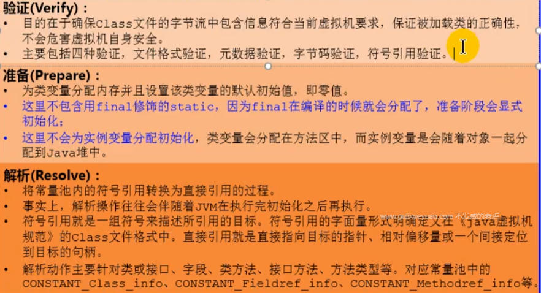

# 1. 内存与垃圾回收篇 

## 1.1 类加载子系统

### 1.1.1类加载过程一：加载（Loading）

1. 通过一个类的全类名获取定义此类的二进制字节流
2. 将这个字节流所代表的静态存储结构转化为方法区的运行时数据结构
3. 在内存中生成一个代表这个类的java.lang.Class对象，作为方法区这个类的各种数据的访问入口

### 1.1.2  类加载过程二：链接（Linking）

### 1.1.3 类加载过程三：初始化（Initialition）

# 2. 字节码与类的加载篇

# 3. 性能监控与调优篇

