# 1. Tomcat

## 1.1 WebTomcat新建项目-部署-运行-访问


### 1.1.1 tomcat安装与配置

1. 解压：不要有中文和空格

2. 目录结构说明：

   

3. 配置环境变量，让Tomcat能运行起来

   因为tomcat也是用java和C写的，因此也需要JRE，所以也需要配置JAVA_HOME，

4. 启动tomcat访问主页

# 2 Servlet

Servlet（Server Applet）是[Java](https://baike.baidu.com/item/Java/85979) Servlet的简称，称为小服务程序或服务连接器，用Java编写的[服务器](https://baike.baidu.com/item/服务器/100571)端程序，具有独立于平台和[协议](https://baike.baidu.com/item/协议/13020269)的特性，主要功能在于交互式地浏览和生成数据，生成动态Web内容。

狭义的Servlet是指Java语言实现的一个接口，广义的Servlet是指任何实现了这个Servlet接口的类，

## 2.1 Servlet项目用户发请求的过程实现概述

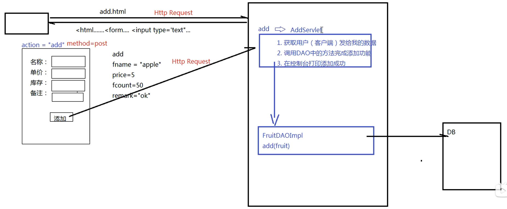

1. 客户端发送请求至服务器端（tomcat）；
2. 服务器将请求信息发送至 Servlet；
3. Servlet 生成响应内容并将其传给服务器。响应内容动态生成，通常取决于客户端的请求；
4. 服务器将响应返回给客户端。

## 2.2 代码实现servlet组件调用

### 2.2.1 在web下添加添加add.html页面

```html
<!DOCTYPE html>
<html lang="en">
<head>
    <meta charset="UTF-8">
    <title>Title</title>
</head>
<body>
    <form action="add" method="post">
        名称：<input type="text" name="fname"/><br/>
        价格：<input type="text" name="price"/><br/>
        库存：<input type="text" name="fcount"/><br/>
        备注：<input type="text" name="remark"/><br/>
        <input type="submit" value="添加" />
    </form>
</body>
</html>
```

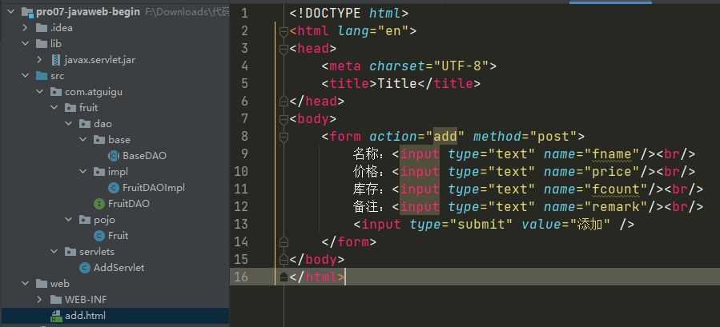

### 2.2.2 添加AddServlet组件

```java
/**
 * HttpServlet 不是在jdk中而是在javax.servlet.jar包中
 */
public class AddServlet extends HttpServlet {
    @Override
    public void doPost(HttpServletRequest request, HttpServletResponse response) throws ServletException, IOException {

        String fname = request.getParameter("fname");
        String priceStr = request.getParameter("price");
        Integer price = Integer.parseInt(priceStr);
        String fcountStr = request.getParameter("fcount");
        Integer fcount = Integer.parseInt(fcountStr);
        String remark = request.getParameter("remark");

        FruitDAO fruitDAO = new FruitDAOImpl();
        boolean flag = fruitDAO.addFruit(new Fruit(0 , fname , price , fcount , remark));

        System.out.println(flag ? "添加成功！" : "添加失败！");
    }
}
```

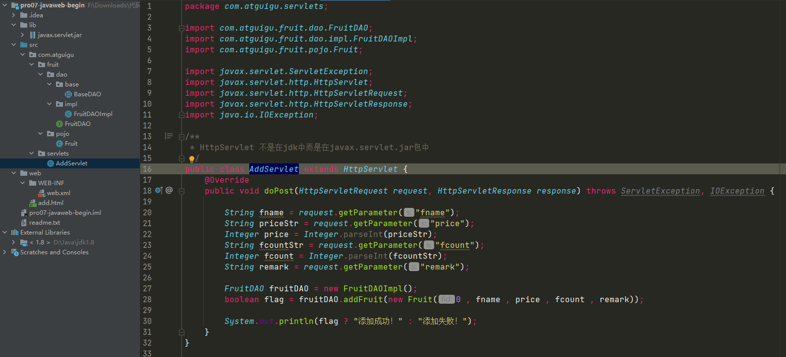

### 2.2.3 将用户请求与servlet组件绑定

```xml
<?xml version="1.0" encoding="UTF-8"?>
<web-app xmlns="http://xmlns.jcp.org/xml/ns/javaee"
         xmlns:xsi="http://www.w3.org/2001/XMLSchema-instance"
         xsi:schemaLocation="http://xmlns.jcp.org/xml/ns/javaee http://xmlns.jcp.org/xml/ns/javaee/web-app_4_0.xsd"
         version="4.0">
    <servlet>
        <servlet-name>AddServlet</servlet-name>
        <servlet-class>com.atguigu.servlets.AddServlet</servlet-class>
    </servlet>
    <servlet-mapping>
        <servlet-name>AddServlet</servlet-name>
        <url-pattern>/add</url-pattern>
    </servlet-mapping>
    <!--
    1. 用户发请求，action=add
    2. 项目中，web.xml中找到url-pattern = /add   -> 第12行
    3. 找第11行的servlet-name = AddServlet
    4. 找和servlet-mapping中servlet-name一致的servlet ， 找到第7行
    5. 找第8行的servlet-class -> com.atguigu.servlets.AddServlet
    6. 用户发送的是post请求（method=post） ， 因此 tomcat会执行AddServlet中的doPost方法
    -->
</web-app>
```


## 2.3 设置编码

tomcat8之前，设置编码︰

* get请求方式︰
  get方式目前不需要设置编码（基于tomcat8 )
  如果是get请求发送的中文数据，转码稍微有点麻烦( tomcat8之前)

  ```java
  string fnamel= request.getParameter ( "fname" ) ;
  ```

  1. 将字符串打散成字节数组

     ```java
     byte[] bytes = fname.getBytes("ISO-8859-1") ;
     ```

  2. 将字节数组按照设定的编码重新组装成字符串

     ```java
     fname = new string(bytes, "UTF-8");
     ```

* post请求方式:

  ```java
  request.setcharacterEncoding("UTF-8");
  ```

* tomcat8开始，设置编码，只需要针对post方式
  ```java
  request.setCharacterEncoding("UTF-8");
  ```

* 注意: 设置编码(post)这一句代码必须在所有的获取参数动作之前

## 2.4 Servlet继承关系

1. 继承关系

   javax.servlet.Servlet接口

   ​	|----javax.servlet.GenericServlet 抽象类

   ​		|----javax.servlet.http.HttpServlet 抽象子类

2. 相关方法

   * javax.servlet.Servlet 接口：

     void init (config) - 初始化方法

     void service(request,response) - 服务方法

     void destory() - 销毁方法

   * javax.servlet.Genericservlet 抽象类∶

     void service (request,response) - 仍然是抽象的

   * javax.servlet.http.Httpservlet - 抽象子类∶

     <font color='red'>void service (request, response) - 不是抽象的</font>

     1. string method = req.getMethod();获取请求的方式

     2. 各种if判断，根据请求方式不同，决定去调用不同的do方法

        ```java
        if (method.equals("GET")) {
            lastModified = this.getLastModified(req);
            if (lastModified == -1L) {
                this.doGet(req, resp);
            } else {
                long ifModifiedSince = req.getDateHeader("If-Modified-Since");
                if (ifModifiedSince < lastModified) {
                    this.maybeSetLastModified(resp, lastModified);
                    this.doGet(req, resp);
                } else {
                    resp.setStatus(304);
                }
            }
        } else if (method.equals("HEAD")) {
            lastModified = this.getLastModified(req);
            this.maybeSetLastModified(resp, lastModified);
            this.doHead(req, resp);
        } else if (method.equals("POST")) {
            this.doPost(req, resp);
        }……{}
        ```

        

     3. 在Httpservlet这个抽象类中，do方法都差不多:

        ```java
        protected void doPost(HttpServletRequest req, HttpServletResponse resp) {
            String protocol = req.getProtocol();
            String msg = lStrings.getString("http.method_post_not_supported");
            if (protocol.endsWith("1.1")) {
                resp.sendError(405, msg);
            } else {
                resp.sendError(400, msg);
            }
        
        }
        ```

3. 小结：

   1) 继承关系: Httpservlet -> Genericservlet -> servlet

   2) servlet中的核心方法: init() , service() , destroy ()

   3) 服务方法

      当有请求过来时，service方法会自动响应（其实是tomcat容器调用的)

      在Httpservlet中我们会去分析请求的方式∶到底是get、post、head还是delete等等

      然后再决定调用的是哪个do开头的方法

      那么在Httpservlet中这些do方法默认都是405的实现风格-要我们子类去实现对应的方法，否则会报405（方法不支持）的错误

   4) 因此，我们在新建servlet时，我们才会去考虑请求方法，从而决定重写哪个do方法

## 2.5 Servlet生命周期

1. 生命周期：从初始化到销毁的过程：init() -> service() -> destroy()

2. 默认情况下︰

   第一次接收请求时，这个servlet会进行实例化(调用构造方法)、初始化(调用init ())、然后服务(调用service())从第二次请求开始，每一次都是服务

   当容器关闭时，其中的所有的servlet实例会被销毁，调用销毁方法

3. 通过案例我们发现: 

   - servlet实例tomcat只会创建一个，所有的请求都是这个实例去响应。

   - 默认情况下，第一次请求时，tomcat才会去实例化，初始化，然后再服务.

     - 这样的好处是什么？提高系统启动速度
     - 这样的缺点是什么？第一次请求时，耗时较长。

   - servlet的初始化时机∶

     - 默认是第一次接收请求时，实例化，初始化

     - 我们可以通过在web.xml中设置`<load-on-startup>`来设置servlet启动的先后顺序,数字越小，启动越靠前，最小值0

       ```xml
       <servlet>
           <servlet-name>AddServlet</servlet-name>
           <servlet-class>com.atguigu.servlets.AddServlet</servlet-class>
           <load-on-startup>1</load-on-startup>
       </servlet>
       ```

   - servlet在容器中是:单例的、线程不安全的

     - 单例∶所有的请求都是同一个实例去响应
     - 线程不安全：一个线程需要根据这个实例中的某个成员变量值去做逻辑判断。但是在中间某个时机，另一个线程改变了这个成员变量的值，从而导致第一个线程的执行路径发生了变化
     - 我们已经知道了servlet是线程不安全的，给我们的启发是:尽量的不要在servlet中定义成员变量。如果不得不定义成员变量，那么不要去：①不要去修改成员变量的值，②不要根绝成员变量的值做逻辑判断

     

   

## 2.6 HTTP协议

HTTP : Hyper Text Transfer Protocol超文本传输协议。HTTP最大的作用就是确定了请求和响应数据的格式。浏览器发送给服务器的数据：请求报文; 服务器返回给浏览器的数据：响应报文。

Http称之为超文本传输协议

Http是无状态的

Http请求响应包含两个部分∶请求和响应

### 2.6.1 请求

* 请求包含三个部分: 1.请求行; 2.请求消息头; 3.请求主体

* 请求行包含是三个信息: 1．请求的方式﹔2.请求的URL ; 3.请求的协议（一般都是HTTP1.1)

* 请求消息头中包含了很多客户端需要告诉服务器的信息，比如∶我的浏览器型号、版本、我能接收的内容的类型、

  | 名称           | 功能                                                 |
  | -------------- | ---------------------------------------------------- |
  | Host           | 服务器的主机地址                                     |
  | Accept         | 声明当前请求能够接受的『媒体类型』                   |
  | Referer        | 当前请求来源页面的地址                               |
  | Content-Length | 请求体内容的长度                                     |
  | Content-Type   | 请求体的内容类型，这一项的具体值是媒体类型中的某一种 |
  | Cookie         | 浏览器访问服务器时携带的Cookie数据                   |

*  请求体

  * get方式，没有请求体，但是有一个querystring
  * post方式，有请求体，form data
  * json格式，有请求体，request payload

### 2.6.2 响应


响应也包含三本: 1．响应行;2.响应头; 3.响应体

1. 响应行包含三个信息:1.协议2.响应状态码3.响应状态
2. 响应头︰包含了服务器的信息﹔服务器发送给浏览器的信息（内容的媒体类型、编码、内容长度等)
3. 响应体∶响应的实际内容（比如请求add.html页面时，响应的内容就是<html><head><body><form>....）

## 2.7 会话

### 2.7.1 Http是无状态的

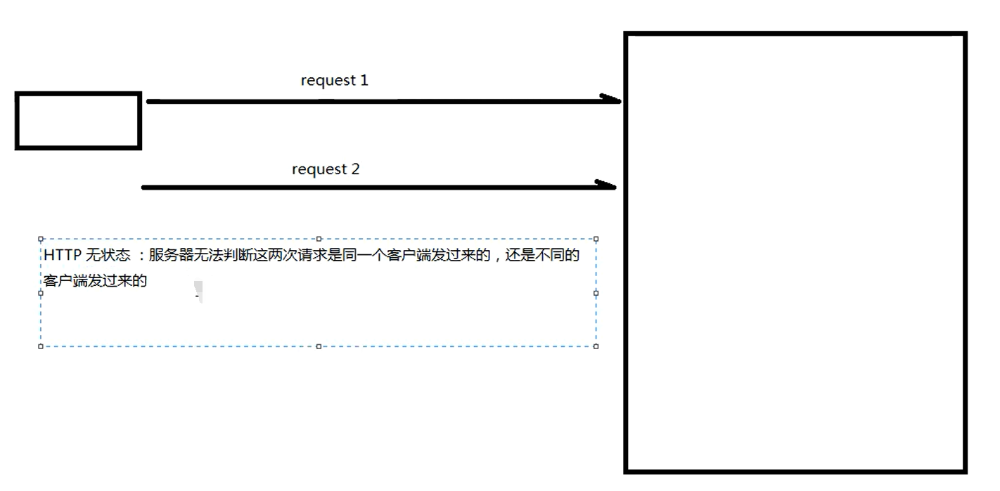

- HTTP无状态︰服务器无法判断这两次请求是同一个客户端发过来的，还是不同的客户端发过来的

- 无状态带来的现实问题：第一次请求是添加商品到购物车，第二次请求是结账;如果这两次请求服务器无法区分是同一个用户的，那么就会导致混乱
- 通过会话跟踪技术解决Http无状态问题

### 2.7.2 会话跟踪技术

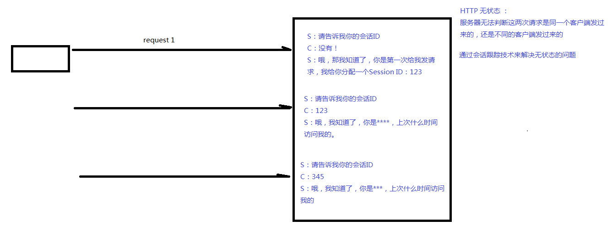

- 客户端第一次发请求给服务器，服务器获取session，获取不到，则创建新的，然后响应给客户端
- 下次客户端给服务器发请求时，会把sessionID带给服务器，那么服务器就能获取到了，那么服务器就判断这一次请求和上次某次请求是同一个客户端，从而能够区分开客户端

```java
//演示Session
public class Demo03Servlet extends HttpServlet {
    @Override
    protected void service(HttpServletRequest request, HttpServletResponse response) throws ServletException, IOException {
        //获取session,如果获取不到，则创建一个新的
        HttpSession session = request.getSession() ;
        System.out.println("session ID : " + session.getId());

    }
}
```

常用的API：

request.getsession () ->获取当前的会话，没有则创建一个新的会话request.getsession (true) ->效果和不带参数相同

request.getsession(false)->获取当前会话，没有则返回null，不会创建新的

session.getId () ->获取sessionID

session.isNew () ->判断当前session是否是新的

session.getMaxInactiveInterval( ) -> session的非激活间隔时长，默认1800秒

session.setMaxInactiveInterval()

session.invalidate () ->强制性让会话立即失效

### 2.7.3 保存作用域

- session保存作用域是和具体的某一个session对应的

- 常用的API：

  void session.setAttribute (k ,v)

  Object session.getAttribute (k)

  void removeAttribute (k)

  ```java
  //演示向HttpSession保存数据
  public class Demo04Servlet extends HttpServlet {
      @Override
      protected void service(HttpServletRequest request, HttpServletResponse response) throws ServletException, IOException {
          request.getSession().setAttribute("uname","lina");
          // 获取数据
          Object unameObj = request.getSession().getAttribute("uname");
          System.out.println(unameObj);
      }
  }
  ```


## 2.8 服务器内部转发以及客户端重定向

- 服务器内部转发: 
  - 一次请求响应的过程，对于客户端而言，内部经过了多少次转发，客户端是不知道的
  - 地址栏没有变化

```java
request.getRequestDispatcher (" . . ." ).forward (request,respone)
```


- 客户端重定向: 
  - 两次请求响应的过程。客户端肯定知道请求URL有变化
  - 地址栏有变化

```java
response.sendRedirect ("...." );
```

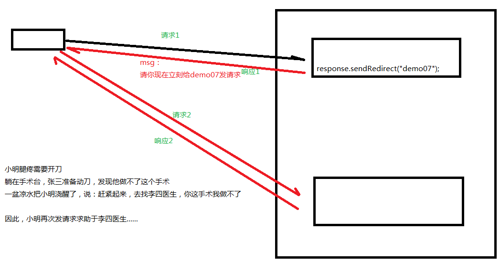

```java
//演示服务器端内部转发以及客户端重定向
//demo06
public class Demo06Servlet extends HttpServlet {
    @Override
    protected void service(HttpServletRequest request, HttpServletResponse response) throws ServletException, IOException {
        System.out.println("demo06......");
        //服务器端内部转发
        //request.getRequestDispatcher("demo07").forward(request,response);
        //客户端重定向
        response.sendRedirect("demo07");
    }
}
//demo07
public class Demo07Servlet extends HttpServlet {
    @Override
    protected void service(HttpServletRequest request, HttpServletResponse response) throws ServletException, IOException {
        System.out.println("demo07......");
    }
}
```

## 面试题

### 1. 什么是Servlet？

servlet是运行在web服务器中的小型java程序，通常通过HTTP协议接受和相应来自web客户端的请求。

它的特点如下：

（1）Servlet对像，由Servlet容器创建。通常这个容器就是tomcat。

（2）Servlet是一个接口：位于javax.servlet包中。

### 2. 请求过程

1. 客户端发送请求：客户端（如浏览器）发送一个HTTP请求到Servlet容器，请求的URL地址包括了Servlet的名字和路径，例如http://localhost:8080/MyApp/MyServlet。
2. Servlet容器接收请求：Servlet容器接收到HTTP请求后，根据请求中的URL地址找到对应的Servlet，并创建一个HttpServletRequest对象和HttpServletResponse对象，分别表示请求和响应。
3. Servlet实例化：如果Servlet容器还没有创建该Servlet的实例，它会实例化该Servlet。在实例化过程中，Servlet容器会调用Servlet的init()方法来完成初始化工作。
4. Servlet处理请求：一旦Servlet实例化完成，Servlet容器就会调用Servlet的service()方法来处理请求。在service()方法中，Servlet可以根据请求的类型（如GET或POST）执行相应的逻辑处理，并生成一个响应结果。
5. Servlet生成响应：在service()方法中，Servlet会将处理结果写入HttpServletResponse对象中。例如，Servlet可以向响应中添加HTML页面、图片或其他类型的数据。
6. 响应发送给客户端：当Servlet完成处理并生成响应后，Servlet容器会将HttpServletResponse对象中的数据发送给客户端，客户端接收到响应后，就可以显示响应的内容。
7. Servlet销毁：一旦Servlet容器需要销毁Servlet实例时，它会调用Servlet的destroy()方法，在该方法中，Servlet可以执行一些清理工作，如关闭数据库连接等。

### 3. Servlet容器接收到HTTP请求后，如何根据请求中的URL地址找到对应的Servlet

Servlet容器根据以下两种方式来确定Servlet：

1. URL匹配：Servlet容器可以使用URL映射规则来匹配请求中的URL地址，以确定要调用哪个Servlet。例如，可以使用通配符来匹配一组URL地址。可以在web.xml配置文件中使用Servlet映射规则进行配置。
2. 注解：Servlet 3.0及以上版本支持使用注解来标识Servlet。在Servlet类上添加@WebServlet注解，可以指定Servlet的URL地址。例如，@WebServlet("/MyServlet")表示该Servlet的URL地址为/MyServlet。

### 4. Servlet生命周期

1. 加载和实例化：当Servlet容器启动时，它会查找并加载所有的Servlet类。在Servlet容器第一次收到请求时，它会创建一个Servlet实例并调用其init()方法。
2. 初始化：在Servlet实例创建后，Servlet容器会调用其init()方法来完成初始化。在init()方法中，Servlet可以进行一些初始化工作，如获取Servlet配置参数，建立数据库连接等。
3. 服务：在初始化完成后，Servlet容器会将请求传递给Servlet的service()方法来处理。在service()方法中，Servlet可以根据请求的类型执行相应的处理逻辑。
4. 销毁：当Servlet容器需要销毁一个Servlet实例时，它会调用其destroy()方法。在destroy()方法中，Servlet可以执行一些清理工作，如关闭数据库连接等。

### 5. GenericServlet和HttpServlet有什么区别？

1. GenericServlet

   GenericServlet是一个抽象类，它实现了Servlet接口中的所有方法，同时提供了一些基本的Servlet功能，如初始化和销毁。由于它是一个通用的Servlet组件，因此它可以用于处理各种类型的请求，包括HTTP请求和非HTTP请求。通常情况下，如果我们需要实现一个自定义的Servlet组件，可以继承GenericServlet类来实现。

2. HttpServlet

   HttpServlet是GenericServlet的子类，它提供了一些额外的方法和功能，使得它更适合用于处理HTTP请求。HttpServlet包含了doGet、doPost、doPut、doDelete等一系列处理HTTP请求的方法，可以方便地处理各种类型的HTTP请求。除此之外，HttpServlet还提供了一些其他的功能，如对cookie和session的支持，以及对HTTP头信息的访问。

### 6. 什么情况下调用doGet()和doPost()呢？

也就是在前端代码中，如果我们的请求方式是get那就是doGet处理。同理post是doPost方法处理。

（1）doGet：GET方法会把名值对追加在请求的URL后面。因为URL对字符数目有限制，进而限制了用在客户端请求的参数值的数目。并且请求中的参数值是可见的，因此，敏感信息不能用这种方式传递。

（2）doPOST：POST方法通过把请求参数值放在请求体中来克服GET方法的限制，因此，可以发送的参数的数目是没有限制的。最后，通过POST请求传递的敏感信息对外部客户端是不可见的。

### 7. 四种会话跟踪技术

- 基于Cookie的会话跟踪技术

  基于Cookie的会话跟踪技术是最常见的一种会话跟踪技术，它的原理是在客户端使用Cookie保存一个Session ID，每次请求时将Session ID发送给服务器端，服务器端通过Session ID识别出对应的会话信息。优点是实现简单、可跨域使用，缺点是Cookie有大小限制和安全风险

- 基于URL重写的会话跟踪技术

  基于URL重写的会话跟踪技术是将Session ID作为URL参数附加到每个请求的URL上，服务器端通过解析URL参数识别出对应的会话信息。优点是实现简单、可跨域使用，缺点是会破坏原有的URL结构。

- 基于隐藏表单域的会话跟踪技术

  基于隐藏表单域的会话跟踪技术是将Session ID作为一个隐藏表单域附加到每个请求的表单中，服务器端通过解析表单中的隐藏域识别出对应的会话信息。优点是实现简单、安全性较好，缺点是会破坏原有的表单结构。

- 基于Session对象的会话跟踪技术

  通常和Cookie配合使用。

### 8. 会话作用域

会话作用域是通过Session对象来实现的。在Java Servlet API中，Session对象提供了以下几种作用域：

- Application作用域

  Application作用域是指将数据保存在整个Web应用程序的生命周期中，所有的客户端请求都可以访问和共享这些数据。通常情况下，将数据保存在ServletContext对象中来实现Application作用域。

- Session作用域

  Session作用域是指将数据保存在一次会话的整个过程中，同一个客户端在一次会话中的所有请求和响应都可以访问和共享这些数据。通常情况下，将数据保存在Session对象中来实现Session作用域。

- Request作用域

  Request作用域是指将数据保存在一次HTTP请求和响应的过程中，同一个请求中的所有Servlet和JSP页面都可以访问和共享这些数据。通常情况下，将数据保存在HttpServletRequest对象中来实现Request作用域。

- Page作用域

  Page作用域是指将数据保存在一个JSP页面的执行过程中，同一个JSP页面中的所有Java代码和表达式都可以访问和共享这些数据。通常情况下，将数据保存在PageContext对象中来实现Page作用域。

### 9. Cookie和Session有什么区别

- 存储位置：Cookie是存储在客户端的，Session是存储在服务器端的。
- 数据安全性：由于Cookie是存储在客户端的，所以它们的数据可能会被客户端篡改或窃取；而Session是存储在服务器端的，所以它们的数据相对较为安全。
- 存储容量：Cookie的存储容量比Session小，一般只能存储4KB左右的数据；而Session的存储容量比Cookie大，一般可以存储数MB的数据。
- 过期时间：Cookie可以设置过期时间，可以长期有效（如果没有设置过期时间，则该Cookie会一直存在，直到客户端关闭浏览器或手动清除Cookie）；而Session的有效时间默认是30分钟，可以通过设置改变，一般适用于短期的数据共享（如果客户端关闭浏览器，则Session对象也会自动销毁）。

### 10. 如何知道是哪一个客户端的机器正在请求你的Servlet

ServletRequest类可以找出客户端机器的IP地址或者是主机名。getRemoteAddr()方法获取客户端主机的IP地址，getRemoteHost()可以获取主机名。

### 11. 在Servlet中，forward和redirect都可以用于页面的跳转，它们的主要区别如下：

1. forward是服务器内部的跳转，而redirect是客户端的跳转。

   - forward是在服务器端进行页面跳转，浏览器并不知道页面的变化，因此URL地址不会改变。

   - redirect是在客户端进行页面跳转，服务器会发送一个HTTP响应给客户端，客户端会重新发送一个HTTP请求到服务器，因此URL地址会发生变化。

2. forward是一次请求，而redirect是两次请求。

   - forward是将请求转发给另一个页面进行处理，处理完毕后将结果返回给客户端，整个过程只涉及一次HTTP请求。

   - redirect是将请求发送给服务器，服务器返回一个HTTP响应给客户端，客户端再发送一个HTTP请求到服务器，整个过程涉及两次HTTP请求。

3. forward可以共享request域中的数据，而redirect不能。

   - forward是在同一个请求中进行的页面跳转，因此可以共享request域中的数据。

   - redirect是两个独立的请求，因此不能共享request域中的数据。

### 12. HTTP协议中，GET和POST的主要区别如下：

1. 请求参数位置不同。

   - GET方法将请求参数附加在URL后面，即查询字符串中，形如“http://www.example.com/login?username=admin&password=123456”。

   - POST方法将请求参数包含在请求体中，请求体可以是JSON、XML、文本等形式。

2. 请求参数大小限制不同。

   - GET方法传输的参数大小有限制，不同浏览器有不同的限制，一般为2KB-8KB。

   - POST方法传输的参数大小理论上没有限制，但是实际上会受到服务器的限制。

3. 安全性不同。

   - GET方法的请求参数暴露在URL中，容易被拦截和篡改，因此不适合传输敏感信息。

   - POST方法的请求参数在请求体中，相对于GET方法更加安全，适合传输敏感信息。

4. 缓存策略不同。

   - GET方法会被浏览器缓存，下次请求相同的URL时会直接使用缓存数据。

   - POST方法不会被浏览器缓存，每次请求都需要向服务器发送请求。

5. 应用场景不同。

   - GET方法适用于请求数据，如获取网页、图片等。

   - POST方法适用于提交数据，如登录、注册等。

# 3 Thymeleaf

视图模板技术

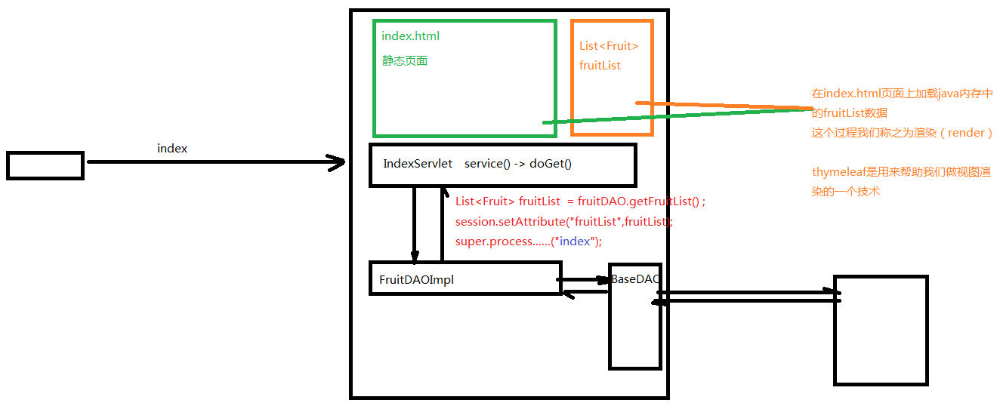

## 3.1 添加thymeleaf的jar包


## 3.2 新建一个servlet类viewBaseservlet

```java
public class ViewBaseServlet extends HttpServlet {

    private TemplateEngine templateEngine;

    @Override
    public void init() throws ServletException {

        // 1.获取ServletContext对象
        ServletContext servletContext = this.getServletContext();

        // 2.创建Thymeleaf解析器对象
        ServletContextTemplateResolver templateResolver = new ServletContextTemplateResolver(servletContext);

        // 3.给解析器对象设置参数
        // ①HTML是默认模式，明确设置是为了代码更容易理解
        templateResolver.setTemplateMode(TemplateMode.HTML);

        // ②设置前缀
        String viewPrefix = servletContext.getInitParameter("view-prefix");

        templateResolver.setPrefix(viewPrefix);

        // ③设置后缀
        String viewSuffix = servletContext.getInitParameter("view-suffix");

        templateResolver.setSuffix(viewSuffix);

        // ④设置缓存过期时间（毫秒）
        templateResolver.setCacheTTLMs(60000L);

        // ⑤设置是否缓存
        templateResolver.setCacheable(true);

        // ⑥设置服务器端编码方式
        templateResolver.setCharacterEncoding("utf-8");

        // 4.创建模板引擎对象
        templateEngine = new TemplateEngine();

        // 5.给模板引擎对象设置模板解析器
        templateEngine.setTemplateResolver(templateResolver);

    }

    protected void processTemplate(String templateName, HttpServletRequest req, HttpServletResponse resp) throws IOException {
        // 1.设置响应体内容类型和字符集
        resp.setContentType("text/html;charset=UTF-8");

        // 2.创建WebContext对象
        WebContext webContext = new WebContext(req, resp, getServletContext());

        // 3.处理模板数据
        templateEngine.process(templateName, webContext, resp.getWriter());
    }
}
```

## 3.3 在web.xml文件中添加配置

```xml
<!-- 配置上下文参数 -->
<context-param>
    <param-name>view-prefix</param-name>
    <param-value>/</param-value> <!-- / 代表 web 根目录-->
</context-param>
<context-param>
    <param-name>view-suffix</param-name>
    <param-value>.html</param-value>
</context-param>
```

## 3.4 使得我们的servlet继承viewBaseservlet

```java
//Servlet从3.0版本开始支持注解方式的注册
// 注意：/ 不能少，否则报错：java.lang.IllegalArgumentException: Invalid <url-pattern> demo01 in servlet mapping
@WebServlet("/index")
public class IndexServlet extends ViewBaseServlet {
    @Override
    public void doGet(HttpServletRequest request , HttpServletResponse response)throws IOException, ServletException {
        FruitDAO fruitDAO = new FruitDAOImpl();
        List<Fruit> fruitList = fruitDAO.getFruitList();
        //保存到session作用域
        HttpSession session = request.getSession() ;
        session.setAttribute("fruitList",fruitList);
        //此处的视图名称是 index
        //那么thymeleaf会将这个 逻辑视图名称 对应到 物理视图 名称上去
        //逻辑视图名称 ：   index
        //物理视图名称 ：   view-prefix + 逻辑视图名称 + view-suffix
        //所以真实的视图名称是：      /       index       .html
        super.processTemplate("index",request,response);
    }
}
```

## 3.5 使用thymeleaf的标签

```html
th:if, th:unless, th:each, th:text
```

# 4 保存作用域

原始情况下，保存作用域有四个

## 4.1 page级别

page（页面级别，现在几乎不用）

## 4.2  request：一次请求响应范围


```java
//演示request保存作用域（demo01和demo02）
@WebServlet("/demo01")
public class Demo01Servlet extends HttpServlet {
    @Override
    protected void service(HttpServletRequest request, HttpServletResponse response) throws ServletException, IOException {
        //1.向request保存作用域保存数据
        request.setAttribute("uname","lili");
        //2.客户端重定向
        //response.sendRedirect("demo02");

        //3.服务器端转发
        request.getRequestDispatcher("demo02").forward(request,response);
    }
}
@WebServlet("/demo02")
public class Demo02Servlet extends HttpServlet {
    @Override
    protected void service(HttpServletRequest request, HttpServletResponse response) throws ServletException, IOException {
        //1.获取request保存作用域保存的数据，key为uname
        Object unameObj = request.getAttribute("uname");
        System.out.println("unameObj = " + unameObj);
    }
}

```

## 4.3 session：一次会话范围有效


```java
//演示session保存作用域（demo03和demo04）
@WebServlet("/demo03")
public class Demo03Servlet extends HttpServlet {
    @Override
    protected void service(HttpServletRequest request, HttpServletResponse response) throws ServletException, IOException {
        //1.向session保存作用域保存数据
        request.getSession().setAttribute("uname","lili");
        //2.客户端重定向
        response.sendRedirect("demo04");

        //3.服务器端转发
        //request.getRequestDispatcher("demo04").forward(request,response);
    }
}
@WebServlet("/demo04")
public class Demo04Servlet extends HttpServlet {
    @Override
    protected void service(HttpServletRequest request, HttpServletResponse response) throws ServletException, IOException {
        //1.获取session保存作用域保存的数据，key为uname
        Object unameObj = request.getSession().getAttribute("uname");
        System.out.println("unameObj = " + unameObj);
    }
}
```

## 4.4 application： 一次应用程序范围有效


```java
//演示application保存作用域（demo05和demo06）
@WebServlet("/demo05")
public class Demo05Servlet extends HttpServlet {
    @Override
    protected void service(HttpServletRequest request, HttpServletResponse response) throws ServletException, IOException {
        //1.向application保存作用域保存数据
        //ServletContext : Servlet上下文
        ServletContext application = request.getServletContext();
        application.setAttribute("uname","lili");
        //2.客户端重定向
        response.sendRedirect("demo06");

        //3.服务器端转发
        //request.getRequestDispatcher("demo04").forward(request,response);
    }
}
@WebServlet("/demo06")
public class Demo06Servlet extends HttpServlet {
    @Override
    protected void service(HttpServletRequest request, HttpServletResponse response) throws ServletException, IOException {
        //1.获取application保存作用域保存的数据，key为uname
        ServletContext application = request.getServletContext() ;
        Object unameObj = application.getAttribute("uname");
        System.out.println("unameObj = " + unameObj);
    }
}
```

# 5 路径问题

## 5.1 相对路径和绝对路径

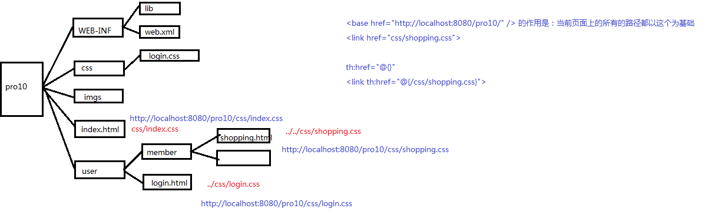

# 6 造轮子：MVC

## 6.1 迭代1：每个请求对应一个Servlet组件

 一个请求对应一个Servlet，这样存在的问题是servlet太多了

## 6.2 迭代2：把一些列的请求都对应一个Servlet

IndexServlet / AddServlet / EditServlet / DelServlet / UpdateServlet -> <font color='red'>合并成FruitServlet</font>，通过一个operate（add/update/edit/delete）的值来决定调用FruitServlet中的哪一个方法，使用的是switch-case


### 6.2.1 引入thymeleaf依赖并添加web.xml配置

```java
<?xml version="1.0" encoding="UTF-8"?>
<web-app xmlns="http://xmlns.jcp.org/xml/ns/javaee"
         xmlns:xsi="http://www.w3.org/2001/XMLSchema-instance"
         xsi:schemaLocation="http://xmlns.jcp.org/xml/ns/javaee http://xmlns.jcp.org/xml/ns/javaee/web-app_4_0.xsd"
         version="4.0">
    <!-- 配置上下文参数 -->
    <context-param>
        <param-name>view-prefix</param-name>
        <param-value>/</param-value>
    </context-param>
    <context-param>
        <param-name>view-suffix</param-name>
        <param-value>.html</param-value>
    </context-param>
</web-app>
```

### 6.2.2 创建ViewBaseServlet继承HttpServlet

这里面有三个关键点：

1. 在这个类中添加私有属性模板引擎对象TemplateEngine templateEngine
2. 重写init方法，在该方法中实例化ServletContext对象，创建了thymeleaf解析器对象，并且给解析器设置了前缀后缀参数，最后将解析器设置给thymeleaf模板引擎templateEngine
3. 添加processTemplate方法用来处理模板数据

```java
public class ViewBaseServlet extends HttpServlet {
    private TemplateEngine templateEngine;
    @Override
    public void init() throws ServletException {
        // 1.获取ServletContext对象
        ServletContext servletContext = this.getServletContext();
        // 2.创建Thymeleaf解析器对象
        ServletContextTemplateResolver templateResolver = new ServletContextTemplateResolver(servletContext);
        // 3.给解析器对象设置参数
        // ①HTML是默认模式，明确设置是为了代码更容易理解
        templateResolver.setTemplateMode(TemplateMode.HTML);
        // ②设置前缀
        String viewPrefix = servletContext.getInitParameter("view-prefix");
        templateResolver.setPrefix(viewPrefix);
        // ③设置后缀
        String viewSuffix = servletContext.getInitParameter("view-suffix");
        templateResolver.setSuffix(viewSuffix);
        // ④设置缓存过期时间（毫秒）
        templateResolver.setCacheTTLMs(60000L);
        // ⑤设置是否缓存
        templateResolver.setCacheable(true);
        // ⑥设置服务器端编码方式
        templateResolver.setCharacterEncoding("utf-8");
        // 4.创建模板引擎对象
        templateEngine = new TemplateEngine();
        // 5.给模板引擎对象设置模板解析器
        templateEngine.setTemplateResolver(templateResolver);
    }
    protected void processTemplate(String templateName, HttpServletRequest req, HttpServletResponse resp) throws IOException {
        // 1.设置响应体内容类型和字符集
        resp.setContentType("text/html;charset=UTF-8");
        // 2.创建WebContext对象
        WebContext webContext = new WebContext(req, resp, getServletContext());
        // 3.处理模板数据
        templateEngine.process(templateName, webContext, resp.getWriter());
    }
}
```

### 6.2.3 添加FruitServlet类继承ViewBaseServlet

```java
// Servlet3.0+可以通过注解的方式进行Servlet组建的注册
@WebServlet("/fruit.do")
public class FruitServlet extends ViewBaseServlet {
    private FruitDAO fruitDAO = new FruitDAOImpl();

    @Override
    protected void service(HttpServletRequest request, HttpServletResponse response) throws ServletException, IOException {
        //设置编码
        request.setCharacterEncoding("UTF-8");

        String operate = request.getParameter("operate");
        if(StringUtil.isEmpty(operate)){
            operate = "index" ;
        }

        switch(operate){
            case "index":
                index(request,response);
                break;
            case "add":
                add(request,response);
                break;
            case "del":
                del(request,response);
                break;
            case "edit":
                edit(request,response);
                break;
            case "update":
                update(request,response);
                break;
            default:
                throw new RuntimeException("operate值非法!");
        }
    }

    private void update(HttpServletRequest request, HttpServletResponse response) throws ServletException, IOException {
        //1.设置编码
        request.setCharacterEncoding("utf-8");

        //2.获取参数
        String fidStr = request.getParameter("fid");
        Integer fid = Integer.parseInt(fidStr);
        String fname = request.getParameter("fname");
        String priceStr = request.getParameter("price");
        int price = Integer.parseInt(priceStr);
        String fcountStr = request.getParameter("fcount");
        Integer fcount = Integer.parseInt(fcountStr);
        String remark = request.getParameter("remark");

        //3.执行更新
        fruitDAO.updateFruit(new Fruit(fid,fname, price ,fcount ,remark ));

        //4.资源跳转
        //super.processTemplate("index",request,response);
        //request.getRequestDispatcher("index.html").forward(request,response);
        //此处需要重定向，目的是重新给IndexServlet发请求，重新获取furitList，然后覆盖到session中，这样index.html页面上显示的session中的数据才是最新的
        response.sendRedirect("fruit.do");
    }

    private void edit(HttpServletRequest request , HttpServletResponse response)throws IOException, ServletException {
        String fidStr = request.getParameter("fid");
        if(StringUtil.isNotEmpty(fidStr)){
            int fid = Integer.parseInt(fidStr);
            Fruit fruit = fruitDAO.getFruitByFid(fid);
            request.setAttribute("fruit",fruit);
            super.processTemplate("edit",request,response);
        }
    }

    private void del(HttpServletRequest request , HttpServletResponse response)throws IOException, ServletException {
        String fidStr = request.getParameter("fid");
        if(StringUtil.isNotEmpty(fidStr)){
            int fid = Integer.parseInt(fidStr);
            fruitDAO.delFruit(fid);

            //super.processTemplate("index",request,response);
            response.sendRedirect("fruit.do");
        }
    }

    private void add(HttpServletRequest request, HttpServletResponse response) throws ServletException, IOException {
        request.setCharacterEncoding("UTF-8");

        String fname = request.getParameter("fname");
        Integer price = Integer.parseInt(request.getParameter("price")) ;
        Integer fcount = Integer.parseInt(request.getParameter("fcount"));
        String remark = request.getParameter("remark");

        Fruit fruit = new Fruit(0,fname , price , fcount , remark ) ;

        fruitDAO.addFruit(fruit);

        response.sendRedirect("fruit.do");

    }

    private void index(HttpServletRequest request , HttpServletResponse response)throws IOException, ServletException {
        HttpSession session = request.getSession() ;

        // 设置当前页，默认值1
        Integer pageNo = 1 ;

        String oper = request.getParameter("oper");

        //如果oper!=null 说明 通过表单的查询按钮点击过来的
        //如果oper是空的，说明 不是通过表单的查询按钮点击过来的
        String keyword = null ;
        if(StringUtil.isNotEmpty(oper) && "search".equals(oper)){
            //说明是点击表单查询发送过来的请求
            //此时，pageNo应该还原为1 ， keyword应该从请求参数中获取
            pageNo = 1 ;
            keyword = request.getParameter("keyword");
            //如果keyword为null，需要设置为空字符串""，否则查询时会拼接成 %null% , 我们期望的是 %%
            if(StringUtil.isEmpty(keyword)){
                keyword = "" ;
            }
            //将keyword保存（覆盖）到session中
            session.setAttribute("keyword",keyword);
        }else{
            //说明此处不是点击表单查询发送过来的请求（比如点击下面的上一页下一页或者直接在地址栏输入网址）
            //此时keyword应该从session作用域获取
            String pageNoStr = request.getParameter("pageNo");
            if(StringUtil.isNotEmpty(pageNoStr)){
                pageNo = Integer.parseInt(pageNoStr);   //如果从请求中读取到pageNo，则类型转换。否则，pageNo默认就是1
            }
            //如果不是点击的查询按钮，那么查询是基于session中保存的现有keyword进行查询
            Object keywordObj = session.getAttribute("keyword");
            if(keywordObj!=null){
                keyword = (String)keywordObj ;
            }else{
                keyword = "" ;
            }
        }

        // 重新更新当前页的值
        session.setAttribute("pageNo",pageNo);

        FruitDAO fruitDAO = new FruitDAOImpl();
        List<Fruit> fruitList = fruitDAO.getFruitList(keyword , pageNo);
        session.setAttribute("fruitList",fruitList);

        //总记录条数
        int fruitCount = fruitDAO.getFruitCount(keyword);
        //总页数
        int pageCount = (fruitCount+5-1)/5 ;
        /*
        总记录条数       总页数
        1               1
        5               1
        6               2
        10              2
        11              3
        fruitCount      (fruitCount+5-1)/5
         */
        session.setAttribute("pageCount",pageCount);

        //此处的视图名称是 index
        //那么thymeleaf会将这个 逻辑视图名称 对应到 物理视图 名称上去
        //逻辑视图名称 ：   index
        //物理视图名称 ：   view-prefix + 逻辑视图名称 + view-suffix
        //所以真实的视图名称是：      /       index       .html
        super.processTemplate("index",request,response);
    }
}
```


## 6.3 迭代3：在servlet中使用了反射技术

在上一个版本中，Servlet中充斥着大量的switch-case，试想一下，随着我们的项目的业务规模扩大，那么会有<font color='red'>很多的Servlet</font>，也就意味着会有很多的switch-case，这是一种代码冗余。

因此，我们<font color='red'>在servlet中使用了反射技术</font>，我们规定<font color='red'>operate的值和方法名一致</font>，那么接收到operate的值是什么就表明我们需要调用对应的方法进行响应，如果找不到对应的方法，则抛异常。

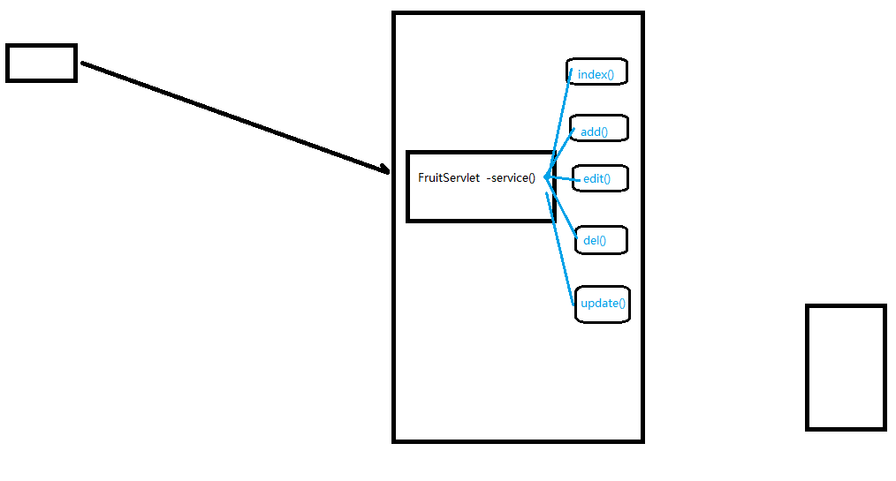

### 6.3.1 引入thymeleaf依赖并添加web.xml配置

同 6.2.1

### 6.3.2 创建ViewBaseServlet继承HttpServlet

同 6.2.2 

### 6.3.3 添加FruitServlet类继承ViewBaseServlet

与 6.2.3 不同之处在于<font color='red'>service方法</font>中使用了<font color='red'>反射机制</font>

```java
// Servlet3.0+可以通过注解的方式进行Servlet组建的注册
@WebServlet("/fruit.do")
public class FruitServlet extends ViewBaseServlet {
    private FruitDAO fruitDAO = new FruitDAOImpl();
    @Override
    protected void service(HttpServletRequest request, HttpServletResponse response) {
        //设置编码
        request.setCharacterEncoding("UTF-8");
        String operate = request.getParameter("operate");
        if(StringUtil.isEmpty(operate)){
            operate = "index" ;
        }
        Method method = this.getClass().getDeclaredMethod(operate);
        Object res = method.invoke(method, request, response);
    }
    // 下同 6.2.3 
}
```


## 6.4 迭代4：设计中央控制器类DispatcherServlet

在上一个版本中我们使用了反射技术，但是其实还是存在一定的问题：每一个servlet中都有类似的反射技术的代码。因此继续抽取，设计了<font color='red'>中央控制器类：DispatcherServlet</font>

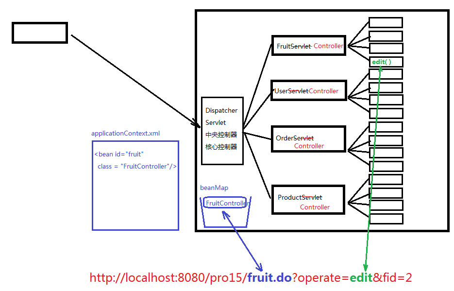

DispatcherServlet这个类的工作分为两大部分：

### 6.4.1 根据url定位到能够处理这个请求的controller组件

1. 从url中提取servletPath : /fruit.do -> fruit

2. 根据fruit找到对应的组件: FruitController ， 这个对应的依据我们存储在<font color='red'>applicationContext.xml</font>中

   ```xml
   <bean id="fruit" class="com.atguigu.fruit.controllers.FruitController/>
   ```

   通过DOM技术我们去解析XML文件，在中央控制器中形成一个<font color='red'>beanMap容器</font>，用来存放所有的Controller组件

3. 根据获取到的operate的值定位到我们FruitController中需要调用的方法

### 6.4.2 调用Controller组件中的方法
1) 获取参数
   
   获取即将要调用的方法的参数签名信息: 
   
   ```java
   Parameter[] parameters = method.getParameters();
   ```

   通过`parameter.getName()`获取参数的名称；
   准备了`Object[] parameterValues` 这个数组用来存放对应参数的参数值
   另外，我们需要考虑参数的类型问题，需要做类型转化的工作。通过`parameter.getType()`获取参数的类型
   
1) 执行方法
   ```java
   Object returnObj = method.invoke(controllerBean , parameterValues);
   ```
   
1) 视图处理
   ```java
   String returnStr = (String)returnObj;
   if(returnStr.startWith("redirect:")){
    ....
   }else if.....
   ```

### 6.4.3 代码实现

#### 6.4.3.1 创建DispatcherServlet继承ViewBaseServlet

注意ViewBaseServlet不再注册Servlet组件，只作为一个实现类，然后在DispatcherServlet中注册Servlet组件

Servlet组件初始化时创建beanMap容器放所有的Controller组件，在service里面处理参数、资源跳转和视图

```java
@WebServlet("*.do")
public class DispatcherServlet extends ViewBaseServlet{
    private Map<String,Object> beanMap = new HashMap<>();
    public DispatcherServlet(){
    }
    public void init() throws ServletException {
        super.init();
        InputStream inputStream = getClass().getClassLoader().getResourceAsStream("applicationContext.xml");
        //1.创建DocumentBuilderFactory
        DocumentBuilderFactory documentBuilderFactory = DocumentBuilderFactory.newInstance();
        //2.创建DocumentBuilder对象
        DocumentBuilder documentBuilder = documentBuilderFactory.newDocumentBuilder() ;
        //3.创建Document对象
        Document document = documentBuilder.parse(inputStream);
        //4.获取所有的bean节点
        NodeList beanNodeList = document.getElementsByTagName("bean");
        for(int i = 0 ; i<beanNodeList.getLength() ; i++){
            Node beanNode = beanNodeList.item(i);
            if(beanNode.getNodeType() == Node.ELEMENT_NODE){
                Element beanElement = (Element)beanNode ;
                String beanId =  beanElement.getAttribute("id");
                String className = beanElement.getAttribute("class");
                Class controllerBeanClass = Class.forName(className);
                Object beanObj = controllerBeanClass.newInstance() ;
                beanMap.put(beanId , beanObj) ;
            }
        }
    }

    @Override
    protected void service(HttpServletRequest request, HttpServletResponse response) throws ServletException, IOException {
        //设置编码
        request.setCharacterEncoding("UTF-8");
        //假设url是：  http://localhost:8080/pro15/hello.do
        //那么servletPath是：    /hello.do
        // 我的思路是：
        // 第1步： /hello.do ->   hello   或者  /fruit.do  -> fruit
        // 第2步： hello -> HelloController 或者 fruit -> FruitController
        String servletPath = request.getServletPath();
        servletPath = servletPath.substring(1);
        int lastDotIndex = servletPath.lastIndexOf(".do") ;
        servletPath = servletPath.substring(0,lastDotIndex);
        Object controllerBeanObj = beanMap.get(servletPath);
        String operate = request.getParameter("operate");
        if(StringUtil.isEmpty(operate)){
            operate = "index" ;
        }
        try {
            Method[] methods = controllerBeanObj.getClass().getDeclaredMethods();
            for(Method method : methods){
                if(operate.equals(method.getName())){
                    //1.统一获取请求参数
                    //1-1.获取当前方法的参数，返回参数数组
                    Parameter[] parameters = method.getParameters();
                    //1-2.parameterValues 用来承载参数的值
                    Object[] parameterValues = new Object[parameters.length];
                    for (int i = 0; i < parameters.length; i++) {
                        Parameter parameter = parameters[i];
                        String parameterName = parameter.getName() ;
                        //如果参数名是request,response,session 那么就不是通过请求中获取参数的方式了
                        if("request".equals(parameterName)){
                            parameterValues[i] = request ;
                        }else if("response".equals(parameterName)){
                            parameterValues[i] = response ;
                        }else if("session".equals(parameterName)){
                            parameterValues[i] = request.getSession() ;
                        }else{
                            //从请求中获取参数值
                            String parameterValue = request.getParameter(parameterName);
                            String typeName = parameter.getType().getName();
                            Object parameterObj = parameterValue ;
                            if(parameterObj!=null) {
                                if ("java.lang.Integer".equals(typeName)) {
                                    parameterObj = Integer.parseInt(parameterValue);
                                }
                            }
                            parameterValues[i] = parameterObj ;
                        }
                    }
                    //2.controller组件中的方法调用
                    method.setAccessible(true);
                    Object returnObj = method.invoke(controllerBeanObj,parameterValues);

                    //3.视图处理
                    String methodReturnStr = (String)returnObj ;
                    if(methodReturnStr.startsWith("redirect:")){        //比如：  redirect:fruit.do
                        String redirectStr = methodReturnStr.substring("redirect:".length());
                        response.sendRedirect(redirectStr);
                    }else{
                        super.processTemplate(methodReturnStr,request,response);    // 比如：  "edit"
                    }
                }
            }

            /*
            }else{
                throw new RuntimeException("operate值非法!");
            }
            */
        } catch (IllegalAccessException e) {
            e.printStackTrace();
        } catch (InvocationTargetException e) {
            e.printStackTrace();
        }
    }
}

// 常见错误： IllegalArgumentException: argument type mismatch
```

#### 6.4.3.2 创建FruitController

在在这个类中只有业务逻辑，没有参数获取，也没有资源跳转

```java
public class FruitController {
    private FruitDAO fruitDAO = new FruitDAOImpl();

    private String update(Integer fid , String fname , Integer price , Integer fcount , String remark ){
        //3.执行更新
        fruitDAO.updateFruit(new Fruit(fid,fname, price ,fcount ,remark ));
        //4.资源跳转
        return "redirect:fruit.do";
    }

    private String edit(Integer fid , HttpServletRequest request){
        if(fid!=null){
            Fruit fruit = fruitDAO.getFruitByFid(fid);
            request.setAttribute("fruit",fruit);
            //super.processTemplate("edit",request,response);
            return "edit";
        }
        return "error" ;
    }

    private String del(Integer fid  ){
        if(fid!=null){
            fruitDAO.delFruit(fid);
            return "redirect:fruit.do";
        }
        return "error";
    }

    private String add(String fname , Integer price , Integer fcount , String remark ) {
        Fruit fruit = new Fruit(0,fname , price , fcount , remark ) ;
        fruitDAO.addFruit(fruit);
        return "redirect:fruit.do";
    }

    private String index(String oper , String keyword , Integer pageNo , HttpServletRequest request ) {
        HttpSession session = request.getSession() ;

        if(pageNo==null){
            pageNo = 1;
        }
        if(StringUtil.isNotEmpty(oper) && "search".equals(oper)){
            pageNo = 1 ;
            if(StringUtil.isEmpty(keyword)){
                keyword = "" ;
            }
            session.setAttribute("keyword",keyword);
        }else{
            Object keywordObj = session.getAttribute("keyword");
            if(keywordObj!=null){
                keyword = (String)keywordObj ;
            }else{
                keyword = "" ;
            }
        }

        // 重新更新当前页的值
        session.setAttribute("pageNo",pageNo);

        FruitDAO fruitDAO = new FruitDAOImpl();
        List<Fruit> fruitList = fruitDAO.getFruitList(keyword , pageNo);
        session.setAttribute("fruitList",fruitList);

        //总记录条数
        int fruitCount = fruitDAO.getFruitCount(keyword);
        //总页数
        int pageCount = (fruitCount+5-1)/5 ;
        session.setAttribute("pageCount",pageCount);

        return "index" ;
    }
}
```

#### 6.4.3.3 创建applicationContext.xml

这里面配置请求的servletpath和controller的对应关系

```xml
<?xml version="1.0" encoding="utf-8"?>

<beans>
    <!-- 这个bean标签的作用是 将来servletpath中涉及的名字对应的是fruit，那么就要FruitController这个类来处理 -->
    <bean id="fruit" class="com.atguigu.fruit.controllers.FruitController"/>
</beans>
```

补充知识

1. 概念
   HTML : 超文本标记语言
   XML : 可扩展的标记语言
   HTML是XML的一个子集

2. XML包含三个部分：
   - XML声明 ， 而且声明这一行代码必须在XML文件的第一行
   - DTD 文档类型定义
   - XML正文

# 7 再看Servlet Api

## 7.1 Servlet初始化方法

1) Servlet生命周期：实例化、初始化、服务、销毁

2) Servlet中的初始化方法有两个：init() , init(config)
      其中带参数的方法代码如下：

      ```java
      public void init(ServletConfig config) throws ServletException {
          this.config = config ;
          init();
      }
      ```

      另外一个无参的init方法如下：

      ```java
      public void init() throws ServletException{
      }
      ```

      如果我们想要在Servlet初始化时做一些准备工作，那么我们可以重写init方法

      我们可以通过如下步骤去获取初始化设置的数据

         - 获取config对象：

           ```java
           ServletConfig config = getServletConfig();
           ```
         - 获取初始化参数值：

           ```java
           config.getInitParameter(key);
           ```

3) 在web.xml文件中配置Servlet
      ```xml
      <servlet>
          <servlet-name>Demo01Servlet</servlet-name>
          <servlet-class>com.atguigu.servlet.Demo01Servlet</servlet-class>
          <init-param>
              <param-name>hello</param-name>
              <param-value>world</param-value>
          </init-param>
          <init-param>
              <param-name>uname</param-name>
              <param-value>jim</param-value>
          </init-param>
      </servlet>
      <servlet-mapping>
          <servlet-name>Demo01Servlet</servlet-name>
          <url-pattern>/demo01</url-pattern>
      </servlet-mapping>
      ```

4) 也可以通过注解的方式进行配置：
      ```java
      @WebServlet(urlPatterns = {"/demo01"} ,
      initParams = {
          @WebInitParam(name="hello",value="world"),
          @WebInitParam(name="uname",value="jim")
      })
      ```

5) 代码示例

      ```java
      /*
      @WebServlet(urlPatterns = {"/demo01"} ,
              initParams = {
                  @WebInitParam(name="hello",value="world"),
                  @WebInitParam(name="uname",value="jim")
              }
              )
      */
      public class Demo01Servlet extends HttpServlet {
          @Override
          public void init() throws ServletException {
              ServletConfig config = getServletConfig();
              String initValue = config.getInitParameter("hello");
              System.out.println("initValue = " + initValue);
          }
      }
      ```

# 8 Servlet中的ServletContext和<context -param>

1. 获取ServletContext，有很多方法
   在初始化方法中： 

   ```java
   ServletContxt servletContext = getServletContext();
   ```

   在服务方法中也可以通过request对象获取，也可以通过session获取：

   ```java
   request.getServletContext();
   session.getServletContext();
   ```

2. 获取初始化值：
   ```java
   servletContext.getInitParameter();
   ```

```xml
<context-param>
    <param-name>contextConfigLocation</param-name>
    <param-value>classpath:applicationContext.xml</param-value>
</context-param>
```

```java
public class Demo01Servlet extends HttpServlet {
    @Override
    public void init() throws ServletException {
        ServletContext servletContext = getServletContext();
        String contextConfigLocation = servletContext.getInitParameter("contextConfigLocation");
        System.out.println("contextConfigLocation = " + contextConfigLocation);
    }
}
```

# 9 什么是业务层

## 9.1 Model1和Model2

MVC : Model（模型）、View（视图）、Controller（控制器）

视图层：用于做数据展示以及和用户交互的一个界面

控制层：能够接受客户端的请求，具体的业务功能还是需要借助于模型组件来完成

模型层：模型分为很多种：有比较简单的pojo/vo(value object)，有业务模型组件，有数据访问层组件

- pojo/vo : 值对象
- DAO ： 数据访问对象
- BO ： 业务逻辑对象
- DTO：数据传输对象，常用于前后端分离项目，需要把数据封装在对象中传递

## 9.2 区分业务对象和数据访问对象

1. DAO中的方法都是单精度方法或者称之为细粒度方法。什么叫单精度？一个方法只考虑一个操作，比如添加，那就是insert操作、查询那就是select操作....

2. BO中的方法属于业务方法，也实际的业务是比较复杂的，因此业务方法的粒度是比较粗的

   注册这个功能属于业务功能，也就是说注册这个方法属于业务方法。

   那么这个业务方法中包含了多个DAO方法。也就是说注册这个业务功能需要通过多个DAO方法的组合调用，从而完成注册功能的开发。

   注册：

           1. 检查用户名是否已经被注册 - DAO中的select操作
           2. 向用户表新增一条新用户记录 - DAO中的insert操作
           3. 向用户积分表新增一条记录（新用户默认初始化积分100分） - DAO中的insert操作
           4. 向系统消息表新增一条记录（某某某新用户注册了，需要根据通讯录信息向他的联系人推送消息） - DAO中的insert操作
           5. 向系统日志表新增一条记录（某用户在某IP在某年某月某日某时某分某秒某毫秒注册） - DAO中的insert操作
           6. ……

3. 在库存系统中添加业务层组件

# 10 IOC

## 10.1 耦合/依赖
依赖指的是某某某离不开某某某
  在软件系统中，层与层之间是存在依赖的。我们也称之为耦合。
  我们系统架构或者是设计的一个原则是： 高内聚低耦合。
  层内部的组成应该是高度聚合的，而层与层之间的关系应该是低耦合的，最理想的情况0耦合（就是没有耦合）

## 10.2 IOC - 控制反转 / DI - 依赖注入

### 10.2.1 控制反转

1. 之前在Servlet中，我们创建service对象：

   ```java
   FruitServlet fruit = new FruitServiceImpl();
   ```

   如果这句话出现在<font color='red'>Servlet的某个方法内部</font>，那么这个fruitService的作用域（生命周期）因该就是这个<font color='red'>方法级别</font>；

   如果这句话出现在<font color='red'>Servlet的类中</font>，也就是说fruitService就是一个成员变量，那么这个fruitService的作用域（生命周期）应该就是<font color='red'>servlet实例级别</font>。

   <font color='red'>对象的作用域控制权在程序员手上</font>。

   

2. 之后我们在<font color='red'>applicationContext.xml</font>中定义了这个fruitService。然后通过解析XML，产生fruitService实例，存放在<font color='red'>beanMap</font>中，这个beanMap在一个<font color='red'>BeanFactory</font>中。因此，我们转移（改变）了之前的service实例、dao实例等等他们的生命周期。控制权从程序员转移到BeanFactory。这个现象我们称之为控制反转

   - applicationContext.xml

   ```java
   
   <?xml version="1.0" encoding="utf-8"?>
   
   <beans>
       <bean id="fruitDAO" class="com.atguigu.fruit.dao.impl.FruitDAOImpl"/>
       <bean id="fruitService" class="com.atguigu.fruit.service.impl.FruitServiceImpl">
           <!-- property标签用来表示属性﹔name表示属性名﹔ref表示引用其他bean的id值 -->
           <property name="fruitDAO" ref="fruitDAO"/>
       </bean>
   
       <!-- 这个bean标签的作用是 将来servletpath中涉及的名字对应的是fruit，那么就要FruitController这个类来处理 -->
       <bean id="fruit" class="com.atguigu.fruit.controllers.FruitController">
           <property name="fruitService" ref="fruitService"></property>
       </bean>
   </beans>
   ```

   - BeanFactory

   ```java
   public interface BeanFactory {
       Object getBean(String id);
   }
   ```

   - ClassPathXmlApplicationContext.java

   ```java
   public class ClassPathXmlApplicationContext implements BeanFactory {
       private Map<String, Object> beanMap = new HashMap<>();
   
       public ClassPathXmlApplicationContext() {
           try {
               InputStream inputStream = getClass().getClassLoader().getResourceAsStream("applicationContext.xml");
               //1.创建DocumentBuilderFactory
               DocumentBuilderFactory documentBuilderFactory = DocumentBuilderFactory.newInstance();
               //2.创建DocumentBuilder对象
               DocumentBuilder documentBuilder = documentBuilderFactory.newDocumentBuilder() ;
               //3.创建Document对象
               Document document = documentBuilder.parse(inputStream);
   
               //4.获取所有的bean节点
               NodeList beanNodeList = document.getElementsByTagName("bean");
               for(int i = 0 ; i<beanNodeList.getLength() ; i++){
                   Node beanNode = beanNodeList.item(i);
                   if(beanNode.getNodeType() == Node.ELEMENT_NODE){
                       Element beanElement = (Element)beanNode ;
                       String beanId =  beanElement.getAttribute("id");
                       String className = beanElement.getAttribute("class");
                       Class beanClass = Class.forName(className);
                       // 创建bean实例
                       Object beanObj = beanClass.newInstance() ;
                       // 将bean实例对象保存到map容器中
                       beanMap.put(beanId , beanObj) ;
                       // 到目前为止，此处需要注意的是，bean和bean之间的依赖关系没有设置
                   }
               }
               // 5. 组装bean之间的依赖关系
               for(int i = 0 ; i<beanNodeList.getLength() ; i++) {
                   Node beanNode = beanNodeList.item(i);
                   if (beanNode.getNodeType() == Node.ELEMENT_NODE) {
                       Element beanElement = (Element) beanNode;
                       NodeList beanChildNodesList = beanElement.getChildNodes();
                       String beanId = beanElement.getAttribute("id");
                       for (int j = 0; j < beanChildNodesList.getLength(); j++) {
                           Node beanChildNode = beanChildNodesList.item(j);
                           if (beanChildNode.getNodeType() == Node.ELEMENT_NODE && "property".equals(beanChildNode.getNodeName())) {
                               Element propertyElement = (Element) beanChildNode;
                               String propertyName = propertyElement.getAttribute("name");
                               String propertyRef = propertyElement.getAttribute("ref");
                               // 1)找到propertyRef对应的实例
                               Object refObj = beanMap.get(propertyRef);
                               // 2)将refObj设置到当前bean对应的实例的property属性上去
                               Object beanObj = beanMap.get(beanId);
                               Class<?> beanClazz = beanObj.getClass();
                               Field propertyField = beanClazz.getDeclaredField(propertyName);
                               propertyField.setAccessible(true);
                               propertyField.set(beanObj, refObj);
                           }
                       }
                   }
               }
           } catch (ParserConfigurationException e) {
               e.printStackTrace();
           } catch (SAXException e) {
               e.printStackTrace();
           } catch (IOException e) {
               e.printStackTrace();
           } catch (IllegalAccessException e) {
               e.printStackTrace();
           } catch (InstantiationException e) {
               e.printStackTrace();
           } catch (ClassNotFoundException e) {
               e.printStackTrace();
           } catch (NoSuchFieldException e) {
               e.printStackTrace();
           }
       }
   
       @Override
       public Object getBean(String id) {
           return null;
       }
   }
   ```

   

### 10.2.2 依赖注入
1. 之前我们在控制层出现代码：

   ```java
   FruitService fruitService = new FruitServiceImpl()；
   ```

   那么，控制层和service层存在耦合。

   FruitService是接口，FruitServiceImpl是实现类，如果把FruitServiceImpl删了，在控制层代码中就会报错，也就是说控制层与业务层存在强依赖关系（耦合度较高）。

2. 之后，我们将代码修改成：

   ```java
   FruitService fruitService = null;
   ```

   然后，在配置文件中配置：

   ```xml
   <bean id="fruit" class="FruitController">
        <property name="fruitService" ref="fruitService"/>
   </bean>
   ```

   这种修改方式只保留了fruitService接口，并没有实现具体业务，那么控制层就不再依赖于具体的实现层，这样就实现了解耦

   这里也暗示了service接口的另一个作用：辅助ServiceImpl与Controller之间的解耦

# 11 过滤器 Filter


1. Filter也属于Servlet规范

2. Filter开发步骤：新建类实现Filter接口，然后实现其中的三个方法：init、doFilter、destroy
   配置Filter，可以用注解@WebFilter，也可以使用xml文件 

   ```xml
   <filter> <filter-mapping>
   ```

3. Filter在配置时，和servlet一样，也可以配置通配符，例如 <font color='red'>@WebFilter("*.do")</font>表示拦截所有以.do结尾的请求

4. 过滤器链
   1）执行的顺序依次是： A B C demo03 C2 B2 A2
   2）如果采取的是注解的方式进行配置，那么过滤器链的拦截顺序是按照全类名的先后顺序排序的
   3）如果采取的是xml的方式进行配置，那么按照配置的先后顺序进行排序

   ```java
   //@WebFilter("/demo01")
   @WebFilter("*")
   public class Demo01Filter implements Filter {
       @Override
       public void init(FilterConfig filterConfig) throws ServletException {
   
       }
   
       @Override
       public void doFilter(ServletRequest servletRequest, ServletResponse servletResponse, FilterChain filterChain) throws IOException, ServletException {
           System.out.println("filter");
           // 放行
           filterChain.doFilter(servletRequest, servletResponse);
           System.out.println("pass");
       }
   
       @Override
       public void destroy() {
   
       }
   
   }
   ```

# 12 事务

## 12.1 事务的前置知识

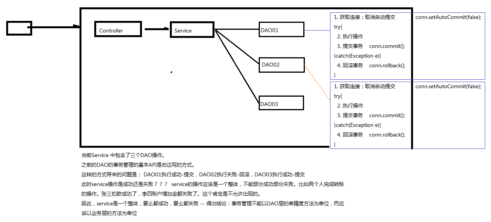

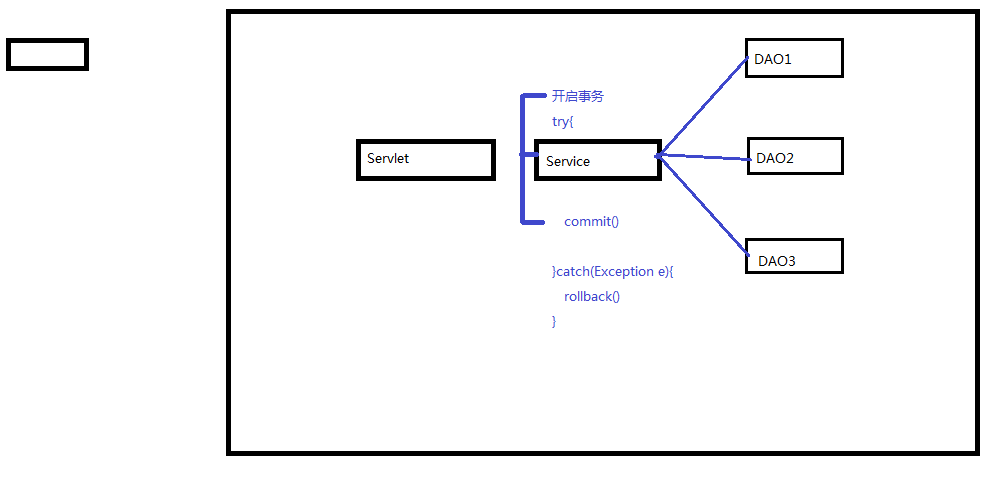


## 12.2 涉及到的组件

 - OpenSessionInViewFilter：负责事务的拦截

   ```java
   
   @WebFilter("*")
   public class OpenSessionInViewFilter implements Filter {
       @Override
       public void init(FilterConfig filterConfig) throws ServletException {
   
       }
   
       @Override
       public void doFilter(ServletRequest servletRequest, ServletResponse servletResponse, FilterChain filterChain) throws IOException, ServletException {
           try {
               TransactionManager.beginTrans();
               filterChain.doFilter(servletRequest, servletResponse);
               TransactionManager.commit();
           } catch (SQLException e) {
               try {
                   TransactionManager.rollback();
               } catch (SQLException ex) {
                   ex.printStackTrace();
               }
               e.printStackTrace();
           }
       }
   
       @Override
       public void destroy() {
   
       }
   }
   ```

 - TransactionManager：负责事务的管理

   ```java
   public class TransactionManager {
   
       public static void beginTrans() throws SQLException {
           ConnUtil.getConn().setAutoCommit(false);
       }
       public static void commit() throws SQLException {
           Connection conn = ConnUtil.getConn();
           conn.commit();
           conn.close();
       }
       public static void rollback() throws SQLException {
           ConnUtil.getConn().rollback();
       }
       public static void close() throws SQLException {
           Connection con = ConnUtil.getConn();
           if (!con.isClosed()) {
               con.close();
           }
       }
   }
   ```

 - ThreadLocal

 - ConnUtil：负责数据库的连接，包括操作ThreadLocal

   ```java
   public class ConnUtil {
       private static ThreadLocal<Connection> threadLocal = new ThreadLocal<>();
   
       public static final String DRIVER = "com.mysql.jdbc.Driver" ;
       public static final String URL = "jdbc:mysql://175.178.8.159:3306/fruitdb?useUnicode=true&characterEncoding=utf-8&useSSL=false";
       public static final String USER = "root";
       public static final String PWD = "ontoweb" ;
   
       public static Connection createConn() {
           try {
               // 1.加载驱动
               Class.forName(DRIVER);
               //2.通过驱动管理器获取连接对象
               return DriverManager.getConnection(URL, USER, PWD);
           } catch (ClassNotFoundException | SQLException e) {
               e.printStackTrace();
           }
           return null ;
       }
   
       public static Connection getConn() {
           if (threadLocal.get() == null)
               threadLocal.set(createConn());
           return threadLocal.get();
       }
   }
   
   ```

 - BaseDAO：JDBC数据库基本操作

   ```java
   public abstract class BaseDAO<T> {
       protected Connection conn ;
       protected PreparedStatement psmt ;
       protected ResultSet rs ;
   
       //T的Class对象
       private Class entityClass ;
   
       public BaseDAO() {
           //getClass() 获取Class对象，当前我们执行的是new FruitDAOImpl() , 创建的是FruitDAOImpl的实例
           //那么子类构造方法内部首先会调用父类（BaseDAO）的无参构造方法
           //因此此处的getClass()会被执行，但是getClass获取的是FruitDAOImpl的Class
           //所以getGenericSuperclass()获取到的是BaseDAO的Class
           Type genericType = getClass().getGenericSuperclass();
           //ParameterizedType 参数化类型
           Type[] actualTypeArguments = ((ParameterizedType) genericType).getActualTypeArguments();
           //获取到的<T>中的T的真实的类型
           Type actualType = actualTypeArguments[0];
   
           try {
               entityClass = Class.forName(actualType.getTypeName());
           } catch (ClassNotFoundException e) {
               e.printStackTrace();
               throw new DAOException("BaseDAO 构造方法出错了，可能的原因是没有指定<>中的类型");
           }
   
       }
   
       protected Connection getConn(){
           return ConnUtil.getConn();
       }
       
       //执行更新，返回影响行数
       protected int executeUpdate(String sql , Object... params) {
           boolean insertFlag = false ;
           insertFlag = sql.trim().toUpperCase().startsWith("INSERT");
   
           conn = getConn();
           try{
               if(insertFlag){
                   psmt = conn.prepareStatement(sql,Statement.RETURN_GENERATED_KEYS);
               }else {
                   psmt = conn.prepareStatement(sql);
               }
               setParams(psmt,params);
               int count = psmt.executeUpdate() ;
   
               if(insertFlag){
                   rs = psmt.getGeneratedKeys();
                   if(rs.next()){
                       return ((Long)rs.getLong(1)).intValue();
                   }
               }
               return 0 ;
           }catch (SQLException e){
               e.printStackTrace();
               throw new DAOException("BaseDAO executeUpdate出错了");
           }
       }
   }
   ```

   

## 12.3 ThreadLocal

- get() , set(obj)

- ThreadLocal称之为本地线程 。 我们可以通过set方法在当前线程上存储数据、通过get方法在当前线程上获取数据

- set方法源码分析：
  ```java
  public void set(T value) {
    Thread t = Thread.currentThread(); //获取当前的线程
    ThreadLocalMap map = getMap(t);    //每一个线程都维护各自的一个容器（ThreadLocalMap）
    if (map != null)
        map.set(this, value);          //这里的key对应的是ThreadLocal，因为我们的组件中需要传输（共享）的对象可能会有多个（不止Connection）
    else
        createMap(t, value);           //默认情况下map是没有初始化的，那么第一次往其中添加数据时，会去初始化
  }
  ```

  

- get方法源码分析：
     ```java
     public T get() {
       Thread t = Thread.currentThread(); //获取当前的线程
       ThreadLocalMap map = getMap(t);    //获取和这个线程（企业）相关的ThreadLocalMap（也就是工作纽带的集合）
       if (map != null) {
           ThreadLocalMap.Entry e = map.getEntry(this);   //this指的是ThreadLocal对象，通过它才能知道是哪一个工作纽带
           if (e != null) {
               @SuppressWarnings("unchecked")
               T result = (T)e.value;     //entry.value就可以获取到工具箱了
               return result;
           }
       }
       return setInitialValue();
     }
     ```

     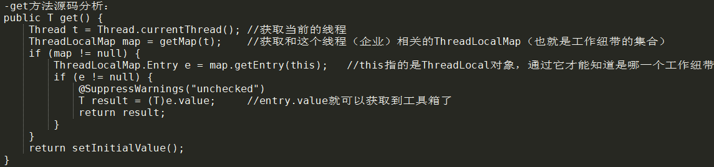

# 13 监听器

1) ServletContextListener - 监听ServletContext对象的创建和销毁的过程
2) HttpSessionListener - 监听HttpSession对象的创建和销毁的过程
3) ServletRequestListener - 监听ServletRequest对象的创建和销毁的过程
4) ServletContextAttributeListener - 监听ServletContext的保存作用域的改动(add,remove,replace)
5) HttpSessionAttributeListener - 监听HttpSession的保存作用域的改动(add,remove,replace)
6) ServletRequestAttributeListener - 监听ServletRequest的保存作用域的改动(add,remove,replace)
7) HttpSessionBindingListener - 监听某个对象在Session域中的创建与移除
8) HttpSessionActivationListener - 监听某个对象在Session域中的序列化和反序列化

<font color='red' size='5'>ServletContextListener的应用 - ContextLoaderListener</font>

在”10.2.1 控制反转“中IOC容器是beanMap在初始化完成时创建，这样可能导致第一次请求时间较长，我们希望应用启动时就把IOC容器创建好，可以通过监听ServletContext对象的创建来创建IOC容器

```xml
<context-param>
    <param-name>contextConfigLocation</param-name>
    <param-value>applicationContext.xml</param-value>
</context-param>
```

```java
//监听上下文启动，在上下文启动的时候去创建IOC容器,然后将其保存到application作用域
//后面中央控制器再从application作用域中去获取IOC容器
@WebListener
public class ContextLoaderListener implements ServletContextListener {
    @Override
    public void contextInitialized(ServletContextEvent servletContextEvent) {
        //1.获取ServletContext对象
        ServletContext application = servletContextEvent.getServletContext();
        //2.获取上下文的初始化参数
        String path = application.getInitParameter("contextConfigLocation");
        //3.创建IOC容器
        BeanFactory beanFactory = new ClassPathXmlApplicationContext(path);
        //4.将IOC容器保存到application作用域
        application.setAttribute("beanFactory",beanFactory);
    }

    @Override
    public void contextDestroyed(ServletContextEvent servletContextEvent) {

    }
}
```

# 14 Cookie

