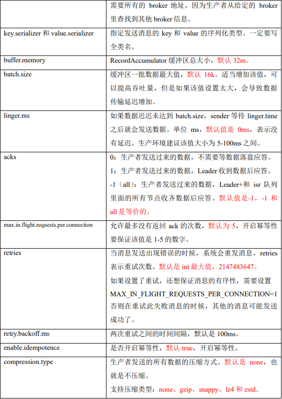
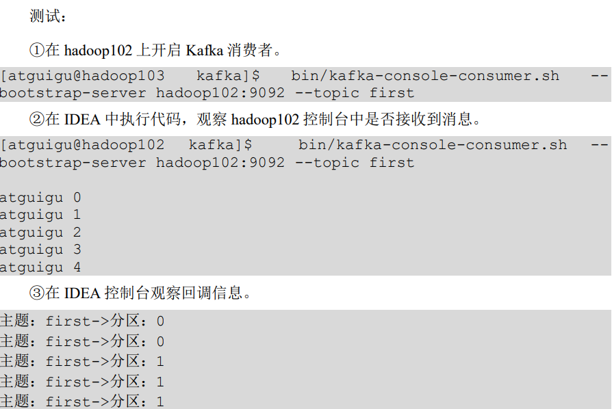
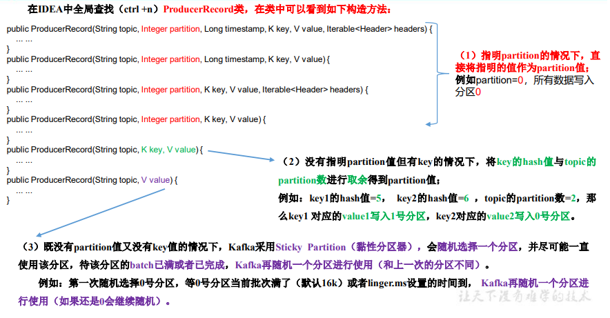
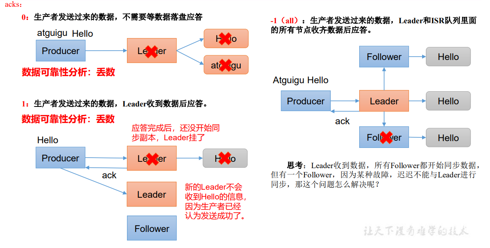
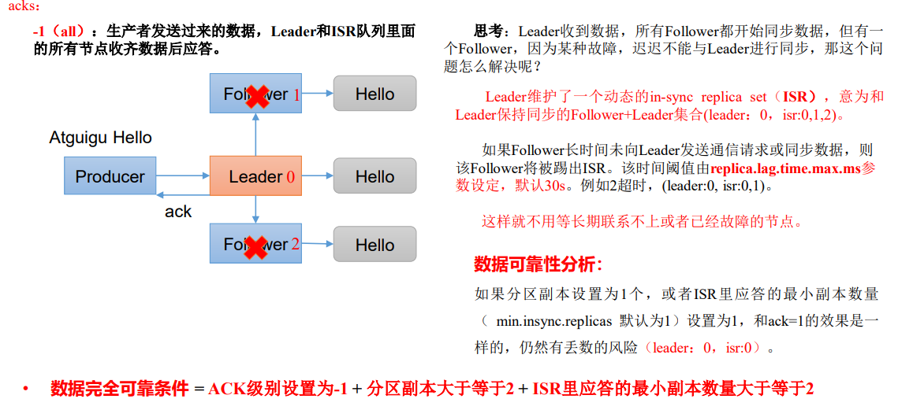
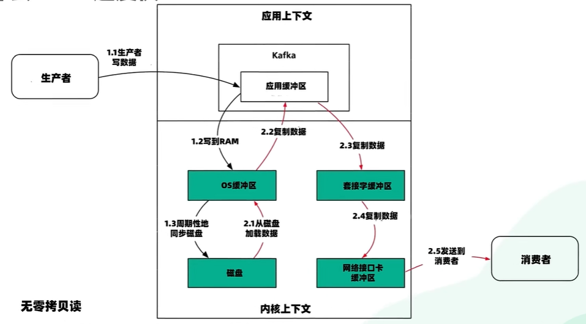

# 1. Kafka基础知识

## 1.1 定义

Kafka传统定义：Kafka是一个分布式的基于发布/订阅模式的消息队列（Message Queue），主要应用于大数据实时处理领域。 Kafka最新定义 ： Kafka是 一个开源的 分 布式事件流平台 （Event Streaming Platform），被数千家公司用于高性能数据管道、流分析、数据集成和关键任务应用。

## 1.2 消息队列

目 前企 业中比 较常 见的 消息 队列产 品主 要有 Kafka、ActiveMQ 、RabbitMQ 、 RocketMQ 等。 

在**大数据**场景主要采用 Kafka 作为消息队列。在 JavaEE 开发中主要采用 ActiveMQ、 RabbitMQ、RocketMQ。

### 1.2.1 传统消息队列的应用场景

传统的消息队列的主要应用场景包括：**缓存/消峰、解耦和异步通信**。

#### 1.2.1.1 缓冲/消峰

有助于控制和优化数据流经过系统的速度，解决生产消息和消费消息的处理速度不一致的情况。


#### 1.2.1.2 解耦

允许你独立的扩展或修改两边的处理过程，只要确保它们遵守同样的接口约束。


#### 1.2.1.3 异步通信

允许用户把一个消息放入队列，但并不立即处理它，然后在需要的时候再去处理它们。


### 1.2.2 消息队列的两种模式

#### 1.2.2.1 点对点模式

消费者主动拉取数据，消息收到后清除消息


#### 1.2.2.2 发布/订阅模式


## 1.3 Kafka基础架构


1. Producer：消息生产者，就是向 Kafka broker 发消息的客户端。 
2. Consumer：消息消费者，向 Kafka broker 取消息的客户端。 
3. Consumer Group（CG）：消费者组，由多个 consumer 组成。消费者组内每个消 费者负责消费不同分区的数据，一个分区只能由一个组内消费者消费；消费者组之间互不 影响。所有的消费者都属于某个消费者组，即消费者组是逻辑上的一个订阅者。 
4. Broker：一台 Kafka 服务器就是一个 broker。一个集群由多个 broker 组成。一个 broker 可以容纳多个 topic。 
5. Topic：可以理解为一个队列，生产者和消费者面向的都是一个 topic。 
6. Partition：为了实现扩展性，一个非常大的 topic 可以分布到多个 broker（即服 务器）上，一个 topic 可以分为多个 partition，每个 partition 是一个有序的队列。 
7. Replica：副本。一个 topic 的每个分区都有若干个副本，一个 Leader 和若干个 Follower。 
8. Leader：每个分区多个副本的“主”，生产者发送数据的对象，以及消费者消费数 据的对象都是 Leader。
9. Follower：每个分区多个副本中的“从”，实时从 Leader 中同步数据，保持和 Leader 数据的同步。Leader 发生故障时，某个 Follower 会成为新的 Leader。

# 2. Kafka安装与部署

# 3. Kafka生产者

## 3.1 生产者消息发送流程

### 3.1.1 发送原理

在消息发送的过程中，涉及到了两个线程——main 线程和 Sender 线程。在 main 线程 中创建了一个双端队列 RecordAccumulator。main 线程将消息发送给 RecordAccumulator， Sender 线程不断从 RecordAccumulator 中拉取消息发送到 Kafka Broker。


### 3.1.2 生产者重要参数列表




## 3.2 异步发送 API

### 3.2.1 普通异步发送

1. 需求：创建 Kafka 生产者，采用异步的方式发送到 Kafka Broker

2. 代码编写

   （1）创建工程 kafka 

   （2）导入依赖   org.apache.kafka kafka-clients 3.0.0  

   ```xml
   <dependencies>
        <dependency>
            <groupId>org.apache.kafka</groupId>
            <artifactId>kafka-clients</artifactId>
            <version>3.0.0</version>
        </dependency>
   </dependencies>
   ```

   （3）创建包名：com.atguigu.kafka.producer 

   （4）编写不带回调函数的 API 代码

   ```java
   import org.apache.kafka.clients.producer.KafkaProducer;
   import org.apache.kafka.clients.producer.ProducerRecord;
   import java.util.Properties;
   public class CustomProducer {
       public static void main(String[] args) throws InterruptedException {
           // 1. 创建 kafka 生产者的配置对象
           Properties properties = new Properties();
           // 2. 给 kafka 配置对象添加配置信息：bootstrap.servers
           properties.put(ProducerConfig.BOOTSTRAP_SERVERS_CONFIG, "hadoop102:9092");
           // key,value 序列化（必须）：key.serializer，value.serializer
           properties.put(ProducerConfig.KEY_SERIALIZER_CLASS_CONFIG, 
                          "org.apache.kafka.common.serialization.StringSerializer");
           properties.put(ProducerConfig.VALUE_SERIALIZER_CLASS_CONFIG, 
                          "org.apache.kafka.common.serialization.StringSerializer");
           // 3. 创建 kafka 生产者对象
           KafkaProducer<String, String> kafkaProducer = new KafkaProducer<String, String>(properties);
           // 4. 调用 send 方法,发送消息
           for (int i = 0; i < 5; i++) {
               kafkaProducer.send(new ProducerRecord<>("first","atguigu " + i));
           }
           // 5. 关闭资源
           kafkaProducer.close();
       }
   } 
   
   ```

   

### 3.2.2 带回调函数的异步发送

回调函数会在 producer 收到 ack 时调用，为异步调用，该方法有两个参数，分别是元 数据信息（RecordMetadata）和异常信息（Exception），如果 Exception 为 null，说明消息发 送成功，如果 Exception 不为 null，说明消息发送失败

**注意：消息发送失败会自动重试，不需要我们在回调函数中手动重试。**

```java
import org.apache.kafka.clients.producer.*;
import java.util.Properties;
public class CustomProducerCallback {
    public static void main(String[] args) throws 
        InterruptedException {
        // 1. 创建 kafka 生产者的配置对象
        Properties properties = new Properties();
        // 2. 给 kafka 配置对象添加配置信息
        properties.put(ProducerConfig.BOOTSTRAP_SERVERS_CONFIG, "hadoop102:9092");
        // key,value 序列化（必须）：key.serializer，value.serializer
        properties.put(ProducerConfig.KEY_SERIALIZER_CLASS_CONFIG, StringSerializer.class.getName());
        properties.put(ProducerConfig.VALUE_SERIALIZER_CLASS_CONFIG, StringSerializer.class.getName());
        // 3. 创建 kafka 生产者对象
        KafkaProducer<String, String> kafkaProducer = new KafkaProducer<String, String>(properties);
        // 4. 调用 send 方法,发送消息
        for (int i = 0; i < 5; i++) {
            // 添加回调
            kafkaProducer.send(new ProducerRecord<>("first", "atguigu " + i), new Callback() {
                // 该方法在 Producer 收到 ack 时调用，为异步调用
                @Override
                public void onCompletion(RecordMetadata metadata, Exception exception) {
                    if (exception == null) {
                        // 没有异常,输出信息到控制台
                        System.out.println(" 主题： "
                                           + metadata.topic() + "->" + "分区：" + metadata.partition());
                    } else {
                        exception.printStackTrace();// 出现异常打印
                    }
                }
            });
            Thread.sleep(2); // 延迟一会会看到数据发往不同分区
        }
        // 5. 关闭资源
        kafkaProducer.close();
    }
}

```



## 3.3 同步发送 API

只需在异步发送的基础上，再调用一下 get()方法即可。

```java
import org.apache.kafka.clients.producer.KafkaProducer;
import org.apache.kafka.clients.producer.ProducerRecord;
import java.util.Properties;
public class CustomProducer {
    public static void main(String[] args) throws InterruptedException {
        // 1. 创建 kafka 生产者的配置对象
        Properties properties = new Properties();
        // 2. 给 kafka 配置对象添加配置信息：bootstrap.servers
        properties.put(ProducerConfig.BOOTSTRAP_SERVERS_CONFIG, "hadoop102:9092");
        // key,value 序列化（必须）：key.serializer，value.serializer
        properties.put(ProducerConfig.KEY_SERIALIZER_CLASS_CONFIG, 
                       "org.apache.kafka.common.serialization.StringSerializer");
        properties.put(ProducerConfig.VALUE_SERIALIZER_CLASS_CONFIG, 
                       "org.apache.kafka.common.serialization.StringSerializer");
        // 3. 创建 kafka 生产者对象
        KafkaProducer<String, String> kafkaProducer = new KafkaProducer<String, String>(properties);
        // 4. 调用 send 方法,发送消息
        for (int i = 0; i < 5; i++) {
            kafkaProducer.send(new ProducerRecord<>("first","atguigu " + i)).get();
        }
        // 5. 关闭资源
        kafkaProducer.close();
    }
} 

```

## 3.4 生产者分区 

### 3.4.1 分区好处

（1）便于合理使用存储资源，每个Partition在一个Broker上存储，可以把海量的数据按照分区切割成一 块一块数据存储在多台Broker上。合理控制分区的任务，可以实现负载均衡的效果。 

（2）提高并行度，生产者可以以分区为单位发送数据；消费者可以以分区为单位进行消费数据。

### 3.4.2 生产者发送消息的分区策略

1）默认的分区器 DefaultPartitioner



### 3.4.3 自定义分区器

1. 需求 例如我们实现一个分区器实现，发送过来的数据中如果包含 atguigu，就发往 0 号分区， 不包含 atguigu，就发往 1 号分区。

2. 实现步骤 

   1. 定义类实现 Partitioner 接口。 
   2. 重写 partition()方法。

   ```java
   import org.apache.kafka.clients.producer.Partitioner;
   import org.apache.kafka.common.Cluster;
   import java.util.Map;
   /**
   * 1. 实现接口 Partitioner
   * 2. 实现 3 个方法:partition,close,configure
   * 3. 编写 partition 方法,返回分区号
   */
   public class MyPartitioner implements Partitioner {
       /**
   * 返回信息对应的分区
    * @param topic 主题
    * @param key 消息的 key
    * @param keyBytes 消息的 key 序列化后的字节数组
    * @param value 消息的 value
    * @param valueBytes 消息的 value 序列化后的字节数组
    * @param cluster 集群元数据可以查看分区信息
    * @return
    */
       @Override
       public int partition(String topic, Object key, byte[] 
                            keyBytes, Object value, byte[] valueBytes, Cluster cluster) {
           // 获取消息
           String msgValue = value.toString();
           // 创建 partition
           int partition;
           // 判断消息是否包含 atguigu
           if (msgValue.contains("atguigu")){
               partition = 0;
           }else {
               partition = 1;
           }
           // 返回分区号
           return partition;
       }
       // 关闭资源
       @Override
       public void close() {
       }
       // 配置方法
       @Override
       public void configure(Map<String, ?> configs) {
       }
   }
   
   ```

   （3）使用分区器的方法，在生产者的配置中添加分区器参数。

   ```java
   import org.apache.kafka.clients.producer.*;
   import java.util.Properties;
   public class CustomProducerCallbackPartitions {
       public static void main(String[] args) throws  InterruptedException {
           Properties properties = new Properties();
           properties.put(ProducerConfig.BOOTSTRAP_SERVERS_CONFIG,"hadoop102:9092");
           properties.put(ProducerConfig.KEY_SERIALIZER_CLASS_CONFIG, StringSerializer.class.getName());
           properties.put(ProducerConfig.VALUE_SERIALIZER_CLASS_CONFIG, StringSerializer.class.getName());
           // 添加自定义分区器
           properties.put(ProducerConfig.PARTITIONER_CLASS_CONFIG,
                          "com.atguigu.kafka.producer.MyPartitioner");
           KafkaProducer<String, String> kafkaProducer = new KafkaProducer<>(properties);
           for (int i = 0; i < 5; i++) {
               kafkaProducer.send(new ProducerRecord<>("first", "atguigu " + i), new Callback() {
                   @Override
                   public void onCompletion(RecordMetadata metadata, Exception e) {
                       if (e == null){
                           System.out.println(" 主题： " + 
                                                  metadata.topic() + "->" + "分区：" + metadata.partition()
                                                 );
                       }else {
                           e.printStackTrace();
                       }
                   }
               });
           }
           kafkaProducer.close();
       }
   }
   ```

## 3.5 生产经验 —— 生产者如何提高吞吐量

- batch.size：批次大小，默认16k  
- linger.ms：等待时间，修改为5-100ms 一次拉一个， 来了就走
- compression.type：压缩snappy 
- RecordAccumulator：缓冲区大小，修改为64m

```java
import org.apache.kafka.clients.producer.KafkaProducer;
import org.apache.kafka.clients.producer.ProducerRecord;
import java.util.Properties;
public class CustomProducerParameters {
    public static void main(String[] args) throws InterruptedException {
        // 1. 创建 kafka 生产者的配置对象
        Properties properties = new Properties();
        // 2. 给 kafka 配置对象添加配置信息：bootstrap.servers
        properties.put(ProducerConfig.BOOTSTRAP_SERVERS_CONFIG, "hadoop102:9092");
        // key,value 序列化（必须）：key.serializer，value.serializer
        properties.put(ProducerConfig.KEY_SERIALIZER_CLASS_CONFIG, 
                       "org.apache.kafka.common.serialization.StringSerializer");
        properties.put(ProducerConfig.VALUE_SERIALIZER_CLASS_CONFIG, 
                       "org.apache.kafka.common.serialization.StringSerializer");
        // batch.size：批次大小，默认 16K
        properties.put(ProducerConfig.BATCH_SIZE_CONFIG, 16384);
        // linger.ms：等待时间，默认 0
        properties.put(ProducerConfig.LINGER_MS_CONFIG, 1);
        // RecordAccumulator：缓冲区大小，默认 32M：buffer.memory
        properties.put(ProducerConfig.BUFFER_MEMORY_CONFIG, 33554432);
        // compression.type：压缩，默认 none，可配置值 gzip、snappy、 lz4 和 zstd
        properties.put(ProducerConfig.COMPRESSION_TYPE_CONFIG,"snappy");
        // 3. 创建 kafka 生产者对象
        KafkaProducer<String, String> kafkaProducer = new KafkaProducer<String, String>(properties);
        // 4. 调用 send 方法,发送消息
        for (int i = 0; i < 5; i++) {
            kafkaProducer.send(new ProducerRecord<>("first","atguigu " + i));
        }
        // 5. 关闭资源
        kafkaProducer.close();
    }
} 
```

## 3.6 生产经验——数据可靠性






可靠性总结：

- cks=0，生产者发送过来数据就不管了，可靠性差，效率高； 
- acks=1，生产者发送过来数据Leader应答，可靠性中等，效率中等； 
- acks=-1，生产者发送过来数据Leader和ISR队列里面所有Follwer应答，可靠性高，效率低；

 在生产环境中，acks=0很少使用；acks=1，一般用于传输普通日志，允许丢个别数据；acks=-1，一般用于传输和钱相关的数据， 对可靠性要求比较高的场景。


## 3.7 生产经验——数据去重

### 3.7.1 数据传递语义

- 至少一次（At Least Once）= ACK级别设置为-1 + 分区副本大于等于2 + ISR里应答的最小副本数量大于等于2
- 最多一次（At Most Once）= ACK级别设置为0
- 总结： At Least Once可以保证数据不丢失，但是不能保证数据不重复； At Most Once可以保证数据不重复，但是不能保证数据不丢失。 
- 精确一次（Exactly Once）：对于一些非常重要的信息，比如和钱相关的数据，要求数据既不能重复也不丢失。 Kafka 0.11版本以后，引入了一项重大特性：幂等性和事务。

# 面试题总结

## 1. Kafka 是什么

Kafka 是一个分布式消息队列系统，采用发布-订阅模式，支持多个生产者和消费者同时访问一个或多个主题(topic)，并提供了多种消息存储和传输方式，包括磁盘存储、内存存储和零拷贝技术等。

Kafka 的核心架构由若干个独立的节点组成，其中包括多个 Broker、多个 ZooKeeper 节点和多个生产者和消费者。Kafka 的数据存储采用分区机制，每个主题(topic)可以被分成多个分区(partition)，每个分区存储在多个 Broker 上，以提高数据可靠性和并发处理能力。

>ZooKeeper 在 Kafka 中起到以下几个作用：
>
>1. 维护集群元数据：Kafka 集群中的 Broker、Topic、Partition 等元数据信息都是存储在 ZooKeeper 中，ZooKeeper 提供了对这些元数据的统一管理和维护。
>2. 负责领导者选举：Kafka 集群中的每个 Partition 都会有一个 Leader 和多个 Follower，ZooKeeper 会协助进行领导者选举，确保每个 Partition 都有 Leader 以及 Follower 的同步数据。
>3. 监听 Broker 上下线：Kafka 集群中的 Broker 可能会因为各种原因宕机或者上线，ZooKeeper 会监测这些状态变化，并及时更新 Broker 的信息。
>4. 保存消费者 Offset：Kafka 消费者消费消息时，需要记录当前消费的位置，ZooKeeper 提供了一个稳定的存储方式来保存消费者 Offset，确保在消费者宕机后能够恢复消费状态。
>5. 管理 ACLs：ZooKeeper 提供了访问控制列表（ACLs）的功能，Kafka 通过 ZooKeeper 管理 ACLs，可以进行身份认证和权限管理，确保数据安全。
>
>总的来说，ZooKeeper 在 Kafka 中扮演着重要的角色，通过管理和维护集群元数据、领导者选举、Broker 上下线、消费者 Offset 保存以及权限管理等功能，保证了 Kafka 集群的可靠性、可扩展性和高性能。

## 2. partition 的数据文件（offset， MessageSize， data）

partition 中的每条 Message 包含了以下三个属性： offset， MessageSize， data， 其中 offset 表示 Message 在这个 partition 中的偏移量， offset 不是该 Message 在 partition 数据文件中的实际存储位置，而是逻辑上一个值，它唯一确定了 partition 中的一条 Message，可以认为 offset 是partition 中 Message 的 id； MessageSize 表示消息 内容 data 的大小； data 为 Message 的具体内容。

## 3. 和其他消息队列相比,Kafka的优势在哪里？

1. 高吞吐量：Kafka 能够处理数以千计的消息并发读写，具有很高的吞吐量（Kafka 在单位时间内处理的消息数量，在 Kafka 中，吞吐量是衡量 Kafka 性能的重要指标之一）。
2. 高可靠性：Kafka 采用分布式架构，每个节点都有备份机制，一旦某个节点宕机，数据不会丢失。
3. 高扩展性：Kafka 可以通过水平扩展（增加节点）来增加吞吐量和存储能力，支持横向扩展和纵向扩展。
4. 高灵活性：Kafka 可以根据不同的需求进行配置，支持多种数据格式和编解码方式。
5. 实时处理能力：Kafka 具有实时数据处理能力，可以处理实时数据和流数据，支持多种处理方式和工具。
6. 高性能和低延迟：Kafka 使用零拷贝技术和批量读写等优化手段，能够实现低延迟和高性能的数据处理。

   > **高性能的原因：**
   >
   > 1. 利用了 PageCache 缓存：
   >
   > 2. **磁盘顺序写（重点）**：
   >
   >    磁盘是由许多磁盘盘片叠在一起形成的，每个盘片都有两面，每一面上都有磁道，磁道被划分为若干个扇区。磁头需要在不同的盘片之间移动，定位到正确的磁道上，读取相应的扇区。这个过程需要耗费较长的时间，从而导致磁盘随机访问速度比顺序访问速度慢。
   >
   >    而Kafka是在文件末尾追加写的方式（顺序写）来保证其写入数据的高性能。
   >
   > 3. **零拷贝技术（重点）**
   >
   >    **没有使用零拷贝时的读写过程**
   >
   >    
   >
   >    **使用零拷贝的读写过程**
   >
   >    
   >
   >    DMA直接内存访问
   >
   > 4. pull 拉模式
   >
   >    采用 Pull 模式的好处是Consumer可以自主决定是否批量的从Broker拉取数据。

## 4. 队列模型了解吗？Kafka 的消息模型知道吗？

### 队列模型：早期的消息模型


**使用队列（Queue）作为消息通信载体，满足生产者与消费者模式，一条消息只能被一个消费者使用，未被消费的消息在队列中保留直到被消费或超时。**

比如：我们生产者发送 100 条消息的话，两个消费者来消费一般情况下两个消费者会按照消息发送的顺序各自消费一半（也就是你一个我一个的消费。）

**队列模型存在的问题：**

假如我们存在这样一种情况：我们需要将生产者产生的消息分发给多个消费者，并且每个消费者都能接收到完整的消息内容。

### 发布-订阅模型:Kafka 消息模型

发布-订阅模型主要是为了解决队列模型存在的问题


**在发布 - 订阅模型中，如果只有一个订阅者，那它和队列模型就基本是一样的了。所以说，发布 - 订阅模型在功能层面上是可以兼容队列模型的。**

**Kafka 采用的就是发布 - 订阅模型。**

> **RocketMQ 的消息模型和 Kafka 基本是完全一样的。唯一的区别是 Kafka 中没有队列这个概念，与之对应的是 Partition（分区）。**

## 5. 什么是Producer、Consumer、Broker、Topic、Partition？


上面这张图也为我们引出了，Kafka 比较重要的几个概念：

1. **Producer（生产者）** : 产生消息的一方。
2. **Consumer（消费者）** : 消费消息的一方。
3. **Broker（代理）** : 可以看作是一个独立的 Kafka 实例。多个 Kafka Broker 组成一个 Kafka Cluster。

同时，你一定也注意到每个 Broker 中又包含了 Topic 以及 Partition 这两个重要的概念：

- **Topic（主题）** : Producer 将消息发送到特定的主题，Consumer 通过订阅特定的 Topic(主题) 来消费消息。
- **Partition（分区）** : Partition 属于 Topic 的一部分。一个 Topic 可以有多个 Partition ，并且同一 Topic 下的 Partition 可以分布在不同的 Broker 上，这也就表明一个 Topic 可以横跨多个 Broker 。这正如我上面所画的图一样。

> 划重点：**Kafka 中的 Partition（分区） 实际上可以对应成为消息队列中的队列，每个partition是一个有序的队列。这样是不是更好理解一点？**

## 6. Kafka 的多副本机制了解吗？带来了什么好处？

Kafka 将每个 Partition 的数据分为多个副本，其中一个为 Leader 副本，其余为 Follower 副本。Leader 副本负责处理读写请求，Follower 副本则负责同步 Leader 副本的数据。当 Leader 副本宕机或出现故障时，Follower 副本可以接替成为新的 Leader 副本，确保数据的持久性和可靠性。

>副本之间的数据复制是通过 Leader-Follower 机制来实现的。具体来说，当 Producer 将消息发送到 Kafka 的一个 Partition 上时，Leader 副本会负责接收和处理该消息，并将其写入本地的日志文件中。随后，Leader 副本会将该消息发送给所有 Follower 副本，Follower 副本接收到消息后将其写入本地的日志文件中，并向 Leader 副本发送确认消息。
>
>Kafka 使用异步复制机制，即 Leader 副本不会等待所有 Follower 副本的确认消息，而是将消息直接发送给 Follower 副本并等待 Follower 副本的确认。如果 Follower 副本在一定时间内未能确认，则会进行重试，直到数据被所有 Follower 副本确认为止。当 Leader 副本收到大多数 Follower 副本的确认消息后，即可认为消息已经被成功复制到所有副本中。

**好处**

1. Kafka 通过给特定 Topic 指定多个 Partition, 而各个 Partition 可以分布在不同的 Broker 上, 这样便能提供比较好的并发能力（负载均衡）。
2. Partition 可以指定对应的 Replica 数, 这也极大地提高了消息存储的安全性, 提高了容灾能力，不过也相应的增加了所需要的存储空间

## 7. Zookeeper 在 Kafka 中的作用知道吗？

1. 维护集群元数据：Kafka 集群中的 Broker（Broker注册）、Topic（Topic注册）、Partition 等元数据信息都是存储在 ZooKeeper 中，ZooKeeper 提供了对这些元数据的统一管理和维护。

2. 监听 Broker 上下线：Kafka 集群中的 Broker 可能会因为各种原因宕机或者上线，ZooKeeper 会监测这些状态变化，并及时更新 Broker 的信息。

   > **更好的说法**：
   >
   > 管理Broker状态：Kafka中的Broker会将自己的状态（存活或故障）注册到Zookeeper中，Kafka通过Zookeeper来感知Broker的状态变化。

3. Topic注册：在Kafka中，同一个**Topic的消息会被分成多个分区**并将其分布在多个Broker上，**这些分区信息及与Broker的对应关系**也都是由Zookeeper在维护，由专门的节点来记录

4. 保存消费者 Offset：Kafka 消费者消费消息时，需要记录当前消费的位置，ZooKeeper 提供了一个稳定的存储方式来保存消费者 Offset，确保在消费者宕机后能够恢复消费状态。

5. 生产者负载均衡：同一个Topic消息会被分区并将其分布在多个Broker上。由于每个Broker启动时，都会在Zookeeper上进行注册，生产者会通过该节点的变化来动态地感知到Broker服务器列表的变更，这样就可以实现动态的负载均衡。

6. 消费者注册：当一个Consumer启动时，它首先会向Zookeeper注册自己，并创建一个消费者节点。节点的信息包括订阅的Partition信息、最后一次心跳时间等。

## 8. Kafka 如何保证消息的消费顺序？

我们在使用消息队列的过程中经常有业务场景需要严格保证消息的消费顺序，比如我们同时发了 2 个消息，这 2 个消息对应的操作分别对应的数据库操作是：

1. 更改用户会员等级。
2. 根据会员等级计算订单价格。

假如这两条消息的消费顺序不一样造成的最终结果就会截然不同。

我们知道 Kafka 中 Partition(分区)是真正保存消息的地方，我们发送的消息都被放在了这里。而我们的 Partition(分区) 又存在于 Topic(主题) 这个概念中，并且我们可以给特定 Topic 指定多个 Partition。


每次添加消息到 Partition(分区) 的时候都会采用尾加法，如上图所示。 **Kafka 只能为我们保证 Partition(分区) 中的消息有序。**

> 消息在被追加到 Partition(分区)的时候都会分配一个特定的偏移量（offset）。Kafka 通过偏移量（offset）来保证消息在分区内的顺序性。

所以，我们就有一种很简单的保证消息消费顺序的方法：**1 个 Topic 只对应一个 Partition**。这样当然可以解决问题，但是破坏了 Kafka 的设计初衷。

Kafka 中发送 1 条消息的时候，可以指定 topic, partition, key,data（数据） 4 个参数。如果你发送消息的时候指定了 Partition 的话，所有消息都会被发送到指定的 Partition。并且，同一个 key 的消息可以保证只发送到同一个 partition，这个我们可以采用表/对象的 id 来作为 key 。

总结一下，对于如何保证 Kafka 中消息消费的顺序，有了下面两种方法：

1. 1 个 Topic 只对应一个 Partition。
2. （推荐）发送消息的时候指定 key/Partition。

当然不仅仅只有上面两种方法，上面两种方法是我觉得比较好理解的，

## 9. Kafka 如何保证消息不丢失

### 9.1 生产者丢失消息的情况

生产者(Producer) 调用`send`方法发送消息之后，消息可能因为网络问题并没有发送过去。

所以，我们不能默认在调用`send`方法发送消息之后消息发送成功了。为了确定消息是发送成功，我们要判断消息发送的结果。但是要注意的是 Kafka 生产者(Producer) 使用 `send` 方法发送消息实际上是异步的操作，我们可以通过 `get()`方法获取调用结果，但是这样也让它变为了同步操作，示例代码如下：

```java
SendResult<String, Object> sendResult = kafkaTemplate.send(topic, o).get();
if (sendResult.getRecordMetadata() != null) {
  logger.info("生产者成功发送消息到" + sendResult.getProducerRecord().topic() + "-> " + sendRe
              sult.getProducerRecord().value().toString());
}
```

但是一般不推荐这么做！可以采用为其添加回调函数的形式，示例代码如下：

```java
ListenableFuture<SendResult<String, Object>> future = kafkaTemplate.send(topic, o);
future.addCallback(result -> logger.info("生产者成功发送消息到topic:{} partition:{}的消息", 
                                         result.getRecordMetadata().topic(), 
                                         result.getRecordMetadata().partition()),
                                      ex -> logger.error("生产者发送消失败，原因：{}", ex.getMessage()));
```

如果消息发送失败的话，我们检查失败的原因之后重新发送即可！

另外这里推荐为 Producer 的`retries `（重试次数）设置一个比较合理的值，一般是 3 ，但是为了保证消息不丢失的话一般会设置比较大一点。设置完成之后，当出现网络问题之后能够自动重试消息发送，避免消息丢失。另外，建议还要设置重试间隔，因为间隔太小的话重试的效果就不明显了，网络波动一次你3次一下子就重试完了

### 9.2 消费者丢失消息的情况

我们知道消息在被追加到 Partition(分区)的时候都会分配一个特定的偏移量（offset）。偏移量（offset)表示 Consumer 当前消费到的 Partition(分区)的所在的位置。Kafka 通过偏移量（offset）可以保证消息在分区内的顺序性。


当消费者拉取到了分区的某个消息之后，消费者会自动提交了 offset。自动提交的话会有一个问题，试想一下，当消费者刚拿到这个消息准备进行真正消费的时候，突然挂掉了，消息实际上并没有被消费，但是 offset 却被自动提交了。

**解决办法也比较粗暴，我们手动关闭自动提交 offset，每次在真正消费完消息之后再自己手动提交 offset 。** 但是，细心的朋友一定会发现，这样会带来消息被重新消费的问题。比如你刚刚消费完消息之后，还没提交 offset，结果自己挂掉了，那么这个消息理论上就会被消费两次。

### 9.3 Kafka 弄丢了消息

试想一种情况：假如 leader 副本所在的 broker 突然挂掉，那么就要从 follower 副本重新选出一个 leader ，但是 leader 的数据还有一些没有被 follower 副本的同步的话，就会造成消息丢失。

**设置 acks = all**

解决办法就是我们设置 **acks = all**。acks 是 Kafka 生产者(Producer) 很重要的一个参数。

acks 的默认值即为1，代表我们的消息被leader副本接收之后就算被成功发送。当我们配置 **acks = all** 表示只有所有 ISR 列表的副本全部收到消息时，生产者才会接收到来自服务器的响应. 这种模式是最高级别的，也是最安全的，可以确保不止一个 Broker 接收到了消息. 该模式的延迟会很高。

> ISR（In-Sync Replicas）指的是与主副本保持同步的副本列表，也就是与主副本保持一致的副本集合。ISR 列表的大小可以通过参数 `min.insync.replicas` 来配置，该参数指定了至少有多少个副本必须与主副本保持同步，才能视为写入操作完成。

**设置 replication.factor >= 3**

为了保证 leader 副本能有 follower 副本能同步消息，我们一般会为 topic 设置 **replication.factor >= 3**。这样就可以保证每个 分区(partition) 至少有 3 个副本。虽然造成了数据冗余，但是带来了数据的安全性。

**设置 min.insync.replicas > 1**

一般情况下我们还需要设置 **min.insync.replicas> 1** ，这样配置代表消息至少要被写入到 2 个副本才算是被成功发送。**min.insync.replicas** 的默认值为 1 ，在实际生产中应尽量避免默认值 1。

## 10. Kafka 如何保证消息不重复消费

**kafka出现消息重复消费的原因：**

- 服务端侧已经消费的数据没有成功提交 offset（**根本原因**）。

- Kafka 侧 由于服务端处理业务时间长或者网络链接等等原因让 Kafka 认为服务假死，触发了分区 rebalance。

  > 在分区 rebalance 过程中，Kafka 会重新分配分区的负载，将分区从一个消费者转移给另一个消费者，以实现负载均衡。

**解决方案：**

- 消费消息服务做幂等校验，比如 Redis 的set、MySQL 的主键等天然的幂等功能。这种方法最有效。

  >**幂等校验**：无论消息被发送多少次，最终效果都只会产生一次。在 Kafka 中，幂等性是通过以下两个机制来实现的：
  >
  >1. 序列号：生产者在发送消息时，会给每条消息分配一个唯一的序列号。Kafka 会将序列号作为消息的主键，在接收到重复序列号的消息时会自动将其过滤掉，从而保证消息的幂等性。
  >2. 事务：Kafka 支持事务机制，可以将多个消息放在一个事务中一起发送，从而保证这些消息的原子性和幂等性。如果事务提交失败，则所有消息都会被回滚，保证消息发送的一致性。
  >
  >**幂等消费机制需要消费者手动开启，开启后，Kafka 会将每条消息的 offset 与一个幂等序列号关联，消费者只有在获得新的幂等序列号后才会进行消费，这样可以保证消息只被消费一次，从而避免消息重复消费的问题。**

- 将 `enable.auto.commit` 参数设置为 false，关闭自动提交，开发者在代码中手动提交 offset。那么这里会有个问题：

  什么时候提交offset合适？

  - 处理完消息再提交：依旧有消息重复消费的风险，和自动提交一样
  - 拉取到消息即提交：会有消息丢失的风险。允许消息延时的场景，一般会采用这种方式。然后，通过定时任务在业务不繁忙（比如凌晨）的时候做数据兜底。

## 11. 负载均衡

由于消息 topic 由多个 partition 组成， 且 partition 会均衡分布到不同 broker 上，因此，为了有效利用 broker 集群的性能，提高消息的吞吐量， producer 可以通过随机或者 hash 等方式，将消息平均发送到多个 partition 上，以实现负载均衡。

## 12. Kafka的设计

Kafka 将消息以 topic 为单位进行归纳，发布消息的程序称为 **Producer**，消费消息的程序称为 **Consumer**。它是以集群的方式运行，可以由一个或多个服务组成，每个服务叫做一个 **Broker**，Producer 通过网络将消息发送到 kafka 集群，集群向消费者提供消息，broker 在中间起到一个代理保存消息的中转站。

**Kafka 中重要的组件**

*1）Producer*：消息生产者，发布消息到Kafka集群的终端或服务

*2）Broker*：一个 Kafka 节点就是一个 Broker，多个Broker可组成一个Kafka 集群。

> 如果某个 Topic 下有 n 个Partition 且集群有 n 个Broker，那么每个 Broker会存储该 Topic 下的一个 Partition
>
> 如果某个 Topic 下有 n 个Partition 且集群中有 m+n 个Broker，那么只有 n 个Broker会存储该Topic下的一个 Partition
>
> 如果某个 Topic 下有 n 个Partition 且集群中的Broker数量小于 n，那么一个 Broker 会存储该 Topic 下的一个或多个 Partition，这种情况尽量避免，会导致集群数据不均衡

*3）Topic*：消息主题，每条发布到Kafka集群的消息都会归集于此，Kafka是面向Topic 的

*4）Partition*：Partition 是Topic在物理上的分区，一个Topic可以分为多个Partition，每个Partition是一个有序的不可变的记录序列。单一主题中的分区有序，但无法保证主题中所有分区的消息有序。

*5）Consumer*：从Kafka集群中消费消息的终端或服务

*6）Consumer Group*：每个Consumer都属于一个Consumer Group，每条消息只能被Consumer Group中的一个Consumer消费，但可以被多个Consumer Group消费。

*7）Replica*：Partition 的副本，用来保障Partition的高可用性。

*8）Controller：* Kafka 集群中的其中一个服务器，用来进行Leader election以及各种 Failover 操作。

*9）Zookeeper*：Kafka 通过Zookeeper来存储集群中的 meta 消息

## 13、Kafka 文件高效存储设计原理

Kafka 通过分段存储和索引机制来实现高效的数据存储和读写。

1. 分段存储：Kafka 将每个分区（Partition）的消息以时间顺序分成多个段（Segment）进行存储，每个段的大小默认为 1GB，可以通过配置进行调整。每个段的消息以追加的方式存储在磁盘上，避免了磁盘的随机访问，提高了数据写入的效率。
2. 索引机制：为了快速定位消息，Kafka 使用了两级索引机制。**第一级索引**由一组定长的索引文件组成，**每个索引文件对应一个段文件**，**记录该段文件中消息的起始位置和偏移量**。**第二级索引**由一个定长的“偏移量索引文件”（Offset Index File）和一个变长的“偏移量索引快照文件”（Offset Index Snapshot File）组成，**记录每个段文件的最后一个消息的偏移量和时间戳**。

当消费者需要获 取某个分区的消息时，**先从第二级索引中找到该消息所在的段文件，然后在该段文件的索引文件中查找该消息的偏移量和位置**，最后从磁盘中读取该消息。这种索引机制能够快速定位消息，避免了对整个消息存储文件的扫描，提高了数据读取的效率。

## 14. Kafka 的应用场景

### 14.0 消息系统

广泛用于消息中间件

### 14.1 缓冲/削峰

有助于控制和优化数据流经过系统的速度，解决生产消息和消费消息的处理速度不一致的情况。


#### 14.2 系统解耦

允许你独立的扩展或修改两边的处理过程，只要确保它们遵守同样的接口约束。


### 14.3 异步处理

通过异步处理机制，可以把一个消息放入队列中，但不立即处理它，在需要的时候再进行处理


### 14.4 日志聚合 / 日志同步

可收集各种服务的日志写入kafka的消息队列进行存储

在大型业务系统设计中，为了快速定位问题，全链路追踪日志，以及故障及时预警监控，通常需要将各系统应用的日志集中分析处理。

Kafka设计初衷就是为了应对大量日志传输场景，应用通过异步方式将日志消息同步到消息服务，再通过其他组件对日志做实时或离线分析，也可用于关键日志信息收集进行应用监控。

日志同步主要有三个关键部分：日志采集客户端，Kafka消息队列以及后端的日志处理应用。

1. 日志采集客户端，负责用户各类应用服务的日志数据采集，以消息方式将日志“批量”、“异步”发送Kafka客户端。

   Kafka客户端批量提交和压缩消息，对应用服务的性能影响非常小。

2. Kafka将日志存储在消息文件中，提供持久化。

3. 日志处理应用，如Logstash，订阅并消费Kafka中的日志消息，最终供文件搜索服务检索日志，或者由Kafka将消息传递给Hadoop等其他大数据应用系统化存储与分析。


## 15. 分区（Partition）的概念

主题是一个逻辑上的概念，还可以细分为多个分区，一个分区只属于单个主题，很多时候也会把分区称为主题分区（Topic-Partition）。同一主题下的不同分区包含的消息是不同的，**分区在存储层面可以看做一个可追加的`日志文件` ，消息在被追加到分区日志文件的时候都会分配一个特定的偏移量（offset）**。**offset 是消息在分区中的唯一标识，kafka 通过它来保证消息在分区内的顺序性，**不过 offset 并不跨越分区，也就是说，kafka保证的是分区有序而不是主题有序。

在分区中又引入了**多副本（replica）**的概念，通过增加副本数量可以提高容灾能力。同一分区的不同副本中保存的是相同的消息。副本之间是一主多从的关系，其中主（Leader）副本负责读写，从（Follower）副本只负责消息同步。副本处于不同的 broker 中，当主副本出现异常，便会在从副本中提升一个为主副本。

## 16. 分区原则

总的来讲，Kafka生产消息的分区规则是：

- 如果指定了partition，则直接使用；
- 如果没有指定partition但设置了key，则对key进行hash后对分区数取模，确定一个partition；
- 如果没指定partition又没设置key，则轮询出一个partition。

## 17. Kafka 为什么要把消息分区

1. **方便在集群中扩展**，每个 Partition 可用通过调整以适应它所在的机器，而一个Topic又可以有多个Partition组成，因此整个集群就可以适应任意大小的数据了
2. **可以提高并发**，因为可以以Partition为单位进行读写

## 18. Kafka 中生产者运行流程

在消息发送的过程中，涉及到了两个线程——main 线程和 Sender 线程。在 main 线程 中创建了一个双端队列 RecordAccumulator。main 线程将消息发送给 RecordAccumulator， Sender 线程不断从 RecordAccumulator 中拉取消息发送到 Kafka Broker。


## 19. Kafka 消息的消费模式

> Kafka采用大部分消息系统遵循的传统模式：Producer将消息推送到Broker，Consumer从Broker获取消息。

如果采用 **Push** 模式，则Consumer难以处理不同速率的上游推送消息。

采用 Pull 模式的好处是Consumer可以自主决定是否批量的从Broker拉取数据。Pull模式有个缺点是，如果Broker没有可供消费的消息，将导致Consumer不断在循环中轮询，直到新消息到达。为了避免这点，Kafka有个参数可以让Consumer阻塞直到新消息到达。

>参数叫做`fetch.max.wait.ms`，它表示Consumer在拉取消息时的最大等待时间。如果设置为0，表示立即返回当前可用的消息，如果设置为正数，则表示最多等待这么多毫秒。当该值大于0时，Consumer可能需要等待一段时间直到有新的消息到达。当等待时间达到设定的上限时，Consumer将立即返回已经拉取到的消息。

## 20. Kafka 如何实现负载均衡与故障转移

**负载均衡**

一个Topic可以有多个分区，一个分区对应着一个Leader副本和多个Follower副本，而直接参与读写的就是Leader副本。Kafka负载均衡就是集群中每个Broker都有平等的机会为客户端（生产者和消费者）提供服务，它是通过智能化算法将Leader副本均匀的分配到各个Broker上来实现整体上的负载均衡。如果某个Broker上的Leader挂了，则其中一个Follower副本会顶上来替代Leader的角色。比如说生产者负载均衡。。。。。再比如说消费者负载均衡。。。。。

**故障转移**

ZooKeeper 通过“会话机制”实现了故障转移的功能。

在 Kafka 集群启动时，有一个Broker会通过竞争成为Controller 节点，其他 Broker 会在 ZooKeeper 上监听该节点。当 Controller 失效时，会话超时机制会通知其他 Broker 竞争该节点，竞争成功的 Broker 将成为新的 Controller，负责管理整个 Kafka 集群的状态。通过这种方式，Kafka 实现了故障转移，确保了整个集群的可用性。

## 21. Kafka 中消费者与消费者组的关系与负载均衡实现

Consumer Group 是Kafka独有的**可扩展且具有容错性**的消费者机制。一个组内可以有多个Consumer，它们共享一个全局唯一的Group ID。组内的所有Consumer协调在一起来消费订阅主题（Topic）内的所有分区（Partition）。当然，每个Partition只能由同一个Consumer Group内的一个Consumer 来消费。消费者的数量通常不超过分区的数量，且二者最好保持整数倍的关系，这样不会造成有空闲的消费者。

>- 若consumer数量大于partition数量，会造成限制的consumer，产生浪费。
>- 若consumer数量小于partition数量，可能会导致均衡失效，其中的某个或某些consumer会消费更多的任务。
>
>Consumer 订阅的是Topic的Partition，而不是Message。所以在同一时间点上，订阅到同一个分区的Consumer必然属于不同的Consumer Group

Consumer Group与Consumer的关系是动态维护的，当一个Consumer进程挂掉或者是卡住时，该Consumer所订阅的Partition会被重新分配到该组内的其他Consumer上，当一个Consumer加入到一个Consumer Group中时，同样会从其他的Consumer中分配出一个或者多个Partition到这个新加入的Consumer。

**负载均衡**

为了维持Consumer与Consumer Group之间的关系，Consumer 会周期性地发送 hearbeat 到 coordinator（协调者），如果有 hearbeat 超时或未收到 hearbeat，coordinator 会认为该Consumer已经退出，那么它所订阅的Partition会分配到同一组内的其他Consumer上，这个过程称为 rebalance（再平衡）

>在 Kafka 中，coodinator是指协调消费者组中消费者之间的协作。它是一个专门用于管理消费者组的 Kafka Broker 节点，为消费者组提供协调服务，包括负载均衡、监控消费者健康状况、检测消费者宕机并重新分配分区等功能。每个消费者组都有一个独立的 coodinator，该 coodinator 只能管理该消费者组的消费者，不会干扰其他消费者组的协调工作。同时，一个 Kafka Broker 节点可以同时充当多个消费者组的 coodinator。

## 22. 生产过程中何时会发生QueueFullExpection以及如何处理

在Kafka中，QueueFullException是指当生产者尝试向已满的Kafka队列写入消息时，抛出的异常。这通常是由于生产者生产速度过快，而消费者消费速度过慢，导致Kafka队列的大小已经达到了最大限制。

解决方法：

1. 调整生产者生产速度：可以通过调整生产者的生产速度，使其与消费者的消费速度保持相同的水平，避免队列拥堵。
2. 暂停生产者：当发现队列已经快要满了时，可以暂停生产者一段时间，等待消费者消费一部分消息之后再继续生产。
3. 调整队列大小：可以通过修改Kafka的配置文件，调整队列的大小，使其能够容纳更多的消息。
4. 增加分区数：可以通过增加Kafka分区的数量，让消息分散到更多的分区中，从而缓解队列拥堵的问题。

## 23. Consumer 如何消费指定分区消息

Cosumer 消费消息时，向Broker 发出 `fetch` 请求去消费特定分区的消息，Consumer 可以通过指定消息在日志中的偏移量 offset，就可以从这个位置开始消息消息，Consumer 拥有了 offset 的控制权，也可以向后回滚去重新消费之前的消息。

也可以使用 `seek(Long topicPartition)` 来指定消费的位置。

## 24. Replica、Leader 和 Follower 三者的概念

Replica：Kafka 中的 Partition 是有序消息日志，为了实现高可用性，需要采用备份机制，将相同的数据复制到多个Broker上，而这些备份日志就是 Replica，目的是为了 **防止数据丢失**。所有Partition 的副本默认情况下都会均匀地分布到所有 Broker 上,一旦领导者副本所在的Broker宕机，Kafka 会从追随者副本中选举出新的领导者继续提供服务。

**Leader：** 副本中的领导者。负责对外提供服务，与客户端进行交互。生产者总是向 Leader副本些消息，消费者总是从 Leader 读消息

**Follower：** 副本中的追随者。被动地追随 Leader，不能与外界进行交付。只是向Leader发送消息，请求Leader把最新生产的消息发给它，进而保持同步。

## 25. Kafka 中 AR、ISR、OSR 三者的概念

- AR（Assigned Replicas）：分区中所有副本称为 AR
- ISR（In-Sync Replicas）：所有与主副本保持一定程度同步的副本（包括主副本）称为 ISR
- OSR（Out-of-Sync Replicas）：与主副本滞后过多的副本组成 OSR

## 26. 分区副本什么情况下会从 ISR 中剔出

每个Partition都会有一个ISR列表，而且是由Leader动态维护。所谓动态维护，就是说如果一个Follower比一个Leader落后太多，或者超过一定时间未发起数据复制请求，则Leader将其从ISR中移除。当ISR中所有Replica都向Leader发送ACK（Acknowledgement确认）时，Leader才commit。

## 27. 分区副本中的 Leader 如果宕机但 ISR 却为空该如何处理

可以通过配置`unclean.leader.election` ：

- **true**：允许 OSR 成为 Leader，但是 OSR 的消息较为滞后，可能会出现消息不一致的问题
- **false**：会一直等待旧 leader 恢复正常，降低了可用性

## 28. 如何判断一个 Broker 是否还有效

1. 心跳机制：Kafka 使用心跳机制来检测 Broker 是否还存活，每个 Broker 定期向 ZooKeeper 发送心跳信息，如果在一定时间内没有收到 Broker 的心跳，则认为该 Broker 宕机，其他 Broker 会重新选举出一个新的 Controller，并将旧的 Broker 上的 Partition 重新分配到其他 Broker 上。
2. 连接超时机制：Kafka 还使用了连接超时机制来检测 Broker 是否还存活。如果 Producer 或 Consumer 无法连接到 Broker 或者与 Broker 的连接在一定时间内没有收到消息，则认为该 Broker 宕机。
3. 自动故障转移机制：当某个 Broker 宕机时，Kafka 会自动进行故障转移，将宕机 Broker 上的 Partition 分配到其他存活的 Broker 上。

## 29. Kafka 可接收的消息最大默认多少字节，如何修改

Kafka 默认接收消息的最大字节数为1MB（1048576字节），可以通过修改`server.properties`配置文件中的`message.max.bytes`属性来进行修改，例如：

```
message.max.bytes=2097152
```

这将把消息最大字节数增加到2MB。需要注意的是，如果要修改这个属性，还需要相应地将相关的客户端（比如Consumer）配置中的`fetch.Message.max.bytess`也进行修改，否则会因为消息过大而被拒绝。

## 30. Kafka 的 ACK 机制

- **0：** 相当于异步操作，Producer 不需要Leader给予回复，发送完就认为成功，继续发送下一条（批）Message。**此机制具有最低延迟，但是持久性可靠性也最差，当服务器发生故障时，很可能发生数据丢失。**
- **1：** Kafka 默认的设置。表示 Producer 要 Leader 确认已成功接收数据才发送下一条（批）Message。不过 Leader 宕机，Follower 尚未复制的情况下，数据就会丢失。**此机制提供了较好的持久性和较低的延迟性。**
- **-1（all）：** Leader 接收到消息之后，还必须要求ISR列表里跟Leader保持同步的那些Follower都确认消息已同步，Producer 才发送下一条（批）Message。**此机制持久性可靠性最好，但延时性最差。**

## 31. Kafka 的 consumer 如何消费数据

在Kafka中，Producers将消息推送给Broker端，在Consumer和Broker建立连接之后，会主动去 Pull（或者说Fetch）消息。这种模式有些优点：

- 首先Consumer端可以根据自己的消费能力适时的去fetch消息并处理，且可以控制消息消费的进度（offset）；
- 此外，消费者可以控制每次消费的数，实现批量消费。

## 32. Kafka 提供的API有哪些

1. 生产者 API：提供了生产者发送消息到 Kafka 集群的方法，包括同步发送、异步发送、自定义分区等。
2. 消费者 API：提供了消费者从 Kafka 集群中消费消息的方法，包括手动提交偏移量、自动提交偏移量、再均衡（Rebalance）等。
3. 管理员 API：提供了对 Kafka 集群进行管理的方法，包括创建 Topic、删除 Topic、查看 Topic 等。
4. 流处理 API：提供了流处理的功能，包括对实时数据进行处理、转换、聚合等。
5. 连接器 API：提供了与其他数据存储系统（如数据库、消息队列等）进行连接的方法，包括对外部系统进行读取和写入等。

## 33. Kafka日志目录存储结构

```sh
kafka-logs/
  topic1-0/
    00000000000000000000.index
    00000000000000000000.log
    00000000000000000000.timeindex
    00000000000000000020.index
    00000000000000000020.log
    00000000000000000020.timeindex
    00000000000000000032.index
    00000000000000000032.log
    00000000000000000032.timeindex
    ...
  topic1-1/
    00000000000000000000.index
    00000000000000000000.log
    00000000000000000000.timeindex
    00000000000000000020.index
    00000000000000000020.log
    00000000000000000020.timeindex
    00000000000000000032.index
    00000000000000000032.log
    00000000000000000032.timeindex
    ...
```

假设Kafka日志配置目录为`/kafka-logs`，该目录下为topic+partition，也就是说每个topic的分区都有一个独立的文件夹，例如topic1-0即是topic为topic1下的0号分区。

每个分区文件夹下都有三种后缀的文件，每种文件数量相等。

- “ ***.log ” 文件**：Kafka把一个分区的数据分为多个文件存储，每个log文件代表一个段（Segment），每个段最大容量默认为1G，段与段之间是连续的，段文件名为上一个段文件中最后一条消息的偏移量，例如`00000000000000000020.log`，代表上一个段最后一条消息偏移量为20，则本段第一条消息的偏移量为21（20+1）。

> log 文件存储的是实际的消息数据，其格式是二进制的：offset|message_size|message，其中，`offset` 表示消息在分区中的偏移量，`message_size` 表示消息的大小，`message` 表示实际的消息内容。
>
> ```sh
> 00000000|00000026|{"id": 1, "name": "Alice"}
> 00000026|00000026|{"id": 2, "name": "Bob"}
> 00000052|0000002A|{"id": 3, "name": "Charlie"}
> ```
>
> 其中，每行的前 8 个字符表示消息在分区中的偏移量，中间的 8 个字符表示消息的大小，最后的部分就是实际的消息内容。

- “ ***.index” 文件**：索引文件，每个log文件对应一个index文件，index文件中由两列组成，offset和position

  - position是相对于文件起始的地址，position为10，则在磁盘中的物理地址为这个文件的**起始物理地址+position**，
  - offset是对应的消息在log文件中的偏移量

  Kafka并不会为每个Record都保存一个索引，而是根据log.index.interval.bytes等配置构建稀疏的索引信息，读取数据时是根据offset定位到position读取BatchRecord，然后再从BatchRecord中读取某一条消息。

  

- “ ***.timeindex**” 文件：除了index索引文件保存Offset和Position的映射关系外，Kafka中还维护了timeindex，保存了Timestamp和Offset的关系，用于应对一些场景需要根据timestamp来定位消息。timeindex中的一个（timestampX，offsetY）元素的含义是所有创建时间大于timestampX的消息的Offset都大于offsetY。

  

  同样的，timeindex也采用了稀疏索引的机制，使用和index相同的配置（log.index.interval.bytes），所以timeindex和index是一一对应的。

## 34. Kafka 创建Topic后如何将分区放置到不同的 Broker 中

Kafka创建Topic将分区放置到不同的Broker时遵循以下规则：

1. 副本因子不能大于Broker的个数。
2. 第一个分区（编号为0）的第一个副本放置位置是随机从Broker List中选择的。
3. 其他分区的第一个副本放置位置相对于第0个分区依次往后移。也就是如果有3个Broker，3个分区，假设第一个分区放在第二个Broker上，那么第二个分区将会放在第三个Broker上；第三个分区将会放在第一个Broker上，更多Broker与更多分区依此类推。剩余的副本相对于第一个副本放置位置其实是由`nextReplicaShift`决定的，而这个数也是随机产生的。

## 35. Kafka 的日志保留期与数据清理策略

**概念**

保留期内保留了Kafka群集中的所有已发布消息，超过保期的数据将被按清理策略进行清理。默认保留时间是7天，如果想修改时间，在`server.properties`里更改参数`log.retention.hours/minutes/ms` 的值便可。

**清理策略**

- **删除（Log Retention）：** `log.cleanup.policy=delete` 表示启用删除策略，这也是默认策略。一开始只是标记为delete，文件无法被索引。只有过了`log.Segment.delete.delay.ms`这个参数设置的时间，才会真正被删除。

  > 对于基于时间的清理策略，Kafka会根据设置的日志保留时间来删除旧的消息；对于基于大小的清理策略，Kafka会根据设置的日志大小来删除过期的消息。

- **压缩（Log Compaction）：** 针对每个消息的key进行整合，对于相同key的不同value值，只保留最后一个版本。

## 36. Kafka 日志存储的Message是什么格式

在Kafka中，日志存储的Message格式是以二进制的方式进行编码的，包含了以下几个部分：

- 消息头（MessageHeader）：存储了消息的元数据，比如消息的key和value类型等信息。
- 消息体（MessageBody）：即消息的实际内容，可以是任意二进制数据。
- 消息尾（MessageFooter）：存储了一些元数据信息，比如消息的校验和和消息体的长度等信息。

在Kafka中，采用的是可变长度消息格式（Variable Length Message Format，VLF），即消息的长度是可变的，可以根据消息的实际长度进行动态调整。采用这种格式的好处是可以减少存储空间的浪费，同时提高了消息的传输效率。

## 37. Kafka 是否支持多租户隔离

> 多租户技术（multi-tenancy technology）是一种软件架构技术，它是实现如何在多用户的环境下共用相同的系统或程序组件，并且仍可确保各用户间数据的隔离性。

**解决方案**

通过配置哪个主题可以生产或消费数据来启用多租户，也有对配额的操作支持。管理员可以对请求定义和强制配额，以控制客户端使用的Broker资源。

## 38. Kafka 的日志分段策略与刷新策略

**日志分段（Segment）策略**

1. `log.roll.hours/ms`：日志滚动的周期时间，到达指定周期时间时，强制生成一个新的Segment，默认值168h（7day）。
2. `log.Segment.bytes`：每个Segment的最大容量。到达指定容量时，将强制生成一个新的Segment。默认值1GB（-1代表不限制）。
3. `log.retention.check.interval.ms`：日志片段文件检查的周期时间。默认值60000ms。

**日志刷新策略**

Kafka的日志刷新策略分为两种：

1. 定期刷新：Kafka会定期地将内存缓冲区中的数据刷写到磁盘中，这样可以避免数据的长时间滞留在内存缓冲区中，从而减小数据丢失的风险。定期刷新的间隔时间由`log.flush.interval.ms`参数来配置。
2. 批量刷新：Kafka还支持在内存缓冲区中的消息数量达到一定阈值后，就将缓冲区中的数据批量地刷写到磁盘上。这个阈值可以通过`log.flush.messages`参数来配置。

这两种刷新策略可以单独使用，也可以同时使用。它们的使用与否以及刷新的时间和数量阈值可以通过配置文件进行修改。

## 39.  Kafka 中什么情况下会出现消息丢失/不一致的问题

**消息发送时**

消息发送有两种方式：`同步 - sync` 和 `异步 - async`。默认是同步的方式，可以通过 producer.type 属性进行配置，kafka 也可以通过配置 acks 属性来确认消息的生产

- `0`：表示不进行消息接收是否成功的确认
- `1`：表示当 leader 接收成功时的确认
- `-1`：表示 leader 和 follower 都接收成功的确认

当 acks = 0 时，不和 Kafka 进行消息接收确认，可能会因为网络异常，缓冲区满的问题，导致消息丢失

当 acks = 1 时，只有 leader 同步成功而 follower 尚未完成同步，如果 leader 挂了，就会造成数据丢失

**消息消费时**

Kafka 有两个消息消费的 consumer 接口，分别是 `low-level` 和 `hign-level`

1. `low-level`：消费者自己维护 offset 等值，可以实现对 kafka 的完全控制
2. `high-level`：封装了对 partition 和 offset，使用简单

如果使用高级接口，可能存在一个消费者提取了一个消息后便提交了 offset，那么还没来得及消费就已经挂了，下次消费时的数据就是 offset + 1 的位置，那么原先 offset 的数据就丢失了。

## 40. Kafka 作为流处理平台的特点

> 流处理就是连续、实时、并发和以逐条记录的方式处理数据的意思。Kafka 是一个分布式流处理平台，它的高吞吐量、低延时、高可靠性、容错性、高可扩展性都使得Kafka非常适合作为流式平台。

1. 它是一个简单的、轻量级的Java类库，能够被集成到任何Java应用中
2. 除了Kafka之外没有任何其他的依赖，利用Kafka的分区模型支持水平扩容和保证顺序性
3. 支持本地状态容错，可以执行非常快速有效的有状态操作
4. 支持 eexactly-once 语义
5. 支持一次处理一条记录，实现 ms 级的延迟

## 41. 消费者故障，出现活锁问题如何解决

**活锁的概念**：消费者持续的维持心跳，但没有进行消息处理。

为了预防消费者在这种情况一直持有分区，通常会**利用 `max.poll.interval.ms`活跃检测机制**，如果调用 Poll 的频率大于最大间隔，那么消费者将会主动离开消费组，以便其他消费者接管该分区

