# 2. 数据库

## 2.1 MySQL基础

[基础篇](.\MySQL\基础篇)

### 数据库与表的管理

#### 表的复制

现有一张user(id,name,age)表

只复制表结构

```mysql
CREATE TABLE copy LIKE user;
```

完整复制表结构和数据

```mysql
#假设 user表中
INSERT INTO copy(id,name,age) SELECT * FROM user;
```

### 存储过程


## 2.2 MySQL高级

### 2.2.1 MySQL架构篇

#### 2.2.1.1 字符集与编码

##### 2.2.1.1.1 字符集设置 

Mysql8.0之前默认字符集是latin1（拉丁），utf8指向的是utf8mb3，如果使用默认编码会造成中文乱码。

``` mysql
# 操作1：查看默认使用的字符集
show variables like '%character%';
```

修改数据库服务器默认字符集：编辑my.ini（linux系统是my.cnf文件)，在[mysqld]下添加如下配置

```mysql
[mysqld]
character_set_server=utf-8
```

修改已经创建的数据库的字符集：在数据库中执行sql语句

```mysql
alter database [basename] character set 'utf8';
```

修改表的字符集

```mysql
alter table [tablename] convert to character set 'utf8';
```

##### 2.2.1.1.2 utf8和utf8mb4

`utf8 `字符集表示一个字符需要1 ~ 4个字节，常用的字符只需要1 ~ 3个字节。字符集表示一个字符所用的最大字节长度，在某些方面会影响系统的存储和性能。

* `utf8mb3`：阉割过的`utf8`字符集，只用了1~3个字节表示字符。
* `utf8mb4`：正宗的`utf8`字符集，用了1~4个字节表示字符。

查看MySQL支持的字符集：

```mysql
SHOW CHARSET; 或者  SHOW CHARACTER SET;
```

##### 2.2.1.1.3 请求到响应过程中编码与解码过程


①和②要一样、④和⑤要一样

##### 2.2.1.1.4 SQL大小写规范和sql_mode的设置

1. MySQL在Linux下数据库名、表名、列名、别名大小写规则是这样的:

   * 数据库名、表名、表的别名、变量名是严格区分大小写的;
   * 关键字、函数名称在sQL中不区分大小写;
   * 列名（或字段名）与列的别名（或字段别名）在所有的情况下均是忽略大小写的

   **MySQL在Windows的环境下全部不区分大小写**

2. 当想设置为大小写不敏感时，要在my.cnf这个配置文件[mysqld]中加入'lower._case_table_names=1’，然后重启服务器。

* 但是要在重启数据库实例之前就需要==将原来的数据库和表转换为小写==，否则将找不到数据库名。

* 此参数适用于MySQL5.7。在MysQL 8下禁止在重新启动MysQL服务时将lower_case_table_names设置成不同于初始化MySQL服务时设置的 lower_case_table_names值。如果非要将MySQL8设置为大小写不敏感，具体步骤为:

  > 1、停止MySQL服务
  > 2、删除数据目录，即删除/ var/lib/mysql目录
  > 3、在MySQL配置文件( /etc/my.cnf )中添加 lower_case_table_names=14、启动MySQL服务

  ==注意==: 在进行数据库参数设置之前，需要掌握这个参数带来的影响，切不可盲目设置。


#### 2.2.1.2 用户与权限管理

##### 2.2.1.2.1 创建用户

查看用户

```mysql 
use mysql;
SELECT HOST,USER FROM USER;
```

创建用户，

```mysql
CREATE USER '[用户名]' IDENTIFIED BY '[密码]';  = CREATE USER '[用户名]'@'%' IDENTIFIED BY '[密码]';  
CREATE USER '[用户名]'@'[hostname]' IDENTIFIED BY '[密码]';  
@'localhost'是只允许本机ip访问数据库，如果不加则允许任意IP访问
```

##### 2.2.1.2.2 删除用户

方式一：使用DROP方式删除（推荐）

```mysql
DROP USER '[用户名]';  # 默认删除host='%'的用户
DROP USER '[用户名]'@'[hostname]';
```

方式二：DELETE方式

直接操作`mysql.user`表

##### 2.2.1.2.3 用户密码管理

###### 2.2.1.2.3.1 设置当前用户密码

root用户可以有多种方式修改密码，使用`ALTEER USER` 修改密码是MySQL官方推荐的，此外还可以用`SET语句`修改密码。而mysql8中已经移除了`PASSWORD()`函数，因此不再使用UPDATE语句直接操作用户表修改密码。

```mysql
# 修改当前用户密码, MySQL5.7测试可用
SET PASSWORD = PASSWORD('123456'); 
```

推荐写法：

**1. 使用ALTER USER命令来修改当前用户密码**

```mysql
ALTER USER USER() IDENTIFIED BY '[密码]';
```

**2. 使用SET语句来修改当前用户密码**

```mysql
SET PASSWORD='[密码]';
```

###### 3.2 修改其他用户密码

在拥有权限的前提下，可对普通用户密码进行修改

**1. 使用ALTER语句修改普通用户的秘码**

```mysql
ALTER USER '[用户名]'@'[hostname]' IDENTIFIED BY '[密码]';
```

**2. 使用SET命令修改普通用户密码**

```mysql
SET PASSWORD FOR '[用户名]'@'[hostname]'='[密码]'
```

##### 2.2.1.2.4 权限管理与访问控制

显示`MySQL`服务器支持的系统特权列表：

```mysql
SHOW PRIVILEGES;
```

查看权限：

```mysql
# 查看当先用户权限
SHOW GRANTS;
SHOW GRANTS FOR CURRENT_USER;
SHOW GRANTS FOR CURRENT_USER();
# 查看某用户全局权限
SHOW GRANTS FOR 'USER'@'主机地址';
```

###### 2.2.1.2.4.1 授予权限的原则

* 只能授予满足需要的最小权限
* 创建用户的时候限制用户的登录主机
* 为每个用户设置满足密码复杂度的密码
* 定期清理不需要的用户，回收权限或删除用户

###### 2.2.1.2.4.2 授予权限

给用户授权的方式有两种，分别是通过把```角色赋予用户给用户授权```和```直接给用户授权```。

授权命令：

```mysql
GRANT 权限1,权限2,权限3,...权限n ON 数据库名称.表名称 TO 用户名@用户地址 [IDENTIFIED BY '密码']
```

该权限如果发现没有该用户则会直接创建一个用户。

例如：

```mysql
GRANT SELECT,UPDATE ON nacos.config TO yyh@LOCALHOST;
GRANT ALL PRIVILEGES ON *.* TO yyh@'%' IDENTIFIED BY '123456';
# 注意'%'要加引号否则会报错
```

如果需要赋予包括GRANT的权限，添加参数`WITH GRANT OPTION`即可，例如：

```mysql
GRANT ALL PRIVILEGES ON *.* TO yyh@'%' IDENTIFIED BY '123456' WITH GRANT OPTION;
```

###### 2.2.1.2.4.3 回收权限

回收权限的命令：

```mysql
REVOKE 权限1,权限2,...,权限n ON 数据库名称.表名称 FROM 用户名@用户地址; # 用户地址如果是%,需要打引号
```

举例：

```mysql
# 回收全库全表所有权限
REVOKE ALL PRIVILEGES ON *.* FROM yyh@'%';
# 收回nacos库下查询权限
REVOKE SELECT ON nacos.* FROM yyh@LOCALHOST
```

注意，用户重新登陆后才能生效

##### 2.2.1.2.5. 权限表

MySQL服务器通过`权限表`来控制用户对数据库的访问，权限表存放在`mysql`数据库中。MySQL数据库系统会根据这些权限表的内容为每个用户赋予相应的权限。这些权限表中最红要的是`user表`，`db表`。此外，还有`table_priv表`、`column_priv表`和`proc_priv表`等。在MySQL启动是，服务器将这些数据库中权限信息内容读入内存。

##### 2.2.1.2.6 角色管理(MySQL 8.0)

###### 2.2.1.2.6.1 创建角色

```mysql
CREATE ROLE '角色名'[@'主机名'] [,'角色名'[@'主机名']]

CREATE ROLE 'admin', 'admin1'@'%', 'admin2'@'10.162.33.19'
```

如果主机名省略，默认为%，角色名不能省略，例如：

````mysql
CREATE ROLE 'admin'@LOCALHOST;
CREATE ROLE 'admin';
````

###### 2.2.1.2.6.2 给角色赋予权限

```mysql
GRANT [权限] ON [数据库].[表] TO '[角色]'

# school 是数据名， *代表所有表
GRANTE ALL PRIVELEGES ON school.* TO 'admin';
GRANTE SELECT ON school.* TO 'admin';
```

###### 2.2.1.2.6.3 查看角色的权限

```mysql
SHOW GRANTS FOR 'admin'@'%';
```

###### 2.2.1.2.6.4 回收权限

```mysql
REVOKE [权限] [,[权限],[权限],...] ON [数据库].[表] FROM '[角色]'

REVOKE INSERT,UPDATE ON school.* FROM 'admin';
```

###### 2.2.1.2.6.5 删除角色

```mysql
DROP ROLE 'admin';
```

###### 2.2.1.2.6.6 给用户赋予角色

```MYSQL
GRANT 'admin'@'%' TO 'user1'@'%';
```

###### 2.2.1.2.6.7 激活角色

方式一：使用set default role命令激活角色

```mysql
SET DEFAULT ROLE ALL TO '[用户]'@'%'[,'[用户]'@'%','[用户]'@'%',...];

SET DEFAULT ROLE ALL TO 'user1'@'%', 'user2'@'%';
```

用户重新登录权限才能生效

查看当前会话已激活的角色：

```mysql
SELECT CURRENT_ROLE();
```

###### 2.2.1.2.6.8 撤销用户的角色

```mysql
REVOKE '[角色]' FROM '[用户]';
```

#### 2.2.1.3 MySQL逻辑架构

##### 2.2.1.3.1 逻辑架构剖析

 ###### 2.2.1.3.1.1 服务器处理客户端请求

MySQL是典型的C/S架构（Client/Server）


MySQL逻辑架构图：


###### 2.2.1.3.1.2 

##### 2.2.1.3.2 SQL执行流程

###### 2.2.1.3.2.1 MySQL中的SQL执行流程


1. MySQL==**查询流程**==

   * 查询缓存：Server如果在查询缓存中发现了这条SQL语句，就会直接将结果返回给客户端；如果没有就进入到解析器阶段。需要说明的是，因为查询缓存往往效率不高，所以在MySQL8.0之后就抛弃了这个功能。

     **大多数情况下查询缓存是个鸡肋，为什么？**主要是因为查询缓存命中率不高，两个查询请求在任何字符上的不同（例如空格、注释、大小写等），都会导致缓存不会命中。另外如果数据做了修改，查询的结果就不准确了。 

   * 解析器：如果没有命中查询缓存，就要开始真正执行语句，首先MySQL需要堆SQL语句做解析，SQL语句的分析分为词法分析和语法分析

     * 分析器先做”词法分析“。你输入的是由多少个字符串和空格组成的一条SQL语句，MySQL需要识别出里面的字符串分别是什么，代表什么。

       MySQL从你输入的“SELECT”这个关键字识别出来，这是一个查询语句，他也要把字符串”T“识别成”表名T“，把字符串”ID“识别成”列ID“

     * 接着做“语法分析”。根据词法分析的结果，语法分析器（比如Bison）会根据语法规则判断输入的SQL语句是否满足MySQL语法。

       如果语句不对，就会收到”You have an error in your SQL syntax"的错误提醒；

       如果SQL语句正确，则会生成一个这样的**语法树**：

       

   * 优化器

     在优化器中，会确定SQL语句的执行路径，比如是根据全表检索还是根据索引检索等。一条查询可以有很多种执行方式，最后返回相同的结果。优化器的作用就是找到其中最好的执行计划。

     在查询优化器中，可以分为**逻辑查询**优化阶段和**物理查询**优化阶段。

     **逻辑查询优化**：通常改变SQL语句的内容使得SQL查询更有效，同时为物理查询优化提供更多的候选执行计划。通常采用的方式是对SQL语句进行等价变换，对查询进行重写，而查询重写的数学基础就是关系代数。比如：对条件表达式进行等价谓词重写、条件简化、对试图进行重写、对子查询进行优化、对连接语句进行外连接消除、嵌套连接消除等。

     **物理查询优化**：基于关系代数进行的查询重写，在这个阶段里，对于单表和多表连接的操作，需要更有效地使用索引，提升查询效率。

   * 执行器

     优化器结束后会交出一条执行计划。执行器调用存储引擎的API进行读写。存储引擎API只是抽象接口，下面还有存储引擎层，具体实现还得看表选择的存储引擎。

   整体来看查询SQL语句执行流程是这样的：


###### 2.2.1.2.2.2 MySQL5.7查询语句执行过程演示

* 开启查询缓存

  ```shell
  # my.cnf [mysqld]下新增配置
  query_cache_type=1  # 0关闭，1开启，2按需使用
  
  #重启数据库服务器
  systemctl restart mysqld
  ```

* 开启sql语句记录

  ```mysql
  select @@profiling;
  # 结果为 0
  set @@profiling = 1; #开始记录sql执行细节
  ```

* 执行几条sql语句之后。。。

  ```mysql
  mysql> show profiles; # 查询sql执行记录
  +----------+------------+---------------------+
  | Query_ID | Duration   | Query               |
  +----------+------------+---------------------+
  |        1 | 0.00007750 | select *from users  |
  |        2 | 0.00006125 | select *from users  |
  |        3 | 0.00005825 | show query for 1    |
  |        4 | 0.00023425 | select * from users |
  |        5 | 0.00006375 | select * from users |
  +----------+------------+---------------------+
  5 rows in set, 1 warning (0.00 sec)
  
  mysql> show profile for query 4;  # 查询第四条sql执行情况
  +--------------------------------+----------+
  | Status                         | Duration |
  +--------------------------------+----------+
  | starting                       | 0.000025 |
  | Waiting for query cache lock   | 0.000003 |
  | starting                       | 0.000002 |
  | checking query cache for query | 0.000035 |
  | checking permissions           | 0.000007 |
  | Opening tables                 | 0.000015 |
  | init                           | 0.000015 |
  | System lock                    | 0.000006 |
  | Waiting for query cache lock   | 0.000002 |
  | System lock                    | 0.000015 |
  | optimizing                     | 0.000003 |
  | statistics                     | 0.000009 |
  | preparing                      | 0.000009 |
  | executing                      | 0.000003 |
  | Sending data                   | 0.000032 |
  | end                            | 0.000003 |
  | query end                      | 0.000006 |
  | closing tables                 | 0.000006 |
  | freeing items                  | 0.000005 |
  | Waiting for query cache lock   | 0.000002 |
  | freeing items                  | 0.000013 |
  | Waiting for query cache lock   | 0.000002 |
  | freeing items                  | 0.000003 |
  | storing result in query cache  | 0.000004 |  # 写入查询缓存
  | cleaning up                    | 0.000014 |
  +--------------------------------+----------+
  25 rows in set, 1 warning (0.00 sec)
  
  mysql> show profile for query 5;  # 查询第五条（和第四条一摸一样），发现中间过程少了很多
  +--------------------------------+----------+
  | Status                         | Duration |
  +--------------------------------+----------+
  | starting                       | 0.000022 |
  | Waiting for query cache lock   | 0.000003 |
  | starting                       | 0.000002 |
  | checking query cache for query | 0.000007 |
  | checking privileges on cached  | 0.000003 |
  | checking permissions           | 0.000009 |
  | sending cached result to clien | 0.000014 |
  | cleaning up                    | 0.000005 |
  +--------------------------------+----------+
  8 rows in set, 1 warning (0.00 sec)
  # 查询硬件消耗情况
  mysql> show profile cpu, block io for query 4;
  +--------------------------------+----------+----------+------------+--------------+---------------+
  | Status                         | Duration | CPU_user | CPU_system | Block_ops_in | Block_ops_out |
  +--------------------------------+----------+----------+------------+--------------+---------------+
  | starting                       | 0.000025 | 0.000007 |   0.000012 |            0 |             0 |
  | Waiting for query cache lock   | 0.000003 | 0.000001 |   0.000001 |            0 |             0 |
  | starting                       | 0.000002 | 0.000001 |   0.000001 |            0 |             0 |
  | checking query cache for query | 0.000035 | 0.000013 |   0.000022 |            0 |             0 |
  | checking permissions           | 0.000007 | 0.000003 |   0.000004 |            0 |             0 |
  | Opening tables                 | 0.000015 | 0.000005 |   0.000009 |            0 |             0 |
  | init                           | 0.000015 | 0.000006 |   0.000009 |            0 |             0 |
  | System lock                    | 0.000006 | 0.000002 |   0.000004 |            0 |             0 |
  | Waiting for query cache lock   | 0.000002 | 0.000001 |   0.000001 |            0 |             0 |
  | System lock                    | 0.000015 | 0.000006 |   0.000009 |            0 |             0 |
  | optimizing                     | 0.000003 | 0.000001 |   0.000002 |            0 |             0 |
  | statistics                     | 0.000009 | 0.000003 |   0.000006 |            0 |             0 |
  | preparing                      | 0.000009 | 0.000004 |   0.000006 |            0 |             0 |
  | executing                      | 0.000003 | 0.000001 |   0.000001 |            0 |             0 |
  | Sending data                   | 0.000032 | 0.000012 |   0.000020 |            0 |             0 |
  | end                            | 0.000003 | 0.000001 |   0.000001 |            0 |             0 |
  | query end                      | 0.000006 | 0.000002 |   0.000004 |            0 |             0 |
  | closing tables                 | 0.000006 | 0.000002 |   0.000003 |            0 |             0 |
  | freeing items                  | 0.000005 | 0.000002 |   0.000003 |            0 |             0 |
  | Waiting for query cache lock   | 0.000002 | 0.000001 |   0.000002 |            0 |             0 |
  | freeing items                  | 0.000013 | 0.000005 |   0.000008 |            0 |             0 |
  | Waiting for query cache lock   | 0.000002 | 0.000001 |   0.000001 |            0 |             0 |
  | freeing items                  | 0.000003 | 0.000001 |   0.000002 |            0 |             0 |
  | storing result in query cache  | 0.000004 | 0.000001 |   0.000002 |            0 |             0 |
  | cleaning up                    | 0.000014 | 0.000005 |   0.000008 |            0 |             0 |
  +--------------------------------+----------+----------+------------+--------------+---------------+
  25 rows in set, 1 warning (0.00 sec)
  ```

##### 2.2.1.3.3 数据库缓冲池（buffer pool)

InnoDB 存储引擎是以页为单位来管理存储空间的，增删查改的本质是在访问页面，而磁盘I/O消耗的时间很多，而在内存中进行操作，效率会高很多，为了能让数据表或者索引中的数据谁是被我们所用，DBMS会申请占用内存作为数据缓冲池，在真正访问页面之前，需要把在磁盘上的页缓存到内存中的BufferPool之后才能访问。这样能减少与磁盘直接进行I/O的时间。

#### 2.2.1.4 存储引擎

##### 2.2.1.4.1 存储引擎相关操作

```mysql
# 查看MySQL支持的存储引擎
SHOW ENGINES;

# 查看默认存储引擎
SHOW VARIABLES LIKE '%storage_engine%'; 
SELECT @@default_storage_engine;

# 修改默认存储引擎
SET DEFAULT_STORAGE_ENGINE=MyISAM; #临时修改方式
```

##### 2.2.1.4.2 InnoDB引擎--具备外键支持功能的事务存储引擎


##### 2.2.1.4.3 MyISAM引擎--主要的非事务处理存储引擎


##### 2.2.1.4.3 InnoDB和MyISAM的对比


##### 2.2.1.4.4 Archive引擎：用于数据存档


##### 2.2.1.4.5 Blackhole引擎：丢弃写操作，读操作会返回空内容


##### 2.2.1.4.6 CSV引擎：存储数据时，以逗号分隔各个数据项


##### 2.2.1.4.7 Memory存储引擎：置于内存的表 


###### 2.2.1.4.8 其他

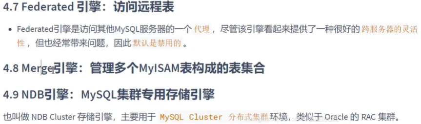


### 2.2.2 索引及调优篇1--索引的数据结构

#### 2.2.2.1 索引及其优缺点

##### 2.2.2.1.1 索引概述

索引本质：索引是数据结构，可以理解为排好序的快速查找数据结构，满足特定查找算法。

如果没有特别指明类型，==MySQL==中的索引默认是说B-Tree索引（从技术上说是==B+Tree==），它使用==B+Tree数据结构==来存储数据。

##### 2.2.2.1.2 优点

* 类似图书馆建书目索引，提高数据检索的效率，==**降低数据库的IO成本**==，这是创建索引的主要原因
* 通过索引列对数据进行排序，降低数据排序成本，**==降低CPU的消耗==**
* 通过创建唯一索引，可以保证数据库表中每一行**数据的唯一性**。
* 在实现数据的参考完整性方面，可以**加速表和表之间的连接**。换句话说，对于有依赖关系的子表和父表联合查询时，可以提高查询速度。
* 在使用分组和排序子句进行数据查询时，可以**显著减少查询中分组和排序时间**。

##### 2.2.2.1.3 缺点

* 创建索引和维护索引要耗费时间，并且随着数据量的增加，所耗费的时间也会增加
* 索引需要占磁盘空间，除了数据表占数据空间之外，每一个索引还要占一定的物理空间，存储在磁盘上，如果有大量的索引，索引文件就可能比数据文件更快达到最大文件尺寸。
* 虽然索引大大提高了查询速度，同时也会降低更新表的速度，当对表中的数据进行增、删和改时，索引也要动态维护，这样就降低了数据的维护速度。

##### 2.2.2.1.4 MySQL索引分类（逻辑角度分类）

* 单值索引：即一个索引只包含单列，一个表可以有多个单列索引

* 唯一索引：索引列的值必须唯一，但循序有空值

* 复合索引：一个索引包含多个列

* 基本语法：

  ```mysql
  // 创建索引
  CREATE [UNIQUE] INDEX indexName ON tableName(columnName(length));
  ALTER tableName ADD [UNIQUE] INDEX indexName ON (columnName(length));
  // 删除索引
  DROP INDEX indexName ON tableName;
  // 查看索引
  SHOW INDEX FROM tableName \G;
  ```


#### 2.2.2.2 InnoDB中的索引

InnoDB将存储的数据划分为若干个**“页”**，以页为磁盘和内存交互的基本单位，一个页的大小是16KB，也就是说即使只查询一条记录，InnoDB也会至少把16KB的内容从磁盘读到内存中。

##### 2.2.2.2.1 B+Tree


把键1-7连接到值 d1-d7 的B+树。链表（红色）用于快速顺序遍历叶子节点。树的分叉因子 =4。

此B+树的阶数是m，则除了根之外的每个节点都包含最少  个元素最多  个元素，对于任意的结点有最多 m 个子指针。对于所有内部节点，子指针的数目总是比元素的数目多一个。所有叶子都在相同的高度上，叶结点本身按关键字大小从小到大链接。

##### 2.2.2.2.2 常见索引概念（物理存储角度分类）

mysql中索引按照物理存储可以分为以下两类：聚簇（聚集）索引和非聚簇（非聚集或二级或辅助）索引。

###### 2.2.2.2.2.1 聚簇索引

聚簇索引并不是一种单独的索引类型，而是一种数据存储方式，索引和数据存储在一起，都存储在同一个B+tree中的叶子节点。也就是所谓的==索引即数据，数据即索引==。一般主键索引都是聚簇索引，如果没有定义主键，InnoDB会选择一个唯一的非空索引代替，如果没有这样的索引，InnoDB会隐式定义一个主键来作为聚簇索引。一张表只有一个聚簇索引，可以有多个二级索引。

对于**主键索引不需要显式定义**，当定义主键时，InnoDB就会根据主键建立一颗主键索引树。

**特点：**

1. 使用记录主键值的大小进行记录和页的排序，者包括三个方面的含义：

   * 页内记录是按照逐渐的大小顺序排成一个单向链表。
   * 各个存放记录的页也是根据页中记录的主键大小顺序排成一个双向链表。
   * 存放目录项记录的页分为不同的层次，在同一层次中的页也是根据页中目录项记录的主键大小顺序排成一个双向链表。

2. B+Tree的叶子节点存储的是完整的记录

   所谓完成记录，是指记录中存储了所有列的值（包括隐藏列）。

**优点：**

* 数据访问更快，因为聚簇索引将索引和数据保存在同一个B+树中，因此从聚簇索引中获取数据比非聚簇索引更快
* 聚簇索引对于主键的排序查找和范围查找速度非常快
* 按照聚簇索引排列顺序，查询显示一定范围数据的时候，由于数据都是紧密相连，数据库不用从多个数据块中提取数据，所以节省了大量的io操作。

**缺点：**

* **插入速度严重依赖于插入顺序**，按照主键的顺序插入是最快的方式，否则将会出现页分裂，严重影响性能。因此，对于InnoDB表，我们一般都会定义一个自增的ID列为主键
* **更新主键的代价很高**，因为将会导致被更新的行移动。因此，对于InnoDB表，我们一般定义主键为不可更新
* **二级索引访问需要两次索引查找**，第一次找到主键值，第二次根据主键值找到行数据

###### 2.2.2.2.2.2 二级索引

二级索引树的叶子节点存储的是主键和索引列数据而**不是完整数据**。也就是说，在找到索引后，得到对应的主键，再回到一级索引中找主键对应的数据记录（**回表**）。

**回表**：我们根据以索引列大小排序的B+树只能确定我们要查找记录的主键值，所以如果我们想根据索引列的值查找到完整的记录的话，仍然需要到聚簇索引中再查一遍，这个过程称为**回表**。也就是根据索引列的值查询一条完整的用户记录需要使用到**2棵B+树**！


**小结**：聚簇索引与非聚簇索引的原理不同，在使用上也有一些区别:
1．聚簇索引的叶子节点存储的就是我们的**数据记录**，非聚簇索引的叶子节点存储的是**数据位置**。非聚簇索引不会影响数据表的物理存储顺序。
2．一个表**只能有一个聚簇索引**，因为只能有一种排序存储的方式，但**可以有多个非聚簇索引**，也就是多个索引目录提供数据检索。
3．使用聚簇索引的时候，数据的查询效率高，但如果对数据进行插入，删除，更新等操作，效率会比非聚簇索引低。


###### 2.2.2.2.2.3 联合索引(非聚簇)

单列索引和多列联合索引的不同点：

* 联合索引只会建立**1棵B+树**。
* 为c2和c3列分别建立索引会分别以c2和c3列的大小为排序规则建立**2棵B+树**。

##### 2.2.2.2.4 InnoDB中B+树注意事项

1. 根页面位置万年不动

   我们前边介绍B+树索引的时候，为了大家理解上的方便，先把存储用户记录的叶子节点都画出来，然后接着画存储目录项记录的内节点，实际上B+树的形成过程是这样的:

   * 每当为某个表创建一个B+树索引(聚簇索引不是人为创建的，默认就有）的时候，都会为这个索引创建一个根节点页面。最开始表中没有数据的时候，每个B+树索引对应的根节点中既没有用户记录，也没有目录项记录。
   * 随后向表中插入用户记录时，先把用户记录存储到这个根节点中。
   * 当根节点中的可用空间用完时继续插入记录，此时会将根节点中的所有记录复制到一个新分配的页，比如页a中，然后对这个新页进行页分裂的操作，得到另一个新页，比如页b。这时新插入的记录根据键值（也就是聚簇索引中的主键值，二级索引中对应的索引列的值）的大小就会被分配到页a或者页b中，而根节点便升级为存储目录项记录的页。

   这个过程特别注意的是：一个B+树索引的根节点自诞生之日起，便不会再移动。这样只要我们对某个表建立一个索引，那么它的根节点的页号便会被记录到某个地方，然后凡是InnoDB存储引擎需要用到这个索引的时候，都会从那个固定的地方取出根节点的页号，从而来访问这个索引。 

2. 为了让新插入记录能找到自己在那个页里，我们需要保证在B+树的同一层内节点的目录项记录除页号这个字段以外是唯一的。所以对于二级索引的内节点的目录项记录的内容实际上是由三个部分构成的:

   * 索引列的值
   * 主键值
   * 页号

   也就是我们把主键值也添加到二级索引内节点中的目录项记录了，这样就能保证B+树每一层节点中各条目录项记录除页号这个字段外是唯一的。

3. 一个页面最少存储2条记录
   一个B+树只需要很少的层级就可以轻松存储数亿条记录，查询速度相当不错!这是因为B+树本质上就是一个大的多层级目录，每经过一个目录时都会过滤掉许多无效的子目录，直到最后访问到存储真实数据的目录。那如果一个大的目录中只存放一个子目录是个啥效果呢?那就是**目录层级非常非常非常多**，而且最后的那个存放真实数据的目录中只能存放一条记录。费了半天劲只能存放一条真实的记录?所以InnoDB的一个数据页至少可以存放两条记录。

#### 2.2.2.3 索引的代价

索引是个好东西，可不能乱建，它在空间和时间上都会有消耗:

* 空间上的代价
  每建立一个索引都要为它建立一棵B+树，每一棵B+树的每一个节点都是一个数据页，一个页默认会占用16KB的存储空间，一棵很大的B+树由许多数据页组成，那就是很大的一片存储空间。
* 时间上的代价
  每次对表中的数据进行==增、删、改==操作时，都需要去修改各个B+树索引。而且我们讲过，B+树每层节点都是按照索引列的值从小到大的顺序排序·而组成了双向链表。不论是叶子节点中的记录，还是内节点中的记录(也就是不论是用户记录还是目录项记录)都是按照索引列的值从小到大的顺序而形成了一个单向链表。而增、删、改操作可能会对节点和记录的排序造成破坏，所以存储引擎需要额外的时间进行一些记录移位，页面分裂、页面回收等操作来维护好节点和记录的排序。如果我们建了许多索引，每个索引对应的B+树都要进行相关的维护操作，会给性能拖后腿。

> 一个表上索引建的越多，就会占用越多的存储空间，在增删改记录的时候性能就越差。为了能建立又好又少的索引，我们得学学这些索引在哪些条件下起作用的。

#### 2.2.2.4 MySQL数据结构的合理性-Hash索引、AVL树、B树和B+树的对比

明确查询时间消耗的两个要点：1. 查询时间； 2. I/O时间（磁盘与内存之间）

从MysQL的角度讲，不得不考虑一个现实问题就是磁盘l/O。如果我们能让索引的数据结构尽量减少硬盘的I/O操作，所消耗的时间也就越小。可以说，**磁盘的 I/O操作次数对索引的使用效率至关重要**。

查找都是索引操作，==一般来说索引非常大==，尤其是关系型数据库，当数据量比较大的时候，索引的大小有可能几个G甚至更多，为了减少索引在内存的占用，==**数据库索引是存储在外部磁盘上的**==。当我们利用索引查询的时候，不可能把整个索引全部加载到内存，只能逐一加载，那么==MysQL衡量查询效率的标准就是磁盘I/O次数==。

##### 2.2.2.4.1 Hash结构

Hash本身是一个函数，又被称为散列函数，它可以帮助我们大幅提升检索数据的效率。
Hash算法是通过某种确定性的算法（比如MD5、SHA1、SHA2、SHA3)将输入转变为输出。==相同的输入永远可以得到相同的输出==，假设输入内容有微小偏差，在输出中通常会有不同的结果。
举例：如果你想要验证两个文件是否相同，那么你不需要把两份文件直接拿来比对，只需要让对方把Hash 函数计算得到的结果告诉你即可，然后在本地同样对文件进行Hash 函数的运算，最后通过比较这两个Hash 函数的结果是否相同，就可以知道这两个文件是否相同。

采用Hash进行检索效率非常高，基本上一次检索就可以找到数据，而B+树需要自顶向下依次查找，多次访问节点才能找到数据，中间需要多次l/o操作，==从效率来说 Hash比 B+树更快==。

|          | MyISAM | InnoDB |  Memory  |
| :------: | :----: | :----: | :------: |
| Hash索引 | 不支持 | 不支持 | ==支持== |

##### 2.2.2.4.2 二叉搜索树

如果我们利用二叉树作为索引结构，那么磁盘的Io次数和索引树的高度是相关的。

1. 二叉搜索树的特点
   * 一个节点只能有两个子节点，也就是一个节点度不能超过2
   * 左子节点<本节点;右子节点>=本节点，比我大的向右，比我小的向左
2. 查找规则
   我们先来看下最基础的二叉搜索树(Binary Search Tree)，搜索某个节点和插入节点的规则一样，我们假设搜索插入的数值为key：
   1. 如果key大于根节点，则在右子树中进行查找
   2. 如果key 小于根节点，则在左子树中进行查找
   3. 如果key等于根节点，也就是找到了这个节点，返回根节点即可。

##### 2.2.2.4.3 AVL树

为了解决上面二叉查找树退化成链表的问题，人们提出了平衡二叉搜索树(Balanced Binary Tree)，又称为AVL树(有别于AVL算法)，它在二叉搜索树的基础上增加了约束，具有以下性质:
==它是一棵空树或它的左右两个子树的高度差的绝对值不超过1，并且左右两个子树都是一棵平衡二叉树==。这里说一下，常见的平衡二叉树有很多种，包括了平衡二叉搜索树、红黑树、数堆、伸展树。平衡二叉搜索树是最早提出来的自平衡二叉搜索树，当我们提到平衡二叉树时一般指的就是平衡二叉搜索树。事实上，第一棵树就属于平衡二叉搜索树，搜索时间复杂度就是O(log~2~n)。

数据查询的时间主要依赖于磁盘I/O的次数，如果我们采用二叉树的形式，即使通过平衡二叉搜索树进行了改进，树的深度也是O(log2n)，当n比较大时，深度也是比较高的。


==每访问一次节点就需要进行一次磁盘工/O操作==，对于上面的树来说，我们需要进行5次I/O操作。虽然平衡二叉树的效率高，但是树的深度也同样高，这就意味着磁盘I/o操作次数多，会影响整体数据查询的效率。

针对同样的数据，如果我们把二叉树改成M叉树(M>2)呢？当M=3时，同样的31个节点可以由下面的三叉树来进行存储：


你能看到此时树的高度降低了，当数据量N大的时候，以及树的分叉数M大的时候，M叉树的高度会远小于二叉树的高度(M>2)。所以，我们需要把树从“**瘦高**”变“**矮胖**”。

##### 2.2.2.4.4 B-Tree

B树的英文是Balance Tree，也就是多路平衡查找树。简写为B-Tree（注意横杠表示这两个单词连起来的意思，不是减号）。它的高度远小于平衡二叉树的高度。


B树作为多路平衡查找树，它的每一个节点最多可以包括M个子节点，`M称为B树的阶`。每个磁盘块中包括了关键字和子节点的指针。如果一个磁盘块中包括了x个关键字，那么指针数就是x+1。

一个 *m* 阶的B树是一个有以下属性的树：

1. 每一个节点最多有 *m* 个子节点
2. 每一个非叶子节点（除根节点）最少有 ⌈*m*/2⌉ 个子节点
3. 如果根节点不是叶子节点，那么它至少有两个子节点
4. 有 *k* 个子节点的非叶子节点拥有 *k* − 1 个键
5. 所有的叶子节点都在同一层

小结：

1. B树在插入和删除节点的时候如果导致树不平衡，就通过自动调整节点的位置来保持树的自平衡。
2. 关键字集合分布在整棵树中,即叶子节点和非叶子节点都存放数据。搜索有可能在非叶子节点结束。
3. 其搜索性能等价于在关键字全集内做一次二分查找。


##### 2.2.2.4.5 B+Tree

B+树和B树的差异在于以下几点:

1. 有k个孩子的节点就有k个关键字。也就是孩子数量=关键字数，而B树中，孩子数量=关键字数+1。
2. B+Tree非叶子节点的关键字也会同时存在在子节点中，并且是在子节点中所有关键字的最大（或最小）
3. ==B+Tree非叶子节点仅用于索引，不保存数据记录==，跟记录有关的信息都放在叶子节点中。而B树中，==非叶子节点既保存索引，也保存数据记录==。
4. 所有关键字都在叶子节点出现，叶子节点构成一个有序链表，而且叶子节点本身按照关键字的大小从小到大顺序链接。

可以对比`2.2.2.2.2.1 聚簇索引`和`2.2.2.4.4 B-Tree 小结`中的两个图。


#### 问题

##### 1. 为什么MySQL索引结构默认使用B+Tree，而不是哈希、二叉树、红黑树？

##### 2. 为什么我们还需要一次回表操作呢?直接把完整的用户记录放到叶子节点不OK吗?

* 如果把完整的用户记录放到叶子节点是可以不用回表，但是这种操作相当于每建立一棵B+树都需要把所有的记录再都拷贝一遍，这就有点太**浪费存储空间**了。
* 因为这种按照非主键列建立的B+树需要一次回表操作才可以定位到完整的记录，所以这种B+树也被称为二级索引(英文名secondary index )，或者辅助索引。由于我们使用的是索引列（非主键）的大小作为B+树的排序规则，所以我们也称这个B+树是为索引列建立的索引。
* 非聚簇索引的存在不影响数据在聚簇索引中的组织，所以一张表可以有多个非聚簇索引。

##### 3. 单列索引和联合索引效率比较？联合索引顺序？多个单列索引顺序？

##### 4. Hash算法原理是什么？是怎么做到==相同的输入永远可以得到相同的输出==的？

##### 5.Hash结构效率高，那为什么索引结构要设计成树型呢？

* Hash 索引仅能满足(=)(>)和IN查询。如果进行==范围查询==，哈希索引时间复杂度会退化为==O(n)==；而树型的“有序”特性，依然能够保持==O(log2N)==的高效率。
* Hash索引还有一个缺陷，数据的存储是==没有顺序==的，在==ORDER BY==的情况下，使用 Hlash索引还需要对数据==重新排序==。
* 对于==联合索引==的情况，Hash值是==将联合索引键合并==后一起来计算的，无法对单独的一个键或者几个索引键进行查询。
* 对于等值查询来说，通常Hash索引的效率更高，不过也存在一种情况，就是索引列的重复值如果很多，效率就会降低。这是因为遇到==Hash冲突时==，需要==遍历桶中的行指针==来进行比较，找到查询的关键字，非常耗时。所以，Hash索引通常不会用到重复值多的列上，比如列为性别、年龄的情况等。（不会用在选择性低的列上）

##### 6. B-Tree中非叶子节点也存储了数据，而B+树中只在叶子节点存储了数据，这有什么好处？

* 目录页的大小是16KB，相同大小的磁盘空间，如果存储了数据，那么最多存储的关键字的个数就会变少（阶数变小），相应的子节点就会减少，最终会导致树高度变大，查询I/O次数会变大。同样的磁盘也大小，B+树只在叶子节点存储数据，这样可以存储更多的节点关键字。

* 如果要在一个范围中查找数据，B+索引树只需要在叶子节点中查找数据，因为叶子节点是使用双向链表链接起来的，而B-Tree树要在一个范围中查找数据就需要不断地进行中序遍历查找，也就是不停的穿梭在层与层之间，每次切换层次就需要一次I/O，这样时间代价是很大的。

##### 7. B+树的存储能力如何？为何说一般查找行记录，最多只需1~3次磁盘I/O

InnoDB存储引擎中页的大小为16KB，一般表的主键类型为INT(占用4个字节）或BIGINT(占用8个字节)，指针类型也一般为4或8个字节，也就是说==一个页(B+Tree中的一个节点)==中大概存储16KB/(8B+8B)=1K个键值(因为是估值，为方便计算，这里的K取值为10^3^ 。也就是说一个深度为3的B+Tree索引可以维护10^3^ *10^3^ *10^3^= 10亿条记录。(这里假定一个数据页也存储10^3^条行记录数据了)

实际情况中每个节点可能不能填充满，因此在数据库中，B+Tree的高度一般都在2 ~ 4层。MysQL的InnoDB存储引擎在设计时是将根节点常驻内存的，也就是说查找某一键值的行记录时最多只需要1~3次磁盘I/O操作。

### 2.2.3 索引及调优篇2--InnoDB数据存储结构

#### 2.2.3.1 数据库的存储结构：页

##### 2.2.3.1.1 磁盘与内存交互的基本单位：页

lnnoDB将数据划分为若干个页，InnoDB中页的大小默认为==16KB==。

以==页==作为磁盘和内存之间交互的==基本单位==，也就是一次最少从磁盘中读取16KB的内容到内存中，一次最少把内存中的16KB内容刷新到磁盘中。也就是说，==在数据库中，不论读一行，还是读多行，都是将这些行所在的页进行加载。也就是说，数据库管理存储空间的基本单位是页(Page)，数据库I/O操作的最小单位是页==。一个页中可以存储多个行记录。


##### 2.2.3.1.2 页结构概述

页a、页b、页c ..页n这些页可以不在物理结构上相连，只要通过**双向链表相关联**即可。每个数据页中的记录会按照主键值从小到大的顺序组成一个单向链表，每个数据页都会为存储在它里边的记录生成一个页目录，在通过主键查找某条记录的时候可以在页目录中使用二分法快速定位到对应的槽，然后再遍历该槽对应分组中的记录即可快速找到指定的记录。

##### 2.2.3.1.3 页的大小

不同的数据库管理系统(简称DBMS ）的页大小不同。比如在==MysQL的InnoDB存储引擎==中，默认页的大小是==16KB==，我们可以通过下面的命令来进行查看:

```mysql
mysql> show variables like '%innodb_page_size%';
+------------------+-------+
| Variable_name    | Value |
+------------------+-------+
| innodb_page_size | 16384 |
+------------------+-------+
1 row in set (0.00 sec)
```

SQL Server中页的大小为 8KB，而在Oracle中我们用术语“块”(Block)来代表“页"，oralce支持的块大小为2KB，4KB，8KB，16KB，32KB和64KB。

##### 2.2.3.1.4 页的上层结构

另外在数据库中，还存在着区(Extent)、段(Segment)）和表空间（Tablespace)的概念。行、页、区、段、表空间的关系如下图所示:


* 区（Extent）是比页大一级的存储结构，在InnoDB存储引擎中，一个区会分配64个连续的页。因为InnoDB中的页大小默认是16KB，所以一个区的大小是64*16KB= 1MB。
* 段（Segment）由一个或多个区组成，==**区在文件系统是一个连续分配的空间**==（在InnoDB中是连续的==64个页==)，不过在段中不要求区与区之间是相邻的。==段是数据库中的分配单位，不同类型的数据库对象以不同的段形式存在==。当我们创建数据表、索引的时候，就会相应创建对应的段，比如创建一张表时会创建一个表段，创建一个索引时会创建一个索引段。
* 表空间（Tablespace）是一个逻辑容器，表空间存储的对象是段，在一个表空间中可以有一个或多个段，但是一个段只能属于一个表空间。数据库由一个或多个表空间组成，表空间从管理上可以划分为系统表空间、用户表空间、撤销表空间、临时表空间等。

  > 在 5.6.6 之后，InnoDB 引如 **独立表空间** 空间的概念，每张表使用单独的文件存储数据和表结构

#### 2.2.3.2 页的内部结构

页如果按类型划分的话，常见的有数据页（保存B+树节点)、系统页、Undo页和事务数据页等。数据页是我们最常使用的页。

数据页的16KB大小的存储空间被划分为七个部分，分别是文件头(File Header)、页头(Page Header)、最大最小记录(Infimum+supremum)、用户记录(User Records)、空闲空间(Free Space)、页目录(PageDirectory)和文件尾(File Tailer)。

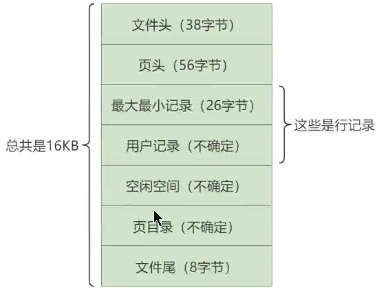


可以把7个结构分成三个部分。

##### 2.2.3.2.1 第一部分

==**FileHeader（文件头部）和FileTailer（文件尾部）**==

文件头部和文件尾部都有属性：FIL_PAGE_SPACE_OR_CHKSUM

就是对于一个很长的字节串来说，我们会通过某种算法来计算一个比较短的值来代表这个很长的字节串，这个比较短的值就称为校验和。
在比较两个很长的字节串之前，先比较这两个长字节串的校验和，如果校验和都不一样，则两个长字节串肯定是不同的，所以省去了直接比较两个比较长的字节串的时间损耗。

* 作用：
  InnoDB存储引擎以页为单位把数据加载到内存中处理，如果该页中的数据在内存中被修改了，那么在修改后的某个时间需要把数据同步到磁盘中。但是在同步了一半的时候断电了，造成了该页传输的不完整。
* 为了检测一个页是否完整（也就是在同步的时候有没有发生只同步一半的尴尬情况），这时可以通过文件尾的校验和(checksum值）与文件头的校验和做比对，如果两个值不相等则证明页的传输有问题，需要重新进行传输，否则认为页的传输已经完成。

* 具体的：
  每当一个页面在内存中修改了，在同步之前就要把它的校验和算出来，因为FileHeader在页面的前边，所以校验和会被首先同步到磁盘，当完全写完时，校验和也会被写到页的尾部，如果完全同步成功，则页的首部和尾部的校验和应该是一致的。如果写了一半儿断电了，那么在File Header中的校验和就代表着已经修改过的页，而在FileTrailer中的校验和代表着原先的页，二者不同则意味着同步中间出了错。这里，校验方式就是采用Hash 算法进行校验。

##### 2.2.3.2.2 第二部分

**==用户记录(User Records)、空闲空间(Free Space)、最大最小记录(Infimum+supremum)==**

###### 2.2.3.2.2.1 空闲空间

在页的7个组成部分中，我们自己存储的记录会按照我们指定的行格式存储到User Records部分。但是在一开始生成页的时候，其实并没有User Records这个部分，每当我们插入一条记录，都会从Free Space部分，也就是尚未使用的存储空间中申请一个记录大小的空间划分到User Records部分，当Free Space部分的空间全部被User Records部分替代掉之后，也就意味着这个页使用完了，如果还有新的记录插入的话，就需要去申请新的页了，这个过程的图示如下：


###### 2.2.3.2.2.2 用户记录

User Records中的这些记录按照==指定的行格式==一条一条摆在User Records部分，相互之间形成==单链表==。

下面说明一下用户记录里面一条条数据是如何记录的……这里需要讲讲==记录头信息==。

这里我们新建一张表：

```mysql
# 创建一张表
mysql> CREATE TABLE page_demo(
    ->     c1 INT,
    ->     c2 INT,
    ->     c3 VARCHAR(10000),
    ->     PRIMARY KEY (c1)
    -> ) CHARSET=ascii ROW_FORMAT=Compact;
Query OK, 0 rows affected (0.03 sec)
```

这个新创建的page_demo表有3个列，其中c1和c2列是用来存储整数的，c3列是用来存储字符串的。需要注意的是，我们把 c1 列指定为主键，所以在具体的行格式中MySQL就没必要为我们去创建那个所谓的 row_id 隐藏列了。而且我们为这个表指定了ascii字符集以及Compact的行格式。所以这个表中记录的行格式示意图就是这样的：


预留位没有使用，我们往新建的表里添加四条记录。


* delete_mask

  这个属性标记着当前记录是否被删除，占用1个二进制位。

  * 值为0：代表记录并没有被删除

  * 值为1：代表记录被删除掉了

  * 被删除的记录为什么还在页中存储呢?

    你以为它删除了，可它还在真实的磁盘上。这些被删除的记录之所以不立即从磁盘上移除，是因为移除它们之后其他的记录在磁盘上需要重新排列，导致性能消耗，各个记录是紧密排列的。所以只是打一个删除标记而已，所有被删除掉的记录都会组成一个所谓的垃圾链表，在这个链表中的记录占用的空间称之为==可重用空间==，之后如果有新记录插入到表中的话，可能把这些被删除的记录占用的存储空间覆盖掉。 

* min_rec_mask

  * B+树每层非叶子节点的最小记录都会被这个字段标识。

* n_owned

  * 见第3点页目录详情

* record_type
  这个属性表示当前记录的类型，一共有4种类型的记录:

  * 0: 表示普通记录
  * 1: 表示B+树非叶节点记录
  * 2: 表示最小记录
  * 3: 表示最大记录

* heap_no
  这个属性表示当前记录在本页中的位置。
  从图中可以看出来，我们插入的4条记录在本页中的位置分别是:2、3、4、5。

  怎么不见heap_no值为0和1的记录呢?
  MySQL会自动给每个页里加了两个记录，由于这两个记录并不是我们自己插入的，所以有时候也称为伪记录或煮虚拟记录。这两个伪记录一个代表==最小记录==，一个代表==最大记录==。最小记录和最大记录的heap_no值分别是0和1，也就是说它们的位置最靠前。

* next_record
  记录头信息里该属性非常重要，它表示从当前记录的真实数据到下一条记录的真实数据的==地址偏移量==。
  比如：第一条记录的next_record值为32，意味着从第一条记录的真实数据的地址处向后找32个字节便是下一条记录的真实数据。
  注意，下一条记录指得并不是按照我们插入顺序的下一条记录，而是按照主键值由小到大的顺序的下一条记录。而且规定Infimum记录（也就是最小记录）的下一条记录就是本页中主键值最小的用户记录，而本页中主键值最大的用户记录的下一条记录就是Supremum记录（也就是最大记录)。下图用箭头代替偏移量表示next_record。

  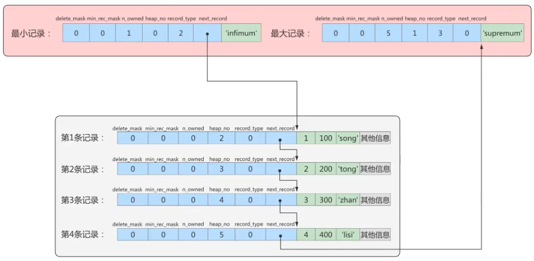

###### 2.2.3.2.2.3 最大最小记录

见用户记录-记录头信息heap_no字段

###### 2.2.3.2.2.4 演示


==所以，不论我们怎么对页中的记录做增删改操作，InnoDB始终会维护一条记录的单链表，链表中的各个节点是按照主键值由小到大的顺序连接起来的。==


直接复用了原来被删除记录的存储空间。|

说明：当数据页中存在多条被删除掉的记录时，这些记录的next_record属性将会把这些被删除掉的记录组成一个==垃圾链表==，以备之后重用这部分存储空间。

##### 2.2.3.2.3 第三部分 

==**页目录(PageDirectory)、页头(Page Header)**==

###### 2.2.3.2.3.1 页目录(PageDirectory)

* SELECT * FROM page_demo WHERE c1 = 3;

* 将所有的记录分成几个组，这些记录包括最小记录和最大记录，但不包括标记为“已删除”的记录。

* 第1组，也就是最小记录所在的分组只有1个记录；
  最后一组，就是最大记录所在的分组，会有1-8条记录；

  其余的组记录数量在4-8条之间。
  这样做的好处是，除了第1组（最小记录所在组）以外，其余组的记录数会尽量平分。

* 在每个组中最后一条记录的头信息中会存储==该组一共有多少条记录==，作为==n_owned==字段。

* 页目录用来存储==每组最后一条记录==的==地址偏移量==，这些地址偏移量会按照先后顺序存储起来，每组的地址偏移量也被称之为==槽(slot)==，每个槽相当于指针指向了不同组的最后一个记录。


###### 2.2.3.2.3.2 页头(Page Header)

为了能得到一个数据页中存储的记录的状态信息，比如本页中已经存储了多少条记录，第一条记录的地址是什么，页目录中存储了多少个槽等等，特意在页中定义了一个叫PageHeader的部分，这个部分占用固定的56个字节，专门==存储各种状态信息==。

##### 2.2.3.2.4 从数据页的角度看B+树如何查询

1. B+树是如何进行记录检索的?
   如果通过B+树的索引查询行记录，首先是从B+树的根开始，逐层检索，直到找到叶子节点，也就是找到对应的数据页为止，将数据页加载到内存中，页目录中的槽（slot)采用二分查找的方式先找到一个粗略的记录分组，然后再在分组中通过链表遍历的方式查找记录。

#### 2.2.3.3 InnoDB行格式（或记录格式）

我们平时的数据以行为单位来向表中插入数据，这些记录在磁盘上的存放方式也被称为`行格式`或者`记录格式`。InnoDB存储引擎设计了4种不同类型的`行格式`，分别是`Compact`、 `Redundant`、 `Dynamic`和`Compressed`行格式。

##### 2.2.3.3.1 指定行格式的语法

在创建或修改表的语句中指定行格式:

```mysql
CREATE TABLE 表名 (
	# 列的信息
) ROW_FORMAT=行格式名称

ALTER TABLE表名ROW_FORMAT=行格式名称
# 举例:
CREATE TABLE record_test_table (
	col1 VARCHAR(8),
	col2 VARCHAR(8) NOT NULL,
    col3 CHAR(8),
	col4 VARCHAR(8)
)CHARSET=ascii ROW_FORMAT=COMPACT;
# 插入数据
INSERT INTO record_test_table(col1,col2, col3, col4)VALUES
('zhangsan', 'lisi', 'wangwu', 'songhk'),('tong', 'chen',NULL,NULL);
```

##### 2.2.3.3.2 Compact行格式

在MySQL 5.1+版本中，默认设置为Compact行格式。一条完整的记录其实可以被分为记录的额外信息和记录的真实数据两大部分。


###### 2.2.3.3.2.1 变长字段长度列表

MySQL支持一些变长的数据类型，比如VARCHAR(M)、VARBINARY(M)、TEXT类型,BLOB类型，这些数据类型修饰列称为变长字段，变长字段中存储多少字节的数据不是固定的，所以我们在存储真实数据的时候需要顺便把这些数据占用的字节数也存起来。==在Compact行格式中，把所有变长字段的真实数据占用的字节长度都存放在记录的开头部位，从而形成一个变长字段长度列表==。

注意：这里面存储的变长长度和字段顺序是反过来的。比如两个varchar字段在表结构的顺序是a(10)，b(15)。那么在变长字段长度列表中存储的长度顺序就是15，10，是反过来的。

以record_test_table表中的第一条记录举例：因为record_test_table表的col1、col2、col4列都是VARCHAR(8)类型的，所以这三个列的值的长度都需要保存在记录开头处，注意record_test_table表中的各个列都使用的是ascii字符集（每个字符只需要1个字节来进行编码）。


又因为这些长度值需要按照列的逆序存放，所以最后变长字段长度列表的字节串用十六进制表示的效果就是（各个字节之间实际上没有空格，用空格隔开只是方便理解）：06 04 08
把这个字节串组成的变长字段长度列表填入上边的示意图中的效果就是：


###### 2.2.3.3.2.2 NULL值列表

Compact行格式会把可以为NULL的列统一管理起来，存在一个标记为NULL值列表中。如果表中没有允许存储NULL的列，则NULL值列表也不存在了。

为什么定义NULL值列表?
之所以要存储NULL是因为数据都是需要对齐的，如果没有标注出来NULL值的位置，就有可能在查询数据的时候出现混乱。如果使用一个特定的符号放到相应的数据位表示空置的话，虽然能达到效果，但是这样很浪费空间，所以直接就在行数据得头部开辟出一块空间专门用来记录该行数据哪些是非空数据，哪些是空数据，格式如下:

- 二进制位的值为==1==时，代表该列的值为NULL。
- 二进制位的值为==0==时，代表该列的值不为NULL。

例如：字段a、b、c，其中a是主键，在某一行中存储的数依次是a=1、b=null、c=2。那么Compact行格式中的NULL值列表中存储：01。第一个0表示c不为null，第二个1表示b是null。这里之所以没有a是因为数据库会自动跳过主键，因为主键肯定是非NULL且唯一的，在NULL值列表的数据中就会自动跳过主键。

record_test_table的两条记录的NULL值列表就如下：


###### 2.2.3.3.2.3 记录头信息

见 2.2.3.2.2.2 用户记录--记录头信息

###### 2.2.3.3.2.4 记录的真实数据

记录的真实数据除了我们自己定义的列的数据以外，还会有三个隐藏列


实际上这几个列的真正名称其实是：DB_ROW_ID、DB_TRX_ID、DB_ROLL_PTR。

* 一个表没有手动定义主键，则会选取一个Unique键作为主键，如果连Unique键都没有定义的话，则会为表默认添加一个名为row_id的隐藏列作为主键。所以row_id是在没有自定义主键以及Unique键的情况下才会存在的。
* 事务ID和回滚指针在后面的章节中讲解。

举例：分析Compact行记录的内部结构

```mysql
CREATE TABLE mytest(
    col1 VARCHAR(10),
    col2 VARCHAR(10),
    col3 CHAR(10),
    col4 VARCHAR(10)
)ENGINE=INNODB CHARSET=LATIN1 ROW_FORMAT=COMPACT;
INSERT INTO mytest VALUES('a','bb','bb','ccc');
INSERT INTO mytest VALUES('d','ee','ee','fff');
INSERT INTO mytest VALUES('d',NULL,NULL,'fff');

```

---------------------------------------------------------------------------------------------------------------------------------------------------------------------------

0000c070 73 75 70 72 65 6d 75 6d 03 02 01 00 00 00 10 00|supremum...|

0000c080 2c 00 00 00 2b 68 00 00 00 o0 00 06 05 80 00 00|,...+h.........|

0000c090 00 32 01 10 61 62 62 62 62 20 20 20 20 20 20 20|.2..abbbb|

0000c0a0 20 63 63 63 03 02 01 00 00 00 18 00 2b 00 00 o0|ccc.......+....|

0000c0b0 2b 68 01 00 00 o0 00 06 06 80 00 00 00 32 01 10|+h.......2..|

0000c0c0 64 65 65 65 65 20 20 20 20 20 20 20 20 66 66 66|deeeefff|

0000c0d0 03 01 06 00 00 20 ff 98 00 00 00 2b 68 02 00 00|..........h...

0000c0e0 00 00 06 07 80 00 00 00 32 01 10 64 66 66 66 00|.....2..dfff. |

------

该行记录从0000c078开始

##### 2.2.3.3.3 Dynamic和Compressed行格式

MySQL5.7+默认行格式为Dynamic

* 行溢出：InnoDB存储引擎可以将一条记录中的某些数据存储在真正的数据页面之外。

  我们可以知道一个页的大小一般是16KB，也就是16384字节，而一个VARCHAR(M)类型的列就最多可以存储65533个字节，这样就可能出现一个页存放不了一条记录，这种现象称为==行溢出==。

  在Compact和Reduntant行格式中，对于占用存储空间非常大的列，在记录的真实数据处只会存储该列的一部分数据，把剩余的数据分散存储在几个其他的页中进行==分页存储==，然后记录的真实数据处用20个字节存储指向这些页的地址（当然这20个字节中还包括这些分散在其他页面中的数据的占用的字节数），从而可以找到剩余数据所在的页。
  这称为页的扩展，举例如下：


* 在MySQL 8.0中，默认行格式就是Dynamic，Dynamic、Compressed行格式和Compact行格式挺像，只不过在处理行溢出数据时有分歧：

  * Compressed和Dynajnic两种记录格式对于存放在BLOB中的数据采用了==完全的行溢出的方式==。如图，在数据页中只存放20个字节的指针（溢出页的地址），实际的数据都存放在Off Page（溢出页）中。

  * Compact和Redundant两种格式会在记录的真实数据处存储一部分数据（存放768个前缀字节)。

  Compressed行记录格式的另一个功能就是，存储在其中的行数据会以zlib的算法进行压缩，因此对于BLOB、TEXT、VARCHAR这类大长度类型的数据能够进行非常有效的存储

  

  

##### 2.2.3.3.4 Redundant行格式

MySQL5.0之前InnoDB行格式存储方式

#### 2.2.3.4 区、段和碎片区


##### 2.2.3.4.1 为什么要有区?

B+树的每一层中的页都会形成一个双向链表，如果是以页为单位来分配存储空间的话，双向链表相邻的两个页之间的物理位置可能离得非常远。我们介绍B+树索引的适用场景的时候特别提到范围查询只需要定位到最左边的记录和最右边的记录，然后沿着双向链表一直扫描就可以了，而如果==链表中相邻的两个页物理位置离得非常远==，就是所谓的==随机I/O==。再一次强调，==磁盘的速度和内存的速度差了好几个数量级==，随机I/O是非常慢的，所以我们应该尽量让==链表中相邻的页的物理位置也相邻==，这样进行范围查询的时候才可以使用所谓的==顺序I/O==。

引入区的概念，==一个区就是在物理位置上连续的64个页==。因为InnoDB中的页大小默认是16KB，所以一个区的大小是64*16KB=1MB。在表中==数据量大==的时候，为某个索引分配空间的时候就==不再按照页为单位分配==了，而是按照==区为单位分配==，甚至在表中的数据特别多的时候，可以一次性分配多个连续的区。虽然可能造成一点点空间的浪费(数据不足以填充满整个区)，但是从性能角度看，可以消除很多的随机I/O，功大于过。

##### 2.2.3.4.2 为什么要有段?

对于范围查询，其实是对B+树叶子节点中的记录进行顺序扫描，而如果不区分叶子节点和非叶子节点，统统把节点代表的页面放到区中的话，进行范围扫描的效果就大打折扣了。所以InnoDB对B+树的==叶子节点==和==非叶子节点==进行了区别对待，也就是说叶子节点有自己独有的区，非叶子节点也有自己独有的区。存放叶子节点的区的集合就算是一个==段( segment)==，存放非叶子节点的区的集合也算是一个==段==。也就是说一个索引会生成2个段，一个==叶子节点段==，一个==非叶子节点段==。

除了索引的叶子节点段和非叶子节点段之外，InnoDB中还有为存储一些特殊的数据而定义的段，比如回滚段。所以，常见的段有数据段、索引段、回滚段。数据段即为B+树的叶子节点，索引段即为B+树的非叶子节点。

在InnoDB存储引擎中，对段的管理都是由引擎自身所完成，DBA不能也没有必要对其进行控制。这从一定程度上简化了DBA对于段的管理。

段其实不对应表空间中某一个连续的物理区域，而是一个逻辑上的概念，由若干个零散的页面以及一些完整的区组成。

#####  2.2.3.4.3 为什么要有碎片区？

默认情况下，一个使用InnoDB存储引擎的表只有一个聚簇索引，一个索引会生成2个段，而段是以区为单位申请存储空间的，一个区默认占用1M (64*16Kb= 1024Kb）存储空间，所以==默认情况下一个只存了几条记录的小表也需要2M的存储空间么?以后每次添加一个索引都要多申请2M的存储空间么?==这对于存储记录比较少的表简直是天大的浪费。这个问题的症结在于到现在为止我们介绍的区都是非常纯粹的，也就是一个区被整个分配给某一个段，或者说区中的所有页面都是为了存储同一个段的数据而存在的，即使段的数据填不满区中所有的页面，那余下的页面也不能挪作他用。

为了考虑以完整的区为单位分配给某个段对于==数据量较小==的表太浪费存储空间的这种情况，InnoDB提出了一个==碎片(fragment)区==的概念。在一个碎片区中，并不是所有的页都是为了存储同一个段的数据而存在的，而是碎片区中的页可以用于不同的目的，比如有些页用于段A，有些页用于段B，有些页甚至哪个段都不属于。碎片区直属于表空间，并不属于任何一个段。
所以此后为某个段分配存储空间的策略是这样的：

* 在刚开始向表中插入数据的时候，段是从某个碎片区以单个页面为单位来分配存储空间的。
* 当某个段已经占用了32个碎片区页面之后，就会申请以完整的区为单位来分配存储空间。

所以现在段不能仅定义为是某些区的集合，更精确的应该是==某些零散的页面==以及==一些完整的区==的==集合==。

##### 2.2.3.4.4 区的分类

区大体上可以分为4种类型:

* 空闲的区(FREE):现在还没有用到这个区中的任何页面。
* 有剩余空间的碎片区(FREE_FRAG）:表示碎片区中还有可用的页面。
* 没有剩余空间的碎片区 (FuL_FRAG):表示碎片区中的所有页面都被使用，没有空闲页面。
* 附属于某个段的区(FSEG):每一个索引都可以分为叶子节点段和非叶子节点段。

处于FREE、FREE_FRAG以及FULL_FRAG这三种状态的区都是独立的，直属于表空间。而处于FSEG状态的区是附属于某个段的。

> 如果把表空间比作是一个集团军，段就相当于师，区就相当于团。一般的团都是隶属于某个师的，就像是处于FSEG的区全都隶属于某个段，而处于FREE、FREE_FRAG以及 FULL_FRAG这三种状态的区却直接隶属于表空间，就像独立团直接听命于军部一样。

#### 2.2.3.5 表空间

表空间可以看做是InnoDB存储引擎逻辑结构的最高层，所有的数据都存放在表空间中。

表空间是一个逻辑容器，表空间存储的对象是段，在一个表空间中可以有一个或多个段， 但是一个段只能属于一个表空间。表空间数据库由一个或多个表空间组成，表空间从管理上可以划分为==系统表空间(System tablespace)、独立表空间(File-per-table tablespace)、撤销表空间(Undo Tablespace)和临时表空间(Temporary Tablespace)==等。

##### 2.2.3.5.1 独立表空间

独立表空间，即每张表有一个独立的表空间，也就是数据和索引|信息都会保存在自己的表空间中。独立的表空间(即:单表)可以在不同的数据库之间进行迁移。

空间可以回收(DROP TABLE操作可自动回收表空间；其他情况，表空间不能自己回收）。如果对于统计分析或是日志表，删除大量数据后可以通过：alter table TableName engine=innodb; 回收不用的空间。对于使用独立表空间的表，不管怎么删除，表空间的碎片不会太严重的影响性能，而且还有机会处理。

###### 2.2.3.5.1.1 独立表空间结构

独立表空间由段、区、页组成。前面已经讲解过了。

###### 2.2.3.5.1.2 真实表空间对应的文件大小

我们到数据目录里看，会发现-个新建的表对应的`.ibd`文件只占用了96K，才6个页面大小(MySQL5.7中)， 这
是因为一开始表空间占用的空间很小，因为表里边都没有数据。不过别忘了这些.ibd文件是自扩展的，随着表中
数据的增多，表空间对应的文件也逐渐增大。

###### 2.2.3.5.1.3 查看InnoDB的表空间类型:

```mysql
mysql> show variables like 'innodb_file_per_table';
+-----------------------+-------+
| Variable_name         | Value |
+-----------------------+-------+
| innodb_file_per_table | ON    |
+-----------------------+-------+
1 row in set (0.00 sec)
```

innodb_ file_ per_ _table=ON, 这就意味着每张表都会单独保存为一个`.ibd` 文件。

##### 2.2.3.5.2 系统表空间

系统表空间的结构和独立表空间基本类似，只不过由于整个MySQL进程只有一个系统表空间，在系统表空间中会额外记录一些有关整个系统信息的页面，这部分是独立表空间中没有的。

###### 2.2.3.5.2.1 InnoDB数据字典

每当我们向一个表中插入一条记录的时候，MySQL校验过程 如下:

先要校验一下插入语句对应的表存不存在，插入的列和表中的列是否符合，如果语法没有问题的话，还需要知道该表的聚簇索引和所有二级索引对应的根页面是哪个表空间的哪个页面，然后把记录插入对应索引的B+树中。所以说，MySQL除 了保存着我们插入的用户数据之外，还需要保存许多额外的信息，比方说：

> - 某个表属于哪个表空间，表里边有多少列
> - 表对应的每一 一个列的类型是什么
> - 该表有多少索引，每个索引对应哪几个字段，该索引对应的根页面在哪个表空间的哪个页面
> - 该表有哪些外键，外键对应哪个表的哪些列
> - 某个表空间对应文件系统上文件路径是什么
> - ……


#### 问题

##### 1. B+树是如何进行记录检索的?


### 2.2.4 索引及调优篇3--索引的创建与设计原则

#### 2.2.4.1 索引的声明与使用

##### 2.2.4.1.1 索引的分类

MySQL的索引包括普通索引、唯-性索引、全文索引、单列索引、多列索引和空间索引等。

* 从功能逻辑上说，索引主要有4种,分别是普通索引、唯一索引、主键索引、全文索引。
* 按照物理实现方式，索引可以分为2种:聚簇索引和非聚簇索引。
* 按照作用字段个数进行划分，分成单列索引和联合索引。

1. 普通索引
   在创建普通索引时，不附加任何限制条件,只是用于提高查询效率。这类索引可以创建在任何数据类型中,其值是否唯一和非空， 要由字段本身的完整性约束条件决定。建立索引以后，可以通过索引进行查询。例如，在表student的字段name.上建立一个普通索引，查询记录时就可以根据该索引进行查询。

2. 唯一性索引
   使用UNIQUE参数可以设置索引为唯一性索引， 在创建唯一性索引时， 限制该索引的值必须是唯-的,但允许有空值。在一张数据表里可以有多个唯-索引。

   例如，在表student的字段email中创建唯-性索引，那么字段email的值就必须是唯一的。通过唯-性索引，
   可以更快速地确定某条记录。

3. 主键索引
   主键索引就是一种特殊的唯一性索引， 在唯一索引的基础上增加了不为空的约束,也就是NOT NULL+UNIQUE, 一张表里最多只有一个主键索引。
   Why?这是由主键索引的物理实现方式决定的，因为数据存储在文件中只能按照-种顺序进行存储。

4. 单列索引
   在表中的单个字段上创建索引。单列索引只根据该字段进行索引。单列索书可以是普通索引，也可以是唯一性索引,还可以是全文索引。只要保证该索引只对应一个字段即可。一个表可以有多个单列索引。

5. 多列(组合、联合)索引
   多列索引是在表的多个字段组合，上创建一个索引。 该索引指向创建时对应的多个字段,可以通过这几个字段进行查询，但是只有查询条件中使用了这些字段中的第一个字段时才 会被使用。例如，在表中的字段id、name和gender上建立一个多列索idx_id_name_gender ，只有在查询条件中使用了字段id时该索引才会被使用。使用组合索引时遵循最左前缀集合。

6. 全文索引

##### 2.2.4.1.2 创建索引

MySQL支持多种方法在单个或多个列上创建索引：在创建表的定义语句`CREATE TABLE` 中指定索引列,使用`ALTER TABLE` 语句在存在的表上创建索引，或者使用`CREATE INDEX`语句在已存在的表上添加索引。

###### 2.2.4.1.2.1 创建表时创建索引

* 隐式的方式创建索引：

  ```mysql
  # 在声明有主键约束、唯一性约束、外键约束的字段上，会自动的添加相关的索引
  CREATE DATABASE dbtest2;
  USE dbtest2;
  CREATE TABLEdet(
  	dept_id INT PRIMARY KEY AUTO_INCREMENT,dept_name VARCHAR(20)
  );
  CREATETABLE emp (
      emp_id INT PRIMARY KEY AUTO_INCREMENT,emp  name VARCHAR (20)UNIQUE,
      dept _id INT,
      CONSTRAINT emp_dept_id_fk FOREIGN KEY(dept_id) REFERENCES dept(dept_id)
  );
  ```

  

* 显式创建索引：

  1. 创建普通索引

     ```mysql
     CREATETABLE book (
         book_id INT ,
         book_name VARCHAR (100),
         AUTHORS VARCHAR (100),
         info VARCHAR (100),
         COMMENT VARCHAR (100),
         year_publication YEAR,
         # 声明索引
     	INDEX idx_bname(book_name)
     );
     # 查看索引
     # 方式一
     SHOW CREATE TABLE book;
     # 方式二
     SHOW INDEX FROM book;
     ```

  1. 创建唯一索引

     ```mysql
     CREATETABLE book1(
         book_id INT ,
         book_name VARCHAR (100),
         AUTHORS VARCHAR (100),
         info VARCHAR (100),
         COMMENT VARCHAR (100),
         year_publication YEAR,
         # 声明索引
     	UNIQUE INDEX uk_idx_cmt(COMMENT)
     );
     ```

  1. 主键索引

     ```mysql
     CREATETABLE book2(
         # 声明为AUTO_INCREMENT的字段必须时PRIMARY KEY或者时UNIQUE
         book_id INT PRIMARY KEY AUTO_INCREMENT,
         book_name VARCHAR (100),
         AUTHORS VARCHAR (100),
         info VARCHAR (100),
         COMMENT VARCHAR (100),
         year_publication YEAR
     );
     ```

     通过删除主键约束的方式删除主键索引

     ALTER TABLE book2 DROP PRIMARY KEY;

  1. 创建联合索引

     ```mysql
     CREATETABLE book (
         book_id INT ,
         book_name VARCHAR (100),
         AUTHORS VARCHAR (100),
         info VARCHAR (100),
         COMMENT VARCHAR (100),
         year_publication YEAR,
         # 声明索引
     	INDEX idx_name(book_id,book_name,info)
     );
     # 使用了索引
     SELECT * FROM book4 WHERE book_id = 1001 AND book_name = 'mysql';
     # 没有使用索引
     SELECT* FROM book4 WHERE book_name = 'mysql ' ;
     # 可以用EXPLAIN性能分析工具查看有没有使用索引
     ```

###### 2.2.4.1.2.2 在已经存在的表中创建索引

```mysql
# ALTER 方式
ALTER TABLE book5 ADD INDEX idx_cmt (COMMENT) ;
ALTER TABLE book5 ADD UNIQUE uk_idx_bname (book_name) ;
ALTER TABLE book5 ADD I NDEX mul_bid_bname_info(book_id, book_name,info);

# CREATE方式
CREATE INDEX idx_cmt ON book6 (COMMENT) ;
CREATE UNIQUE INDEXuk_idx_bname ON book6(book_name);
CREATE INDEX mul_bid_bname_info ON book6(book_id, book_name,info);

```

##### 2.2.4.1.3 删除索引

1. 使用ALTER TABLE……DROP INDEX ……删除索引

   ```mysql
   ALTER TABLE book DROP INDEX index_name;
   ```

2. 使用DROP INDEX……ON……语句删除索引

   ```mysql
   DROP INDEX index_name ON tableName;
   ```

#### 2.2.4.2 MySQL8.0索引新特性

##### 2.2.4.2.1 降序索引

##### 2.2.4.2.2 隐藏索引

#### 2.2.4.3 索引的设计原则

##### 2.2.4.3.1 数据准备

第1步：创建数据库、创建表

```mysql
CREATE DATABASE test;
USE test;
#1.创建学生表和课程表
CREATE TABLE `student_info`(
    `id` INT(11) NOT NULL AUTO_INCREMENT,
    `student_id` INT NOT NULL,
    `name` VARCHAR(20) DEFAULT NULL,`course_id` INT NOT NULL ,
    `class_id` INT(11)DEFAULT NULL,
    `create_time` DATETIME DEFAULT CURRENT_TIMESTAMP ON UPDATE CURRENT_TIMESTAMP,
    PRIMARY KEY (`id`)
)ENGINE=INNODB AUTO_INCREMENT=1 DEFAULT CHARSET=utf8;

CREATE TABLE `course`(
		`id` INT(11) NOT NULL AUTO_INCREMENT,
    `course_id` INT NOT NULL ,
    `course_name` VARCHAR(48) DEFAULT NULL,PRIMARY KEY (`id`)
)ENGINE=INNODB AUTO_INCREMENT=1 DEFAULT CHARSET=utf8;

```


```mysql
#函数l:创建随机产生字符串函数
DELIMITER //
CREATE FUNCTION rand_string(n INT)
	RETURNS VARCHAR (255)#该函数会返回一个字符串
BEGIN
        DECLARE chars_str VARCHAR(100) DEFAULT 'abcdefghijklmnopqrstuvwxyzABCDEFJHTUKIMNNOPQRS';
        DECLARE return_str VARCHAR(255) DEFAULT '';
        DECLARE i INT DEFAULT 0;
        WHILE i < n DO
        SET return_str=CONCAT(return_str,SUBSTRING(chars_str,FLOOR(1+RAND()*52),1));
        SET i=i+1;
    END WHILE;
    RETURN return_str;
END //
DELIMITER ;
#函数2:创建随机数函数
CREATE FUNCTION rand_num(from_num INT ,to_num INT) RETURNS INT(11)
BEGIN
DECLARE i INT DEEAULT 0;
SET i = FLOOR(from_num +PAND()* (to_num - from_num+1));
RETURN i;
END
DELIMITER; 


```

##### 2.2.4.3.2 哪些情况适合创建索引

###### 2.2.4.3.2.1 字段数值有唯一性的限制

索引本身可以起到约束的作用，比如唯一索引、主键索引都是可以起到唯一性约束的，因此在我们的数据表中，如果某个字段是唯一性的，就可以直接创建唯一性索引，或者主键索引。这样可以更快速地通过该索引来确定某条记录。

例如，学生表中学号是具有唯一性的字段，为该字段建立唯一性索引可以很快确定某个学生的信息，如果使用姓名的话，可能存在同名现象，从而降低查询速度。

业务上具有唯一特性的字段，即使是组合字段，也必须建成唯IH索引。(来源: Alibaba)
说明：不要以为唯一索引影响了insert.速度，这个速度损耗可以忽略，但提高查找速度是明显的。

###### 2.2.4.3.2.2 频繁作为WHERE查询条件的字段

```mysql
# 没有索引查询
SELECT *FROM student_info WHERE student_id = 123110  #614ms

# 创建索引查询
CREATE INDEX idx_sid ON student_info(student_id) 
SELECT *FROM student_info WHERE student_id = 123110  #278ms

```

###### 2.2.4.3.2.3 经常`GROUP BY` 和`ORDER BY`的列

```mysql
# 无索引 840ms
SELECT student_id,COUNT(*) AS num
FROM student_info GROUP BY student_id LIMIT 100
# 有索引 192ms
SELECT student_id,COUNT(*) AS num
FROM student_info GROUP BY student_id LIMIT 100
```

如果同时有GROUP BY和ORDER BY的情况：比如我们按照student_id进行分组，同时按照创建时间降序的方式进行排序，这时我们就需要同时进行GROUP BY和ORDER BY，那么是不是需要单独创建student_id 的索引和create_time的索引呢？分别看下两种情况：

1. 当我们对student_id 和create_time 分别创建索引，执行下面的SQL查询：

```mysql
# 创建索引：先创建student_id，在创建create_time

CREATE INDEX idx_sid ON student_info(student_id) 
CREATE INDEX idx_stime ON student_info(create_time) 

# 先student_id,再create_time

EXPLAIN
SELECT student_id,COUNT(*) As num FROM student_info
GROUP BY student_id
ORDER BY create_time DESC 
LIMIT 100;


# 查询时间2130ms
# 会发现这种情况只用了idx_sid索引，而idx_stime并没有使用。
```

2. 创建联合索引

   考虑以下几种情况，保留上面创建的两个单列索引idx_sid，idx_stime

  ```mysql
# 先student_id，再create_time
CREATE INDEX idx_sid_time ON student_info(student_id,create_time) 

EXPLAIN
SELECT student_id,COUNT(*) As num FROM student_info
GROUP BY student_id
ORDER BY create_time DESC 
LIMIT 100;
#查询时间 451ms
  ```

  ```mysql
# 先create_time，再student_id
CREATE INDEX idx_time_sid ON student_info(student_id,create_time) 

EXPLAIN
SELECT student_id,COUNT(*) As num FROM student_info
GROUP BY student_id
ORDER BY create_time DESC 
LIMIT 100;
#查询时间 2153ms
# 通过分析发现idx_time_sid索引并没有使用，用的是idx_sid
  ```

  对比以上两种情况，索引字段的顺序应该和select条件中的字段顺序一致

###### 2.2.4.3.2.4 UPDATE、DELETE的WHERE条件列

当我们对某条数据进行UPDATE或者DELETE操作的时候，是否也需要对WHERE的条件列创建索引呢?
我们先看一下对数据进行UPDATE的情况:我们想要把 name为462eed7ac6e791292a79对应的student_id修改为10002，当我们没有对name进行索引的时候，执行SQL语句：

```mysql
UPDATE student_info SET student_id = 10002 WHERE NAME='462eed7ac6e791292a79';
# 733ms

#在NAME列上添加索引
CREATE INDEX idx_name ON student_info(NAME) 
UPDATE student_info SET student_id = 10002 WHERE NAME='462eed7ac6e791292a79';
# 195ms
```

对数据按照某个条件进行查询后再进行UPDATE或 DELETE的操作，如果对WHERE字段创建了索引，就能大幅提升效率。原理是因为我们需要先根据WHERE条件列检索出来这条记录，然后再对它进行更新或删除。==如果进行更新的时候，更新的字段是非索引字l段，提升的效率会更明显，这是因为非索引字段更新不需要对索引进行维护==。

###### 2.2.4.3.2.5 DISTINCT字段需要创建索引

有时候我们需要对某个字段进行去重，使用DISTINCT，那么对这个字段创建索引，也会提升查询效率。
比如，我们想要查询课程表中不同的student_id都有哪些，如果我们没有对student_id 创建索引，执行SQL语句:

```mysql
SELECT DISTINCT ( student_id) FROM student_info;
```

运行结果（600637条记录，运行时间0.683s ) :
如果我们对student_id 创建索引，再执行sQL语句:

```mysql
SELECT DISTINCT( student_id)FROM student_info;
```

运行结果(600637条记录，运行时间0.810s ) ：
你能看到sQL查询效率有了提升，同时显示出来的student_id还是按照递增的顺序进行展示的。这是因为索引会对数据按照某种顺序进行排序，所以在去重的时候也会快很多。

###### 2.2.4.3.2.6 多表JoIN连接操作时，创建索引注意事项

首先，==连接表的数量尽量不要超过3张==，因为每增加━张表就相当于增加了一次嵌套的循环，数量级增长会非常快，严重影响查询的效率。
其次，==对WHERE条件创建索引==，因为WHERE才是对数据条件的过滤。如果在数据量非常大的情况下，没有WHERE条件过滤是非常可怕的。
最后，==对用于连接的字段创建索引==，并且该字段在多张表中的==类型必须一致==（隐式转换需要用到函数，用函数索引会失效）。比如course_id在student_info表和course表中都为int(11)类型，而不能一个为int另一个为varchar类型。
举个例子，如果我们只对student_id 创建索引，执行sQL语句：

```mysql
SELECT student_info.course_id, name,student_info.student_id, course_name
FROM student_info JOIN course
ON student_info.course_id = course.course_id
WHERE name = 'ybOPIV'; 
# 466 ms
```

对name建索引，查询用时187ms

###### 2.2.4.3.2.7 使用列的类型小的创建索引

我们这里所说的类型大小指的就是该类型表示的数据范围的大小。
我们在定义表结构的时候要显式的指定列的类型，以整数类型为例，有==TINYINT==、==MEDIUNINT==、==INT==、==BIGINT==等，它们占用的存储空间依次递增，能表示的整数范围当然也是依次递增。如果我们想要对某个整数列建立索引的话，在表示的整数范围允许的情况下，尽量让索引列使用较小的类型，比如我们能使用==INT==就不要使用==BIGINT==，能使用==MEDIUMINT==就不要使用==INT==。这是因为:

* 数据类型越小，在查询时进行的比较操作越快
* 数据类型越小，索引占用的存储空间就越少，在一个数据页内就可==以放下更多的记录==，从而减少磁盘==I/O==带来的性能损耗，也就意味着可以把更多的数据页缓存在内存中，从而加快读写效率。

这个建议对于表的==主键来说更加适用==，因为不仅是聚簇索引中会存储主键值，其他所有的二级索引的节点处都会存储一份记录的主键值，如果主键使用更小的数据类型，也就意味着节省更多的存储空间和更高效的I/O。

###### 2.2.4.3.2.8 使用字符串前缀创建索引

假设我们的字符串很长，那存储一个字符串就需要占用很大的存储空间。在我们需要为这个字符串列建立索引时，那就意味着在对应的B+树中有这么两个问题：

* B+树索引中的记录需要把该列的完整字符串存储起来，更费时。而且字符串越长，==在索引中占用的存储空间越大==。
* 如果B+树索引中索引列存储的字符串很长，那在做字符串==比较时会占用更多的时间==。

我们可以通过截取字段的前面一部分内容建立索引，这个就叫前缀索引。这样在查找记录时虽然不能精确的定位到记录的位置，但是能定位到相应前缀所在的位置，然后根据前缀相同的记录的主键值回表查询完整的字符串值。既==节约空间==，又==减少了字符串的比较时间==，还大体能解决排序的问题。

例如，TEXT和BLOG类型的字段，进行全文检索会很浪费时间，如果只检索字段前面的若干字符，这样可以提高检索速度。
创建一张商户表，因为地址字段比较长，在地址字段上建立前缀索引

```mysql
create table shop(address varchar(120) not null) ;
alter table shop add index(address(12)) ;
```

问题是，截取多少呢?

截取得多了，达不到节省索引存储空间的目的;
截取得少了，重复内容太多，字段的散列度(==选择性==)会降低。

==怎么计算不同的长度的选择性呢?==

先看一下字段在全部数据中的==选择度==：

```mysql
select count(distinct address) / count(*) from shop;
```

通过不同长度去计算，与全表的选择性对比：

公式：

```mysql
count(distinct left(列名，索引长度))/count(*);
```

例如：

```mysql
select count(distinct left(address,18)) / count(*) as sub10， --截取前10个字符的选择度
count(distinct left(address,15)) / count(*) as sub11, --截取前15个字符的选择度
count(distinct left(address,20)) / count(*) as sub12， --截取前20个字符的选择度
count(distinct left(address,25)) / count(*) as sub13 --截取前25个字符的选择度
from shop;
```

###### 2.2.4.3.2.9 区分度高(散列性高)的列适合作为索引

列的基数指的是某列中不重复数据的个数，比方说某个列包含值2，5，8，2，5，8，2，5，8,虽然有9条记录，但该列的基数却是3。也就是说，在==记录行数一定的情况下，列的基数越大，该列中的值越分散；列的基数越小，该列中的值越集中==。这个列的基数指标非常重要，直接影响我们是否能有效的利用索引。最好为列的基数大的列建立索引，为基数太小列的建立索引效果可能不好。可以使用公`select count(distinct a)/count(*) from t1`计算区分度，越接近1越好，-般超过33%就
算是比较高效的索引了。

拓展：联合索引把区分度高(散列性高)的列放在前面。

###### 2.2.4.3.2.10 使用最频繁的列放到联合索引的左侧

这样也可以较少的建立一些索引。同时，由于"最左前缀原则"，可以增加联合索引的使用率。

###### 2.2.4.3.2.11 在多个字段都要创建索引的情况下，联合索引优于单值索引。

##### 2.2.4.3.3 限制索引的数目

在实际工作中，我们也需要注意平衡，索引的数目不是越多越好。我们需要限制每张表上的索引数量，建议单张表索引数量==不超过6个==。原因：

* 每个索引都需要占用磁盘空间，索引越多，需要的磁盘空间就越大。
* 索引会影响==INSERT、DELETE、 UPDATE==等语句的性能，因为表中的数据更改的同时，索引也会进行调整和更新，会造成负担。
* 优化器在选择如何优化查询时，会根据统-信息， 对每一个可以用到的==索引来进行评估==，以生成出一个最好的执行计划，如果同时有很多个索引都可以用于查询，会增加MySQL优化器生成执行计划时间，降低查询性能。

##### 2.2.4.3.4 哪些情况不适合创建索引

###### 2.2.4.3.4.1 在where中使用不到的字段，不要设置索引

###### 2.2.4.3.4.2 数据量小的表不要使用索引

###### 2.2.4.3.4.3 有大量重复数据的列上不要建立索引

> 当数据重复度大，比如高于10% 的时候，也不需要对这个字段使用索引。

###### 2.2.4.3.4.4 避免对经常更新的表创建过多的索引

###### 2.2.4.3.4.5 不建议用无序的值作为索引

###### 2.2.4.3.4.6 删除不再使用或者很少使用的索引

###### 2.2.4.3.4.7 不要定义冗余或重复的索引

### 2.2.5 索引及调优篇4--性能分析工具的使用

#### 2.2.5.1 数据库服务器优化步骤

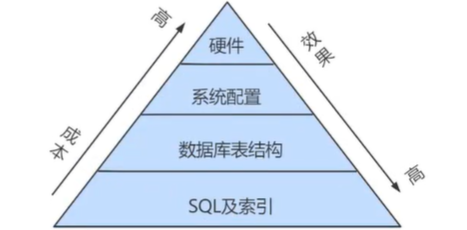

#### 2.2.5.2 查看系统性能参数

在MySQL中，可以使用SHOW STATUS 语句查询-些MySQL数据库服务器的性能参数、执行频率 。

SHOW STATUS语句语法如下:

```mysql
SHOW [ GLOBAL | SESSION] STATUS LIKE '参数' ;
```

一些常用的性能参数如下:

> * Connections: 连接MySQL服务器的次数。
> * Uptime: MySQL服务器的上线时间。
> * Slow_queries: 慢查询的次数。
> * Innodb_rows_ read: Select查询返回的行数
> * Innodb_rows_ inserted: 执行INSERT操作插入的行数
> * Innodb_rows_ updated:执行UPDATE操作更新的行数
> * Innodb_rows_ deleted: 执行DELETE操作删除的行数
> * Com_select: 查询操作的次数。
> * Com_insert: 插入操作的次数。对于批量插入的INSERT操作,只累加-次。
> * Com_update: 更新操作的次数。
> * Com_delete: 删除操作的次数。

####  2.2.5.3 统计SQL的查询成本：last_query_cost

一条SQL查询语句在执行前需要确定查询执行计划，如果存在多种执行计划的话，MySQL 会计算每个执行计划所需要的成本，从中选择成本最小的一个作为最终执行的执行计划。

如果我们想要查看某条SQL语句的查询成本，可以在执行完这条SQL语句之后，通过查看当前会话中的==last_query_cost==变量值来得到当前查询的成本。它通常也是我们==评价一个查询的执行效率==的一个常用指标。这个查询成本对应的是==SQL语句所需要读取的页的数量==。

使用场景：它对于比较开销是非常有用的，特别是我们有好几种查询方式可选的时候。

> SQL查询是一个动态的过程，从页加载的角度来看，我们可以得到以下两点结论:
>
> 1. 位置决定效率。如果页就在数据库缓冲池中，那么效率是最高的，否则还需要从内存或者磁盘中进行读取，当然针对单个页的读取来说，如果页存在于内存中，会比在磁盘中读取效率高很多。
> 2. 批量决定效率 。如果我们从磁盘中对单一页进行随机读，那么效率是很低的(差不多10ms)，而采用顺序读取的方式，批量对页进行读取，平均- -页的读取效率就会提升很多，甚至要快于单个页面在内存中的随机读取。
>
> 所以说，遇到I/O并不用担心，方法找对了，效率还是很高的。我们首先要考虑数据存放的位置，如果是经常使用的数据就要尽量放到缓冲池中，其次我们可以充分利用磁盘的吞吐能力，-次性批量读取数据，这样单个页的读取效率也就得到了提升。

#### 2.2.5.4 定位执行慢的SQL：慢查询日志

MySQL的慢查询日志，用来记录在MySQL中响应时间超过阀值的语句，具体指运行时间超过`long_query_time`值的SQL，则会被记录到慢查询日志中。`long_query_time`的默认值为`10`，意思是运行10秒以上(不含10秒)的语句，认为是超出了我们的最大忍耐时间值。

它的主要作用是，帮助我们发现那些执行时间特别长的SQL查询，并且有针对性地进行优化，从而提高系统的整体效率。当我们的数据库服务器发生阻塞、运行变慢的时候，检查一下慢查询日志， 找到那些慢查询，对解决问题很有帮助。比如一条sq|执行超过5秒钟，我们就算慢SQL，希望能收集超过5秒的sql，结合EXPLAIN进行全面分析。

默认情况下，MySQL数据库==没有开启慢查询日志==,需要我们手动来设置这个参数。如果不是调优需要的话，一般不建议启动该参数，因为开启慢查询日志会或多或少带来一定的性能影响。

慢查询日志支持将日志记录写入文件。

##### 2.2.5.4.1 开启慢查询日志参数

###### 2.2.5.4.1.1 开启slow_query_log

查看慢查询日志是否打开：

```mysql
mysql> SHOW variables LIKE '%slow_query_log%';
+---------------------+---------------------------------+
| Variable_name       | Value                           |
+---------------------+---------------------------------+
| slow_query_log      | ON                              |
| slow_query_log_file | /www/server/data/mysql-slow.log |
+---------------------+---------------------------------+
2 rows in set (0.00 sec)
```

如果`slow_query_log=OFF`，则需要运行下列语句进行打开

```mysql
SET GLOBAL slow_query_log='ON';
```

慢查询日志将会保存到`/www/server/data/mysql-slow.log`文件中。

###### 2.2.5.4.1.2 修改long query_ time阈值

接下来我们来看下慢查询的时间阈值设置，使用如下命令：

```mysql
mysql> show variables like '%long_query_time%' ;
+-----------------+----------+
| Variable_name   | Value    |
+-----------------+----------+
| long_query_time | 3.000000 |
+-----------------+----------+
1 row in set (0.01 sec)
```

这里如果我们想把时间缩短，比如设置为1秒，可以这样设置：

```mysql
#测试发现:设置global的方式对当前session的1ong. query. .time失效。对新连接的客户端有效。所以可以一- 并执行下述语
句
mysq1 > set global long_query_time = 1 ;
mysql> show global variables like '%long_query_time%';
mysql> set long_query_time=1;
mysql> show variables like '%long_query_time%' ;
```

这种方式只是临时设置，一旦服务重启，设置失效，如果需要永久生效，则在配置文件中设置参数：

修改my.cnf文件，[mysqld]下增加或修改参数long_query_time、slow_ query_log 和slow_query_log_file后，然后重启MySQL服务器。

```sh
[mysqld]
s1oL_query_1og=0N # 开启慢查询日志的开关
s1ow_query_1og_file=/var/1ib/mysq1/atguigu-s1ow.1og #慢查询日志的目录和文件名信息
long_query_time=3 #设置慢查询的阅值为3秒，超出此设定值的SQL即被记录到慢查询日志
1og_output=FILE
```

如果不指定存储路径,慢查询日志将默认存储到MySQL数据库的数据文件夹下。如果不指定文件名，默认文为hostname-slow.log

##### 2.2.5.4.2 查看慢查询数目

查询当前系统中有多少条慢查询记录

```mysql
SHOW GLOBAL STATUS LIKE '%Slow_queries%';
```

##### 2.2.5.4.3 案例演示

https://www.gulixueyuan.com/course/510/task/22336/show

##### 2.2.5.4.4 测试及分析

##### 2.2.5.4.5 慢查询日志分析工具--mysqldumpslow

##### 2.2.5.4.6 关闭慢查询日志

##### 2.2.5.4.7 删除慢查询日志

#### 2.2.5.5 查看执行成本

复习 [2.2.1.2.2.2 MySQL5.7查询语句执行过程演示](#2.2.1.2.2.2 MySQL5.7查询语句执行过程演示)

#### 2.2.5.6 分析查询语句

##### 2.2.5.6.1 基本语法

```mysql
EXPLAIN SELECT * FROM student_info
或者
DESCRIBE SELECT * FROM student_info
```


##### 2.2.5.6.2 数据准备

```mysql
CREATE TABLE s1 (
	id INT AUTO INCREMENT ,
	key1 VARCHAR(100) ,
	key2 INT,
	key3 VARCHAR (100) ,
	key_part1 VARCHAR(100) ,
	key_part2 VARCHAR(100) ,
	key_part3 VARCHAR(100) ,
	common_field VARCHAR (100),
	PRIMARY KEY (id) ,
	INDEX idx_key1 (key1) ,
	UNIQUE INDEX idx_key2 (key2) ,
	INDEX idx_key3 (key3) ,
	INDEX idx_key_part (key_part1, key_part2,key_part3)
)ENGINE=INNODB CHARSET=utf8;

CREATE TABLE s2 (
	id INT AUTO INCREMENT ,
	key1 VARCHAR(100) ,
	key2 INT,
	key3 VARCHAR (100) ,
	key_part1 VARCHAR(100) ,
	key_part2 VARCHAR(100) ,
	key_part3 VARCHAR(100) ,
	common_field VARCHAR (100),
	PRIMARY KEY (id) ,
	INDEX idx_key1 (key1) ,
	UNIQUE INDEX idx_key2 (key2) ,
	INDEX idx_key3 (key3) ,
	INDEX idx_key_part (key_part1, key_part2,key_part3)
)ENGINE=INNODB CHARSET=utf8;
```

https://www.gulixueyuan.com/course/510/task/22337/show

##### 2.2.5.6.3 EXPLAIN各个字段的作用

1. table：表名

   ```mysql
   #查询的每一行记录都对应着一个单表
   EXPLAIN SELECT * FROM s1;
   
   #s1:驱动表  s2:被驱动表
   EXPLAIN SELECT * FROM s1 INNER JOIN s2; # 结果有两条记录
   ```

2. id：在一个大的查询语句中每个SELECT关键字都对应一个唯一的id

   ```mysql
   SELECT * FROM s1 WHERE key1 = 'a';
   SELECT * FROM s1 INNER JOIN s2
   ON s1.key1 = s2.key1
   WHERE s1.common_field = 'a';
   SELECT * FROM s1 
   WHERE key1 IN (SELECT key3 FROM s2);
   SELECT * FROM s1 UNION SELECT * FROM s2;
   EXPLAIN SELECT * FROM s1 WHERE key1 = 'a';
   EXPLAIN SELECT * FROM s1 INNER JOIN s2;
   EXPLAIN SELECT * FROM s1 WHERE key1 IN (SELECT key1 FROM s2) OR key3 = 'a';
   ######查询优化器可能对涉及子查询的查询语句进行重写,转变为多表查询的操作########
   EXPLAIN SELECT * FROM s1 WHERE key1 IN (SELECT key2 FROM s2 WHERE common_field = 'a');
   #Union去重
   EXPLAIN SELECT * FROM s1 UNION SELECT * FROM s2;
   EXPLAIN SELECT * FROM s1  UNION ALL SELECT * FROM s2;
   ```

   小结:

   * id如果相同，可以认为是一组，从上往下顺序执行

   * 在所有组中，id值越大， 优先级越高，越先执行

   * 关注点：id号每个号码，表示一趟独立的查询, 一个sql的查询趟数越少越好

3. select_type：SELECT关键字对应的那个查询的类型,确定小查询在整个大查询中扮演了一个什么角色

   ```mysql
   # 查询语句中不包含`UNION`或者子查询的查询都算作是`SIMPLE`类型
   EXPLAIN SELECT * FROM s1;
   
   #连接查询也算是`SIMPLE`类型
   EXPLAIN SELECT * FROM s1 INNER JOIN s2;
   
   #对于包含`UNION`或者`UNION ALL`或者子查询的大查询来说，它是由几个小查询组成的，其中最左边的那个
   #查询的`select_type`值就是`PRIMARY`
   
   #对于包含`UNION`或者`UNION ALL`的大查询来说，它是由几个小查询组成的，其中除了最左边的那个小查询
   #以外，其余的小查询的`select_type`值就是`UNION`
   #`MySQL`选择使用临时表来完成`UNION`查询的去重工作，针对该临时表的查询的`select_type`就是
   #`UNION RESULT`
   EXPLAIN SELECT * FROM s1 UNION SELECT * FROM s2;
   EXPLAIN SELECT * FROM s1 UNION ALL SELECT * FROM s2;
   #子查询：
   #如果包含子查询的查询语句不能够转为对应的`semi-join`的形式，并且该子查询是不相关子查询。
   #该子查询的第一个`SELECT`关键字代表的那个查询的`select_type`就是`SUBQUERY`
   EXPLAIN SELECT * FROM s1 WHERE key1 IN (SELECT key1 FROM s2) OR key3 = 'a';
   #如果包含子查询的查询语句不能够转为对应的`semi-join`的形式，并且该子查询是相关子查询，
   #则该子查询的第一个`SELECT`关键字代表的那个查询的`select_type`就是`DEPENDENT SUBQUERY`
   EXPLAIN SELECT * FROM s1 WHERE key1 IN (SELECT key1 FROM s2 WHERE s1.key2 = s2.key2) OR key3 = 'a';
   #注意的是，select_type为`DEPENDENT SUBQUERY`的查询可能会被执行多次。
   
   #在包含`UNION`或者`UNION ALL`的大查询中，如果各个小查询都依赖于外层查询的话，那除了
   #最左边的那个小查询之外，其余的小查询的`select_type`的值就是`DEPENDENT UNION`。
   EXPLAIN SELECT * FROM s1 WHERE key1 IN (SELECT key1 FROM s2 WHERE key1 = 'a' UNION SELECT key1 FROM s1 WHERE key1 = 'b');
   #对于包含`派生表`的查询，该派生表对应的子查询的`select_type`就是`DERIVED`
   EXPLAIN SELECT * FROM (SELECT key1, COUNT(*) AS c FROM s1 GROUP BY key1) AS derived_s1 WHERE c > 1;
   #当查询优化器在执行包含子查询的语句时，选择将子查询物化之后与外层查询进行连接查询时，
   #该子查询对应的`select_type`属性就是`MATERIALIZED`
   EXPLAIN SELECT * FROM s1 WHERE key1 IN (SELECT key1 FROM s2); #子查询被转为了物化表
   
   ```

4. type：

   执行计划的一条记录就代表着MySQL对某个表的执行查询时的访问方法，又称“访问类型",其中的type列就表明了这个访问方法是啥，是较为重要的一个指标。 比如，看到type列的值是ref，表明MySQL即将使用ref访问方法来执行对s1表的查询。

   完整的访问方法如下: system， conpt， eq_ref， ref，fulltext， ref_or_null， index_merge，unique_ subquery，index_subquery，range，index，ALL。

   

   结果值从最好到最坏依次是:
   ==system > const > eq_ ref > ref==> fulltext > ref_or_ null > index_ merge > unique_ subquery > index_ subquery > range>index> ALL
   其中比较重要的几个提取出来。SQL 性能优化的目标:至少要达到range级别，要求是ref级别，最好是consts级别。(阿里巴巴开发手册要求)

   ```mysql
   #当表中`只有一条记录`并且该表使用的存储引擎的统计数据是精确的，比如MyISAM、Memory，
   #那么对该表的访问方法就是`system`。
   CREATE TABLE t(i INT) ENGINE=MYISAM;
   INSERT INTO t VALUES(1);
   
   EXPLAIN SELECT * FROM t;
   
   #换成InnoDB
   CREATE TABLE tt(i INT) ENGINE=INNODB;
   INSERT INTO tt VALUES(1);
   EXPLAIN SELECT * FROM tt;
   
   
   #当我们根据主键或者唯一二级索引列与常数进行等值匹配时，对单表的访问方法就是`const`
   EXPLAIN SELECT * FROM s1 WHERE id = 10005;
   
   EXPLAIN SELECT * FROM s1 WHERE key2 = 10066;
   
   
   #在连接查询时，如果被驱动表是通过主键或者唯一二级索引列等值匹配的方式进行访问的
   #（如果该主键或者唯一二级索引是联合索引的话，所有的索引列都必须进行等值比较），则
   #对该被驱动表的访问方法就是`eq_ref`
   EXPLAIN SELECT * FROM s1 INNER JOIN s2 ON s1.id = s2.id;
   
   
   #当通过普通的二级索引列与常量进行等值匹配时来查询某个表，那么对该表的访问方法就可能是`ref`
   EXPLAIN SELECT * FROM s1 WHERE key1 = 'a';
   
   
   #当对普通二级索引进行等值匹配查询，该索引列的值也可以是`NULL`值时，那么对该表的访问方法
   #就可能是`ref_or_null`
   EXPLAIN SELECT * FROM s1 WHERE key1 = 'a' OR key1 IS NULL;
   
   
   #单表访问方法时在某些场景下可以使用`Intersection`、`Union`、
   #`Sort-Union`这三种索引合并的方式来执行查询
   EXPLAIN SELECT * FROM s1 WHERE key1 = 'a' OR key3 = 'a';
   
   
   #`unique_subquery`是针对在一些包含`IN`子查询的查询语句中，如果查询优化器决定将`IN`子查询
   #转换为`EXISTS`子查询，而且子查询可以使用到主键进行等值匹配的话，那么该子查询执行计划的`type`
   #列的值就是`unique_subquery`
   EXPLAIN SELECT * FROM s1 
   WHERE key2 IN (SELECT id FROM s2 WHERE s1.key1 = s2.key1) OR key3 = 'a';
   
   
   #如果使用索引获取某些`范围区间`的记录，那么就可能使用到`range`访问方法
   EXPLAIN SELECT * FROM s1 WHERE key1 IN ('a', 'b', 'c');
   
   #同上
   EXPLAIN SELECT * FROM s1 WHERE key1 > 'a' AND key1 < 'b';
   
   
   #当我们可以使用索引覆盖，但需要扫描全部的索引记录时，该表的访问方法就是`index`
   EXPLAIN SELECT key_part2 FROM s1 WHERE key_part3 = 'a';
   
   
   #最熟悉的全表扫描
   EXPLAIN SELECT * FROM s1;
   
   ```

5. possible_keys 和 key：可能用到的索引 和  实际上使用的索引

   EXPLAIN SELECT * FROM s1 WHERE key1 > 'z' AND key3 = 'a';

6. key_len：实际使用到的索引长度(即：字节数)

   ```mysql
   # 帮你检查`是否充分的利用上了索引`，`值越大越好`,主要针对于联合索引，有一定的参考意义。
   EXPLAIN SELECT * FROM s1 WHERE id = 10005;
   
   EXPLAIN SELECT * FROM s1 WHERE key2 = 10126;
   
   EXPLAIN SELECT * FROM s1 WHERE key1 = 'a';
   
   EXPLAIN SELECT * FROM s1 WHERE key_part1 = 'a';
   
   EXPLAIN SELECT * FROM s1 WHERE key_part1 = 'a' AND key_part2 = 'b';
   
   EXPLAIN SELECT * FROM s1 WHERE key_part1 = 'a' AND key_part2 = 'b' AND key_part3 = 'c';
   
   EXPLAIN SELECT * FROM s1 WHERE key_part3 = 'a';
    
   #练习：
   #varchar(10)变长字段且允许NULL  = 10 * ( character set：utf8=3,gbk=2,latin1=1)+1(NULL)+2(变长字段)
   #varchar(10)变长字段且不允许NULL = 10 * ( character set：utf8=3,gbk=2,latin1=1)+2(变长字段)
   #char(10)固定字段且允许NULL    = 10 * ( character set：utf8=3,gbk=2,latin1=1)+1(NULL)
   #char(10)固定字段且不允许NULL  = 10 * ( character set：utf8=3,gbk=2,latin1=1)
   ```

7. ref：当使用索引列等值查询时，与索引列进行等值匹配的对象信息。

   ```mysql
   #比如只是一个常数或者是某个列。
   EXPLAIN SELECT * FROM s1 WHERE key1 = 'a';
   
   EXPLAIN SELECT * FROM s1 INNER JOIN s2 ON s1.id = s2.id;
   
   EXPLAIN SELECT * FROM s1 INNER JOIN s2 ON s2.key1 = UPPER(s1.key1);
   ```

8. rows：预估的需要读取的记录条数

   ```mysql
   #值越小越好
   EXPLAIN SELECT * FROM s1 WHERE key1 > 'z';
   ```

9. filtered：某个表经过搜索条件过滤后剩余记录条数的百分比

   ```mysql
   #如果使用的是索引执行的单表扫描，那么计算时需要估计出满足除使用到对应索引的搜索条件外的其他搜索条件的记录有多少条。
   EXPLAIN SELECT * FROM s1 WHERE key1 > 'z' AND common_field = 'a';
   
   #对于单表查询来说，这个filtered列的值没什么意义，我们`更关注在连接查询
   #中驱动表对应的执行计划记录的filtered值`，它决定了被驱动表要执行的次数(即：rows * filtered)
   EXPLAIN SELECT * FROM s1 INNER JOIN s2 ON s1.key1 = s2.key1 WHERE s1.common_field = 'a';
   ```

10. Extra：一些额外的信息

    ```mysql
    #更准确的理解MySQL到底将如何执行给定的查询语句
    
    
    #当查询语句的没有`FROM`子句时将会提示该额外信息
    EXPLAIN SELECT 1;
    
    
    #查询语句的`WHERE`子句永远为`FALSE`时将会提示该额外信息
    EXPLAIN SELECT * FROM s1 WHERE 1 != 1;
    
    
    #当我们使用全表扫描来执行对某个表的查询，并且该语句的`WHERE`
    #子句中有针对该表的搜索条件时，在`Extra`列中会提示上述额外信息。
    EXPLAIN SELECT * FROM s1 WHERE common_field = 'a';
    
    
    #当使用索引访问来执行对某个表的查询，并且该语句的`WHERE`子句中
    #有除了该索引包含的列之外的其他搜索条件时，在`Extra`列中也会提示上述额外信息。
    EXPLAIN SELECT * FROM s1 WHERE key1 = 'a' AND common_field = 'a';
    
    
    #当查询列表处有`MIN`或者`MAX`聚合函数，但是并没有符合`WHERE`子句中
    #的搜索条件的记录时，将会提示该额外信息
    EXPLAIN SELECT MIN(key1) FROM s1 WHERE key1 = 'abcdefg';
    
    EXPLAIN SELECT MIN(key1) FROM s1 WHERE key1 = 'NlPros'; #NlPros 是 s1表中key1字段真实存在的数据
    
    #select * from s1 limit 10;
    
    #当我们的查询列表以及搜索条件中只包含属于某个索引的列，也就是在可以
    #使用覆盖索引的情况下，在`Extra`列将会提示该额外信息。比方说下边这个查询中只
    #需要用到`idx_key1`而不需要回表操作：
    EXPLAIN SELECT key1,id FROM s1 WHERE key1 = 'a';
    
    
    #有些搜索条件中虽然出现了索引列，但却不能使用到索引
    #看课件理解索引条件下推
    EXPLAIN SELECT * FROM s1 WHERE key1 > 'z' AND key1 LIKE '%a';
    
    
    #在连接查询执行过程中，当被驱动表不能有效的利用索引加快访问速度，MySQL一般会为
    #其分配一块名叫`join buffer`的内存块来加快查询速度，也就是我们所讲的`基于块的嵌套循环算法`
    #见课件说明
    EXPLAIN SELECT * FROM s1 INNER JOIN s2 ON s1.common_field = s2.common_field;
    
    
    #当我们使用左（外）连接时，如果`WHERE`子句中包含要求被驱动表的某个列等于`NULL`值的搜索条件，
    #而且那个列又是不允许存储`NULL`值的，那么在该表的执行计划的Extra列就会提示`Not exists`额外信息
    EXPLAIN SELECT * FROM s1 LEFT JOIN s2 ON s1.key1 = s2.key1 WHERE s2.id IS NULL;
    
    
    #如果执行计划的`Extra`列出现了`Using intersect(...)`提示，说明准备使用`Intersect`索引
    #合并的方式执行查询，括号中的`...`表示需要进行索引合并的索引名称；
    #如果出现了`Using union(...)`提示，说明准备使用`Union`索引合并的方式执行查询；
    #出现了`Using sort_union(...)`提示，说明准备使用`Sort-Union`索引合并的方式执行查询。
    EXPLAIN SELECT * FROM s1 WHERE key1 = 'a' OR key3 = 'a';
    
    
    #当我们的`LIMIT`子句的参数为`0`时，表示压根儿不打算从表中读出任何记录，将会提示该额外信息
    EXPLAIN SELECT * FROM s1 LIMIT 0;
    
    
    #有一些情况下对结果集中的记录进行排序是可以使用到索引的。
    #比如：
    EXPLAIN SELECT * FROM s1 ORDER BY key1 LIMIT 10;
    
    
    #很多情况下排序操作无法使用到索引，只能在内存中（记录较少的时候）或者磁盘中（记录较多的时候）
    #进行排序，MySQL把这种在内存中或者磁盘上进行排序的方式统称为文件排序（英文名：`filesort`）。
    
    #如果某个查询需要使用文件排序的方式执行查询，就会在执行计划的`Extra`列中显示`Using filesort`提示
    EXPLAIN SELECT * FROM s1 ORDER BY common_field LIMIT 10;
    
    
    #在许多查询的执行过程中，MySQL可能会借助临时表来完成一些功能，比如去重、排序之类的，比如我们
    #在执行许多包含`DISTINCT`、`GROUP BY`、`UNION`等子句的查询过程中，如果不能有效利用索引来完成
    #查询，MySQL很有可能寻求通过建立内部的临时表来执行查询。如果查询中使用到了内部的临时表，在执行
    #计划的`Extra`列将会显示`Using temporary`提示
    EXPLAIN SELECT DISTINCT common_field FROM s1;
    
    #EXPLAIN SELECT DISTINCT key1 FROM s1;
    
    #同上。
    EXPLAIN SELECT common_field, COUNT(*) AS amount FROM s1 GROUP BY common_field;
    
    #执行计划中出现`Using temporary`并不是一个好的征兆，因为建立与维护临时表要付出很大成本的，所以
    #我们`最好能使用索引来替代掉使用临时表`。比如：扫描指定的索引idx_key1即可
    EXPLAIN SELECT key1, COUNT(*) AS amount FROM s1 GROUP BY key1;
    ```

##### 2.2.5.6.4 EXPLAIN四种输出格式

传统格式、JSON格式、 TREE格式、可视化输（出工具）

#### 2.2.5.7 分析优化器执行计划：trace

测试:执行如下SQL语句

```mysql
select * from student where id < 10;
```

最后，查询information_schema.optimizer_trace就可以知道MySQL是如何执行SQL的：

```mysql
select * from information_ schema.optimizer_trace \G;
```

#### 2.2.5.8 MySQL 监控分析视图：sys schema

### 2.2.6 索引及调优篇5--索引优化与查询优化

#### 2.2.6.1 数据准备

学员表插入50w条，班级表插入1w条

##### 2.2.6.1.2 建表

```mysql
CREATE TABLE class (
`id` INT(11) NOT NULL AUTO_INCREMENT,
`className`VARCHAR(30) DEFAULT NULL,
`address` VARCHAR(40) DEFAULT NULL,
`monitor` INT NULL,
PRIMARY KEY ( `id`)
) ENGINE=INNODB AUTO_INCREMENT=1 DEFAULT CHARSET=utf8 ;

CREATE TABLE `student` (
`id` INT(11) NOT NULL AUTO_INCREMENT,
`stuno` INT NOT NULL,
`name` VARCHAR(20) DEFAULT NULL,
`age` INT(3) DEFAULT NULL,
`classId` INT(11) DEFAULT NULL,
PRIMARY KEY (`id`)
) ENGINE=INNODB AUTO_INCREMENT=1 DEFAULT CHARSET=utf8 ;
```

##### 2.2.6.1.3 创建函数

保证每条数据都不同

```mysql
# 命令开启:允许创建函数设置:
SET GLOBAL log_bin_trust_function_creators=1; #不加g1oba1只是当前窗口有效。
```

```mysql
# 创建函数产生随机字符串
CREATE DEFINER=`root`@`%` FUNCTION `rand_string`(n INT) RETURNS varchar(255) CHARSET utf8mb4
BEGIN
        DECLARE chars_str VARCHAR(100) DEFAULT 'abcdefghijklmnopqrstuvwxyzABCDEFGHIJKLMNOPQRSTUVWXYZ';
        DECLARE return_str VARCHAR(255) DEFAULT '';
        DECLARE i INT DEFAULT 0;
        WHILE i < n DO
        SET return_str=CONCAT(return_str,SUBSTRING(chars_str,FLOOR(1+RAND()*52),1));
        SET i=i+1;
    END WHILE;
    RETURN return_str;
END;
```

```mysql
# 创建函数产生随机数
CREATE DEFINER = CURRENT_USER FUNCTION `rand_num`(`from_num` int,`to_num` int)
	RETURNS int(11)
BEGIN
	DECLARE i INT DEFAULT 0;
	SET i = FLOOR(from_num + RAND() * (to_num - from_num + 1));
	RETURN i;
END;
```

```mysql
# 创建存储过程，往class表添加随机数据
DELIMITER //
CREATE PROCEDURE  `insert_class`( max_num INT )
BEGIN
DECLARE i INT DEFAULT 0;
	SET autocommit = 0;
	REPEAT
	SET i=i+1;
	INSERT INTO class ( classname , address, monitor ) VALUES (rand_string(8), rand_string(10),rand_num(1, 100000));
	UNTIL i = max_num
	END REPEAT ;
	COMMIT ;
END //
DELIMITER ;

```

```mysql
# 创建存储过程，向student表里添加数据
CREATE DEFINER=`root`@`%` PROCEDURE `insert_stu`(START INT, max_num INT)
BEGIN
	
	DECLARE i INT DEFAULT 0;
	SET autocommit = 0;
	#设置手动提交事务
	REPEAT #循环
	SET i=i+1; #赋值
	INSERT INTO student (stuno, `name` ,age,classId ) VALUES
	((START+i), rand_string(6), rand_num(1, 50),rand_num(1, 1000));
	UNTIL i = max_num
	END REPEAT ;
	COMMIT; #提交事务
END
```

```mysql
#调用存储过程-
CALL insert_class(10000);
CALL insert_stu(100000,500000);
```

#### 2.2.6.2 索引失效案例

##### 2.2.6.2.1 全值匹配我最爱

系统中经常会出现的sql语句如下：

```mysql
EXPLAIN SELECT SQL_NO_CACHE * FROM student WHERE age=30 ;
EXPLAIN SELECT SQL_NO_CACHE * FROM student WHERE age=30 and classId=4;
EXPLAIN SELECT SQL_NO_CACHE * FROM student WHERE age=30 and classId=4 AND name ='abcd' ;
```

建立索引

```mysql
# 索引1
CREATE INDEX idx_age ON student(age);
# 索引2
CREATE INDEX idx_age_classid ON student (age, classId) ;
# 索引3
CREATE INDEX idx_age_classid_name ON student(age ,classId, `name`);
```

建立索引后执行

```mysql
SELECT SQL_NO_CACHE * FROM student WHERE age=30 and classId=4 AND name = 'abcd' ;
```

可以看到，创建索引前的查询时间是0.28秒,创建索引后的查询时间是0.01秒,索引帮助我们极大的提高了查询效率。

##### 2.2.6.2.2 最佳左前缀法则

在MySQL建立联合索引时会遵守最佳左前缀匹配原则，即最左优先，在检索数据时从联合索引的最左边开始匹配。

```mysql
# 例1
EXPLAIN SELECT SQL_NO_CACHE * FROM student WHERE age=30 AND name = 'abcd' ;
# 例2
EXPLAIN SELECT SQL_NO_CACHE * FROM student WHERE classId=1 AND name = 'abcd';
# 例3
EXPLAIN SELECT SQL_NO_CACHE * FROM student WHERE classId=4 AND age=30 and name ='abcd' ;
# 例4
EXPLAIN SELECT SQL_NO_CACHE * FROM student WHERE age=30 and name ='abcd' ;
```

对于联合索引比如索引3（假设该表只有这一个非聚簇索引），会先用age在B+树中查找，再使用classId查找，最后使用name。但是，如果select语句中没有age（比如例2），那么该索引就用不上；如果select中没有classId（例4），name就用不上索引，该索引会用上但是key_len字段的值是5，因为只用到了age字段的索引，age类型是int，长度是4字节，再加上1（建表的时候没有NOT NULL需要一个字节），就是5。

**总结**：如果索引了多列，要遵守最左前缀法则。指的是查询==从索引的最左前列开始并且不跳过索引中的列==。

**结论**: MySQL可以为多个字段创建索引，一个索引可以包括16个字段。对于多列索引，==过滤条件要使用索引必须按照索引建立时的顺序，依次满足，一旦跳过某个字段，索引后面的字段都无法被使用==。==如果查询条件中没有使用这些字段中第1个字段时，多列(或联合)索引不会被使用==。

##### 2.2.6.2.3 主键插入顺序

对于一个使用==InnoDB==存储弓|擎的表来说，在我们没有显式的创建索引时，表中的数据实际上都是存储在==聚簇索引==的叶子节点的。而记录又是存储在数据页中的，数据页和记录又是按照记录主键值==从小到大==的顺序进行排序,所以如果我们==插入==的记录的==主键值是依次增大==的话，那我们每插满一个数据页就换到下一个数据页继续插，而如果我们插入的==主键值忽大忽小==的话，就比较麻烦了，假设某个数据页存储的记录已经满了，它存储的主键值在==1~100==之间：

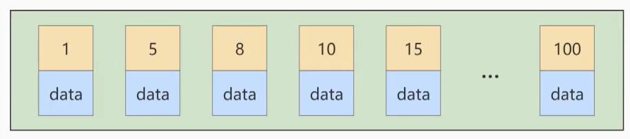

如果此时再插入一条主键值为9的记录，那它插入的位置就如下图：


可这个数据页已经满了，再插进来咋办呢?我们需要把当前页面分裂成两个页面，把本页中的一些记录移动到新创建的这个页中。页面分裂和记录移位意味着什么?意味着:性能损耗!所以如果我们想尽量避免这样无谓的性能损耗，最好让插入的记录的主键值依次递增，这样就不会发生这样的性能损耗了。所以我们建议:让主键具有==AUTO_ INCREMENT==，让存储弓|擎自己为表生成主键,而不是我们手动插入，比如: person_ info表:

##### 2.2.6.2.4 计算、函数、类型转换(自动或手动)导致索引失效

```mysql
# 1
EXPLAIN SELECT SQL_NO_CACHE * FROM student WHERE name LIKE 'abc%' ;
# 2 
EXPLAIN SELECT SQL_NO_CACHE * FROM student WHERE LEFT(name,3) = 'abc';
# 如果name上建索引，1能用上索引，2不能用上索引。
```

```mysql
CREATE INDEX idx_sno ON student(stuno) ;
# 1
EXPLAIN SELECT SQL_NO_CACHE id,stuno,NAME FROM student WHERE stuno + 1 = 900001 ;
# 2
EXPLAIN SELECT SQL_NO_CACHE id,stuno,NAME FROM student WHERE stuno= 900001 ;
# 2能用上索引
```

```mysql
# name是varchar类型，此查询语句中name做了类型转换
EXPLAIN SELECT SQL_NO_CACHE * FROM student WHERE NAME = 123;
EXPLAIN SELECT SQL_NO_CACHE * FROM student WHERE NAME = '123';
```

##### 2.2.6.2.5 范围条件右边的索引列失效

```mysql
# 创建索引
CREATE INDEX idx_age_classId_name ON student(age, classId,NAME)
# classId条件是个范围，key_len的值是10，5(age) + 5(classId) = 10，说明name索引没有用上，
EXPLAIN SELECT SQL_NO_CACHE * FROM student WHERE age=30 AND classId>20 AND name = 'abc';
```

```mysql
# 调整索引
CREATE INDEX idx_age_name_classId ON student(age, NAME, classId);
# key_len的值是73，5(age) + 5(classId) + 63(name) = 73
EXPLAIN SELECT SQL_NO_CACHE * FROM student WHERE age=30 AND classId>20 AND name = 'abc';
```

注意：这里的右边是指联合索引列的右边，而不是where条件的右边，索引的选择与where条件的顺序无关，查询优化器会自动调整条件的顺序。创建联合索引时，务必把范围涉及到的字段写在最后，比如日期。

##### 2.2.6.2.6 不等于(!= 或<>)索引失效

##### 2.2.6.2.7 IS NOT NULL无法使用索引

IS NULL 可以使用索引，IS NOT NULL 无法使用索引。与不等于类似。

##### 2.2.6.2.8 LIKE 以通配符%开头的索引失效

##### 2.2.6.2.9 OR前后存在非索引的列，索引失效

```mysql
CREATE INDEX idx_age ON student(age)
#age用了索引，classId没有索引全表扫描，查询优化器会直接选择不用索引
EXPLAIN SELECT SQL_NO_CACHE * FROM student WHERE age = 10 OR classId = 100;

CREATE INDEX idx_age_cid ON student(age,classId)
# OR不会使用联合索引
EXPLAIN SELECT SQL_NO_CACHE * FROM student WHERE age = 10 OR classId = 100;

CREATE INDEX idx_cid ON student(classId)
#age有索引，classId有索引，EXPLAIN结果的key列的值是，idx_age,idx_cid，key_len的值是5,5
EXPLAIN SELECT SQL_NO_CACHE * FROM student WHERE age = 10 OR classId = 100;
```

##### 2.2.6.2.10 数据库和表的字符集统一使用utf8mb4

统一使用utf8mb4（5.5.3版本以上支持）兼容性更好，统一字符集可以避免由于字符集转换产生的乱码。不同的字符集进行比较前需要进行转换会造成索引失效。

##### 2.2.6.2.11 练习及一般性建议

假设: index(a,b,c)

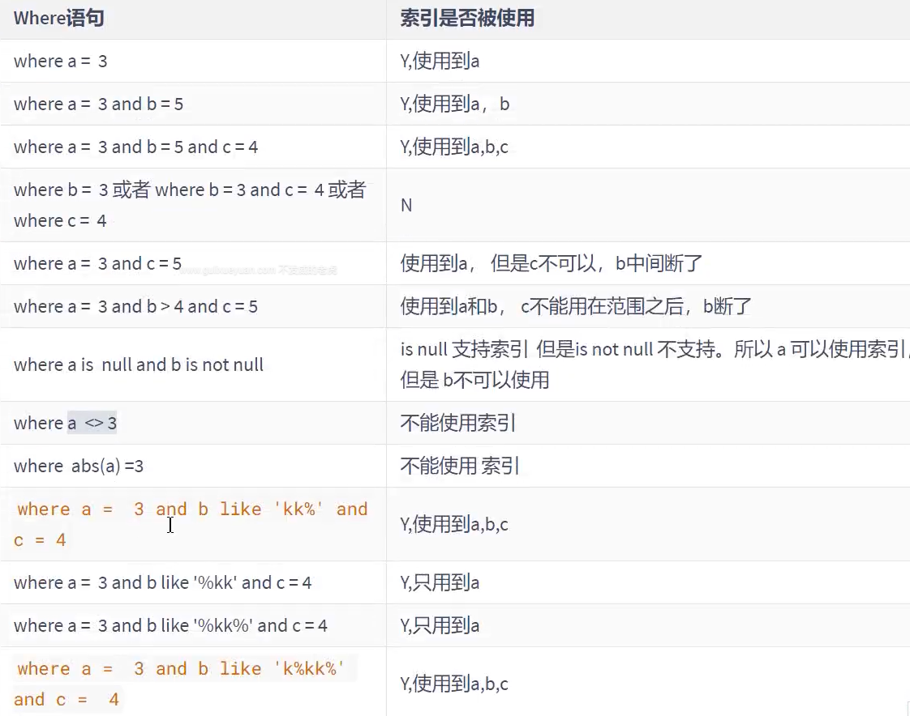

#### 2.2.6.3 关联查询优化

```mysql
#创建表
# 分类
CREATE TABLE IF NOT EXISTS type (
`id` INT(10) UNSIGNED NOT NULL AUTO_INCREMENT ,
`card` INT (10) UNSIGNED NOT NULL,
PRIMARY KEY (`id`)
);
# 图书馆
CREATE TABLE IF NOT EXISTS book(
`bookid` INT(10) UNSIGNED NOT NULL AUTO_INCREMENT ,
`card` INT(10) UNSIGNED NOT NULL,
PRIMARY KEY (`bookid` )
);
```

##### 2.2.6.3.1 外连接查询优化

```mysql
EXPLAIN SELECT SQL_NO_CACHE * FROM `type` LEFT JOIN book ON type.card = book.card;
#添加book索引：如果只能存在一个索引，那么一定是在被驱动表上建立索引
CREATE INDEX Y ON book(card);
EXPLAIN SELECT SQL_NO_CACHE * FROM `type` LEFT JOIN book ON type.card = book.card;
#添加type索引
CREATE INDEX X ON type(card);
EXPLAIN SELECT SQL_NO_CACHE * FROM `type` LEFT JOIN book ON type.card = book.card;
#type是左边的表，作为驱动表，book作为右边的表，作为被驱动表
#两个表中连接条件字段名可以不一样，但是类型一定得一样，否则索引会失效
```

##### 2.2.6.3.2 外连接查询优化

```mysql
#添加book索引
CREATE INDEX Y ON book(card);
EXPLAIN SELECT SQL_NO_CACHE * FROM `type` INNER JOIN book ON type.card = book.card;
#添加type索引
CREATE INDEX X ON type(card);
EXPLAIN SELECT SQL_NO_CACHE * FROM `type` INNER JOIN book ON type.card = book.card;
#结论：对于内连接，查询优化器可以决定谁作为驱动表，谁作为被驱动表

#删除索引
DROP INDEX Y ON book;
#结论：对于内连接中，如果表的连接条件中只能有一个字段有索引，则有索引的字段所在的表会被作为被驱动表
EXPLAIN SELECT SQL_NO_CACHE * FROM `type` INNER JOIN book ON type.card = book.card;


#结论：对于内连接来说，在两个表的连接条件都存在索引的情况下，查询优化器会选择小表作为驱动表。“小表驱动大表”
```

##### 2.2.6.3.3 JOIN语句原理

###### 2.2.6.3.3.1 驱动表和被驱动表

驱动表就是主表，被驱动表是从表，非驱动表。

* 对于内连接来说

  ```mysql
  SELECT * FROM A JOIN B ON ……
  ```

  A一定是驱动表吗?不一定， 优化器会根据你查询语句做优化，决定先查哪张表。先查询的那张表就是驱动表反之就是被驱动表。通过explain关键字可以查看（在前面的是驱动表）

* 对于外连接来说：

  ```mysql
  SELECT * FROM A LEFT JOIN B ON
  #或
  SELECT * FROM B RIGHT JOIN A ON
  ```

  通常,大家会认为A就是驱动表, B就是被驱动表。但也未必。测试如下: 

  ```mysql
  CREATE TABLE a(f1 INT, f2 INT, INDEX (f1) ) ENGINE=INNODB;
  CREATE TABLE b(f1 INT, f2 INT) ENGINE= INNODB;
  INSERT INTO a VALUES(1,1), (2,2), (3,3), (4,4), (5,5), (6,6);
  INSERT INTO b VALUES(3,3), (4,4), (5,5), (6,6), (7,7), (8,8);
  #测试1---b是驱动表
  EXPLAIN SELECT * FROM a LEFT JOIN b ON(a.f1=b.f1) WHERE (a.f2=b.f2);
  
  #测试2---a是驱动表
  EXPLAIN SELECT * FROM a LEFT JOIN b ON(a.f1=b.f1) AND (a.f2=b.f2);
  ```

###### 2.2.6.3.3.2 Simple Nest-Loop Join (简单嵌套循环连接)

算法相当简单，从表A中取出一条数据1,遍历表B,将匹配到的数据放到result……以此类推，驱动表A中的每一条记录与被驱动表B的记录进行判断：


可以看到这种方式效率是非常低的，以上述表A数据100条,表B数据1000条计算，则A*B = 10万次。开销统计如下：


当然mysql肯定不会这么粗暴的去进行表的连接,所以就出现了后面的两种对Nested-Loop Join优化算法。

###### 2.2.6.3.3.3 Index Nested-Loop Join (索引嵌套循环)

Index Nested-Loop Join其优化的思路主要是为了==减少内层表数据的匹配次数==，所以要求被驱动表上必须==有索引==才行。通过外层表匹配条件直接与内层表索索引进行匹配，避免和内层表的每条记录去进行比较，这样极大的减少 了对内层表的匹配次数。


驱动表中的每条记录通过被驱动表的索引进行访问，因为索引查询的成本是比较固定的，故mysql优化器都倾向于使用记录数少的表作为驱动表(外表)。


如果被驱动表加索引，效率是非常高的，但如果索引不是主键索引，所以还得进行一次回表查询。 相比,被驱动表的索引是主键索引，效率会更高。

###### 2.2.6.3.3.4 Bloack Nested-Loop Join (块嵌套循环连接)

如果存在索引，那么会使用index的方式进行join,如果join的列没有索引，被驱动表要扫描的次数太多了。每次访问被驱动表，其表中的记录都会被加载到内存中，然后再从驱动表中取一条与其匹配，匹配结束后清除内存，然后再从驱动表中加载一条记录,然后把被驱动表的记录在加载到内存匹配，这样周而复始,大大增加了10的次数。为了减少被驱动表的I0次数,就出现了Block Nested-Loop Join的方式。

不再是逐条获取驱动表的数据，而是一块一块的获取，引入了join buffer缓冲区，将驱动表join相关的部分数据列(大小受join buffer的限制)缓存到join buffer中，然后全表扫描被驱动表,被驱动表的每一条记录一次性和join buffer中的所有驱动表记录进行匹配(内存中操作) , 将简单嵌套循环中的多次比较合并成一-次, 降低了被驱动表的访问频率。

>注意:
>
>这里缓存的不只是关联表的列，select 后面的列也会缓存起来。
>
>在一个有N个join关联的sql中会分配N-1个join buffer。所以查询的时候尽量减少不必要的字段，可以让join buffer中可以存放更多的列。


###### 2.2.6.3.3.5 Join小结

1. 整体效率比较: INLJ > BNLJ > SNLJ

2. 永远用小结果集驱动大结果集(其本质就是减少外层循环的数据数量) (大小的度量单位指的是表“行数 * 每行大小”)

   

3. 为被驱动表匹配的条件增加索引（减少内层表的循环匹配次数）

4. 增大join buffer size的大小(一次缓存的数据越多,那么内层包的扫表次数就越少)

5. 减少驱动表不必要的字段查询(字段越少，join buffer所缓存的数据就越多)

6. **==从MySQL的8.0.20版本开始将废弃BNLJ,因为从MySQL8.0.18版本升始就加入了hash join默认都会使用hash join==**

   * Nested Loop

     对于被连接的数据子集较小的情况，Nested Loop是个较好的选择。

   * Hash Join是做大数据集连接时的常用方式，优化器使用两个表中较小(相对较小)的表利用Join Key在内存中建立散列表，然后扫描较大的表并探测散列表，找出与Hash表匹配的行。

     * 这种方式适用于较小的表完全可以放于内存中的情况，这样总成本就是访问两个表的成本之和。
     * 在表很大的情况下并不能完全放入内存，这时优化器会将它分割成若干不同的分区，不能放入内存的部分就把该分区写入磁盘的临时段，此时要求有较大的临时段从而尽量提高I/O的性能。
     * 它能够很好的工作于没有索引的大表和并行查询的环境中，并提供最好的性能。大多数人都说它是Join的重型升降机。Hash Join只能应用于等值连接(如WHERE A.COL1 = B.COL2)，这是由Hash的特点决定的。

#### 2.2.6.4 子查询优化

子查询是MySQL的一项重要的功能，可以帮助我们通过一个SQL语句实现比较复杂的查询。但是，子查询的执行效率不高。原因:

1. 执行子查询时，MySQL需要为==内层查询语句的查询结果建立一个临时表==，然后外层查询语句从临时表中查询记录。查询完毕后，再撤销这些临时表。这样会消耗过多的CPU和I0资源，产生大量的慢查询。
2. 子查询的结果集存储的临时表，不论是内存临时表还是磁盘临时表都==不会存在索引==，所以查询性能会受到一定的影响。
3. 对于返回结果集比较大的子查询，其对查询性能的影响也就越大。 

在MySQL中，可以使用连接(JOIN) 查询来替代子查询。连接查询不需要建立临时表，其速度比子查询要快，如果查询中使用索引的话，性能就会更好。

```mysql
CREATE INDEX idx_monitor ON class (monitor) ;
# 子查询
EXPLAIN SELECT * FROM student AS stu1
WHERE stu1.stuno IN (
	SELECT monitor
	FROM class c
	WHERE monitor IS NOT NULL
) ;

# 推荐改写成多表查询方式
EXPLAIN SELECT stu1.* FROM student stu1 JOIN class c
ON stu1.stuno = c.monitor
WHERE c.monitor IS NOT NULL;
```

```mysql
# 查询不为班长的学生信息
EXPLAIN SELECT * FROM student AS stu1
WHERE stu1.stuno NOT IN (
	SELECT monitor
	FROM class c
	WHERE monitor IS NOT NULL
) ;
# 推荐改写
EXPLAIN SELECT stu1.* FROM student stu1 LEFT JOIN class c
ON stu1.stuno = c.monitor
WHERE c.monitor IS NULL;
```

#### 2.2.6.5 排序优化

##### 2.2.6.5.1 排序优化

问题：在WHERE条件字段上加索引，但是为什么在ORDER BY字段上还要加索引|呢?

回答：

在MySQL中,支持两种排序方式，分别是FileSort和Index排序。

* Index 排序中，索引可以保证数据的有序性，不需要再进行排序，效率更高。
* FileSort 排序则一般在内存中进行排序，占用CPU较多。如果待排结果较大，会产生临时文件1/0到磁盘进行排序的情况，效率较低。

优化建议：

1. SQL中，可以在WHERE子句和ORDER BY子句中使用索引，目的是在WHERE子句中避免全表扫描，在ORDER BY子句避免使用FileSort排序。当然，某些情况下全表扫描，或者FileSort排序不一定比索引慢。但总的来说，我们还是要避免，以提高查询效率。
2. 尽量使用Index完成ORDER BY排序。如果WHERE和ORDER BY后面是相同的列就使用单索引列；如果不同就使用联合索引。
3. 无法使用Index时，需要对FileSort方式进行调优。

```mysql
# 对student创建索引
CREATE INDEX idx_age_cid_name ON student (age, classid, name)
# （1）
# ORDER BY 时不limit，索引失效
EXPLAIN SELECT SQL_NO_CACHE* FROM student ORDER BY age,classid; # 回表
# 其实用不用索引也跟数据量有关，数据量大的话，针对二级索引，每条数据都要回表，倒不如直接在内存中排序速度快。
# （2）
# 用上了索引
EXPLAIN SELECT SQL_NO_CACHE age,classid FROM student ORDER BY age,classid; # 不用回表
# 这种情况不需要回表，直接在扫描二级索引的过程中就可以取得所需字段的数据。但是像下面这个查询就不会用上索引，因为查询字段中多了stuno，索引中并没有stuno，需要回表。
EXPLAIN SELECT SQL_NO_CACHE age,classid,stuno FROM student ORDER BY age,classid;
# （3）
# 有LIMIT 用到了索引
EXPLAIN SELECT SQL_NO_CACHE* FROM student ORDER BY age,classid LIMIT 10;
# 数据量少，二级索引对于age，classid是有序的，我干脆在二级索引找到前十个，只针对这十个回表就会很快。

# （4）ORDER BY 顺序不对，导致索引失效
CREATE INDEX idx_age_classid_stuno ON student (age,classid,stuno);
EXPLAIN SELECT *FROM student ORDER BY classid LIMIT 10; # 索引失效
EXPLAIN SELECT *FROM student ORDER BY classid,NAME LIMIT 10; # 索引失效
EXPLAIN SELECT *FROM student ORDER BY age,classid,stuno LIMIT 10; # idx_age_classid_stuno
EXPLAIN SELECT *FROM student ORDER BY age,classid LIMIT 10; # idx_age_cid_name
EXPLAIN SELECT *FROM student ORDER BY age LIMIT 10; # idx_age_cid_name
# （5）ORDER BY时规则不一致，索引失效（顺序错，不索引；方向反，不索引）
EXPLAIN SELECT * FROM student ORDER BY age DESC,classid ASC LIMIT 10; # 方向反，不索引
EXPLAIN SELECT * FROM student ORDER BY classid DESC,NAME DESC LIMIT 10; # 没有age失效
EXPLAIN SELECT * FROM student ORDER BY age Asc,classid DESC LIMIT 10; # 方向反，不索引
EXPLAIN SELECT * FROM student ORDER BY age DESC,classid DESC LIMIT 10; # idx_age_cid_name
# （6）无过滤不索引
EXPLAIN SELECT * FROM student wHERE age=45 ORDER BY classid; #idx_age_classid_stuno 5
EXPLAIN SELECT * FROM student WHERE age=45 ORDER BY classid,NAME; #idx_age_cid_name 5
EXPLAIN SELECT * FROM student WHERE classid=45 ORDER BY age; #数据量大，如果先排序每条数据还需要回表，然后再将会表的数据过滤classid，查询优化器觉得，还不如先过滤再在内存中排序
EXPLAIN SELECT * FROM student WHERE classid=45 ORDER BY age LIMIT 10;#idx_age_cid_name 73
```

小结：

```mysql
INDEX a_b_c(a,b,c)

order by能使用索引最左前缀
- ORDER BY a
- ORDER BY a, b
- ORDER BY a, b, c
- ORDER BY a DESC, b DESC, c DESC
如果WHERE使用索引的最左前缀定义为常量，则order by 能使用索引
- WHERE a = const ORDER BY b, c
- WHERE a = const AND b = const ORDER BY c
- WHERE a = const ORDER BY b,己
- WHERE a = const AND b > const ORDER BY b , c
不能使用索引进行排序
- ORDER BY a ASC , b DESC , c DESC /*排序不一致*/
- WHERE g = const ORDER BY b,c /*丢失a索引*/
- WHERE a = const ORDER BY c /*丢失b索引*/
- WHERE a = const ORDER BY a, d /*d不是索引的一部分*/
- WHERE a in (...) ORDER BY b, c /*对于排序来说，多个相等条件也是范围查询*/
```

 ##### 2.2.6.5.2 实战:测试filesort和index排序

```mysql
# 先删除student表中的索引
EXPLAIN SELECT SQL_NO_CACHE* FROM student WHERE age = 30 AND stuno <101000 ORDER BY NAME;
#方案一:为了去掉filesort我们可以把索引建成
CREATE INDEX idx_age_name ON student (age, NAME);
#使用了索引但是key_len=5，也就是索引中没有使用name检索
EXPLAIN SELECT SQL_NO_CACHE * FROM student WHERE age = 30 AND stuno <101000 ORDER BY NAME ;
#方案二:
CREATE INDEX idx_age_stuno_name ON student (age, stuno,NAME);
# 使用了file sort 时间更短
EXPLAIN SELECT SQL_NO_CACHE * FROM student WHERE age = 30 AND stuno <101000 ORDER BY NAME ;
```

方案二使用了file sort更快原因：（理论上讲使用filesort更慢）

所有的排序都是在条件过滤之后才执行的。所以，如果条件过滤掉大部分数据的话，剩下几百几千条数据进行排序其实并不是很消耗性能，即使索引优化了排序，但实际提升性能很有限。相对的stuno<101000这个条件，如果没有用到索引的话，要对几万条的数据进行扫描，这是非常消耗性能的，所以索引放在这个字段上性价比最高，是最优选择。

结论：

两个索引同时存在，mysql自动选择最优的方案。(对于这个例子，mysql选择idx_age_stuno_name)但是，随着数据量的变化，选择的索引也会随之变化的。

当【范围条件】和【group by或者order by】的字段出现二选一时，优先观察条件字段的过滤数量，如果过滤的数据足够多，而需要排序的数据并不多时，优先把索引放在范围条件字段上。反之，亦然。

##### 2.2.6.5.3 filesort算法：双路排序和单路排序

排序的字段如果不在索引列上，则filesort会有两种算法：双路排序和单路排序

1. 双路排序（慢）

   * MySQL 4.1之前是使用双路排序，字面意思就是两次扫描磁盘，最终得到数据，读取行指针和order by列，对他们进行排序，然后扫描已经排序好的列表，按照列表中的值重新从列表中读取对应的数据输出
   * 从磁盘取排序字段，在buffer进行排序，再从磁盘取其他字段。

   取一批数据，要对磁盘进行两次扫描，众所周知，IO是很耗时的，所以在mysql4.1之后，出现了第二种改进的算法，就是单路排序。

2. 单路排序（快）

   从磁盘读取查询需要的所有列，按照order by列在buffer对它们进行排序，然后扫描排序后的列表进行输出，它的效率更快一些，避免了第二次读取数据。并且把随机lO变成了顺序lO，但是它会使用更多的空间，因为它把每一行都保存在内存中了。

**结论及引申出的问题**

* 由于单路是后出的，总体而言好过双路
* 但是用单路有问题
  * 在sort_buffer中，单路比多路要多占用很多空间，因为单路是把所有字段都取出,所以有可能取出的数据的总大小超出了sort_buffer的容量，导致每次只能取sort_buffer容量大小的数据，进行排序（创建tmp文件，多路合并)，排完再取sort_buffer容量大小，再排......从而多次I/O。
  * 单路本来想省一次I/O操作，反而导致了大量的I/O操作，反而得不偿失。

**优化策略：**

1. 尝试提高sort_buffer_size

   不管用哪种算法，提高这个参数都会提高效率，要根据系统的能力去提高，因为这个参数是针对每个进程(connection)的1M-8M之间调整。MySQL5.7，InnoDB存储引擎默认值是1048576字节，1MB。

2. 尝试提高max_length_for_sort_data

   * 提高这个参数，会增加用改进算法的概率。

     ```mysql
     SHOW VARIABLES LIKE ' %max_length_for_sort_data%' ;#默认1024字节
     ```

   * 但是如果设的太高，数据总容量超出sort_buffer_size的概率就增大，明显症状是高的磁盘I/O活动和低的处理器使用率。如果需要返回的列的总长度大于max_length_for_sort_data，使用双路算法，否则使用单路算法。1024-8192字节之间调整

3. ORDER BY时select *是一个大忌，

   * 当Query的字段大小总和小于max_length_for_sort_data，而且排序字段不是TEXT|BLOB类型时，会用改进后的算法――单路排序，否则用老算法――多路排序。
   * 两种算法的数据都有可能超出sort_buffer_size的容量，超出之后，会创建tmp文件进行合并排序，导致多次I/O，但是用单路排序算法的风险会更大一些，所以要提高sort_buffer_size。

#### 2.2.6.6 GROUP BY优化

* group by使用索引的原则几乎跟order by一致，group by即使没有过滤条件用到索引，也可以直接使用索引。
* group by 先排序再分组，遵照索引建的最佳左前缀法则
* 当无法使用索引列，增大max_length_for_sort_data和sort_buffer_size参数的设置
* where效率高于having，能写在where限定的条件就不要写在having中了
* 减少使用order by，和业务沟通能不排序就不排序，或将排序放到程序端去做。Order by、group by、distinct这些语句较为耗费CPU，数据库的CPU资源是极其宝贵的。
* 包含了order by、group by、distinct这些查询的语句，where条件过滤出来的结果集请保持在1000行以内，否则SQL会很慢。

#### 2.2.6.7 优化分页查询

一般分页查询时，通过创建覆盖索引能够比较好地提高性能。一个常见又非常头疼的问题就是LIMIT 2000000,10，此时需要MysQL排序前2000010记录，仅仅返回2000000-2000010的记录，其他记录丢弃，查询排序的代价非常大。

##### 2.2.6.7.1 优化思路一

在索引上完成排序分页操作，最后根据主键关联回原表查询所需要的其他列内容。

```mysql
EXPLAIN SELECT * FRON student t,(SELECT id FROM student ORDER BY id LIMIT 2000000,10) a WHERE t.id = a.id;
```

##### 2.2.6.7.2 优化思路二

该方案适用于主键自增的表，可以把Limit查询转换成某个位置的查询。

```mysql
EXPLAIN SELECT * FROM student WHERE id > 2000000 LIMIT 10;
```

#### 2.2.6.8 覆盖索引

##### 2.2.6.8.1 什么是覆盖索引

* 理解方式一:索引是高效找到行的一个方法，但是一般数据库也能使用索引找到一个列的数据，因此它不必读取整个行。毕竟索引叶子节点存储了它们索引的数据;当能通过读取索引就可以得到想要的数据，那就不需要读取行了。==一个索引包含了满足查询结果的数据就叫做覆盖索引==。
* 理解方式二︰非聚簇复合索引的一种形式，它包括在查询里的SELECT、JOIN和WHERE子句用到的所有列(即建索引的字段正好是覆盖查询条件中所涉及的字段)。
  简单说就是，`索引列+主键`包含SELECT到FROM之间查询的列。

##### 2.2.6.8.2 覆盖索引的利弊

1. 好处：

   * 避免Innodb表进行索引的二次查询(回表)
     Innodb是以聚集索引的顺序来存储的，对于Innodb来说，二级索引在叶子节点中所保存的是行的主键信息，如果是用二级索引查询数据，在查找到相应的键值后，还需通过主键进行二次查询才能获取我们真实所需要的数据。在覆盖索引中，二级索引的键值中可以获取所要的数据，避免了对主键的二次查询，减少了IO操作，提升了查询效率。

   * 可以把随机IO变成顺序lo加快查询效率
     由于覆盖索引是按键值的顺序存储的，对于I0密集型的范围查找来说，对比随机从磁盘读取每一行的数据Io要少的多，因此利用覆盖索引在访问时也可以把磁盘的随机读取的IO转变成索引查找的顺序IO。
     ==由于覆盖索引可以减少树的搜索次数，显著提升查询性能，所以使用覆盖索引是一个常用的性能优化手段。==

2. 弊端:
   索引字段的维护总是有代价的。因此，在建立冗余索引来支持覆盖索引时就需要权衡考虑了。这是业务DBA，或者称为业务数据架构师的工作。

#### 2.2.6.9 索引条件下推 （ICP）

##### 2.2.6.9.1 使用前后对比

Index Condition Pushdown(ICP)是MySQL 5.6中新特性，是一种在存储引擎层使用索引过滤数据的优化方式。

* 如果没有ICP，存储引擎会遍历索引以定位基表中的行，并将它们返回给MysQL服务器，由MysQL服务器评估==WHERE==后面的条件是否保留行。
* 启用ICP后，如果部分WHERE条件可以仅使用索引中的列进行筛选，则MysQL服务器会把这部分WHERE条件放到存储引擎筛选。然后，存储引擎通过使用索引条目来筛选数据，并且只有在满足这一条件时才从表中读取行。
  * 好处：ICP可以减少存储引擎必须访问基表的次数和MySQL服务器必须访问存储引擎的次数。
  * 但是，ICP的加速效果取决于在存储引擎内通过ICP筛选掉的数据的比例。

##### 2.2.6.9.2  ICP的开启/关闭

默认情况下启用索引条件下推。可以通过设置系统变量optimizer_switch控制：index_condition_pushdown

```mysql
# 关闭索引下推
SET optimizer_switch = 'index_condition_pushdown=off';

# 打开索引下推
SET optimizer_switch = 'index_condition_pushdown=on' ;
```

当使用索引条件下推时，EXPLAIN语句输出结果中Extra列内容显示为 Using index condition。

##### 2.2.6.9.3 ICP使用案例


为该表定义联合索引zip_last_first (zipcode，lastname，firstname)。如果我们知道了一个人的邮编，但是不确定这个人的姓氏，我们可以进行如下检索:


执行查看SQL的查询计划，Extra中显示了Using index condition，这表示使用了索引下推。另外，Using where表示条件中包含需要过滤的非索引列的数据，即address LIKE '%北京市%'这个条件并不是索引列，需要在服务端过滤掉。

==解释==：查询条件中zipcode用到了索引，但是lastname LIKE条件以%开头导致索引失效，而联合索引中第二个字段又有lastname，所以存储引擎在使用zipcode索引的同时，也会使用lastname索引根据条件对数据进行过滤。

==为什么索引失效了还要使用该索引进行一次过滤呢？==如果没有使用lastname进行过滤，只用zipcode索引查询到的数据量可能会很大，而根据二级索引查询出来的数据还要进行一次回表，每次回表都要经历2-4次IO，这样会很耗时。如果使用索引条件下推，即虽然lastname索引失效但也会根据条件对索引数据进行过滤，使得二级索引查出来的数据量尽可能的少，以减少回表的次数。

##### 2.2.6.9.4 ICP的使用条件

1. 如果表访问的类型为range、ref、eq_ref和ref_or_null 可以使用ICP
2. ICP可以用于InnoDB和MyISAM表，包括分区表InnoDB和 MyISAM表
3. 对于InnoDB表，ICP仅用于二级索引。ICP的目标是减少全行读取次数，从而减少I/O操作。
4. 当SQL使用覆盖索引时，不支持ICP。因为这种情况下使用ICP不会减少I/o。
5. 相关子查询的条件不能使用ICP

#### 2.2.6.10 其他查询优化策略

##### 2.2.6.10.1 EXISTS 和 IN的区分

问题：

不太理解哪种情况下应该使用EXISTS，哪种情况应该用IN。选择的标准是看能否使用表的索引吗?

回答：

索引是个前提，其实选择与否还是要看表的大小。你可以将选择的标准理解为==小表驱动大表==。在这种方式下效率是最高的。

比如下面这样的：

```mysql
SELECT * FROM A WHERE cc IN (SELECT cc FROM B);
SELECT * FROM A WHERE EXISTS (SELECT cc FROM B WHERE B.cc = A.cc);
```

当A小于B时，用EXISTS。因为EXISTS的实现，相当于外表循环，实现的逻辑类似于:

```java
for i in A
	for j in B
		if j.cc == i.cc then …… 
```

当B小于A时用IN，因为实现的逻辑类似于:

```java
for i in B
    for j in A
   		if j.cc == i.cc then ……
```

哪个表小就用哪个表来驱动，A表小就用EXISTS，B表小就用IN。

##### 2.2.6.10.2 COUNT(*)与COUNT(具体字段)效率

问：在MysQL中统计数据表的行数，可以使用三种方式: SELECT COUNT(*)、SELECT COUNT(1)和SELECTCOUNT(具体字段)，使用这三者之间的查询效率是怎样的?

答：

前提：如果你要统计的是某个字段的非空数据行数，则另当别论，毕竟比较执行效率的前提是结果一样才可以。

* 环节1：COUNT( * )和COUNT(1)都是对所有结果进行COUNT，cOUNT(*)和COUNT(1)本质上并没有区别(二者执行时间可能略有差别，不过你还是可以把它俩的执行效率看成是相等的)。如果有WHERE子句，则是对所有符合筛选条件的数据行进行统计；如果没有WHERE子句，则是对数据表的数据行数进行统计。

* 环节2：如果是MyISAM存储引擎，统计数据表的行数只需要0(1)的复杂度，这是因为每张MyISAM的数据表都有一个meta 信息存储了row_count值，而一致性则由表级锁来保证。

  如果是InnoDB存储引擎，因为InnoDB支持事务，采用行级锁和MVCC机制，所以无法像MyISAM一样，维护一个row_count变量，因此需要采用扫描全表，是0(n)的复杂度，进行循环＋计数的方式来完成统计。

* 环节3：在InnoDB引擎中，如果采用COUNT(具体字段)来统计数据行数，要尽量采用二级索引。因为主键采用的索引是聚簇索引，聚簇索引包含的信息多，明显会大于二级索引(非聚簇索引)。对于COUNT(*)和COUNT(1)来说，它们不需要查找具体的行，只是统计行数，系统会自动采用占用空间更小的二级索引来进行统计。

  如果有多个二级索引，会使用key_len小的二级索引进行扫描。当没有二级索引的时候，才会采用主键索引来进行统计。

##### 2.2.6.10.3 关于SELECT(*)

在表查询中，建议明确字段，不要使用 * 作为查询的字段列表，推荐使用SELECT<字段列表>查询。原因：

* MysQL在解析的过程中，会通过查询数据字典将"*"按序转换成所有列名，这会大大的耗费资源和时间。
* 无法使用覆盖索引

##### 2.2.6.10.4 LIMIT 1对优化的影响

针对的是会扫描全表的SQL语句，如果你可以确定结果集只有一条，那么加上LIMIT 1的时候，当找到一条结果的时候就不会继续扫描了，这样会加快查询速度。

如果数据表已经对字段建立了唯一索引，那么可以通过索引进行查询，不会全表扫描的话，就不需要加上LIMIT 1了。

##### 2.2.6.10.5 多使用COMMIT

只要有可能，在程序中尽量多使用COMMIT，这样程序的性能得到提高，需求也会因为COMMIT所释放的资源而减少。
COMMIT所释放的资源：

* 回滚段上用于恢复数据的信息
* 被程序语句获得的锁I
* redo / undo log buffer中的空间
* 管理上述3种资源中的内部花费

#### 2.2.6.11 数据库主键如何设计？

##### 2.2.6.11.1 自增ID的问题

1. 可靠性不高

   存在自增ID回溯的问题，这个问题直到最新版本的MySQL 8.0才修复。

2. 安全性不高

   对外暴露的接口可以非常容易猜测对应的信息。比如:/User/1/这样的接口，可以非常容易猜测用户ID的值为多少，总用户数量有多少,也可以非常容易地通过接口进行数据的爬取。

3. 性能差

   自增ID的性能较差，需要在数据库服务器端生成。

4. 交互多

   业务还需要额外执行一次类似last_insert_id()的函数才能知道刚才插入的自增值，这需要多一次的网络交互。在海量并发的系统中，多1条sQL，就多一次性能上的开销。

5. 局部唯一性

   最重要的一点，自增ID是局部唯一，只在当前数据库实例中唯一，而不是全局唯一，在任意服务器间都是唯一的。对于目前分布式系统来说，这简直就是噩梦。

##### 2.2.6.11.2 业务字段做主键（不推荐）

为了能够唯一地标识一个会员的信息，需要为会员信息表设置一个主键。那么，怎么为这个表设置主键，才能达到我们理想的目标呢?这里我们考虑业务字段做主键。


在这个表中哪个字段比较合适？

* 卡号


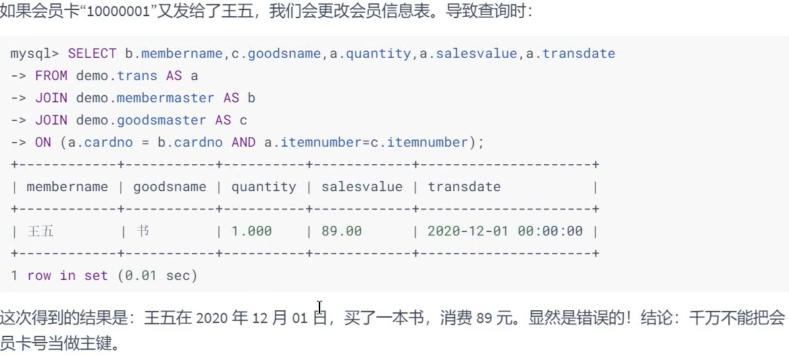

* 选择会员电话或身份证号


##### 2.2.6.11.3 推荐的主键设计


### 2.2.7 索引及调优篇6--数据库设计规范

#### 2.2.7.1 范式

##### 2.2.7.1.1 范式简介

==在关系型数据库中，关于数据表设计的基本原则、规则就称为范式==。可以理解为，一张数据表的设计结构需要满足的某种设计标准的级别。要想设计一个结构合理的关系型数据库，必须满足一定的范式。

范式的英文名称是 Normal Form，简称 NF。它是英国人E.F.Codd在上个世纪70年代提出关系数据库模型后总结出来的。范式是关系数据库理论的基础，也是我们在设计数据库结构过程中所要遵循的规则和指导方法。

##### 2.2.7.1.2 范式包括哪些

目前关系型数据库有六种常见范式，按照范式级别，从低到高分别是：==第一范式(1NF)、第二范式(2NF)、第三范式(3NF)、巴斯-科德范式(BCNF)、第四范式(4NF）和第五范式(（5NF，又称完美范式)==。

数据库的范式设计越高阶，冗余度就越低，同时高阶的范式一定符合低阶范式的要求，满足最低要求的范式是第一范式(1NF)。在第一范式的基础上进一步满足更多规范要求的称为第二范式 (2NF)，其余范式以次类推。

一般来说，在关系型数据库设计中，最高也就遵循到 BCNF，普遍还是3NF。但也不绝对，有时候为了提高某些查询性能，我们还需要破坏范式规则，也就是反规范化。

##### 2.2.7.1.3 键和相关属性的概念


##### 2.2.7.1.4 第一范式（1NF）

第一范式主要是确保数据表中每个字段的值必须具有原子性，也就是说数据表中每个字段的值为不可再次拆分的最小数据单元。
我们在设计某个字段的时候对于字段X来说，不能把字段X拆分成字段X-1和字段×-2。事实上，任何的DBMS都会满足第一范式的要求，不会将字段进行拆分。

##### 2.2.7.1.5 第二范式（2nd NF）消除了非主属性对主键的部分依赖

第二范式要求，在满足第一范式的基础上，还要==满足数据表里的每一条数据记录，都是可唯一标识的。而且所有非主键字段，都必须完全依赖主键，不能只依赖主键的一部分==(消除部份依赖)。如果知道主键的所有属性的值，就可以检索到任何元组(行)的任何属性的任何值。(要求中的主键，其实可以拓展替换为候选键)。

> 举例1:
> 成绩表(学号，课程号，成绩）关系中，(学号，课程号）可以决定成绩，但是学号不能决定成绩课程号也不能决定成绩，所以“(学号，课程号)→成绩”就是完全依赖关系。
>
> 举例2:
> 比赛表 player_game，里面包含球员编号、姓名、年龄、比赛编号、比赛时间和比赛场地等属性，这里候选键和主键都为
>
> ```mysql
> (球员编号，比赛编号)，我们可以通过候选键(或主键)来决定如下的关系:
> (球员编号，比赛编号)→(姓名，年龄，比赛时间，比赛场地，得分)
> ```
>
> 但是这个数据表不满足第二范式，因为数据表中的字段之间还存在着如下的对应关系:
>
> ```mysql
> (球员编号)→(姓名，年龄)
> (比赛编号)→(比赛时间，比赛场地)
> ```
>
> 对于非主属性来说，并非完全依赖候选键。这样会产生怎样的问题呢?
>
> 1. ==数据冗余==∶如果一个球员可以参加m场比赛，那么球员的姓名和年龄就重复了m-1次。一个比赛也可能会有n个球员参加，比赛的时间和地点就重复了n-1次。
> 2. ==插入异常==︰如果我们想要添加一场新的比赛，但是这时还没有确定参加的球员都有谁，那么就没法插入。
> 3. ==删除异常==∶如果我要删除某个球员编号，如果没有单独保存比赛表的话，就会同时把比赛信息删除掉。
> 4. ==更新异常==︰如果我们调整了某个比赛的时间，那么数据表中所有这个比赛的时间都需要进行调整，否则就会
>    出现一场比赛时间不同的情况。
>
> 为了避免出现上述的情况，我们可以把球员比赛表设计为下面的三张表。
>
> 

小结：第二范式(2NF）要求实体的属性完全依赖主关键字。如果存在不完全依赖，那么这个属性和主关键字的这一部分应该分离出来形成一个新的实体，新实体与元实体之间是一对多的关系。

##### 2.2.7.1.6 第三范式（3rd NF）消除了传递依赖，非主属性不得依赖于其他非主属性

第三范式是在第二范式的基础上，确保数据表中的每一个非主键字段都和主键字段直接相关，也就是说，要求==数据表中的所有非主键字段不能依赖于其他非主键字段==。(即，不能存在非主属性A依赖于非主属性B，非主属性B依赖于主键C的情况，即存在“A→B→C”的决定关系）通俗地讲，该规则的意思是所有非主键属性之间不能有依赖关系，必须相互独立。

##### 2.2.7.1.7 小结

关于数据表的设计，有三个范式要遵循。
(1）第一范式(1NF)，确保每列保持原子性
数据库的每一列都是不可分割的原子数据项，不可再分的最小数据单元，而不能是集合、数组、记录等非原子数据项。
(2）第二范式(2NF)，确保每列都和主键完全依赖
尤其在复合主键的情况下，非主键部分不应该依赖于部分主键。
(3）第三范式(3NF）确保每列都和主键列直接相关，而不是间接相关

范式的优点：数据的标准化有助于消除数据库中的数据冗余，第三范式(3NF）通常被认为在性能、扩展性和数据完整性方面达到了最好的平衡。

范式的缺点：范式的使用，可能降低查询的效率。因为范式等级越高，设计出来的数据表就越多、越精细，数据的冗余度就越低，进行数据查询的时候就可能需要关联多张表，这不但代价昂贵，也可能使一些索引策略无效。

范式只是提出了设计的标准，实际上设计数据表时，未必一定要符合这些标准。开发中，我们会出现为了性能和读取效率违反范式化的原则，通过增加少量的冗余或重复的数据来提高数据库的读性能，减少关联查询，join表的次数，实现空间换取时间的目的。因此在实际的设计过程中要理论结合实际，灵活运用。

#### 2.2.7.2 反范式化

有的时候不能简单按照规范要求设计数据表，因为有的数据看似冗余，其实对业务来说十分重要。这个时候，我们就要遵循业务优先的原则，首先满足业务需求，再尽量减少冗余。

如果数据库中的数据量比较大，系统的UV和PV访问频次比较高，则完全按照MysQL的三大范式设计数据表，读数据时会产生大量的关联查询，在一定程度上会影响数据库的读性能。如果我们想对查询效率进行优化，反范式优化也是一种优化思路。此时，可以通过在数据表中增加冗余字段来提高数据库的读性能。

**规范化vs性能**

> 1. 为满足某种商业目标,数据库性能比规范化数捱库更重要
> 2. 在数据规范化的同时,要综合考虑数据库的性能
> 3. 通过在给定的表中添加额外的字段，以大量减少需要从中搜索信息所需的时间
> 4. 通过在给定的表中插入计算列，以方便查询

#### 2.2.7.3 巴斯范式（BCNF）在3NF基础上消除了主属性对候选键的部份依赖或传递依赖

人们在3NF的基础上进行了改进，提出了巴斯范式(BCNF)，也叫做巴斯-科德范式(Boyce-Codd NormalForm)。BCNF被认为没有新的设计规范加入，只是对第三范式中设计规范要求更强，使得数据库冗余度更小。所以，称为是修正的第三范式，或扩充的第三范式，BCNF不被称为第四范式。

==若一个关系达到了第三范式，并且它只有一个候选键，或者它的每个候选键都是单属性，则该关系自然达到BC范式。==

一般来说，一个数据库设计符合3NF或BCNF就可以了。


#### 2.2.7.4 第四范式

多值依赖的概念:

* 多值依赖即属性之间的一对多关系，记为K→→A。

* 函数依赖事实上是单值依赖，所以不能表达属性值之间的一对多关系。

* 平凡的多值依赖︰全集U=K+A，一个K可以对应于多个A，即K→→A。此时整个表就是一组一对多关系。

* 非平凡的多值依赖∶全集U=K+A+B，一个K可以对应于多个A，也可以对应于多个B，A与B互相独立，即

  K→→A，K→→B。整个表有多组一对多关系，且有：“一"部分是相同的属性集合，“多"部分是互相独立的属性集合。

第四范式即在满足巴斯-科德范式(BCNF）的基础上，消除非平凡且非函数依赖的多值依赖（即把同一表内的多对多关系删除）


#### 2.2.7.5 第五范式、域键范式

除了第四范式外，我们还有更高级的第五范式(又称完美范式)和域键范式(DKNF)。

在满足第四范式(4NF)的基础上，消除不是由候选键所蕴含的连接依赖。如果关系模式R中的每一个连接依赖均由R的候选键所隐含，则称此关系模式符合第五范式。

函数依赖是多值依赖的一种特殊的情况，而多值依赖实际上是连接依赖的一种特殊情况。但连接依赖不像函数依赖和多值依赖可以由语义直接导出，而是在关系连接运算时才反映出来。存在连接依赖的关系模式仍可能遇到数据冗余及插入、修改、删除异常等问题。

第五范式处理的是无损连接问题，这个范式基本没有实际意义，因为无损连接很少出现，而且难以察觉。而域键范式试图定义一个终极范式，该范式考虑所有的依赖和约束类型，但是实用价值也是最小的，只存在理论研究中。

#### 2.2.7.6 范式实战案例

商超进货系统中的进货单表进行剖析:

进货单表:


这个表中的字段很多，表里的数据量也很惊人。大量重复导致表变得庞大，效率极低。如何改造?

> 在实际工作场景中，这种由于数据表结构设计不合理，而导致的数据重复的现象并不少见。往往是系统虽然能够运行，承载能力却很差，稍微有点流量，就会出现内存不足、CUP使用率飙升的情况，甚至会导致整个项目失败。

##### 2.2.7.6.1 迭代1次：考虑1NF

第一范式要求：==所有的字段都是基本数据字段，不可进一步拆分==。这里需要确认，所有的列中，每个字段只包含—种数据。

这张表里，我们把“property"这一字段，拆分成“specification(规格)“和“unit(单位)”，这2个字段如下：


##### 2.2.7.6.2 迭代2次：考虑2NF

第二范式要求，在满足第一范式的基础上，==**还要满足数据表里的每一条数据记录，都是可唯一标识的。而且所有字段，都必须完全依赖主键，不能只依赖主键的一部分**==。

第1步，就是要确定这个表的主键。通过观察发现，字段“listnumber(单号)"+"barcode(条码)"可以唯一标识每一条记录，可以作为主键。

第2步，确定好了主键以后，判断哪些字段完全依赖主键，哪些字段只依赖于主键的一部分。把只依赖于主键一部分的字段拆分出去，形成新的数据表。

首先，进货单明细表里面的“goodsname名称)""specification(规格)""unit(单位)"这些信息是商品的属性，只依赖于“barcode(条码)”，不完全依赖主键，可以拆分出去。我们把这3个字段加上它们所依赖的字段“barcode(条码)”，拆分形成一个新的数据表“商品信息表”。

这样一来，原来的数据表就被拆分成了两个表。

商品信息表:


进货单表


此外，字段“supplierid(供应商编号)""suppliername(供应商名称)""stock(仓库)"只依赖于"listnumber(单号)”，不完全依赖于主键，所以，我们可以把"“supplierid""suppliername""stock"这3个字段拆出去，再加上它们依赖的字段listnumber(单号)”，就形成了一个新的表”进货单头表”。剩下的字段，会组成新的表，我们叫它“进货单明细表”。

原来的数据表就拆分成3个表：

进货单头表：


进货单明细表：


商品信息表：


##### 2.2.7.6.3 迭代3次：考虑3NF

对于进货单头表，suppliername依赖于supplierid，supplierid依赖于listnumber，存在传递函数依赖，不满足3NF。

对于进货单明细表，quantity与importprice的乘积恰好是importvalue，存在传递函数依赖，不满足3NF。

对这进货单头表进行改进，添加供货商表：


进货单头表：


##### 2.2.7.6.4 反范式化：业务优先原则

对于进货单明细表，保留quantity与importprice两个字段即可。但是从业务需求角度来讲，我们需要importvalue这一列的值，因为如果我们只保留quantity与importprice两个字段，但是有时候需要总金额统计，那么对于每条数据的查询结果都要做一次计算，一旦遇到大数据量的统计，会导致查询效率大大降低。


#### 2.2.7.7 ER模型

#### 2.2.7.8 数据表的设计原则和SQL规范

https://www.gulixueyuan.com/course/510/task/22357/show

#### 2.2.7.9 PowerDesigner创建概念、物理数据模型

### 2.2.8 索引及调优篇7--数据库其它调优策略

#### 2.2.8.1 数据库调优的措施

##### 2.2.8.1.1 如何定位调优问题

* 用户的反馈（主要)
  用户是我们的服务对象，因此他们的反馈足取且按H。旦A的门晒-S户第一时间发现的。我们要重视用户的反馈，找到和数据相关的问题。
* 日志分析(主要)
  我们可以通过查看数据库日志和操作系统日志等方式找出异常情况，通过它们来定位遇到的问题。
* 服务器资源使用监控
  通过监控服务器的CPU、内存、I/o等使用情况，可以实时了解服务器的性能使用，与历史情况进行对比。
* 数据库内部状况监控
  在数据库的监控中，活动会话（Active Session)监控是一个重要的指标。通过它，你可以清楚地了解数据库当前是否处于非常繁忙的状态，是否存在sQL堆积等。
* 其它
  除了活动会话监控以外，我们也可以对事务、锁等待等进行监控，这些都可以帮助我们对数据库的运行状态有更全面的认识。

##### 2.2.8.1.2 调优的维度和步骤

###### 2.2.8.1.2.1 选择合适的DBMS


###### 2.2.8.1.2.2 优化表设计


###### 2.2.8.1.2.3 优化逻辑查询


###### 2.2.8.1.2.4 优化物理查询


###### 2.2.8.1.2.5 使用Redis或 Memcached 作为缓存


###### 2.2.8.1.2.6 库级优化


1. 读写分离
2. 数据分片

##### 2.2.8.1.3 优化MySQL服务器

###### 2.2.8.1.3.1 优化服务器硬件


###### 2.2.8.1.3.2 优化MySQL的参数


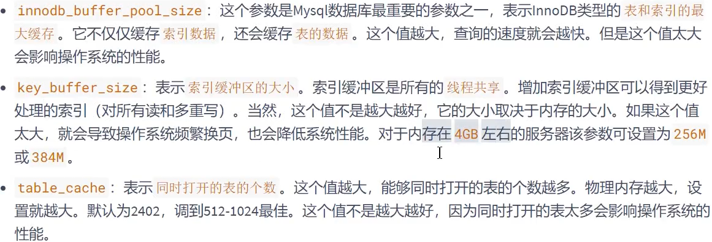


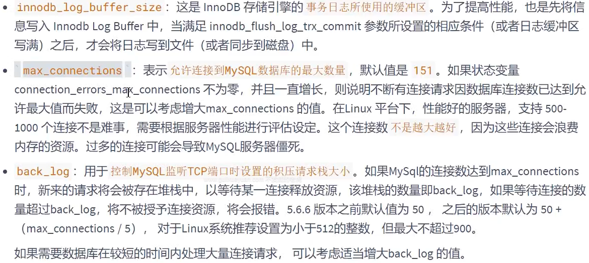


##### 2.2.8.1.4 优化数据库结构

https://www.gulixueyuan.com/course/510/task/22361/show

###### 2.2.8.1.4.1 拆分表：冷热数据分离


###### 2.2.8.1.4.2 增加中间表


###### 2.2.8.1.4.3 增加冗余字段


在反范式化中讲解了

###### 2.2.8.1.4.4 优化数据类型

……

##### 2.2.8.1.5 大表优化

###### 2.2.8.1.5.1 限定查询范围

禁止不带任何限制数据范围条件的查询语句。比如:我们当用户在查询订单历史的时候，我们可以控制在一个月的范围内;

###### 2.2.8.1.5.2 读写分离


###### 2.2.8.1.5.3 垂直拆分

* 如果数据库中的数据表过多，可以采用垂直分库的方式，将关联的数据表部署在同一个数据库上。
* 如果数据表中的列过多，可以采用垂直分表的方式，将一张数据表分拆成多张数据表，把经常一起使用的列放到同一张表里。


垂直拆分的优点：可以使得列数据变小，在查询时减少读取的Block数，减少/O次数。此外，垂直分区可以简化表的结构，易于维护。
垂直拆分的缺点：主键会出现冗余，需要管理冗余列，并会引起JOlN操作。此外，垂直拆分会让事务变得更加复杂。

###### 2.2.8.1.5.4 水平拆分

* 尽量控制单表数据量的大小，建议控制在1000万以内。1000万并不是MysQL数据库的限制，过大会造成修改表结构、备份、恢复都会有很大的问题。此时可以用历史数据归档（应用于日志数据)，水平分表（应用于业务数据）等手段来控制数据量大小。
* 这里我们主要考虑业务数据的水平分表策略。将大的数据表按照某个属性维度分拆成不同的小表，每张小表保持相同的表结构。比如你可以按照年份来划分，把不同年份的数据放到不同的数据表中。2017年、2018年和2019年的数据就可以分别放到三张数据表中。
* 水平分表仅是解决了单一表数据过大的问题，但由于表的数据还是在同一台机器上，其实对于提升MySQL并发能力没有什么意义，所以水平拆分最好分库，从而达到分布式的目的。

水平拆分能够支持非常大的数据量存储，应用端改造也少，但==分片事务难以解决，跨节点Join性能较差，逻辑复杂==。《Java工程师修炼之道》的作者推荐尽量不要对数据进行分片，因为拆分会带来逻辑、部署、运维的各种复杂度，一般的数据表在优化得当的情况下支撑千万以下的数据量是没有太大问题的。如果实在要分片，尽量选择客户端分片架构，这样可以减少一次和中间件的网络l/O。

<font size='3'>下面补充一下数据库分片的两种常见方案</font>

* <font color='red'>客户端代理：分片逻辑在应用端，封装在jar包中，通过修改或者封装JDBC层来实现</font>。当当网的<font color='red'>Sharding-JDBC</font>、阿里的TDDL是两种比较常用的实现。
* <font color='red'>中间件代理：在应用和数据中间加了一个代理层。分片逻辑统一维护在中间件服务中</font>。我们现在谈的<font color='red'>Mycat</font>、360的Atlas、网易的DDB等等都是这种架构的实现。

### 2.2.09 事务篇1--事务的基础知识

#### 2.2.9.1 数据库事务的概述

##### 2.2.9.1.1 基本概念

<font color='red'>事务</font>：一组逻辑操作单元，使数据从一种状态变换到另一种状态。
<font color='red'>事务处理的原则</font>：保证所有事务都作为一个工作单元来执行，即使出现了故障，都不能改变这种执行方式。当在一个事务中执行多个操作时，要么所有的事务都被提交(commit)，那么这些修改就永久地保存下来；要么数据库管理系统将放弃所作的所有修改，整个事务回滚( rollback )到最初状态。

```mysql
# 案例:AA用户给BB用户转账100
update account set money = money - 100 where name = 'AA';
# 服务器宕机
update account set money = money + 100 where name = 'BB'
```

##### 2.2.9.1.2 事务的ACID特性

###### 2.2.9.1.2.1 原子性（Atomicity[ˌætəˈmɪsəti]）

原子性是指事务是一个<font color='red'>不可分割的工作单位</font>，要么全部提交，要么全部失败回滚。即要么转账成功，要么转账失败，是不存在中间的状态。如果无法保证原子性会怎么样?就会出现数据不一致的情形，A账户减去100元，而B账户增加100元操作失败，系统将无故丢失100元。

###### 2.2.9.1.2.2 一致性（Consistency[kənˈsɪstənsi]）

(国内很多网站上对一致性的阐述有误，具体你可以参考Wikipedia对Consistency的阐述)
根据定义，一致性是指事务执行前后，数据从一个<font color='red'>合法性状态</font>变换到另外一个<font color='red'>合法性状态</font>。这种状态是语义上的而不是语法上的，跟具体的业务有关。

那什么是合法的数据状态呢？满足预定的约束的状态就叫做合法的状态。通俗一点，这状态是由你自己来定义的（比如满足现实世界中的约束）。满足这个状态，数据就是一致的，不满足这个状态，数据就是不一致的！ 如果事务中的某个操作失败了，系统就会自动撤销当前正在执行的事务，返回到事务操作之前的状态。

举例1：A账户有200元，转账300元出去，此时A账户余额为-100元。你自然就发现了此时数据是不一致的，为什么呢?因为你定义了一个状态，余额这列必须>=0。

举例2：A账户200元，转账50元给B账户，A账户的钱扣了，但是B账户因为各种意外，余额并没有增加。你也知道此时数据是不一致的，为什么呢?因为你定义了一个状态，要求A+B的总余额必须不变。

举例3：在数据表中我们将姓名字段设置为唯一性约束，这时当事务进行提交或者事务发生回滚的时候，如果数据表中的姓名不唯一，就破坏了事务的一致性要求。

###### 2.2.9.1.2.3 隔离性（Isolation[ˌaɪsəˈleɪʃn]）

事务的隔离性是指一个事务的执行<font color='red'>不能被其他事务干扰</font>，即一个事务内部的操作及使用的数据对并发的其他事务是隔离的，并发执行的各个事务之间不能互相干扰。

如果无法保证隔离性会怎么样?假设A账户有200元，B账户0元。A账户往B账户转账 两次，每次金额为50元，分别在两个事务中执行。如果无法保证隔离性，会出现下面的情形:

```mysql
UPDATE accounts SET money = money - 50 WHERE NAME = 'AA';
UPDATE accounts SET money = money + 50 WHERE NAME = 'BB';
```

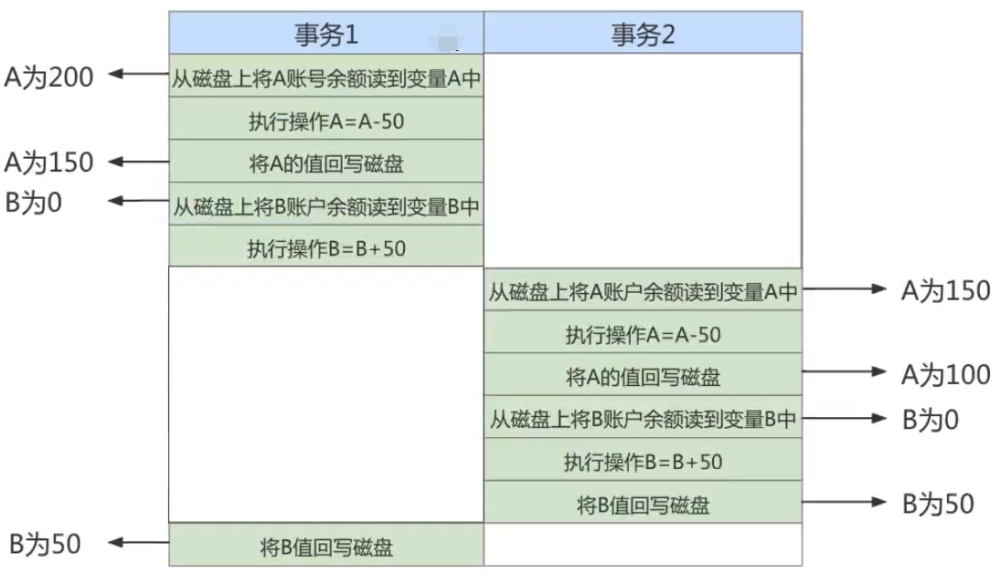

###### 2.2.9.1.2.4 持久性（Durability[ˌdjʊərəˈbɪləti]）

持久性是指一个事务一旦被提交，它对数据库中数据的改变就是<font color='red'>永久性的</font>，接下来的其他操作和数据库故障不应该对其有任何影响。

持久性是通过事务日志来保证的。日志包括了<font color='red'>重做日志</font>和<font color='red'>回滚日志</font>。当我们通过事务对数据进行修改的时候，首先会将数据库的变化信息记录到重做日志中，然后再对数据库中对应的行进行修改。这样做的好处是，即使数据库系统崩溃，数据库重启后也能找到没有更新到数据库系统中的重做日志，重新执行，从而使事务具有持久性。

> <font size='4'>总结</font>：
> ACID是事务的四大特性，在这四个特性中，原子性是基础，隔离性是手段，一致性是约束条件，而持久性是我们的目的。
>
> 数据库事务，其实就是数据库设计者为了方便起见，把需要保证原子性、隔离性、一致性和持久性的一个或多个数据库操作称为一个事务。

##### 2.2.9.1.3 事务的状态

我们现在知道事务是一个抽象的概念，它其实对应着一个或多个数捱库操作，MySQL根据这些操作所执行的不同阶段把事务大致划分成几个状态：

* 活动的（Active）

  事务对应的数据库操作正在执行过程中时，我们就说该事务处在活动的状态。

* 部分提交的（partially committed）

  当事务中的最后一个操作<font color='red'>执行完成</font>，但由于操作都在<font color='red'>内存中执行</font>，所造成的影响并<font color='red'>没有刷新到磁盘</font>时，我们就说该事务处在部分提交的状态。

* 失败的(failed)

  当事务处在活动的或者部分提交的状态时，可能遇到了某些错误（数据库自身的错误、操作系统错误或者直接断电等）而无法继续执行，或者人为的停止当前事务的执行，我们就说该事务处在失败的状态。

* 中止的(aborted)

  如果事务执行了一部分而变为失败的状态，那么就需要把已经修改的事务中的操作还原到事务执行前的状态。换句话说，就是要撤销失败事务对当前数据库造成的影响。我们把这个撤销的过程称之为<font color='red'>回滚</font>。
  当回滚操作执行完毕时，也就是数据库恢复到了执行事务之前的状态，我们就说该事务处在了中止的状态
  举例:

  ```mysql
  UPDATE accounts SET money = money - 50 WHERE NAME = 'AA';
  UPDATE accounts SET money = money + 50 WHERE NAME = 'BB';
  ```

* 提交的(committed)

  当一个处在部分提交的状态的事务将修改过的数据都同步到磁盘上之后，我们就可以说该事务处在了提交的状态。

  

图中可见，只有当事务处于提交的或者中止的状态时，一个事务的生命周期才算是结束了。对于已经提交的事务来说，该事务对数据库所做的修改将永久生效，对于处于中止状态的事务，该事务对数据库所做的所有修改都会被回滚到没执行该事务之前的状态。

#### 2.2.9.2 如何使用事务

##### 2.2.9.2.1 显式事务

<font size='3'>步骤1</font>：<font color=red>START TRANSACTION</font> 或者 <font color=red>BEGIN</font>，作用是显式开启一个事务。

```mysql
mysql> BEGIN;
#或者
mysql> START TRANSACTION;
```

START TRANSACTION语句相较于BEGIN特别之处在于，后边能跟随几个修饰符︰
① READ ONLY∶标识当前事务是一个只读事务，也就是属于该事务的数据库操作只能读取数据，而不能修改数据。

② READ WRITE：标识当前事务是一个读写事务，也就是属于该事务的数据库操作既可以读取数据，也可以修改数据。

③ WITH CONSISTEN SNAPSHOT：启动一致性读。

<font size='3'>步骤2：</font>一系列事务中的操作（主要是DML，不含DDL)

<font size='3'>步骤3：</font>提交事务或中止事务（即回滚事务）

```mysql
#提交事务。当提交事务后，对数据库的修改是永久性的。
mysql>COMMIT;
#回滚事务。即撤销正在进行的所有没有提交的修改
mysql> ROLLBACK;
#将事务回滚到某个保存点。
mysql> ROLLBACK TO [ SAVEPOINT]
```

其中关于SAVEPOINT相关操作有：

```mysql
#在事务中创建保存点，方便后续针对保存点进行回滚。一个事务中可以存在多个保存点。
SAVEPOINT [保存点名称];
#删除某个保存点。
RELEASE SAVEPOINT [保存点名称]:
```

##### 2.2.9.2.2 隐式事务

关键字：AUTOCOMMIT

```mysql
SHOW VARIABLES LIKE 'AUTOCOMMIT'; # 默认是ON
UPDATE accounts SET money = money - 50 WHERE NAME = 'AA'; # 此时这条DML是一个独立的事务
UPDATE accounts SET money = money + 50 WHERE NAME = 'BB';
```

如何关闭自动提交？

方式一：

```mysql
SET AUTOCOMMIT = FALSE; # 针对DML有效，对DDL无效
UPDATE accounts SET money = money - 50 WHERE NAME = 'AA'; # 此时这条DML是一个独立的事务
UPDATE accounts SET money = money + 50 WHERE NAME = 'BB';
COMMIT;  # 或 ROLLBACK;
```

方式二：我们在AUTOCOMMIT为true的情况下，使用START TRANSACTION 或BEGIN开启事务，那么DML操作就i不会自动提交数据。

```mysql
START TRANSACTION;
```

##### 2.2.9.2.3 隐式提交数据的情况

* DDL
* DCL
* 
* 

##### 2.2.9.2.4 举例1：COMMIT和ROLLBACK

```mysql
# 情况一
CREATE TABLE user3 (name VARCHAR(15) PRIMARY KEY);
SELECT *FROM user3 

BEGIN;
INSERT INTO user3 VALUES('张三') # 此时不会自动提交数据
COMMIT; # 提交事务，写入磁盘

BEGIN;
INSERT INTO user3 VALUES('李四') # 此时不会自动提交数据，此时还没有写入磁盘，还只是在内存中。
INSERT INTO user3 VALUES('李四') # 受主键影响，不能添加成功
ROLLBACK; # 回滚,内存中李四的数据被撤回 
```

```mysql
# 情况二
TRUNCATE TABLE user3
SELECT *FROM user3 

BEGIN;
INSERT INTO user3 VALUES('张三') # 此时不会自动提交数据
COMMIT; # 提交事务，写入磁盘

INSERT INTO user3 VALUES('李四'); # 默认情况下（AUTOCOMMIT=TRUE），DML操作会自动提交数据
INSERT INTO user3 VALUES('李四');

ROLLBACK;
```

```mysql
#情况三
TRUNCATE TABLE user3
SELECT *FROM user3 

SELECT @@completion_type
SET completion_type=1

BEGIN;
INSERT INTO user3 VALUES('张三') # 此时不会自动提交数据
COMMIT; # 提交事务，写入磁盘
SELECT *FROM user3 
INSERT INTO user3 VALUES('李四'); # 默认情况下（AUTOCOMMIT=TRUE），DML操作会自动提交数据
SELECT *FROM user3 
INSERT INTO user3 VALUES('李四');

ROLLBACK;
```

你能看到相同的sQL代码，只是在事务开始之前设置了SET @@completion_type = 1;，结果就和我们第一次处理的一样，只有一个“张三”。这是为什么呢?
这里我讲解下MysQL中completion_type参数的作用，实际上这个参数有3种可能:

1. completion=0，这是默认情况。当我们执行COMMIT的时候会提交事务，在执行下一个事务时，还需要使用START TRANSACTION 或者 BEGIN 来开启。
2. completion=1，这种情况下，当我们提交事务后，相当于执行了COMMIT AND CHAIN，也就是开启一个链式事务，即当我们提交事务之后会开启一个相同隔离级别的事务。
3. completion=2，这种情况下COMMIT=COMMIT AND RELEASE，也就是当我们提交后，会自动与服务器断开连接。

##### 2.2.9.2.5 举例2：体会INNODB和MyISAM

```mysql
CREATE TABLE test1(i INT)ENGINE=INNODB;
CREATE TABLE test2(i INT)ENGINE= MYISAM;

#针对于innodb表
BEGIN;
INSERT INTO test1 VALUES (1);
ROLLBACK;
SELECT* FROM test1;

#针对于myisam表：不支持事务
BEGIN
INSERT INTO test2 VALUES (1);
ROLLBACK;
SELECT* FROM test2;
```

##### 2.2.9.2.6 举例3：体会savepoint

```mysql
CREATE TABLE user2 (name varchar(15), balance DECIMAL(10,2));

BEGIN;
INSERT INTO user2(name, balance) values ('张三', 1000);
COMMIT;

BEGIN;
UPDATE user2 SET balance = balance - 100 WHERE name = '张三';
UPDATE user2 SET balance = balance - 100 WHERE name = '张三';
SELECT * FROM user2;
SAVEPOINT s1; # 设置保存点
UPDATE user2 SET balance = balance + 1 WHERE name = '张三';
SELECT *FROM user2;
ROLLBAck TO s1; # 回滚到保存点
SELECT *FROM user2;
```

#### 2.2.9.3 事务隔离级别

##### 2.2.9.3.1 数据准备

```mysql
CREATE TABLE student (
	studentno INT,
    name VARCHAR(20),
    class VARCHAR(20),
    PRIMARY KEY (studentno)
) Engine=InnoDB CHARSET=utf8;

INSERT INTO student VALUES(1, '小王','1班')；
```

##### 2.2.9.3.2 数据并发问题

###### 2.2.9.3.2.1 脏写（Dirty Write）

对于两个事务Session A、Session B，如果事务SsessionA修改了另一个未提交事务Session B修改过的数据，那就意味着发生了脏写，示意图如下：

 

Session A和Session B各开启了一个事务，Session B中的事务先将studentno列为1的记录的name列更新为'李四'，然后Session A中的事务接着又把这条studentno列为1的记录的name列更新为'张三'。如果之后Session B中的事务进行了回滚，那么Session A中的更新也将不复存在，这种现象就称之为脏写。这时session A中的事务就没有效果了，明明把数据更新了，最后也提交事务了，最后看到的数据什么变化也没有。这里大家对事务的隔离级比较了解的话，会发现默认隔离级别下，上面sessionA中的更新语句会处于等待状态，这里只是跟大家说明一下会出现这样现象。

###### 2.2.9.3.2.2 脏读（ Dirty Read )

对于两个事务Session A、Session B，SessionA读取了已经被Session B更新但还没有被提交的字段。之后Session B回滚，Session A读取的内容就是临时且无效的。


Session A和Session B各开启了一个事务，Session B中的事务先将studentno列为1的记录的name列更新为'张三'，然后Session A中的事务再去查询这条studentno为1的记录，如果读到列name的值为张三'，而Session B中的事务稍后进行了回滚，那么Session A中的事务相当于读到了一个不存在的数据，这种现象就称之为脏读

###### 2.2.9.3.2.3 不可重复读(Non-Repeatable Rean )

对于两个事务Session A、Session B，Session A读取了一个字段，然后SessionB更新了该字段。之后Session A再次读取同一个字段，值就不同了。那就意味着发生了不可重复读。


###### 2.2.9.3.2.4 幻读（Phantom）

对于两个事务Session A、Session B, Session A从一个表中读取了一个字段,然后Session B在该表中插入了一些新的行。之后,如果Session A再次读取同一个表,就会多出几行。那就意味着发生了幻读。


Session A中的事务先根据条件studentno >0这个条件查询表student，得到了name列值为张三'的记录;之后Session B中提交了一个隐式事务，该事务向表student中插入了一条新记录;之后Session A中的事务再根据相同的条件studentno>0查询表student，得到的结果集中包含Session B中的事务新插入的那条记录，这种现象也被称之为幻读。我们把新插入的那些记录称之为幻影记录。

<font color='red'>注意1:</font>
有的同学会有疑问，那如果Session B中删除了一些符合studentno > 0的记录而不是插入新记录那Session A之后再根据studentno > 0的条件读取的记录变少了，这种现象算不算幻读呢?这种现象不属于幻读，==幻读强调的是一个事务按照某个相同条件多次读取记录时，后读取时读到了之前没有读到的记录。==
<font color='red'>注意2:</font>
那对于先前已经读到的记录，之后又读取不到这种情况，算啥呢?这相当于对每一条记录都发生了不可重复读的现象。幻读只是重点强调了读取到了之前读取没有获取到的记录。

##### 2.2.9.3.3 SQL中的四种隔离级别

上面介绍了几种并发事务执行过程中可能遇到的一些问题，这些问题有轻重缓急之分，我们给这些问题按照严重性来排一下序：

```mysql
脏写>脏读>不可重复读>幻读
```

我们愿意舍弃一部分隔离性来换取一部分性能在这里就体现在:设立一些隔离级别，隔离级别越低，并发问题发生的就越多。SQL标准中设立了4个隔离级别：

* <font color='red'>READ UNCOMMITTED</font>：读未提交，在该隔离级别，所有事务都可以看到其他未提交事务的执行结果。不能避免脏读、不可重复读、幻读。
* <font color='red'>READ COMMITTED</font>：读已提交，它满足了隔离的简单定义:一个事务只能看见已经提交事务所做的改变。这是大多数数据库系统的默认隔离级别(但不是MysQL默认的)。可以避免脏读，但不可重复读、幻读问题仍然存在。
* <font color='red'>REPEATABLE READ</font>：可重复读，事务A在读到一条数据之后，此时事务B对该数据进行了修改并提交，那么事务A再读该数据，读到的还是原来的内容。可以避免脏读、不可重复读，但幻读问题仍然存在。这是MysQL的默认隔离级别。
* <font color='red'>SERIALIZABLE</font>：可串行化，确保事务可以从一个表中读取相同的行。在这个事务持续期间，禁止其他事务对该表执行插入、更新和删除操作。所有的并发问题都可以避免，但性能十分低下。能避免脏读不可重复读和幻读。

SQL标准中规定，针对不同的隔离级别，并发事务可以发生不同严重程度的问题，具体情况如下：


脏写怎么没涉及到?因为脏写这个问题太严重了，不论是哪种隔离级别，都不允许脏写的情况发生。

不同的隔离级别有不同的现象，并有不同的锁和并发机制，隔离级别越高，数据库的并发性能就越差，4种事务隔离级别与并发性能的关系如下：


##### 2.2.9.3.4 MySQL支持的四种隔离级别

```mysql
# 查看
mysql> SELECT @@transaction_isolation;
+-------------------------+
| @@transaction_isolation |
+-------------------------+
| REPEATABLE-READ         |
+-------------------------+
1 row in set (0.00 sec)
```

##### 2.2.9.3.5 设置事务的隔离级别


或者：


关于设置使用GLOBAL或SEESION的影响：

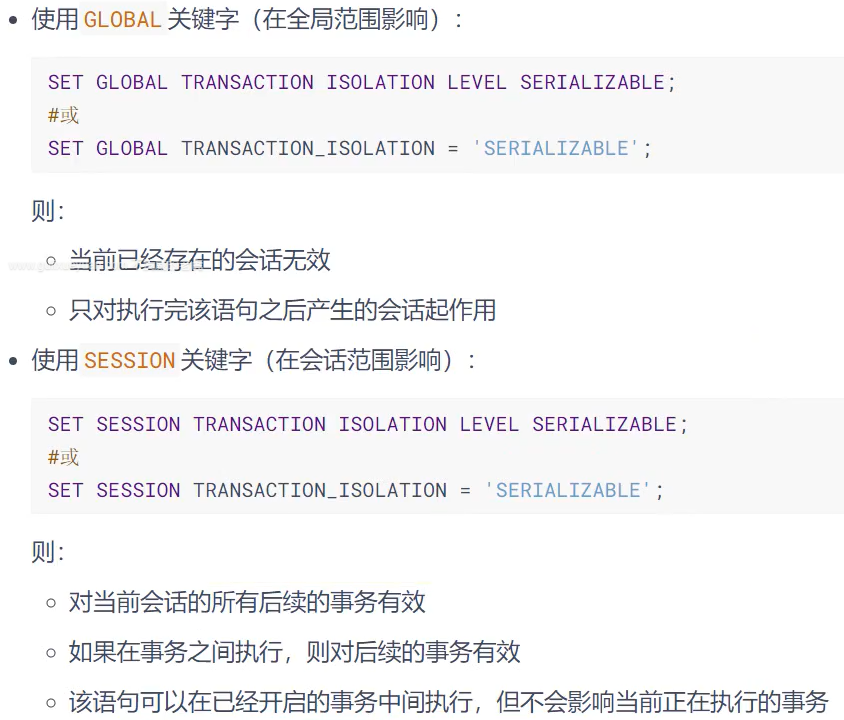

##### 2.2.9.3.6 隔离级别演示

###### 2.2.9.3.6.1 读未提交（修改隔离级别为READ-UNCOMMITTED）

SESSION A开启事务：张三给李四转钱，转完后悔了，ROLLBACK。

SESSION B开启事务：李四在SESSION提交事务之前读到了张三转的钱 （<font color='red'>脏读</font>），李四这时候把钱给人家退回去，COMMIT（此时 SESSION A事务还没结束），等 A ROLLBACK之后，发现李四金额变成-100，张三金额变成200了。

SESSION A：


SEESION B：


###### 2.2.9.3.6.2 读已提交（修改隔离级别为READ-COMMITED）

A和B同时开启了一个事务，A事务中张三的钱原本是100，减50，COMMIT。

B在A提交事务之前查询张三的钱是100，A提交事务之后再查询变成50，B事务还没结束，两次读取的数据不一致（<font color='red'>不可重复读</font>），COMMIT。

SEESION A：


SEESION B：


###### 2.2.9.3.6.3 可重复读（修改隔离级别为REPEATABLE-READ）

重复《2.2.9.3.6.2 读已提交》中的过程，B的事务结束之前查询出来的结果一致（<font color='red'>可重复读</font>）

###### 2.2.9.3.6.4 幻读演示以及解决方案

设置隔离界别为 REPEATABLE-READ，

SESSION A和B同时开启一个事务Aa和Bb，Aa向表中插入一条ID为3的记录，COMMIT。

Bb在Aa提交之前查询没有查到，提交之后查询也没有查到，于是Bb向表中也插入一条ID为3的记录，此时报错”主键重复“，出现”<font color='red'>幻读</font>“

SESSION A：


SESSION B：


解决办法：

其实RR也是可以避免幻读的，通过对select 操作手动加<font color='red'>行X锁(独占锁)</font> (SELECT ... FOR UPDATE这也正是SERIALIZABLE隔离级别下会隐式为你做的事情)。同时，即便当前记录不存在，比如id=3是不存在的，当前事务也会获得一把记录锁(因为InnoDB的行锁锁定的是索引，故记录实体存在与否没关系，存在就加行X锁，不存在就加间隙锁)，其他事务则无法插入此索引的记录，故杜绝了幻读。


在<font color='red'> SERIALIZABLE </font>隔离级别下，step1执行时是会隐式的添加<font color='red'>行(X)锁/ gap(X)锁</font>的，从而step2会被阻塞step3 会正常执行，待事务1提交后，事务2才能继续执行(主键冲突执行失败)，对于事务1来说业务是正确的，成功的阻塞扼杀了扰乱业务的事务2，对于事务1来说他前期读取的结果是可以支撑其后续业务的。

#### 2.2.9.4 事务的常见分类

### 2.2.10 事务篇2--MySQL事务日志

事务有4种特性:原子性、一致性、隔离性和持久性。那么事务的四种特性到底是基于什么机制实现呢？

- 事务的隔离性由锁机制实现。

* 而事务的原子性、一致性和持久性由事务的redo日志和undo日志来保证。
  * REDO LOG称为<font color='red'>重做日志</font>，提供再写入操作，恢复提交事务修改的页操作，用来保证事务的持久性。
  * UNDO LOG称为<font color='red'>回滚日志</font>，回滚行记录到某个特定版本，用来保证事务的原子性、一致性。

有的DBA或许会认为UNDO是REDO的逆过程，其实不然。REDO和UNDO都可以视为是一种恢复操作，但是：

- redo log：是<font color='red'>存储引擎层(innodb)生成的日志</font>，记录的是"<font color='red'>物理级别</font>"上的页修改操作，比如页号xx、偏移量yyy写入了'zzz'数据。主要为了保证数据的可靠性；
- undo log：是<font color='red'>存储引擎层(innodb)生成的日志</font>，记录的是<font color='red'>逻辑操作</font>日志，比如对某一行数据进行了INSERT语句操作，那么undo log就记录一条与之相反的DELETE操作。主要用于事务的回滚(undo log记录的是每个修改操作的逆操作)和一致性非锁定读(undo log回滚行记录到某种特定的版本---MVCC，即多版本并发控制)。

#### 2.2.10.1 Redo日志

InnoDB存储引擎是以页为单位来管理存储空间的。在真正访问页面之前，需要把在磁盘上的页缓存到内存中的Buffer Pool之后才可以访问。所有的变更都必须先更新缓冲池中的数据，然后缓冲池中的脏页会以一定的频率被刷入磁盘（ checkPoint机制），通过缓冲池来优化CPU和磁盘之间的鸿沟，这样就可以保证整体的性能不会下降太快。

##### 2.2.10.1.1 为什么需要Redo日志


##### 2.2.10.1.2 Redo日志的好处、特点

1. 好处

   - redo日志降低了刷盘频率
   - redo日志占用的空间非常小

   存储表空间ID、页号、偏移量以及需要更新的值，所需的存储空间是很小的，刷盘快。

2. 特点

   * redo日志是顺序写入磁盘的
     在执行事务的过程中，每执行一条语句，就可能产生若干条redo日志，这些日志是按照产生的顺序写入磁盘的，也就是使用顺序IO，效率比随机IO快。
   * 事务执行过程中，redo log不断记录
     redo log跟bin log的区别，redo log是存储引擎层产生的，而bin log是数据库层产生的。假设一个事务，对表做10万行的记录插入，在这个过程中，一直不断的往redo logl顺序记录，而bin log不会记录，直到这个事务提交，才会一次写入到bin log文件中。

##### 2.2.10.1.3 redo的组成

Redo log可以简单分为以下两个部分:

###### 2.2.10.1.3.2 重做日志的缓冲( redo log buffer)，保存在内存中，是易失的。

在服务器启动时就向操作系统申请了一大片称之为redo log buffer的连续内存空间，翻译成中文就是redo日志缓冲区。这片内存空间被划分成若干个连续的redo log block。一个redo log block占用512字节大小。


**参数设置：innodb_log_buffer_size**
redo log buffer大小，默认16M，最大值是4096M，最小值为1M。

```mysql
mysql> show variables like '%innodb_log_buffer_size%';
+------------------------+----------+
| Variable_name          | Value    |
+------------------------+----------+
| innodb_log_buffer_size | 33554432 |
+------------------------+----------+
1 row in set (0.00 sec)
```

###### 2.2.10.1.3.1 重做日志文件(redo log file)，保存在硬盘中，是持久的

REDO日志文件如图所示，其中的ib_logfile0和ib_logfile1即为REDo日志。


##### 2.2.10.1.4 Redo的整体流程


##### 2.2.10.1.5 Redo Log的刷盘策略

redo log的写入并不是直接写入磁盘的，InnoDB引擎会在写redo log的时候先写redo log buffer，之后以一定的频率刷入到真正的redo log file中。这里的一定频率怎么看待呢?这就是我们要说的刷盘策略。

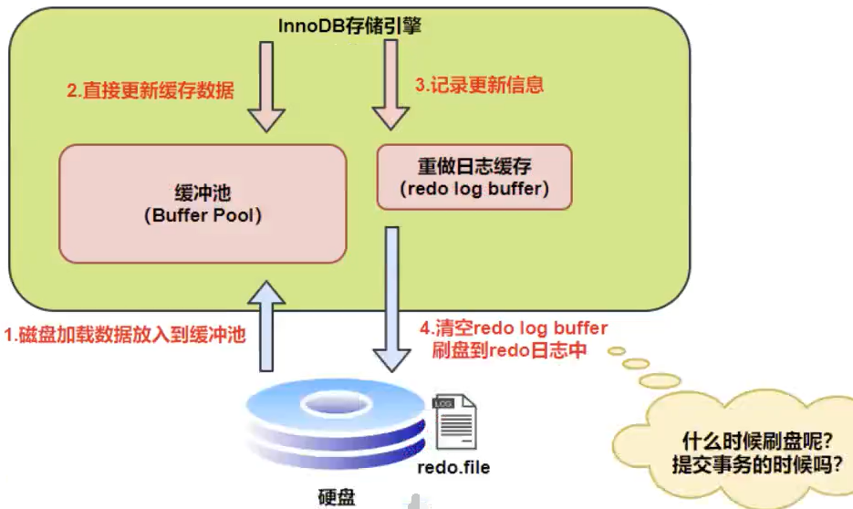

注意，redo log buffer刷盘到redo log file的过程并不是真正的刷到磁盘中去，只是刷入到<font color='red'>文件系统缓存</font>（pagecache)中去(这是现代操作系统为了提高文件写入效率做的一个优化)，真正的写入会交给系统自己来决定(比如page cache足够大了)。那么对于InnoDB来说就存在一个问题，如果交给系统来同步，同样如果系统宕机，那么数据也丢失了(虽然整个系统宕机的概率还是比较小的)。

针对这种情况，InnoDB给出<font color='red'>innodb_flush_log.at_trx_commit</font>参数，该参数控制commit提交事务时，如何将redo log buffer中的日志刷新到 redo log file中。它支持三种策略:

* <font color='red'>设置为0</font>：表示每次事务提交时不进行刷盘操作。(系统默认master thread每隔1s进行一次重做日志的同步)
* <font color='red'>设置为1</font>：表示每次事务提交时都将进行同步，刷盘操作（默认值)
* <font color='red'>设置为2</font>：表示每次事务提交时都只把redo log buffer内容写入page cache，不进行同步。由os自己决定什么时候同步到磁盘文件。

```mysql
mysql> show variables like 'innodb_flush_log_at_trx_commit';
+--------------------------------+-------+
| Variable_name                  | Value |
+--------------------------------+-------+
| innodb_flush_log_at_trx_commit | 1     |
+--------------------------------+-------+
1 row in set (0.00 sec)
```

另外，InnoDB存储引擎有一个后台线程，每隔1秒，就会把<font color='red'>redo log buffer</font>中的内容写到文件系统缓存( <font color='red'>page cache</font> )，然后调用刷盘操作。


也就是说，一个没有提交事务的redo log 记录，也可能会刷盘。因为在事务执行过程redo log记录是会写入redo log buffer中，这些redo log记录会被后台线程刷盘。

##### 2.2.10.1.6 不同刷盘策略演示

###### 2.2.10.1.6.1 流程图


>小结: innodb_flush_log_at_trx_commit=1
>为1时，只要事务提交成功,redo log记录就一定在硬盘里，不会有任何数据丢失。
>
>如果事务执行期间MySQL挂了或宕机，这部分日志丢了，但是事务并没有提交，所以日志丢了也不会有损失。可以保证ACID的D，数据绝对不会丢失，但是效率最差的。
>
>建议使用默认值，虽然操作系统宕机的概率理论小于数据库宕机的概率，但是一般既然使用了事务那么数据的安全相对来说更重要些。


>小结innodb_flush_log_at_trx_commit=2
>为2时，只要事务提交成功,redo log buffer中的内容只写入文件系统缓存（ page cache ）
>
>如果仅仅只是MySQL挂了不会有任何数据丢失，但是操作系统宕机可能会有1秒数据的丢失，这种情况下无法满足ACID中的D。但是数值2肯定是效率最高的。


>小结: innodb_flush_log_at_trx_commit=0
>为0时,master thread中每1秒进行一次重做日志的fsync操作，因此实例crash最多丢失1秒钟内的事务。(master thread是负责将缓冲池中的数据异步刷新到磁盘，保证数据的一致性)
>
>数值0的话，是一种折中的做法，它的IO效率理论是高于1的，低于2的，这种策略也有丢失数据的风险，也无法保证D。

##### 2.2.10.1.7 写入redo log buffer过程

###### 2.2.10.1.7.1 补充概念


###### 2.2.10.1.7.2 redo日志写入log buffer


###### 2.2.10.1.7.3 redo log block 的结构图


#### 2.2.10.2 Undo日志

https://www.gulixueyuan.com/course/510/task/22374/show

redo log是事务持久性的保证，undo log是事务原子性的保证。在事务中更新数据的前置操作其实是要先写入一个undo log。

##### 2.2.10.2.1 Undo日志的作用

1. 回滚数据

   用户对undo日志可能有<font color=red>误解</font>: undo用于将数据库物理地恢复到执行语句或事务之前的样子。但事实并非如此。**undo是<font color=red>逻辑</font>日志**，因此只是将数据库逻辑地恢复到原来的样子。所有修改都被逻辑地取消了，但是数据结构和页本身在回滚之后可能大不相同。

   这是因为在多用户并发系统中，可能会有数十、数百甚至数千个并发事务。数据库的主要任务就是协调对数据记录的并发访问。比如，一个事务在修改当前一个页中某几条记录，同时还有别的事务在对同一个页中另几条记录进行修改。因此，不能将一个页回滚到事务开始的样子，因为这样会影响其他事务正在进行的工作。

2. MVCC

   undo的另一个作用是MVCC，即在InnoDB存储引擎中Mvcc的实现是通过undo来完成。当用户读取一行记录时，若该记录已经被其他事务占用，当前事务可以通过undo读取之前的行版本信息，以此实现非锁定读取。

##### 2.2.10.2.2 undo log生命周期

### 2.2.11 事务篇3--锁

#### 2.2.11.1 MySQL并发事务访问相同记录

##### 2.2.11.1.1 读-读

读-读情况，即并发事务相继读取相同的记录。读取操作本身不会对记录有任何影响，并不会引起什么问题，所以允许这种情况的发生。

##### 2.2.11.1.2 写-写

写-写情况，即并发事务相继对相同的记录做出改动。

在这种情况下会发生脏写的问题，任何一种隔离级别都不允许这种问题的发生。所以在多个未提交事务相继对一条记录做改动时，需要让它们排队执行，这个排队的过程其实是通过锁来实现的。这个所谓的锁其实是一个内存中的结构，在事务执行前本来是没有锁的，也就是说一开始是没有锁结构和记录进行关联的，如图所示:


当一个事务想对这条记录做改动时，首先会看看内存中有没有与这条记录关联的锁结构，当没有的时候就会在内存中生成一个锁结构与之关联。比如，事务T1要对这条记录做改动，就需要生成一个锁结构与之关联：


在锁结构里有很多信息，为了简化理解，只把两个比较重要的属性拿了出来: 

- <font color='red'>trx信息</font>:代表这个锁结构是哪个事务生成的。
- <font color='red'>is_waiting</font>:代表当前事务是否在等待。

当事务T1改动了这条记录后，就生成了一个锁结构与该记录关联，因为之前没有别的事务为这条记录加锁，所以<font color='red'>is_waiting</font>属性就是false，我们把这个场景就称之为<font color='red'>获取锁成功</font> ，或者<font color='red'>加锁成功</font>，然后就可以继续执行操作了。

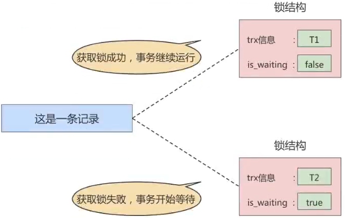

在事务T1提交之后，就会把该事务生成的<font color='red'>锁结构释放</font>掉，然后看看还有没有别的事务在等待获取锁发现了事务<font color='red'>T2</font>还在等待获取锁，所以把事务T2对应的锁结构的<font color='red'>is_waiting</font>属性设置为<font color='red'>false</font>，然后把该事务对应的线程唤醒，让它继续执行，此时事务T2就算获取到锁了。效果图就是这样：


小结几种说法:

- 不加锁

  意思就是不需要在内存中生成对应的<font color='red'>锁结构</font>，可以直接执行操作。

- 获取锁成功，或者加锁成功

  意思就是在内存中生成了对应的<font color='red'>锁结构</font>，而且锁结构的<font color='red'>is_waiting</font>属性为<font color='red'>false</font>，也就是事务可以继续执,行操作。

- 获取锁失败，或者加锁失败，或者没有获取到锁

  意思就是在内存中生成了对应的<font color='red'>锁结构</font>，不过锁结构的<font color='red'>is_waiting</font>属性为<font color='red'>true</font>，也就是事务需要等待，不可以继续执行操作。

##### 2.2.11.1.3 读写

<font color='red'>读-写</font>或<font color='red'>写-读</font>，即一个事务进行读取操作，另一个进行改动操作。这种情况下可能发生脏读、不可重复读、幻读的问题。

各个数据库厂商对SQL标准的支持都可能不一样。比如Mysql在REPEATABLE READ隔离级别上就已经解决了幻读问题。

##### 2.2.11.1.4 并发问题的解决方案

怎么解决<font color='red'>脏读、不可重复读、幻读</font>这些问题呢?其实有两种可选的解决方案:·

###### 2.2.11.1.4.1 方案一：读操作利用多版本并发控制，写操作进行加锁。

所谓的MVCC，就是生成一个ReadView，通过ReadView找到符合条件的记录版本（历史版本由undo日志构建)。查询语句只能读到在生成ReadView之前已提交事务所做的更改，在生成ReadView之前未提交的事务或者之后才开启的事务所做的更改是看不到的。而写操作肯定针对的是最新版本的记录，读记录的历史版本和改动记录的最新版本本身并不冲突，也就是采用MVCC时，读-写操作并不冲突。

> 普通的SELECT语句在READ COMMITTED和REPEATABLE READ隔离级别下会使用到MVCC读取记录。
>
> - 在 READ COMMITTED隔离级别下，一个事务在执行过程中每次执行SELECT操作时都会生成一个ReadView,ReadView的存在本身就保证了事务不可以读取到未提交的事务所做的更改，也就是避免了脏读现象;
> - 在REPEATABLE READ隔离级别下，一个事务在执行过程中只有第一次执行SELECT操作才会生成一个ReadView，之后的SELECT操作都复用这个ReadView，这样也就避免了不可重复读和幻读的问题

###### 2.2.11.1.4.2 方案二：读、写操作都采用加锁的方式。

如果我们的一些业务场景不允许读取记录的旧版本，而是每次都必须去读取记录的最新版本。比如在银行存款的事务中，你需要先把账户的余额读出来，然后将其加上本次仔款的数额，最后再写到数据库中。在将账户余额读取出来后取出来后，就不想让别的事务再访问该余额，直到本次存款事务执行完成，其他事务才可以访问账户的余额。这样在读取记录的时候就需要对其进行加锁操作，这样也就意味着读操作和写操作也像写-写操作那样排队执行。

<font color='red'>脏读</font>的产生是因为当前事务读取了另一个未提交事务写的一条记录，如果另一个事务在写记录的时侯就给这条记录加锁，那么当前事务就无法继续读取该记录了，所以也就不会有脏读问题的产生了。

<font color='red'>不可重复读</font>的产生是因为当前事务先读取一条记录，另外一个事务对该记录做了改动之后并提交之后，当前事务再次读取时会获得不同的值，如果在当前事务读取记录时就给该记录加锁，那么另一个事务就无法修改该记录，自然也不会发生不可重复读了。

<font color='red'>幻读</font>问题的产生是因为当前事务读取了一个范围的记录，然后另外的事务向该范围内插入了新记录当前事务再次读取该范围的记录时发现了新插入的新记录。采用加锁的方式解决幻读问题就有一些麻烦，因为当前事务在第一次读取记录时幻影记录并不存在，所以读取的时候加锁就有点尴尬（因为你并不知道给谁加锁)。

小结对比发现：

* 采用MVCC方式的话，读-写操作彼此并不冲突，性能更高。
* 采用加锁方式的话，读-写操作彼此需要排队执行，影响性能。

一般情况下我们当然愿意采用MVCC来解决读-写操作并发执行的问题，但是业务在某些特殊情况下，要求必须采用加锁的方式执行。下面就讲解下MySQL中不同类别的锁。

#### 2.2.11.2 锁的不同角度分类

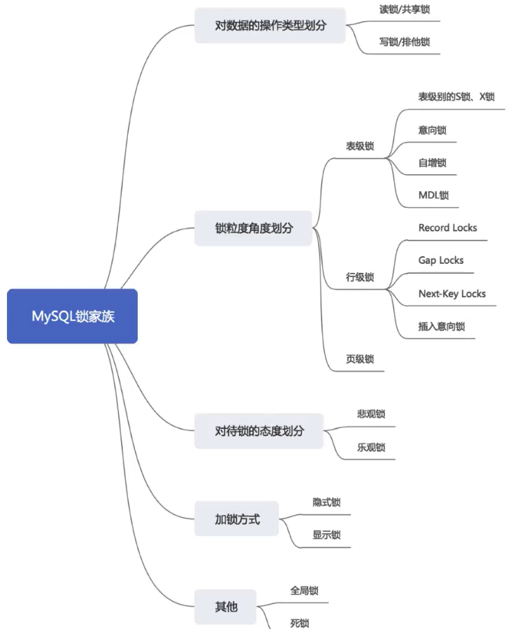

##### 2.2.11.2.1 从数据操作的类型划分：读锁、写锁

对于数据库中并发事务的<font color='red'>读-读</font>情况并不会引起什么问题。对于写-写、读-写或写-读这些情况可能会引起一些问题，需要使用MVCC或者加锁的方式来解决它们。在使用加锁的方式解决问题时，由于既要允许读-读情况不受影响，又要使写-写、读-写或写-读情况中的操作相互阻塞，所以MysQL实现一个由两种类型的锁组成的锁系统来解决。这两种类型的锁通常被称为<font color='red'>共享锁(Shared Lock，S Lock)和排他锁(Exclusive Lock，x Lock) </font>，也叫<font color='red'>读锁(readlock)和写锁(write lock)</font>。

* <font color='red'>读锁</font>︰也称为共享锁、英文用S表示。针对同一份数据，多个事务的读操作可以同时进行而不会互相影响，相互不阻塞的。
* <font color='red'>写锁</font>∶也称为排他锁、英文用x表示。当前写操作没有完成前，它会阻断其他写锁和读锁。这样就能确保在给定的时间里，只有一个事务能执行写入，并防止其他用户读取正在写入的同一资源。

<font color='red'>需要注意的是对于InnoDB引擎来说，读锁和写锁可以加在表上，也可以加在行上。</font>
举例（<font color='red'>行级读写锁</font>)︰如果一个事务T1已经获得了某个行r的读锁，那么此时另外的一个事务T2是可以去获得这个行r的读锁的，因为读取操作并没有改变行r的数据；但是，如果某个事务T3想获得行r的写锁，则它必须等待事务T1、T2释放掉行r上的读锁才行。

总结：这里的兼容是指对同一张表或记录的锁的兼容性情况。


###### 2.2.11.2.1.1 锁定读

* 对读取的记录加<font color='red'>S锁</font>

  ```mysql
  SELECT ... LOCK IN SHARE MODE; 
  #或
  SELECT ... FOR SHARE;	#(8.日新增语法)
  ```

  在普通的SELECT语句后边加<font color='red'>LOCK IN SHARE MODE</font>，如果当前事务执行了该语句，那么它会为读取到的记录加S锁，这样允许别的事务继续获取这些记录的S锁(比方说别的事务也使用SELECT ... LOCK IN SHAREMODE语句来读取这些记录)，但是不能获取这些记录的<font color='red'>X锁</font>(比如使用SELECT ... FOR UPDATE语句来读取这些记录，或者直接修改这些记录)。如果别的事务想要获取这些记录的X锁，那么它们会阻塞，直到当前事务提交之后将这些记录上的S锁释放掉。

  举例1：A事务对第一条记录先加S锁，同时B事务再加S锁。<font color='red'>B事务不阻塞</font>，B事务也能获取到相同记录的S锁。

  

  举例2：A先加S，B再加X。由于A对记录加了S锁，导致B无法获取到X锁而阻塞，A提交事务（<font color='red'>COMMIT</font>）后，<font color='red'>释放S锁</font>，B才能获取X锁。

  

* 对读取的记录加<font color='red'>X锁</font>

  ```mysql
  SELECT ... FOR UPDATE;
  ```

  在普通的SELECT语句后边加<font color='red'>FOR UPDATE</font>，如果当前事务执行了该语句，那么它会为读取到的记录加<font color='red'>X锁</font>，这样<font color='red'>既不允许</font>别的事务获取这些记录的<font color='red'>S锁</font>(比方说别的事务使用SELECT ...LOCK IN SHARE MODE语句来读取这些记录)，<font color='red'>也不允许</font>获取这些记录的<font color='red'>X锁</font>(比如使用SELECT ... FOR UPDATE语句来读取这些记录，或者直接修改这些记录)。如果别的事务想要获取这些记录的S锁或者X锁，那么它们会阻塞，直到当前事务提交之后将这些记录上的X锁释放掉。

  举例1：A先对某行数据加X锁，B再加S锁。B无法获取S锁而阻塞，当A提交事务后，释放X锁，B才获取数据记录的S锁。

  

  举例2：A先对某行数据加X锁，B再加X锁。B无法获取X锁而阻塞，当A提交事务后，释放X锁，B才获取数据记录的X锁。

  

<font color='red'>MySQL8.0新特性</font>：

在5.7及之前的版本，SELECT ... FOR UPDATE，如果获取不到锁，会一直等待，直到`innodb_lock_wait_timeout`超时。在8.0版本中，SELECT ... FOR UPDATE，SELECT .. FOR SHARE添加NOWAIT、SKIP LOCKED语法，跳过锁等待，或者跳过锁定。

通过添加NOWAIT、SKIP LOCKED语法，能够立即返回。如果查询的行已经加锁:

* 那么NOWAIT会立即报错返回。
* 而SKIP LOCKED也会立即返回，只是返回的结果中不包含被锁定的行。

###### 2.2.11.2.1.2 写操作

平常所用到的写操作无非是 <font color='red'>DELETE、UPDATE、INSERT</font>这三种

- <font color='red'>DELETE </font>:

  对一条记录做DELETE操作的过程其实是先在<font color='red'>B+</font>树中定位到这条记录的位置，然后获取这条记录的<font color='red'>X锁</font>，再执行<font color='red'>delete mark</font> 操作。我们也可以把这个定位待删除记录在B+树中位置的过程看成是一个获取<font color='red'>X锁</font>的<font color='red'>锁定读</font>。

- <font color='red'>UPDATE</font>︰在对一条记录做UPDATE操作时分为三种情况：

  - 情况1：未修改该记录的键值，并且被更新的列占用的存储空间在<font color='red'>修改前后未发生变化</font>。

    则先在B+树中定位到这条记录的位置，然后再获取一下记录的X锁，最后在原记录的位置进行修改操作。我们也可以把这个定位待修改记录在B+树中位置的过程看成是一个获取X锁的锁定读。

  - 情况2：未修改该记录的键值，并且至少有一个被更新的列占用的存储空间在<font color='red'>修改前后发生变化</font>。

    则先在B+树中定位到这条记录的位置，然后获取一下记录的X锁，将该记录彻底删除掉（就是把记录彻底移入垃圾链表)，最后再插入一条新记录。这个定位待修改记录在B+树中位置的过程看成是一个获取×锁的锁定读，新插入的记录由INSERT操作提供的隐式锁进行保护。

  - 情况3∶修改了该记录的键值，则相当于在原记录上做DELETE操作之后再来一次INSERT操作，加锁操作就需要按照DELETE和INSERT的规则进行了。

- <font color='red'>INSERT</font> :

  一般情况下，新插入一条记录的操作并不加锁，通过一种称之为隐式锁的结构来保护这条新插入的记录在本事务提交前不被别的事务访问。

##### 2.2.11.2.2 从数据操作的粒度划分：表级锁、页级锁、行锁。

为了<font color='red'>尽可能提高数据库的并发度</font>，每次<font color='red'>锁定的数据范围越小越好</font>，理论上每次只锁定当前操作的数据的方案会得到最大的并发度，但是管理锁是<font color='red'>很耗资源</font>的事情（涉及获取、检查、释放锁等动作)。因此数据库系统需要在高并发响应和系统性能两方面进行平衡，这样就产生了“<font color='red'>锁粒度（Lock granularity)</font>”的概念。

对一条记录加锁影响的也只是这条记录而已，我们就说这个锁的粒度比较细;其实一个事务也可以在<font color='red'>表级别</font>进行加锁，自然就被称之为<font color='red'>表级锁或者表锁</font>，对一个表加锁影响整个表中的记录，我们就说这个锁的粒度比较粗。锁的<font color='red'>粒度主要分为表级锁、页级锁和行锁。</font>

###### 2.2.11.2.2.1 表锁1 -- S/X

在对某个表执行SELECT、INSERT、DELETE、UPDATE语句时，InnoDB存储引擎是不会为这个表添加表级别的<font color='red'>S锁或者X锁</font>的。在对某个表执行一些诸如<font color='red'>ALTER TABLE、DROP TABLE</font>这类的<font color='red'>DDL语句</font>时，其他事务对这个表并发执行诸如SELECT、INSERT、DELETE、UPDATE的语句会发生阻塞。同理，某个事务中对某个表执行SELECT、INSERT、DELETE、UPDATE语句时，在其他会话中对这个表执行DDL语句也会发生阻塞。这个过程其实是通过在<font color='red'>server层</font>使用一种称之为<font color='red'>元数据锁</font>（英文名: Metadata Locks，简称MDL）结构来实现的。

一般情况下，<font color='red'>不会使用</font>InnoDB存储引擎提供的表级别的<font color='red'>S锁和X锁</font>。只会在一些特殊情况下，比方说<font color='red'>崩溃恢复</font>过程中用到。比如，在系统变量<font color='red'>autocommit=0，innodb_table_locks = 1</font>时，手动获取InnoDB存储引擎提供的表t的S锁或者X锁可以这么写:

```mysql
LOCK TABLES t READ;  # InnoDB存储引擎会对表t加表级别的S锁。
LOCK TABLES t WRITE; # InnoDB存储引擎会对表t加表级别的X锁。
```

不过尽量避免在使用InnoDB存储引擎的表上使用LOCK TABLES这样的手动锁表语句，它们并不会提供什么额外的保护，只是会降低并发能力而已。InnoDB的厉害之处还是实现了更细粒度的行锁，关于InnoDB表级别的S锁和x锁大家了解一下就可以了。

总结：

MyISAM在执行查询语句(SELECT)前，会给涉及的所有表加读锁，在执行增删改操作前，会给涉及的表加写锁。InnoDB存储引擎是不会为这个表添加表级别的读锁或者写锁的。

MySQL的表级锁有两种模式：(以MylSAM表进行操作的演示)

* 表共享读锁(Table Read Lock)
* 表独占写锁(Table Write Lock)


###### 2.2.11.2.2.2 表锁2 -- 意向锁（intention lock）

InnoDB支持<font color='red'>多粒度锁(multiple granularity locking)</font>，它<font color='red'>允许行级锁</font>与<font color='red'>表级锁共存</font>，而意向锁就是其中的一种表锁。

1、意向锁的存在是为了协调行锁和表锁的关系，支持多粒度(表锁与行锁)的锁并存。

2、意向锁是一种不与行级锁冲突表级锁，这一点非常重要。

3、表明“某个事务正在某些行持有了锁或该事务准备去持有锁”

意向锁分为两种:

* 意向共享锁(intention shared lock, lS)︰事务有意向对表中的某些行加共享锁(S锁)

  ```mysql
  # 事务要获取某些行的S锁,必须先获得表的IS锁。
  SELECT column FROM table ... LOCK IN SHARE MODE;
  ```

* 意向排他锁(intention exclusive lock,lX)︰事务有意向对表中的某些行加排他锁(X锁)

  ```mysql
  # 事务要获取某些行的X锁，必须先获得表的IX锁。
  SELECT column FROM table ... FOR UPDATE;
  ```

<font color='red' size='5' >意向锁要解决的问题：</font>

现在有两个事务，分别是T1和T2，其中T2试图在该表级别上应用共享或排它锁，如果没有意向锁存在，那么T2就需要去检查各个页或行是否存在锁;如果存在意向锁，那么此时就会受到由T1控制的表级别意向锁的阻塞。T2在锁定该表前不必检查各个页或行锁，而只需检查表上的意向锁。简单来说就是给更大一级别的空间示意里面是否已经上过锁。

在数据表的场景中，<font color='red'>如果我们给某一行数据加上了排它锁，数据库会自动给更大一级的空间，比如数据页或数据表加上意向锁，告诉其他人这个数据页或数据表已经有人上过排它锁了</font>，这样当其他人想要获取数据表排它锁的时候，只需要了解是否有人已经获取了这个数据表的意向排他锁即可。

* 如果事务想要获得数据表中某些记录的<font color='red'>共享锁</font>，就需要在数据表上<font color='red'>添加意向共享锁</font>。
* 如果事务想要获得数据表中某些记录的<font color='red'>排他锁</font>，就需要在数据表上<font color='red'>添加意向排他锁</font>。

这时，意向锁会告诉其他事务已经有人锁定了表中的某些记录。


<font color='red' size='4'>从上面的案例可以得到如下结论:</font>

1. InnoDB支持<font color='red'>多粒度锁</font>，特定场景下，行级锁可以与表级锁共存。
2. 意向锁之间互不排斥，但除了ISS兼容外，<font color='red'>意向锁会与共享锁/排他锁互斥</font>。
3. IX，IS是表级锁，不会和行级的X，S锁发生冲突。只会和表级的X，S发生冲突。
4. 意向锁在保证并发性的前提下，实现了<font color='red'>行锁和表锁共存</font>且<font color='red'>满足事务隔离性</font>的要求。

###### 2.2.11.2.2.3 表锁3 -- 自增锁（AUTO_INC锁)

在使用MySQL过程中，我们可以为表的某个列添加<font color='red'>AUTO_INCREMENT</font>属性。举例：


对于上面数据插入的案例，MySQL中采用了自增锁的方式来实现，<font color='red'>AUTO-INC锁是当向使用含有AUTO_INCREMENT列的表中插入数据时需要获取的一种特殊的表级锁</font>，在执行插入语句时就在表级别加一个AUTO-INC锁，然后为每条待插入记录的AUTO_INCREMENT修饰的列分配递增的值，在该语句执行结束后，再把AUTO-INC锁释放掉。<font color='red'>一个事务在持有AUTO-INC锁的过程中，其他事务的插入语句都要被阻塞</font>，可以保证一个语句中分配的递增值是连续的。也正因为此，其并发性显然并不高，<font color='red'>当我们向一个有AUTO_INCREMENT关键字的主键插入值的时候，每条语句都要对这个表锁进行竞争</font>，这样的并发潜力其实是很低下的，所以innodb通过innodb_autoinc_lock_mode的不同取值来提供不同的锁定机制，来显著提高SQL语句的可伸缩性和性能。


###### 2.2.11.2.2.4 表锁4 -- 元数据锁（MDL锁）

MySQL5.5引入了meta data lock，简称MDL锁，属于表锁范畴。MDL的作用是，保证读写的正确性。比如，如果一个查询正在遍历一个表中的数据，而执行期间另一个线程对这个表结构做变更，增加了一列，那么查询线程拿到的结果跟表结构对不上，肯定是不行的。
因此，<font color='red'>当对一个表做增删改查操作的时候，加MDL读锁；当要对表做结构变更操作的时候，加MDL写锁</font>。

读锁之间不互斥，因此你可以有多个线程同时对一张表增删改查。读写锁之间、写锁之间是互斥的用来保证变更表结构操作的安全性，解决了DML和DDL操作之间的一致性问题。不需要显式使用，在访问一个表的时候会被自动加上。

举例：

<font color='red'>SESSION A</font>：从表中查询数据


SESSION B：修改表结构，增加新列


SESSION C：查看当前MySQL进程。


通过会话C可以看出会话B被阻塞，这是由于<font color='red'>会话A拿到了teacher表的元数据读锁，会话B想申请teacher表的元数据写锁，由于读写锁互斥，会话B需要等待会话A释放元数据锁才能执行</font>。

###### 2.2.11.2.2.5 行锁1 -- 记录锁（RECORD LOCKs）

行锁(Row Lock)也称为记录锁，顾名思义，就是锁住某一行（某条记录row)。需要的注意的是，MySQL服务器层并没有实现行锁机制，<font color='red'>行级锁只在存储引擎层实现</font>。

<font color='red'>优点</font>：锁定力度小，发生锁冲突概率低，可以实现的并发度高。

<font color='red'>缺点</font>：对于锁的开销比较大，加锁会比较慢，容易出现死锁情况。

InnoDB与MyISAM的最大不同有两点：一是支持事务（TRANSACTION)﹔二是采用了行级锁。

首先我们创建表如下:

```mysql
CREATE TABLE student (
    id INT,
    name VARCHAR(20) ,
    class varchar (10) ,
    PRIMARY KEY (id)
)Engine=InnoDB CHARSET=utf8;

INSERT INTO student VALUES 
(1,'张三', '一班'),
(3,'李四', '一班'),
(8,'王五', '二班'),
(15,'赵六','二班'),
(20,'钱七','三班');
```


记录锁是有S锁和X锁之分的，称之为<font color='red'>S型记录锁</font>和<font color='red'>X型记录锁</font>。

* 当一个事务获取了一条记录的s型记录锁后，其他事务也可以继续获取该记录的S型记录锁，但不可以继续获取x型记录锁;
* 当一个事务获取了一条记录的x型记录锁后，其他事务既不可以继续获取该记录的s型记录锁，也不可以继续获取X型记录锁。

###### 2.2.11.2.2.6 行锁2 -- 间隙锁（GAP LOCKs）

MySQL在REPEATABLE READ隔离级别下是可以解决幻读问题的，解决方案有两种，可以使用MVCC方案解决，也可以采用加锁方案解决。但是在使用加锁方案解决时有个大问题，就是事务在第一次执行读取操作时，那些幻影记录尚不存在，我们无法给这些幻影记录加上记录锁。InnoDB提出了一种称之为<font color='red'>Gap Locks</font>的锁，官方的类型名称为:<font color='red'>LOCK_GAP</font>，我们可以简称为gap锁。比如，把id值为8的那条记录加一个gap锁的示意图如下。

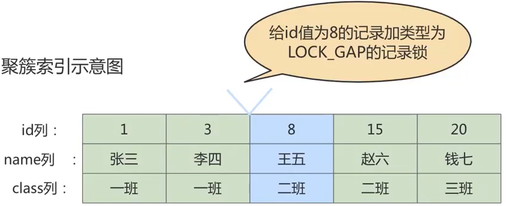

图中id值为8的记录加了gap锁，意味着不允许别的事务在id值为8的记录前边的间隙插入新记录，其实就是id列的值(3,8)这个区间的新记录是不允许立即插入的。比如，有另外一个事务再想插入一条id值为4的新记录它定位到该条新记录的下一条记录的id值为8，而这条记录上又有一个gap锁，所以就会阻塞插入操作，直到拥有这个gap锁的事务提交了之后，id列的值在区间(3,8)中的新记录才可以被插入。

<font color='red'>gap锁的提出仅仅是为了防止插入幻影记录而提出的</font>。虽然有共享gap锁和独占gap锁这样的说法，但是它们起到的作用是相同的。而且如果对一条记录加了gap锁(不论是共享gap锁还是独占gap锁)，并不会限制其他事务对这条记录加记录锁或者继续加gap锁。


这里session 2并不会被堵住。因为表里并没有id=5这个记录，因此 session 1加的是间隙锁(3,8)。而session 2也是在这个间隙加的间隙锁。它们有共同的目标，即:<font color='red'>保护这个间隙，不允许插入值</font>。但，它们之间是<font color='red'>不冲突</font>的。注意，给一条记录加了gap锁只是不允许其他事务往这条记录前边的间隙插入新记录，那对于最后一条记录之后的间隙，也就是student 表中id值为20的记录之后的间隙该咋办呢?也就是说给哪条记录加gap锁.才能阻止其他事务插入id值在(20，+∞)这个区间的新记录呢?这时候我们在讲数据页时介绍的两条伪记录派上用场了：

* Infimum记录，表示该页面中最小的记录。
* supremum记录，表示该页面中最大的记录。

为了实现阻止其他事务插入id值在<font color='red'>(20, +oo)</font>这个区间的新记录，我们可以给索引中的最后一条记录，也就是id值为20的那条记录所在页面的Supremum记录加上一个gap锁，如图所示。


```mysql
mysql> select * from student where id >20 lock in share mode;

Empty set (0.00 sec)

#检查
SELECT * FROM performance_schema.data_locks\G;
```


这样就可以阻止其他事务插入id值在(20,+co)这个区间的新记录。

间隙锁的引入，可能会导致同样的语句锁住更大的范围，这其实是影响了并发度的。下面的例子会产生死锁


###### 2.2.11.2.2.7 行锁3 -- 临键锁（Next-Key Locks）

有时候我们既想<font color='red'>锁住某条记录</font>，又想阻止其他事务在该记录前边的<font color='red'>间隙插入新记录</font>，所以InnoDB就提出了一种称之为Next-Key Locks的锁，官方的类型名称为: <font color='red'>LOCK_ORDINARY</font>，我们也可以简称为next-key锁。Next-KeyLocks是在存储引擎innodb、事务级别在可重复读的情况下使用的数据库锁,innodb默认的锁就是Next-Keylocks。比如，我们把id值为8的那条记录加一个next-key锁的示意图如下：


next-key锁的本质就是一个记录锁和一个gap锁的合体，它既能保护该条记录，又能阻止别的事务将新记录插入被保护记录前边的间隙。

```mysql
begin ;
select * from student where id <=8 and id > 3 for update;
```

###### 2.2.11.2.2.8 行锁4 -- 插入意向锁（Insert Intention Locks）

我们说一个事务在插入一条记录时需要判断一下插入位置是不是被别的事务加了gap锁( next-key锁也包含gap锁），如果有的话，插入操作需要等待，直到拥有gap锁的那个事务提交。但是<font color='red'>InnoDB规定事务在等待的时候也需要在内存中生成一个锁结构</font>，表明有事务想在某个间隙中插入新记录，但是现在在等待。InnoDB就把这种类型的锁命名为Insert Intention Locks，官方的类型名称为:<font color='red'>LOCK_INSERT_INTENTION</font>，我们称为插入意向锁。插入意向锁是<font color='red'>一种Gap锁</font>，<font color='red'>不是意向锁</font>，在insert操作时产生。

插入意向锁是在插入一条记录行前，由INSERT 操作产生的<font color='red'>一种间隙锁</font>。该锁用以表示插入意向，当多个事务在同一区间(gap）插入位置不同的多条数据时，事务之间不需要互相等待。假设存在两条值分别为4和7的记录，两个不同的事务分别试图插入值为5和6的两条记录，每个事务在获取插入行上独占的(排他)锁前，都会获取（4，7）之间的间隙锁，但是因为数据行之间并不冲突，所以两个事务之间并不会产生冲突（阻塞等待)。总结来说，插入意向锁的特性可以分成两部分：

(1）插入意向锁是一种特殊的间隙锁—一间隙锁可以锁定开区间内的部分记录。
(2）插入意向锁之间互不排斥，所以即使多个事务在同一区间插入多条记录，只要记录本身（主键唯—索
引)不冲突，那么事务之间就不会出现冲突等待。

注意，虽然插入意向锁中含有意向锁三个字，但是它并不属于意向锁而属于间隙锁，因为意向锁是表锁而插入意向锁是行锁。比如，把id值为8的那条记录加一个插入意向锁的示意图如下:

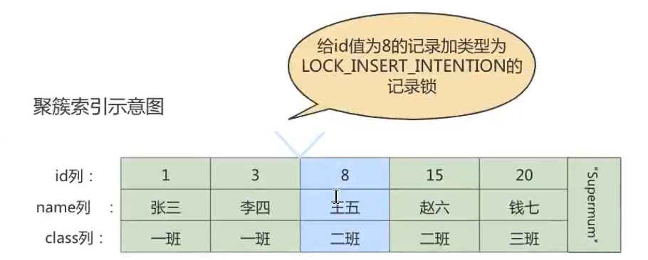

比如，现在T1为id值为s的记录加了一个gap锁，然后T2和T3分别想向student表中插入id值分别为4、5的两条记录，所以现在为id值为8的记录加的锁的示意图就如下所示：


从图中可以看到，由于T1持有gap锁，所以T2和T3需要生成一个插入意向锁的锁结构并且处于等待状态。当T1提交后会把它获取到的锁都释放掉，这样T2和T3就能获取到对应的插入意向锁了(本质上就是把插入意向锁对应锁结构的is_waiting属性改为false)，T2和T3之间也并不会相互阻塞，它们可以同时获取到id值为8的插入意向锁,然后执行插入操作。事实上<font color='red'>插入意向锁并不会阻止别的事务继续获取该记录上任何类型的锁。</font>

###### 2.2.11.2.2.9 页锁

页锁就是在页的粒度上进行锁定，锁定的数据资源比行锁要多，因为一个页中可以有多个行记录。当我们使用页锁的时候，会出现数据浪费的现象，但这样的浪费最多也就是一个页上的数据行。<font color='red'>页锁的开销介于表锁和行锁之间，会出现死锁。锁定粒度介于表锁和行锁之间，并发度一般。</font>

<font color='red'>每个层级的锁数量是有限制的，因为锁会占用内存空间，锁空间的大小是有限的</font>。当某个层级的锁数量超过了这个层级的阈值时，就会进行锁升级。锁升级就是用更大粒度的锁替代多个更小粒度的锁，比如InnoDB中行锁升级为表锁，这样做的好处是占用的锁空间降低了，但同时数据的并发度也下降了。

##### 2.2.11.2.3 从对待所的态度划分：乐观锁、悲观锁

###### 2.2.11.2.3.1 悲观锁（Pessimistic Locking）

悲观锁是一种思想，顾名思义，就是很悲观，对数据被其他事务的修改持保守态度，会通过数据库自身的锁机制来实现，从而保证数据操作的排它性。

悲观锁总是假设最坏的情况，每次去拿数据的时候都认为别人会修改，所以每次在拿数据的时候都会上锁，这样别人想拿这个数据就会阻塞直到它拿到锁（<font color='red'>共享资源每次只给一个线程使用，其它线程阻塞，用完后再把资源转让给其它线程</font>)。比如行锁，表锁，读锁，写锁等，都是在做操作之前先上锁，当其他线程想要访问数据时，都需要阻塞挂起。Java中<font color='red'>synchronized</font>和<font color='red'>ReentrantLock</font>等独占锁就是悲观锁思想的实现。


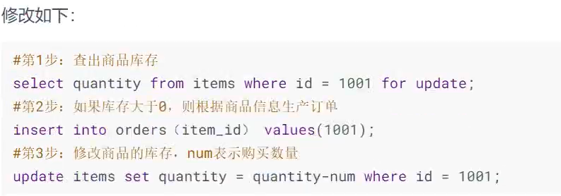

<font color='red'>select .... for update</font>是MysQL中<font color='red'>悲观锁</font>。此时在items表中，id为1001的那条数据就被我们锁定了，其他的要执行select quantity from items where id = 1001 for update;语句的事务必须等本次事务提交之后才能执行。这样我们可以保证当前的数据不会被其它事务修改。

注意，当执行select quantity from items where id = 1001 for update;语句之后，如果在其他事务中执行selectquantity from items where id = 1001;语句，并不会受第一个事务的影响，仍然可以正常查询出数据.

注意:<font color='red'> select ... for update语句执行过程中所有扫描的行都会被锁上，因此在MySQL中用悲观锁必须确定使用了索引，而不是全表扫描，否则将会把整个表锁住</font>。
悲观锁不适用的场景较多，它存在一些不足，因为悲观锁大多数情况下依靠数据库的锁机制来实现,以保证程序的并发访问性，同时这样对数据库性能开销影响也很大，特别是长事务而言，这样的开销往往无法承受，这时就需要乐观锁。

###### 2.2.11.2.3.2 乐观锁（Optimistic Locking）

乐观锁认为对同一数据的并发操作不会总发生，属于小概率事件，不用每次都对数据上锁，但是在更新的时候会判断一下在此期间别人有没有去更新这个数据，也就是<font color='red'>不采用数据库自身的锁机制，而是通过程序来实现</font>。在程序上，我们可以采用版本号机制或者CAS机制实现。<font color='red'>乐观锁适用于多读的应用类型，这样可以提高吞吐量</font>。在Java中java.util.concurrent.atomic包下的原子变量类就是使用了乐观锁的一种实现方式:CAS实现的。

1. <font color='red' size='4'>乐观锁的版本号机制</font>
   在表中设计一个<font color='red'>版本字段virsion</font>，第一次读的时候，会获取version字段的取值。然后对数据进行更新或删除操作时，会执行<font color='red'>UPDATE ... SET version=version+1 WHERE version=version</font>。此时如果已经有事务对这条数据进行了更改，修改就不会成功。

   这种方式类似我们熟悉的SVN、CVS版本管理系统，当我们修改了代码进行提交时，首先会检查当前版本号与服务器上的版本号是否一致，如果一致就可以直接提交，如果不一致就需要更新服务器上的最新代码,然后再进行提交。

2. <font color='red' size='4'>乐观锁的时间戳机制</font>
   时间戳和版本号机制一样，也是在更新提交的时候，将当前数据的时间戳和更新之前取得的时间戳进行比较，如果两者一致则更新成功，否则就是版本冲突。


###### 2.2.11.2.3.3 两种锁的使用场景

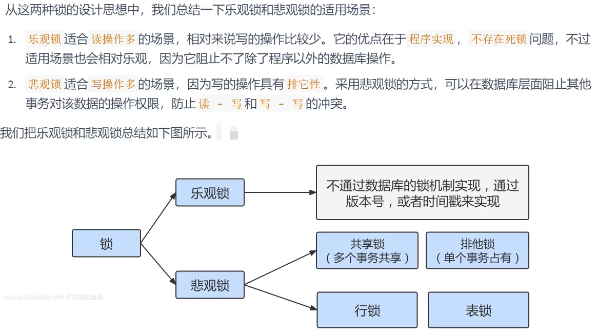

##### 2.2.11.2.4 按加锁的方式划分：显式锁、隐式锁

###### 2.2.11.2.4.1 隐式锁


###### 2.2.11.2.4.2 显式锁


##### 2.2.11.2.5 其他锁1 -- 全局锁

全局锁就是对整个数据库实例加锁。当你需要让整个库处于只读状态的时候，可以使用这个命令，之后其他线程的以下语句会被阻塞:数据更新语句(数据的增删改)、数据定义语句(包括建表、修改表结构等）和更新类事务的提交语句。全局锁的典型使用场景是:做全库逻辑备份。

全局锁的命令：

```mysql
Flush tables with read lock
```

##### 2.2.11.2.6 其他锁2 -- 死锁

###### 2.2.11.2.6.1 概念

两个事务都持有对方需要的锁，并且在等待对方释放，并且双方都不会释放自己的锁。

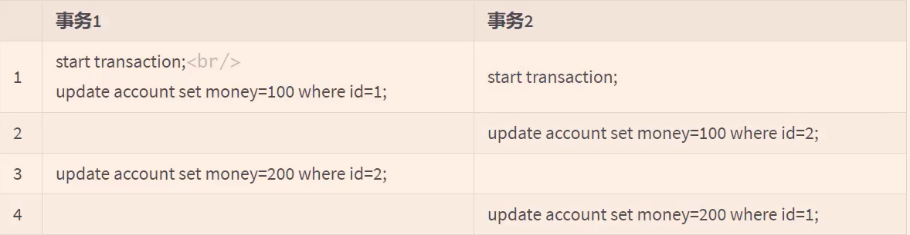

###### 2.2.11.2.6.2 产生死锁的必要条件

1. 两个或者两个以上事务
2. 每个事务都已经持有锁并且申请新的锁
3. 锁资源同时只能被同一个事务持有或者不兼容
4. 事务之间因为持有锁和申请锁导致彼此循环等待

> 死锁的关键在于：两个(或以上)的Session加锁的顺序不一致。

###### 2.2.11.2.6.3 如何处理死锁


 


  ###### 2.2.11.2.6.4 如何避免死锁？


#### 2.2.11.3 锁的内存结构


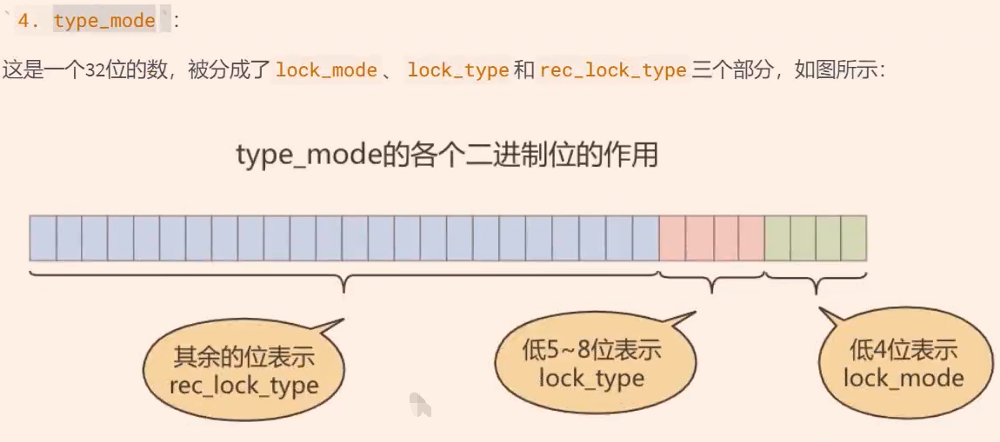


#### 2.2.11.4 锁监控


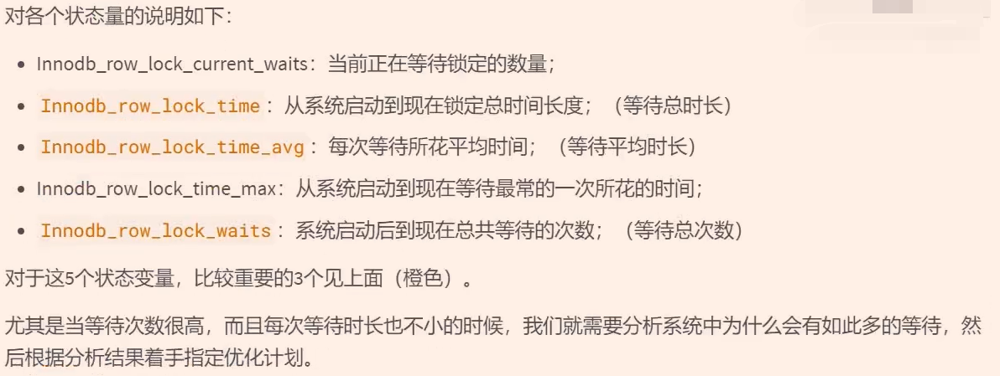


### 2.2.12 事务篇4--多版本并发控制

#### 2.2.12.1 什么是MVCC


#### 2.2.12.2 快照读与当前读

MVCC在MysQL InnoDB中的实现主要是为了提高数据库并发性能，用更好的方式去处理<font color='red'>读-写冲突</font>，做到即使有读写冲突时，也能做到不加锁，非阻塞并发读，而这个读指的就是快照读,而非当前读。当前读实际上是一种加锁的操作，是悲观锁的实现。而MVCC本质是采用乐观锁思想的一种方式。

##### 2.2.12.2.1 快照读


##### 2.2.12.2.2 当前读


#### 2.2.12.3 复习

##### 2.2.12.3.1 再谈隔离级别

我们知道事务有4个隔离级别，可能存在三种并发问题:


在MysQL中，默认的隔离级别是可重复读，可以解决脏读和不可重复读的问题，如果仅从定义的角度来看，它并不能解决幻读问题。如果我们想要解决幻读问题，就需要采用串行化的方式，也就是将隔离级别提升到最高，但这样一来就会大幅降低数据库的事务并发能力。

MVCC 可以不采用锁机制，而是通过乐观锁的方 式来解决不可重复读和幻读问题!它可以在大多数情况下替代行级锁，降低系统的开销。


##### 2.2.12.3.2 隐藏字段、Undo Log版本链

回顾一下undo日志的版本链，对于使用InnoDB存储引擎的表来说，它的聚簇索引记录中都包含两个必要的隐藏列。

- trx_id : 每次一个事务对某条聚簇索引记录进行改动时，都会把该事务的事务id赋值给trx_id隐藏列。
- roll_pointer:每次对某条聚簇索引记录进行改动时，都会把旧的版本写入到undo日志中，然后这个隐藏列就相当于一个指针，可以通过它来找到该记录修改前的信息。


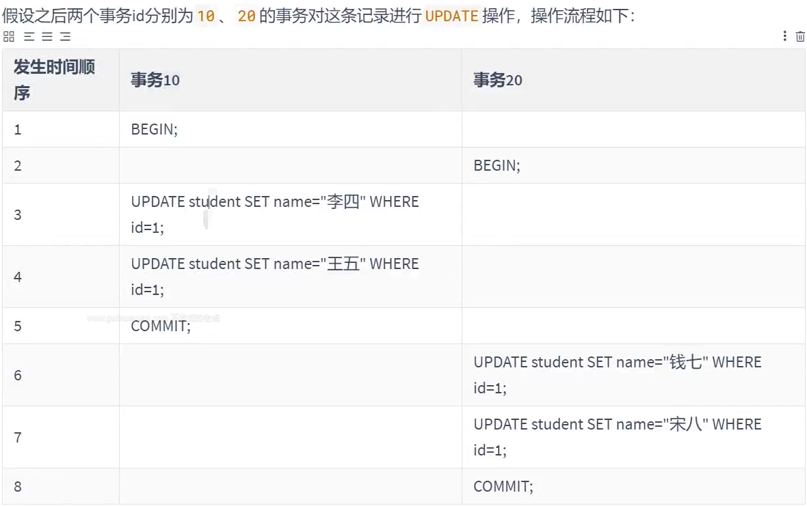


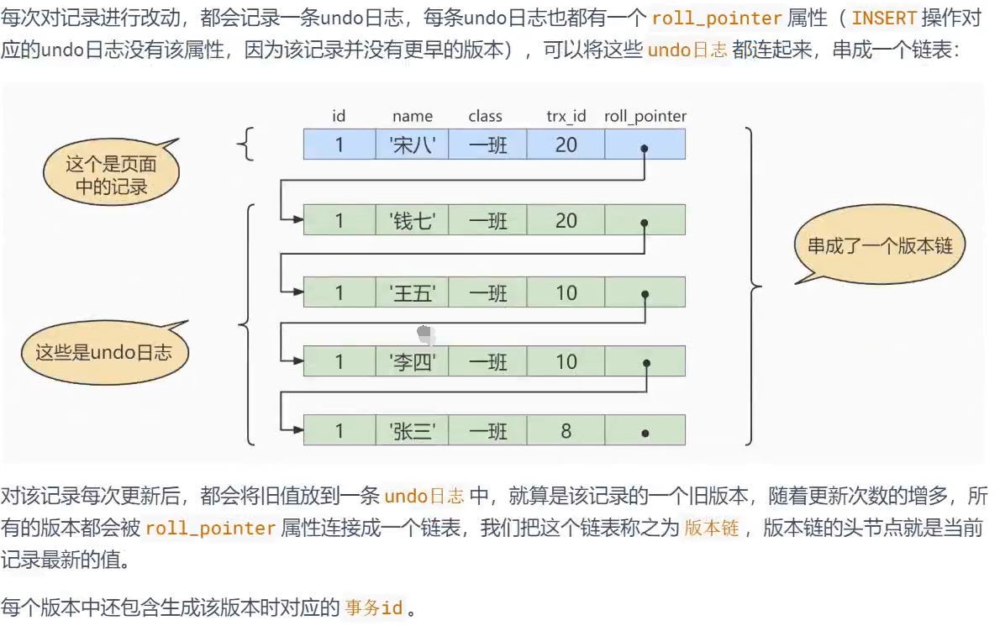

#### 2.2.12.4 MVCC实现原理之ReadView

MVCC的实现依赖于：<font color='red'>隐藏字段、Undo Log、Read View</font>

##### 2.2.12.4.1 什么是ReadView


##### 2.2.12.4.2 设计思路


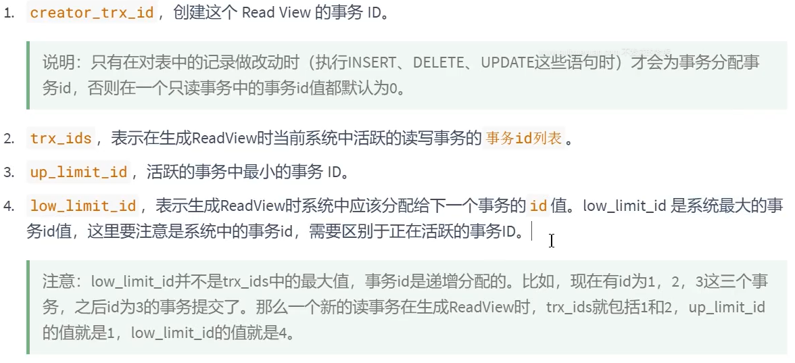


##### 2.2.12.4.3 ReadView的规则


##### 2.2.12.4.4 MVCC整体操作流程


#### 2.2.12.5 举例说明


##### 2.2.12.5.1 READ COMMITTED隔离级别下


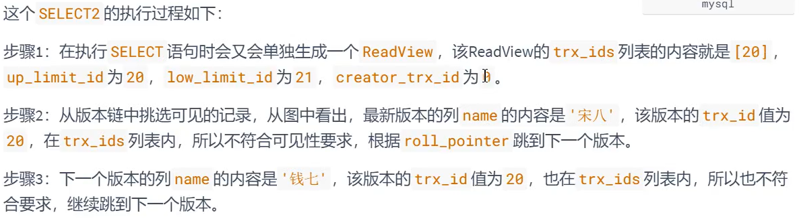


##### 2.2.12.5.2 REPEATABLE READ隔离级别下


 


 

##### 2.2.12.5.3 如何解决幻读


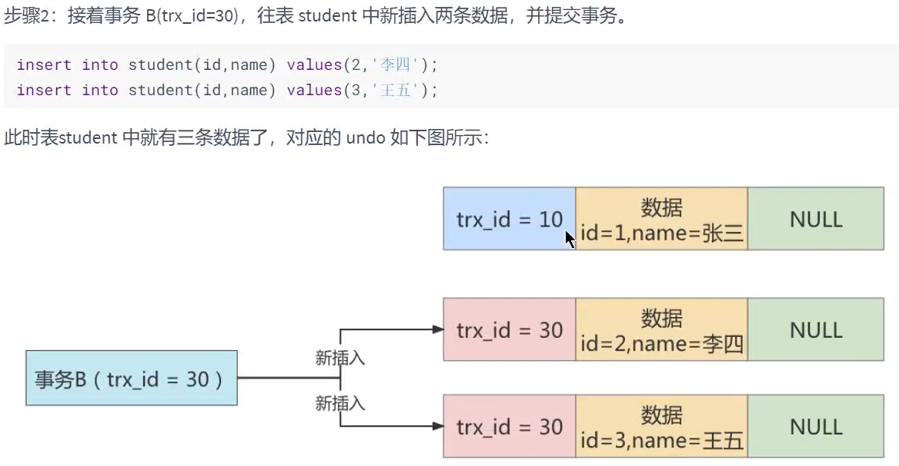


#### 2.2.12.6 总结


### 2.2.13 日志与备份篇1--其他数据库日志

#### 2.2.13.1 MySQL支持的日志

##### 2.2.13.1.1 日志类型

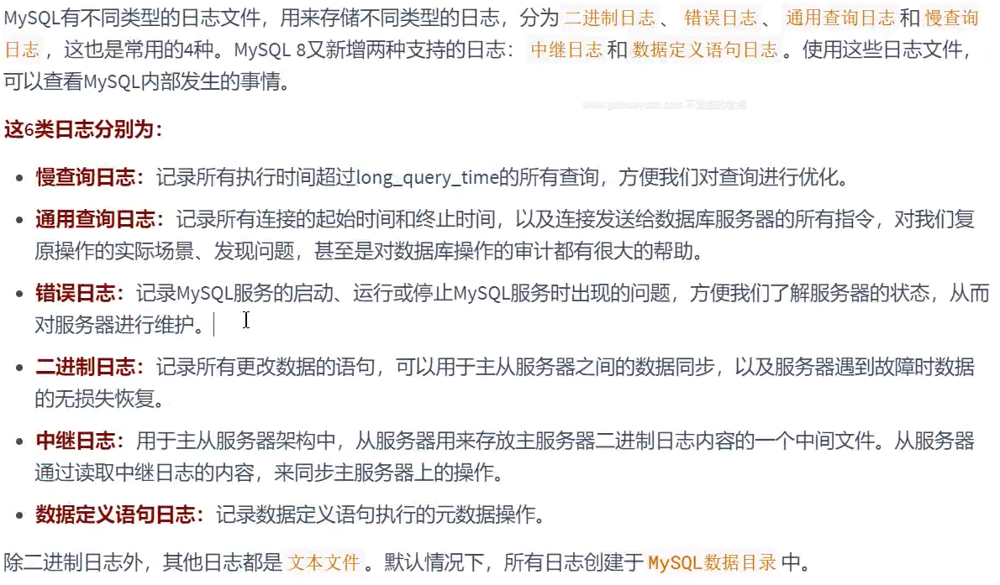

##### 2.2.13.1.2 日志的弊端


#### 2.2.13.2 慢查询日志

性能分析工具中讲到

#### 2.2.13.3 通用查询日志

##### 2.2.13.3.1 查看当前状态


##### 2.2.13.3.2 启动日志

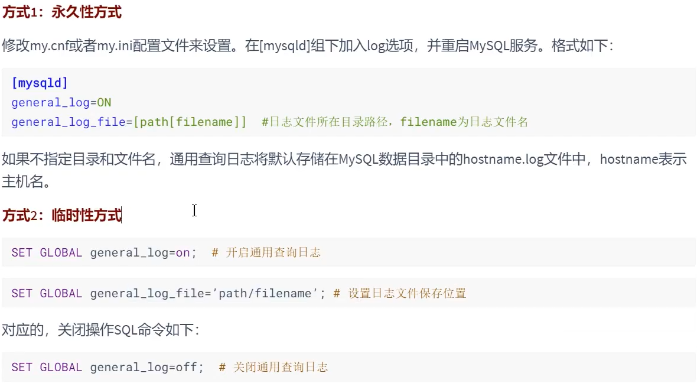


##### 2.2.13.3.3 查看日志


##### 2.2.13.3.4 停止日志


##### 2.2.13.3.5 删除/刷新日志


#### 2.2.13.4 错误日志


##### 2.2.13.4.1 启动日志


##### 2.2.13.4.2 查看日志


##### 2.2.13.4.3 删除/刷新日志


#### 2.2.13.5 * 二进制日志（bin log）

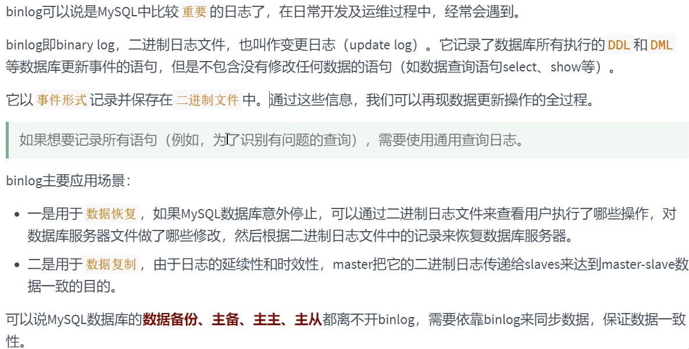


##### 2.2.13.5.1 查看默认情况


##### 2.2.13.5.2 日志参数设置


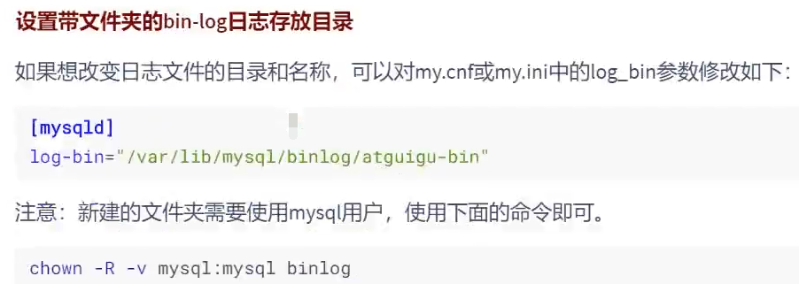


##### 2.2.13.5.3 查看日志


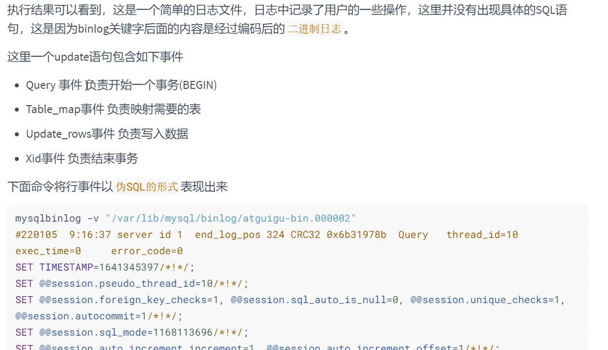


##### 2.2.13.5.4 使用日志恢复数据

###### 2.2.13.5.4.1 使用Pos恢复

<font color='red'>先进性一系列的操作</font>

```mysql
mysql> SELECT *FROM student;
+----+---------+--------+
| id | name    | class  |
+----+---------+--------+
|  1 | 张三1   | 一班   |
|  3 | 李四    | 一班   |
|  8 | 王五    | 二班   |
| 15 | 赵六    | 二班   |
| 20 | 钱七    | 三班   |
+----+---------+--------+
5 rows in set (0.00 sec)

# 先进性一系列的操作
INSERT INTO student(id,name,class) VALUES(21,'aaa','aasds');
INSERT INTO student(id,name,class) VALUES(22,'aaa','aasds');
INSERT INTO student(id,name,class) VALUES(23,'aaa','aasds');
UPDATE student SET name='bbb' WHERE id = 22;

DELETE FROM student WHERE id > 20;

# 查看binlog存放的位置
mysql> SHOW VARIABLES LIKE '%log_bin%';
+---------------------------------+----------------------------------+
| Variable_name                   | Value                            |
+---------------------------------+----------------------------------+
| log_bin                         | ON                               |
| log_bin_basename                | /www/server/data/mysql-bin       |
| log_bin_index                   | /www/server/data/mysql-bin.index |
| log_bin_trust_function_creators | ON                               |
| log_bin_use_v1_row_events       | OFF                              |
| sql_log_bin                     | ON                               |
+---------------------------------+----------------------------------+
6 rows in set (0.00 sec)

# 查看日志文件列表
mysql> SHOW BINARY LOGS;
+------------------+-----------+
| Log_name         | File_size |
+------------------+-----------+
| mysql-bin.000009 |  58574805 |
| mysql-bin.000010 | 138919254 |
+------------------+-----------+
2 rows in set (0.00 sec)

#这里会发现一个日志文件比较大，可以用flush logs命令重新开启一个日志文件，方便查询
mysql> flush logs;
Query OK, 0 rows affected (0.04 sec)

mysql> SHOW BINARY LOGS;
+------------------+-----------+
| Log_name         | File_size |
+------------------+-----------+
| mysql-bin.000010 | 138922497 |
| mysql-bin.000011 |       154 |
+------------------+-----------+
2 rows in set (0.00 sec)

# 查看指定binlog日志
SHOW BINLOG EVENTS IN 'mysql-bin.000010';


```


<font color='red' size='5'>开始恢复数据</font>

```mysql
# 开始恢复数据
# mycalbinlog数据恢复指令
mysqlbinlog [option] filename | mysql -uuser -ppass ;
# find  / -name mysqlbinlog -print 查看mysqlbinlog的位置
```

<font color='red' size='4'>先恢复插入的数据</font>

```mysql
# 执行命令
# /www/server/mysql/bin/mysqlbinlog 是binlog可执行文件的位置
# --start-position插入操作事务BEGIN的Pos值
# --stop-position插入操作最后一个插入操作事务的COMMIT对应的下一条数据（info=SET @@SESSION.GTID_NEXT= 'ANONYMOUS'）的Pos值
# /www/server/data/mysql-bin.000010 是二进制日志文件
[root@VM-20-4-centos ~]# /www/server/mysql/bin/mysqlbinlog --start-position=138919621 --stop-position=138920509 --database=atguigudb /www/server/data/mysql-bin.000010 | mysql -uroot -pontoweb -v atguigudb
mysql: [Warning] Using a password on the command line interface can be insecure.
--------------
/*!50530 SET @@SESSION.PSEUDO_SLAVE_MODE=1*/
--------------

--------------
/*!50003 SET @OLD_COMPLETION_TYPE=@@COMPLETION_TYPE,COMPLETION_TYPE=0*/
--------------

--------------
ROLLBACK
--------------

--------------
BINLOG '
Kit3Yg8BAAAAdwAAAHsAAAABAAQANS43LjM0LWxvZwAAAAAAAAAAAAAAAAAAAAAAAAAAAAAAAAAA
AAAAAAAAAAAAAAAAAAAqK3diEzgNAAgAEgAEBAQEEgAAXwAEGggAAAAICAgCAAAACgoKKioAEjQA
AaDtBVE=
'
--------------

--------------
SET TIMESTAMP=1653898411
--------------

--------------
SET @@session.pseudo_thread_id=629
--------------

--------------
SET @@session.foreign_key_checks=1, @@session.sql_auto_is_null=0, @@session.unique_checks=1, @@session.autocommit=1
--------------

--------------
SET @@session.sql_mode=1075838976
--------------

--------------
SET @@session.auto_increment_increment=1, @@session.auto_increment_offset=1
--------------

--------------
/*!*/
--------------

--------------
SET @@session.character_set_client=45,@@session.collation_connection=45,@@session.collation_server=45
--------------

--------------
SET @@session.lc_time_names=0
--------------

--------------
SET @@session.collation_database=DEFAULT
--------------

--------------
BEGIN
--------------

--------------
SET TIMESTAMP=1653898411
--------------

--------------
INSERT INTO student(id,name,class) VALUES(21,'aaa','aasds')
--------------

--------------
COMMIT
--------------

--------------
SET @@SESSION.GTID_NEXT= 'ANONYMOUS'
--------------

--------------
SET TIMESTAMP=1653898411
--------------

--------------
BEGIN
--------------

--------------
SET TIMESTAMP=1653898411
--------------

--------------
INSERT INTO student(id,name,class) VALUES(22,'aaa','aasds')
--------------

--------------
COMMIT
--------------

--------------
SET @@SESSION.GTID_NEXT= 'ANONYMOUS'
--------------

--------------
SET TIMESTAMP=1653898411
--------------

--------------
BEGIN
--------------

--------------
SET TIMESTAMP=1653898411
--------------

--------------
INSERT INTO student(id,name,class) VALUES(23,'aaa','aasds')
--------------

--------------
COMMIT
--------------

--------------
SET @@SESSION.GTID_NEXT= 'AUTOMATIC'
--------------

--------------
/*!50003 SET COMPLETION_TYPE=@OLD_COMPLETION_TYPE*/
--------------

--------------
/*!50530 SET @
```

<font color='red' size='4'>恢复update操作的数据</font>

```mysql
[root@VM-20-4-centos ~]# /www/server/mysql/bin/mysqlbinlog --start-position=138920605 --stop-position=138920852 --database=atguigudb /www/server/data/mysql-bin.000010 | mysql -uroot -pontoweb -v atguigudb
mysql: [Warning] Using a password on the command line interface can be insecure.
--------------
/*!50530 SET @@SESSION.PSEUDO_SLAVE_MODE=1*/
--------------

--------------
/*!50003 SET @OLD_COMPLETION_TYPE=@@COMPLETION_TYPE,COMPLETION_TYPE=0*/
--------------

--------------
ROLLBACK
--------------

--------------
BINLOG '
Kit3Yg8BAAAAdwAAAHsAAAABAAQANS43LjM0LWxvZwAAAAAAAAAAAAAAAAAAAAAAAAAAAAAAAAAA
AAAAAAAAAAAAAAAAAAAqK3diEzgNAAgAEgAEBAQEEgAAXwAEGggAAAAICAgCAAAACgoKKioAEjQA
AaDtBVE=
'
--------------

--------------
SET TIMESTAMP=1653898414
--------------

--------------
SET @@session.pseudo_thread_id=629
--------------

--------------
SET @@session.foreign_key_checks=1, @@session.sql_auto_is_null=0, @@session.unique_checks=1, @@session.autocommit=1
--------------

--------------
SET @@session.sql_mode=1075838976
--------------

--------------
SET @@session.auto_increment_increment=1, @@session.auto_increment_offset=1
--------------

--------------
/*!*/
--------------

--------------
SET @@session.character_set_client=45,@@session.collation_connection=45,@@session.collation_server=45
--------------

--------------
SET @@session.lc_time_names=0
--------------

--------------
SET @@session.collation_database=DEFAULT
--------------

--------------
BEGIN
--------------

--------------
SET TIMESTAMP=1653898414
--------------

--------------
UPDATE student SET name='bbb' WHERE id = 22
--------------

--------------
COMMIT
--------------

--------------
SET @@SESSION.GTID_NEXT= 'AUTOMATIC'
--------------

--------------
/*!50003 SET COMPLETION_TYPE=@OLD_COMPLETION_TYPE*/
--------------

--------------
/*!50530 SET @@SESSION.PSEUDO_SLAVE_MODE=0*/
--------------
```

###### 2.2.13.5.4.2 使用时间恢复


日志文件中是以时间戳的方式存储的，我们要转换时间格式

##### 2.2.13.5.5 删除二进制日志

###### 2.2.13.5.5.1 PURGE MASTER LOGS：删除指定日志文件


###### 2.2.13.5.5.2 RESET MASTER：删除所有二进制日志文件


#### 2.2.13.6 再谈二进制日志（binlog）

https://www.gulixueyuan.com/course/510/task/22390/show#

##### 2.2.13.6.1 写入机制

binlog的写入时机也非常简单，事务执行过程中，先把日志写到binlog cache，事务提交的时候，再把binlog cache写到binlog文件中。因为一个事务的binlog不能被拆开，无论这个事务多大，也要确保一次性写入，所以系统会给每个线程分配一个块内存作为binlog cache。


##### 2.2.13.6.2 binlog与redolog对比

1. redo log 是 InnoDB 引擎特有的；binlog 是 MySQL 的 Server 层实现的，所有引擎都可以使用。
2. redo log 是物理日志，记录的是“在某个数据页上做了什么修改”；binlog 是逻辑日志，记录的是这个语句的原始逻辑，比如“给 ID=2 这一行的 c 字段加 1 ”。
3. redo log 是循环写的，空间固定会用完；binlog 是可以追加写入的。“追加写”是指 binlog 文件写到一定大小后会切换到下一个，并不会覆盖以前的日志。
4. 虽然它们都属于持久化的保证，但是则重点不同。
   1. redo log让InnoDB存储引擎拥有了崩溃恢复能力。
   2. binlog保证了MySQL集群架构的数据一致性。

###### 2.2.13.6.3 两阶段提交


### 2.2.14 日志与备份篇2--主从复制

#### 2.2.14.1 主从复制概述

##### 2.2.14.1.1如何提升数据库并发能力

在实际工作中，我们常常将Redis作为缓存与MySQL配合来使用，当有请求的时候，首先会从缓存中进行查找，如果存在就直接取出。如果不存在再访问数据库，这样就提升了读取的效率，也减少了对后端数据库的访问压力。<font color='red'>Redis 的缓存架构</font>是高并发架构中非常重要的一环。


此外，一般应用对数据库而言都是“读多写少”，也就说对数据库读取数据的压力比较大，有一个思路就是采用数据库集群的方案，做主从架构、进行读写分离，这样同样可以提升数据库的并发处理能力。但并不是所有的应用都需要对数据库进行主从架构的设置，毕竟设置架构本身是有成本的。

如果我们的目的在于提升数据库高并发访问的效率，那么首先考虑的是如何优化SQL和索引，这种方式简单有效;其次才是采用缓存的策略，比如使用Redis将热点数据保存在内存数据库中，提升读取的效率;最后才是对数据库采用主从架构，进行读写分离。

按照上面的方式进行优化，使用和维护的成本是由低到高的。

##### 2.2.14.1.2 主从复制的作用

主从同步设计不仅可以提高数据库的吞吐量，还有以下3个方面的作用。

###### 第1个作用：读写分离。

我们可以通过主从复制的方式来同步数据，然后通过读写分离提高数据库并发处理能力。


其中一个是Master主库，负责写入数据，我们称之为：写库。

其它都是Slave从库，负责读取数据，我们称之为：读库。

当主库进行更新的时候，会自动将数据复制到从库中，而我们在客户端读取数据的时候，会从从库中进行读取。面对“读多写少”的需求，采用读写分离的方式，可以实现更高的并发访问。同时，我们还能对从服务器进行负载均衡，让不同的读请求按照策略均匀地分发到不同的从服务器上，让读取更加顺畅。读取顺畅的另一个原因，就是减少了锁表的影响，比如我们让主库负责写，当主库出现写锁的时候，不会影响到从库进行SELECT的读取。

###### 第2个作用：数据备份。

我们通过主从复制将主库上的数据复制到了从库上，相当于是一种热备份机制，也就是在主库正常运行的情况下进行的备份，不会影响到服务。

###### 第3个作用：具有高可用性。

数据备份实际上是一种冗余的机制，通过这种冗余的方式可以换取数据库的高可用性，也就是当服务器出现故障或宕机的情况下，可以切换到从服务器上，保证服务的正常运行。

关于高可用性的程度，我们可以用一个指标衡量，即正常可用时间/全年时间。比如要达到全年99.999%的时间都可用，就意味着系统在一年中的不可用时间不得超过365*24*60* (1-99.999%)=5.256分钟（含系统崩溃的时间、日常维护操作导致的停机时间等)，其他时间都需要保持可用的状态。

实际上，更高的高可用性，意味着需要付出更高的成本代价。在现实中我们需要结合业务需求和成本来进行选择。

#### 2.2.14.2 主从复制的原理

Slave会从Master 读取binlog来进行数据同步。

##### 2.2.14.2.1 原理剖析

三个线程

实际上主从同步的原理就是基于binlog进行数据同步的。在主从复制过程中，会基于3个线程来操作，一个主库线程，两个从库线程。


<font color='red'>二进制日志转储线程</font>（Binlog dump thread)是一个主库线程。当从库线程连接的时候，主库可以将二进制日志发送给从库，当主库读取事件（Event)的时候，会在Binlog上加锁，读取完成之后，再将锁释放掉。

<font color='red'>从库 I/0 线程</font>会连接到主库，向主库发送请求更新Binlog。这时从库的I/O线程就可以读取到主库的二进制日志转储线程发送的Binlog更新部分，并且拷贝到本地的中继日志 (Relay log)。

<font color='red'>从库SQL线程</font>会读取从库中的中继日志，并且执行日志中的事件，将从库中的数据与主库保持同步。


> 注意:
> 不是所有版本的MySQL都默认开启服务器的二进制日志。在进行主从同步的时候，我们需要先检查服务器是否已经开启了二进制日志。
>
> 除非特殊指定，默认情况下从服务器会执行所有主服务器中保存的事件。也可以通过配置，使从服务器执行特定的事件。

<font color='red'>复制三步骤</font>
步骤1: Master将写操作记录到二进制日志 （ binlog )。这些记录叫做二进制日志事件(binary log events) ;

步骤2: slave将Master的binary log events拷贝到它的中继日志(relay log ) ;
步骤3: Slave重做中继日志中的事件，将改变应用到自己的数据库中。MysQL复制是异步的且串行化的，而且重启后从接入点开始复制。

<font color='red'>复制的问题</font>
复制的最大问题：<font color='red'>延时</font>

比如有个update行为，从用户提交事务到数据写入从库需要500ms，假如用户提交之后立即查询，查询只需要200ms，这时候用户查询结果为空。

##### 2.2.14.2.2 复制的基本原则

- 每个Slave只有一个Master

- 每个Slave只能有一个唯一的服务器ID

- 每个Master 可以有多个Slave

#### 2.2.14.3 一主一从架构搭建


##### 2.2.14.3.1 准备工作


##### 2.2.14.3.2 主机配置文件

建议mysql版本一致且后台以服务运行，主从所有配置项都配置在[mysqld]节点下，且都是小写字母。

* 必选

```properties
#[必须]主服务器唯一ID
server-id=1
#[必须]启用二进制日志,指名路径。比如:自己本地的路径
/log/mysqlbinlog-bin=atguigu-bin

```

* 可选

```properties
#[可选]日(默认）表示读写（主机），1表示只读（从机)
read-only=8
#设置日志文件保留的时长，单位是秒
binlog_expire_logs_seconds=6000
#控制单个二进制日志大小。此参数的最大和默认值是1GB
max_binlog_size=200M
#[可选]设置]K要复制的数据库
binlog-ignore-db=test
#[可选]设置需要复制的数据库,默认全部记录。比如: binlog-do-db=atguigu_master_slave
binlog-do-db=需要复制的主数据库名字
#[可选]设置binlog格式
binlog_format=STATEMENT
```

重启mysql服务

>注意:主从机都关闭防火墙
>service iptables stop     #CentOS 6
>systemctl stop firewalld.service    #CentOS 7

##### 2.2.14.3.3 主机：建立账户并授权

```mysql
#在主机MySQL里执行授权主从复制的命令
GRANT REPLICATION SLAVE ON *.* TO 'slave1' @'从机器数据库IP' IDENTIFIED BY 'abc123';#5.5，5.7
```

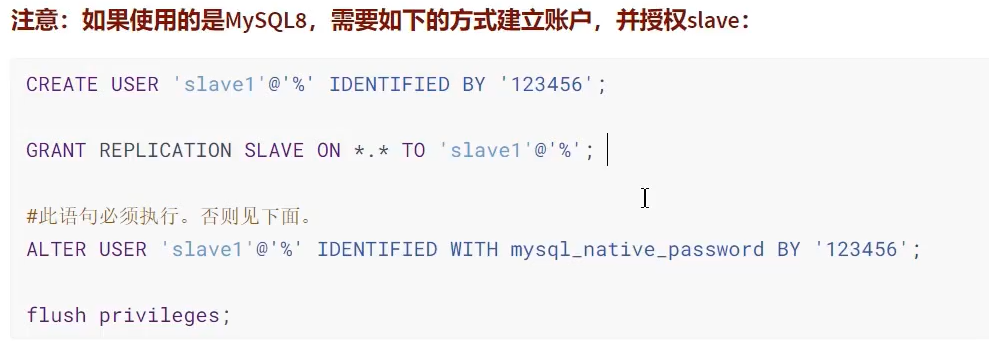

>注意:在从机执行show slave status\G时报错:
>Last_lo_Error: error connecting to master 'slave1@192.168.1.150:3306' - retry-time:60 retries: 1 messagAuthentication plugin 'caching_sha2_password' reported error:Authentication requires secure connection.

查询Master的状态，并记录下File和Position的值。

```mysql
show master status;
```


记录下File和Position的值
注意：执行完此步骤后不要再操作主服务器MySQL，防止主服务器状态值变化。

##### 2.2.14.3.4 从机：配置需要复制的主机

步骤1∶从机上复制主机的命令

```mysql
CHANGE MASTER TO
MASTER_HOST=’主机的IP地址',
MASTER_USER='主机用户名',
MASTER_PASSWORD='主机用户名的密码',
MASTER_LOG_FILE='mysql-bin.具体数字',
MASTER_LOG_POS=具体直;

# 举例
CHANGEMASTER TO 
MASTER_HOST='192.168.1.150',
TER_USER='slave1',
NASTER_PASSNORD='123456',
MASTER_LO6_ FILE='atguigu-bin.000005',
NASTER_LO6_POS=1135;
```

步骤2：

```mysql
#启动slave同步
START SLAVE;
```


接着,查看同步状态:

```mysql
SHOW SLAVE STATUS\G;
```


##### 2.2.14.3.5 测试

##### 2.2.14.3.6 停止主从同步


#### 2.2.14.4 同步数据一致性问题


#### 2.2.14.4 主备切换

主动切换

被动切换

如何判断数据库出问题了？如何解决过程中的数据不一致性问题？

### 2.2.15 日志与备份篇3--数据库备份与恢复

#### 2.2.15.1 物理备份与逻辑备份

<font color='red'>物理备份</font>：备份数据文件，转储数据库物理文件到某一目录。物理备份恢复速度比较快，但占用空间比较大，MySQL中可以用xtrabackup工具来进行物理备份。

<font color='red'>逻辑备份</font>：对数据库对象利用工具进行导出工作，汇总入备份文件内。逻辑备份恢复速度慢，但占用空间小，更灵活。MySQL中常用的逻辑备份工具为mysqldump。逻辑备份就是备份sql语句，在恢复的时候执行备份的sql语句实现数据库数据的重现。

#### 2.2.15.2 mysqldump实现逻辑备份

##### 2.2.15.2.1 备份一个数据库

mysqldump命令执行时，可以将数据库备份成一个文本文件，该文件中实际上包含多个CREATE和INSERT语句，使用这些语句可以重新创建表和插入数据。

* 查出需要备份的表的结构，在文本文件中生成一个CREATE语句
* 将表中的所有记录转换成一条INSERT语句。

基本语法:

```sh
mysqldump -u 用户名称 -h 主机名称 ―p 密码 待备份的数据库名称[tbname，[ tbname. ..]] >备份文件名称.sql
```

> 说明:
> 备份的文件并非一定要求后缀名为.sql，例如后缀名为.txt的文件也是可以的。


##### 2.2.15.2.2 备份全部数据库

若想用mysqldump备份整个实例，可以使用--all-databases或-A参数:

```sh
mysqldump -uroot -pXXXxXX --all-databases > all_database.sql
mysqldump -uroot -pX×xxx× -A > all_database.sql
```

##### 2.2.15.2.3 备份部分数据库

使用--databases或"-B 参数了，该参数后面跟数据库名称，多个数据库间用空格隔开。如果指定databases参数，备份文件中会存在创建数据库的语句，如果不指定参数，则不存在。语法如下:

```sh
mysqldump -u user -h host -p --databases [数据库的名称1[数据库的名称2...]]>备份文件名称.sql
```

举例:

```sh
mysqldump -uroot -p --databases atguigu atguigu12 >two_database.sql
```

或

```sh
mysqldump -uroot -p -B atguigu atguigu12 > two_database.sql
```

##### 2.2.15.2.4 备份部份表


##### 2.2.15.2.5 备份单表的部分数据


##### 2.2.15.2.6 排除某些表的备份


##### 2.2.15.2.7 之备份结构或只备份数据


##### 2.2.15.2.8 备份中包含存储过程、函数、事件


#### 2.2.15.3 mysql命令恢复数据


##### 2.2.15.3.1 单库备份中恢复单库


##### 2.2.15.3.2 全量备份恢复


##### 2.2.15.3.3 从全量备份中恢复单库


##### 2.2.15.3.4 从单库备份中恢复单表


#### 2.2.15.4 物理备份：直接复制整个数据库


#### 2.2.15.5 物理恢复：直接复制到数据库目录

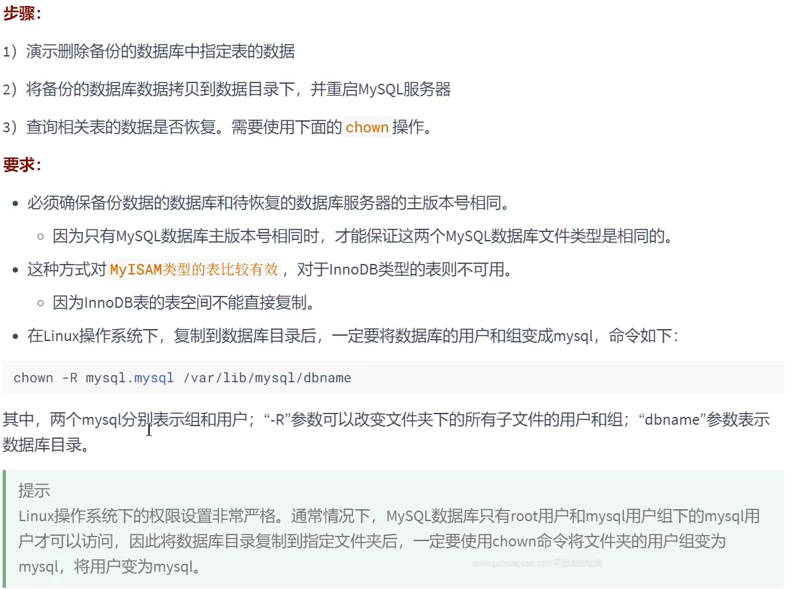

#### 2.2.15.6 表的导出与导入

##### 2.2.15.6.1 表的导出

###### 2.2.15.6.1.1 使用SELECT...INTO OUTFILE导出文本文件

在MySQL中，可以使用SELECT..IlNTO OUTFILE语句将表的内容导出成一个文本文件。


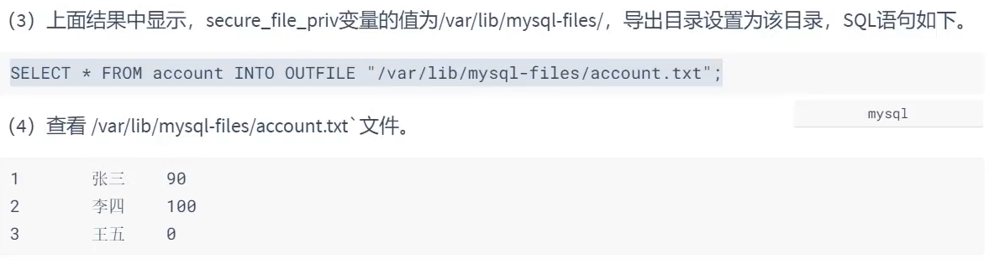

###### 2.2.15.6.1.2 使用mysqldump命令导出文本文件


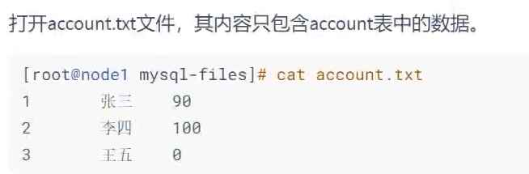


###### 2.2.15.6.1.3 使用mysql命每导出文本文件

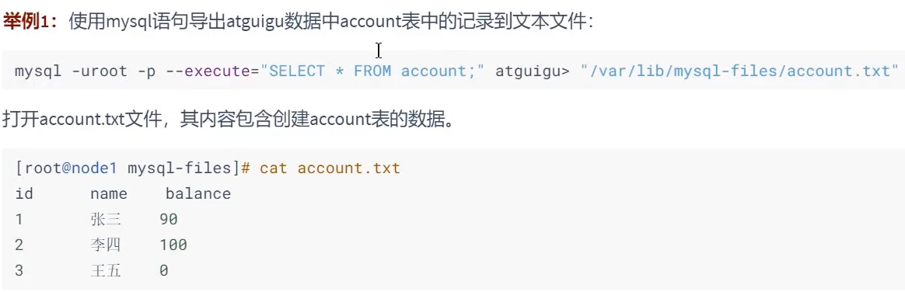


##### 2.2.15.6.2 表的导入

###### 2.2.15.6.2.1 使用LOAD DATA INFILE方式导入文本文件


###### 2.2.15.6.1.4 使用mysqlimport方式导入文本文件


#### 2.2.15.7 数据库迁移

https://www.gulixueyuan.com/course/510/task/22398/show

#### 2.2.15.8 删库不敢跑，能干点啥？

##### 2.2.15.8.1 delete:误删行

###### 2.2.15.8.1.1 处理措施1:数据恢复

使用Flashback工具恢复数据。

原理:修改binlog内容，拿回原库重放。如果误删数据涉及到了多个事务的话，需要将事务的顺序调过来再执行。

使用前提:binlog_format=row和binlog_row_image=FULL。

###### 2.2.15.8.1.2 处理措施2:预防

- 代码上线前，必须SQL审查、审计。
- 建议可以打开安全模式，把sql_safe_updates参数设置为on。强制要求加where条件且where后需要是索引字段，否则必须使用limit。否则就会报错。

##### 2.2.15.8.2 truncate/drop :误删库/表

<font color='red'>背景:</font>
delete全表是很慢的，需要生成回滚日志、写redo、写binlog。所以，从性能角度考虑，优先考虑使用truncatetable或者drop table命令。

使用delete命令删除的数据，你还可以用Flashback来恢复。而使用truncate /drop table和drop database命令删除的数据，就没办法通过Flashback来恢复了。因为，即使我们配置了binlog_format=row，执行这三个命令时，记录的binlogi还是statement格式。binlog里面就只有一个truncate/drop语句，这些信息是恢复不出数据的。

<font color='red'>方案：</font>

这种情况下恢复数据，需要使用全量备份与增量日志结合的方式。

方案的前提：有定期的全量备份，并且实时备份binlog。

举例：有人误删了一个库，时间为下午3点。步骤如下：

1. 取最近一次全量备份。假设设置数据库库是一天一备，最近备份数据是当天凌晨2点;
2. 用备份恢复出一个临时库;（注意:这里选择临时库，而不是直接操作主库)
3. 取出凌晨2点之后的binlog日志;
4. 剔除误删除数据的语句外，其它语句全部应用到临时库。(前面讲过binlog的恢复)
5. 最后恢复到主库

##### 2.2.15.8.3 rm: 误册MySQL实例

对于一个有高可用机制的MysQL集群来说，不用担心rm删除数据。因为只删掉其中某一个节点数据的话，HA系统就会选出一个新的主库，从而保证整个集群的正常工作。我们把这个节点上的数据恢复回来后，再接入整个集群就好了。

但如果是恶意地把整个集群删除，那就需要考虑跨机房备份，跨城市备份。


