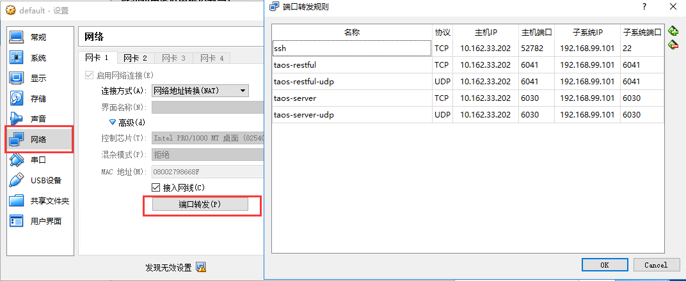
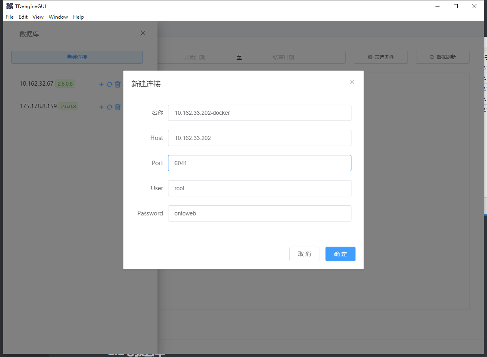
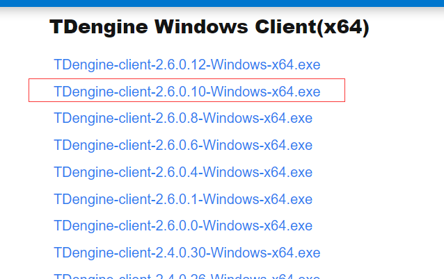

## 0 一些基本概念

|  Time Stamp   | current | voltage | phase |        location         | groupId |
| :-----------: | :-----: | :-----: | :---: | :---------------------: | :-----: |
| 1538548685000 |  10.3   |   219   | 0.31  | California.SanFrancisco |    2    |
| 1538548684000 |  10.2   |   220   | 0.23  | California.SanFrancisco |    3    |
| 1538548686500 |  11.5   |   221   | 0.35  |  California.LosAngeles  |    3    |
| 1538548685500 |  13.4   |   223   | 0.29  |  California.LosAngeles  |    2    |
| 1538548695000 |  12.6   |   218   | 0.33  | California.SanFrancisco |    2    |
| 1538548696600 |  11.8   |   221   | 0.28  |  California.LosAngeles  |    2    |
| 1538548696650 |  10.3   |   218   | 0.25  | California.SanFrancisco |    3    |
| 1538548696800 |  12.3   |   221   | 0.31  | California.SanFrancisco |    2    |

### 时间戳（Time Stamp）

<font color=red>每条数据必须有时间戳，作为插入与查询的依据，默认为主键</font>

### [采集量 (Metric)](https://docs.taosdata.com/concept/#采集量-metric)

采集量是指传感器、设备或其他类型采集点采集的物理量，比如电流、电压、温度、压力、GPS 位置等，是随时间变化的，数据类型可以是整型、浮点型、布尔型，也可是字符串。随着时间的推移，存储的采集量的数据量越来越大。<font color=red>随时间变化</font>

### [标签 (Label/Tag)](https://docs.taosdata.com/concept/#标签-labeltag)

标签是指传感器、设备或其他类型采集点的静态属性，<font color=red>不是随时间变化的</font>，比如设备型号、颜色、设备的所在地等，数据类型可以是任何类型。虽然是静态的，但TDengine容许用户修改、删除或增加标签值。与采集量不一样的是，随时间的推移，存储的标签的数据量不会有什么变化。

<font color=red>在超级表高效聚合查询时，tag发挥了重要作用，会先把满足标签过滤条件的表从超级表中找出来，然后再扫描这些表的时序数据。这也说明了在以超级表为模板建表时需要制定标签值，这也才能在聚合查询中展现较好的性能</font>

### [数据采集点 (Data Collection Point)](https://docs.taosdata.com/concept/#数据采集点-data-collection-point)

数据采集点是指按照预设时间周期或受事件触发采集物理量的硬件或软件。一个数据采集点可以采集一个或多个采集量，**但这些采集量都是同一时刻采集的，具有相同的时间戳**。对于复杂的设备，往往有多个数据采集点，<font color=red>每个数据采集点采集的周期都可能不一样，而且完全独立，不同步</font>。比如对于一台汽车，有数据采集点专门采集 GPS 位置，有数据采集点专门采集发动机状态，有数据采集点专门采集车内的环境，这样一台汽车就有三个数据采集点。

### 表 (Table)

TDEngine要求<font color=red>**一个数据采集点一张表**</font>，给出四个理由：

1. 不同数据采集点产生数据完全独立，一张表也就只有一个写入者，这样就可采用无锁方式来写，写入速度就能大幅提升。
2. 对于一个数据采集点而言，其产生的数据是按照时间排序的，因此写的操作可用追加的方式实现，进一步大幅提高数据写入速度。
3. 一个数据采集点的数据是以块为单位连续存储的。如果读取一个时间段的数据，它能大幅减少随机读取操作，成数量级的提升读取和查询速度。
4. 一个数据块内部，采用列式存储，对于不同数据类型，采用不同压缩算法，而且由于一个数据采集点的采集量的变化是缓慢的，压缩率更高。

**采用一个数据采集点一张表的方式，能最大程度的保证单个数据采集点的插入和查询的性能是最优的。**

### 超级表 (STable)

超级表是指某一特定类型的数据采集点的集合。同一类型的数据采集点，其表的结构是完全一样的，但每个表（数据采集点）的静态属性（标签）是不一样的。描述一个超级表（某一特定类型的数据采集点的集合），除需要定义采集量的表结构之外，还需要定义其标签的 schema，标签的数据类型可以是整数、浮点数、字符串，标签可以有多个，可以事后增加、删除或修改。如果整个系统有 N 个不同类型的数据采集点，就需要建立 N 个超级表。

### 子表 (Subtable)

当为某个具体数据采集点创建表时，用户可以使用超级表的定义做模板，同时指定该具体采集点（表）的具体标签值来创建该表。**通过超级表创建的表称之为子表**。正常的表与子表的差异在于：

1. 子表就是表，因此所有正常表的SQL操作都可以在子表上执行。
2. 子表在正常表的基础上有扩展，它是带有静态标签的，而且这些标签可以事后增加、删除、修改，而正常的表没有。
3. 子表一定属于一张超级表，但普通表不属于任何超级表
4. 普通表无法转为子表，子表也无法转为普通表。

超级表与基于超级表建立的子表之间的关系表现在：

1. 一张超级表包含有多张子表，这些子表具有相同的采集量 schema，但带有不同的标签值。
2. 不能通过子表调整数据或标签的模式，对于超级表的数据模式修改立即对所有的子表生效。
3. 超级表只定义一个模板，自身不存储任何数据或标签信息。因此，不能向一个超级表写入数据，只能将数据写入子表中。

查询既可以在表上进行，也可以在超级表上进行。针对超级表的查询，TDengine 将把所有子表中的数据视为一个整体数据集进行处理，会先把满足标签过滤条件的表从超级表中找出来，然后再扫描这些表的时序数据，进行聚合操作，这样需要扫描的数据集会大幅减少，从而显著提高查询的性能。本质上，TDengine 通过对超级表查询的支持，实现了多个同类数据采集点的高效聚合。

TDengine系统建议给一个数据采集点建表，需要通过超级表建表，而不是建普通表。

## 1 安装TDEngine

### 1.1 主机方式安装（不支持win系统）

1. 安装包 /usr/local/TDengine-server-2.6.0.8-Linux-x64.tar.gz
2. 解压安装包
3. 进入解压后的目录运行 ./install.sh
4. 运行systemctl start taosd
5. 进入taos数据库 运行taos命令
6. 修改密码alter user root pass 'ontoweb';
7. 2.4+使用taosAdapter提供restful接口，所以还需要启动taosadapter服务
	systemctl start taosadapter
	

### 1.2 docker方式安装并挂载目录

由于windows server系统无法安装TDEngineServer，故而需要在window server上安装docker

window server安装docker参照[window server安装docker]([jclian91 / windows_install_docker · GitLab](https://gitlab.com/jclian91/windows_install_docker))

在有网络的docker环境中拉tdengine镜像，然后导出，再导入到windows server的docker中

```sh
## 保存镜像  这里拉的是2.6.10版本，版本很重要，因为客户端的使用需要和服务端版本对应
docker save > tdengine.tar tdengine/tdengine:latest
## 加载镜像
docker load < tdengine.tar
```

创建挂在目录

```bash
## 在物理机上创建挂载目录，作用是将虚拟机目录挂载到物理机
D:\data\taos-data\logs
D:\data\taos-data\data
## 在虚拟机中创建挂载目录，将容器中的目录挂载到虚拟机目录
mkdir /taos-data/logs  
mkdir /taos-data/data
```


```bash
docker run --restart=always --name tdengine -h tdengine -p 6041:6041 -p 6030-6035:6030-6035 -p 6030-6035:6030-6035/udp -v /taos-data/logs:/var/log/taos -v /taos-data/data:/var/lib/taos -d 
##--name tdengine ##指定容器名称便于访问
##-h tdengine  ##指定容器主机名，用作TDengine的FQDN
##-p 6041:6041 ##映射RESTful端口
##-p 6030-6035:6030-6035
##-p 6030-6035:6030-6035/udp ##映射taos客户端使用端口，必须包含TCP和UDP
##-v /taos/data/logs:/var/log/taos  ##映射日志目录
##-v /taos-data/data:/var/lib/taos    ##映射数据目录
##-d  ## 镜像id
```

进入容器
```bash
docker exec -it [容器ID] /bin/bash
```

进入taos数据库：运行命令：taos
修改密码

```sql
alter user root pass 'ontoweb';
```

退出taos：exit
再次进入：`taos -uroot -pontoweb`

<font size=6 color=red>修改时区</font>

宿主机上使用命令date查看时间是否正确，如果不正确先修改宿主机时区

```sh
vi /etc/profile
```

文件中加入一行

```sh
export TZ='CST-8'
```

保存退出，执行下面的命令是配置生效

```sh
source /etc/profile
```

修改容器时区，在容器中运行date命令查看时间，如果不正确运行如下命令

```sh
ln -sf /usr/share/zoneinfo/Asia/Shanghai /etc/localtime
```

重启容器

<font color=red>注意在VM中将6041/6030的TCP和UDP端口开放</font>



### 1.3 使用图形化界面测试连接

https://gitee.com/skyebaobao/TDengineGUI/



## 2数据建模

### 2.1 创建库

```sql
CREATE DATABASE monitor_point_data KEEP 180 DAYS 10 BLOCKS 6 UPDATE 0;
```

- monitor_point_data：数据库名
- KEEP 180：数据库中的数据保留180天后自动删除，参数缺省值为360
- DAYS 10：每10天一个数据文件，参数缺省值为10
- BLOCKS 6：内存块数为6，参数缺省值为6
  - cache：内存块的大小，缺省值16（MB）
  - blocks：每个 vnode（tsdb）中有多少 cache 大小的内存块。因此一个 vnode 的用的内存大小粗略为（cache * blocks）
  - 关于node：https://docs.taosdata.com/tdinternal/arch/
    - 物理节点-数据节点-数据库-虚拟节点（基本单元）-表

注意：

- **任何一张表或超级表必须属于某个库，在创建表之前，必须先创建库。**
- **处于两个不同库的表是不能进行 JOIN 操作的**
- **创建并插入记录、查询历史记录的时候，均需要指定时间戳。**

### 2.2 创建超级表

```sql
## 对四码建超级表
CREATE STABLE IF NOT EXISTS code_5286 (
    collected_time TIMESTAMP,
    data_value DOUBLE
) TAGS (
    tag_name NCHAR(200), 
    department NCHAR(36), # 厂部ID 
    production_line NCHAR(36), # 产线ID
    region NCHAR(36),  # 区域ID
    code_9 NCHAR(9)  # 九码
);
## code_5286 为4码，即每个区域建立一张超级表，区域下的测点作为子表，也可以2码或4码作为超级表
## 每个nchar字符占4个字节的存储空间，nchar(10)表示最多10个字符
```

### 2.3 创建（子）表

```sql
## 对测点建表
CREATE TABLE p_1514802221856849923 
USING code_5286 (tag_name, department, production_line, region, code_9)
TAGS ('PCM_1SCGZY_TEMP', '1481905391148462082','1514802221856849920', '1514802221856849921', '528601I01');
```

### 2.4 写入数据时自动建表

```sql
INSERT INTO p_1514802221856849923
USING code_5286 (tag_name, department, production_line, region, code_9)
TAGS ('PCM_1SCGZY_TEMP', '1481905391148462082','1514802221856849920', '1514802221856849921', '528601I01')
VALUES (now, 10.2);  
```

上述 SQL 语句将记录`(now, 10.2)`插入表 p_1514802221856849923。如果表 p_1514802221856849923还未创建，则使用超级表 code_5286做模板自动创建，同时打上标签值 `('PCM_1SCGZY_TEMP', '1481905391148462082','1514802221856849920', '1514802221856849921', '528601I01')`。

如果要对所有tag赋值，则tag可以省略不写。

> 插入单条数据时，时间戳字段可以用now，多条数据不可以，否则会导致语句中的多条记录使用相同的时间戳，于是就可能出现相互覆盖以致这些数据行无法全部被正确保存
>
> 时间戳有两种写法：
>
> 1. 字符串形式：<font color=red>'2021-07-13 14:06:32.272'，不受时间精度的影响，√</font>
> 2. 长整形：收时间精度的影响，

### 2.5 向多个表插入记录

```sql
INSERT INTO 
p_1514802221856849923 USING code_5286
TAGS ('PCM_1SCGZY_TEMP', '1481905391148462082','1514802221856849920', '1514802221856849921', '528601I01') VALUES (now, 10.2)
p_1514802221856849900 USING code_1100 (tag_name) TAGS ('PCM_1SCGZY_TEMP') VALUES (now, 10.2);
```

## 3. 查询

sql语句  


## 4. 整合Springboot+Mybatisplus

操作之前先在客户机添加域名  

```sh
10.162.33.202 tdengine  # ip是TD服务端ip，域名来自tdengine服务端，使用hostname -f 查看，如果是容器需要进入容器内部
```

tdengine连接方式有两种：原生连接和restful连接

### 3.1 原生连接

这种方式严格依赖客户端，如果不安装客户端无法连接,  

下载安装客户端     [※客户端下载地址](https://www.taosdata.com/all-downloads)

我安装的tdengine server是v2.6.10，所以客户端也需要安装2.6.10



maven依赖

```xml
<!-- TDEngine -->
<dependency>
    <groupId>com.taosdata.jdbc</groupId>
    <artifactId>taos-jdbcdriver</artifactId>
    <version>2.0.40</version>
</dependency>
```

yml配置

```yml
spring:
  datasource:
    url: jdbc:TAOS://tdengine:6030/monitor_point_data?charset=UTF-8&locale=en_US.UTF-8&timezone=UTC-8  # 6030
    username: root
    password: ontoweb
    driver-class-name: com.taosdata.jdbc.TSDBDriver  # 6030
```

编码测试插入、批量插入、查询，详情见demo


### 3.2 restful连接

这种连接方式不需要依赖客户端，但是我再整合过程中报错

```bash
java.lang.NoClassDefFoundError: Could not initialize class com.taosdata.jdbc.utils.HttpClientPoolUtil
```

单元测试没有问题，但是放在controller接口中调用就报错，不知道为什么。

原生连接挺好的，就用它吧！！！！

### 3.3 多数据源

MySql数据源配置文件

```java
import org.apache.ibatis.session.SqlSessionFactory;
import org.mybatis.spring.SqlSessionFactoryBean;
import org.mybatis.spring.SqlSessionTemplate;
import org.mybatis.spring.annotation.MapperScan;
import org.springframework.beans.factory.annotation.Qualifier;
import org.springframework.boot.context.properties.ConfigurationProperties;
import org.springframework.boot.jdbc.DataSourceBuilder;
import org.springframework.context.annotation.Bean;
import org.springframework.context.annotation.Configuration;
import org.springframework.core.io.support.PathMatchingResourcePatternResolver;
import org.springframework.jdbc.datasource.DataSourceTransactionManager;
import org.springframework.transaction.support.TransactionTemplate;

import javax.sql.DataSource;

@Configuration
@MapperScan(basePackages = "com.yyh.demo.mapper.mysql", sqlSessionTemplateRef = "mysqlSqlSessionTemplate", sqlSessionFactoryRef = "mysqlSqlSessionFactory")
public class MysqlDataSourceConfig {
    /**
     * 配置数据源
     * @return
     */
    @Bean
    @ConfigurationProperties(prefix = "spring.datasource.mysql")
    public DataSource mysqlDataSource() {
        return DataSourceBuilder.create().build();
    }

    @Bean
    public SqlSessionFactory mysqlSqlSessionFactory(@Qualifier("mysqlDataSource") DataSource dataSource) throws Exception {
        SqlSessionFactoryBean bean = new SqlSessionFactoryBean();
        bean.setDataSource(dataSource);
        org.apache.ibatis.session.Configuration configuration = new org.apache.ibatis.session.Configuration();
        configuration.setMapUnderscoreToCamelCase(true);
        bean.setConfiguration(configuration);
        bean.setMapperLocations(new PathMatchingResourcePatternResolver().getResources("classpath:mapper/*.xml"));
        return bean.getObject();
    }

    @Bean
    public DataSourceTransactionManager mysqlTransactionManager(@Qualifier("mysqlDataSource") DataSource dataSource) {
        return new DataSourceTransactionManager(dataSource);
    }

    @Bean
    public SqlSessionTemplate mysqlSqlSessionTemplate(@Qualifier("mysqlSqlSessionFactory") SqlSessionFactory sqlSessionFactory) {
        return new SqlSessionTemplate(sqlSessionFactory);
    }

    @Bean
    public TransactionTemplate mysqlTransactionTemplate(@Qualifier("mysqlTransactionManager") DataSourceTransactionManager dataSourceTransactionManager) {
        return new TransactionTemplate(dataSourceTransactionManager);
    }
}
```

TDEngine数据源配置文件

```java
import org.apache.ibatis.session.SqlSessionFactory;
import org.mybatis.spring.SqlSessionFactoryBean;
import org.mybatis.spring.SqlSessionTemplate;
import org.mybatis.spring.annotation.MapperScan;
import org.springframework.beans.factory.annotation.Qualifier;
import org.springframework.boot.context.properties.ConfigurationProperties;
import org.springframework.boot.jdbc.DataSourceBuilder;
import org.springframework.context.annotation.Bean;
import org.springframework.context.annotation.Configuration;
import org.springframework.core.io.support.PathMatchingResourcePatternResolver;
import org.springframework.jdbc.datasource.DataSourceTransactionManager;
import org.springframework.transaction.support.TransactionTemplate;

import javax.sql.DataSource;

@Configuration
@MapperScan(basePackages = "com.yyh.demo.mapper.tdengine", sqlSessionTemplateRef = "tdEngineSqlSessionTemplate", sqlSessionFactoryRef = "tdEngineSqlSessionFactory")
public class TdEngineDataSourceConfig {
    /**
     * 配置数据源
     * @return DataSource
     */
    @Bean
    @ConfigurationProperties(prefix = "spring.datasource.td-engine")
    public DataSource tdEngineDataSource() {
        return DataSourceBuilder.create().build();
    }
    /**
     * 配置该数据源的sql会话工厂
     * @param dataSource
     * @return SqlSessionFactory
     * @throws Exception
     */
    @Bean
    public SqlSessionFactory tdEngineSqlSessionFactory(@Qualifier("tdEngineDataSource") DataSource dataSource) throws Exception {
        SqlSessionFactoryBean bean = new SqlSessionFactoryBean();
        bean.setDataSource(dataSource);
        org.apache.ibatis.session.Configuration configuration = new org.apache.ibatis.session.Configuration();
        configuration.setMapUnderscoreToCamelCase(true);
        bean.setConfiguration(configuration);
        bean.setMapperLocations(new PathMatchingResourcePatternResolver().getResources("classpath:mapper/*.xml"));
        return bean.getObject();
    }

    @Bean
    public DataSourceTransactionManager tdEngineTransactionManager(@Qualifier("tdEngineDataSource") DataSource dataSource) {
        return new DataSourceTransactionManager(dataSource);
    }

    @Bean
    public SqlSessionTemplate tdEngineSqlSessionTemplate(@Qualifier("tdEngineSqlSessionFactory") SqlSessionFactory sqlSessionFactory) {
        return new SqlSessionTemplate(sqlSessionFactory);
    }

    @Bean
    public TransactionTemplate tdEngineTransactionTemplate(@Qualifier("tdEngineTransactionManager") DataSourceTransactionManager dataSourceTransactionManager) {
        return new TransactionTemplate(dataSourceTransactionManager);
    }
}
```


```yaml
spring:
  datasource:
    td-engine:
      # 单数据源用url，多数据源用jdbc-url
      jdbc-url: jdbc:TAOS://tdengine:6030/monitor_point_data?charset=UTF-8&locale=en_US.UTF-8&serverTimezone=Asia/Shanghai   # 6030
      username: root
      password: ontoweb
      driver-class-name: com.taosdata.jdbc.TSDBDriver  # 6030
    mysql:
      jdbc-url: jdbc:mysql://tdengine:8066/jeecg_coldrolling?charset=UTF-8&locale=en_US.UTF-8&timezone=UTC-8
      username: mycat
      password: bwzw
      driver-class-name: com.mysql.cj.jdbc.Driver
```

### 3.4 写入和查询示例

见demo
