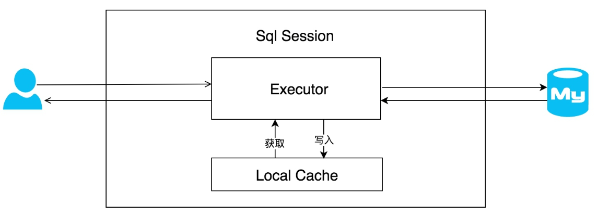

# 1. Mybatis面试题

## 1.1 #{}和${}的区别是什么？

（1）mybatis在处理#{}时，会将sql中的#{}替换为?，调用PreparedStatement的set方法来赋值，会加单引号。

（2）mybatis在处理${}时，会替换成变量的值，不会加引号，一般用于表明、或者字段名

（3）使用#{}可以有效的防止SQL注入，提高系统安全性。原因在于：预编译机制。**预编译完成之后，SQL的结构已经固定，即便用户输入非法参数，也不会对SQL的结构产生影响，从而避免了潜在的安全风险。**

（4）预编译是提前对SQL语句进行预编译，而其后注入的参数将不会再进行SQL编译。我们知道，SQL注入是发生在编译的过程中，因为恶意注入了某些特殊字符，最后被编译成了恶意的执行操作。而预编译机制则可以很好的防止SQL注入。

## 1.2  xml 映射文件中，除了常见的 select、insert、update、delete 标签之外，还有哪些标签？

1. `<foreach>`标签：用于循环处理，可以在SQL语句中使用<foreach>标签来进行循环处理，将集合中的元素映射到SQL语句中的参数位置。
2. `<choose>`标签：用于多条件判断，类似于Java中的switch语句。可以在SQL语句中使用<choose>标签来进行多条件判断，类似于Java中的switch语句，根据不同的条件来生成不同的SQL语句。
3. `<when>`标签和`<otherwise>`标签：用于<choose>标签的条件分支。可以在<choose>标签中使用<when>标签和<otherwise>标签来定义条件分支，根据不同的条件来生成不同的SQL语句。
4. `<if>`标签：用于条件判断，可以根据参数的值来动态生成SQL语句。可以在SQL语句中使用<if>标签来进行条件判断，根据参数的值来动态生成SQL语句，例如动态生成where子句。
5. `<resultMap>`标签：定义结果集映射规则，将查询结果映射到Java对象中。可以在映射文件中定义结果集映射规则，将查询结果中的每一列映射到Java对象的属性中。
6. `<parameterMap>`标签：定义参数映射规则，将传入的参数映射到SQL语句中。可以在映射文件中定义参数映射规则，将传入的Java对象映射到SQL语句中的参数位置。

## 1.3 Dao 接口的工作原理是什么？Dao 接口里的方法，参数不同时，方法能重载吗？

Dao接口的工作原理是**JDK动态代理**，MyBatis运行时会使用JDK动态代理为Dao接口生产代理proxy对象，代理对象会拦截接口方法，转而执行MappedStatement所代表的sql，然后将sql执行结果返回。

在MyBatis中，每一个< select >、< insert >、< update >、< delete >标签，都会被解析成一个MappedStatement对象。

1. 定义Dao接口：我们首先需要定义一个Dao接口，其中包含了数据访问的各种操作方法。
2. 创建映射文件：创建一个与Dao接口同名的XML文件，其中定义了SQL语句的具体实现以及结果映射规则等。
3. 配置映射文件：在MyBatis配置文件中配置Dao接口的映射文件，让MyBatis能够找到Dao接口和对应的映射文件。
4. 获取Dao接口代理对象：通过MyBatis的SqlSession对象获取Dao接口的代理对象，可以使用代理对象调用Dao接口中定义的方法。
5. 调用方法：通过代理对象调用Dao接口中的方法，MyBatis会根据方法名和参数类型等信息，动态生成对应的SQL语句，并执行SQL语句，最终将结果映射到Java对象中返回给调用者。

**Dao 接口里的方法可以重载，但是 Mybatis 的 xml 里面的 ID 不允许重复。**

## 1.4 Mybatis 缓存

Mybatis中有一级缓存和二级缓存，默认情况下一级缓存是开启的，而且是不能关闭的。一级缓存是指 SqlSession 级别的缓存，当在同一个 SqlSession 中进行相同的 SQL 语句查询时，第二次以后的查询不会从数据库查询，而是直接从缓存中获取，一级缓存最多缓存 1024 条 SQL。二级缓存是指可以跨 SqlSession 的缓存。是 mapper 级别的缓存，对于 mapper 级别的缓存不同的 sqlsession 是可以共享的。

>SqlSession是Mybatis工作的最顶层API会话接口，所有的数据库操作都经由它来实现，由于它就是一个会话，即一个SqlSession应该仅存活于一个业务请求中，也可以说一个SqlSession对应这一次数据库会话，它不是永久存活的，每次访问数据库时都需要创建它。




## 1.5 二级缓存


同一个namespace下的所有操作语句，都影响着同一个Cache，即二级缓存被多个SqlSession共享，是一个全局的变量。

数据的查询执行的流程就是 二级缓存 -> 一级缓存 -> 数据库。


```xml
<!-- 在MyBatis的配置文件中开启二级缓存 -->
<setting name="cacheEnabled" value="true"/>


<!-- 并在相应的Mapper.xml文件添加cache标签，表示对哪个mapper 开启缓存： -->
<cache/>
```

## 1.6 Mybatis的工作原理


1. 读取MyBatis配置文件：mybatis-config.xml为MyBatis的全局配置文件，配置了MyBatis的运行环境等信息，例如数据库连接信息。
2. 加载映射文件。映射文件即SQL映射文件，该文件中配置了操作数据库的SQL语句，需要在MyBatis配置文件mybatis-config.xml中加载。mybatis-config.xml文件可以加载多个映射文件，每个文件对应数据库中的一张表。
3. 构造会话工厂：通过MyBatis的环境等配置信息构建会话工厂SqlSessionFactory。
4. 创建会话对象：由会话工厂创建SqlSession对象，该对象中包含了执行SQL语句的所有方法。
5. Executor执行器：MyBatis底层定义了一个Executor 接口来操作数据库，它将根据SqlSession传递的参数动态地生成需要执行的SQL语句，同时负责查询缓存的维护。
6. MappedStatement 对象：在Executor接口的执行方法中有一个MappedStatement类型的参数，该参数是对映射信息的封装，用于存储要映射的SQL语句的id、参数等信息。
7. 输入参数映射：输入参数类型可以是Map、List等集合类型，也可以是基本数据类型和POJO类型。输入参数映射过程类似于 JDBC对preparedStatement对象设置参数的过程。
8. 输出结果映射：输出结果类型可以是Map、List等集合类型，也可以是基本数据类型和POJO类型。输出结果映射过程类似于 JDBC对结果集的解析过程。

## 1.7 Mybatis都有哪些Executor执行器？它们之间的区别是什么？

Mybatis有三种基本的Executor执行器，`SimpleExecutor`、`ReuseExecutor`、`BatchExecutor`。

`SimpleExecutor`：每执行一次update或select，就开启一个Statement对象，用完立刻关闭Statement对象。

`ReuseExecutor`：执行update或select，以sql作为key查找Statement对象，存在就使用，不存在就创建，用完后，不关闭Statement对象，而是放置于Map<String, Statement>内，供下一次使用。简言之，就是重复使用Statement对象。

`BatchExecutor`：执行update（没有select，JDBC批处理不支持select），将所有sql都添加到批处理中（addBatch()），等待统一执行（executeBatch()），它缓存了多个Statement对象，每个Statement对象都是addBatch()完毕后，等待逐一执行executeBatch()批处理。与JDBC批处理相同。

作用范围：Executor的这些特点，都严格限制在SqlSession生命周期范围内。

## 1.8 MyBatis中接口绑定有几种实现方式?

1. 通过注解绑定，在接口的方法上面加上 [@Select](https://www.nowcoder.com/users/6769579)@Update等注解里面包含Sql语句来绑定（SQL语句比较简单的时候，推荐注解绑定）
2. 通过xml里面写SQL来绑定, 指定xml映射文件里面的namespace必须为接口的全路径名（SQL语句比较复杂的时候，推荐xml绑定）

## 1.9 Mybatis 是如何进行分页的？

Mybatis 使用 RowBounds 对象进行分页，它是针对 ResultSet 结果集执行的内存分页，而非物理分页，先把数据都查出来，然后再做分页。

可以在 sql 内直接书写带有物理分页的参数来完成物理分页功能，也可以使用分页插件来完成物理分页。

##  1.10 分页插件的基本原理是什么？

分页插件的基本原理是使用 Mybatis 提供的插件接口，实现自定义插件，在插件的拦截方法内拦截待执行的 sql，然后重写 sql（SQL 拼接 limit），根据 dialect 方言，添加对应的物理分页语句和物理分页参数，用到了技术 JDK 动态代理，用到了责任链设计模式。

## 1.11 Mybatis的预编译

数据库接受到sql语句之后，需要词法和语义解析，优化sql语句，制定执行计划。这需要花费一些时间。如果一条sql语句需要反复执行，每次都进行语法检查和优化，会浪费很多时间。预编译语句就是将sql语句中的`值用占位符替代`，即将`sql语句模板化`。一次编译、多次运行，省去了解析优化等过程。

mybatis是通过`PreparedStatement`和占位符来实现预编译的。

mybatis底层使用`PreparedStatement`，默认情况下，将对所有的 sql 进行预编译，将#{}替换为?，然后将带有占位符?的sql模板发送至mysql服务器，由服务器对此无参数的sql进行编译后，将编译结果缓存，然后直接执行带有真实参数的sql。

> 注意：${}没有预编译处理

### 1.12 MyBatis 是如何将 sql 执行结果封装为目标对象并返回的？都有哪些映射形式？

第一种是**使用 `<resultMap>` 标签**，逐一定义列名和对象属性名之间的映射关系。第二种是使用 sql **列的别名功能**，将列别名书写为对象属性名，比如 T_NAME AS NAME，对象属性名一般是 name，小写，但是列名不区分大小写，MyBatis 会忽略列名大小写，智能找到与之对应对象属性名，你甚至可以写成 T_NAME AS NaMe，MyBatis 一样可以正常工作。