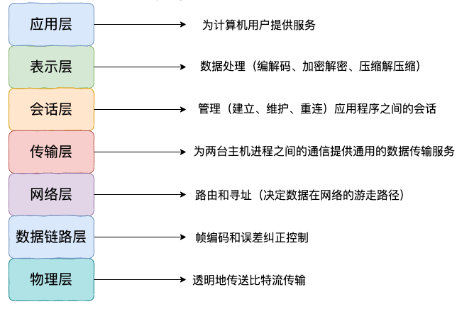
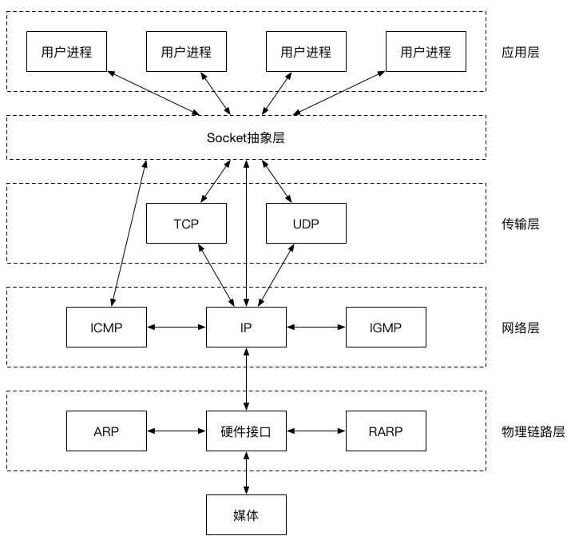

# 1. OSI七层模型



# 2. TCP/IP 四层模型

 

1. 网络接口层（Network Interface Layer）：网络接口层负责将数据从数据链路层传输到物理层，同时处理数据在传输媒介（如以太网或无线电波）上的传输和接收。
2. 网际层（Internet Layer）：网际层提供了网络的核心功能，它负责将数据从源地址传输到目标地址。网际层使用IP协议确定数据的路由路径，并处理分组转发和路由选择。
3. 传输层（Transport Layer）：传输层提供了端到端的通信服务，负责将数据从一个进程传递到另一个进程。它使用TCP协议提供可靠的传输和流量控制服务，或使用UDP协议提供无连接的传输服务。
4. 应用层（Application Layer）：应用层是最高层，它为用户提供网络服务，并处理应用程序之间的通信。例如，HTTP协议、FTP协议、SMTP协议和DNS协议都是应用层协议。

**应用层协议** :

- HTTP 协议（超文本传输协议，网页浏览常用的协议）
- DHCP 协议（动态主机配置）
- DNS 系统原理（域名系统）
- FTP 协议（文件传输协议）
- Telnet协议（远程登陆协议）
- 电子邮件协议等（SMTP、POP3、IMAP）
- ......

**传输层协议** :

- TCP 协议 
  - 报文段结构
  - 可靠数据传输
  - 流量控制
  - 拥塞控制
- UDP 协议 
  - 报文段结构
  - RDT（可靠数据传输协议）

**网络层协议** :

- IP 协议（TCP/IP 协议的基础，分为 IPv4 和 IPv6）
- ARP 协议（地址解析协议，用于解析 IP 地址和 MAC 地址之间的映射）
- ICMP 协议（控制报文协议，用于发送控制消息）
- NAT 协议（网络地址转换协议）
- RIP 协议、OSPF 协议、BGP 协议（路由选择协议）
- ......

**网络接口层** :

- 差错检测技术
- 多路访问协议（信道复用技术）
- CSMA/CD 协议
- MAC 协议
- 以太网技术

# 3. 网络分层的原因

**各层之间相互独立**：各层之间相互独立，各层之间不需要关心其他层是如何实现的，只需要知道自己如何调用下层提供好的功能就可以了（可以简单理解为接口调用）**。这个和我们对开发时系统进行分层是一个道理。**

**提高了整体灵活性** ：每一层都可以使用最适合的技术来实现，你只需要保证你提供的功能以及暴露的接口的规则没有改变就行了。**这个和我们平时开发系统的时候要求的高内聚、低耦合的原则也是可以对应上的。**

**大问题化小** ： 分层可以将复杂的网络问题分解为许多比较小的、界线比较清晰简单的小问题来处理和解决。这样使得复杂的计算机网络系统变得易于设计，实现和标准化。 **这个和我们平时开发的时候，一般会将系统功能分解，然后将复杂的问题分解为容易理解的更小的问题是相对应的，这些较小的问题具有更好的边界（目标和接口）定义。

# 4. 应用层常见协议总结

## 4.1 HTTP:超文本传输协议

**超文本传输协议（HTTP，HyperText Transfer Protocol)** 主要是为 Web 浏览器与 Web 服务器之间的通信而设计的。当我们使用浏览器浏览网页的时候，我们网页就是通过 HTTP 请求进行加载的，整个过程如下图所示。


HTTP 协是基于 TCP协议，发送 HTTP 请求之前首先要建立 TCP 连接也就是要经历 3 次握手。目前使用的 HTTP 协议大部分都是 1.1。在 1.1 的协议里面，默认是开启了 Keep-Alive 的，这样的话建立的连接就可以在多次请求中被复用了。

另外， HTTP 协议是”**无状态**”的协议，它无法记录客户端用户的状态，一般我们都是通过 Session 来记录客户端用户的状态。

## 4.2 SMTP:简单邮件传输(发送)协议

**简单邮件传输(发送)协议（SMTP，Simple Mail Transfer Protocol）** 基于 TCP 协议，用来发送电子邮件。


**接受邮件的协议不是 SMTP 而是 POP3 协议。**

### 4.2.1 电子邮件的发送过程？

比如我的邮箱是“dabai@cszhinan.com”，我要向“xiaoma@qq.com”发送邮件，整个过程可以简单分为下面几步：

1. 通过 **SMTP** 协议，我将我写好的邮件交给163邮箱服务器（邮局）。
2. 163邮箱服务器发现我发送的邮箱是qq邮箱，然后它使用 SMTP协议将我的邮件转发到 qq邮箱服务器。
3. qq邮箱服务器接收邮件之后就通知邮箱为“xiaoma@qq.com”的用户来收邮件，然后用户就通过 **POP3/IMAP** 协议将邮件取出。

### 4.2.2 如何判断邮箱是真正存在的？

很多场景(比如邮件营销)下面我们需要判断我们要发送的邮箱地址是否真的存在，这个时候我们可以利用 SMTP 协议来检测：

1. 查找邮箱域名对应的 SMTP 服务器地址
2. 尝试与服务器建立连接
3. 连接成功后尝试向需要验证的邮箱发送邮件
4. 根据返回结果判定邮箱地址的真实性

## 4.3 POP3/IMAP:邮件接收的协议

这两个协议没必要多做阐述，只需要了解 **POP3 和 IMAP 两者都是负责邮件接收的协议**即可。另外，需要注意不要将这两者和 SMTP 协议搞混淆了。**SMTP 协议只负责邮件的发送，真正负责接收的协议是POP3/IMAP。**

IMAP 协议相比于POP3更新一点，为用户提供的可选功能也更多一点,几乎所有现代电子邮件客户端和服务器都支持IMAP。大部分网络邮件服务提供商都支持POP3和IMAP。

## 4.4 FTP:文件传输协议

**FTP 协议** 主要提供文件传输服务，基于 TCP 实现可靠的传输。使用 FTP 传输文件的好处是可以屏蔽操作系统和文件存储方式。

FTP 是基于客户—服务器（C/S）模型而设计的，在客户端与 FTP 服务器之间建立两个连接：

1. 控制连接：用于传送控制信息（命令和响应）
2. 数据连接：用于数据传送；

这种将命令和数据分开传送的思想大大提高了 FTP 的效率。


## 4.5 Telnet:远程登陆协议

**Telnet 协议** 通过一个终端登陆到其他服务器，建立在可靠的传输协议 TCP 之上。Telnet 协议的最大缺点之一是所有数据（包括用户名和密码）均以明文形式发送，这有潜在的安全风险。这就是为什么如今很少使用Telnet并被一种称为SSH的非常安全的协议所取代的主要原因。

## 4.6 SSH:安全的网络传输协议

**SSH（ Secure Shell）** 是目前较可靠，专**为远程登录会话和其他网络服务提供安全性的协议**。利用 SSH 协议可以有效防止远程管理过程中的信息泄露问题。SSH 建立在可靠的传输协议 TCP 之上。

**Telnet 和 SSH 之间的主要区别在于 SSH 协议会对传输的数据进行加密保证数据安全性。**


# 5. TCP 与 UDP 的区别

1. **是否面向连接** ：UDP 在传送数据之前不需要先建立连接。而 TCP 提供面向连接的服务，在传送数据之前必须先建立连接，数据传送结束后要释放连接。
2. **是否是可靠传输**：远地主机在收到 UDP 报文后，不需要给出任何确认，并且不保证数据不丢失，不保证是否顺序到达。TCP 提供可靠的传输服务，TCP 在传递数据之前，会有三次握手来建立连接，而且在数据传递时，有确认、窗口、重传、拥塞控制机制。通过 TCP 连接传输的数据，无差错、不丢失、不重复、并且按序到达。
3. **是否有状态** ：这个和上面的“是否可靠传输”相对应。TCP 传输是有状态的，这个有状态说的是 TCP 会去记录自己发送消息的状态比如消息是否发送了、是否被接收了等等。为此 ，TCP 需要维持复杂的连接状态表。而 UDP 是无状态服务，简单来说就是不管发出去之后的事情了。
4. **传输效率** ：由于使用 TCP 进行传输的时候多了连接、确认、重传等机制，所以 TCP 的传输效率要比 UDP 低很多。
5. **传输形式** ： TCP 是面向字节流的，UDP 是面向报文的。
6. **首部开销** ：TCP 首部开销（20 ～ 60 字节）比 UDP 首部开销（8 字节）要大。
7. **是否提供广播或多播服务** ：TCP 只支持点对点通信，UDP 支持一对一、一对多、多对一、多对多；

|                        | TCP            | UDP        |
| ---------------------- | -------------- | ---------- |
| 是否面向连接           | 是             | 否         |
| 是否可靠               | 是             | 否         |
| 是否有状态             | 是             | 否         |
| 传输效率               | 较慢           | 较快       |
| 传输形式               | 字节流         | 数据报文段 |
| 首部开销               | 20 ～ 60 bytes | 8 bytes    |
| 是否提供广播或多播服务 | 否             | 是         |

# 6. 什么时候选择 TCP，什么时候选 UDP?

- **UDP 一般用于即时通信**，比如： 语音、 视频 、直播等等。这些场景对传输数据的准确性要求不是特别高，比如你看视频即使少个一两帧，实际给人的感觉区别也不大。
- **TCP 用于对传输准确性要求特别高的场景**，比如文件传输、发送和接收邮件、远程登录等等。

# 7. HTTP 基于 TCP 还是 UDP？

HTTP 3.0 之前是基于 TCP 协议的，而 HTTP3.0 将弃用 TCP，改用 **基于 UDP 的 QUIC 协议** 。此变化主要为了解决 HTTP/2 中存在的队头阻塞问题。由于 HTTP/2 在单个 TCP 连接上使用了多路复用，受到 TCP 拥塞控制的影响，少量的丢包就可能导致整个 TCP 连接上的所有流被阻塞。

# 8. 使用 TCP 的协议有哪些?使用 UDP 的协议有哪些?

**运行于 TCP 协议之上的协议** ：

1. **HTTP 协议** ：超文本传输协议（HTTP，HyperText Transfer Protocol)主要是为 Web 浏览器与 Web 服务器之间的通信而设计的。当我们使用浏览器浏览网页的时候，我们网页就是通过 HTTP 请求进行加载的。
2. **HTTPS 协议** ：更安全的超文本传输协议(HTTPS,Hypertext Transfer Protocol Secure)，身披 SSL 外衣的 HTTP 协议
3. **FTP 协议**：文件传输协议 FTP（File Transfer Protocol），提供文件传输服务，**基于 TCP** 实现可靠的传输。使用 FTP 传输文件的好处是可以屏蔽操作系统和文件存储方式。
4. **SMTP 协议**：简单邮件传输协议（SMTP，Simple Mail Transfer Protocol）的缩写，**基于 TCP 协议**，用来发送电子邮件。注意 ⚠️：接受邮件的协议不是 SMTP 而是 POP3 协议。
5. **POP3/IMAP 协议**： POP3 和 IMAP 两者都是负责邮件接收的协议。
6. **Telnet 协议**：远程登陆协议，通过一个终端登陆到其他服务器。被一种称为 SSH 的非常安全的协议所取代。
7. **SSH 协议** : SSH（ Secure Shell）是目前较可靠，专为远程登录会话和其他网络服务提供安全性的协议。利用 SSH 协议可以有效防止远程管理过程中的信息泄露问题。SSH 建立在可靠的传输协议 TCP 之上。

**运行于 UDP 协议之上的协议** ：

1. **DHCP 协议**：动态主机配置协议，动态配置 IP 地址
2. **DNS** ： **域名系统（DNS，Domain Name System）将人类可读的域名 (例如，www.baidu.com) 转换为机器可读的 IP 地址 (例如，220.181.38.148)。** 我们可以将其理解为专为互联网设计的电话薄。实际上 DNS 同时支持 UDP 和 TCP 协议。

# 9. TCP 三次握手和四次挥手

## 9.1 建立连接-TCP 三次握手

建立一个 TCP 连接需要“三次握手”，缺一不可 ：

- **一次握手**:客户端发送带有 SYN（SEQ=x） 标志的数据包 -> 服务端，然后客户端进入 **SYN_SEND** 状态，等待服务器的确认；
- **二次握手**:服务端发送带有 SYN+ACK(SEQ=y,ACK=x+1) 标志的数据包 –> 客户端,然后服务端进入 **SYN_RECV** 状态
- **三次握手**:客户端发送带有 ACK(ACK=y+1) 标志的数据包 –> 服务端，然后客户端和服务器端都进入**ESTABLISHED** 状态，完成TCP三次握手。 

## 9.2 为什么要三次握手?

三次握手的目的是**建立可靠的通信信道**，说到通讯，简单来说就是数据的发送与接收，而三次握手最主要的目的就是双方确认自己与对方的发送与接收是正常的。

三次握手的目的是建立可靠的通信信道，说到通讯，简单来说就是数据的发送与接收，而三次握手最主要的目的就是双方确认自己与对方的发送与接收是正常的。

1. **第一次握手** ：Client 什么都不能确认；Server 确认了对方发送正常，自己接收正常
2. **第二次握手** ：Client 确认了：自己发送、接收正常，对方发送、接收正常；Server 确认了：对方发送正常，自己接收正常
3. **第三次握手** ：Client 确认了：自己发送、接收正常，对方发送、接收正常；Server 确认了：自己发送、接收正常，对方发送、接收正常

## 9.3 第2次握手传回了ACK，为什么还要传回SYN？

服务端传回发送端所发送的 ACK 是为了告诉客户端：“我接收到的信息确实就是你所发送的信号了”，这表明从客户端到服务端的通信是正常的。回传 SYN 则是为了**建立并确认从服务端到客户端的通信**。

> SYN 同步序列编号(Synchronize Sequence Numbers) 是 TCP/IP 建立连接时使用的握手信号。在客户机和服务器之间建立正常的 TCP 网络连接时，客户机首先发出一个 SYN 消息，服务器使用 SYN-ACK 应答表示接收到了这个消息，最后客户机再以 ACK(Acknowledgement）消息响应。这样在客户机和服务器之间才能建立起可靠的 TCP 连接，数据才可以在客户机和服务器之间传递。

## 9.4 断开连接-TCP 四次挥手


断开一个 TCP 连接则需要“四次挥手”，缺一不可 ：

1. **第一次挥手** ：客户端发送一个 FIN（SEQ=X） 标志的数据包->服务端，用来关闭客户端到服务器的数据传送。然后，客户端进入 **FIN-WAIT-1** 状态。

2. **第二次挥手** ：服务器收到这个 FIN（SEQ=X） 标志的数据包，它发送一个 ACK （SEQ=X+1）标志的数据包->客户端 。然后，此时服务端进入**CLOSE-WAIT**状态，客户端进入**FIN-WAIT-2**状态,但是仍然可以接收客户端的数据。

3. **第三次挥手** ：等双方收发数据都完成之后，服务端关闭与客户端的连接并发送一个 FIN (SEQ=y)标志的数据包->客户端请求关闭连接，然后，服务端进入**LAST-ACK**状态。

4. **第四次挥手** ：客户端发送 ACK (SEQ=y+1)标志的数据包->服务端并且进入**TIME-WAIT**状态，服务端在收到 ACK (SEQ=y+1)标志的数据包后进入 CLOSE 状态。此时，如果客户端等待 **2MSL** 后依然没有收到回复，就证明服务端已正常关闭，随后，客户端也可以关闭连接了。

   >2MSL是指两倍的报文段最长寿命  （Maximum Segment Lifetime）1

## 9.5 为什么要四次挥手？

**TCP是全双工通信，可以双向传输数据**。任何一方都可以在数据传送结束后发出连接释放的通知，待对方确认后进入半关闭状态。当另一方也没有数据再发送的时候，则发出连接释放通知，对方确认后就完全关闭了 TCP 连接。

举个例子：A 和 B 打电话，通话即将结束后。

1. **第一次挥手** ： A 说“我没啥要说的了”
2. **第二次挥手** ：B 回答“我知道了”，但是 B 可能还会有要说的话，A 不能要求 B 跟着自己的节奏结束通话
3. **第三次挥手** ：于是 B 可能又巴拉巴拉说了一通，最后 B 说“我说完了”
4. **第四次挥手** ：A 回答“知道了”，这样通话才算结束。

## 9.6 为什么不能把服务器发送的 ACK 和 FIN 合并起来，变成三次挥手？

因为服务器收到客户端断开连接的请求时，可能还有一些数据没有发完，这时先回复 ACK，表示接收到了断开连接的请求。等到数据发完之后再发 FIN，断开服务器到客户端的数据传送。

## 9.7 如果第二次挥手时服务器的 ACK 没有送达客户端，会怎样？

客户端没有收到 ACK 确认，会重新发送 FIN 请求。

## 9.8 为什么第四次挥手客户端需要等待 2*MSL（报文段最长寿命）时间后才进入 CLOSED 状态？

第四次挥手时，客户端发送给服务器的 ACK 有可能丢失，如果服务端因为某些原因而没有收到 ACK 的话，服务端就会重发 FIN，如果客户端在 2*MSL 的时间内收到了 FIN，就会重新发送 ACK 并再次等待 2MSL，防止 Server 没有收到 ACK 而不断重发 FIN。

> **MSL(Maximum Segment Lifetime)** : 一个片段在网络中最大的存活时间，2MSL 就是一个发送和一个回复所需的最大时间。如果直到 2MSL，Client 都没有再次收到 FIN，那么 Client 推断 ACK 已经被成功接收，则结束 TCP 连接。

# 10. 从输入URL 到页面展示到底发生了什么？


1. DNS解析：浏览器首先会尝试从本地DNS缓存中查找域名对应的IP地址。如果找不到，浏览器会向本地DNS服务器发送请求，获取对应的IP地址。如果本地DNS服务器也没有记录该域名对应的IP地址，则会向根域名服务器发起请求，根据域名的层级结构依次向下查找，直到找到对应的IP地址。

   

2. TCP连接：[三次握手](#9.1 建立连接-TCP 三次握手)讲出来。

3. 发送HTTP请求：TCP连接建立成功后，**浏览器会向服务器发送HTTP请求**。HTTP请求中包含了要访问的资源的信息，例如URL、请求方法、请求头等。

4. 服务器处理请求并响应：服务器接收到HTTP请求后，会根据请求中的信息，对请求进行处理，并**生成一个HTTP响应**。HTTP响应中包含了要返回的资源的内容，例如HTML文件、图片、脚本等。同时，HTTP响应中还包含了状态码、响应头等信息。

5. 浏览器解析响应内容：浏览器接收到服务器返回的HTTP响应后，会解析响应内容。如果响应中包含了HTML文件，浏览器会根据HTML文档中的标记，解析出网页的结构和内容。同时，浏览器还会根据CSS和JavaScript等资源，对网页进行渲染和交互处理。

6. 页面渲染：浏览器根据HTML文件和相关资源，对页面进行渲染，将页面展示出来。

# 11. HTTP 状态码有哪些？

## 11.0 1xx Informational（信息性状态码）

- **101 Switching Protocols**：协议切换

> 建立WebSocket连接成功时返回101状态码

## 11.1 2xx Success（成功状态码）

- **200 OK** ：请求被成功处理。比如我们发送一个查询用户数据的HTTP 请求到服务端，服务端正确返回了用户数据。这个是我们平时最常见的一个 HTTP 状态码。
- **201 Created** ：请求被成功处理并且在服务端创建了一个新的资源。比如我们通过 POST 请求创建一个新的用户。
- **202 Accepted** ：服务端已经接收到了请求，但是还未处理。
- **204 No Content** ： 服务端已经成功处理了请求，但是没有返回任何内容

## 11.2 3xx Redirection（重定向状态码）

- **301 Moved Permanently** ： 资源被永久重定向了。比如你的网站的网址更换了。
- **302 Found** ：资源被临时重定向了。比如你的网站的某些资源被暂时转移到另外一个网址。

## 11.3 4xx Client Error（客户端错误状态码）

- **400 Bad Request** ： 发送的HTTP请求存在问题。比如请求参数不合法、请求方法错误。

  > 实际开发中遇到的：
  >
  > - 请求参数错误，比如格式、数据类型等

- **401 Unauthorized** ： 未认证却请求需要认证之后才能访问的资源。

- **403 Forbidden** ：直接拒绝HTTP请求，不处理。一般用来针对非法请求，**一般是权限问题**。

  > 实际开发中遇到的：
  >
  > - 使用nginx反向代理访问服务上的文件，如果服务器上的文件或目录权限设置不正确，就会出现403错误。

- **404 Not Found** ： 你请求的资源未在服务端找到。

  > 实际开发中遇到的：
  >
  > - 接口名称拼写错误
  > - 前端访问某些资源文件不存在或没找到

- **409 Conflict** ： 表示请求的资源与服务端当前的状态存在冲突，请求无法被处理。

## 11.4 5xx Server Error（服务端错误状态码）

- **500 Internal Server Error** ：表示服务器内部错误，表示服务器遇到了无法处理的异常情况。

  > - 服务器程序错误：服务器上的Web应用程序可能存在代码错误，导致服务器无法正常处理请求。比如空指针异常没有被处理。
  > - 数据库错误：如果服务器上的Web应用程序使用了数据库，数据库可能存在异常，导致服务器无法正常处理请求。

- **502 Bad Gateway** ： 产生错误的原因是连接超时，我们向服务器发送请求，由于服务器当前链接太多或网络不流畅，导致服务器方面无法给于正常的响应，产生此类报错。

  > nginx做代理时需要访问上有服务器，但是上游服务器没有给出响应（疾控项目经常遇到）


# 12. HTTP 和 HTTPS 有什么区别？（重要）

- **端口号** ：HTTP 默认是 80，HTTPS 默认是 443。
- **URL 前缀** ：HTTP 的 URL 前缀是 `http://`，HTTPS 的 URL 前缀是 `https://`。
- **安全性和资源消耗** ： HTTP 协议运行在 TCP 之上，所有传输的内容都是明文，客户端和服务器端都无法验证对方的身份。HTTPS 是运行在 SSL/TLS 之上的 HTTP 协议，SSL/TLS 运行在 TCP 之上。所有传输的内容都经过加密，加密采用**对称加密**，但对称加密的密钥用服务器方的证书进行了**非对称加密**。所以说，HTTP 安全性没有 HTTPS 高，但是 HTTPS 比 HTTP 耗费更多服务器资源。

# 13. SSL/TLS 的工作原理

**SSL 和 TLS 没有太大的区别。**TLS 是基于 SSL 之上的，但由于习惯叫法，通常把 HTTPS 中的核心加密协议混称为 SSL/TLS。

SSL（安全套接层）和TLS（传输层安全）是用于保护客户端和服务器之间通信的加密协议，主要包括以下步骤：

1. 握手阶段：在此阶段，客户端和服务器之间进行协议版本的确认、加密方式的协商以及数字证书的验证等操作。具体过程如下：
   1. 客户端发送一个“客户端请求”到服务器，请求与服务器建立安全连接，并向服务器发送自己所支持的SSL/TLS版本以及加密算法等信息。
   2. 服务器向客户端发送一个“服务器回应”，包含所选定的SSL/TLS版本、加密算法、**数字证书**以及其他一些服务器信息等。
   3. 客户端接收到服务器回应后，使用数字证书中的公钥校验数字证书的合法性，如果通过校验，生成随机数，用公钥加密后发送给服务器，作为后续通信中的**会话密钥**。
   4. 服务器收到客户端的加密随机数后，使用私钥解密获取到该随机数，并使用该随机数生成对称加密的会话密钥，同时发送加密的握手完成通知。
   5. 客户端和服务器双方都使用会话密钥进行加密通信。
2. 数据传输阶段：在握手完成之后，客户端和服务器之间进行数据传输，客户端和服务器将使用会话密钥加密和解密数据。

SSL/TLS协议使用**公钥加密算法和对称加密算法**保证通信安全，其中公钥加密算法用于数字证书的验证和会话密钥的传输，对称加密算法用于数据的传输和加密。在握手阶段，服务器发送的**数字证书中包含了服务器的公钥**，客户端利用该公钥对加密随机数进行加密，以确保会话密钥只能由服务器解密获取。客户端和服务器使用会话密钥进行对称加密通信，以确保数据传输过程中数据的保密性和完整性。

# 14. HTTP 1.0 和 HTTP 1.1 有什么区别？

- **连接方式** : HTTP 1.0 为短连接，HTTP 1.1 支持长连接。
- **状态响应码** : HTTP/1.1中新加入了大量的状态码，光是错误响应状态码就新增了24种。比如说，`100 (Continue)`——在请求大资源前的预热请求，`206 (Partial Content)`——范围请求的标识码，`409 (Conflict)`——请求与当前资源的规定冲突，`410 (Gone)`——资源已被永久转移，而且没有任何已知的转发地址。
- **缓存处理** : 在 HTTP1.0 中主要使用 header 里的 If-Modified-Since,Expires 来做为缓存判断的标准，HTTP1.1 则引入了更多的缓存控制策略例如 Entity tag，If-Unmodified-Since, If-Match, If-None-Match 等更多可供选择的缓存头来控制缓存策略。
- **带宽优化及网络连接的使用** :HTTP1.0 中，存在一些浪费带宽的现象，例如客户端只是需要某个对象的一部分，而服务器却将整个对象送过来了，并且不支持断点续传功能，HTTP1.1 则在请求头引入了 range 头域，它允许只请求资源的某个部分，即返回码是 206（Partial Content），这样就方便了开发者自由的选择以便于充分利用带宽和连接。
- **Host头处理** : HTTP/1.1在请求头中加入了`Host`字段。

# 15. Socket、WebSocket

## 15.1 什么是Socket？

Socket（套接字）其实挺抽象的，说的通俗一点就是计算机网络中用于实现进程之间通信的一种机制，在通信两端分别建立一个Socket，通过Socket操作来实现进程之间的通信。在传输中协议中，Socket通常指的是传输层协议（如TCP或UDP）提供的编程接口，其中定义了网络编程中Socket操作，用于网络运用程序的开发。

就像打电话需要电话机一样，计算机网络中进程间通信需要创建Socket来进行通信。

另外，Socket处于抽象层（应用层与传输层之间）



## 15.2 Socket原理（过程）

### 15.2.1 基于TCP


```java
// 服务器端
ServerSocket serverSocket = new ServerSocket(8888);
Socket socket = serverSocket.accept();

// 客户端
Socket clientSocket = new Socket("localhost", 8888);

```

在服务器端，首先创建一个 ServerSocket，并绑定到指定的端口号上。然后调用 accept() 方法，等待客户端的连接请求（进入阻塞状态）。在客户端，首先创建一个 Socket，并指定服务器端的 IP 地址和端口号。

建立连接后，可以通过 Socket 进行数据的传输，例如发送一个字符串：

```java
// 客户端发送字符串
OutputStream outputStream = clientSocket.getOutputStream();
outputStream.write("hello world".getBytes());

// 服务器端接收字符串
InputStream inputStream = socket.getInputStream();
byte[] buffer = new byte[1024];
inputStream.read(buffer);
System.out.println(new String(buffer));
```

在客户端，首先获取 Socket 的输出流，并将字符串转换为字节数组写入到输出流中。在服务器端，首先获取 Socket 的输入流，并使用 read() 方法从输入流中读取数据。最后将读取到的字节数组转换为字符串，并输出到控制台上。

需要注意的是，在数据传输完成后，需要关闭 Socket，以释放系统资源：

```java
socket.close();
```

### 15.2.2 基于UDP

Socket 面向 UDP 的原理与 TCP 有所不同。UDP 是一种无连接的、不可靠的传输协议，因此 Socket 在面向 UDP 时需要进行以下操作：

1. 创建 UDP Socket：通过调用 `DatagramSocket` 类的构造方法创建一个 UDP Socket，指定一个本地端口号和远程主机的 IP 地址和端口号。
2. 发送数据：通过创建一个 `DatagramPacket` 对象，将要发送的数据放入其中，指定远程主机的 IP 地址和端口号，然后调用 `send()` 方法发送数据。
3. 接收数据：创建一个空的 `DatagramPacket` 对象，调用 `receive()` 方法接收数据，如果有数据包到达，数据包中的数据就会被存入 `DatagramPacket` 对象中。

需要注意的是，UDP 是一种不可靠的协议，发送的数据包可能会在传输过程中丢失、重复、乱序，因此在编写 UDP Socket 程序时，需要对数据的可靠性进行处理，例如使用序列号、校验和等方式进行检测和修复数据包。

UDP服务器端代码：

```java
import java.net.*;
public class UDPServer {
    public static void main(String[] args) {
        DatagramSocket socket = null;
        try {
            socket = new DatagramSocket(8000); // 创建一个UDP Socket并绑定到8000端口
            byte[] buffer = new byte[1024];
            DatagramPacket packet = new DatagramPacket(buffer, buffer.length);
            while (true) {
                socket.receive(packet); // 接收客户端发送的数据
                 // 将接收到的数据转换为字符串
                String data = new String(packet.getData(), 0, packet.getLength());
                InetAddress address = packet.getAddress(); // 获取客户端的IP地址
                int port = packet.getPort(); // 获取客户端的端口号
                System.out.println("Received data from " + address + ":" + port + " : " + data);
                byte[] sendData = ("Hello, " + data).getBytes(); // 回复客户端消息
                DatagramPacket sendPacket = new DatagramPacket(sendData, sendData.length, address, port);
                socket.send(sendPacket);
            }
        } catch (Exception e) {
            e.printStackTrace();
        } finally {
            if (socket != null) {
                socket.close();
            }
        }
    }
}
```

UDP客户端代码：

```java
import java.net.*;
public class UDPClient {
    public static void main(String[] args) {
        DatagramSocket socket = null;
        try {
            socket = new DatagramSocket(); // 创建一个UDP Socket
            String data = "world";
            byte[] buffer = data.getBytes();
            InetAddress address = InetAddress.getByName("localhost"); // 目标服务器的IP地址
            int port = 8000; // 目标服务器的端口号
            DatagramPacket packet = new DatagramPacket(buffer, buffer.length, address, port);
            socket.send(packet); // 发送数据到服务器
            byte[] receiveData = new byte[1024];
            DatagramPacket receivePacket = new DatagramPacket(receiveData, receiveData.length);
            socket.receive(receivePacket); // 接收服务器的回复

            String receiveMsg = new String(receivePacket.getData(), 0, receivePacket.getLength());
            System.out.println("Received message: " + receiveMsg);
        } catch (Exception e) {
            e.printStackTrace();
        } finally {
            if (socket != null) {
                socket.close();
            }
        }
    }
}
```

## 15.3 什么是WebSocket？

WebSocket 是基于 TCP 的一种新的应用层网络协议，可以认为它是http协议的升级版。它实现了浏览器与服务器**全双工通信**，即允许服务器主动发送信息给客户端。因此，在 WebSocket 中，**浏览器和服务器只需要完成一次握手**（TCP三次握手），两者之间就直接可以创建**持久性的连接**，并进行**双向数据传输**，客户端和服务器之间的数据交换变得更加简单。

## 15.4 WebSocket有什么特点

WebSocket 是一种在客户端和服务器之间实现双向通信的网络协议，相比传统的 HTTP 协议，它有以下几个特点：

1. 双向通信：WebSocket 协议能够实现双向通信，客户端和服务器可以在任何时候向对方发送消息，无需像 HTTP 协议一样等待请求和响应。
2. 实时性：WebSocket 协议的消息传输是实时的，可以快速地将消息传递给客户端和服务器。
3. 减少网络流量：WebSocket 协议通过在客户端和服务器之间建立持久连接来减少网络流量和延迟。相比 HTTP 协议每次请求都需要建立连接和断开连接，WebSocket 只需要在建立连接时进行一次握手，之后就可以一直保持连接。
4. 跨平台支持：WebSocket 协议可以在多种平台和浏览器上运行，包括 PC、手机、平板等。
5. 支持二进制数据传输：WebSocket 协议不仅支持文本数据传输，还支持二进制数据传输，可以更高效地传输多媒体等数据。

## 15.5 WebSocket 原理

### 15.5.1 建立过程

下面是 WebSocket 建立连接的过程：

1. 客户端向服务器发送一个 HTTP 请求，**经过3次握手后，建立起TCP连接**，Http请求告诉服务器要升级协议和建立长连接，请求头包含以下信息：

   > - Connection: Upgrade
   > - Upgrade: websocket
   > - Sec-WebSocket-Version: 13
   > - Sec-WebSocket-Key: (随机生成的一段字符串)

2. 服务器收到请求后，如果支持WebSocket协议，就会返回类似如下的响应：

   ```html
   HTTP/1.1 101 Switching Protocols
   Upgrade: websocket
   Connection: Upgrade
   Sec-WebSocket-Accept: s3pPLMBiTxaQ9kYGzzhZRbK+xOo=
   ```

   其中，HTTP状态码为101，表示协议转换成功。响应头中包含Upgrade和Connection字段，指示协议升级和连接转换为WebSocket协议。最后，Sec-WebSocket-Accept字段是服务器通过对客户端请求头中的Sec-WebSocket-Key字段进行一些计算得到的，用于验证客户端请求的合法性。

3. 客户端收到服务器的响应后，如果状态码为101，则 WebSocket 连接建立成功。

4. 建立连接后，客户端和服务器就可以互相发送消息了。

### 15.5.2 数据传输

客户端发送的消息需要进行数据帧封装，服务器接收到消息后也需要进行数据帧解析。

WebSocket 帧由以下部分组成：

1. FIN（1 位）：表示这是帧的最后一个分片。值为 1 表示这是消息的最后一帧，为 0 则不是；
2. RSV1，RSV2，RSV3（各 1 位）：用于扩展协议。非零值表示采用 WebSocket 扩展；
3. Opcode（4 位）：操作码，用于指定数据帧类型，如文本或二进制等。
4. Mask（1 位）：指示该帧是否使用掩码来加密负载数据。
5. Payload length（7 位或 7+16 位或 7+64 位）：负载数据的长度，可以是 7 位、7 位加 16 位或 7 位加 64 位。
6. Masking key（0 或 4 位）：如果使用了掩码，则需要提供一个 4 字节的掩码键值，否则没有此字段。
7. Payload data（0 或 n 位）：数据负载。

### 15.5.3 维持链接

1. 心跳机制

   心跳机制是指客户端和服务器之间定期发送数据包以保持连接的状态。在WebSocket中，客户端可以向服务器发送一个包含无意义的数据，如一个空的字符串或数字，以确保连接保持活动状态。通常情况下，客户端会在一段时间内向服务器发送一次心跳包，如果服务器在规定时间内没有收到来自客户端的心跳包，则认为连接已断开。

2. Ping/Pong机制

   Ping/Pong机制是指WebSocket客户端向服务器发送ping帧，服务器收到ping帧后返回一个pong帧。客户端收到pong帧后，就知道服务器还是处于连接状态。Ping/Pong机制与心跳机制的不同之处在于，**ping帧是WebSocket协议中专门用于保持连接状态的帧，而心跳机制可以使用任意数据来实现。**

## 15.6 WebSocket的使用

```xml
<dependencies>
    <!-- Spring Boot Websocket Starter -->
    <dependency>
        <groupId>org.springframework.boot</groupId>
        <artifactId>spring-boot-starter-websocket</artifactId>
    </dependency>
</dependencies>
```

```java
@Component
@ServerEndpoint("/chat/{username}")
public class WebSocketServer {

    private static final Set<Session> sessions = Collections.synchronizedSet(new HashSet<>());

    @OnOpen
    public void onOpen(Session session, @PathParam("username") String username) throws IOException {
        session.getUserProperties().put("username", username);
        sessions.add(session);
        String message = "User " + username + " has joined the chat";
        broadcast(message);
    }

    @OnClose
    public void onClose(Session session) throws IOException {
        String username = (String) session.getUserProperties().get("username");
        sessions.remove(session);
        String message = "User " + username + " has left the chat";
        broadcast(message);
    }

    @OnError
    public void onError(Session session, Throwable throwable) {
        // Handle errors
    }

    @OnMessage
    public void onMessage(Session session, String message) throws IOException {
        String username = (String) session.getUserProperties().get("username");
        broadcast(username + ": " + message);
    }

    private void broadcast(String message) throws IOException {
        for (Session session : sessions) {
            if (session.isOpen()) {
                session.getBasicRemote().sendText(message);
            }
        }
    }
}

```

使用 @ServerEndpoint 注解来定义 WebSocket 服务器端的类，并指定了 WebSocket 路径为 "/chat/{username}"。

在 broadcast() 方法中，遍历了所有的 WebSocket 会话，并且通过 getBasicRemote() 方法获取了每个会话的 RemoteEndpoint.Basic 对象，然后使用这个对象发送了消息。RemoteEndpoint.Basic 接口提供了向 WebSocket 客户端发送文本消息、二进制消息、Pong 帧等的方法，其中 sendText() 方法用于发送文本消息。

```js
// 创建WebSocket对象
var socket = new WebSocket("ws://localhost:8080");

// 当连接建立时触发
socket.onopen = function(event) {
  console.log("WebSocket连接已建立。");
  
  // 发送消息到服务器
  socket.send("Hello, Server!");
};

// 接收消息时触发
socket.onmessage = function(event) {
  console.log("收到服务器消息： " + event.data);
};

// 连接关闭时触发
socket.onclose = function(event) {
  console.log("WebSocket连接已关闭。");
};

```

在上面的示例中，我们首先创建了一个`WebSocket`对象，指定了要连接的服务器地址。然后，在连接建立时，我们可以通过`onopen`回调函数执行一些操作，例如向服务器发送消息。在收到服务器发送的消息时，我们可以通过`onmessage`回调函数进行处理。最后，在连接关闭时，我们可以通过`onclose`回调函数进行清理工作。

## 15.7  SpringBoot中的WebSocket是单例模式吗

***不是！***   在 SpringBoot 中，WebSocket 处理是由 Spring 框架的 `WebSocketHandler` 和 `WebSocketSession` 来完成的。默认情况下，SpringBoot 中的 WebSocket 是多例的，也就是说每个连接都会创建一个新的 `WebSocketHandler` 和 `WebSocketSession` 对象。

在 Spring Boot 中，每个 WebSocket 连接都会有一个独立的实例，因此多个用户连接不会竞争同一块代码。具体来说，每当有新的 WebSocket 连接请求到来时，Spring Boot 会创建一个新的 WebSocketHandler 实例，用于处理这个连接的消息和事件。因此，每个 WebSocket 连接都有自己的 WebSocketHandler 实例，它们之间互不影响，也不存在同步问题。

`@OnMessage` 注解下的方法会在**多个线程之间并发执行**，因为 **WebSocket 是多线程的**，**每个连接都会有一个独立的线程处理消息的收发，这些线程是并发执行的**。而且 WebSocket 在收到消息时会异步地触发 `@OnMessage` 注解下的方法，因此可能会同时有多个线程在执行这个方法。

因此，需要在编写 `@OnMessage` 注解下的方法时，考虑到多线程并发执行的问题，尽量避免使用共享资源、全局变量等需要同步的操作，否则可能会出现线程安全问题。

# 16. HTTP 是不保存状态的协议, 如何保存用户状态?

1. Cookie：Cookie 是一种客户端保存用户状态的方式。服务器可以通过 Set-Cookie 头将 Cookie 保存在客户端上，客户端每次发送请求时会自动携带相应的 Cookie 数据，服务器可以通过读取 Cookie 来识别用户身份和保存用户状态。
2. Session：Session 是一种服务器端保存用户状态的方式。当用户第一次访问服务器时，服务器会创建一个 Session，并将 Session ID 返回给客户端，客户端每次发送请求时会携带该 Session ID，服务器可以通过 Session ID 来查找相应的 Session，从而识别用户身份和保存用户状态。

# 17. Session和cookie的联系和区别

## 17.1 联系

Session 通常是通过 Cookie 实现的。当服务器创建 Session 时，会在 Session 数据中保存一个 Session ID，然后将该 Session ID 写入 Cookie 中，发送到客户端。客户端每次发送请求时，都会携带相应的 Cookie 数据，包括 Session ID。服务器通过读取 Cookie 中的 Session ID，就能找到相应的 Session 数据，从而识别用户身份和保存用户状态。

## 17.2 区别

1. 存储位置：Cookie 存储在客户端（一般是浏览器）中，而 Session 存储在服务器端。
2. 数据安全性：Cookie 中存储的数据可以被客户端修改和窃取，因此敏感信息不能存储在 Cookie 中。而 Session 存储在服务器端，客户端无法直接修改和窃取数据，因此比 Cookie 更安全。
3. 大小限制：Cookie 的大小通常受到浏览器和服务器的限制，一般不能超过 4KB。而 Session 存储在服务器端，通常可以存储更大的数据。
4. 跨域支持：Cookie 可以支持跨域，而 Session 需要通过其他方式来实现跨域。
5. 生命周期：
   - Session 生命周期：Session 对象是在用户第一次访问网站时创建的，并一直存在于服务器内存中，直到用户关闭浏览器（主动断开连接）或超过了 Session 超时时间。Session 超时时间一般默认为 20 分钟左右，可以通过服务器配置进行修改。
   - Cookie 生命周期：Cookie 存储在客户端浏览器中，可以设置一个过期时间，在过期时间之前一直存在于客户端浏览器中。如果没有设置过期时间，那么 Cookie 将会在用户关闭浏览器之后被删除。

# 18. Cookie 被禁用怎么办?

1. 使用 URL 重写技术：URL 重写是指将 session ID 通过 URL 参数传递给服务器，在请求中包含 session ID，以便服务器可以识别用户。这种方法虽然可行，但是会暴露用户的 session ID，存在一定的安全风险。
2. 使用隐藏表单域：在表单中添加一个隐藏域，将 session ID 保存在隐藏域中，在表单提交时一并发送给服务器。这种方法比 URL 重写更安全，但也有可能被恶意攻击者窃取。
3. 使用 HTTP 认证：通过 HTTP 认证（例如基本认证或摘要认证）来验证用户身份，而不依赖 Cookie 或 session。这种方法虽然安全，但是不太方便，因为需要用户输入用户名和密码。

# 19. URI 和 URL 的区别是什么?

- URI(Uniform Resource Identifier) 是统一资源标志符，可以唯一标识一个资源。
- URL(Uniform Resource Locator) 是统一资源定位符，可以提供该资源的路径。它是一种具体的 URI，即 URL 可以用来标识一个资源，而且还指明了如何 locate 这个资源。

URI 的作用像身份证号一样，URL 的作用更像家庭住址一样。URL 是一种具体的 URI，它不仅唯一标识资源，而且还提供了定位该资源的信息。

# 20. ARP

## 20.1 什么是 Mac 地址？

MAC 地址的全称是 **媒体访问控制地址（Media Access Control Address）**。如果说，互联网中每一个资源都由 IP 地址唯一标识（IP 协议内容），那么一切网络设备都由 MAC 地址唯一标识。

可以理解为，MAC 地址是一个网络设备真正的身份证号，IP 地址只是一种不重复的定位方式（比如说住在某省某市某街道的张三，这种逻辑定位是 IP 地址，他的身份证号才是他的 MAC 地址），也可以理解为 MAC 地址是身份证号，IP 地址是邮政地址。

> 还有一点要知道的是，不仅仅是网络资源才有 IP 地址，网络设备也有 IP 地址，比如路由器。但从结构上说，路由器等网络设备的作用是组成一个网络，而且通常是内网，所以它们使用的 IP 地址通常是内网 IP，内网的设备在与内网以外的设备进行通信时，需要用到 NAT 协议。

MAC 地址有一个特殊地址：FF-FF-FF-FF-FF-FF（全 1 地址），该地址表示广播地址。

## 20.2 ARP 协议解决了什么问题地位如何？

ARP（Address Resolution Protocol，地址解析协议）是一种用于解决网络层地址（IP地址）和数据链路层地址（MAC地址）之间映射关系的协议，主要解决了两个问题：

1. 在以太网等数据链路层中，每个设备都有一个唯一的 MAC 地址用于标识。而在网络层中，每个设备也有一个唯一的 IP 地址。因此，当一个设备需要向另一个设备发送数据时，需要知道目标设备的 MAC 地址，才能将数据发送到目标设备。ARP 协议通过**查询本地 ARP 缓存表或广播 ARP 请求**，找到目标设备的 MAC 地址，解决了这个问题。
2. ARP 协议还可以防止网络冲突。**在同一个局域网中，多个设备可能使用相同的 IP 地址**，因此需要使用 ARP 协议来查找每个设备的 MAC 地址，以避免冲突。ARP 协议使用**广播方式发送 ARP 请求**，所有收到请求的设备都会响应自己的 MAC 地址，从而解决了这个问题。

综上，ARP 协议的作用是解决网络层地址和数据链路层地址之间的映射关系，以及避免网络冲突，从而实现正常的数据通信。

## 20.3 ARP 协议工作原理

ARP 协议工作时有一个大前提，那就是 **ARP 表**。

在一个局域网内，每个网络设备都自己维护了一个 ARP 表，ARP 表记录了某些其他网络设备的 IP 地址-MAC 地址映射关系，该映射关系以 `<IP, MAC, TTL>` 三元组的形式存储。其中，TTL 为该映射关系的生存周期，典型值为 20 分钟，超过该时间，该条目将被丢弃。

ARP 的工作原理将分两种场景讨论：

1. **同一局域网内的 MAC 寻址**；
2. **从一个局域网到另一个局域网中的网络设备的寻址**。

### 20.3.1 同一局域网内的 MAC 寻址

假设当前有如下场景：IP 地址为`137.196.7.23`的主机 A，想要给同一局域网内的 IP 地址为`137.196.7.14`主机 B，发送 IP 数据报文。

> 再次强调，当主机发送 IP 数据报文时（网络层），仅知道目的地的 IP 地址，并不清楚目的地的 MAC 地址，而 ARP 协议就是解决这一问题的。

为了达成这一目标，主机 A 将不得不通过 ARP 协议来获取主机 B 的 MAC 地址，并将 IP 报文封装成链路层帧，发送到下一跳上。在该局域网内，关于此将按照时间顺序，依次发生如下事件：

1. 主机 A 检索自己的 ARP 表，发现 ARP 表中并无主机 B 的 IP 地址对应的映射条目，也就无从知道主机 B 的 MAC 地址。

2. 主机 A 将构造一个 ARP 查询分组，并将其广播到所在的局域网中。

   ARP 分组是一种特殊报文，ARP 分组有两类，一种是**查询分组**，另一种是**响应分组**，它们具有相同的格式，均包含了发送和接收的 IP 地址、发送和接收的 MAC 地址。

   查询分组中，发送的 IP 地址，即为主机 A 的 IP 地址，接收（目的IP）的 IP 地址即为主机 B 的 IP 地址，发送的 MAC 地址也是主机 A 的 MAC 地址，但接收（目的MAC）的 MAC 地址绝不会是主机 B 的 MAC 地址（因为这正是我们要问询的！），而是一个特殊值——`FF-FF-FF-FF-FF-FF`，之前说过，该 MAC 地址是广播地址，也就是说，查询分组将广播给该局域网内的所有设备。

3. 主机 A 构造的查询分组将在该局域网内广播，理论上，**每一个设备都会收到该分组，并检查查询分组的接收 IP 地址是否为自己的 IP 地址**，如果是，说明查询分组已经到达了主机 B，否则，该查询分组对当前设备无效，丢弃之。

4. 主机 B 收到了查询分组之后，验证是对自己的问询，接着**构造一个 ARP 响应分组**，该分组的目的地只有一个——主机 A，发送给主机 A。同时，主机 B 提取查询分组中的 IP 地址和 MAC 地址信息，在自己的 ARP 表中**构造一条主机 A 的 IP-MAC 映射**记录。

   ARP 响应分组具有和 ARP 查询分组相同的构造，不同的是，发送和接受的 IP 地址恰恰相反，发送的 MAC 地址为发送者本身，目标 MAC 地址为查询分组的发送者，也就是说，**ARP 响应分组只有一个目的地，而非广播**。

5. 主机 A 终将收到主机 B 的响应分组，提取出该分组中的 IP 地址和 MAC 地址后，**构造映射信息**，加入到自己的 ARP 表中。


在整个过程中，有几点需要补充说明的是：

1. 主机 A 想要给主机 B 发送 IP 数据报，如果主机 B 的 IP-MAC 映射信息已经存在于主机 A 的 ARP 表中，那么主机 A 无需广播，只需提取 MAC 地址并构造链路层帧发送即可。
2. ARP 表中的映射信息是有生存周期的，典型值为 20 分钟。
3. 目标主机接收到了问询主机构造的问询报文后，将先把问询主机的 IP-MAC 映射存进自己的 ARP 表中，这样才能获取到响应的目标 MAC 地址，顺利的发送响应分组。

总结来说，ARP 协议是一个**广播问询，单播响应**协议。

### 20.3.2 不同局域网内的 MAC 寻址

更复杂的情况是，发送主机 A 和接收主机 B 不在同一个子网中，两台主机所在的子网由一台路由器联通。

>这里需要注意的是，一般情况下，我们说网络设备都有一个 IP 地址和一个 MAC 地址，这里说的网络设备，更严谨的说法应该是**一个接口**。路由器作为互联设备，具有多个接口，**每个接口同样也应该具备不重复的 IP 地址和 MAC 地址**。因此，在讨论 ARP 表时，路由器的**多个接口都各自维护一个 ARP 表**，而非一个路由器只维护一个 ARP 表。

1. 主机 A 查询 ARP 表，期望寻找到目标路由器的本子网接口的 MAC 地址。

   目标路由器指的是，根据目的主机 B 的 IP 地址，分析出 B 所在的子网，能够把报文转发到 B 所在子网的那个路由器。

2. 主机 A 未能找到目标路由器的本子网接口的 MAC 地址，将采用 ARP 协议，问询到该 MAC 地址，由于目标接口与主机 A 在同一个子网内，该过程与同一局域网内的 MAC 寻址相同。

3. 主机 A 获取到目标接口的 MAC 地址，先构造 IP 数据报，其中源 IP 是 A 的 IP 地址，目的 IP 地址是 B 的 IP 地址，再构造链路层帧，其中源 MAC 地址是 A 的 MAC 地址，目的 MAC 地址是**本子网内与路由器连接的接口的 MAC 地址**。主机 A 将把这个链路层帧，以单播的方式，发送给目标接口。

4. 目标接口接收到了主机 A 发过来的链路层帧，解析，根据目的 IP 地址，查询转发表，将该 IP 数据报转发到与主机 B 所在子网相连的接口上。

   到此，该帧已经从主机 A 所在的子网，转移到了主机 B 所在的子网了。

5. 路由器接口查询 ARP 表，期望寻找到主机 B 的 MAC 地址。

6. 路由器接口如未能找到主机 B 的 MAC 地址，将采用 ARP 协议，广播问询，单播响应，获取到主机 B 的 MAC 地址。

7. 路由器接口将对 IP 数据报重新封装成链路层帧，目标 MAC 地址为主机 B 的 MAC 地址，单播发送，直到目的地。

