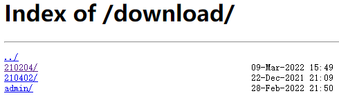

```sh

server {
    listen 80;
    server_name localhost;
    #方式一：既能预览又能下载
    location ^~ /view {
    	alias /temp/files/; #在windows中 路径斜杠需要用 "/",而不能用 "\"

        autoindex on;
        autoindex_exact_size on;
        autoindex_localtime on;
        charset utf-8;
        if ($request_filename ~* ^.*?\.(txt|doc|pdf|rar|gz|zip|docx|exe|xlsx|ppt|pptx)$){
        	add_header Content-Disposition: 'p_w_upload;';
        }
 	}
 	#方式二 只能下载
    location ^~ /download/ {
    	alias /temp/files/;
		if ($request_filename ~* ^.*?\.(html|doc|pdf|zip|docx)$) {
            add_header Content-Disposition attachment;
            add_header Content-Type application/octet-stream;
        }
        sendfile on;   # 开启高效文件传输模式
        autoindex on;  # 开启目录文件列表
        autoindex_exact_size on;  # 显示出文件的确切大小，单位是bytes
        autoindex_localtime on;  # 显示的文件时间为文件的服务器时间
        charset utf-8,gbk;  # 避免中文乱码
      }
 }
```
浏览器中访问``` http://ip:port/downlad ``` 页面上会显示```/temp/files/```目录，如果是第一种方式可以在浏览器上预览文件；如果是方式二，点击文件即另存为。



中间遇到的问题：谷歌浏览器用方式一可能无法预览，但是我换了Edge浏览器之后，方式一既可以预览又可以下载，方式二只能下载

