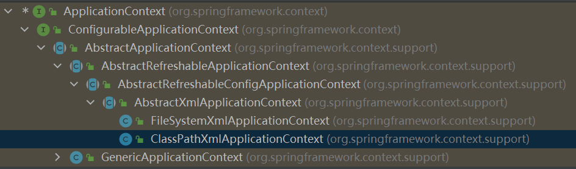
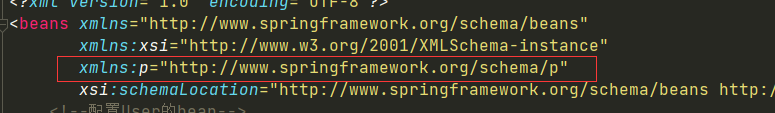
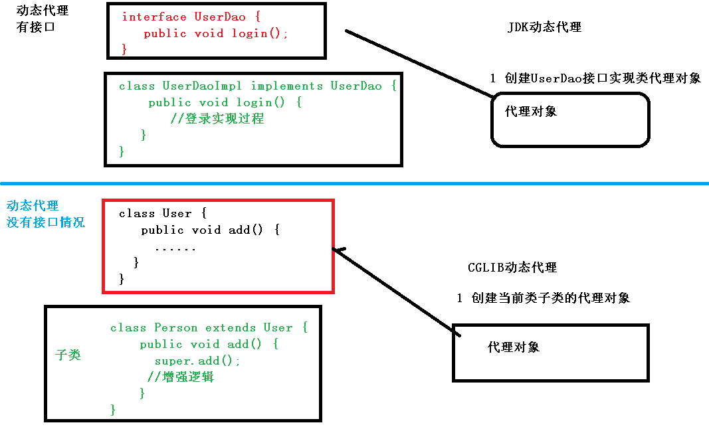
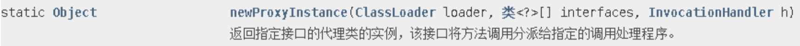
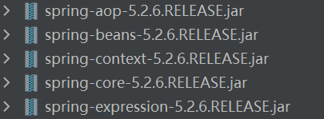

# Java

# JVM

## 类加载机制

## 内存模型

## 垃圾回收机制

# Redis

## 1. 认识Redis

### 1.1 什么是redis？

Redis 是一种基于内存的数据库，对数据的读写操作都是在内存中完成议，是一个高性能的 key-value 数据库，因此**读写速度非常快**，常用于**缓存，消息队列、分布式锁等场景**。

Redis 提供了多种数据类型来支持不同的业务场景，比如 String(字符串)、Hash(哈希)、 List (列表)、Set(集合)、Zset(有序集合)、Bitmaps（位图）、HyperLogLog（基数统计）、GEO（地理信息）、Stream（流），并且对数据类型的操作都是**原子性**的，因为执行命令由单线程负责的，不存在并发竞争的问题。

除此之外，Redis 还支持**事务 、持久化、Lua 脚本、多种集群方案（主从复制模式、哨兵模式、切片机群模式）、发布/订阅模式，内存淘汰机制、过期删除机制**等等。

### 1.2 Redis 和 Memcached 有什么区别？

很多人都说用 Redis 作为缓存，但是 Memcached 也是基于内存的数据库，为什么不选择它作为缓存呢？要解答这个问题，我们就要弄清楚 Redis 和 Memcached 的区别。 Redis 与 Memcached **共同点**：

1. 都是基于内存的数据库，一般都用来当做缓存使用。
2. 都有过期策略。
3. 两者的性能都非常高。

Redis 与 Memcached **区别**：

- Redis 支持的数据类型更丰富（String、Hash、List、Set、ZSet），而 Memcached 只支持最简单的 key-value 数据类型；
- Redis 支持数据的持久化，可以将内存中的数据保持在磁盘中，重启的时候可以再次加载进行使用，而 Memcached 没有持久化功能，数据全部存在内存之中，Memcached 重启或者挂掉后，数据就没了；
- Redis 原生支持集群模式，Memcached 没有原生的集群模式，需要依靠客户端来实现往集群中分片写入数据；
- Redis 支持发布订阅模型、Lua 脚本、事务等功能，而 Memcached 不支持；

### 1.3 为什么用 Redis 作为 MySQL 的缓存？

主要是因为 **Redis 具备「高性能」和「高并发」两种特性**。

***1、Redis 具备高性能***

假如用户第一次访问 MySQL 中的某些数据。这个过程会比较慢，因为是从硬盘上读取的。将该用户访问的数据缓存在 Redis 中，这样下一次再访问这些数据的时候就可以直接从缓存中获取了，操作 Redis 缓存就是直接操作内存，所以速度相当快。


如果 MySQL 中的对应数据改变的之后，同步改变 Redis 缓存中相应的数据即可，不过这里会有 Redis 和 MySQL 双写一致性的问题，后面我们会提到。

***2、 Redis 具备高并发***

单台设备的 Redis 的 QPS（Query Per Second，每秒钟处理完请求的次数） 是 MySQL 的 10 倍，Redis 单机的 QPS 能轻松破 10w，而 MySQL 单机的 QPS 很难破 1w。

所以，直接访问 Redis 能够承受的请求是远远大于直接访问 MySQL 的，所以我们可以考虑把数据库中的部分数据转移到缓存中去，这样用户的一部分请求会直接到缓存这里而不用经过数据库。

## 2. Redis 数据结构

### 2.1 Redis 数据类型以及使用场景分别是什么？

Redis 提供了丰富的数据类型，常见的有五种数据类型：**String（字符串），Hash（哈希），List（列表），Set（集合）、Zset（有序集合）**。


- String 类型的应用场景：缓存对象、常规计数、分布式锁、共享 session 信息等。
- List 类型的应用场景：消息队列（但是有两个问题：1. 生产者需要自行实现全局唯一 ID；2. 不能以消费组形式消费数据）等。
- Hash 类型：缓存对象、购物车等。
- Set 类型：聚合计算（并集、交集、差集）场景，比如点赞、共同关注、抽奖活动等。
- Zset 类型：排序场景，比如排行榜、电话和姓名排序等。

### 2.2 五种常见的 Redis 数据类型是怎么实现？

我画了一张 Redis 数据类型和底层数据结构的对应关图，左边是 Redis 3.0版本的，也就是《Redis 设计与实现》这本书讲解的版本，现在看还是有点过时了，右边是现在 Redis 7.0 版本的。


#### 2.2.1 String 类型内部实现

String 类型的底层的数据结构实现主要是 SDS（简单动态字符串）。 SDS 和我们认识的 C 字符串不太一样，之所以没有使用 C 语言的字符串表示，因为 SDS 相比于 C 的原生字符串：

- **SDS 不仅可以保存文本数据，还可以保存二进制数据**。因为 SDS 使用 len 属性的值而不是空字符来判断字符串是否结束，并且 SDS 的所有 API 都会以处理二进制的方式来处理 SDS 存放在 buf[] 数组里的数据。所以 SDS 不光能存放文本数据，而且能保存图片、音频、视频、压缩文件这样的二进制数据。
- **SDS 获取字符串长度的时间复杂度是 O(1)**。因为 C 语言的字符串并不记录自身长度，所以获取长度的复杂度为 O(n)；而 SDS 结构里用 len 属性记录了字符串长度，所以复杂度为 O(1)。
- **Redis 的 SDS API 是安全的，拼接字符串不会造成缓冲区溢出**。因为 SDS 在拼接字符串之前会检查 SDS 空间是否满足要求，如果空间不够会自动扩容，所以不会导致缓冲区溢出的问题。

#### 2.2.2 List 类型内部实现

List 类型的底层数据结构是由**双向链表或压缩列表**实现的：

- 如果列表的元素个数小于 512 个（默认值，可由 list-max-ziplist-entries 配置），列表每个元素的值都小于 64 字节（默认值，可由 list-max-ziplist-value 配置），Redis会使用**压缩列表**作为List类型的底层数据结构；
- 如果列表的元素不满足上面的条件，Redis 会使用**双向链表**作为 List 类型的底层数据结构；

但是**在 Redis 3.2 版本之后，List 数据类型底层数据结构就只由 quicklist 实现了，替代了双向链表和压缩列表**。

>- ziplist：
>
>- quicklist
>
> 

#### 2.2.3 Hash 类型内部实现

Hash 类型的底层数据结构是由**压缩列表或哈希表**实现的：

- 如果哈希类型元素个数小于 512 个（默认值，可由 hash-max-ziplist-entries 配置），所有值小于 64 字节（默认值，可由 hash-max-ziplist-value 配置）的话，Redis 会使用**压缩列表**作为 Hash 类型的底层数据结构；
- 如果哈希类型元素不满足上面条件，Redis 会使用**哈希表**作为 Hash 类型的底层数据结构。

**在 Redis 7.0 中，压缩列表数据结构已经废弃了，交由 listpack 数据结构来实现了**。

#### 2.2.4 Set 类型内部实现

Set 类型的底层数据结构是由**哈希表或整数集合**实现的：

- 如果集合中的元素都是整数且元素个数小于 512 （默认值，set-maxintset-entries配置）个，Redis 会使用**整数集合**作为 Set 类型的底层数据结构；
- 如果集合中的元素不满足上面条件，则 Redis 使用**哈希表**作为 Set 类型的底层数据结构。

#### 2.2.5 ZSet 类型内部实现

Zset 类型的底层数据结构是由**压缩列表或跳表(SkipList)**实现的：

- 如果有序集合的元素个数小于 128 个，并且每个元素的值小于 64 字节时，Redis会使用**压缩列表**作为 Zset 类型的底层数据结构；
- 如果有序集合的元素不满足上面的条件，Redis会使用**跳表(SkipList)**作为Zset类型的底层数据结构；

>

**在 Redis 7.0 中，压缩列表数据结构已经废弃了，交由 listpack 数据结构来实现了。**

## 3. Redis线程模型

### 3.1  Redis是单线程吗？

**Redis 单线程指的是「接收客户端请求->解析请求 ->进行数据读写等操作->发送数据给客户端」这个过程是由一个线程（主线程）来完成的**，这也是我们常说 Redis 是单线程的原因。但是，**Redis 程序并不是单线程的**，Redis 在启动的时候，是会**启动后台线程**（BIO）的：

- **Redis 在 2.6 版本**，会启动 2 个后台线程，分别处理关闭文件、AOF 刷盘这两个任务；
- **Redis 在 4.0 版本之后**，新增了一个新的后台线程，用来异步释放 Redis 内存，也就是 lazyfree 线程。例如执行 unlink key / flushdb async / flushall async 等命令，会把这些删除操作交给后台线程来执行，好处是不会导致 Redis 主线程卡顿。因此，当我们要删除一个大 key 的时候，不要使用 del 命令删除，因为 del 是在主线程处理的，这样会导致 Redis 主线程卡顿，因此我们应该使用 unlink 命令来异步删除大key。

之所以 Redis 为「关闭文件、AOF 刷盘、释放内存」这些任务创建单独的线程来处理，是因为这些任务的操作都是很耗时的，如果把这些任务都放在主线程来处理，那么 Redis 主线程就很容易发生阻塞，这样就无法处理后续的请求了。


关闭文件、AOF 刷盘、释放内存这三个任务都有各自的任务队列：

- BIO_CLOSE_FILE，关闭文件任务队列：当队列有任务后，后台线程会调用 close(fd) ，将文件关闭；
- BIO_AOF_FSYNC，AOF刷盘任务队列：当 AOF 日志配置成 everysec 选项后，主线程会把 AOF 写日志操作封装成一个任务，也放到队列中。当发现队列有任务后，后台线程会调用 fsync(fd)，将 AOF 文件刷盘，
- BIO_LAZY_FREE，lazy free 任务队列：当队列有任务后，后台线程会 free(obj) 释放对象 / free(dict) 删除数据库所有对象 / free(skiplist) 释放跳表对象；

###  3.2 Redis 单线程模式是怎样的？

Redis 基于 Reactor 模式开发了**文件事件处理器（file event handler）**。

- 文件事件处理器使用 I/O 多路复用（multiplexing）程序来同时监听多个套接字，并根据套接字目前执行的任务来为套接字关联不同的事件处理器。
- 当被监听的套接字准备好执行连接应答（accept）、读取（read）、写入（write）、关 闭（close）等操作时，与操作相对应的文件事件就会产生，这时文件事件处理器就会调用套接字之前关联好的事件处理器来处理这些事件。

**虽然文件事件处理器以单线程方式运行，但通过使用I/O多路复用程序来监听多个套接字**，文件事件处理器既实现了高性能的网络通信模型，又可以很好地与 Redis 服务器中其他同样以单线程方式运行的模块进行对接，这保持了Redis内部单线程设计的简单性。


图中的蓝色部分是一个事件循环，是由主线程负责的，可以看到网络 I/O 和命令处理都是单线程。 Redis 初始化的时候，会做下面这几件事情：

- 首先，调用 epoll_create() 创建一个 epoll 对象和调用 socket() 创建一个服务端 socket
- 然后，调用 bind() 绑定端口和调用 listen() 监听该 socket；
- 然后，将调用 epoll_ctl() 将 listen socket 加入到 epoll，同时注册「连接事件」处理函数。

初始化完后，主线程就进入到一个**事件循环函数**，主要会做以下事情：

- 首先，先调用**处理发送队列函数**，看是发送队列里是否有任务，如果有发送任务，则通过 write 函数将客户端发送缓存区里的数据发送出去，如果这一轮数据没有发送完，就会注册写事件处理函数，等待 epoll_wait 发现可写后再处理 。
- 接着，调用 epoll_wait 函数等待事件的到来：
  - 如果是**连接事件**到来，则会调用**连接事件处理函数**，该函数会做这些事情：调用 accpet 获取已连接的 socket -> 调用 epoll_ctl 将已连接的 socket 加入到 epoll -> 注册「读事件」处理函数；
  - 如果是**读事件**到来，则会调用**读事件处理函数**，该函数会做这些事情：调用 read 获取客户端发送的数据 -> 解析命令 -> 处理命令 -> 将客户端对象添加到发送队列 -> 将执行结果写到发送缓存区等待发送；
  - 如果是**写事件**到来，则会调用**写事件处理函数**，该函数会做这些事情：通过 write 函数将客户端发送缓存区里的数据发送出去，如果这一轮数据没有发送完，就会继续注册写事件处理函数，等待 epoll_wait发现可写后再处理 。

### 3.3 Redis 采用单线程为什么还这么快？

- Redis 的大部分操作**都在内存中完成**，并且采用了高效的数据结构，因此 Redis 瓶颈可能是机器的内存或者网络带宽，而并非 CPU，既然 CPU不是瓶颈，那么自然就采用单线程的解决方案了；

- Redis 采用单线程模型可以**避免了多线程之间的竞争**，省去了多线程切换带来的时间和性能上的开销，而且也不会导致死锁问题。

- Redis 采用了 **I/O 多路复用机制**处理大量的客户端 Socket 请求，IO 多路复用机制是指一个线程处理多个 IO 流，就是我们经常听到的 select/epoll 机制。简单来说，在 Redis 只运行单线程的情况下，该机制允许内核中，同时存在多个监听 Socket 和已连接 Socket。内核会一直监听这些 Socket 上的连接请求或数据请求。一旦有请求到达，就会交给 Redis 线程处理，这就实现了一个 Redis 线程处理多个 IO 流的效果。

  > 多路复用IO机制实现原理
  >
  > 

### 3.4 Redis 6.0 之前为什么使用单线程？

**CPU 并不是制约 Redis 性能表现的瓶颈所在**，更多情况下是受到内存大小和网络I/O的限制，所以Redis核心网络模型使用单线程并没有什么问题。

使用了单线程后，可维护性高，多线程模型虽然在某些方面表现优异，但是它却引入了程序执行顺序的不确定性，带来了并发读写的一系列问题，**增加了系统复杂度、同时可能存在线程切换、甚至加锁解锁、死锁造成的性能损耗**。

###  3.5 Redis 6.0 之后为什么引入了多线程？

虽然 Redis 的主要工作（网络 I/O 和执行命令）一直是单线程模型，但是**在 Redis 6.0 版本之后，也采用了多个 I/O 线程来处理网络请求**，**这是因为随着网络硬件的性能提升，Redis 的性能瓶颈有时会出现在网络 I/O 的处理上**。所以为了提高网络 I/O 的并行度，Redis 6.0 对于网络 I/O 采用多线程来处理。

Redis 6.0 版本支持的 I/O 多线程特性，默认情况下 I/O 多线程只针对发送响应数据（write client socket），并不会以多线程的方式处理读请求（read client socket）。要想开启多线程处理客户端读请求，就需要把 Redis.conf 配置文件中的 io-threads-do-reads 配置项设为 yes。

```c
//读请求也使用io多线程
io-threads-do-reads yes 
```

同时， Redis.conf 配置文件中提供了 IO 多线程个数的配置项。

```c
// io-threads N，表示启用 N-1 个 I/O 多线程（主线程也算一个 I/O 线程）
io-threads 4 
```

关于线程数的设置，官方的建议是如果为 4 核的 CPU，建议线程数设置为 2 或 3，如果为 8 核 CPU 建议线程数设置为 6，线程数一定要小于机器核数，线程数并不是越大越好。

因此， Redis 6.0 版本之后，Redis 在启动的时候，默认情况下会**额外创建 6 个线程**（*这里的线程数不包括主线程*）：

- Redis-server ： Redis的主线程，主要负责执行命令；
- bio_close_file、bio_aof_fsync、bio_lazy_free：三个后台线程，分别异步处理关闭文件任务、AOF刷盘任务、释放内存任务；
- io_thd_1、io_thd_2、io_thd_3：三个 I/O 线程，io-threads 默认是 4 ，所以会启动 3（4-1）个 I/O 多线程，用来分担 Redis 网络 I/O 的压力。

## 4. Redis 持久化

###  4.1 Redis 如何实现数据不丢失？

Redis 的读写操作都是在内存中，所以 Redis 性能才会高，但是当 Redis 重启后，内存中的数据就会丢失，那为了保证内存中的数据不会丢失，Redis 实现了数据持久化的机制，这个机制会把数据存储到磁盘，这样在 Redis 重启就能够从磁盘中恢复原有的数据。

Redis 共有三种数据持久化的方式：

- **AOF 日志**：每执行一条写操作命令，就把该命令以追加的方式写入到一个文件里；
- **RDB 快照**：将某一时刻的内存数据，以二进制的方式写入磁盘；
- **混合持久化方式**：Redis 4.0 新增的方式，集成了 AOF 和 RBD 的优点；

### 4.2 AOF 日志是如何实现的？

Redis 在执行完一条写操作命令后，就会把该命令以追加的方式写入到一个文件里，然后 Redis 重启时，会读取该文件记录的命令，然后逐一执行命令的方式来进行数据恢复。


我这里以「*set name xiaolin*」命令作为例子，Redis 执行了这条命令后，记录在 AOF 日志里的内容如下图：


「*3」表示当前命令有三个部分，每部分都是以「$+数字」开头，后面紧跟着具体的命令、键或值。然后，这里的「数字」表示这部分中的命令、键或值一共有多少字节。例如，「$3 set」表示这部分有 3 个字节，也就是「set」命令这个字符串的长度。

#### 4.2.1 为什么先执行命令，再把数据写入日志呢？

Reids 是先执行写操作命令后，才将该命令记录到 AOF 日志里的，这么做其实有两个好处。

- **避免额外的检查开销**：因为如果先将写操作命令记录到 AOF 日志里，再执行该命令的话，如果当前的命令语法有问题，那么如果不进行命令语法检查，该错误的命令记录到 AOF 日志里后，Redis 在使用日志恢复数据时，就可能会出错。
- **不会阻塞当前写操作命令的执行**：因为当写操作命令执行成功后，才会将命令记录到 AOF 日志。

当然，这样做也会带来风险：

- **数据可能会丢失：** 执行写操作命令和记录日志是两个过程，那当 Redis 在还没来得及将命令写入到硬盘时，服务器发生宕机了，这个数据就会有丢失的风险。
- **可能阻塞其他操作：** 由于写操作命令执行成功后才记录到 AOF 日志，所以不会阻塞当前命令的执行，但因为 AOF 日志也是在主线程中执行，所以当 Redis 把日志文件写入磁盘的时候，还是会阻塞后续的操作无法执行。

#### 4.2.2 AOF 写回策略有几种？

Redis 写入 AOF 日志的过程，如下图：


具体说说：

1. Redis 执行完写操作命令后，会将命令追加到 server.aof_buf 缓冲区；
2. 然后通过 write() 系统调用，将 aof_buf 缓冲区的数据写入到 AOF 文件，此时数据并没有写入到硬盘，而是拷贝到了内核缓冲区 page cache，等待内核将数据写入硬盘；
3. 具体内核缓冲区的数据什么时候写入到硬盘，由内核决定。

Redis 提供了 3 种写回硬盘的策略，控制的就是上面说的第三步的过程。 在 Redis.conf 配置文件中的 appendfsync 配置项可以有以下 3 种参数可填：

- **Always**，这个单词的意思是「总是」，所以它的意思是每次写操作命令执行完后，同步将 AOF 日志数据写回硬盘；
- **Everysec**，这个单词的意思是「每秒」，所以它的意思是每次写操作命令执行完后，先将命令写入到 AOF 文件的内核缓冲区，然后每隔一秒将缓冲区里的内容写回到硬盘；
- **No**，意味着不由 Redis 控制写回硬盘的时机，转交给操作系统控制写回的时机，也就是每次写操作命令执行完后，先将命令写入到 AOF 文件的内核缓冲区，再由操作系统决定何时将缓冲区内容写回硬盘。


#### 4.2.3 AOF 日志过大，会触发什么机制？

AOF 日志是一个文件，随着执行的写操作命令越来越多，文件的大小会越来越大。 如果当 AOF 日志文件过大就会带来性能问题，比如重启 Redis 后，需要读 AOF 文件的内容以恢复数据，如果文件过大，整个恢复的过程就会很慢。

所以，Redis 为了避免 AOF 文件越写越大，提供了 **AOF 重写机制**，当 AOF 文件的大小超过所设定的阈值后，Redis 就会启用 AOF 重写机制，来压缩 AOF 文件。

AOF 重写机制是在重写时，读取当前数据库中的所有键值对，然后将每一个键值对用一条命令记录到「新的 AOF 文件」，等到全部记录完后，就将新的 AOF 文件替换掉现有的 AOF 文件。

举个例子，在没有使用重写机制前，假设前后执行了「*set name xiaolin*」和「*set name xiaolincoding*」这两个命令的话，就会将这两个命令记录到 AOF 文件。


但是**在使用重写机制后，就会读取 name 最新的 value（键值对） ，然后用一条 「set name xiaolincoding」命令记录到新的 AOF 文件**，之前的第一个命令就没有必要记录了，因为它属于「历史」命令，没有作用了。这样一来，一个键值对在重写日志中只用一条命令就行了。

重写工作完成后，就会将新的 AOF 文件覆盖现有的 AOF 文件，这就相当于压缩了 AOF 文件，使得 AOF 文件体积变小了。

#### 4.2.4 重写 AOF 日志的过程是怎样的？

Redis 的**重写 AOF 过程是由后台子进程 *bgrewriteaof* 来完成的**，这么做可以达到两个好处：

- 子进程进行 AOF 重写期间，主进程可以继续处理命令请求，从而避免阻塞主进程；
- 子进程带有主进程的数据副本，这里使用子进程而不是线程，因为如果是使用线程，多线程之间会共享内存，那么在修改共享内存数据的时候，需要通过加锁来保证数据的安全，而这样就会降低性能。而使用子进程，创建子进程时，父子进程是共享内存数据的，不过这个共享的内存只能以只读的方式，而当父子进程任意一方修改了该共享内存，就会发生「写时复制」，于是父子进程就有了独立的数据副本，就不用加锁来保证数据安全。

触发重写机制后，主进程就会创建重写 AOF 的子进程，此时父子进程共享物理内存，重写子进程只会对这个内存进行只读，重写 AOF 子进程会读取数据库里的所有数据，并逐一把内存数据的键值对转换成一条命令，再将命令记录到重写日志（新的 AOF 文件）。

**但是重写过程中，主进程依然可以正常处理命令**，那问题来了，重写 AOF 日志过程中，如果主进程修改了已经存在 key-value，那么会发生写时复制，此时这个 key-value 数据在子进程的内存数据就跟主进程的内存数据不一致了，这时要怎么办呢？

为了解决这种数据不一致问题，Redis 设置了一个 **AOF 重写缓冲区**，这个缓冲区在创建 bgrewriteaof 子进程之后开始使用。

在重写 AOF 期间，当 Redis 执行完一个写命令之后，它会**同时将这个写命令写入到 「AOF 缓冲区」和 「AOF 重写缓冲区」**。


也就是说，在 bgrewriteaof 子进程执行 AOF 重写期间，主进程需要执行以下三个工作:

- 执行客户端发来的命令；
- 将执行后的写命令追加到 「AOF 缓冲区」；
- 将执行后的写命令追加到 「AOF 重写缓冲区」；

当子进程完成 AOF 重写工作（*扫描数据库中所有数据，逐一把内存数据的键值对转换成一条命令，再将命令记录到重写日志*）后，会向主进程发送一条信号，信号是进程间通讯的一种方式，且是异步的。

主进程收到该信号后，会调用一个信号处理函数，该函数主要做以下工作：

- 将 AOF 重写缓冲区中的所有内容追加到新的 AOF 的文件中，使得新旧两个 AOF 文件所保存的数据库状态一致；
- 新的 AOF 的文件进行改名，覆盖现有的 AOF 文件。

信号函数执行完后，主进程就可以继续像往常一样处理命令了。

### 4.3 RDB 快照是如何实现的呢？

因为 AOF 日志记录的是操作命令，不是实际的数据，所以用 AOF 方法做故障恢复时，需要全量把日志都执行一遍，一旦 AOF 日志非常多，势必会造成 Redis 的恢复操作缓慢。

为了解决这个问题，Redis 增加了 RDB 快照。所谓的快照，就是记录某一个瞬间东西，比如当我们给风景拍照时，那一个瞬间的画面和信息就记录到了一张照片。

所以，RDB 快照就是记录某一个瞬间的内存数据，记录的是实际数据，而 AOF 文件记录的是命令操作的日志，而不是实际的数据。

因此在 Redis 恢复数据时， RDB 恢复数据的效率会比 AOF 高些，因为直接将 RDB 文件读入内存就可以，不需要像 AOF 那样还需要额外执行操作命令的步骤才能恢复数据。

#### 4.3.1 RDB 做快照时会阻塞线程吗？

Redis 提供了两个命令来生成 RDB 文件，分别是 save 和 bgsave，他们的区别就在于是否在「主线程」里执行：

- 执行了 save 命令，就会在主线程生成 RDB 文件，由于和执行操作命令在同一个线程，所以如果写入 RDB 文件的时间太长，**会阻塞主线程**；
- 执行了 bgsave 命令，会创建一个子进程来生成 RDB 文件，这样可以**避免主线程的阻塞**；

Redis 还可以通过配置文件的选项来实现每隔一段时间自动执行一次 bgsave 命令，默认会提供以下配置：

```c
save 900 1
save 300 10
save 60 10000
```

别看选项名叫 save，实际上执行的是 bgsave 命令，也就是会创建子进程来生成 RDB 快照文件。 只要满足上面条件的任意一个，就会执行 bgsave，它们的意思分别是：

- 900 秒之内，对数据库进行了至少 1 次修改；
- 300 秒之内，对数据库进行了至少 10 次修改；
- 60 秒之内，对数据库进行了至少 10000 次修改。

这里提一点，Redis 的快照是**全量快照**，也就是说每次执行快照，都是把内存中的「所有数据」都记录到磁盘中。所以执行快照是一个比较重的操作，如果频率太频繁，可能会对 Redis 性能产生影响。如果频率太低，服务器故障时，丢失的数据会更多。

#### 4.3.2RDB 在执行快照的时候，数据能修改吗？

可以的，执行 bgsave 过程中，Redis 依然**可以继续处理操作命令**的，也就是数据是能被修改的，关键的技术就在于**写时复制技术（Copy-On-Write, COW）。**

执行 bgsave 命令的时候，会通过 fork() 创建子进程，此时子进程和父进程是共享同一片内存数据的，因为创建子进程的时候，会复制父进程的页表，但是页表指向的物理内存还是一个，此时如果主线程执行读操作，则主线程和 bgsave 子进程互相不影响。


如果主线程执行写操作，则被修改的数据会复制一份副本，然后 bgsave 子进程会把该副本数据写入 RDB 文件，在这个过程中，主线程仍然可以直接修改原来的数据。


### 4.4 为什么会有混合持久化？

RDB 优点是数据恢复速度快，但是快照的频率不好把握。频率太低，丢失的数据就会比较多，频率太高，就会影响性能。

AOF 优点是丢失数据少，但是数据恢复不快。

为了集成了两者的优点， Redis 4.0 提出了**混合使用 AOF 日志和内存快照**，也叫混合持久化，既保证了 Redis 重启速度，又降低数据丢失风险。

混合持久化工作在 **AOF 日志重写过程**，当开启了混合持久化时，在 AOF 重写日志时，fork 出来的重写子进程会先将与主线程共享的内存数据以 RDB 方式写入到 AOF 文件，然后主线程处理的操作命令会被记录在重写缓冲区里，重写缓冲区里的增量命令会以 AOF 方式写入到 AOF 文件，写入完成后通知主进程将新的含有 RDB 格式和 AOF 格式的 AOF 文件替换旧的的 AOF 文件。

也就是说，使用了混合持久化，AOF 文件的**前半部分是 RDB 格式的全量数据，后半部分是 AOF 格式的增量数据**。


这样的好处在于，重启 Redis 加载数据的时候，由于前半部分是 RDB 内容，这样**加载的时候速度会很快**。

加载完 RDB 的内容后，才会加载后半部分的 AOF 内容，这里的内容是 Redis 后台子进程重写 AOF 期间，主线程处理的操作命令，可以使得**数据更少的丢失**。

**混合持久化优点：**

- 混合持久化结合了 RDB 和 AOF 持久化的优点，开头为 RDB 的格式，使得 Redis 可以更快的启动，同时结合 AOF 的优点，有减低了大量数据丢失的风险。

**混合持久化缺点：**

- AOF 文件中添加了 RDB 格式的内容，使得 AOF 文件的可读性变得很差；
- 兼容性差，如果开启混合持久化，那么此混合持久化 AOF 文件，就不能用在 Redis 4.0 之前版本了。

## 5. Redis集群

### 5.1 Redis 如何实现服务高可用？

要想设计一个高可用的 Redis 服务，一定要从 Redis 的多服务节点来考虑，比如 Redis 的主从复制、哨兵模式、切片集群。

#### 5.1.1 主从复制

主从复制是 Redis 高可用服务的最基础的保证，实现方案就是将从前的一台 Redis 服务器，同步数据到多台从 Redis 服务器上，即一主多从的模式，且主从服务器之间采用的是「读写分离」的方式。

主服务器可以进行读写操作，当发生写操作时自动将写操作同步给从服务器，而从服务器一般是只读，并接受主服务器同步过来写操作命令，然后执行这条命令。


也就是说，所有的数据修改只在主服务器上进行，然后将最新的数据同步给从服务器，这样就使得主从服务器的数据是一致的。

注意，主从服务器之间的命令复制是**异步**进行的。

具体来说，在主从服务器命令传播阶段，主服务器收到新的写命令后，会发送给从服务器。但是，主服务器并不会等到从服务器实际执行完命令后，再把结果返回给客户端，而是主服务器自己在本地执行完命令后，就会向客户端返回结果了。如果从服务器还没有执行主服务器同步过来的命令，主从服务器间的数据就不一致了。

所以，无法实现强一致性保证（主从数据时时刻刻保持一致），数据不一致是难以避免的。

#### 5.1.2主从复制怎么实现的？

####### 5.1.1.1 全量复制

使用 `replicaof`（Redis 5.0 之前使用 slaveof）命令形成主服务器和从服务器的关系。

比如，现在有服务器 A 和 服务器 B，我们在服务器 B 上执行下面这条命令：

```sh
## 服务器 B 执行这条命令
replicaof <服务器 A 的 IP 地址> <服务器 A 的 Redis 端口号>
```

然后服务器B就会变成A的【**从服务器**】，然后与主服务器进行第一次同步（全量同步）：


- **第一阶段：建立链接、协商同步**

  执行完replicaof命令后，从服务器就会给主服务器发送psync命令，表示要进行数据同步。

  psync命令包含两个参数：主服务器runID和复制进度offset

  - runID，每个 Redis 服务器在启动时都会自动生产一个随机的 ID 来唯一标识自己。当从服务器和主服务器第一次同步时，因为不知道主服务器的 run ID，所以将其设置为 "?"。
  - offset，表示复制的进度，第一次同步时，其值为 -1。

  主服务器收到 psync 命令后，会用 `FULLRESYNC` 作为响应命令返回给对方。

  并且这个响应命令会带上两个参数：主服务器的 runID 和主服务器目前的复制进度 offset。从服务器收到响应后，会记录这两个值。

- **第二阶段：主服务器同步数据给从服务器**

  接着，主服务器会执行 bgsave 命令来生成 RDB 文件，然后把文件发送给从服务器。从服务器收到 RDB 文件后，会先清空当前的数据，然后载入 RDB 文件。

  > 这里有一点要注意，主服务器生成 RDB 这个过程是不会阻塞主线程的，因为 bgsave 命令是产生了一个子进程来做生成 RDB 文件的工作，是异步工作的，这样 Redis 依然可以正常处理命令。因此，生成RDB期间的写入的数据并没有写入到RDB文件中，这时主从数据就不一致了。
  >
  > 为了保证主从数据一致性，主服务器在下面这三个时间间隙中将新收到的写命令写入到replication buffer缓冲区中：
  >
  > - 主服务器生成 RDB 文件期间；
  > - 主服务器发送 RDB 文件给从服务器期间；
  > - 「从服务器」加载 RDB 文件期间；
  >
  > 其实一句话就是：从主服务器生成RDB开始到从服务器加载完RDB结束

- **第三阶段：主服务器发送新写操作命令给从服务器**

  从服务器将RDB加载完之后，回复一个确认消息给主服务器，接着主服务将replicatoin buffer缓冲区中的写命令发送给从服务器，从服务器执行这些命令，以保证主从数据一致性。

至此，主从服务器第一次同步工作就完成了。

####### 5.1.1.2 命令传播

主从服务器在完成第一次同步后，双方之间就会维护一个 TCP 连接。


后续主服务器可以通过这个连接继续将写操作命令传播给从服务器，然后从服务器执行该命令，使得与主服务器的数据库状态相同。

而且这个连接是**长连接**的，目的是**避免频繁的 TCP 连接和断开带来的性能开销**。

上面的这个过程被称为**基于长连接的命令传播**，通过这种方式来保证第一次同步后的主从服务器的数据一致性。

####### 5.1.1.3 分摊主服务器的压力

在前面的分析中，我们可以知道主从服务器在第一次数据同步的过程中，主服务器会做两件耗时的操作：生成 RDB 文件和传输 RDB 文件。

主服务器是可以有多个从服务器的，如果从服务器数量非常多，而且都与主服务器进行全量同步的话，就会带来两个问题：

- 由于是通过 bgsave 命令来生成 RDB 文件的，那么主服务器就会忙于使用 fork() 创建子进程，如果主服务器的内存数据非大，在执行 fork() 函数时是会阻塞主线程的，从而使得 Redis 无法正常处理请求；
- 传输 RDB 文件会占用主服务器的网络带宽，会对主服务器响应命令请求产生影响。

这种情况就好像，刚创业的公司，由于人不多，所以员工都归老板一个人管，但是随着公司的发展，人员的扩充，老板慢慢就无法承担全部员工的管理工作了。

要解决这个问题，老板就需要设立经理职位，由经理管理多名普通员工，然后老板只需要管理经理就好。

Redis 也是一样的，从服务器可以有自己的从服务器，我们可以把拥有从服务器的从服务器当作经理角色，它不仅可以接收主服务器的同步数据，自己也可以同时作为主服务器的形式将数据同步给从服务器，组织形式如下图：


通过这种方式，**主服务器生成 RDB 和传输 RDB 的压力可以分摊到充当经理角色的从服务器**。

那具体怎么做到的呢？

其实很简单，我们在「从服务器」上执行下面这条命令，使其作为目标服务器的从服务器：

```sh
replicaof <目标服务器的IP> 6379
```

此时如果目标服务器本身也是「从服务器」，那么该目标服务器就会成为「经理」的角色，不仅可以接受主服务器同步的数据，也会把数据同步给自己旗下的从服务器，从而减轻主服务器的负担。

####### 5.1.1.4 增量复制

如果主从服务器间的网络连接断开了，那么就无法进行命令传播了，这时从服务器的数据就没办法和主服务器保持一致了，客户端就可能从「从服务器」读到旧的数据。

**如果此时断开的网络，又恢复正常了，要怎么继续保证主从服务器的数据一致性呢？**

从 Redis 2.8 开始，网络断开又恢复后，从主从服务器会采用**增量复制**的方式继续同步，也就是只会把网络断开期间主服务器接收到的写操作命令，同步给从服务器。

网络恢复后的增量复制过程如下图：


主要有三个步骤：

- 从服务器在恢复网络后，会发送 psync 命令给主服务器，此时的 psync 命令里的 offset 参数不是 -1；
- 主服务器收到该命令后，然后用 CONTINUE 响应命令告诉从服务器接下来采用增量复制的方式同步数据；
- 然后主服务将主从服务器断线期间，所执行的写命令发送给从服务器，然后从服务器执行这些命令。

那么关键的问题来了，**主服务器怎么知道要将哪些增量数据发送给从服务器呢？**

答案藏在这两个东西里：

- **repl_backlog_buffer**，是一个「**环形**」缓冲区，用于主从服务器断连后，从中找到差异的数据；
- **replication offset**，标记上面那个缓冲区的同步进度，主从服务器都有各自的偏移量，主服务器使用 master_repl_offset 来记录自己「*写*」到的位置，从服务器使用 slave_repl_offset 来记录自己「*读*」到的位置。

**那 repl_backlog_buffer 缓冲区是什么时候写入的呢？**

在主服务器进行命令传播时，不仅会将写命令发送给从服务器，还会将写命令写入到 repl_backlog_buffer 缓冲区里，因此 这个缓冲区里会保存着最近传播的写命令。

网络断开后，当从服务器重新连上主服务器时，从服务器会通过 psync 命令将自己的复制偏移量 slave_repl_offset 发送给主服务器，主服务器根据自己的 master_repl_offset 和 slave_repl_offset 之间的差距，然后来决定对从服务器执行哪种同步操作：

- 如果判断出从服务器要读取的数据还在 repl_backlog_buffer 缓冲区里，那么主服务器将采用**增量同步**的方式；
- 相反，如果判断出从服务器要读取的数据已经不存在 repl_backlog_buffer 缓冲区里，那么主服务器将采用**全量同步**的方式。

当主服务器在repl_backlog_buffer 中找到主从服务器差异（增量）的数据后，就会将增量的数据写入到 replication buffer 缓冲区，这个缓冲区我们前面也提到过，它是缓存将要传播给从服务器的命令。


repl_backlog_buffer 缓行缓冲区的默认大小是 1M，并且由于它是一个环形缓冲区，所以当缓冲区写满后，主服务器继续写入的话，就会覆盖之前的数据。因此，当主服务器的写入速度远超于从服务器的读取速度，缓冲区的数据一下就会被覆盖。

那么在网络恢复时，如果从服务器想读的数据已经被覆盖了，主服务器就会采用全量同步，这个方式比增量同步的性能损耗要大很多。

因此，**为了避免在网络恢复时，主服务器频繁地使用全量同步的方式，我们应该调整下 repl_backlog_buffer 缓冲区大小，尽可能的大一些**，减少出现从服务器要读取的数据被覆盖的概率，从而使得主服务器采用增量同步的方式。

那 repl_backlog_buffer 缓冲区具体要调整到多大呢？

repl_backlog_buffer 最小的大小可以根据这面这个公式估算。


我来解释下这个公式的意思：

- second 为从服务器断线后重新连接上主服务器所需的平均 时间(以秒计算)。
- write_size_per_second 则是主服务器平均每秒产生的写命令数据量大小。

举个例子，如果主服务器平均每秒产生 1 MB 的写命令，而从服务器断线之后平均要 5 秒才能重新连接主服务器。

那么 repl_backlog_buffer 大小就不能低于 5 MB，否则新写地命令就会覆盖旧数据了。

当然，为了应对一些突发的情况，可以将 repl_backlog_buffer 的大小设置为此基础上的 2 倍，也就是 10 MB。

关于 repl_backlog_buffer 大小修改的方法，只需要修改配置文件里下面这个参数项的值就可以。

```shell
repl-backlog-size 1mb
```

#### 5.1.3 哨兵模式

在使用 Redis 主从服务的时候，会有一个问题，就是当 Redis 的主从服务器出现故障宕机时，需要手动进行恢复。

为了解决这个问题，Redis 增加了哨兵模式（**Redis Sentinel**），因为哨兵模式做到了可以监控主从服务器，并且提供**主从节点故障转移的功能。**


###### 5.1.3.1 为什么要有哨兵机制？

在 Redis 的主从架构中，由于主从模式是读写分离的，如果主节点（master）挂了，那么将没有主节点来服务客户端的写操作请求，也没有主节点给从节点（slave）进行数据同步了。 


这时如果要恢复服务的话，需要人工介入，选择一个「从节点」切换为「主节点」，然后让其他从节点指向新的主节点，同时还需要通知上游那些连接 Redis 主节点的客户端，将其配置中的主节点 IP 地址更新为「新主节点」的 IP 地址。

Redis 在 2.8 版本以后提供的**哨兵（\*Sentinel\*）机制**，它的作用是实现**主从节点故障转移**。它会监测主节点是否存活，如果发现主节点挂了，它就会选举一个从节点切换为主节点，并且把新主节点的相关信息通知给从节点和客户端。

###### 5.1.3.2 哨兵机制是如何工作的？

哨兵其实是一个运行在特殊模式下的 Redis 进程，所以它也是一个节点。从“哨兵”这个名字也可以看得出来，它相当于是“观察者节点”，观察的对象是主从节点。

当然，它不仅仅是观察那么简单，在它观察到有异常的状况下，会做出一些“动作”，来修复异常状态。

哨兵节点主要负责三件事情：**监控、选主、通知**。

所以，我们重点要学习这三件事情：

- 哨兵节点是如何监控节点的？又是如何判断主节点是否真的故障了？
- 根据什么规则选择一个从节点切换为主节点？
- 怎么把新主节点的相关信息通知给从节点和客户端呢？

###### 5.1.3.3 如何判断主节点真的故障了？

哨兵会每隔 1 秒给所有主从节点发送 PING 命令，当主从节点收到 PING 命令后，会发送一个响应命令给哨兵，这样就可以判断它们是否在正常运行。


如果主节点或者从节点没有在规定的时间内响应哨兵的 PING 命令，哨兵就会将它们标记为「**主观下线**」。这个「规定的时间」是配置项 `down-after-milliseconds` 参数设定的，单位是毫秒。

之所以针对「主节点」设计「主观下线」和「客观下线」两个状态，是因为有可能「主节点」其实并没有故障，可能只是因为主节点的系统压力比较大或者网络发送了拥塞，导致主节点没有在规定时间内响应哨兵的 PING 命令。

所以，为了减少误判的情况，哨兵在部署的时候不会只部署一个节点，而是用多个节点部署成**哨兵集群**（*最少需要三台机器来部署哨兵集群*），**通过多个哨兵节点一起判断，就可以就可以避免单个哨兵因为自身网络状况不好，而误判主节点下线的情况**。同时，多个哨兵的网络同时不稳定的概率较小，由它们一起做决策，误判率也能降低。

**具体是怎么判定主节点为「客观下线」的呢？**

当一个哨兵判断主节点为「主观下线」后，就会向其他哨兵发起命令，其他哨兵收到这个命令后，就会根据自身和主节点的网络状况，做出赞成投票或者拒绝投票的响应。


当这个哨兵的赞同票数达到哨兵配置文件中的 quorum 配置项设定的值后，这时主节点就会被该哨兵标记为「客观下线」。

例如，现在有 3 个哨兵，quorum 配置的是 2，那么一个哨兵需要 2 张赞成票，就可以标记主节点为“客观下线”了。这 2 张赞成票包括哨兵自己的一张赞成票和另外两个哨兵的赞成票。

PS：quorum 的值一般设置为哨兵个数的二分之一加1，例如 3 个哨兵就设置 2。

哨兵判断完主节点客观下线后，哨兵就要开始在多个「从节点」中，选出一个从节点来做新主节点。

**由哪个哨兵进行主从故障转移？**

需要在哨兵集群中选出一个 leader，让 leader 来执行主从切换。选举 leader 的过程其实是一个投票的过程，在投票开始前，肯定得有个「候选者」。哪个哨兵节点判断主节点为「客观下线」，这个哨兵节点就是候选者，所谓的候选者就是想当 Leader 的哨兵。

###### 5.1.3.4 主从故障转移的过程是怎样的？


主从故障转移操作包含以下四个步骤：

- 第一步：在已下线主节点（旧主节点）属下的所有「从节点」里面，挑选出一个从节点，并将其转换为主节点。
- 第二步：让已下线主节点属下的所有「从节点」修改复制目标，修改为复制「新主节点」；
- 第三步：将新主节点的 IP 地址和信息，通过「发布者/订阅者机制」通知给客户端；
- 第四步：继续监视旧主节点，当这个旧主节点重新上线时，将它设置为新主节点的从节点；

###### 5.1.3.5 哨兵集群是如何组成的？

**哨兵节点之间是通过 Redis 的发布者/订阅者机制来相互发现的**。

在主从集群中，主节点上有一个名为`__sentinel__:hello`的频道，不同哨兵就是通过它来相互发现，实现互相通信的。

在下图中，哨兵 A 把自己的 IP 地址和端口的信息发布到`__sentinel__:hello` 频道上，哨兵 B 和 C 订阅了该频道。那么此时，哨兵 B 和 C 就可以从这个频道直接获取哨兵 A 的 IP 地址和端口号。然后，哨兵 B、C 可以和哨兵 A 建立网络连接。


**哨兵集群会对「从节点」的运行状态进行监控，那哨兵集群如何知道「从节点」的信息？**

主节点知道所有「从节点」的信息，所以哨兵会每 10 秒一次的频率向主节点发送 INFO 命令来获取所有「从节点」的信息。

#### 5.1.4 切片集群模式

当 Redis 缓存**数据量大到一台服务器无法缓存**时，就需要使用 **Redis 切片集群**（Redis Cluster ）方案，它将数据分布在不同的服务器上，以此来降低系统对单主节点的依赖，从而提高 Redis 服务的读写性能。

Redis Cluster 方案采用**哈希槽（Hash Slot）**，来处理**数据和节点之间的映射**关系。在 Redis Cluster 方案中，**一个切片集群共有 16384 （2^14^）个哈希槽**，这些哈希槽类似于数据分区，每个键值对都会根据它的 key，被映射到一个哈希槽中，具体执行过程分为两大步：

- 根据键值对的 key，按照 [CRC16 算法 (opens new window)](https://en.wikipedia.org/wiki/Cyclic_redundancy_check)计算一个 16 bit (2^16^)的值。
- 再用 16bit 值对 16384 取模，得到 0~16383 范围内的模数，每个模数代表一个相应编号的哈希槽。

接下来的问题就是，这些哈希槽怎么被映射到具体的 Redis 节点上的呢？有两种方案：

- **平均分配：** 在使用 cluster create 命令创建 Redis 集群时，Redis 会自动把所有哈希槽平均分布到集群节点上。比如集群中有 9 个节点，则每个节点上槽的个数为 16384/9 个。
- **手动分配：** 可以使用 cluster meet 命令手动建立节点间的连接，组成集群，再使用 cluster addslots 命令，指定每个节点上的哈希槽个数。

为了方便理解，通过一张图来解释数据、哈希槽，以及节点三者的映射分布关系。


上图中的切片集群一共有 2 个节点，假设有 4 个哈希槽（Slot 0～Slot 3）时，我们就可以通过命令手动分配哈希槽，比如节点 1 保存哈希槽 0 和 1，节点 2 保存哈希槽 2 和 3。

```c
redis-cli -h 192.168.1.10 –p 6379 cluster addslots 0,1
redis-cli -h 192.168.1.11 –p 6379 cluster addslots 2,3
```

然后在集群运行的过程中，key1 和 key2 计算完 CRC16 值后，对哈希槽总个数 4 进行取模，再根据各自的模数结果，就可以被映射到哈希槽 1（对应节点1） 和 哈希槽 2（对应节点2）。

需要注意的是，在手动分配哈希槽时，需要把 16384 个槽都分配完，否则 Redis 集群无法正常工作。

### 5.2 集群脑裂导致数据丢失怎么办？

#### 5.2.1 什么是脑裂

个人理解：当主库假故障出现主库与哨兵、从库暂时性失联，其实并不是主库本身的故障，此时哨兵就是自动启动主从切换机制，就是在从库中选一个作为新主库 —— **脑裂出现了**。

#### 5.2.2 脑裂有什么影响

最直接的影响是两个主库同时存在，客户端不知道往哪个库中写数据，可能出现不同的客户端往不同的主库写数据的情况。

严重的情况，当假故障恢复后，旧主库就会降级为从库，哨兵让旧主库全量同步新主库的数据后，那么假故障期间写入旧主库的数据就会丢失。

> 举个例子说明：如果主节点的网络突然发生了问题，它与所有的从节点都失联了，但是此时的主节点和客户端的网络是正常的，这个客户端并不知道 Redis 内部已经出现了问题，还在照样的向这个失联的主节点写数据（过程A），此时这些数据被旧主节点缓存到了缓冲区里，因为主从节点之间的网络问题，这些数据都是无法同步给从节点的。
>
> 这时，哨兵也发现主节点失联了，它就认为主节点挂了（但实际上主节点正常运行，只是网络出问题了），于是哨兵就会在「从节点」中选举出一个 leader 作为主节点，这时集群就有两个主节点了 —— **脑裂出现了**。
>
> 然后，网络突然好了，哨兵因为之前已经选举出一个新主节点了，它就会把旧主节点降级为从节点（A），然后从节点（A）会向新主节点请求数据同步，**因为第一次同步是全量同步的方式，此时的从节点（A）会清空掉自己本地的数据，然后再做全量同步。所以，之前客户端在过程 A 写入的数据就会丢失了，也就是集群产生脑裂数据丢失的问题**。

#### 5.2.3 解决方案

当主节点发现从节点下线或者通信超时的总数量小于阈值时，那么禁止主节点进行写数据，直接把错误返回给客户端。

在 Redis 的配置文件中有两个参数我们可以设置：

- min-slaves-to-write x，主节点必须要有至少 x 个从节点连接，如果小于这个数，主节点会禁止写数据。
- min-slaves-max-lag x，主从数据复制和同步的延迟不能超过 x 秒，如果超过，主节点会禁止写数据。

我们可以把 min-slaves-to-write 和 min-slaves-max-lag 这两个配置项搭配起来使用，分别给它们设置一定的阈值，假设为 N 和 T。

这两个配置项组合后的要求是，主库连接的从库中至少有 N 个从库，和主库进行数据复制时的 ACK 消息延迟不能超过 T 秒，否则，主库就不会再接收客户端的写请求了。

即使原主库是假故障，它在假故障期间也无法响应哨兵心跳，也不能和从库进行同步，自然也就无法和从库进行 ACK 确认了。这样一来，min-slaves-to-write 和 min-slaves-max-lag 的组合要求就无法得到满足，**原主库就会被限制接收客户端写请求，客户端也就不能在原主库中写入新数据了**。

**等到新主库上线时，就只有新主库能接收和处理客户端请求，此时，新写的数据会被直接写到新主库中。而原主库会被哨兵降为从库，即使它的数据被清空了，也不会有新数据丢失。**

## 6. Redis 过期删除与内存淘汰

### 6.1 Redis 使用的过期删除策略是什么？

Redis 使用的过期删除策略是「**惰性删除+定期删除**」这两种策略配和使用。

#### 6.1.1 什么是惰性删除策略？

**惰性删除策略**的做法是，**不主动删除过期键，每次从数据库访问 key 时，都检测 key 是否过期，如果过期则删除该 key。**


惰性删除策略的**优点**：

- 因为每次访问时，才会检查 key 是否过期，所以此策略只会使用很少的系统资源，因此，惰性删除策略对 CPU 时间最友好。

惰性删除策略的**缺点**：

- 如果一个 key 已经过期，而这个 key 又仍然保留在数据库中，那么只要这个过期 key 一直没有被访问，它所占用的内存就不会释放，造成了一定的内存空间浪费。所以，惰性删除策略对内存不友好。

#### 6.1.2 什么是定期删除策略？

定期删除策略的做法是，**每隔一段时间「随机」从数据库中取出一定数量的 key 进行检查，并删除其中的过期key。**

Redis 的定期删除的流程：

1. 从过期字典中随机抽取 20 个 key；
2. 检查这 20 个 key 是否过期，并删除已过期的 key；
3. 如果本轮检查的已过期 key 的数量，超过 5 个（20/4），也就是「已过期 key 的数量」占比「随机抽取 key 的数量」大于 25%，则继续重复步骤 1；如果已过期的 key 比例小于 25%，则停止继续删除过期 key，然后等待下一轮再检查。


定期删除策略的**优点**：

- 通过限制删除操作执行的时长和频率，来减少删除操作对 CPU 的影响，同时也能删除一部分过期的数据减少了过期键对空间的无效占用。

定期删除策略的**缺点**：

- 难以确定删除操作执行的时长和频率。如果执行的太频繁，就会对 CPU 不友好；如果执行的太少，那又和惰性删除一样了，过期 key 占用的内存不会及时得到释放。

### 6.2 Redis 持久化时，对过期键会如何处理的？

RDB 文件分为两个阶段，RDB 文件生成阶段和加载阶段。

- **RDB 文件生成阶段**：从内存状态持久化成 RDB（文件）的时候，会对 key 进行过期检查，**过期的键「不会」被保存到新的 RDB 文件中**，因此 Redis 中的过期键不会对生成新 RDB 文件产生任何影响。
- RDB 加载阶段：RDB 加载阶段时，要看服务器是主服务器还是从服务器，分别对应以下两种情况：
  - **如果 Redis 是「主服务器」运行模式的话，在载入 RDB 文件时，程序会对文件中保存的键进行检查，过期键「不会」被载入到数据库中**。所以过期键不会对载入 RDB 文件的主服务器造成影响；
  - **如果 Redis 是「从服务器」运行模式的话，在载入 RDB 文件时，不论键是否过期都会被载入到数据库中**。但由于主从服务器在进行数据同步时，从服务器的数据会被清空。所以一般来说，过期键对载入 RDB 文件的从服务器也不会造成影响。

AOF 文件分为两个阶段，AOF 文件写入阶段和 AOF 重写阶段。

- **AOF 文件写入阶段**：当 Redis 以 AOF 模式持久化时，**如果数据库某个过期键还没被删除，那么 AOF 文件会保留此过期键，当此过期键被删除后，Redis 会向 AOF 文件追加一条 DEL 命令来显式地删除该键值**。
- **AOF 重写阶段**：执行 AOF 重写时，会对 Redis 中的键值对进行检查，**已过期的键不会被保存到重写后的 AOF 文件中**，因此不会对 AOF 重写造成任何影响。

### 6.3 Redis 主从模式中，对过期键会如何处理？

当 Redis 运行在主从模式下时，**从库不会进行过期扫描，从库对过期的处理是被动的**。也就是即使从库中的 key 过期了，如果有客户端访问从库时，依然可以得到 key 对应的值，像未过期的键值对一样返回。

从库的过期键处理依靠主服务器控制，**主库在 key 到期时，会在 AOF 文件里增加一条 del 指令，同步到所有的从库**，从库通过执行这条 del 指令来删除过期的 key。

### 6.4 Redis 内存满了，会发生什么？

在 Redis 的运行内存达到了某个阀值，就会触发**内存淘汰机制**，这个阀值就是我们设置的最大运行内存，此值在 Redis 的配置文件中可以找到，配置项为 maxmemory。

### 6.5 Redis 内存淘汰策略有哪些？

Redis 内存淘汰策略共有八种，这八种策略大体分为「不进行数据淘汰」和「进行数据淘汰」两类策略。

***1、不进行数据淘汰的策略***

**noeviction**（Redis3.0之后，默认的内存淘汰策略） ：它表示当运行内存超过最大设置内存时，不淘汰任何数据，而是不再提供服务，直接返回错误。

***2、进行数据淘汰的策略***

针对「进行数据淘汰」这一类策略，又可以细分为「在设置了过期时间的数据中进行淘汰」和「在所有数据范围内进行淘汰」这两类策略。 在设置了过期时间的数据中进行淘汰：

- **volatile-random**：随机淘汰设置了过期时间的任意键值；
- **volatile-ttl**：优先淘汰更早过期的键值。
- **volatile-lru**（Redis3.0 之前，默认的内存淘汰策略）：淘汰所有设置了过期时间的键值中，最久未使用的键值；
- **volatile-lfu**（Redis 4.0 后新增的内存淘汰策略）：淘汰所有设置了过期时间的键值中，最少使用的键值；

在所有数据范围内进行淘汰：

- **allkeys-random**：随机淘汰任意键值;
- **allkeys-lru**：淘汰整个键值中最久未使用的键值；
- **allkeys-lfu**（Redis 4.0 后新增的内存淘汰策略）：淘汰整个键值中最少使用的键值。

### 6.6 LRU 算法和 LFU 算法有什么区别？

#### 6.6.3 什么是 LRU 算法？

**LRU** 全称是 Least Recently Used 翻译为**最近最少使用**，会选择淘汰最近最少使用的数据。

传统 LRU 算法的实现是基于「链表」结构，链表中的元素按照操作顺序从前往后排列，最新操作的键会被移动到表头，当需要内存淘汰时，只需要删除链表尾部的元素即可，因为链表尾部的元素就代表最久未被使用的元素。

Redis 并没有使用这样的方式实现 LRU 算法，因为传统的 LRU 算法存在两个问题：

- 需要用链表管理所有的缓存数据，这会带来额外的空间开销；
- 当有数据被访问时，需要在链表上把该数据移动到头端，如果有大量数据被访问，就会带来很多链表移动操作，会很耗时，进而会降低 Redis 缓存性能。

**Redis 是如何实现 LRU 算法的？**

Redis 实现的是一种**近似 LRU 算法**，目的是为了更好的节约内存，它的**实现方式是在 Redis 的对象结构体中添加一个额外的字段，用于记录此数据的最后一次访问时间**。

当 Redis 进行内存淘汰时，会使用**随机采样的方式来淘汰数据**，它是随机取 5 个值（此值可配置），然后**淘汰最久没有使用的那个**。

Redis 实现的 LRU 算法的优点：

- 不用为所有的数据维护一个大链表，节省了空间占用；
- 不用在每次数据访问时都移动链表项，提升了缓存的性能；

但是 LRU 算法有一个问题，**无法解决缓存污染问题**，比如应用一次读取了大量的数据，而这些数据只会被读取这一次，那么这些数据会留存在 Redis 缓存中很长一段时间，造成缓存污染。

#### 6.6.4 什么是 LFU 算法？

LFU 全称是 Least Frequently Used 翻译为**最近最不常用的**，LFU 算法是根据数据访问次数来淘汰数据的，它的核心思想是“如果数据过去被访问多次，那么将来被访问的频率也更高”。

所以， LFU 算法会记录每个数据的访问次数。当一个数据被再次访问时，就会增加该数据的访问次数。这样就解决了偶尔被访问一次之后，数据留存在缓存中很长一段时间的问题，相比于 LRU 算法也更合理一些。

**Redis 是如何实现 LFU 算法的？**

LFU 算法相比于 LRU 算法的实现，多记录了「数据的访问频次」的信息。Redis 对象的结构如下：

```c
typedef struct redisObject {
    ...
      
    // 24 bits，用于记录对象的访问信息
    unsigned lru:24;  
    ...
} robj;
```

Redis 对象头中的 lru 字段，在 LRU 算法下和 LFU 算法下使用方式并不相同。

> **在 LRU 算法中**，Redis 对象头的 24 bits 的 lru 字段是用来记录 key 的访问时间戳，因此在 LRU 模式下，Redis可以根据对象头中的 lru 字段记录的值，来比较最后一次 key 的访问时间长，从而淘汰最久未被使用的 key。
>
> **在 LFU 算法中**，Redis对象头的 24 bits 的 lru 字段被分成两段来存储，高 16bit 存储 ldt(Last Decrement Time)，用来记录 key 的访问时间戳；低 8bit 存储 logc(Logistic Counter)，用来记录 key 的访问频次。

## 7. Redis 缓存设计

###  7.1 缓存雪崩

通常我们为了保证缓存中的数据与数据库中的数据一致性，会给 Redis 里的数据设置过期时间，当缓存数据过期后，用户访问的数据如果不在缓存里，业务系统需要重新生成缓存，因此就会访问数据库，并将数据更新到 Redis 里，这样后续请求都可以直接命中缓存。


那么，当**大量缓存数据在同一时间过期（失效）\**时，如果此时有大量的用户请求，都无法在 Redis 中处理，于是全部请求都直接访问数据库，从而导致数据库的压力骤增，严重的会造成数据库宕机，从而形成一系列连锁反应，造成整个系统崩溃，这就是\**缓存雪崩**的问题。

对于缓存雪崩问题，我们可以采用两种方案解决。

- **将缓存失效时间随机打散：** 我们可以在原有的失效时间基础上增加一个随机值（比如 1 到 10 分钟）这样每个缓存的过期时间都不重复了，也就降低了缓存集体失效的概率。
- **设置缓存不过期：** 我们可以通过后台服务来更新缓存数据，从而避免因为缓存失效造成的缓存雪崩，也可以在一定程度上避免缓存并发问题。

### 7.2 缓存击穿

被频地访问的数据被称为热点数据。如果缓存中的**某个热点数据过期**了，此时大量的请求访问了该热点数据，就无法从缓存中读取，直接访问数据库，数据库很容易就被**高并发**的请求冲垮，这就是**缓存击穿**的问题。


可以发现缓存击穿跟缓存雪崩很相似，你**可以认为缓存击穿是缓存雪崩的一个子集**。 应对缓存击穿可以采取前面说到两种方案：

- 互斥锁方案（Redis 中使用 setNX 方法设置一个状态位，表示这是一种锁定状态），保证同一时间只有一个业务线程请求缓存，未能获取互斥锁的请求，要么等待锁释放后重新读取缓存，要么就返回空值或者默认值。
- 不给热点数据设置过期时间，由后台异步更新缓存，或者在热点数据准备要过期前，提前通知后台线程更新缓存以及重新设置过期时间；

### 7.3 缓存穿透

当发生缓存雪崩或击穿时，数据库中还是保存了应用要访问的数据，一旦缓存恢复相对应的数据，就可以减轻数据库的压力，而缓存穿透就不一样了。

当用户访问的数据，**既不在缓存中，也不在数据库中**，导致请求在访问缓存时，发现缓存缺失，再去访问数据库时，发现数据库中也没有要访问的数据，没办法构建缓存数据，来服务后续的请求。那么当有大量这样的请求到来时，数据库的压力骤增，这就是**缓存穿透**的问题。


缓存穿透的发生一般有这两种情况：

- 业务误操作，缓存中的数据和数据库中的数据都被误删除了，所以导致缓存和数据库中都没有数据；
- 黑客恶意攻击，故意大量访问某些读取不存在数据的业务；

应对缓存穿透的方案，常见的方案有三种。

- **非法请求的限制**：当有大量恶意请求访问不存在的数据的时候，也会发生缓存穿透，因此在 API 入口处我们要判断求请求参数是否合理，请求参数是否含有非法值、请求字段是否存在，如果判断出是恶意请求就直接返回错误，避免进一步访问缓存和数据库。

- **设置空值或者默认值**：当我们线上业务发现缓存穿透的现象时，可以针对查询的数据，在缓存中设置一个空值或者默认值，这样后续请求就可以从缓存中读取到空值或者默认值，返回给应用，而不会继续查询数据库。

- **使用布隆过滤器快速判断数据是否存在，避免通过查询数据库来判断数据是否存在**：我们可以在写入数据库数据时，使用布隆过滤器做个标记，然后在用户请求到来时，业务线程确认缓存失效后，可以通过查询布隆过滤器快速判断数据是否存在，如果不存在，就不用通过查询数据库来判断数据是否存在，即使发生了缓存穿透，大量请求只会查询 Redis 和布隆过滤器，而不会查询数据库，保证了数据库能正常运行，Redis 自身也是支持布隆过滤器的。

  >布隆过滤器（Bloom Filter）是一种快速且高效的数据结构，**用于判断一个元素是否属于某个集合**，其核心思想是用一个二进制向量和多个哈希函数来表示集合中的元素。

### 7.4 如何设计一个缓存策略，可以动态缓存热点数据呢？

由于数据存储受限，系统并不是将所有数据都需要存放到缓存中的，而**只是将其中一部分热点数据缓存起来**，所以我们要设计一个热点数据动态缓存的策略。

热点数据动态缓存的策略总体思路：**通过数据最新访问时间来做排名，并过滤掉不常访问的数据，只留下经常访问的数据**。

以电商平台场景中的例子，现在要求只缓存用户经常访问的 Top 1000 的商品。具体细节如下：

- 先通过缓存系统做一个排序队列（比如存放 1000 个商品），系统会根据商品的访问时间，更新队列信息，越是最近访问的商品排名越靠前；
- 同时系统会定期过滤掉队列中排名最后的 200 个商品，然后再从数据库中随机读取出 200 个商品加入队列中；
- 这样当请求每次到达的时候，会先从队列中获取商品 ID，如果命中，就根据 ID 再从另一个缓存数据结构中读取实际的商品信息，并返回。

在 Redis 中可以用 zadd 方法和 zrange 方法来完成排序队列和获取 200 个商品的操作。

### 7.5 缓存更新策略？

常见的缓存更新策略共有3种：

- Cache Aside（旁路缓存）策略；
- Read/Write Through（读穿 / 写穿）策略；
- Write Back（写回）策略；

实际开发中，Redis 和 MySQL 的更新策略用的是 Cache Aside，另外两种策略应用不了。

#### 7.5.1 Cache Aside（旁路缓存）策略

Cache Aside（旁路缓存）策略是最常用的，应用程序直接与「数据库、缓存」交互，并负责对缓存的维护，该策略又可以细分为「读策略」和「写策略」


**写策略的步骤：**

- 先更新数据库中的数据，再删除缓存中的数据。

**读策略的步骤：**

- 如果读取的数据命中了缓存，则直接返回数据；
- 如果读取的数据没有命中缓存，则从数据库中读取数据，然后将数据写入到缓存，并且返回给用户。

注意，写策略的步骤的顺序不能倒过来，即**不能先删除缓存再更新数据库**，原因是在「读+写」并发的时候，会出现缓存和数据库的数据不一致性的问题。

#### 7.5.2 Read/Write Through（读穿 / 写穿）策略

Read/Write Through（读穿 / 写穿）策略原则是应用程序只和缓存交互，不再和数据库交互，而是由缓存和数据库交互，相当于更新数据库的操作由缓存自己代理了。

***1、Read Through 策略***

先查询缓存中数据是否存在，如果存在则直接返回，如果不存在，则由缓存组件负责从数据库查询数据，并将结果写入到缓存组件，最后缓存组件将数据返回给应用。

***2、Write Through 策略***

当有数据更新的时候，先查询要写入的数据在缓存中是否已经存在：

- 如果缓存中数据已经存在，则更新缓存中的数据，并且由缓存组件同步更新到数据库中，然后缓存组件告知应用程序更新完成。
- 如果缓存中数据不存在，直接更新数据库，然后返回；

下面是 Read Through/Write Through 策略的示意图：


Read Through/Write Through 策略的特点是由缓存节点而非应用程序来和数据库打交道，在我们开发过程中相比 Cache Aside 策略要少见一些，原因是我们经常使用的分布式缓存组件，**无论是 Memcached 还是 Redis 都不提供写入数据库和自动加载数据库中的数据的功能**。而我们在使用本地缓存的时候可以考虑使用这种策略。

#### 7.5.3 Write Back（写回）策略

Write Back（写回）策略在更新数据的时候，只更新缓存，同时将缓存数据设置为脏的，然后立马返回，并不会更新数据库。对于数据库的更新，会通过批量异步更新的方式进行。

实际上，Write Back（写回）策略也不能应用到我们常用的数据库和缓存的场景中，因为 Redis 并没有异步更新数据库的功能。

Write Back 是计算机体系结构中的设计，比如 CPU 的缓存、操作系统中文件系统的缓存都采用了 Write Back（写回）策略。

**Write Back 策略特别适合写多的场景**，因为发生写操作的时候， 只需要更新缓存，就立马返回了。比如，写文件的时候，实际上是写入到文件系统的缓存就返回了，并不会写磁盘。

**但是带来的问题是，数据不是强一致性的，而且会有数据丢失的风险**，因为缓存一般使用内存，而内存是非持久化的，所以一旦缓存机器掉电，就会造成原本缓存中的脏数据丢失。所以你会发现系统在掉电之后，之前写入的文件会有部分丢失，就是因为 Page Cache 还没有来得及刷盘造成的。

这里贴一张 CPU 缓存与内存使用 Write Back 策略的流程图：


#### 7.5.4 如何保证缓存和数据库数据的一致性？

## 8. Redis 实战

### 8.1 Redis 如何实现延迟队列？

延迟队列是指把当前要做的事情，往后推迟一段时间再做。延迟队列的常见使用场景有以下几种：

- 在淘宝、京东等购物平台上下单，超过一定时间未付款，订单会自动取消；
- 打车的时候，在规定时间没有车主接单，平台会取消你的单并提醒你暂时没有车主接单；
- 点外卖的时候，如果商家在10分钟还没接单，就会自动取消订单；

在 Redis 可以使用有序集合（ZSet）的方式来实现延迟消息队列的，ZSet 有一个 Score 属性可以用来存储延迟执行的时间。

使用 zadd score1 value1 命令就可以一直往内存中生产消息。再利用 zrangebysocre 查询符合条件的所有待处理的任务， 通过循环执行队列任务即可。


### 8.2 Redis 的大 key 如何处理？

#### 8.2.1 什么是 Redis 大 key？

大 key 并不是指 key 的值很大，而是 key 对应的 value 很大。

一般而言，下面这两种情况被称为大 key：

- String 类型的值大于 10 KB；
- Hash、List、Set、ZSet 类型的元素的个数超过 5000个；

#### 82.2 大 key 会造成什么问题？

大 key 会带来以下四种影响：

- **客户端超时阻塞**。由于 Redis 执行命令是单线程处理，然后在操作大 key 时会比较耗时，那么就会阻塞 Redis，从客户端这一视角看，就是很久很久都没有响应。

- **引发网络阻塞**。每次获取大 key 产生的网络流量较大，如果一个 key 的大小是 1 MB，每秒访问量为 1000，那么每秒会产生 1000MB 的流量，这对于普通千兆网卡的服务器来说是灾难性的。

- **阻塞工作线程**。如果使用 del 删除大 key 时，会阻塞工作线程，这样就没办法处理后续的命令。

  >删除大key时一般使用`UNLINEK命令，与 `DEL` 命令不同，`UNLINK` 命令并不会立即删除 Key，而是将 Key 标记为要删除，并将其放入一个异步删除队列中。

- **内存分布不均**。集群模型在 slot 分片均匀情况下，会出现数据和查询倾斜情况，部分有大 key 的 Redis 节点占用内存多，QPS 也会比较大。

#### 8.2.3 如何找到大 key ？

***1、redis-cli --bigkeys 查找大key***

可以通过 redis-cli --bigkeys 命令查找大 key：

```shell
redis-cli -h 127.0.0.1 -p6379 -a "password" -- bigkeys
```

使用的时候注意事项：

- 最好选择在从节点上执行该命令。因为主节点上执行时，会阻塞主节点；
- 如果没有从节点，那么可以选择在 Redis 实例业务压力的低峰阶段进行扫描查询，以免影响到实例的正常运行；或者可以使用 -i 参数控制扫描间隔，避免长时间扫描降低 Redis 实例的性能。

该方式的不足之处：

- 这个方法只能返回每种类型中最大的那个 bigkey，无法得到大小排在前 N 位的 bigkey；
- 对于集合类型来说，这个方法只统计集合元素个数的多少，而不是实际占用的内存量。但是，一个集合中的元素个数多，并不一定占用的内存就多。因为，有可能每个元素占用的内存很小，这样的话，即使元素个数有很多，总内存开销也不大；

***2、使用 SCAN 命令查找大 key***

使用 SCAN 命令对数据库扫描，然后用 TYPE 命令获取返回的每一个 key 的类型。

对于 String 类型，可以直接使用 STRLEN 命令获取字符串的长度，也就是占用的内存空间字节数。

对于集合类型来说，有两种方法可以获得它占用的内存大小：

- 如果能够预先从业务层知道集合元素的平均大小，那么，可以使用下面的命令获取集合元素的个数，然后乘以集合元素的平均大小，这样就能获得集合占用的内存大小了。List 类型：`LLEN` 命令；Hash 类型：`HLEN` 命令；Set 类型：`SCARD` 命令；Sorted Set 类型：`ZCARD` 命令；
- 如果不能提前知道写入集合的元素大小，可以使用 `MEMORY USAGE` 命令（需要 Redis 4.0 及以上版本），查询一个键值对占用的内存空间。

***3、使用 RdbTools 工具查找大 key***

使用 RdbTools 第三方开源工具，可以用来解析 Redis 快照（RDB）文件，找到其中的大 key。

比如，下面这条命令，将大于 10 kb 的  key  输出到一个表格文件。

```shell
rdb dump.rdb -c memory --bytes 10240 -f redis.csv
```

#### 8.2.4 如何删除大 key？

***1、分批次删除***

对于**删除大 Hash**，使用 `hscan` 命令，每次获取 100 个字段，再用 `hdel` 命令，每次删除 1 个字段。

Python代码：

```python
def del_large_hash():
  r = redis.StrictRedis(host='redis-host1', port=6379)
    large_hash_key ="xxx" ##要删除的大hash键名
    cursor = '0'
    while cursor != 0:
        ## 使用 hscan 命令，每次获取 100 个字段
        cursor, data = r.hscan(large_hash_key, cursor=cursor, count=100)
        for item in data.items():
                ## 再用 hdel 命令，每次删除1个字段
                r.hdel(large_hash_key, item[0])
```

对于**删除大 List**，通过 `ltrim` 命令，每次删除少量元素。

Python代码：

```python
def del_large_list():
  r = redis.StrictRedis(host='redis-host1', port=6379)
  large_list_key = 'xxx'  ##要删除的大list的键名
  while r.llen(large_list_key)>0:
      ##每次只删除最右100个元素
      r.ltrim(large_list_key, 0, -101) 
```

对于**删除大 Set**，使用 `sscan` 命令，每次扫描集合中 100 个元素，再用 `srem` 命令每次删除一个键。

Python代码：

```python
def del_large_set():
  r = redis.StrictRedis(host='redis-host1', port=6379)
  large_set_key = 'xxx'   ## 要删除的大set的键名
  cursor = '0'
  while cursor != 0:
    ## 使用 sscan 命令，每次扫描集合中 100 个元素
    cursor, data = r.sscan(large_set_key, cursor=cursor, count=100)
    for item in data:
      ## 再用 srem 命令每次删除一个键
      r.srem(large_size_key, item)
```

对于**删除大 ZSet**，使用 `zremrangebyrank` 命令，每次删除 top 100个元素。

Python代码：

```python
def del_large_sortedset():
  r = redis.StrictRedis(host='large_sortedset_key', port=6379)
  large_sortedset_key='xxx'
  while r.zcard(large_sortedset_key)>0:
    ## 使用 zremrangebyrank 命令，每次删除 top 100个元素
    r.zremrangebyrank(large_sortedset_key,0,99) 
```

***2、异步删除***

从 Redis 4.0 版本开始，可以采用**异步删除**法，**用 unlink 命令代替 del 来删除**。

这样 Redis 会将这个 key 放入到一个异步线程中进行删除，这样不会阻塞主线程。

除了主动调用 unlink 命令实现异步删除之外，我们还可以通过配置参数，达到某些条件的时候自动进行异步删除。

主要有 4 种场景，默认都是关闭的：

```text
lazyfree-lazy-eviction no
lazyfree-lazy-expire no
lazyfree-lazy-server-del
noslave-lazy-flush no
```

它们代表的含义如下：

- lazyfree-lazy-eviction：表示当 Redis 运行内存超过 maxmeory 时，是否开启 lazy free 机制删除；
- lazyfree-lazy-expire：表示设置了过期时间的键值，当过期之后是否开启 lazy free 机制删除；
- lazyfree-lazy-server-del：有些指令在处理已存在的键时，会带有一个隐式的 del 键的操作，比如 rename 命令，当目标键已存在，Redis 会先删除目标键，如果这些目标键是一个 big key，就会造成阻塞删除的问题，此配置表示在这种场景中是否开启 lazy free 机制删除；
- slave-lazy-flush：针对 slave (从节点) 进行全量数据同步，slave 在加载 master 的 RDB 文件前，会运行 flushall 来清理自己的数据，它表示此时是否开启 lazy free 机制删除。

建议开启其中的 lazyfree-lazy-eviction、lazyfree-lazy-expire、lazyfree-lazy-server-del 等配置，这样就可以有效的提高主线程的执行效率。

### 8.3 Redis 管道有什么用？

管道技术（Pipeline）是客户端提供的一种批处理技术，用于一次处理多个 Redis 命令，从而提高整个交互的性能。

普通命令模式，如下图所示：


管道模式，如下图所示：


使用**管道技术可以解决多个命令执行时的网络等待**，它是把多个命令整合到一起发送给服务器端处理之后统一返回给客户端，这样就免去了每条命令执行后都要等待的情况，从而有效地提高了程序的执行效率。

但使用管道技术也要注意避免发送的命令过大，或管道内的数据太多而导致的网络阻塞。

要注意的是，管道技术本质上是客户端提供的功能，而非 Redis 服务器端的功能。

### 8.4 Redis 事务支持回滚吗？

**Redis 中并没有提供回滚机制**，虽然 Redis 提供了 DISCARD 命令，但是这个命令只能用来主动放弃事务执行，把暂存的命令队列清空，起不到回滚的效果。

下面是 DISCARD 命令用法：

```c
##读取 count 的值4
127.0.0.1:6379> GET count
"1"
##开启事务
127.0.0.1:6379> MULTI 
OK
##发送事务的第一个操作，对count减1
127.0.0.1:6379> DECR count
QUEUED
##执行DISCARD命令，主动放弃事务
127.0.0.1:6379> DISCARD
OK
##再次读取a:stock的值，值没有被修改
127.0.0.1:6379> GET count
"1"
```

事务执行过程中，如果命令入队时没报错，而事务提交后，实际执行时报错了，正确的命令依然可以正常执行，所以这可以看出 **Redis 并不一定保证原子性**（原子性：事务中的命令要不全部成功，要不全部失败）。

比如下面这个例子：

```c
##获取name原本的值
127.0.0.1:6379> GET name
"xiaolin"
##开启事务
127.0.0.1:6379> MULTI
OK
##设置新值
127.0.0.1:6379(TX)> SET name xialincoding
QUEUED
##注意，这条命令是错误的
## expire 过期时间正确来说是数字，并不是‘10s’字符串，但是还是入队成功了
127.0.0.1:6379(TX)> EXPIRE name 10s
QUEUED
##提交事务，执行报错
##可以看到 set 执行成功，而 expire 执行错误。
127.0.0.1:6379(TX)> EXEC
1) OK
2) (error) ERR value is not an integer or out of range
##可以看到，name 还是被设置为新值了
127.0.0.1:6379> GET name
"xialincoding"
```

###  8.5 如何用 Redis 实现分布式锁的？

分布式锁是用于分布式环境下并发控制的一种机制，用于控制某个资源在同一时刻只能被一个应用所使用。如下图所示：


Redis 本身可以被多个客户端共享访问，正好就是一个共享存储系统，可以用来保存分布式锁，而且 Redis 的读写性能高，可以应对高并发的锁操作场景。

Redis 的 SET 命令有个 NX 参数可以实现「key不存在才插入」，所以可以用它来实现分布式锁：

- 如果 key 不存在，则显示插入成功，可以用来表示加锁成功；
- 如果 key 存在，则会显示插入失败，可以用来表示加锁失败。

基于 Redis 节点实现分布式锁时，对于加锁操作，我们需要满足三个条件。

- 加锁包括了读取锁变量、检查锁变量值和设置锁变量值三个操作，但需要以原子操作的方式完成，所以，我们使用 SET 命令带上 NX 选项来实现加锁；
- 锁变量需要设置过期时间，以免客户端拿到锁后发生异常，导致锁一直无法释放，所以，我们在 SET 命令执行时加上 EX/PX 选项，设置其过期时间；
- 锁变量的值需要能区分来自不同客户端的加锁操作，以免在释放锁时，出现误释放操作，所以，我们使用 SET 命令设置锁变量值时，每个客户端设置的值是一个唯一值，用于标识客户端；

满足这三个条件的分布式命令如下：

```sh
SET lock_key unique_value NX PX 10000 
```

- lock_key 就是 key 键；
- unique_value 是客户端生成的唯一的标识，区分来自不同客户端的锁操作；
- NX 代表只在 lock_key 不存在时，才对 lock_key 进行设置操作；
- PX 10000 表示设置 lock_key 的过期时间为 10s，这是为了避免客户端发生异常而无法释放锁。

可以看到，解锁是有两个操作，这时就需要 Lua 脚本来保证解锁的原子性，因为 Redis 在执行 Lua 脚本时，可以以原子性的方式执行，保证了锁释放操作的原子性。

```c
// 释放锁时，先比较 unique_value 是否相等，避免锁的误释放
if redis.call("get",KEYS[1]) == ARGV[1] then
    return redis.call("del",KEYS[1])
else
    return 0
end
```

这样一来，就通过使用 SET 命令和 Lua 脚本在 Redis 单节点上完成了分布式锁的加锁和解锁。

**基于 Redis 实现分布式锁有什么优缺点？**

基于 Redis 实现分布式锁的**优点**：

1. 性能高效（这是选择缓存实现分布式锁最核心的出发点）。
2. 实现方便。很多研发工程师选择使用 Redis 来实现分布式锁，很大成分上是因为 Redis 提供了 setnx 方法，实现分布式锁很方便。
3. 避免单点故障（因为 Redis 是跨集群部署的，自然就避免了单点故障）。

基于 Redis 实现分布式锁的**缺点**：

- 超时时间不好设置

  。如果锁的超时时间设置过长，会影响性能，如果设置的超时时间过短会保护不到共享资源。比如在有些场景中，一个线程 A 获取到了锁之后，由于业务代码执行时间可能比较长，导致超过了锁的超时时间，自动失效，注意 A 线程没执行完，后续线程 B 又意外的持有了锁，意味着可以操作共享资源，那么两个线程之间的共享资源就没办法进行保护了。

  - **那么如何合理设置超时时间呢？** 我们可以基于续约的方式设置超时时间：先给锁设置一个超时时间，然后启动一个守护线程，让守护线程在一段时间后，重新设置这个锁的超时时间。实现方式就是：**写一个守护线程，然后去判断锁的情况，当锁快失效的时候，再次进行续约加锁，当主线程执行完成后，销毁续约锁即可，不过这种方式实现起来相对复杂。**

- **Redis 主从复制模式中的数据是异步复制的，这样导致分布式锁的不可靠性**。如果在 Redis 主节点获取到锁后，在没有同步到其他节点时，Redis 主节点宕机了，此时新的 Redis 主节点依然可以获取锁，所以多个应用服务就可以同时获取到锁。

# Kafka

## 1. Kafka 是什么

Kafka 是一个分布式消息队列系统，采用发布-订阅模式，支持多个生产者和消费者同时访问一个或多个主题(topic)，并提供了多种消息存储和传输方式，包括磁盘存储、内存存储和零拷贝技术等。

Kafka 的核心架构由若干个独立的节点组成，其中包括多个 Broker、多个 ZooKeeper 节点和多个生产者和消费者。Kafka 的数据存储采用分区机制，每个主题(topic)可以被分成多个分区(partition)，每个分区存储在多个 Broker 上，以提高数据可靠性和并发处理能力。

>ZooKeeper 在 Kafka 中起到以下几个作用：
>
>1. 维护集群元数据：Kafka 集群中的 Broker、Topic、Partition 等元数据信息都是存储在 ZooKeeper 中，ZooKeeper 提供了对这些元数据的统一管理和维护。
>2. 负责领导者选举：Kafka 集群中的每个 Partition 都会有一个 Leader 和多个 Follower，ZooKeeper 会协助进行领导者选举，确保每个 Partition 都有 Leader 以及 Follower 的同步数据。
>3. 监听 Broker 上下线：Kafka 集群中的 Broker 可能会因为各种原因宕机或者上线，ZooKeeper 会监测这些状态变化，并及时更新 Broker 的信息。
>4. 保存消费者 Offset：Kafka 消费者消费消息时，需要记录当前消费的位置，ZooKeeper 提供了一个稳定的存储方式来保存消费者 Offset，确保在消费者宕机后能够恢复消费状态。
>5. 管理 ACLs：ZooKeeper 提供了访问控制列表（ACLs）的功能，Kafka 通过 ZooKeeper 管理 ACLs，可以进行身份认证和权限管理，确保数据安全。
>
>总的来说，ZooKeeper 在 Kafka 中扮演着重要的角色，通过管理和维护集群元数据、领导者选举、Broker 上下线、消费者 Offset 保存以及权限管理等功能，保证了 Kafka 集群的可靠性、可扩展性和高性能。

## 2. partition 的数据文件（offset， MessageSize， data）

partition 中的每条 Message 包含了以下三个属性： offset， MessageSize， data， 其中 offset 表示 Message 在这个 partition 中的偏移量， offset 不是该 Message 在 partition 数据文件中的实际存储位置，而是逻辑上一个值，它唯一确定了 partition 中的一条 Message，可以认为 offset 是partition 中 Message 的 id； MessageSize 表示消息 内容 data 的大小； data 为 Message 的具体内容。

## 3. 和其他消息队列相比,Kafka的优势在哪里？

1. 高吞吐量：Kafka 能够处理数以千计的消息并发读写，具有很高的吞吐量（Kafka 在单位时间内处理的消息数量，在 Kafka 中，吞吐量是衡量 Kafka 性能的重要指标之一）。

2. 高可靠性：Kafka 采用分布式架构，每个节点都有备份机制，一旦某个节点宕机，数据不会丢失。

3. 高扩展性：Kafka 可以通过水平扩展（增加节点）来增加吞吐量和存储能力，支持横向扩展和纵向扩展。

4. 高灵活性：Kafka 可以根据不同的需求进行配置，支持多种数据格式和编解码方式。

5. 实时处理能力：Kafka 具有实时数据处理能力，可以处理实时数据和流数据，支持多种处理方式和工具。

6. 高性能和低延迟：Kafka 使用零拷贝技术和批量读写等优化手段，能够实现低延迟和高性能的数据处理。

   > **高性能的原因：**
   >
   > 1. 利用了 PageCache 缓存：
   >
   > 2. **磁盘顺序写（重点）**：
   >
   >    磁盘是由许多磁盘盘片叠在一起形成的，每个盘片都有两面，每一面上都有磁道，磁道被划分为若干个扇区。磁头需要在不同的盘片之间移动，定位到正确的磁道上，读取相应的扇区。这个过程需要耗费较长的时间，从而导致磁盘随机访问速度比顺序访问速度慢。
   >
   >    而Kafka是在文件末尾追加写的方式（顺序写）来保证其写入数据的高性能。
   >
   > 3. **零拷贝技术（重点）**
   >
   >    **没有使用零拷贝时的读写过程**
   >
   >    
   >
   >    **使用零拷贝的读写过程**
   >
   >    
   >
   >    DMA直接内存访问
   >
   > 4. pull 拉模式
   >
   >    采用 Pull 模式的好处是Consumer可以自主决定是否批量的从Broker拉取数据。

## 4. 队列模型了解吗？Kafka 的消息模型知道吗？

### 队列模型：早期的消息模型


**使用队列（Queue）作为消息通信载体，满足生产者与消费者模式，一条消息只能被一个消费者使用，未被消费的消息在队列中保留直到被消费或超时。**

比如：我们生产者发送 100 条消息的话，两个消费者来消费一般情况下两个消费者会按照消息发送的顺序各自消费一半（也就是你一个我一个的消费。）

**队列模型存在的问题：**

假如我们存在这样一种情况：我们需要将生产者产生的消息分发给多个消费者，并且每个消费者都能接收到完整的消息内容。

### 发布-订阅模型:Kafka 消息模型

发布-订阅模型主要是为了解决队列模型存在的问题


**在发布 - 订阅模型中，如果只有一个订阅者，那它和队列模型就基本是一样的了。所以说，发布 - 订阅模型在功能层面上是可以兼容队列模型的。**

**Kafka 采用的就是发布 - 订阅模型。**

> **RocketMQ 的消息模型和 Kafka 基本是完全一样的。唯一的区别是 Kafka 中没有队列这个概念，与之对应的是 Partition（分区）。**

## 5. 什么是Producer、Consumer、Broker、Topic、Partition？


上面这张图也为我们引出了，Kafka 比较重要的几个概念：

1. **Producer（生产者）** : 产生消息的一方。
2. **Consumer（消费者）** : 消费消息的一方。
3. **Broker（代理）** : 可以看作是一个独立的 Kafka 实例。多个 Kafka Broker 组成一个 Kafka Cluster。

同时，你一定也注意到每个 Broker 中又包含了 Topic 以及 Partition 这两个重要的概念：

- **Topic（主题）** : Producer 将消息发送到特定的主题，Consumer 通过订阅特定的 Topic(主题) 来消费消息。
- **Partition（分区）** : Partition 属于 Topic 的一部分。一个 Topic 可以有多个 Partition ，并且同一 Topic 下的 Partition 可以分布在不同的 Broker 上，这也就表明一个 Topic 可以横跨多个 Broker 。这正如我上面所画的图一样。

> 划重点：**Kafka 中的 Partition（分区） 实际上可以对应成为消息队列中的队列，每个partition是一个有序的队列。这样是不是更好理解一点？**

## 6. Kafka 的多副本机制了解吗？带来了什么好处？

Kafka 将每个 Partition 的数据分为多个副本，其中一个为 Leader 副本，其余为 Follower 副本。Leader 副本负责处理读写请求，Follower 副本则负责同步 Leader 副本的数据。当 Leader 副本宕机或出现故障时，Follower 副本可以接替成为新的 Leader 副本，确保数据的持久性和可靠性。

>副本之间的数据复制是通过 Leader-Follower 机制来实现的。具体来说，当 Producer 将消息发送到 Kafka 的一个 Partition 上时，Leader 副本会负责接收和处理该消息，并将其写入本地的日志文件中。随后，Leader 副本会将该消息发送给所有 Follower 副本，Follower 副本接收到消息后将其写入本地的日志文件中，并向 Leader 副本发送确认消息。
>
>Kafka 使用异步复制机制，即 Leader 副本不会等待所有 Follower 副本的确认消息，而是将消息直接发送给 Follower 副本并等待 Follower 副本的确认。如果 Follower 副本在一定时间内未能确认，则会进行重试，直到数据被所有 Follower 副本确认为止。当 Leader 副本收到大多数 Follower 副本的确认消息后，即可认为消息已经被成功复制到所有副本中。

**好处**

1. Kafka通过给特定 Topic 指定多个 Partition, 而各个 Partition 可以分布在不同的 Broker 上, 这样便能提供比较好的并发能力（负载均衡）。
2. Partition 可以指定对应的 Replica 数, 这也极大地提高了消息存储的安全性, 提高了容灾能力，不过也相应的增加了所需要的存储空间

## 7. Zookeeper 在 Kafka 中的作用知道吗？

1. 维护集群元数据：Kafka 集群中的 Broker（Broker注册）、Topic（Topic注册）、Partition 等元数据信息都是存储在 ZooKeeper 中，ZooKeeper 提供了对这些元数据的统一管理和维护。

2. 监听 Broker 上下线：Kafka 集群中的 Broker 可能会因为各种原因宕机或者上线，ZooKeeper 会监测这些状态变化，并及时更新 Broker 的信息。

   > **更好的说法**：
   >
   > 管理Broker状态：Kafka中的Broker会将自己的状态（存活或故障）注册到Zookeeper中，Kafka通过Zookeeper来感知Broker的状态变化。

3. Topic注册：在Kafka中，同一个**Topic的消息会被分成多个分区**并将其分布在多个Broker上，**这些分区信息及与Broker的对应关系**也都是由Zookeeper在维护，由专门的节点来记录

4. 保存消费者 Offset：Kafka 消费者消费消息时，需要记录当前消费的位置，ZooKeeper 提供了一个稳定的存储方式来保存消费者 Offset，确保在消费者宕机后能够恢复消费状态。

5. 生产者负载均衡：同一个Topic消息会被分区并将其分布在多个Broker上。由于每个Broker启动时，都会在Zookeeper上进行注册，生产者会通过该节点的变化来动态地感知到Broker服务器列表的变更，这样就可以实现动态的负载均衡。

6. 消费者注册：当一个Consumer启动时，它首先会向Zookeeper注册自己，并创建一个消费者节点。节点的信息包括订阅的Partition信息、最后一次心跳时间等。

## 8. Kafka 如何保证消息的消费顺序？

我们在使用消息队列的过程中经常有业务场景需要严格保证消息的消费顺序，比如我们同时发了 2 个消息，这 2 个消息对应的操作分别对应的数据库操作是：

1. 更改用户会员等级。
2. 根据会员等级计算订单价格。

假如这两条消息的消费顺序不一样造成的最终结果就会截然不同。

我们知道 Kafka 中 Partition(分区)是真正保存消息的地方，我们发送的消息都被放在了这里。而我们的 Partition(分区) 又存在于 Topic(主题) 这个概念中，并且我们可以给特定 Topic 指定多个 Partition。


每次添加消息到 Partition(分区) 的时候都会采用尾加法，如上图所示。 **Kafka 只能为我们保证 Partition(分区) 中的消息有序。**

> 消息在被追加到 Partition(分区)的时候都会分配一个特定的偏移量（offset）。Kafka 通过偏移量（offset）来保证消息在分区内的顺序性。

所以，我们就有一种很简单的保证消息消费顺序的方法：**1 个 Topic 只对应一个 Partition**。这样当然可以解决问题，但是破坏了 Kafka 的设计初衷。

Kafka 中发送 1 条消息的时候，可以指定 topic, partition, key,data（数据） 4 个参数。如果你发送消息的时候指定了 Partition 的话，所有消息都会被发送到指定的 Partition。并且，同一个 key 的消息可以保证只发送到同一个 partition，这个我们可以采用表/对象的 id 来作为 key 。

总结一下，对于如何保证 Kafka 中消息消费的顺序，有了下面两种方法：

1. 1 个 Topic 只对应一个 Partition。
2. （推荐）发送消息的时候指定 key/Partition。

当然不仅仅只有上面两种方法，上面两种方法是我觉得比较好理解的，

## 9. Kafka 如何保证消息不丢失

### 9.1 生产者丢失消息的情况

生产者(Producer) 调用`send`方法发送消息之后，消息可能因为网络问题并没有发送过去。

所以，我们不能默认在调用`send`方法发送消息之后消息发送成功了。为了确定消息是发送成功，我们要判断消息发送的结果。但是要注意的是 Kafka 生产者(Producer) 使用 `send` 方法发送消息实际上是异步的操作，我们可以通过 `get()`方法获取调用结果，但是这样也让它变为了同步操作，示例代码如下：

```java
SendResult<String, Object> sendResult = kafkaTemplate.send(topic, o).get();
if (sendResult.getRecordMetadata() != null) {
  logger.info("生产者成功发送消息到" + sendResult.getProducerRecord().topic() + "-> " + sendRe
              sult.getProducerRecord().value().toString());
}
```

但是一般不推荐这么做！可以采用为其添加回调函数的形式，示例代码如下：

```java
ListenableFuture<SendResult<String, Object>> future = kafkaTemplate.send(topic, o);
future.addCallback(result -> logger.info("生产者成功发送消息到topic:{} partition:{}的消息", 
                                         result.getRecordMetadata().topic(), 
                                         result.getRecordMetadata().partition()),
                                      ex -> logger.error("生产者发送消失败，原因：{}", ex.getMessage()));
```

如果消息发送失败的话，我们检查失败的原因之后重新发送即可！

另外这里推荐为 Producer 的`retries `（重试次数）设置一个比较合理的值，一般是 3 ，但是为了保证消息不丢失的话一般会设置比较大一点。设置完成之后，当出现网络问题之后能够自动重试消息发送，避免消息丢失。另外，建议还要设置重试间隔，因为间隔太小的话重试的效果就不明显了，网络波动一次你3次一下子就重试完了

### 9.2 消费者丢失消息的情况

我们知道消息在被追加到 Partition(分区)的时候都会分配一个特定的偏移量（offset）。偏移量（offset)表示 Consumer 当前消费到的 Partition(分区)的所在的位置。Kafka 通过偏移量（offset）可以保证消息在分区内的顺序性。


当消费者拉取到了分区的某个消息之后，消费者会自动提交了 offset。自动提交的话会有一个问题，试想一下，当消费者刚拿到这个消息准备进行真正消费的时候，突然挂掉了，消息实际上并没有被消费，但是 offset 却被自动提交了。

**解决办法也比较粗暴，我们手动关闭自动提交 offset，每次在真正消费完消息之后再自己手动提交 offset 。** 但是，细心的朋友一定会发现，这样会带来消息被重新消费的问题。比如你刚刚消费完消息之后，还没提交 offset，结果自己挂掉了，那么这个消息理论上就会被消费两次。

### 9.3 Kafka 弄丢了消息

试想一种情况：假如 leader 副本所在的 broker 突然挂掉，那么就要从 follower 副本重新选出一个 leader ，但是 leader 的数据还有一些没有被 follower 副本的同步的话，就会造成消息丢失。

**设置 acks = all**

解决办法就是我们设置 **acks = all**。acks 是 Kafka 生产者(Producer) 很重要的一个参数。

acks 的默认值即为1，代表我们的消息被leader副本接收之后就算被成功发送。当我们配置 **acks = all** 表示只有所有 ISR 列表的副本全部收到消息时，生产者才会接收到来自服务器的响应. 这种模式是最高级别的，也是最安全的，可以确保不止一个 Broker 接收到了消息. 该模式的延迟会很高。

> ISR（In-Sync Replicas）指的是与主副本保持同步的副本列表，也就是与主副本保持一致的副本集合。ISR 列表的大小可以通过参数 `min.insync.replicas` 来配置，该参数指定了至少有多少个副本必须与主副本保持同步，才能视为写入操作完成。

**设置 replication.factor >= 3**

为了保证 leader 副本能有 follower 副本能同步消息，我们一般会为 topic 设置 **replication.factor >= 3**。这样就可以保证每个 分区(partition) 至少有 3 个副本。虽然造成了数据冗余，但是带来了数据的安全性。

**设置 min.insync.replicas > 1**

一般情况下我们还需要设置 **min.insync.replicas> 1** ，这样配置代表消息至少要被写入到 2 个副本才算是被成功发送。**min.insync.replicas** 的默认值为 1 ，在实际生产中应尽量避免默认值 1。

## 10. Kafka 如何保证消息不重复消费

**kafka出现消息重复消费的原因：**

- 服务端侧已经消费的数据没有成功提交 offset（**根本原因**）。

- Kafka 侧 由于服务端处理业务时间长或者网络链接等等原因让 Kafka 认为服务假死，触发了分区 rebalance。

  > 在分区 rebalance 过程中，Kafka 会重新分配分区的负载，将分区从一个消费者转移给另一个消费者，以实现负载均衡。

**解决方案：**

- 消费消息服务做幂等校验，比如 Redis 的set、MySQL 的主键等天然的幂等功能。这种方法最有效。

  >**幂等校验**：无论消息被发送多少次，最终效果都只会产生一次。在 Kafka 中，幂等性是通过以下两个机制来实现的：
  >
  >1. **序列号：生产者在发送消息时，会给每条消息分配一个唯一的序列号。Kafka 会将序列号作为消息的主键，在接收到重复序列号的消息时会自动将其过滤掉，从而保证消息的幂等性。**
  >2. 事务：Kafka 支持事务机制，可以将多个消息放在一个事务中一起发送，从而保证这些消息的原子性和幂等性。如果事务提交失败，则所有消息都会被回滚，保证消息发送的一致性。
  >
  >**幂等消费机制需要消费者手动开启，开启后，Kafka 会将每条消息的 offset 与一个幂等序列号关联，消费者只有在获得新的幂等序列号后才会进行消费，这样可以保证消息只被消费一次，从而避免消息重复消费的问题。**

- 将 `enable.auto.commit` 参数设置为 false，关闭自动提交，开发者在代码中手动提交 offset。那么这里会有个问题：

  什么时候提交offset合适？

  - 处理完消息再提交：依旧有消息重复消费的风险，和自动提交一样
  - 拉取到消息即提交：会有消息丢失的风险。允许消息延时的场景，一般会采用这种方式。然后，通过定时任务在业务不繁忙（比如凌晨）的时候做数据兜底。

## 11. 负载均衡

由于消息 topic 由多个 partition 组成， 且 partition 会均衡分布到不同 broker 上，因此，为了有效利用 broker 集群的性能，提高消息的吞吐量， producer 可以通过随机或者 hash 等方式，将消息平均发送到多个 partition 上，以实现负载均衡。

## 12. Kafka的设计

Kafka 将消息以 topic 为单位进行归纳，发布消息的程序称为 **Producer**，消费消息的程序称为 **Consumer**。它是以集群的方式运行，可以由一个或多个服务组成，每个服务叫做一个 **Broker**，Producer 通过网络将消息发送到 kafka 集群，集群向消费者提供消息，broker 在中间起到一个代理保存消息的中转站。

**Kafka 中重要的组件**

*1）Producer*：消息生产者，发布消息到Kafka集群的终端或服务

*2）Broker*：一个 Kafka 节点就是一个 Broker，多个Broker可组成一个Kafka 集群。

> 如果某个 Topic 下有 n 个Partition 且集群有 n 个Broker，那么每个 Broker会存储该 Topic 下的一个 Partition
>
> 如果某个 Topic 下有 n 个Partition 且集群中有 m+n 个Broker，那么只有 n 个Broker会存储该Topic下的一个 Partition
>
> 如果某个 Topic 下有 n 个Partition 且集群中的Broker数量小于 n，那么一个 Broker 会存储该 Topic 下的一个或多个 Partition，这种情况尽量避免，会导致集群数据不均衡

*3）Topic*：消息主题，每条发布到Kafka集群的消息都会归集于此，Kafka是面向Topic 的

*4）Partition*：Partition 是Topic在物理上的分区，一个Topic可以分为多个Partition，每个Partition是一个有序的不可变的记录序列。单一主题中的分区有序，但无法保证主题中所有分区的消息有序。

*5）Consumer*：从Kafka集群中消费消息的终端或服务

*6）Consumer Group*：每个Consumer都属于一个Consumer Group，每条消息只能被Consumer Group中的一个Consumer消费，但可以被多个Consumer Group消费。

*7）Replica*：Partition 的副本，用来保障Partition的高可用性。

*8）Controller：* Kafka 集群中的其中一个服务器，用来进行Leader election以及各种 Failover 操作。

*9）Zookeeper*：Kafka 通过Zookeeper来存储集群中的 meta 消息

## 13、Kafka 文件高效存储设计原理

Kafka 通过分段存储和索引机制来实现高效的数据存储和读写。

1. 分段存储：Kafka 将每个分区（Partition）的消息以时间顺序分成多个段（Segment）进行存储，每个段的大小默认为 1GB，可以通过配置进行调整。每个段的消息以追加的方式存储在磁盘上，避免了磁盘的随机访问，提高了数据写入的效率。
2. 索引机制：为了快速定位消息，Kafka 使用了两级索引机制。**第一级索引**由一组定长的索引文件组成，**每个索引文件对应一个段文件**，**记录该段文件中消息的起始位置和偏移量**。**第二级索引**由一个定长的“偏移量索引文件”（Offset Index File）和一个变长的“偏移量索引快照文件”（Offset Index Snapshot File）组成，**记录每个段文件的最后一个消息的偏移量和时间戳**。（二级索引其实就是段文件名，段文件名为上一个段的最后一条记录的偏移量）

当消费者需要获 取某个分区的消息时，**先从第二级索引中找到该消息所在的段文件，然后在该段文件的索引文件中查找该消息的偏移量和位置**，最后从磁盘中读取该消息。这种索引机制能够快速定位消息，避免了对整个消息存储文件的扫描，提高了数据读取的效率。

## 14. Kafka 的应用场景

### 14.0 消息系统

广泛用于消息中间件

### 14.1 缓冲/削峰

有助于控制和优化数据流经过系统的速度，解决生产消息和消费消息的处理速度不一致的情况。


### 14.2 系统解耦

允许你独立的扩展或修改两边的处理过程，只要确保它们遵守同样的接口约束。


### 14.3 异步处理

通过异步处理机制，可以把一个消息放入队列中，但不立即处理它，在需要的时候再进行处理


### 14.4 日志聚合 / 日志同步

可收集各种服务的日志写入kafka的消息队列进行存储

在大型业务系统设计中，为了快速定位问题，全链路追踪日志，以及故障及时预警监控，通常需要将各系统应用的日志集中分析处理。

Kafka设计初衷就是为了应对大量日志传输场景，应用通过异步方式将日志消息同步到消息服务，再通过其他组件对日志做实时或离线分析，也可用于关键日志信息收集进行应用监控。

日志同步主要有三个关键部分：日志采集客户端，Kafka消息队列以及后端的日志处理应用。

1. 日志采集客户端，负责用户各类应用服务的日志数据采集，以消息方式将日志“批量”、“异步”发送Kafka客户端。

   Kafka客户端批量提交和压缩消息，对应用服务的性能影响非常小。

2. Kafka将日志存储在消息文件中，提供持久化。

3. 日志处理应用，如Logstash，订阅并消费Kafka中的日志消息，最终供文件搜索服务检索日志，或者由Kafka将消息传递给Hadoop等其他大数据应用系统化存储与分析。


## 15. 分区（Partition）的概念

主题是一个逻辑上的概念，还可以细分为多个分区，一个分区只属于单个主题，很多时候也会把分区称为主题分区（Topic-Partition）。同一主题下的不同分区包含的消息是不同的，**分区在存储层面可以看做一个可追加的`日志文件` ，消息在被追加到分区日志文件的时候都会分配一个特定的偏移量（offset）**。**offset 是消息在分区中的唯一标识，kafka 通过它来保证消息在分区内的顺序性，**不过 offset 并不跨越分区，也就是说，kafka保证的是分区有序而不是主题有序。

在分区中又引入了**多副本（replica）**的概念，通过增加副本数量可以提高容灾能力。同一分区的不同副本中保存的是相同的消息。副本之间是一主多从的关系，其中主（Leader）副本负责读写，从（Follower）副本只负责消息同步。副本处于不同的 broker 中，当主副本出现异常，便会在从副本中提升一个为主副本。

## 16. 分区原则

总的来讲，Kafka生产消息的分区规则是：

- 如果指定了partition，则直接使用；
- 如果没有指定partition但设置了key，则对key进行hash后对分区数取模，确定一个partition；
- 如果没指定partition又没设置key，则轮询出一个partition。

## 17. Kafka 为什么要把消息分区

1. **方便在集群中扩展**，每个 Partition 可用通过调整以适应它所在的机器，而一个Topic又可以有多个Partition组成，因此整个集群就可以适应任意大小的数据了
2. **可以提高并发**，因为可以以Partition为单位进行读写，同一个topic可以同时被多个请求访问

## 18. Kafka 中生产者运行流程

在消息发送的过程中，涉及到了两个线程——main 线程和 Sender 线程。在 main 线程 中创建了一个双端队列 RecordAccumulator。main 线程将消息发送给 RecordAccumulator， Sender 线程不断从 RecordAccumulator 中拉取消息发送到 Kafka Broker。


## 19. Kafka 消息的消费模式

> Kafka采用大部分消息系统遵循的传统模式：Producer将消息推送到Broker，Consumer从Broker获取消息。

如果采用 **Push** 模式，则Consumer难以处理不同速率的上游推送消息。

采用 Pull 模式的好处是Consumer可以自主决定是否批量的从Broker拉取数据。Pull模式有个缺点是，如果Broker没有可供消费的消息，将导致Consumer不断在循环中轮询，直到新消息到达。为了避免这点，Kafka有个参数可以让Consumer阻塞直到新消息到达。

>参数叫做`fetch.max.wait.ms`，它表示Consumer在拉取消息时的最大等待时间。如果设置为0，表示立即返回当前可用的消息，如果设置为正数，则表示最多等待这么多毫秒。当该值大于0时，Consumer可能需要等待一段时间直到有新的消息到达。当等待时间达到设定的上限时，Consumer将立即返回已经拉取到的消息。

## 20. Kafka 如何实现负载均衡与故障转移

**负载均衡**

一个Topic可以有多个分区，一个分区对应着一个Leader副本和多个Follower副本，而直接参与读写的就是Leader副本。Kafka负载均衡就是集群中每个Broker都有平等的机会为客户端（生产者和消费者）提供服务，它是通过智能化算法将Leader副本均匀的分配到各个Broker上来实现整体上的负载均衡。如果某个Broker上的Leader挂了，则其中一个Follower副本会顶上来替代Leader的角色。比如说生产者负载均衡。。。。。再比如说消费者负载均衡，在消费者加入一个 Group 后，Group Coordinator 会将该 Group 中所有消费者平均分配到所有的 Partition 上，每个消费者只消费自己所分配到的 Partition 中的消息。如果某个消费者宕机或离开 Group，Group Coordinator 会重新分配该消费者所消费的 Partition 到其他消费者上，从而保证每个消费者消费的数量相近。

**故障转移**

ZooKeeper 通过“会话机制”实现了故障转移的功能。

在 Kafka 集群启动时，有一个Broker会通过竞争成为Controller 节点，其他 Broker 会在 ZooKeeper 上监听该节点。当 Controller 失效时，会话超时机制会通知其他 Broker 竞争该节点，竞争成功的 Broker 将成为新的 Controller，负责管理整个 Kafka 集群的状态。通过这种方式，Kafka 实现了故障转移，确保了整个集群的可用性。

> Controller Broker的主要职责有很多，主要是一些管理行为，主要包括以下几个方面：
>
> - 创建、删除主题，增加分区并分配leader分区
> - 集群Broker管理（新增 Broker、Broker 主动关闭、Broker 故障)
> - **preferred leader**选举
> - 分区重分配

## 21. Kafka 中消费者与消费者组的关系与负载均衡实现

Consumer Group 是Kafka独有的**可扩展且具有容错性**的消费者机制。一个组内可以有多个Consumer，它们共享一个全局唯一的Group ID。组内的所有Consumer协调在一起来消费订阅主题（Topic）内的所有分区（Partition）。当然，每个Partition只能由同一个Consumer Group内的一个Consumer 来消费。消费者的数量通常不超过分区的数量，且二者最好保持整数倍的关系，这样不会造成有空闲的消费者。

>- 若consumer数量大于partition数量，会造成限制的consumer，产生浪费。
>- 若consumer数量小于partition数量，可能会导致均衡失效，其中的某个或某些consumer会消费更多的任务。
>
>Consumer 订阅的是Topic的Partition，而不是Message。所以在同一时间点上，订阅到同一个分区的Consumer必然属于不同的Consumer Group

Consumer Group与Consumer的关系是动态维护的，当一个Consumer进程挂掉或者是卡住时，该Consumer所订阅的Partition会被重新分配到该组内的其他Consumer上，当一个Consumer加入到一个Consumer Group中时，同样会从其他的Consumer中分配出一个或者多个Partition到这个新加入的Consumer。

**负载均衡**

为了维持Consumer与Consumer Group之间的关系，Consumer 会周期性地发送 hearbeat 到 **coordinator**（协调者），如果有 hearbeat 超时或未收到 hearbeat，coordinator 会认为该Consumer已经退出，那么它所订阅的Partition会分配到同一组内的其他Consumer上，这个过程称为 rebalance（再平衡）

>在 Kafka 中，coodinator是指协调消费者组中消费者之间的协作。它是一个专门用于管理消费者组的 Kafka Broker 节点，为消费者组提供协调服务，包括负载均衡、监控消费者健康状况、检测消费者宕机并重新分配分区等功能。每个消费者组都有一个独立的 coodinator，该 coodinator 只能管理该消费者组的消费者，不会干扰其他消费者组的协调工作。同时，一个 Kafka Broker 节点可以同时充当多个消费者组的 coodinator。

## 22. 生产过程中何时会发生QueueFullExpection以及如何处理

在Kafka中，QueueFullException是指当生产者尝试向已满的Kafka队列写入消息时，抛出的异常。这通常是由于生产者生产速度过快，而消费者消费速度过慢，导致Kafka队列的大小已经达到了最大限制。

解决方法：

1. 调整生产者生产速度：可以通过调整生产者的生产速度，使其与消费者的消费速度保持相同的水平，避免队列拥堵。
2. 暂停生产者：当发现队列已经快要满了时，可以暂停生产者一段时间，等待消费者消费一部分消息之后再继续生产。
3. 调整队列大小：可以通过修改Kafka的配置文件，调整队列的大小，使其能够容纳更多的消息。
4. 增加分区数：可以通过增加Kafka分区的数量，让消息分散到更多的分区中，从而缓解队列拥堵的问题。

## 23. Consumer 如何消费指定分区消息

Cosumer 消费消息时，向Broker 发出 `fetch` 请求去消费特定分区的消息，Consumer 可以通过指定消息在日志中的偏移量 offset，就可以从这个位置开始消息消息，Consumer 拥有了 offset 的控制权，也可以向后回滚去重新消费之前的消息。

也可以使用 `seek(Long topicPartition)` 来指定消费的位置。

## 24. Replica、Leader 和 Follower 三者的概念

Replica：Kafka 中的 Partition 是有序消息日志，为了实现高可用性，需要采用备份机制，将相同的数据复制到多个Broker上，而这些备份日志就是 Replica，目的是为了 **防止数据丢失**。所有Partition 的副本默认情况下都会均匀地分布到所有 Broker 上,一旦领导者副本所在的Broker宕机，Kafka 会从追随者副本中选举出新的领导者继续提供服务。

**Leader：** 副本中的领导者。负责对外提供服务，与客户端进行交互。生产者总是向 Leader副本些消息，消费者总是从 Leader 读消息

**Follower：** 副本中的追随者。被动地追随 Leader，不能与外界进行交付。只是向Leader发送消息，请求Leader把最新生产的消息发给它，进而保持同步。

## 25. Kafka 中 AR、ISR、OSR 三者的概念

- AR（Assigned Replicas）：分区中所有副本称为 AR
- ISR（In-Sync Replicas）：所有与主副本保持一定程度同步的副本（包括主副本）称为 ISR
- OSR（Out-of-Sync Replicas）：与主副本滞后过多的副本组成 OSR

## 26. 分区副本什么情况下会从 ISR 中剔出

每个Partition都会有一个ISR列表，而且是由Leader动态维护。所谓动态维护，就是说如果一个Follower比一个Leader落后太多，或者超过一定时间未发起数据复制请求，则Leader将其从ISR中移除。当ISR中所有Replica都向Leader发送ACK（Acknowledgement确认）时，Leader才commit。

## 27. 分区副本中的 Leader 如果宕机但 ISR 却为空该如何处理

可以通过配置`unclean.leader.election` ：

- **true**：允许 OSR 成为 Leader，但是 OSR 的消息较为滞后，可能会出现消息不一致的问题
- **false**：会一直等待旧 leader 恢复正常，降低了可用性

## 28. 如何判断一个 Broker 是否还有效

1. 心跳机制：Kafka 使用心跳机制来检测 Broker 是否还存活，每个 Broker 定期向 ZooKeeper 发送心跳信息，如果在一定时间内没有收到 Broker 的心跳，则认为该 Broker 宕机，其他 Broker 会重新选举出一个新的 Controller，并将旧的 Broker 上的 Partition 重新分配到其他 Broker 上。
2. 连接超时机制：Kafka 还使用了连接超时机制来检测 Broker 是否还存活。如果 Producer 或 Consumer 无法连接到 Broker 或者与 Broker 的连接在一定时间内没有收到消息，则认为该 Broker 宕机。
3. 自动故障转移机制：当某个 Broker 宕机时，Kafka 会自动进行故障转移，将宕机 Broker 上的 Partition 分配到其他存活的 Broker 上。

## 29. Kafka 可接收的消息最大默认多少字节，如何修改

Kafka 默认接收消息的最大字节数为1MB（1048576字节），可以通过修改`server.properties`配置文件中的`message.max.bytes`属性来进行修改，例如：

```
message.max.bytes=2097152
```

这将把消息最大字节数增加到2MB。需要注意的是，如果要修改这个属性，还需要相应地将相关的客户端（比如Consumer）配置中的`fetch.Message.max.bytess`也进行修改，否则会因为消息过大而被拒绝。

## 30. Kafka 的 ACK 机制

- **0：** 相当于异步操作，Producer 不需要Leader给予回复，发送完就认为成功，继续发送下一条（批）Message。**此机制具有最低延迟，但是持久性可靠性也最差，当服务器发生故障时，很可能发生数据丢失。**
- **1：** Kafka 默认的设置。表示 Producer 要 Leader 确认已成功接收数据才发送下一条（批）Message。不过 Leader 宕机，Follower 尚未复制的情况下，数据就会丢失。**此机制提供了较好的持久性和较低的延迟性。**
- **-1（all）：** Leader 接收到消息之后，还必须要求ISR列表里跟Leader保持同步的那些Follower都确认消息已同步，Producer 才发送下一条（批）Message。**此机制持久性可靠性最好，但延时性最差。**

## 31. Kafka 的 consumer 如何消费数据

在Kafka中，Producers将消息推送给Broker端，在Consumer和Broker建立连接之后，会主动去 Pull（或者说Fetch）消息。这种模式有些优点：

- 首先Consumer端可以根据自己的消费能力适时的去fetch消息并处理，且可以控制消息消费的进度（offset）；
- 此外，消费者可以控制每次消费的数，实现批量消费。

## 32. Kafka 提供的API有哪些

1. 生产者 API：提供了生产者发送消息到 Kafka 集群的方法，包括同步发送、异步发送、自定义分区等。
2. 消费者 API：提供了消费者从 Kafka 集群中消费消息的方法，包括手动提交偏移量、自动提交偏移量、再均衡（Rebalance）等。
3. 管理员 API：提供了对 Kafka 集群进行管理的方法，包括创建 Topic、删除 Topic、查看 Topic 等。
4. 流处理 API：提供了流处理的功能，包括对实时数据进行处理、转换、聚合等。
5. 连接器 API：提供了与其他数据存储系统（如数据库、消息队列等）进行连接的方法，包括对外部系统进行读取和写入等。

## 33. Kafka日志目录存储结构

```sh
kafka-logs/
  topic1-0/
    00000000000000000000.index
    00000000000000000000.log
    00000000000000000000.timeindex
    00000000000000000020.index
    00000000000000000020.log
    00000000000000000020.timeindex
    00000000000000000032.index
    00000000000000000032.log
    00000000000000000032.timeindex
    ...
  topic1-1/
    00000000000000000000.index
    00000000000000000000.log
    00000000000000000000.timeindex
    00000000000000000020.index
    00000000000000000020.log
    00000000000000000020.timeindex
    00000000000000000032.index
    00000000000000000032.log
    00000000000000000032.timeindex
    ...
```

假设Kafka日志配置目录为`/kafka-logs`，该目录下为topic+partition，也就是说每个topic的分区都有一个独立的文件夹，例如topic1-0即是topic为topic1下的0号分区。

每个分区文件夹下都有三种后缀的文件，每种文件数量相等。

- “ ***.log ” 文件**：Kafka把一个分区的数据分为多个文件存储，每个log文件代表一个段（Segment），每个段最大容量默认为1G，段与段之间是连续的，段文件名为上一个段文件中最后一条消息的偏移量，例如`00000000000000000020.log`，代表上一个段最后一条消息偏移量为20，则本段第一条消息的偏移量为21（20+1）。

> log 文件存储的是实际的消息数据，其格式是二进制的：offset|message_size|message，其中，`offset` 表示消息在分区中的偏移量，`message_size` 表示消息的大小，`message` 表示实际的消息内容。
>
> ```sh
> 00000000|00000026|{"id": 1, "name": "Alice"}
> 00000026|00000026|{"id": 2, "name": "Bob"}
> 00000052|0000002A|{"id": 3, "name": "Charlie"}
> ```
>
> 其中，每行的前 8 个字符表示消息在分区中的偏移量，中间的 8 个字符表示消息的大小，最后的部分就是实际的消息内容。

- “ ***.index” 文件**：索引文件，每个log文件对应一个index文件，index文件中由两列组成，offset和position

  - position是相对于文件起始的地址，position为10，则在磁盘中的物理地址为这个文件的**起始物理地址+position**，
  - offset是对应的消息在log文件中的偏移量

  Kafka并不会为每个Record都保存一个索引，而是根据log.index.interval.bytes等配置构建稀疏的索引信息，读取数据时是根据offset定位到position读取BatchRecord，然后再从BatchRecord中读取某一条消息。

  

- “ ***.timeindex**” 文件：除了index索引文件保存Offset和Position的映射关系外，Kafka中还维护了timeindex，保存了Timestamp和Offset的关系，用于应对一些场景需要根据timestamp来定位消息。timeindex中的一个（timestampX，offsetY）元素的含义是所有创建时间大于timestampX的消息的Offset都大于offsetY。

  

  同样的，timeindex也采用了稀疏索引的机制，使用和index相同的配置（log.index.interval.bytes），所以timeindex和index是一一对应的。

## 34. Kafka 创建Topic后如何将分区放置到不同的 Broker 中

Kafka创建Topic将分区放置到不同的Broker时遵循以下规则：

1. 副本因子不能大于Broker的个数。
2. 第一个分区（编号为0）的第一个副本放置位置是随机从Broker List中选择的。
3. 其他分区的第一个副本放置位置相对于第0个分区依次往后移。也就是如果有3个Broker，3个分区，假设第一个分区放在第二个Broker上，那么第二个分区将会放在第三个Broker上；第三个分区将会放在第一个Broker上，更多Broker与更多分区依此类推。剩余的副本相对于第一个副本放置位置其实是由`nextReplicaShift`决定的，而这个数也是随机产生的。

## 35. Kafka 的日志保留期与数据清理策略

**概念**

保留期内保留了Kafka群集中的所有已发布消息，超过保期的数据将被按清理策略进行清理。默认保留时间是7天，如果想修改时间，在`server.properties`里更改参数`log.retention.hours/minutes/ms` 的值便可。

**清理策略**

- **删除（Log Retention）：** `log.cleanup.policy=delete` 表示启用删除策略，这也是默认策略。一开始只是标记为delete，文件无法被索引。只有过了`log.Segment.delete.delay.ms`这个参数设置的时间，才会真正被删除。

  > 对于基于时间的清理策略，Kafka会根据设置的日志保留时间来删除旧的消息；对于基于大小的清理策略，Kafka会根据设置的日志大小来删除过期的消息。

- **压缩（Log Compaction）：** 针对每个消息的key进行整合，对于相同key的不同value值，只保留最后一个版本。

## 36. Kafka 日志存储的Message是什么格式

在Kafka中，日志存储的Message格式是以二进制的方式进行编码的，包含了以下几个部分：

- 消息头（MessageHeader）：存储了消息的元数据，比如消息的key和value类型等信息。
- 消息体（MessageBody）：即消息的实际内容，可以是任意二进制数据。
- 消息尾（MessageFooter）：存储了一些元数据信息，比如消息的校验和和消息体的长度等信息。

在Kafka中，采用的是可变长度消息格式（Variable Length Message Format，VLF），即消息的长度是可变的，可以根据消息的实际长度进行动态调整。采用这种格式的好处是可以减少存储空间的浪费，同时提高了消息的传输效率。

## 37. Kafka 是否支持多租户隔离

> 多租户技术（multi-tenancy technology）是一种软件架构技术，它是实现如何在多用户的环境下共用相同的系统或程序组件，并且仍可确保各用户间数据的隔离性。

**解决方案**

通过配置哪个主题可以生产或消费数据来启用多租户，也有对配额的操作支持。管理员可以对请求定义和强制配额，以控制客户端使用的Broker资源。

## 38. Kafka 的日志分段策略与刷新策略

**日志分段（Segment）策略**

1. `log.roll.hours/ms`：日志滚动的周期时间，到达指定周期时间时，强制生成一个新的Segment，默认值168h（7day）。
2. `log.Segment.bytes`：每个Segment的最大容量。到达指定容量时，将强制生成一个新的Segment。默认值1GB（-1代表不限制）。
3. `log.retention.check.interval.ms`：日志片段文件检查的周期时间。默认值60000ms。

**日志刷新策略**

Kafka的日志刷新策略分为两种：

1. 定期刷新：Kafka会定期地将内存缓冲区中的数据刷写到磁盘中，这样可以避免数据的长时间滞留在内存缓冲区中，从而减小数据丢失的风险。定期刷新的间隔时间由`log.flush.interval.ms`参数来配置。
2. 批量刷新：Kafka还支持在内存缓冲区中的消息数量达到一定阈值后，就将缓冲区中的数据批量地刷写到磁盘上。这个阈值可以通过`log.flush.messages`参数来配置。

这两种刷新策略可以单独使用，也可以同时使用。它们的使用与否以及刷新的时间和数量阈值可以通过配置文件进行修改。

## 39.  Kafka 中什么情况下会出现消息丢失/不一致的问题

**消息发送时**

消息发送有两种方式：`同步 - sync` 和 `异步 - async`。默认是同步的方式，可以通过 producer.type 属性进行配置，kafka 也可以通过配置 acks 属性来确认消息的生产

- `0`：表示不进行消息接收是否成功的确认
- `1`：表示当 leader 接收成功时的确认
- `-1`：表示 leader 和 follower 都接收成功的确认

当 acks = 0 时，不和 Kafka 进行消息接收确认，可能会因为网络异常，缓冲区满的问题，导致消息丢失

当 acks = 1 时，只有 leader 同步成功而 follower 尚未完成同步，如果 leader 挂了，就会造成数据丢失

**消息消费时**

Kafka 有两个消息消费的 consumer 接口，分别是 `low-level` 和 `hign-level`

1. `low-level`：消费者自己维护 offset 等值，可以实现对 kafka 的完全控制
2. `high-level`：封装了对 partition 和 offset，使用简单

如果使用高级接口，可能存在一个消费者提取了一个消息后便提交了 offset，那么还没来得及消费就已经挂了，下次消费时的数据就是 offset + 1 的位置，那么原先 offset 的数据就丢失了。

## 40. Kafka 作为流处理平台的特点

> 流处理就是连续、实时、并发和以逐条记录的方式处理数据的意思。Kafka 是一个分布式流处理平台，它的高吞吐量、低延时、高可靠性、容错性、高可扩展性都使得Kafka非常适合作为流式平台。

1. 它是一个简单的、轻量级的Java类库，能够被集成到任何Java应用中
2. 除了Kafka之外没有任何其他的依赖，利用Kafka的分区模型支持水平扩容和保证顺序性
3. 支持本地状态容错，可以执行非常快速有效的有状态操作
4. 支持 eexactly-once 语义
5. 支持一次处理一条记录，实现 ms 级的延迟

## 41. 消费者故障，出现活锁问题如何解决

**活锁的概念**：消费者持续的维持心跳，但没有进行消息处理。

为了预防消费者在这种情况一直持有分区，通常会**利用 `max.poll.interval.ms`活跃检测机制**，如果调用 Poll 的频率大于最大间隔，那么消费者将会主动离开消费组，以便其他消费者接管该分区

# Servlet

## 1. 什么是Servlet？

servlet是运行在web服务器中的小型java程序，通常通过HTTP协议接受和相应来自web客户端的请求。

它的特点如下：

（1）Servlet对像，由Servlet容器创建。通常这个容器就是tomcat。

（2）Servlet是一个接口：位于javax.servlet包中。

## 2. 请求过程

1. 客户端发送请求：客户端（如浏览器）发送一个HTTP请求到Servlet容器，请求的URL地址包括了Servlet的名字和路径，例如http://localhost:8080/MyApp/MyServlet。
2. Servlet容器接收请求：Servlet容器接收到HTTP请求后，根据请求中的URL地址找到对应的Servlet，并创建一个HttpServletRequest对象和HttpServletResponse对象，分别表示请求和响应。
3. Servlet实例化：如果Servlet容器还没有创建该Servlet的实例，它会实例化该Servlet。在实例化过程中，Servlet容器会调用Servlet的init()方法来完成初始化工作。
4. Servlet处理请求：一旦Servlet实例化完成，Servlet容器就会调用Servlet的service()方法来处理请求。在service()方法中，Servlet可以根据请求的类型（如GET或POST）执行相应的逻辑处理，并生成一个响应结果。
5. Servlet生成响应：在service()方法中，Servlet会将处理结果写入HttpServletResponse对象中。例如，Servlet可以向响应中添加HTML页面、图片或其他类型的数据。
6. 响应发送给客户端：当Servlet完成处理并生成响应后，Servlet容器会将HttpServletResponse对象中的数据发送给客户端，客户端接收到响应后，就可以显示响应的内容。
7. Servlet销毁：一旦Servlet容器需要销毁Servlet实例时，它会调用Servlet的destroy()方法，在该方法中，Servlet可以执行一些清理工作，如关闭数据库连接等。

## 3. Servlet容器接收到HTTP请求后，如何根据请求中的URL地址找到对应的Servlet

Servlet容器根据以下两种方式来确定Servlet：

1. URL匹配：Servlet容器可以使用URL映射规则来匹配请求中的URL地址，以确定要调用哪个Servlet。例如，可以使用通配符来匹配一组URL地址。可以在web.xml配置文件中使用Servlet映射规则进行配置。
2. 注解：Servlet 3.0及以上版本支持使用注解来标识Servlet。在Servlet类上添加@WebServlet注解，可以指定Servlet的URL地址。例如，@WebServlet("/MyServlet")表示该Servlet的URL地址为/MyServlet。

## 4. Servlet生命周期

1. 加载和实例化：当Servlet容器启动时，它会查找并加载所有的Servlet类。在Servlet容器第一次收到请求时，它会创建一个Servlet实例并调用其init()方法。
2. 初始化：在Servlet实例创建后，Servlet容器会调用其init()方法来完成初始化。在init()方法中，Servlet可以进行一些初始化工作，如获取Servlet配置参数，建立数据库连接等。
3. 服务：在初始化完成后，Servlet容器会将请求传递给Servlet的service()方法来处理。在service()方法中，Servlet可以根据请求的类型执行相应的处理逻辑。
4. 销毁：当Servlet容器需要销毁一个Servlet实例时，它会调用其destroy()方法。在destroy()方法中，Servlet可以执行一些清理工作，如关闭数据库连接等。

## 5. GenericServlet和HttpServlet有什么区别？

1. GenericServlet

   GenericServlet是一个抽象类，它实现了Servlet接口中的所有方法，同时提供了一些基本的Servlet功能，如初始化和销毁。由于它是一个通用的Servlet组件，因此它可以用于处理各种类型的请求，包括HTTP请求和非HTTP请求。通常情况下，如果我们需要实现一个自定义的Servlet组件，可以继承GenericServlet类来实现。

2. HttpServlet

   HttpServlet是GenericServlet的子类，它提供了一些额外的方法和功能，使得它更适合用于处理HTTP请求。HttpServlet包含了doGet、doPost、doPut、doDelete等一系列处理HTTP请求的方法，可以方便地处理各种类型的HTTP请求。除此之外，HttpServlet还提供了一些其他的功能，如对cookie和session的支持，以及对HTTP头信息的访问。

## 6. 什么情况下调用doGet()和doPost()呢？

也就是在前端代码中，如果我们的请求方式是get那就是doGet处理。同理post是doPost方法处理。

（1）doGet：GET方法会把名值对追加在请求的URL后面。因为URL对字符数目有限制，进而限制了用在客户端请求的参数值的数目。并且请求中的参数值是可见的，因此，敏感信息不能用这种方式传递。

（2）doPOST：POST方法通过把请求参数值放在请求体中来克服GET方法的限制，因此，可以发送的参数的数目是没有限制的。最后，通过POST请求传递的敏感信息对外部客户端是不可见的。

## 7. 四种会话跟踪技术

- 基于Cookie的会话跟踪技术

  基于Cookie的会话跟踪技术是最常见的一种会话跟踪技术，它的原理是在客户端使用Cookie保存一个Session ID，每次请求时将Session ID发送给服务器端，服务器端通过Session ID识别出对应的会话信息。优点是实现简单、可跨域使用，缺点是Cookie有大小限制和安全风险

- 基于URL重写的会话跟踪技术

  基于URL重写的会话跟踪技术是将Session ID作为URL参数附加到每个请求的URL上，服务器端通过解析URL参数识别出对应的会话信息。优点是实现简单、可跨域使用，缺点是会破坏原有的URL结构。

- 基于隐藏表单域的会话跟踪技术

  基于隐藏表单域的会话跟踪技术是将Session ID作为一个隐藏表单域附加到每个请求的表单中，服务器端通过解析表单中的隐藏域识别出对应的会话信息。优点是实现简单、安全性较好，缺点是会破坏原有的表单结构。

- 基于Session对象的会话跟踪技术

  通常和Cookie配合使用。

## 8. 会话作用域

会话作用域是通过Session对象来实现的。在Java Servlet API中，Session对象提供了以下几种作用域：

- Application作用域

  Application作用域是指将数据保存在整个Web应用程序的生命周期中，所有的客户端请求都可以访问和共享这些数据。通常情况下，将数据保存在ServletContext对象中来实现Application作用域。

- Session作用域

  Session作用域是指将数据保存在一次会话的整个过程中，同一个客户端在一次会话中的所有请求和响应都可以访问和共享这些数据。通常情况下，将数据保存在Session对象中来实现Session作用域。

- Request作用域

  Request作用域是指将数据保存在一次HTTP请求和响应的过程中，同一个请求中的所有Servlet和JSP页面都可以访问和共享这些数据。通常情况下，将数据保存在HttpServletRequest对象中来实现Request作用域。

- Page作用域

  Page作用域是指将数据保存在一个JSP页面的执行过程中，同一个JSP页面中的所有Java代码和表达式都可以访问和共享这些数据。通常情况下，将数据保存在PageContext对象中来实现Page作用域。

## 9. Cookie和Session有什么区别

- 存储位置：Cookie是存储在客户端的，Session是存储在服务器端的。
- 数据安全性：由于Cookie是存储在客户端的，所以它们的数据可能会被客户端篡改或窃取；而Session是存储在服务器端的，所以它们的数据相对较为安全。
- 存储容量：Cookie的存储容量比Session小，一般只能存储4KB左右的数据；而Session的存储容量比Cookie大，一般可以存储数MB的数据。
- 过期时间：Cookie可以设置过期时间，可以长期有效（如果没有设置过期时间，则该Cookie会一直存在，直到客户端关闭浏览器或手动清除Cookie）；而Session的有效时间默认是30分钟，可以通过设置改变，一般适用于短期的数据共享（如果客户端关闭浏览器，则Session对象也会自动销毁）。

## 10. 如何知道是哪一个客户端的机器正在请求你的Servlet

ServletRequest类可以找出客户端机器的IP地址或者是主机名。getRemoteAddr()方法获取客户端主机的IP地址，getRemoteHost()可以获取主机名。

## 11. 在Servlet中，forward和redirect都可以用于页面的跳转，它们的主要区别如下：

1. forward是服务器内部的跳转，而redirect是客户端的跳转。

   - forward是在服务器端进行页面跳转，浏览器并不知道页面的变化，因此URL地址不会改变。

   - redirect是在客户端进行页面跳转，服务器会发送一个HTTP响应给客户端，客户端会重新发送一个HTTP请求到服务器，因此URL地址会发生变化。

2. forward是一次请求，而redirect是两次请求。

   - forward是将请求转发给另一个页面进行处理，处理完毕后将结果返回给客户端，整个过程只涉及一次HTTP请求。

   - redirect是将请求发送给服务器，服务器返回一个HTTP响应给客户端，客户端再发送一个HTTP请求到服务器，整个过程涉及两次HTTP请求。

3. forward可以共享request域中的数据，而redirect不能。

   - forward是在同一个请求中进行的页面跳转，因此可以共享request域中的数据。

   - redirect是两个独立的请求，因此不能共享request域中的数据。

## 12. HTTP协议中，GET和POST的主要区别如下：

1. 请求参数位置不同。

   - GET方法将请求参数附加在URL后面，即查询字符串中，形如“http://www.example.com/login?username=admin&password=123456”。

   - POST方法将请求参数包含在请求体中，请求体可以是JSON、XML、文本等形式。

2. 请求参数大小限制不同。

   - GET方法传输的参数大小有限制，不同浏览器有不同的限制，一般为2KB-8KB。

   - POST方法传输的参数大小理论上没有限制，但是实际上会受到服务器的限制。

3. 安全性不同。

   - GET方法的请求参数暴露在URL中，容易被拦截和篡改，因此不适合传输敏感信息。

   - POST方法的请求参数在请求体中，相对于GET方法更加安全，适合传输敏感信息。

4. 缓存策略不同。

   - GET方法会被浏览器缓存，下次请求相同的URL时会直接使用缓存数据。

   - POST方法不会被浏览器缓存，每次请求都需要向服务器发送请求。

5. 应用场景不同。

   - GET方法适用于请求数据，如获取网页、图片等。

   - POST方法适用于提交数据，如登录、注册等。

# Spring5 & SpringMVC & SpringBoot

## 教程

### 0 Spring的概述

1. Spring 是轻量级的开源的 JavaEE 框架 

2. Spring 可以解决企业应用开发的复杂性 

3. Spring 有两个核心部分：IOC 和 Aop 
   1. IOC：控制反转，把创建对象过程交给 Spring 进行管理 
   2. Aop：面向切面，不修改源代码进行功能增强 

4. Spring 特点 
   1. 方便解耦，简化开发
   2. Aop 编程支持
   3. 方便程序测试
   4. 方便和其他框架进行整合 
   5. 方便进行事务操作 
   6. 降低 API 开发难度

### 1 IOC容器-底层原理

#### 1.1 什么是IOC？

控制反转：把对象创建和对象之间的调用过程，交给Spring进行管理

使用IOC目的：为了降低耦合度

降低耦合度的两种方式：


#### 1.2 IOC底层原理 

xml解析、工厂模式、反射

#### 1.3 画图理解IOC底层原理


#### 1.4 IOC接口

个人总结：ioc就是做了两件事情，一是关于配置文件的，使用配置见描述bean以及bean之间的依赖关系，二是利用java反射机制实例化bean和建立bean之间的依赖关系。

1. IOC 思想基于 IOC 容器完成，IOC 容器底层就是对象工厂

2. Spring提供IOC容器实现两种方式：（两个接口）

   1. BeanFactory：IOC容器基本实现，是Spring内部的使用接口，不提供开发人员使用。

      **加载配置文件时不会创建对象，在获取对象（使用）时才会创建对象。**

   2. ApplicationContext：BeanFactory接口的子接口，提供更多更强大的功能，一般由开发人员使用。

      **加载配置文件时就会把配置文件中的对象进行创建。**

3. ApplicationContext接口有实现类

   

### 2 IOC操作-Bean管理

#### 2.1 什么是Bean管理

Bean管理指的是两个操作：

* Spring创建对象
* Spring注入属性

Bean 管理操作有两种方式：

* 基于 xml 配置文件方式实现 
* 基于注解方式实现

#### 2.2 Bean管理 – 基于XML方式

##### 2.2.1 基于XML方式创建对象

```xml
<?xml version="1.0" encoding="UTF-8"?>
<beans xmlns="http://www.springframework.org/schema/beans"
       xmlns:xsi="http://www.w3.org/2001/XMLSchema-instance"
       xsi:schemaLocation="http://www.springframework.org/schema/beans http://www.springframework.org/schema/beans/spring-beans.xsd">
    <!--配置User的bean-->
    <bean id="user" class="com.yuyunhu.demo.User"/>
</beans>
```

1. 在 spring 配置文件中，使用 bean 标签，标签里面添加对应属性，就可以实现对象创建
2. 在 bean 标签有很多属性，介绍常用的属性
   * id 属性：唯一标识 
   * class 属性：类全路径（包类路径）
3. 创建对象时候，默认也是执行无参数构造方法完成对象创建

##### 2.2.2 基于XML方式注入属性

DI：依赖注入，就是注入属性，是IOC的一种实现

###### 2.2.2.1 第一种注入方式：使用Set方法注入

1. 创建类，定义属性和对象的Set方法

   ```java
   /*
   演示使用set方法注入属性
    */
   public class Book {
       // 创建属性
       private String bname;
       private String bauthor;
   
       // 1. Set方法注入
       public void setBname(String bname) {
           this.bname = bname;
       }
   
       public void setBauthor(String bauthor) {
           this.bauthor = bauthor;
       }
   }
   ```

2. 在Spring配置文件配置对象创建，配置属性注入

   ```xml
   <?xml version="1.0" encoding="UTF-8"?>
   <beans xmlns="http://www.springframework.org/schema/beans"
          xmlns:xsi="http://www.w3.org/2001/XMLSchema-instance"
          xsi:schemaLocation="http://www.springframework.org/schema/beans http://www.springframework.org/schema/beans/spring-beans.xsd">
       <!--  set方法注入属性 -->
       <bean id="book" class="com.yuyunhu.demo.Book">
           <!--
           name:类里面的属性名称
           value: 向属性注入值
           -->
           <property name="bname" value="三体"/>
           <property name="bauthor" value="莫言"/>
       </bean>
   </beans>
   ```

3. 测试

   ```java
   public void test() {
       // 1. 加载spring配置文件
       ApplicationContext applicationContext = new ClassPathXmlApplicationContext("beanConfig.xml"); // 默认是在src下
       // 2. 获取配置创建的对象
       Book book = applicationContext.getBean("book", Book.class);
       System.out.println(book);
   }
   ```

###### 2.2.2.2 第二种注入方式：使用有参构造注入

1. 创建类，定义属性，创建属性对应的有参构造方法

   ```java
   public class Orders {
       private String oname;
       private String address;
   
       // 有参构造
       public Orders(String oname, String address) {
           this.oname = oname;
           this.address = address;
       }
   }
   ```

2. 在Spring配置文件中进行配置

   ```xml
   <?xml version="1.0" encoding="UTF-8"?>
   <beans xmlns="http://www.springframework.org/schema/beans"
          xmlns:xsi="http://www.w3.org/2001/XMLSchema-instance"
          xsi:schemaLocation="http://www.springframework.org/schema/beans http://www.springframework.org/schema/beans/spring-beans.xsd">
       <bean id="orders" class="com.yuyunhu.demo.Orders">
           <!--  -->
           <constructor-arg index="0" value="电脑"/>
           <constructor-arg index="1" value="湖北武汉"/>
       </bean>
   </beans>
   ```

###### 2.2.2.3 第三种注入方式：P名称空间注入

可以简化基于XML配置方式

1. 添加p名称空间在配置文件中

   

2. 属性注入

```xml
<?xml version="1.0" encoding="UTF-8"?>
<beans xmlns="http://www.springframework.org/schema/beans"
       xmlns:xsi="http://www.w3.org/2001/XMLSchema-instance"
       xmlns:p="http://www.springframework.org/schema/p"
       xsi:schemaLocation="http://www.springframework.org/schema/beans http://www.springframework.org/schema/beans/spring-beans.xsd">
    <!-- xmlns:p="http://www.springframework.org/schema/p" -->
    <bean id="book" class="com.yuyunhu.demo.Book" p:bname="九阳神功"/>
</beans>
```

##### 2.2.3 基于XML方式注入其他类型的属性

###### 2.2.3.1 注入字面量

- null值

  ```xml
  <property name="address">
      <null/>
  </property>
  ```

- 属性中包含特殊符号

  ```xml
  <!-- 属性中包含特殊字符
      1. 把<>进行转义 &lt; &gt;
      2. 把特殊符号写到CDATA
  -->
  <property name="address">
      <!-- 如果直接写 <<南京>> 会报错-->
      <!-- <value><<南京>></value>-->
      <value><![CDATA[<<南京>>]]></value>
  </property>
  ```

###### 2.2.3.2 注入外部Bean

- 创建两个类Service类和Dao类

- 在service类中调用Dao里面的方法

- 在Spring配置文件中进行配置

  ```java
  public class UserService {
      private UserDao userDao;
      public void update() {
          System.out.println("service update");
          userDao.update();
      }
      // set方法必须要有，否则xml无法将userDao注入
      public void setUserDao(UserDao userDao) {
          this.userDao = userDao;
      }
  }
  ```

  ```java
  public class UserDao {
      public void update() {
          System.out.println("userdao update...");
      }
  }
  ```

  ```xml
  <bean id="userDao" class="com.yuyunhu.demo.dao.UserDao"/>
  <bean id="userService" class="com.yuyunhu.demo.service.UserService">
      <property name="userDao" ref="userDao"/>
  </bean>
  ```

###### 2.2.3.3 注入内部Bean和级联赋值

- 一对多关系：部门和员工

  一个部门有过个员工，一个员工属于一个部门

- 在实体类之间表示一对多关系，员工表示所属部门，使用对象类型属性进行表示

1. 创建部门和员工实体类

   ```java
   public class Dept {
       private String dname;
   
       public void setDname(String dname) {
           this.dname = dname;
       }
   }
   ```

   ```java
   public class Emp {
       private String name;
       private String gender;
       private Dept dept;
   
       public void setName(String name) {
           this.name = name;
       }
   
       public void setGender(String gender) {
           this.gender = gender;
       }
   
       public void setDept(Dept dept) {
           this.dept = dept;
       }
   }
   ```

2. xml配置

   ```xml
   <?xml version="1.0" encoding="UTF-8"?>
   <beans xmlns="http://www.springframework.org/schema/beans"
          xmlns:xsi="http://www.w3.org/2001/XMLSchema-instance"
          xsi:schemaLocation="http://www.springframework.org/schema/beans http://www.springframework.org/schema/beans/spring-beans.xsd">
       <!-- 内部bean -->
   
       <bean id="emp" class="com.yuyunhu.demo.entity.Emp">
           <property name="name" value="张三"/>
           <property name="gender" value="女"/>
           <property name="dept">
               <bean id="dept" class="com.yuyunhu.demo.entity.Dept">
                   <property name="dname" value="安保部"></property>
               </bean>
           </property>
       </bean>
       <!-- 级联赋值 -->
       <!--
       <bean id="emp" class="com.yuyunhu.demo.entity.Emp">
           <property name="name" value="张三"/>
           <property name="gender" value="女"/>
           <property name="dept" ref="dept"/>
       </bean>
       <bean id="dept" class="com.yuyunhu.demo.entity.Dept">
           <property name="dname" value="财务部"/>
       </bean>
   	-->
   </beans>
   ```

###### 2.2.3.4 注入集合属性

1. 注入数组类型属性

2. 注入List集合属性

3. 注入Map集合属性

```java
public class Student {
    private String[] courses;
    private List<String> list;
    private Map<String, String> map;
    private Set<String> set;

    public String[] getCourses() {
        return courses;
    }
    public void setCourses(String[] courses) {
        this.courses = courses;
    }
    public void setList(List<String> list) {
        this.list = list;
    }
    public void setMap(Map<String, String> map) {
        this.map = map;
    }
    public void setSet(Set<String> set) {
        this.set = set;
    }
}
```

```xml
<?xml version="1.0" encoding="UTF-8"?>
<beans xmlns="http://www.springframework.org/schema/beans"
       xmlns:xsi="http://www.w3.org/2001/XMLSchema-instance"
       xsi:schemaLocation="http://www.springframework.org/schema/beans http://www.springframework.org/schema/beans/spring-beans.xsd">
    <bean id="student" class="com.yuyunhu.demo.entity.Student">
        <property name="courses">
            <array>
                <value>Java</value>
                <value>数据库</value>
            </array>
        </property>
        <property name="list">
            <list>
                <value>张三</value>
                <value>王五</value>
            </list>
        </property>
        <property name="map">
            <map>
                <entry key="java" value="java课程"/>
                <entry key="php" value="php课程"/>
            </map>
        </property>
        <property name="set">
            <set>
                <value>Mysql</value>
                <value>Redis</value>
            </set>
        </property>
    </bean>
</beans>
```

###### 2.2.3.5 注入集合属性–在集合中设置对象类型的值

创建Course类

```java
public class Course {
    private String cname;
    public void setCname(String cname) {
        this.cname = cname;
    }
}
```

在上例的Student类中添加属性

```java
private List<Course> courseList;

public void setCourseList(List<Course> courseList) {
    this.courseList = courseList;
}
```

在xml中配置

```xml
<?xml version="1.0" encoding="UTF-8"?>
<beans xmlns="http://www.springframework.org/schema/beans"
       xmlns:xsi="http://www.w3.org/2001/XMLSchema-instance"
       xsi:schemaLocation="http://www.springframework.org/schema/beans http://www.springframework.org/schema/beans/spring-beans.xsd">
    <bean id="course1" class="com.yuyunhu.demo.entity.Course">
        <property name="cname" value="JavaEE"/>
    </bean>
    <bean id="course2" class="com.yuyunhu.demo.entity.Course">
        <property name="cname" value="Mysql高级"/>
    </bean>
    <bean id="student" class="com.yuyunhu.demo.entity.Student">
        <property name="courseList">
            <list>
                <ref bean="course1"/>
                <ref bean="course2"/>
            </list>
        </property>
    </bean>
</beans>
```

###### 2.2.3.6 输入集合属性–把集合注入部分提取出来

1. 在spring配置文件中引入命名空间

   ```xml
   <?xml version="1.0" encoding="UTF-8"?>
   <beans xmlns="http://www.springframework.org/schema/beans"
          xmlns:xsi="http://www.w3.org/2001/XMLSchema-instance"
          xmlns:util="http://www.springframework.org/schema/util"
          xsi:schemaLocation="http://www.springframework.org/schema/beans http://www.springframework.org/schema/beans/spring-beans.xsd
           http://www.springframework.org/schema/util https://www.springframework.org/schema/util/spring-util.xsd">
   </beans>
   ```

2. 使用util标签完成list集合注入提取

   ```xml
   <!--1 提取 list 集合类型属性注入-->
   <util:list id="listStr">
       <value>111</value>
       <value>222</value>
   </util:list>
   <!--2 提取 list 集合类型属性注入使用-->
   <bean id="student" class="com.yuyunhu.demo.entity.Student">
       <property name="list" ref="listStr"/>
   </bean>
   ```

##### 2.2.4 FactoryBean

Spring 有两种Bean，一种是普通Bean，一种是工厂Bean（FactoryBean）

1. 普通Bean：在spring配置文件中，定义bean类型就是返回类型（比如定义的是Book类，返回的就是Book的Bean）

2. 工厂bean：在配置文件中定义bean类型可以和返回类型不一样

   第一步：创建类，让这个类作为工厂bean，实现接口FactoryBean

   第二步：实现接口里面的方法，在实现的方法中定义返回的bean类型

   ```java
   public class MyBean implements FactoryBean<Object> {
       // 定义返回 Bean
       @Override
       public Course getObject() throws Exception {
           Course course = new Course();
           course.setCname("111");
           return course;
       }
   
       @Override
       public Class<?> getObjectType() {
           return null;
       }
   }
   ```

   第三步：在配置文件中配置

   ```xml
   <?xml version="1.0" encoding="UTF-8"?>
   <beans xmlns="http://www.springframework.org/schema/beans"
          xmlns:xsi="http://www.w3.org/2001/XMLSchema-instance"
          xsi:schemaLocation="http://www.springframework.org/schema/beans http://www.springframework.org/schema/beans/spring-beans.xsd">
   
       <bean id="mybean" class="com.yuyunhu.demo.service.MyBean"/>
   </beans>
   ```

   ```java
   public void testMyBean() {
       ApplicationContext context = new ClassPathXmlApplicationContext("bean2.xml");
       Course course = context.getBean("mybean", Course.class);
       System.out.println(course);
   }
   ```

##### 2.2.5 Bean作用域

1. 在Spring里面，设置创建bean实力是单实例还是多实例

2. 在spring中，默认情况下，bean是单实例对象

   通过对象的地址值来验证一下：地址值一样说明始终是同一个对象

   ```xml
   <bean id="student" class="com.yuyunhu.demo.entity.Student">
       <property name="list">
           <list>
               <value>111</value>
               <value>222</value>
           </list>
       </property>
   </bean>
   ```

   ```java
   public void test1() {
       ApplicationContext context = new ClassPathXmlApplicationContext("bean1.xml");
       Student s1 = context.getBean("student", Student.class);
       Student s2 = context.getBean("student", Student.class);
       System.out.println(s1);
       System.out.println(s2);
   }
   ```

   

3. 如何设置单例或多例？

   - 在 spring 配置文件 bean 标签里面有属性（scope）用于设置单实例还是多实例
   - scope属性值：
     1. 默认值：singleton，表示单实例对象
     2. prototype，表示是多实例对象
   - singleton 和 prototype 区别
     1. singleton 单实例，prototype 多实例
     2. 设置 scope 值是 <font color='red'>singleton</font> 时候，<font color='red'>加载 spring 配置文件时候就会创建单实例对象</font>
     3. 设置 scope 值是 <font color='red'>prototype</font> 时候，不是在加载 spring 配置文件时候创建对象，在 <font color='red'>调用 getBean 方法时候创建多实例对象</font>

   ```xml
   <bean id="student" class="com.yuyunhu.demo.entity.Student" scope="prototype">
       <property name="list">
           <list>
               <value>111</value>
               <value>222</value>
           </list>
       </property>
   </bean>
   ```

   ```java
   public void test1() {
       ApplicationContext context = new ClassPathXmlApplicationContext("bean1.xml");
       Student s1 = context.getBean("student", Student.class);
       Student s2 = context.getBean("student", Student.class);
       System.out.println(s1);
       System.out.println(s2);
   }
   ```

   

##### 2.2.6 Bean生命周期

1. 通过构造器创建 bean 实例（无参数构造） 
2. 为 bean 的属性设置值和对其他 bean 引用（调用 set 方法）
3. 调用 bean 的初始化的方法（需要进行配置初始化的方法） 
4. bean 可以使用了（对象获取到了） 
5. 当容器关闭时候，调用 bean 的销毁的方法（需要进行配置销毁的方法）

```java
public class Course {
    private String cname;

    public Course() {
        System.out.println("第一步 执行无参数构造创建 bean 实例");
    }
    public void setCname(String cname) {
        this.cname = cname;
        System.out.println("第二步 调用Set方法设置属性值");
    }
    public void initMethod() {
        System.out.println("第三步 执行初始化的方法");
    }
    public void destroyMethod() {
        System.out.println("第五步 执行销毁的方法");
    }

}
```

```xml
<bean id="course" class="com.yuyunhu.demo.entity.Course" init-method="initMethod" destroy-method="destroyMethod">
    <property name="cname" value="Java"/>
</bean>
```

```java
    public void test2() {
//        ApplicationContext context = new ClassPathXmlApplicationContext("bean1.xml");
        ClassPathXmlApplicationContext context = new ClassPathXmlApplicationContext("bean1.xml");
        context.close(); // ApplicationContext接口中没有close
    }
```

##### 2.2.7  Bean的后置处理器

1. 通过构造器创建 bean 实例（无参数构造）
2. 为 bean 的属性设置值和对其他 bean 引用（调用 set 方法） 
3. <font color='red'>把 bean 实例传递 bean 后置处理器的方法 postProcessBeforeInitialization</font>
4. 调用 bean 的初始化的方法（需要进行配置初始化的方法）
5. <font color='red'>把 bean 实例传递 bean 后置处理器的方法 postProcessAfterInitialization </font>
6. bean 可以使用了（对象获取到了）
7. 当容器关闭时候，调用 bean 的销毁的方法（需要进行配置销毁的方法）

```java
public class MyBeanPost implements BeanPostProcessor{
    @Override
    public Object postProcessBeforeInitialization(Object bean, String beanName) throws BeansException {
        System.out.println("在初始化之前执行的方法");
        return BeanPostProcessor.super.postProcessBeforeInitialization(bean, beanName);
    }

    @Override
    public Object postProcessAfterInitialization(Object bean, String beanName) throws BeansException {
        System.out.println("在初始化之后 执行的方法");
        return BeanPostProcessor.super.postProcessAfterInitialization(bean, beanName);
    }
}
```

```xml
<!--配置后置处理器
    对配置文件中所有bean都会有后置处理器操作
-->
<bean id="mybeanpost" class="com.yuyunhu.demo.entity.MyBeanPost"/>
```

```java
public void test3() {
    ClassPathXmlApplicationContext context = new ClassPathXmlApplicationContext("bean1.xml");
    context.close(); 
}
```

##### 2.2.8 XML自动装配

###### 2.2.8.1 自动装配？

根据指定装配规则（属性名称或者属性类型），Spring 自动将匹配的属性<font color='red'>值</font>进行注入

###### 2.2.8.2 演示自动装配

```java
public class Dept {
    private String dname;

    public void setDname(String dname) {
        this.dname = dname;
    }

    @Override
    public String toString() {
        return "Dept{" +
                "dname='" + dname + '\'' +
                '}';
    }
}
```

```java
public class Emp {
    private String name;
    private String gender;
    private Dept dept;

    public void setName(String name) {
        this.name = name;
    }

    public void setGender(String gender) {
        this.gender = gender;
    }

    public void setDept(Dept dept) {
        this.dept = dept;
    }

    @Override
    public String toString() {
        return "Emp{" +
                "name='" + name + '\'' +
                ", gender='" + gender + '\'' +
                ", dept=" + dept +
                '}';
    }
}
```

1. 根据属性名称自动注入

   ```xml
   <!--    手动装配-->
   <!--    <bean id="emp" class="com.yuyunhu.demo.entity.Emp">-->
   <!--        <property name="dept" ref="dept"/>-->
   <!--    </bean>-->
   <!--    <bean id="dept" class="com.yuyunhu.demo.entity.Dept"/>-->
   
   <!--    自动装配
   bean 标签属性 autowire，配置自动装配
    autowire 属性常用两个值：
    byName 根据属性名称注入 ，注入值 bean 的 id 值和类属性名称一样
    byType 根据属性类型注入
   -->
   <bean id="emp" class="com.yuyunhu.demo.entity.Emp" autowire="byName"/>
   <bean id="dept" class="com.yuyunhu.demo.entity.Dept"/>
   ```

2. 根据属性类型自动注入

   ```java
   <bean id="emp" class="com.yuyunhu.demo.entity.Emp" autowire="byType"/>
   <bean id="dept" class="com.yuyunhu.demo.entity.Dept"/>
   ```

##### 2.2.9 外部属性文件（以配置数据库连接池为例）

###### 2.2.9.1 直接配置数据库信息

1. 引入德鲁伊连接池依赖jar包

   

2. 配置德鲁伊连接池

   ```xml
   <bean id="dataSource" class="com.alibaba.druid.pool.DruidDataSource">
       <property name="driverClassName" value="com.mysql.jdbc.Driver"/>
       <property name="url" value="jdbc:mysql://localhost:3306/userDb"/>
       <property name="username" value="root"/>
       <property name="password" value="root"/>
   </bean>
   ```

###### 2.2.9.2 通过引入外部属性文件的方式配置数据库连接池

1. 创建外部属性文件，properties 格式文件，写数据库信息

   ```properties
   prop.driverCLass=com.mysql.jdbc.Driver
   prop.url=jdbc:mysql://localhost:3306/mydb
   prop.username=root
   prop.password=root
   ```

2. 把外部 properties 属性文件引入到 spring 配置文件中

   **引入 context 名称空间**

   ```xml
   <?xml version="1.0" encoding="UTF-8"?>
   <beans xmlns="http://www.springframework.org/schema/beans"
          xmlns:xsi="http://www.w3.org/2001/XMLSchema-instance"
          xmlns:context="http://www.springframework.org/schema/context"
          xsi:schemaLocation="http://www.springframework.org/schema/beans http://www.springframework.org/schema/beans/spring-beans.xsd http://www.springframework.org/schema/context https://www.springframework.org/schema/context/spring-context.xsd">
       <!-- 在 spring 配置文件使用标签引入外部属性文件-->
       <context:property-placeholder location="classpath:jdbc.properties"/>
       <!--配置连接池-->
       <bean id="datasource" class="com.alibaba.druid.pool.DruidDataSource">
           <property name="driverClassName" value="${prop.driverClass}"/>
           <property name="url" value="${prop.url}"/>
           <property name="username" value="${prop.username}"/>
           <property name="password" value="${prop.password}"/>
       </bean>
   </beans>
   ```

   ```java
   public void test5() {
       ApplicationContext context = new ClassPathXmlApplicationContext("jdbcConfig.xml");
       DataSource dataSource = context.getBean("datasource", DataSource.class);
       System.out.println(dataSource);
   }
   ```

   

#### 2.3 Bean管理 – 基于注解方式

##### 2.3.1 什么是注解

1. 注解是代码特殊标记，格式：@注解名称(属性名称=属性值, 属性名称=属性值..) 
2. 注解作用在类上面，方法上面，属性上面 
3. 使用注解目的：简化 xml 配置

##### 2.3.2 Spring 针对 Bean 管理中创建对象提供注解

1. @Component 
2. @Service 
3. @Controller 
4. @Repository

**上面四个注解功能是一样的，都可以用来创建 bean 实例**

##### 2.3.3 基于注解方式实现对象创建

1. 引入依赖

   如果不引入依赖会抛出异常：

   > java.lang.NoClassDefFoundError: org/springframework/aop/TargetSource

2. 开启组件扫描

   ```xml
   <?xml version="1.0" encoding="UTF-8"?>
   <beans xmlns="http://www.springframework.org/schema/beans"
          xmlns:xsi="http://www.w3.org/2001/XMLSchema-instance"
          xmlns:context="http://www.springframework.org/schema/context"
          xsi:schemaLocation="http://www.springframework.org/schema/beans http://www.springframework.org/schema/beans/spring-beans.xsd http://www.springframework.org/schema/context https://www.springframework.org/schema/context/spring-context.xsd">
   
       <!--
       开启注解扫描
       1. 如果扫描多个包，多个包使用逗号隔开
       2. 扫描包上层目录
       -->
       <context:component-scan base-package="com.yuyunhu.demo"/>
   </beans>
   ```

   另外还有组件扫描更详细配置如下：

   ```xml
   <!--
    use-default-filters="false" 表示现在不使用默认 filter，自己配置 filter
    context:include-filter ，设置扫描哪些内容
    -->
   <context:component-scan base-package="com.yuyunhu.demo" use-default-filters="false">
       <!-- 只扫描demo下的@Service注解 -->
       <context:include-filter type="annotation" expression="org.springframework.stereotype.Service"/>
   </context:component-scan>
   
   <!--
    扫描包所有内容
    context:exclude-filter： 设置哪些内容不进行扫描
    -->
   <context:component-scan base-package="com.yuyunhu.demo">
       <!-- 不扫描demo下的@Service注解 -->
       <context:exclude-filter type="annotation" expression="org.springframework.stereotype.Service"/>
   </context:component-scan>
   ```

3. 创建类

   ```java
   /*
   在注解里面 value 属性值可以省略不写，
   默认值是类名称，首字母小写
   UserService -- userService
    */
   //@Component(value = "userService")
   //@Repository(value = "userService")
   @Controller(value = "userService")
   //@Service(value = "userService")
   // 以上四个注解都可以使用
   public class UserService {
       public void addUser(){
           System.out.println("add user ... ");
       }
   
   }
   ```

4. 测试

   ```java
   public void test6() {
       ApplicationContext context = new ClassPathXmlApplicationContext("bean3.xml");
       UserService userService = context.getBean("userService", UserService.class);
       userService.addUser();
   }
   ```

##### 2.3.4  基于注解方式实现属性注入

###### 2.3.4.1 @Autowired：根据属性类型进行自动装配

1. 创建service和dao类

   ```java
   @Service(value = "userDao")
   public class UserDao {
       public void addUser() {
           System.out.println("dao add user ..");
       }
   }
   ```

   ```java
   @Service(value = "userService")
   public class UserService {
       //定义 dao 类型属性
       //不需要添加 set 方法
       //添加注入属性注解
       @Autowired
       private UserDao userDao;
       public void addUser(){
           System.out.println("service add user ... ");
           userDao.addUser();
       }
   }
   ```

2. 测试一下

   ```java
   public void test6() {
       ApplicationContext context = new ClassPathXmlApplicationContext("bean3.xml");
       UserService userService = context.getBean("userService", UserService.class);
       userService.addUser();
   }
   /*
   service add user ... 
   dao add user ..
   */
   ```

###### 2.3.4.2 @Qualifier：根据名称进行注入

@Qualifier 注解需要和上面@Autowired 一起使用

此注解的应用场景：接口UserDao有两个实现类UserDaoImpl1和UserDaoImpl2，如果需要指定使用其中一个就需要用@Qualifier 注解指定impl的名称

示例如下

```java
public interface UserDao {
    void addUser();
}
```

```java
@Service(value = "userDaoImpl1")
public class UserDaoImpl1 implements UserDao {
    public void addUser() {
        System.out.println("dao add user ..");
    }
}
```

```java
@Service(value = "userDaoImpl2")
public class UserDaoImpl2 implements UserDao {
    public void addUser() {
        System.out.println("dao add user ..");
    }
}
```

```java
@Resource：可以根据类型注入，可以根据名称注入
@Service(value = "userService")
public class UserService {

    @Autowired
    // userDao有两个实现类，如果不加此注解会抛异常：
    // No qualifying bean of type 'xxx.UserDao' available
    @Qualifier(value = "userDaoImpl1")
    private UserDao userDao;
    public void addUser(){
        System.out.println("service add user ... ");
        userDao.addUser();
    }
}
/*
service add user ... 
dao1 add user ..
*/
```

###### 2.3.4.3 @Resource：可以根据类型注入，可以根据名称注入

```java
// @Resource
@Resource(name = "userDaoImpl1")
private UserDao userDao;
public void addUser(){
    System.out.println("service add user ... ");
    userDao.addUser();
}
```

###### 2.3.4.4 @Value：注入普通类型属性

```java
@Value(value = "abc")
private String name;
```

##### 2.3.5 完全注解开发

1. 创建配置类

   ```java
   @Configuration
   @ComponentScan(basePackages = {"com.yuyunhu.demo"})
   public class SpringConfig {
   }
   ```

2. 测试类

   ```java
   public void test7() {
       ApplicationContext context = new AnnotationConfigApplicationContext(SpringConfig.class);
       UserService userService = context.getBean("userService", UserService.class);
       userService.addUser();
   }
   ```

### 3 AOP概述

#### 3.1 什么是AOP

1. 面向切面编程（方面），利用 AOP 可以对业务逻辑的各个部分进行隔离，从而使得 业务逻辑各部分之间的耦合度降低，提高程序的可重用性，同时提高了开发的效率。 
2. 通俗描述：不通过修改源代码方式，在主干功能里面添加新功能
3. 使用登录例子说明 AOP


### 4 AOP底层原理（<font color='red'>需了解JDK的动态代理</font>）

AOP底层使用动态代理：有两种情况动态代理



#### 4.1 有接口情况，使用jdk动态代理

创建接口实现类代理对象，增强类的方法

1. 使用 JDK 动态代理，使用 Proxy 类里面的方法创建代理对象

   调用 newProxyInstance 方法

   

   方法有三个参数：

   -  第一参数，类加载器 
   -  第二参数，增强方法所在的类，这个类实现的接口，支持多个接口 
   -  第三参数，实现这个接口 InvocationHandler，创建代理对象，写增强的部分

2. 编写 JDK 动态代理代码

   创建接口

   ```java
   public interface UserDao {
       void addUser();
       void deleteUser();
   }
   ```

   实现接口实现类，实现接口中的方法

   ```java
   public class UserDaoImpl implements UserDao {
       public void addUser() {
           System.out.println("dao add user ..");
       }
   
       @Override
       public void deleteUser() {
           System.out.println("delete user ... ");
       }
   }
   ```

   使用 Proxy 类创建接口代理对象

   ```java
   public class JDKProxy {
   
       public static void main(String[] args) {
           // 创建接口代理对象
           Class[] interfaces = {UserDao.class};
           UserDao userDao = new UserDaoImpl();
           // 写法一
           UserDao  daoProxy = (UserDao) Proxy.newProxyInstance(JDKProxy.class.getClassLoader(), interfaces, new InvocationHandler() {
               @Override
               public Object invoke(Object proxy, Method method, Object[] args) throws Throwable {
                   System.out.println("被代理方法执行之前执行..." + method.getName());
                   Object res = method.invoke(userDao, args);
                   System.out.println("被代理方法执行之后执行..." + userDao);
                   return res;
               }
           });
           // 写法二
           // UserDao  daoProxy = (UserDao) Proxy.newProxyInstance(JDKProxy.class.getClassLoader(), interfaces, new MyProxy(userDao));
           daoProxy.addUser();
       }
   }
   class MyProxy implements InvocationHandler {
       private Object obj;
       public MyProxy(Object obj) {
           this.obj = obj;
       }
       @Override
       public Object invoke(Object proxy, Method method, Object[] args) throws Throwable {
           System.out.println("被代理方法执行之前执行..." + method.getName());
           Object res = method.invoke(obj, args);
           System.out.println("被代理方法执行之后执行..." + obj);
           return res;
       }
   }
   ```

#### 4.2 没有接口情况，使用CGLIB动态代理

创建子类的代理对象，增强类的方法

### 5 AOP操作—术语

#### 5.1 连接点

类里面哪些方法可以被增强,这些方法称为连接点

#### 5.2 切入点

实际被真正增强的方法,称为切入点

#### 5.3 通知（增强）

1. 实际增强的逻辑部分称为通知（增强）
2. 通知有多种类型
   - 前置通知
   - 后置通知
   - 环绕通知
   - 异常通知
   - 最终通知

#### 5.4 切面

是动作—–把通知应用到切入点过程

### 6 AOP操作—准备工作

#### 6.1 Spring 框架一般都是基于 AspectJ 实现 AOP 操作

AspectJ 不是 Spring 组成部分，独立 AOP 框架，一般把 AspectJ 和 Spirng 框架一起使 用，进行 AOP 操作

#### 6.2 基于 AspectJ 实现 AOP 操作

1. 基于 xml 配置文件实现 
2. 基于注解方式实现（使用）

#### 6.3 在项目工程里面引入 AOP 相关依赖




#### 6.4  切入点表达式

(1）切入点表达式作用:知道对哪个类里面的哪个方法进行增强
(2）语法结构:execution（【权限修饰符】【返回类型】【 类全路径】【方法名称】（【参数列表】））

举例 1：对 com.atguigu.dao.BookDao 类里面的 add 进行增强 

```java
execution(* com.atguigu.dao.BookDao.add(..)) 
```

举例 2：对 com.atguigu.dao.BookDao 类里面的所有的方法进行增强

```java
 execution(* com.atguigu.dao.BookDao.* (..))
```

举例 3：对 com.atguigu.dao 包里面所有类，类里面所有方法进行增强 

```java
execution(* com.atguigu.dao.*.* (..))
```

### 7 AOP操作—AspectJ注解

#### 7.1 基本操作

1. 创建spring的配置文件bean.xml，开启注解扫描、开启 Aspect注解扫描生成代理对象

   ```xml
   <?xml version="1.0" encoding="UTF-8"?>
   <beans xmlns="http://www.springframework.org/schema/beans"
          xmlns:xsi="http://www.w3.org/2001/XMLSchema-instance"
          xmlns:context="http://www.springframework.org/schema/context"
          xmlns:aop="http://www.springframework.org/schema/aop"
          xsi:schemaLocation="http://www.springframework.org/schema/beans http://www.springframework.org/schema/beans/spring-beans.xsd http://www.springframework.org/schema/context https://www.springframework.org/schema/context/spring-context.xsd http://www.springframework.org/schema/aop https://www.springframework.org/schema/aop/spring-aop.xsd">
       <!--
       开启注解扫描
       1. 如果扫描多个包，多个包使用逗号隔开
       2. 扫描包上层目录
       -->
       <context:component-scan base-package="com.yuyunhu.demo"/>
       <!-- 开启 Aspect注解扫描， 生成代理对象 -->
       <aop:aspectj-autoproxy/>
   </beans>
   ```

   

2. 创建被代理类，在类里面定义方法

   ```java
   @Component(value = "user")
   public class User {
       public void add() {
           System.out.println("User add ... ... ");
       }
   }
   ```

3. 创建代理类，在类上添加@Aspect注解

   ```java
   @Component
   @Aspect // 生成代理对象
   public class UserProxy {
       // 前置通知
       // @Before注解表示作为前置通知
       @Before(value = "execution(* com.yuyunhu.demo.entity.User.add())")
       public void before() {
           System.out.println("before ... ... ");
       }
       // 后置通知(返回通知）,有异常不通知
       @AfterReturning(value = "execution(* com.yuyunhu.demo.entity.User.add())")
       public void afterReturning() {
           System.out.println("affterReturning ... ...");
       }
       //最终通知，有异常也通知
       @After(value = "execution(* com.yuyunhu.demo.entity.User.add())")
       public void after() {
           System.out.println("after.........");
       }
       //异常通知
       @AfterThrowing(value = "execution(* com.yuyunhu.demo.entity.User.add(..))")
       public void afterThrowing() {
           System.out.println("afterThrowing.........");
       }
       //环绕通知
       @Around(value = "execution(* com.yuyunhu.demo.entity.User.add())")
       public Object around(ProceedingJoinPoint proceedingJoinPoint) throws
               Throwable {
           System.out.println("环绕之前.........");
           //被增强的方法执行
           Object proceed = proceedingJoinPoint.proceed();
           System.out.println("环绕之后.........");
           return proceed;
       }
   }
   ```

4. 测试

   ```java
   public void testAop() {
       ApplicationContext context = new ClassPathXmlApplicationContext("bean.xml");
       User user = context.getBean("user", User.class);
       user.add();
   }
   ```

#### 7.2 相同切入点抽取

```java
@Pointcut(value = "execution(* com.yuyunhu.demo.entity.User.add(..))")
public void pointdemo() {
}

// 前置通知
// @Before注解表示作为前置通知
@Before(value = "pointdemo()")
public void before() {
    System.out.println("before ... ... ");
}
```

#### 7.3 有多个增强类多同一个方法进行增强，设置增强类优先级

在增强类上面添加注解 @Order(数字类型值)，数字类型值越小优先级越高

```java
@Component
@Aspect // 生成代理对象
@Order(1)
public class UserProxy {
}
```

#### 7.4 全注解开发

```java
@Component
public class Book {
    public void buy() {
        System.out.println("buy ... ... ");
    }
}
```

```java
@Component
@Aspect
public class BookProxy {

    // 前置通知
    // @Before注解表示作为前置通知
    @Before(value = "execution(* com.yuyunhu.demo.entity.Book.buy())")
    public void before() {
        System.out.println("before ... ... ");
    }
}
```

```java
@Configuration
@ComponentScan(basePackages = {"com.yuyunhu.demo"})
@EnableAspectJAutoProxy(proxyTargetClass = true)
public class SpringConfig {
}
```

```java
public void testAop1() {
    ApplicationContext context = new AnnotationConfigApplicationContext(SpringConfig.class);
    Book book = context.getBean("book", Book.class);
    book.buy();
}
```

### 8 AOP操作—AspectJ配置文件

```java
@Component
public class Book {
    public void buy() {
        System.out.println("buy ... ... ");
    }
}
```

```java
@Component
@Aspect
public class BookProxy {

    // 前置通知
    // @Before注解表示作为前置通知
    @Before(value = "execution(* com.yuyunhu.demo.entity.Book.buy())")
    public void before() {
        System.out.println("before ... ... ");
    }
}
```

```xml
<?xml version="1.0" encoding="UTF-8"?>
<beans xmlns="http://www.springframework.org/schema/beans"
       xmlns:xsi="http://www.w3.org/2001/XMLSchema-instance"
       xmlns:context="http://www.springframework.org/schema/context"
       xmlns:aop="http://www.springframework.org/schema/aop"
       xsi:schemaLocation="http://www.springframework.org/schema/beans http://www.springframework.org/schema/beans/spring-beans.xsd http://www.springframework.org/schema/context https://www.springframework.org/schema/context/spring-context.xsd http://www.springframework.org/schema/aop https://www.springframework.org/schema/aop/spring-aop.xsd">

    <bean id="book" class="com.yuyunhu.demo.entity.Book"/>
    <bean id="bookProxy" class="com.yuyunhu.demo.entity.BookProxy"/>
    
<!--    在 spring 配置文件中配置切入点-->
    <!--配置 aop 增强-->
    <aop:config>
        <!--切入点-->
        <aop:pointcut id="p" expression="execution(* com.yuyunhu.demo.entity.Book.buy(..))"/>
        <!--配置切面-->
        <aop:aspect ref="bookProxy">
            <!--增强作用在具体的方法上-->
            <aop:before method="before" pointcut-ref="p"/>
        </aop:aspect>
    </aop:config>
</beans>
```

### 10. JdbcTemplate—概念和准备

#### 10.1 什么是JdbcTemplate

1. Spring框架对JDBC进行封装，使用JdbcTempLate方便实现对数据库进行操作。

#### 10.2 准备工作

1. 引入相关jar包

   

2. 在 spring 配置文件配置数据库连接池

   ```xml
   <!-- 数据库连接池 -->
   <bean id="dataSource" class="com.alibaba.druid.pool.DruidDataSource"
         destroy-method="close">
       <property name="url" value="jdbc:mysql://175./user_db" />
       <property name="username" value="root" />
       <property name="password" value="root" />
       <property name="driverClassName" value="com.mysql.jdbc.Driver" />
   </bean>
   ```

3. 配置 JdbcTemplate 对象，注入 DataSource、

   ```xml
   <!-- JdbcTemplate 对象 -->
   <bean id="jdbcTemplate" class="org.springframework.jdbc.core.JdbcTemplate">
       <!--注入 dataSource-->
       <property name="dataSource" ref="dataSource"/>
   </bean>
   ```

4. 创建 service 类，创建 dao 类，在 dao 注入 jdbcTemplate 对象

   ```xml
   <!-- 组件扫描 -->
   <context:component-scan base-package="com.yuyunhu"/>
   ```

   ```java
   public class BookDaoImpl implements BookDao {
       //注入 JdbcTemplate
       @Autowired
       private JdbcTemplate jdbcTemplate;
   }
   ```

   ```java
   public class BookService {
       //注入 dao
       @Autowired
       private BookDao bookDao;
   }
   ```

### 11. Spring事务

#### 11.1 Spring事务的传播机制


## 面试题


# JDBC

## 核心技术

### 第1章：JDBC概述

#### 1.1 数据的持久化

- 持久化(persistence)：**把数据保存到可掉电式存储设备中以供之后使用**。大多数情况下，特别是企业级应用，**数据持久化意味着将内存中的数据保存到硬盘**上加以”固化”**，而持久化的实现过程大多通过各种关系数据库来完成**。

- 持久化的主要应用是将内存中的数据存储在关系型数据库中，当然也可以存储在磁盘文件、XML数据文件中。

  

#### 1.2 Java中的数据存储技术

- 在Java中，数据库存取技术可分为如下几类：
  - **JDBC**直接访问数据库
  - JDO (Java Data Object )技术

  - **第三方O/R工具**，如Hibernate, Mybatis 等

- JDBC是java访问数据库的基石，JDO、Hibernate、MyBatis等只是更好的封装了JDBC。

#### 1.3 JDBC介绍

- JDBC(Java Database Connectivity)是一个**独立于特定数据库管理系统、通用的SQL数据库存取和操作的公共接口**（一组API），定义了用来访问数据库的标准Java类库，（**java.sql,javax.sql**）使用这些类库可以以一种**标准**的方法、方便地访问数据库资源。
- JDBC为访问不同的数据库提供了一种**统一的途径**，为开发者屏蔽了一些细节问题。
- JDBC的目标是使Java程序员使用JDBC可以连接任何**提供了JDBC驱动程序**的数据库系统，这样就使得程序员无需对特定的数据库系统的特点有过多的了解，从而大大简化和加快了开发过程。
- 如果没有JDBC，那么Java程序访问数据库时是这样的：


***

- 有了JDBC，Java程序访问数据库时是这样的：


***

- 总结如下：


#### 1.4 JDBC体系结构

- JDBC接口（API）包括两个层次：
  - **面向应用的API**：Java API，抽象接口，供应用程序开发人员使用（连接数据库，执行SQL语句，获得结果）。
  - **面向数据库的API**：Java Driver API，供开发商开发数据库驱动程序用。

> **JDBC是sun公司提供一套用于数据库操作的接口，java程序员只需要面向这套接口编程即可。**
>
> **不同的数据库厂商，需要针对这套接口，提供不同实现。不同的实现的集合，即为不同数据库的驱动。																————面向接口编程**

#### 1.5 JDBC程序编写步骤


> 补充：ODBC(**Open Database Connectivity**，开放式数据库连接)，是微软在Windows平台下推出的。使用者在程序中只需要调用ODBC API，由 ODBC 驱动程序将调用转换成为对特定的数据库的调用请求。

### 第2章：获取数据库连接

#### 2.1 要素一：Driver接口实现类

##### 2.1.1 Driver接口介绍

- java.sql.Driver 接口是所有 JDBC 驱动程序需要实现的接口。这个接口是提供给数据库厂商使用的，不同数据库厂商提供不同的实现。

- 在程序中不需要直接去访问实现了 Driver 接口的类，而是由驱动程序管理器类(java.sql.DriverManager)去调用这些Driver实现。
  - Oracle的驱动：**oracle.jdbc.driver.OracleDriver**
  - mySql的驱动： **com.mysql.jdbc.Driver**


- 将上述jar包拷贝到Java工程的一个目录中，习惯上新建一个lib文件夹。


在驱动jar上右键-->Build Path-->Add to Build Path


注意：如果是Dynamic Web Project（动态的web项目）话，则是把驱动jar放到WebContent（有的开发工具叫WebRoot）目录中的WEB-INF目录中的lib目录下即可


##### 2.1.2 加载与注册JDBC驱动

- 加载驱动：加载 JDBC 驱动需调用 Class 类的静态方法 forName()，向其传递要加载的 JDBC 驱动的类名

  - **Class.forName(“com.mysql.jdbc.Driver”);**

- 注册驱动：DriverManager 类是驱动程序管理器类，负责管理驱动程序

  - **使用DriverManager.registerDriver(com.mysql.jdbc.Driver)来注册驱动**

  - 通常不用显式调用 DriverManager 类的 registerDriver() 方法来注册驱动程序类的实例，因为 Driver 接口的驱动程序类**都**包含了静态代码块，在这个静态代码块中，会调用 DriverManager.registerDriver() 方法来注册自身的一个实例。下图是MySQL的Driver实现类的源码：

    

#### 2.2 要素二：URL

- JDBC URL 用于标识一个被注册的驱动程序，驱动程序管理器通过这个 URL 选择正确的驱动程序，从而建立到数据库的连接。

- JDBC URL的标准由三部分组成，各部分间用冒号分隔。 

  - **jdbc:子协议:子名称**
  - **协议**：JDBC URL中的协议总是jdbc 
  - **子协议**：子协议用于标识一个数据库驱动程序
  - **子名称**：一种标识数据库的方法。子名称可以依不同的子协议而变化，用子名称的目的是为了**定位数据库**提供足够的信息。包含**主机名**(对应服务端的ip地址)**，端口号，数据库名**

- 举例：

  

- **几种常用数据库的 JDBC URL**

  - MySQL的连接URL编写方式：

    - jdbc:mysql://主机名称:mysql服务端口号/数据库名称?参数=值&参数=值
    - jdbc:mysql://localhost:3306/atguigu
    - jdbc:mysql://localhost:3306/atguigu**?useUnicode=true&characterEncoding=utf8**（如果JDBC程序与服务器端的字符集不一致，会导致乱码，那么可以通过参数指定服务器端的字符集）
    - jdbc:mysql://localhost:3306/atguigu?user=root&password=123456

  - Oracle 9i的连接URL编写方式：

    - jdbc:oracle:thin:@主机名称:oracle服务端口号:数据库名称
    - jdbc:oracle:thin:@localhost:1521:atguigu

  - SQLServer的连接URL编写方式：

    - jdbc:sqlserver://主机名称:sqlserver服务端口号:DatabaseName=数据库名称

    - jdbc:sqlserver://localhost:1433:DatabaseName=atguigu

#### 2.3 要素三：用户名和密码

- user,password可以用“属性名=属性值”方式告诉数据库
- 可以调用 DriverManager 类的 getConnection() 方法建立到数据库的连接

#### 2.4 数据库连接方式举例

##### 2.4.1 连接方式一

```java
	@Test
    public void testConnection1() {
        try {
            //1.提供java.sql.Driver接口实现类的对象
            Driver driver = null;
            driver = new com.mysql.jdbc.Driver();

            //2.提供url，指明具体操作的数据
            String url = "jdbc:mysql://localhost:3306/test";

            //3.提供Properties的对象，指明用户名和密码
            Properties info = new Properties();
            info.setProperty("user", "root");
            info.setProperty("password", "abc123");

            //4.调用driver的connect()，获取连接
            Connection conn = driver.connect(url, info);
            System.out.println(conn);
        } catch (SQLException e) {
            e.printStackTrace();
        }
    }
```

> 说明：上述代码中显式出现了第三方数据库的API

##### 2.4.2 连接方式二

```java
	@Test
    public void testConnection2() {
        try {
            //1.实例化Driver
            String className = "com.mysql.jdbc.Driver";
            Class clazz = Class.forName(className);
            Driver driver = (Driver) clazz.newInstance();

            //2.提供url，指明具体操作的数据
            String url = "jdbc:mysql://localhost:3306/test";

            //3.提供Properties的对象，指明用户名和密码
            Properties info = new Properties();
            info.setProperty("user", "root");
            info.setProperty("password", "abc123");

            //4.调用driver的connect()，获取连接
            Connection conn = driver.connect(url, info);
            System.out.println(conn);

        } catch (Exception e) {
            e.printStackTrace();
        }
    }
```

> 说明：相较于方式一，这里使用反射实例化Driver，不在代码中体现第三方数据库的API。体现了面向接口编程思想。

##### 2.4.3 连接方式三

```java
	@Test
    public void testConnection3() {
        try {
            //1.数据库连接的4个基本要素：
            String url = "jdbc:mysql://localhost:3306/test";
            String user = "root";
            String password = "abc123";
            String driverName = "com.mysql.jdbc.Driver";

            //2.实例化Driver
            Class clazz = Class.forName(driverName);
            Driver driver = (Driver) clazz.newInstance();
            //3.注册驱动
            DriverManager.registerDriver(driver);
            //4.获取连接
            Connection conn = DriverManager.getConnection(url, user, password);
            System.out.println(conn);
        } catch (Exception e) {
            e.printStackTrace();
        }

    }
```

> 说明：使用DriverManager实现数据库的连接。体会获取连接必要的4个基本要素。

##### 2.4.4 连接方式四

```java
	@Test
    public void testConnection4() {
        try {
            //1.数据库连接的4个基本要素：
            String url = "jdbc:mysql://localhost:3306/test";
            String user = "root";
            String password = "abc123";
            String driverName = "com.mysql.jdbc.Driver";

            //2.加载驱动 （①实例化Driver ②注册驱动）
            Class.forName(driverName);


            //Driver driver = (Driver) clazz.newInstance();
            //3.注册驱动
            //DriverManager.registerDriver(driver);
            /*
            可以注释掉上述代码的原因，是因为在mysql的Driver类中声明有：
            static {
                try {
                    DriverManager.registerDriver(new Driver());
                } catch (SQLException var1) {
                    throw new RuntimeException("Can't register driver!");
                }
            }

             */


            //3.获取连接
            Connection conn = DriverManager.getConnection(url, user, password);
            System.out.println(conn);
        } catch (Exception e) {
            e.printStackTrace();
        }

    }
```

> 说明：不必显式的注册驱动了。因为在DriverManager的源码中已经存在静态代码块，实现了驱动的注册。

##### 2.4.5 连接方式五(最终版)

```java
	@Test
    public  void testConnection5() throws Exception {
    	//1.加载配置文件
        InputStream is = ConnectionTest.class.getClassLoader().getResourceAsStream("jdbc.properties");
        Properties pros = new Properties();
        pros.load(is);
        
        //2.读取配置信息
        String user = pros.getProperty("user");
        String password = pros.getProperty("password");
        String url = pros.getProperty("url");
        String driverClass = pros.getProperty("driverClass");

        //3.加载驱动
        Class.forName(driverClass);

        //4.获取连接
        Connection conn = DriverManager.getConnection(url,user,password);
        System.out.println(conn);

    }
```

其中，配置文件声明在工程的src目录下：【jdbc.properties】

```properties
user=root
password=abc123
url=jdbc:mysql://localhost:3306/test
driverClass=com.mysql.jdbc.Driver
```

> 说明：使用配置文件的方式保存配置信息，在代码中加载配置文件
>
> **使用配置文件的好处：**
>
> ①实现了代码和数据的分离，如果需要修改配置信息，直接在配置文件中修改，不需要深入代码
> ②如果修改了配置信息，省去重新编译的过程。

### 第3章：使用PreparedStatement实现CRUD操作

#### 3.1 操作和访问数据库

- 数据库连接被用于向数据库服务器发送命令和 SQL 语句，并接受数据库服务器返回的结果。其实一个数据库连接就是一个Socket连接。

- 在 java.sql 包中有 3 个接口分别定义了对数据库的调用的不同方式：

  - Statement：用于执行静态 SQL 语句并返回它所生成结果的对象。 
  - PrepatedStatement：SQL 语句被预编译并存储在此对象中，可以使用此对象多次高效地执行该语句。
  - CallableStatement：用于执行 SQL 存储过程

  

#### 3.2 使用Statement操作数据表的弊端

- 通过调用 Connection 对象的 createStatement() 方法创建该对象。该对象用于执行静态的 SQL 语句，并且返回执行结果。

- Statement 接口中定义了下列方法用于执行 SQL 语句：

  ```sql
  int excuteUpdate(String sql)：执行更新操作INSERT、UPDATE、DELETE
  ResultSet executeQuery(String sql)：执行查询操作SELECT
  ```

- 但是使用Statement操作数据表存在弊端：

  - **问题一：存在拼串操作，繁琐**
  - **问题二：存在SQL注入问题**

- SQL 注入是利用某些系统没有对用户输入的数据进行充分的检查，而在用户输入数据中注入非法的 SQL 语句段或命令(如：SELECT user, password FROM user_table WHERE user='a' OR 1 = ' AND password = ' OR '1' = '1') ，从而利用系统的 SQL 引擎完成恶意行为的做法。

- 对于 Java 而言，要防范 SQL 注入，只要用 PreparedStatement(从Statement扩展而来) 取代 Statement 就可以了。

- 代码演示：

```java
public class StatementTest {

	// 使用Statement的弊端：需要拼写sql语句，并且存在SQL注入的问题
	@Test
	public void testLogin() {
		Scanner scan = new Scanner(System.in);

		System.out.print("用户名：");
		String userName = scan.nextLine();
		System.out.print("密   码：");
		String password = scan.nextLine();

		// SELECT user,password FROM user_table WHERE USER = '1' or ' AND PASSWORD = '='1' or '1' = '1';
		String sql = "SELECT user,password FROM user_table WHERE USER = '" + userName + "' AND PASSWORD = '" + password
				+ "'";
		User user = get(sql, User.class);
		if (user != null) {
			System.out.println("登陆成功!");
		} else {
			System.out.println("用户名或密码错误！");
		}
	}

	// 使用Statement实现对数据表的查询操作
	public <T> T get(String sql, Class<T> clazz) {
		T t = null;

		Connection conn = null;
		Statement st = null;
		ResultSet rs = null;
		try {
			// 1.加载配置文件
			InputStream is = StatementTest.class.getClassLoader().getResourceAsStream("jdbc.properties");
			Properties pros = new Properties();
			pros.load(is);

			// 2.读取配置信息
			String user = pros.getProperty("user");
			String password = pros.getProperty("password");
			String url = pros.getProperty("url");
			String driverClass = pros.getProperty("driverClass");

			// 3.加载驱动
			Class.forName(driverClass);

			// 4.获取连接
			conn = DriverManager.getConnection(url, user, password);

			st = conn.createStatement();

			rs = st.executeQuery(sql);

			// 获取结果集的元数据
			ResultSetMetaData rsmd = rs.getMetaData();

			// 获取结果集的列数
			int columnCount = rsmd.getColumnCount();

			if (rs.next()) {

				t = clazz.newInstance();

				for (int i = 0; i < columnCount; i++) {
					// //1. 获取列的名称
					// String columnName = rsmd.getColumnName(i+1);

					// 1. 获取列的别名
					String columnName = rsmd.getColumnLabel(i + 1);

					// 2. 根据列名获取对应数据表中的数据
					Object columnVal = rs.getObject(columnName);

					// 3. 将数据表中得到的数据，封装进对象
					Field field = clazz.getDeclaredField(columnName);
					field.setAccessible(true);
					field.set(t, columnVal);
				}
				return t;
			}
		} catch (Exception e) {
			e.printStackTrace();
		} finally {
			// 关闭资源
			if (rs != null) {
				try {
					rs.close();
				} catch (SQLException e) {
					e.printStackTrace();
				}
			}
			if (st != null) {
				try {
					st.close();
				} catch (SQLException e) {
					e.printStackTrace();
				}
			}

			if (conn != null) {
				try {
					conn.close();
				} catch (SQLException e) {
					e.printStackTrace();
				}
			}
		}

		return null;
	}
}
```

综上：


#### 3.3 PreparedStatement的使用

##### 3.3.1 PreparedStatement介绍

- 可以通过调用 Connection 对象的 **preparedStatement(String sql)** 方法获取 PreparedStatement 对象

- **PreparedStatement 接口是 Statement 的子接口，它表示一条预编译过的 SQL 语句**

- PreparedStatement 对象所代表的 SQL 语句中的参数用问号(?)来表示，调用 PreparedStatement 对象的 setXxx() 方法来设置这些参数. setXxx() 方法有两个参数，第一个参数是要设置的 SQL 语句中的参数的索引(从 1 开始)，第二个是设置的 SQL 语句中的参数的值

##### 3.3.2 PreparedStatement vs Statement

- 代码的可读性和可维护性。

- **PreparedStatement 能最大可能提高性能：**
  - DBServer会对**预编译**语句提供性能优化。因为预编译语句有可能被重复调用，所以<u>语句在被DBServer的编译器编译后的执行代码被缓存下来，那么下次调用时只要是相同的预编译语句就不需要编译，只要将参数直接传入编译过的语句执行代码中就会得到执行。</u>
  - 在statement语句中,即使是相同操作但因为数据内容不一样,所以整个语句本身不能匹配,没有缓存语句的意义.事实是没有数据库会对普通语句编译后的执行代码缓存。这样<u>每执行一次都要对传入的语句编译一次。</u>
  - (语法检查，语义检查，翻译成二进制命令，缓存)

- PreparedStatement 可以防止 SQL 注入 

##### 3.3.3 Java与SQL对应数据类型转换表

| Java类型           | SQL类型                  |
| ------------------ | ------------------------ |
| boolean            | BIT                      |
| byte               | TINYINT                  |
| short              | SMALLINT                 |
| int                | INTEGER                  |
| long               | BIGINT                   |
| String             | CHAR,VARCHAR,LONGVARCHAR |
| byte   array       | BINARY  ,    VAR BINARY  |
| java.sql.Date      | DATE                     |
| java.sql.Time      | TIME                     |
| java.sql.Timestamp | TIMESTAMP                |

##### 3.3.4 使用PreparedStatement实现增、删、改操作

```java
	//通用的增、删、改操作（体现一：增、删、改 ； 体现二：针对于不同的表）
	public void update(String sql,Object ... args){
		Connection conn = null;
		PreparedStatement ps = null;
		try {
			//1.获取数据库的连接
			conn = JDBCUtils.getConnection();
			
			//2.获取PreparedStatement的实例 (或：预编译sql语句)
			ps = conn.prepareStatement(sql);
			//3.填充占位符
			for(int i = 0;i < args.length;i++){
				ps.setObject(i + 1, args[i]);
			}
			
			//4.执行sql语句
			ps.execute();
		} catch (Exception e) {
			
			e.printStackTrace();
		}finally{
			//5.关闭资源
			JDBCUtils.closeResource(conn, ps);
			
		}
	}
```


##### 3.3.5 使用PreparedStatement实现查询操作

```java
	// 通用的针对于不同表的查询:返回一个对象 (version 1.0)
	public <T> T getInstance(Class<T> clazz, String sql, Object... args) {

		Connection conn = null;
		PreparedStatement ps = null;
		ResultSet rs = null;
		try {
			// 1.获取数据库连接
			conn = JDBCUtils.getConnection();

			// 2.预编译sql语句，得到PreparedStatement对象
			ps = conn.prepareStatement(sql);

			// 3.填充占位符
			for (int i = 0; i < args.length; i++) {
				ps.setObject(i + 1, args[i]);
			}

			// 4.执行executeQuery(),得到结果集：ResultSet
			rs = ps.executeQuery();

			// 5.得到结果集的元数据：ResultSetMetaData
			ResultSetMetaData rsmd = rs.getMetaData();

			// 6.1通过ResultSetMetaData得到columnCount,columnLabel；通过ResultSet得到列值
			int columnCount = rsmd.getColumnCount();
			if (rs.next()) {
				T t = clazz.newInstance();
				for (int i = 0; i < columnCount; i++) {// 遍历每一个列

					// 获取列值
					Object columnVal = rs.getObject(i + 1);
					// 获取列的别名:列的别名，使用类的属性名充当
					String columnLabel = rsmd.getColumnLabel(i + 1);
					// 6.2使用反射，给对象的相应属性赋值
					Field field = clazz.getDeclaredField(columnLabel);
					field.setAccessible(true);
					field.set(t, columnVal);

				}

				return t;

			}
		} catch (Exception e) {

			e.printStackTrace();
		} finally {
			// 7.关闭资源
			JDBCUtils.closeResource(conn, ps, rs);
		}

		return null;

	}
```

> 说明：使用PreparedStatement实现的查询操作可以替换Statement实现的查询操作，解决Statement拼串和SQL注入问题。

#### 3.4 ResultSet与ResultSetMetaData

##### 3.4.1 ResultSet

- 查询需要调用PreparedStatement 的 executeQuery() 方法，查询结果是一个ResultSet 对象

- ResultSet 对象以逻辑表格的形式封装了执行数据库操作的结果集，ResultSet 接口由数据库厂商提供实现

- ResultSet 返回的实际上就是一张数据表。有一个指针指向数据表的第一条记录的前面。

- ResultSet 对象维护了一个指向当前数据行的**游标**，初始的时候，游标在第一行之前，可以通过 ResultSet 对象的 next() 方法移动到下一行。调用 next()方法检测下一行是否有效。若有效，该方法返回 true，且指针下移。相当于Iterator对象的 hasNext() 和 next() 方法的结合体。

- 当指针指向一行时, 可以通过调用 getXxx(int index) 或 getXxx(int columnName) 获取每一列的值。

  - 例如: getInt(1), getString("name")
  - **注意：Java与数据库交互涉及到的相关Java API中的索引都从1开始。**

- ResultSet 接口的常用方法：

  - boolean next()

  - getString()
  - …

  

##### 3.4.2 ResultSetMetaData

- 可用于获取关于 ResultSet 对象中列的类型和属性信息的对象

- ResultSetMetaData meta = rs.getMetaData();
  - **getColumnName**(int column)：获取指定列的名称
  - **getColumnLabel**(int column)：获取指定列的别名
  - **getColumnCount**()：返回当前 ResultSet 对象中的列数。 

  - getColumnTypeName(int column)：检索指定列的数据库特定的类型名称。 
  - getColumnDisplaySize(int column)：指示指定列的最大标准宽度，以字符为单位。 
  - **isNullable**(int column)：指示指定列中的值是否可以为 null。 

  - isAutoIncrement(int column)：指示是否自动为指定列进行编号，这样这些列仍然是只读的。 


**问题1：得到结果集后, 如何知道该结果集中有哪些列 ？ 列名是什么？**

​     需要使用一个描述 ResultSet 的对象， 即 ResultSetMetaData

**问题2：关于ResultSetMetaData**

1. **如何获取 ResultSetMetaData**： 调用 ResultSet 的 getMetaData() 方法即可
2. **获取 ResultSet 中有多少列**：调用 ResultSetMetaData 的 getColumnCount() 方法
3. **获取 ResultSet 每一列的列的别名是什么**：调用 ResultSetMetaData 的getColumnLabel() 方法


#### 3.5 资源的释放

- 释放ResultSet, Statement,Connection。
- 数据库连接（Connection）是非常稀有的资源，用完后必须马上释放，如果Connection不能及时正确的关闭将导致系统宕机。Connection的使用原则是**尽量晚创建，尽量早的释放。**
- 可以在finally中关闭，保证及时其他代码出现异常，资源也一定能被关闭。


#### 3.6 JDBC API小结

- 两种思想

  - 面向接口编程的思想

  - ORM思想(object relational mapping)
    - 一个数据表对应一个java类
    - 表中的一条记录对应java类的一个对象
    - 表中的一个字段对应java类的一个属性

  > sql是需要结合列名和表的属性名来写。注意起别名。

- 两种技术

  - JDBC结果集的元数据：ResultSetMetaData
    - 获取列数：getColumnCount()
    - 获取列的别名：getColumnLabel()
  - 通过反射，创建指定类的对象，获取指定的属性并赋值


***

### 章节练习

**练习题1：从控制台向数据库的表customers中插入一条数据，表结构如下：**


**练习题2：创立数据库表 examstudent，表结构如下：**


向数据表中添加如下数据：


**代码实现1：插入一个新的student 信息**

请输入考生的详细信息

Type: 
IDCard:
ExamCard:
StudentName:
Location:
Grade:

信息录入成功!

**代码实现2：在 eclipse中建立 java 程序：输入身份证号或准考证号可以查询到学生的基本信息。结果如下：**


**代码实现3：完成学生信息的删除功能**


***


### 第4章 操作BLOB类型字段

#### 4.1 MySQL BLOB类型

- MySQL中，BLOB是一个二进制大型对象，是一个可以存储大量数据的容器，它能容纳不同大小的数据。
- 插入BLOB类型的数据必须使用PreparedStatement，因为BLOB类型的数据无法使用字符串拼接写的。

- MySQL的四种BLOB类型(除了在存储的最大信息量上不同外，他们是等同的)


- 实际使用中根据需要存入的数据大小定义不同的BLOB类型。
- 需要注意的是：如果存储的文件过大，数据库的性能会下降。
- 如果在指定了相关的Blob类型以后，还报错：xxx too large，那么在mysql的安装目录下，找my.ini文件加上如下的配置参数： **max_allowed_packet=16M**。同时注意：修改了my.ini文件之后，需要重新启动mysql服务。

#### 4.2 向数据表中插入大数据类型

```java
//获取连接
Connection conn = JDBCUtils.getConnection();
		
String sql = "insert into customers(name,email,birth,photo)values(?,?,?,?)";
PreparedStatement ps = conn.prepareStatement(sql);

// 填充占位符
ps.setString(1, "徐海强");
ps.setString(2, "xhq@126.com");
ps.setDate(3, new Date(new java.util.Date().getTime()));
// 操作Blob类型的变量
FileInputStream fis = new FileInputStream("xhq.png");
ps.setBlob(4, fis);
//执行
ps.execute();
		
fis.close();
JDBCUtils.closeResource(conn, ps);

```


#### 4.3 修改数据表中的Blob类型字段

```java
Connection conn = JDBCUtils.getConnection();
String sql = "update customers set photo = ? where id = ?";
PreparedStatement ps = conn.prepareStatement(sql);

// 填充占位符
// 操作Blob类型的变量
FileInputStream fis = new FileInputStream("coffee.png");
ps.setBlob(1, fis);
ps.setInt(2, 25);

ps.execute();

fis.close();
JDBCUtils.closeResource(conn, ps);
```


#### 4.4 从数据表中读取大数据类型

```java
String sql = "SELECT id, name, email, birth, photo FROM customer WHERE id = ?";
conn = getConnection();
ps = conn.prepareStatement(sql);
ps.setInt(1, 8);
rs = ps.executeQuery();
if(rs.next()){
	Integer id = rs.getInt(1);
    String name = rs.getString(2);
	String email = rs.getString(3);
    Date birth = rs.getDate(4);
	Customer cust = new Customer(id, name, email, birth);
    System.out.println(cust); 
    //读取Blob类型的字段
	Blob photo = rs.getBlob(5);
	InputStream is = photo.getBinaryStream();
	OutputStream os = new FileOutputStream("c.jpg");
	byte [] buffer = new byte[1024];
	int len = 0;
	while((len = is.read(buffer)) != -1){
		os.write(buffer, 0, len);
	}
    JDBCUtils.closeResource(conn, ps, rs);
		
	if(is != null){
		is.close();
	}
		
	if(os !=  null){
		os.close();
	}
    
}

```


### 第5章 批量插入

#### 5.1 批量执行SQL语句

当需要成批插入或者更新记录时，可以采用Java的批量**更新**机制，这一机制允许多条语句一次性提交给数据库批量处理。通常情况下比单独提交处理更有效率

JDBC的批量处理语句包括下面三个方法：

- **addBatch(String)：添加需要批量处理的SQL语句或是参数；**
- **executeBatch()：执行批量处理语句；**
- **clearBatch():清空缓存的数据**

通常我们会遇到两种批量执行SQL语句的情况：

- 多条SQL语句的批量处理；
- 一个SQL语句的批量传参；


#### 5.2 高效的批量插入

举例：向数据表中插入20000条数据

- 数据库中提供一个goods表。创建如下：

```sql
CREATE TABLE goods(
id INT PRIMARY KEY AUTO_INCREMENT,
NAME VARCHAR(20)
);
```


##### 5.2.1 实现层次一：使用Statement

```java
Connection conn = JDBCUtils.getConnection();
Statement st = conn.createStatement();
for(int i = 1;i <= 20000;i++){
	String sql = "insert into goods(name) values('name_' + "+ i +")";
	st.executeUpdate(sql);
}
```


##### 5.2.2 实现层次二：使用PreparedStatement

```java
long start = System.currentTimeMillis();
		
Connection conn = JDBCUtils.getConnection();
		
String sql = "insert into goods(name)values(?)";
PreparedStatement ps = conn.prepareStatement(sql);
for(int i = 1;i <= 20000;i++){
	ps.setString(1, "name_" + i);
	ps.executeUpdate();
}
		
long end = System.currentTimeMillis();
System.out.println("花费的时间为：" + (end - start));//82340
		
		
JDBCUtils.closeResource(conn, ps);
```

##### 5.2.3 实现层次三

```java
/*
 * 修改1： 使用 addBatch() / executeBatch() / clearBatch()
 * 修改2：mysql服务器默认是关闭批处理的，我们需要通过一个参数，让mysql开启批处理的支持。
 * 		 ?rewriteBatchedStatements=true 写在配置文件的url后面
 * 修改3：使用更新的mysql 驱动：mysql-connector-java-5.1.37-bin.jar
 * 
 */
@Test
public void testInsert1() throws Exception{
	long start = System.currentTimeMillis();
		
	Connection conn = JDBCUtils.getConnection();
		
	String sql = "insert into goods(name)values(?)";
	PreparedStatement ps = conn.prepareStatement(sql);
		
	for(int i = 1;i <= 1000000;i++){
		ps.setString(1, "name_" + i);
			
		//1.“攒”sql
		ps.addBatch();
		if(i % 500 == 0){
			//2.执行
			ps.executeBatch();
			//3.清空
			ps.clearBatch();
		}
	}
		
	long end = System.currentTimeMillis();
	System.out.println("花费的时间为：" + (end - start));//20000条：625                                                                         //1000000条:14733  
		
	JDBCUtils.closeResource(conn, ps);
}
```

##### 5.2.4 实现层次四

```java
/*
* 层次四：在层次三的基础上操作
* 使用Connection 的 setAutoCommit(false)  /  commit()
*/
@Test
public void testInsert2() throws Exception{
	long start = System.currentTimeMillis();
		
	Connection conn = JDBCUtils.getConnection();
		
	//1.设置为不自动提交数据
	conn.setAutoCommit(false);
		
	String sql = "insert into goods(name)values(?)";
	PreparedStatement ps = conn.prepareStatement(sql);
		
	for(int i = 1;i <= 1000000;i++){
		ps.setString(1, "name_" + i);
			
		//1.“攒”sql
		ps.addBatch();
			
		if(i % 500 == 0){
			//2.执行
			ps.executeBatch();
			//3.清空
			ps.clearBatch();
		}
	}
		
	//2.提交数据
	conn.commit();
		
	long end = System.currentTimeMillis();
	System.out.println("花费的时间为：" + (end - start));//1000000条:4978 
		
	JDBCUtils.closeResource(conn, ps);
}
```


### 第6章： 数据库事务

#### 6.1 数据库事务介绍

- **事务：一组逻辑操作单元,使数据从一种状态变换到另一种状态。**

- **事务处理（事务操作）：**保证所有事务都作为一个工作单元来执行，即使出现了故障，都不能改变这种执行方式。当在一个事务中执行多个操作时，要么所有的事务都**被提交(commit)**，那么这些修改就永久地保存下来；要么数据库管理系统将放弃所作的所有修改，整个事务**回滚(rollback)**到最初状态。

- 为确保数据库中数据的**一致性**，数据的操纵应当是离散的成组的逻辑单元：当它全部完成时，数据的一致性可以保持，而当这个单元中的一部分操作失败，整个事务应全部视为错误，所有从起始点以后的操作应全部回退到开始状态。 

#### 6.2 JDBC事务处理

- 数据一旦提交，就不可回滚。

- 数据什么时候意味着提交？

  - **当一个连接对象被创建时，默认情况下是自动提交事务**：每次执行一个 SQL 语句时，如果执行成功，就会向数据库自动提交，而不能回滚。
  - **关闭数据库连接，数据就会自动的提交。**如果多个操作，每个操作使用的是自己单独的连接，则无法保证事务。即同一个事务的多个操作必须在同一个连接下。

- **JDBC程序中为了让多个 SQL 语句作为一个事务执行：**

  - 调用 Connection 对象的 **setAutoCommit(false);** 以取消自动提交事务
  - 在所有的 SQL 语句都成功执行后，调用 **commit();** 方法提交事务
  - 在出现异常时，调用 **rollback();** 方法回滚事务

  > 若此时 Connection 没有被关闭，还可能被重复使用，则需要恢复其自动提交状态 setAutoCommit(true)。尤其是在使用数据库连接池技术时，执行close()方法前，建议恢复自动提交状态。

【案例：用户AA向用户BB转账100】

```java
public void testJDBCTransaction() {
	Connection conn = null;
	try {
		// 1.获取数据库连接
		conn = JDBCUtils.getConnection();
		// 2.开启事务
		conn.setAutoCommit(false);
		// 3.进行数据库操作
		String sql1 = "update user_table set balance = balance - 100 where user = ?";
		update(conn, sql1, "AA");

		// 模拟网络异常
		//System.out.println(10 / 0);

		String sql2 = "update user_table set balance = balance + 100 where user = ?";
		update(conn, sql2, "BB");
		// 4.若没有异常，则提交事务
		conn.commit();
	} catch (Exception e) {
		e.printStackTrace();
		// 5.若有异常，则回滚事务
		try {
			conn.rollback();
		} catch (SQLException e1) {
			e1.printStackTrace();
		}
    } finally {
        try {
			//6.恢复每次DML操作的自动提交功能
			conn.setAutoCommit(true);
		} catch (SQLException e) {
			e.printStackTrace();
		}
        //7.关闭连接
		JDBCUtils.closeResource(conn, null, null); 
    }  
}

```

其中，对数据库操作的方法为：

```java
//使用事务以后的通用的增删改操作（version 2.0）
public void update(Connection conn ,String sql, Object... args) {
	PreparedStatement ps = null;
	try {
		// 1.获取PreparedStatement的实例 (或：预编译sql语句)
		ps = conn.prepareStatement(sql);
		// 2.填充占位符
		for (int i = 0; i < args.length; i++) {
			ps.setObject(i + 1, args[i]);
		}
		// 3.执行sql语句
		ps.execute();
	} catch (Exception e) {
		e.printStackTrace();
	} finally {
		// 4.关闭资源
		JDBCUtils.closeResource(null, ps);

	}
}
```


#### 6.3 事务的ACID属性    

1. **原子性（Atomicity）**
   原子性是指事务是一个不可分割的工作单位，事务中的操作要么都发生，要么都不发生。 

2. **一致性（Consistency）**
   事务必须使数据库从一个一致性状态变换到另外一个一致性状态。

3. **隔离性（Isolation）**
   事务的隔离性是指一个事务的执行不能被其他事务干扰，即一个事务内部的操作及使用的数据对并发的其他事务是隔离的，并发执行的各个事务之间不能互相干扰。

4. **持久性（Durability）**
   持久性是指一个事务一旦被提交，它对数据库中数据的改变就是永久性的，接下来的其他操作和数据库故障不应该对其有任何影响。

##### 6.3.1 数据库的并发问题

- 对于同时运行的多个事务, 当这些事务访问数据库中相同的数据时, 如果没有采取必要的隔离机制, 就会导致各种并发问题:
  - **脏读**: 对于两个事务 T1, T2, T1 读取了已经被 T2 更新但还**没有被提交**的字段。之后, 若 T2 回滚, T1读取的内容就是临时且无效的。
  - **不可重复读**: 对于两个事务T1, T2, T1 读取了一个字段, 然后 T2 **更新**了该字段。之后, T1再次读取同一个字段, 值就不同了。
  - **幻读**: 对于两个事务T1, T2, T1 从一个表中读取了一个字段, 然后 T2 在该表中**插入**了一些新的行。之后, 如果 T1 再次读取同一个表, 就会多出几行。

- **数据库事务的隔离性**: 数据库系统必须具有隔离并发运行各个事务的能力, 使它们不会相互影响, 避免各种并发问题。

- 一个事务与其他事务隔离的程度称为隔离级别。数据库规定了多种事务隔离级别, 不同隔离级别对应不同的干扰程度, **隔离级别越高, 数据一致性就越好, 但并发性越弱。**

##### 6.3.2 四种隔离级别

- 数据库提供的4种事务隔离级别：

  

- Oracle 支持的 2 种事务隔离级别：**READ COMMITED**, SERIALIZABLE。 Oracle 默认的事务隔离级别为: **READ COMMITED** 。


- Mysql 支持 4 种事务隔离级别。Mysql 默认的事务隔离级别为: **REPEATABLE READ。**


##### 6.3.3 在MySql中设置隔离级别

- 每启动一个 mysql 程序, 就会获得一个单独的数据库连接. 每个数据库连接都有一个全局变量 @@tx_isolation, 表示当前的事务隔离级别。

- 查看当前的隔离级别: 

  ```mysql
  SELECT @@tx_isolation;
  ```

- 设置当前 mySQL 连接的隔离级别:  

  ```mysql
  set  transaction isolation level read committed;
  ```

- 设置数据库系统的全局的隔离级别:

  ```mysql
  set global transaction isolation level read committed;
  ```

- 补充操作：

  - 创建mysql数据库用户：

    ```mysql
    create user tom identified by 'abc123';
    ```

  - 授予权限

    ```mysql
    #授予通过网络方式登录的tom用户，对所有库所有表的全部权限，密码设为abc123.
    grant all privileges on *.* to tom@'%'  identified by 'abc123'; 
    
     #给tom用户使用本地命令行方式，授予atguigudb这个库下的所有表的插删改查的权限。
    grant select,insert,delete,update on atguigudb.* to tom@localhost identified by 'abc123'; 
    
    ```

    

### 第7章：DAO及相关实现类

- DAO：Data Access Object访问数据信息的类和接口，包括了对数据的CRUD（Create、Retrival、Update、Delete），而不包含任何业务相关的信息。有时也称作：BaseDAO
- 作用：为了实现功能的模块化，更有利于代码的维护和升级。
- 下面是尚硅谷JavaWeb阶段书城项目中DAO使用的体现：


- 层次结构：


#### 【BaseDAO.java】

```java
package com.atguigu.bookstore.dao;

import java.lang.reflect.ParameterizedType;
import java.lang.reflect.Type;
import java.sql.Connection;
import java.sql.SQLException;
import java.util.List;

import org.apache.commons.dbutils.QueryRunner;
import org.apache.commons.dbutils.handlers.BeanHandler;
import org.apache.commons.dbutils.handlers.BeanListHandler;
import org.apache.commons.dbutils.handlers.ScalarHandler;


/**
 * 定义一个用来被继承的对数据库进行基本操作的Dao
 * 
 * @author HanYanBing
 *
 * @param <T>
 */
public abstract class BaseDao<T> {
	private QueryRunner queryRunner = new QueryRunner();
	// 定义一个变量来接收泛型的类型
	private Class<T> type;

	// 获取T的Class对象，获取泛型的类型，泛型是在被子类继承时才确定
	public BaseDao() {
		// 获取子类的类型
		Class clazz = this.getClass();
		// 获取父类的类型
		// getGenericSuperclass()用来获取当前类的父类的类型
		// ParameterizedType表示的是带泛型的类型
		ParameterizedType parameterizedType = (ParameterizedType) clazz.getGenericSuperclass();
		// 获取具体的泛型类型 getActualTypeArguments获取具体的泛型的类型
		// 这个方法会返回一个Type的数组
		Type[] types = parameterizedType.getActualTypeArguments();
		// 获取具体的泛型的类型·
		this.type = (Class<T>) types[0];
	}

	/**
	 * 通用的增删改操作
	 * 
	 * @param sql
	 * @param params
	 * @return
	 */
	public int update(Connection conn,String sql, Object... params) {
		int count = 0;
		try {
			count = queryRunner.update(conn, sql, params);
		} catch (SQLException e) {
			e.printStackTrace();
		} 
		return count;
	}

	/**
	 * 获取一个对象
	 * 
	 * @param sql
	 * @param params
	 * @return
	 */
	public T getBean(Connection conn,String sql, Object... params) {
		T t = null;
		try {
			t = queryRunner.query(conn, sql, new BeanHandler<T>(type), params);
		} catch (SQLException e) {
			e.printStackTrace();
		} 
		return t;
	}

	/**
	 * 获取所有对象
	 * 
	 * @param sql
	 * @param params
	 * @return
	 */
	public List<T> getBeanList(Connection conn,String sql, Object... params) {
		List<T> list = null;
		try {
			list = queryRunner.query(conn, sql, new BeanListHandler<T>(type), params);
		} catch (SQLException e) {
			e.printStackTrace();
		} 
		return list;
	}

	/**
	 * 获取一个但一值得方法，专门用来执行像 select count(*)...这样的sql语句
	 * 
	 * @param sql
	 * @param params
	 * @return
	 */
	public Object getValue(Connection conn,String sql, Object... params) {
		Object count = null;
		try {
			// 调用queryRunner的query方法获取一个单一的值
			count = queryRunner.query(conn, sql, new ScalarHandler<>(), params);
		} catch (SQLException e) {
			e.printStackTrace();
		} 
		return count;
	}
}
```

#### 【BookDAO.java】

```java
package com.atguigu.bookstore.dao;

import java.sql.Connection;
import java.util.List;

import com.atguigu.bookstore.beans.Book;
import com.atguigu.bookstore.beans.Page;

public interface BookDao {

	/**
	 * 从数据库中查询出所有的记录
	 * 
	 * @return
	 */
	List<Book> getBooks(Connection conn);

	/**
	 * 向数据库中插入一条记录
	 * 
	 * @param book
	 */
	void saveBook(Connection conn,Book book);

	/**
	 * 从数据库中根据图书的id删除一条记录
	 * 
	 * @param bookId
	 */
	void deleteBookById(Connection conn,String bookId);

	/**
	 * 根据图书的id从数据库中查询出一条记录
	 * 
	 * @param bookId
	 * @return
	 */
	Book getBookById(Connection conn,String bookId);

	/**
	 * 根据图书的id从数据库中更新一条记录
	 * 
	 * @param book
	 */
	void updateBook(Connection conn,Book book);

	/**
	 * 获取带分页的图书信息
	 * 
	 * @param page：是只包含了用户输入的pageNo属性的page对象
	 * @return 返回的Page对象是包含了所有属性的Page对象
	 */
	Page<Book> getPageBooks(Connection conn,Page<Book> page);

	/**
	 * 获取带分页和价格范围的图书信息
	 * 
	 * @param page：是只包含了用户输入的pageNo属性的page对象
	 * @return 返回的Page对象是包含了所有属性的Page对象
	 */
	Page<Book> getPageBooksByPrice(Connection conn,Page<Book> page, double minPrice, double maxPrice);

}
```

#### 【UserDAO.java】

```java
package com.atguigu.bookstore.dao;

import java.sql.Connection;

import com.atguigu.bookstore.beans.User;

public interface UserDao {

	/**
	 * 根据User对象中的用户名和密码从数据库中获取一条记录
	 * 
	 * @param user
	 * @return User 数据库中有记录 null 数据库中无此记录
	 */
	User getUser(Connection conn,User user);

	/**
	 * 根据User对象中的用户名从数据库中获取一条记录
	 * 
	 * @param user
	 * @return true 数据库中有记录 false 数据库中无此记录
	 */
	boolean checkUsername(Connection conn,User user);

	/**
	 * 向数据库中插入User对象
	 * 
	 * @param user
	 */
	void saveUser(Connection conn,User user);
}
```

#### 【BookDaoImpl.java】

```java
package com.atguigu.bookstore.dao.impl;

import java.sql.Connection;
import java.util.List;

import com.atguigu.bookstore.beans.Book;
import com.atguigu.bookstore.beans.Page;
import com.atguigu.bookstore.dao.BaseDao;
import com.atguigu.bookstore.dao.BookDao;

public class BookDaoImpl extends BaseDao<Book> implements BookDao {

	@Override
	public List<Book> getBooks(Connection conn) {
		// 调用BaseDao中得到一个List的方法
		List<Book> beanList = null;
		// 写sql语句
		String sql = "select id,title,author,price,sales,stock,img_path imgPath from books";
		beanList = getBeanList(conn,sql);
		return beanList;
	}

	@Override
	public void saveBook(Connection conn,Book book) {
		// 写sql语句
		String sql = "insert into books(title,author,price,sales,stock,img_path) values(?,?,?,?,?,?)";
		// 调用BaseDao中通用的增删改的方法
		update(conn,sql, book.getTitle(), book.getAuthor(), book.getPrice(), book.getSales(), book.getStock(),book.getImgPath());
	}

	@Override
	public void deleteBookById(Connection conn,String bookId) {
		// 写sql语句
		String sql = "DELETE FROM books WHERE id = ?";
		// 调用BaseDao中通用增删改的方法
		update(conn,sql, bookId);
			
	}

	@Override
	public Book getBookById(Connection conn,String bookId) {
		// 调用BaseDao中获取一个对象的方法
		Book book = null;
		// 写sql语句
		String sql = "select id,title,author,price,sales,stock,img_path imgPath from books where id = ?";
		book = getBean(conn,sql, bookId);
		return book;
	}

	@Override
	public void updateBook(Connection conn,Book book) {
		// 写sql语句
		String sql = "update books set title = ? , author = ? , price = ? , sales = ? , stock = ? where id = ?";
		// 调用BaseDao中通用的增删改的方法
		update(conn,sql, book.getTitle(), book.getAuthor(), book.getPrice(), book.getSales(), book.getStock(), book.getId());
	}

	@Override
	public Page<Book> getPageBooks(Connection conn,Page<Book> page) {
		// 获取数据库中图书的总记录数
		String sql = "select count(*) from books";
		// 调用BaseDao中获取一个单一值的方法
		long totalRecord = (long) getValue(conn,sql);
		// 将总记录数设置都page对象中
		page.setTotalRecord((int) totalRecord);

		// 获取当前页中的记录存放的List
		String sql2 = "select id,title,author,price,sales,stock,img_path imgPath from books limit ?,?";
		// 调用BaseDao中获取一个集合的方法
		List<Book> beanList = getBeanList(conn,sql2, (page.getPageNo() - 1) * Page.PAGE_SIZE, Page.PAGE_SIZE);
		// 将这个List设置到page对象中
		page.setList(beanList);
		return page;
	}

	@Override
	public Page<Book> getPageBooksByPrice(Connection conn,Page<Book> page, double minPrice, double maxPrice) {
		// 获取数据库中图书的总记录数
		String sql = "select count(*) from books where price between ? and ?";
		// 调用BaseDao中获取一个单一值的方法
		long totalRecord = (long) getValue(conn,sql,minPrice,maxPrice);
		// 将总记录数设置都page对象中
		page.setTotalRecord((int) totalRecord);

		// 获取当前页中的记录存放的List
		String sql2 = "select id,title,author,price,sales,stock,img_path imgPath from books where price between ? and ? limit ?,?";
		// 调用BaseDao中获取一个集合的方法
		List<Book> beanList = getBeanList(conn,sql2, minPrice , maxPrice , (page.getPageNo() - 1) * Page.PAGE_SIZE, Page.PAGE_SIZE);
		// 将这个List设置到page对象中
		page.setList(beanList);
		
		return page;
	}

}
```

#### 【UserDaoImpl.java】

```java
package com.atguigu.bookstore.dao.impl;

import java.sql.Connection;

import com.atguigu.bookstore.beans.User;
import com.atguigu.bookstore.dao.BaseDao;
import com.atguigu.bookstore.dao.UserDao;

public class UserDaoImpl extends BaseDao<User> implements UserDao {

	@Override
	public User getUser(Connection conn,User user) {
		// 调用BaseDao中获取一个对象的方法
		User bean = null;
		// 写sql语句
		String sql = "select id,username,password,email from users where username = ? and password = ?";
		bean = getBean(conn,sql, user.getUsername(), user.getPassword());
		return bean;
	}

	@Override
	public boolean checkUsername(Connection conn,User user) {
		// 调用BaseDao中获取一个对象的方法
		User bean = null;
		// 写sql语句
		String sql = "select id,username,password,email from users where username = ?";
		bean = getBean(conn,sql, user.getUsername());
		return bean != null;
	}

	@Override
	public void saveUser(Connection conn,User user) {
		//写sql语句
		String sql = "insert into users(username,password,email) values(?,?,?)";
		//调用BaseDao中通用的增删改的方法
		update(conn,sql, user.getUsername(),user.getPassword(),user.getEmail());
	}

}
```

#### 【Book.java】

```java
package com.atguigu.bookstore.beans;
/**
 * 图书类
 * @author songhongkang
 *
 */
public class Book {

	private Integer id;
	private String title; // 书名
	private String author; // 作者
	private double price; // 价格
	private Integer sales; // 销量
	private Integer stock; // 库存
	private String imgPath = "static/img/default.jpg"; // 封面图片的路径
	//构造器，get()，set()，toString()方法略
}
```

#### 【Page.java】

```java
package com.atguigu.bookstore.beans;

import java.util.List;
/**
 * 页码类
 * @author songhongkang
 *
 */
public class Page<T> {

	private List<T> list; // 每页查到的记录存放的集合
	public static final int PAGE_SIZE = 4; // 每页显示的记录数
	private int pageNo; // 当前页
//	private int totalPageNo; // 总页数，通过计算得到
	private int totalRecord; // 总记录数，通过查询数据库得到

```

#### 【User.java】

```java
package com.atguigu.bookstore.beans;
/**
 * 用户类
 * @author songhongkang
 *
 */
public class User {

	private Integer id;
	private String username;
	private String password;
	private String email;

```


### 第8章：数据库连接池

#### 8.1 JDBC数据库连接池的必要性

- 在使用开发基于数据库的web程序时，传统的模式基本是按以下步骤：　　
  - **在主程序（如servlet、beans）中建立数据库连接**
  - **进行sql操作**
  - **断开数据库连接**

- 这种模式开发，存在的问题:
  - 普通的JDBC数据库连接使用 DriverManager 来获取，每次向数据库建立连接的时候都要将 Connection 加载到内存中，再验证用户名和密码(得花费0.05s～1s的时间)。需要数据库连接的时候，就向数据库要求一个，执行完成后再断开连接。这样的方式将会消耗大量的资源和时间。**数据库的连接资源并没有得到很好的重复利用。**若同时有几百人甚至几千人在线，频繁的进行数据库连接操作将占用很多的系统资源，严重的甚至会造成服务器的崩溃。
  - **对于每一次数据库连接，使用完后都得断开。**否则，如果程序出现异常而未能关闭，将会导致数据库系统中的内存泄漏，最终将导致重启数据库。（回忆：何为Java的内存泄漏？）
  - **这种开发不能控制被创建的连接对象数**，系统资源会被毫无顾及的分配出去，如连接过多，也可能导致内存泄漏，服务器崩溃。 

#### 8.2 数据库连接池技术

- 为解决传统开发中的数据库连接问题，可以采用数据库连接池技术。
- **数据库连接池的基本思想**：就是为数据库连接建立一个“缓冲池”。预先在缓冲池中放入一定数量的连接，当需要建立数据库连接时，只需从“缓冲池”中取出一个，使用完毕之后再放回去。

- **数据库连接池**负责分配、管理和释放数据库连接，它**允许应用程序重复使用一个现有的数据库连接，而不是重新建立一个**。
- 数据库连接池在初始化时将创建一定数量的数据库连接放到连接池中，这些数据库连接的数量是由**最小数据库连接数来设定**的。无论这些数据库连接是否被使用，连接池都将一直保证至少拥有这么多的连接数量。连接池的**最大数据库连接数量**限定了这个连接池能占有的最大连接数，当应用程序向连接池请求的连接数超过最大连接数量时，这些请求将被加入到等待队列中。


- **工作原理：**


- **数据库连接池技术的优点**

  **1. 资源重用**

  由于数据库连接得以重用，避免了频繁创建，释放连接引起的大量性能开销。在减少系统消耗的基础上，另一方面也增加了系统运行环境的平稳性。

  **2. 更快的系统反应速度**

  数据库连接池在初始化过程中，往往已经创建了若干数据库连接置于连接池中备用。此时连接的初始化工作均已完成。对于业务请求处理而言，直接利用现有可用连接，避免了数据库连接初始化和释放过程的时间开销，从而减少了系统的响应时间

  **3. 新的资源分配手段**

  对于多应用共享同一数据库的系统而言，可在应用层通过数据库连接池的配置，实现某一应用最大可用数据库连接数的限制，避免某一应用独占所有的数据库资源

  **4. 统一的连接管理，避免数据库连接泄漏**

  在较为完善的数据库连接池实现中，可根据预先的占用超时设定，强制回收被占用连接，从而避免了常规数据库连接操作中可能出现的资源泄露


#### 8.3 多种开源的数据库连接池

- JDBC 的数据库连接池使用 javax.sql.DataSource 来表示，DataSource 只是一个接口，该接口通常由服务器(Weblogic, WebSphere, Tomcat)提供实现，也有一些开源组织提供实现：
  - **DBCP** 是Apache提供的数据库连接池。tomcat 服务器自带dbcp数据库连接池。**速度相对c3p0较快**，但因自身存在BUG，Hibernate3已不再提供支持。
  - **C3P0** 是一个开源组织提供的一个数据库连接池，**速度相对较慢，稳定性还可以。**hibernate官方推荐使用
  - **Proxool** 是sourceforge下的一个开源项目数据库连接池，有监控连接池状态的功能，**稳定性较c3p0差一点**
  - **BoneCP** 是一个开源组织提供的数据库连接池，速度快
  - **Druid** 是阿里提供的数据库连接池，据说是集DBCP 、C3P0 、Proxool 优点于一身的数据库连接池，但是速度不确定是否有BoneCP快
- DataSource 通常被称为数据源，它包含连接池和连接池管理两个部分，习惯上也经常把 DataSource 称为连接池
- **DataSource用来取代DriverManager来获取Connection，获取速度快，同时可以大幅度提高数据库访问速度。**
- 特别注意：
  - 数据源和数据库连接不同，数据源无需创建多个，它是产生数据库连接的工厂，因此**整个应用只需要一个数据源即可。**
  - 当数据库访问结束后，程序还是像以前一样关闭数据库连接：conn.close(); 但conn.close()并没有关闭数据库的物理连接，它仅仅把数据库连接释放，归还给了数据库连接池。

##### 8.3.1 C3P0数据库连接池

- 获取连接方式一

```java
//使用C3P0数据库连接池的方式，获取数据库的连接：不推荐
public static Connection getConnection1() throws Exception{
	ComboPooledDataSource cpds = new ComboPooledDataSource();
	cpds.setDriverClass("com.mysql.jdbc.Driver"); 
	cpds.setJdbcUrl("jdbc:mysql://localhost:3306/test");
	cpds.setUser("root");
	cpds.setPassword("abc123");
		
//	cpds.setMaxPoolSize(100);
	
	Connection conn = cpds.getConnection();
	return conn;
}
```


- 获取连接方式二

```java
//使用C3P0数据库连接池的配置文件方式，获取数据库的连接：推荐
private static DataSource cpds = new ComboPooledDataSource("helloc3p0");
public static Connection getConnection2() throws SQLException{
	Connection conn = cpds.getConnection();
	return conn;
}
```

其中，src下的配置文件为：【c3p0-config.xml】

```xml
<?xml version="1.0" encoding="UTF-8"?>
<c3p0-config>
	<named-config name="helloc3p0">
		<!-- 获取连接的4个基本信息 -->
		<property name="user">root</property>
		<property name="password">abc123</property>
		<property name="jdbcUrl">jdbc:mysql:///test</property>
		<property name="driverClass">com.mysql.jdbc.Driver</property>
		
		<!-- 涉及到数据库连接池的管理的相关属性的设置 -->
		<!-- 若数据库中连接数不足时, 一次向数据库服务器申请多少个连接 -->
		<property name="acquireIncrement">5</property>
		<!-- 初始化数据库连接池时连接的数量 -->
		<property name="initialPoolSize">5</property>
		<!-- 数据库连接池中的最小的数据库连接数 -->
		<property name="minPoolSize">5</property>
		<!-- 数据库连接池中的最大的数据库连接数 -->
		<property name="maxPoolSize">10</property>
		<!-- C3P0 数据库连接池可以维护的 Statement 的个数 -->
		<property name="maxStatements">20</property>
		<!-- 每个连接同时可以使用的 Statement 对象的个数 -->
		<property name="maxStatementsPerConnection">5</property>

	</named-config>
</c3p0-config>
```


##### 8.3.2 DBCP数据库连接池

- DBCP 是 Apache 软件基金组织下的开源连接池实现，该连接池依赖该组织下的另一个开源系统：Common-pool。如需使用该连接池实现，应在系统中增加如下两个 jar 文件：
  - Commons-dbcp.jar：连接池的实现
  - Commons-pool.jar：连接池实现的依赖库
- **Tomcat 的连接池正是采用该连接池来实现的。**该数据库连接池既可以与应用服务器整合使用，也可由应用程序独立使用。
- 数据源和数据库连接不同，数据源无需创建多个，它是产生数据库连接的工厂，因此整个应用只需要一个数据源即可。
- 当数据库访问结束后，程序还是像以前一样关闭数据库连接：conn.close(); 但上面的代码并没有关闭数据库的物理连接，它仅仅把数据库连接释放，归还给了数据库连接池。
- 配置属性说明

| 属性                       | 默认值 | 说明                                                         |
| -------------------------- | ------ | ------------------------------------------------------------ |
| initialSize                | 0      | 连接池启动时创建的初始化连接数量                             |
| maxActive                  | 8      | 连接池中可同时连接的最大的连接数                             |
| maxIdle                    | 8      | 连接池中最大的空闲的连接数，超过的空闲连接将被释放，如果设置为负数表示不限制 |
| minIdle                    | 0      | 连接池中最小的空闲的连接数，低于这个数量会被创建新的连接。该参数越接近maxIdle，性能越好，因为连接的创建和销毁，都是需要消耗资源的；但是不能太大。 |
| maxWait                    | 无限制 | 最大等待时间，当没有可用连接时，连接池等待连接释放的最大时间，超过该时间限制会抛出异常，如果设置-1表示无限等待 |
| poolPreparedStatements     | false  | 开启池的Statement是否prepared                                |
| maxOpenPreparedStatements  | 无限制 | 开启池的prepared 后的同时最大连接数                          |
| minEvictableIdleTimeMillis |        | 连接池中连接，在时间段内一直空闲， 被逐出连接池的时间        |
| removeAbandonedTimeout     | 300    | 超过时间限制，回收没有用(废弃)的连接                         |
| removeAbandoned            | false  | 超过removeAbandonedTimeout时间后，是否进 行没用连接（废弃）的回收 |


- 获取连接方式一：

```java
public static Connection getConnection3() throws Exception {
	BasicDataSource source = new BasicDataSource();
		
	source.setDriverClassName("com.mysql.jdbc.Driver");
	source.setUrl("jdbc:mysql:///test");
	source.setUsername("root");
	source.setPassword("abc123");
		
	//
	source.setInitialSize(10);
		
	Connection conn = source.getConnection();
	return conn;
}
```

- 获取连接方式二：

```java
//使用dbcp数据库连接池的配置文件方式，获取数据库的连接：推荐
private static DataSource source = null;
static{
	try {
		Properties pros = new Properties();
		
		InputStream is = DBCPTest.class.getClassLoader().getResourceAsStream("dbcp.properties");
			
		pros.load(is);
		//根据提供的BasicDataSourceFactory创建对应的DataSource对象
		source = BasicDataSourceFactory.createDataSource(pros);
	} catch (Exception e) {
		e.printStackTrace();
	}
		
}
public static Connection getConnection4() throws Exception {
		
	Connection conn = source.getConnection();
	
	return conn;
}
```

其中，src下的配置文件为：【dbcp.properties】

```properties
driverClassName=com.mysql.jdbc.Driver
url=jdbc:mysql://localhost:3306/test?rewriteBatchedStatements=true&useServerPrepStmts=false
username=root
password=abc123

initialSize=10
##...
```


##### 8.3.3 Druid（德鲁伊）数据库连接池

Druid是阿里巴巴开源平台上一个数据库连接池实现，它结合了C3P0、DBCP、Proxool等DB池的优点，同时加入了日志监控，可以很好的监控DB池连接和SQL的执行情况，可以说是针对监控而生的DB连接池，**可以说是目前最好的连接池之一。**

```java
package com.atguigu.druid;

import java.sql.Connection;
import java.util.Properties;

import javax.sql.DataSource;

import com.alibaba.druid.pool.DruidDataSourceFactory;

public class TestDruid {
	public static void main(String[] args) throws Exception {
		Properties pro = new Properties();		 
        pro.load(TestDruid.class.getClassLoader().getResourceAsStream("druid.properties"));
		DataSource ds = DruidDataSourceFactory.createDataSource(pro);
		Connection conn = ds.getConnection();
		System.out.println(conn);
	}
}

```

其中，src下的配置文件为：【druid.properties】

```java
url=jdbc:mysql://localhost:3306/test?rewriteBatchedStatements=true
username=root
password=123456
driverClassName=com.mysql.jdbc.Driver

initialSize=10
maxActive=20
maxWait=1000
filters=wall
```

- 详细配置参数：

| **配置**                      | **缺省** | **说明**                                                     |
| ----------------------------- | -------- | ------------------------------------------------------------ |
| name                          |          | 配置这个属性的意义在于，如果存在多个数据源，监控的时候可以通过名字来区分开来。   如果没有配置，将会生成一个名字，格式是：”DataSource-” +   System.identityHashCode(this) |
| url                           |          | 连接数据库的url，不同数据库不一样。例如：mysql :   jdbc:mysql://10.20.153.104:3306/druid2      oracle :   jdbc:oracle:thin:@10.20.149.85:1521:ocnauto |
| username                      |          | 连接数据库的用户名                                           |
| password                      |          | 连接数据库的密码。如果你不希望密码直接写在配置文件中，可以使用ConfigFilter。详细看这里：<https://github.com/alibaba/druid/wiki/%E4%BD%BF%E7%94%A8ConfigFilter> |
| driverClassName               |          | 根据url自动识别   这一项可配可不配，如果不配置druid会根据url自动识别dbType，然后选择相应的driverClassName(建议配置下) |
| initialSize                   | 0        | 初始化时建立物理连接的个数。初始化发生在显示调用init方法，或者第一次getConnection时 |
| maxActive                     | 8        | 最大连接池数量                                               |
| maxIdle                       | 8        | 已经不再使用，配置了也没效果                                 |
| minIdle                       |          | 最小连接池数量                                               |
| maxWait                       |          | 获取连接时最大等待时间，单位毫秒。配置了maxWait之后，缺省启用公平锁，并发效率会有所下降，如果需要可以通过配置useUnfairLock属性为true使用非公平锁。 |
| poolPreparedStatements        | false    | 是否缓存preparedStatement，也就是PSCache。PSCache对支持游标的数据库性能提升巨大，比如说oracle。在mysql下建议关闭。 |
| maxOpenPreparedStatements     | -1       | 要启用PSCache，必须配置大于0，当大于0时，poolPreparedStatements自动触发修改为true。在Druid中，不会存在Oracle下PSCache占用内存过多的问题，可以把这个数值配置大一些，比如说100 |
| validationQuery               |          | 用来检测连接是否有效的sql，要求是一个查询语句。如果validationQuery为null，testOnBorrow、testOnReturn、testWhileIdle都不会其作用。 |
| testOnBorrow                  | true     | 申请连接时执行validationQuery检测连接是否有效，做了这个配置会降低性能。 |
| testOnReturn                  | false    | 归还连接时执行validationQuery检测连接是否有效，做了这个配置会降低性能 |
| testWhileIdle                 | false    | 建议配置为true，不影响性能，并且保证安全性。申请连接的时候检测，如果空闲时间大于timeBetweenEvictionRunsMillis，执行validationQuery检测连接是否有效。 |
| timeBetweenEvictionRunsMillis |          | 有两个含义： 1)Destroy线程会检测连接的间隔时间2)testWhileIdle的判断依据，详细看testWhileIdle属性的说明 |
| numTestsPerEvictionRun        |          | 不再使用，一个DruidDataSource只支持一个EvictionRun           |
| minEvictableIdleTimeMillis    |          |                                                              |
| connectionInitSqls            |          | 物理连接初始化的时候执行的sql                                |
| exceptionSorter               |          | 根据dbType自动识别   当数据库抛出一些不可恢复的异常时，抛弃连接 |
| filters                       |          | 属性类型是字符串，通过别名的方式配置扩展插件，常用的插件有：   监控统计用的filter:stat日志用的filter:log4j防御sql注入的filter:wall |
| proxyFilters                  |          | 类型是List，如果同时配置了filters和proxyFilters，是组合关系，并非替换关系 |


### 第9章：Apache-DBUtils实现CRUD操作

#### 9.1 Apache-DBUtils简介

- commons-dbutils 是 Apache 组织提供的一个开源 JDBC工具类库，它是对JDBC的简单封装，学习成本极低，并且使用dbutils能极大简化jdbc编码的工作量，同时也不会影响程序的性能。

- API介绍：
  - org.apache.commons.dbutils.QueryRunner
  - org.apache.commons.dbutils.ResultSetHandler
  - 工具类：org.apache.commons.dbutils.DbUtils   
- API包说明：


#### 9.2 主要API的使用

##### 9.2.1 DbUtils

- DbUtils ：提供如关闭连接、装载JDBC驱动程序等常规工作的工具类，里面的所有方法都是静态的。主要方法如下：
  - **public static void close(…) throws java.sql.SQLException**：　DbUtils类提供了三个重载的关闭方法。这些方法检查所提供的参数是不是NULL，如果不是的话，它们就关闭Connection、Statement和ResultSet。
  - public static void closeQuietly(…): 这一类方法不仅能在Connection、Statement和ResultSet为NULL情况下避免关闭，还能隐藏一些在程序中抛出的SQLEeception。
  - public static void commitAndClose(Connection conn)throws SQLException： 用来提交连接的事务，然后关闭连接
  - public static void commitAndCloseQuietly(Connection conn)： 用来提交连接，然后关闭连接，并且在关闭连接时不抛出SQL异常。 
  - public static void rollback(Connection conn)throws SQLException：允许conn为null，因为方法内部做了判断
  - public static void rollbackAndClose(Connection conn)throws SQLException
  - rollbackAndCloseQuietly(Connection)
  - public static boolean loadDriver(java.lang.String driverClassName)：这一方装载并注册JDBC驱动程序，如果成功就返回true。使用该方法，你不需要捕捉这个异常ClassNotFoundException。

##### 9.2.2 QueryRunner类

- **该类简单化了SQL查询，它与ResultSetHandler组合在一起使用可以完成大部分的数据库操作，能够大大减少编码量。**

- QueryRunner类提供了两个构造器：
  - 默认的构造器
  - 需要一个 javax.sql.DataSource 来作参数的构造器

- QueryRunner类的主要方法：
  - **更新**
    - public int update(Connection conn, String sql, Object... params) throws SQLException:用来执行一个更新（插入、更新或删除）操作。
    - ......
  - **插入**
    - public <T> T insert(Connection conn,String sql,ResultSetHandler<T> rsh, Object... params) throws SQLException：只支持INSERT语句，其中 rsh - The handler used to create the result object from the ResultSet of auto-generated keys.  返回值: An object generated by the handler.即自动生成的键值
    - ....
  - **批处理**
    - public int[] batch(Connection conn,String sql,Object[][] params)throws SQLException： INSERT, UPDATE, or DELETE语句
    - public <T> T insertBatch(Connection conn,String sql,ResultSetHandler<T> rsh,Object[][] params)throws SQLException：只支持INSERT语句
    - .....
  - **查询**
    - public Object query(Connection conn, String sql, ResultSetHandler rsh,Object... params) throws SQLException：执行一个查询操作，在这个查询中，对象数组中的每个元素值被用来作为查询语句的置换参数。该方法会自行处理 PreparedStatement 和 ResultSet 的创建和关闭。
    - ...... 

- 测试

```java
// 测试添加
@Test
public void testInsert() throws Exception {
	QueryRunner runner = new QueryRunner();
	Connection conn = JDBCUtils.getConnection3();
	String sql = "insert into customers(name,email,birth)values(?,?,?)";
	int count = runner.update(conn, sql, "何成飞", "he@qq.com", "1992-09-08");

	System.out.println("添加了" + count + "条记录");
		
	JDBCUtils.closeResource(conn, null);

}
```

```java
// 测试删除
@Test
public void testDelete() throws Exception {
	QueryRunner runner = new QueryRunner();
	Connection conn = JDBCUtils.getConnection3();
	String sql = "delete from customers where id < ?";
	int count = runner.update(conn, sql,3);

	System.out.println("删除了" + count + "条记录");
		
	JDBCUtils.closeResource(conn, null);

}
```


##### 9.2.3 ResultSetHandler接口及实现类

- 该接口用于处理 java.sql.ResultSet，将数据按要求转换为另一种形式。

- ResultSetHandler 接口提供了一个单独的方法：Object handle (java.sql.ResultSet .rs)。

- 接口的主要实现类：

  - ArrayHandler：把结果集中的第一行数据转成对象数组。

  - ArrayListHandler：把结果集中的每一行数据都转成一个数组，再存放到List中。

  - **BeanHandler：**将结果集中的第一行数据封装到一个对应的JavaBean实例中。

  - **BeanListHandler：**将结果集中的每一行数据都封装到一个对应的JavaBean实例中，存放到List里。

  - ColumnListHandler：将结果集中某一列的数据存放到List中。

  - KeyedHandler(name)：将结果集中的每一行数据都封装到一个Map里，再把这些map再存到一个map里，其key为指定的key。

  - **MapHandler：**将结果集中的第一行数据封装到一个Map里，key是列名，value就是对应的值。

  - **MapListHandler：**将结果集中的每一行数据都封装到一个Map里，然后再存放到List

  - **ScalarHandler：**查询单个值对象

    

- 测试

```java
/*
 * 测试查询:查询一条记录
 * 
 * 使用ResultSetHandler的实现类：BeanHandler
 */
@Test
public void testQueryInstance() throws Exception{
	QueryRunner runner = new QueryRunner();

	Connection conn = JDBCUtils.getConnection3();
		
	String sql = "select id,name,email,birth from customers where id = ?";
		
	//
	BeanHandler<Customer> handler = new BeanHandler<>(Customer.class);
	Customer customer = runner.query(conn, sql, handler, 23);
	System.out.println(customer);	
	JDBCUtils.closeResource(conn, null);
}
```

```java
/*
 * 测试查询:查询多条记录构成的集合
 * 
 * 使用ResultSetHandler的实现类：BeanListHandler
 */
@Test
public void testQueryList() throws Exception{
	QueryRunner runner = new QueryRunner();

	Connection conn = JDBCUtils.getConnection3();
		
	String sql = "select id,name,email,birth from customers where id < ?";
		
	//
	BeanListHandler<Customer> handler = new BeanListHandler<>(Customer.class);
	List<Customer> list = runner.query(conn, sql, handler, 23);
	list.forEach(System.out::println);
		
	JDBCUtils.closeResource(conn, null);
}
```

```java
/*
 * 自定义ResultSetHandler的实现类
 */
@Test
public void testQueryInstance1() throws Exception{
	QueryRunner runner = new QueryRunner();

	Connection conn = JDBCUtils.getConnection3();
		
	String sql = "select id,name,email,birth from customers where id = ?";
		
	ResultSetHandler<Customer> handler = new ResultSetHandler<Customer>() {

		@Override
		public Customer handle(ResultSet rs) throws SQLException {
			System.out.println("handle");
//			return new Customer(1,"Tom","tom@126.com",new Date(123323432L));
				
			if(rs.next()){
				int id = rs.getInt("id");
				String name = rs.getString("name");
				String email = rs.getString("email");
				Date birth = rs.getDate("birth");
					
				return new Customer(id, name, email, birth);
			}
			return null;
				
		}
	};
		
	Customer customer = runner.query(conn, sql, handler, 23);
		
	System.out.println(customer);
		
	JDBCUtils.closeResource(conn, null);
}
```

```java
/*
 * 如何查询类似于最大的，最小的，平均的，总和，个数相关的数据，
 * 使用ScalarHandler
 * 
 */
@Test
public void testQueryValue() throws Exception{
	QueryRunner runner = new QueryRunner();

	Connection conn = JDBCUtils.getConnection3();
		
	//测试一：
//	String sql = "select count(*) from customers where id < ?";
//	ScalarHandler handler = new ScalarHandler();
//	long count = (long) runner.query(conn, sql, handler, 20);
//	System.out.println(count);
		
	//测试二：
	String sql = "select max(birth) from customers";
	ScalarHandler handler = new ScalarHandler();
	Date birth = (Date) runner.query(conn, sql, handler);
	System.out.println(birth);
		
	JDBCUtils.closeResource(conn, null);
}
```

### JDBC总结

```java
总结
@Test
public void testUpdateWithTx() {
		
	Connection conn = null;
	try {
		//1.获取连接的操作（
		//① 手写的连接：JDBCUtils.getConnection();
		//② 使用数据库连接池：C3P0;DBCP;Druid
		//2.对数据表进行一系列CRUD操作
		//① 使用PreparedStatement实现通用的增删改、查询操作（version 1.0 \ version 2.0)
//version2.0的增删改public void update(Connection conn,String sql,Object ... args){}
//version2.0的查询 public <T> T getInstance(Connection conn,Class<T> clazz,String sql,Object ... args){}
		//② 使用dbutils提供的jar包中提供的QueryRunner类
			
		//提交数据
		conn.commit();
			
	
	} catch (Exception e) {
		e.printStackTrace();
			
			
		try {
			//回滚数据
			conn.rollback();
		} catch (SQLException e1) {
			e1.printStackTrace();
		}
			
	}finally{
		//3.关闭连接等操作
		//① JDBCUtils.closeResource();
		//② 使用dbutils提供的jar包中提供的DbUtils类提供了关闭的相关操作
			
	}
}
```


## 面试题

### 什么是JDBC，在什么时候会用到它？

JDBC的全称是Java DataBase Connection，也就是Java数据库连接，我们可以用它来操作关系型数据库。JDBC接口及相关类在java.sql包和javax.sql包里。我们可以用它来连接数据库，执行SQL查询，存储过程，并处理返回的结果。

JDBC接口让Java程序和JDBC驱动实现了松耦合，使得切换不同的数据库变得更加简单。

### JDBC是如何实现Java程序和JDBC驱动的松耦合的？

JDBC API使用Java的反射机制来实现Java程序和JDBC驱动的松耦合。随便看一个简单的JDBC示例，你会发现所有操作都是通过JDBC接口完成的，而驱动只有在通过Class.forName反射机制来加载的时候才会出现。

### 什么是JDBC连接，在Java中如何创建一个JDBC连接？

JDBC连接是和数据库服务器建立的一个会话。你可以想像成是一个和数据库的Socket连接。

创建JDBC连接很简单，只需要两步：

A. 注册并加载驱动：使用Class.forName()，驱动类就会注册到DriverManager里面并加载到内存里。 
B. 用DriverManager获取连接对象：调用DriverManager.getConnnection()方法并传入数据库连接的URL，用户名及密码，就能获取到连接对象。

```java
Connection con = null;
try{
    // load the Driver Class
    Class.forName("com.mysql.jdbc.Driver");
    // create the connection now
    con = DriverManager.getConnection("jdbc:mysql://localhost:3306/UserDB",
                    "pankaj",
                    "pankaj123");
    }catch (SQLException e) {
            System.out.println("Check database is UP and configs are correct");
            e.printStackTrace();
    }catch (ClassNotFoundException e) {
            System.out.println("Please include JDBC MySQL jar in classpath");
            e.printStackTrace();
}
```

### 阐述JDBC操作数据库的步骤?

加载驱动。

```
Class.forName("oracle.jdbc.driver.OracleDriver");
```

创建连接。

```
Connection con = DriverManager.getConnection("jdbc:oracle:thin:@localhost:1521:orcl", "scott", "tiger");
```

创建语句。

```
PreparedStatement ps = con.prepareStatement("select * from emp where sal between ? and ?");
    ps.setInt(1, 1000);
    ps.setInt(2, 3000);
```

执行语句。

```
ResultSet rs = ps.executeQuery();
```

处理结果。

```
while(rs.next()) {
        System.out.println(rs.getInt("empno") + " - " + rs.getString("ename"));
}
```

关闭资源。

```
finally {
    if(con != null) {
        try {
            con.close();
        } catch (SQLException e) {
            e.printStackTrace();
        }
    }
}
```

### 使用JDBC操作数据库时，如何提升读取数据的性能？如何提升更新数据的性能？ 

要提升读取数据的性能，可以指定通过结果集（ResultSet）对象的setFetchSize()方法指定每次抓取的记录数（典型的空间换时间策略）；
要提升更新数据的性能可以使用PreparedStatement语句构建批处理，将若干SQL语句置于一个批处理中执行。

### JDBC的DriverManager是用来做什么的？

JDBC的DriverManager是一个工厂类，我们通过它来创建数据库连接。当JDBC的Driver类被加载进来时，它会自己注册到DriverManager类里面。

然后我们会把数据库配置信息传成DriverManager.getConnection()方法，DriverManager会使用注册到它里面的驱动来获取数据库连接，并返回给调用的程序。

### 在进行数据库编程时，连接池有什么作用？ 

由于创建连接和释放连接都有很大的开销（尤其是数据库服务器不在本地时，每次建立连接都需要进行TCP的三次握手，释放连接需要进行TCP四次握手，造成的开销是不可忽视的），为了提升系统访问数据库的性能，可以事先创建若干连接置于连接池中，需要时直接从连接池获取，使用结束时归还连接池而不必关闭连接，从而避免频繁创建和释放连接所造成的开销，这是典型的用空间换取时间的策略（浪费了空间存储连接，但节省了创建和释放连接的时间）。

池化技术在Java开发中是很常见的，在使用线程时创建线程池的道理与此相同。

### 什么是DAO模式？ 

DAO（Data Access Object）顾名思义是一个为数据库或其他持久化机制提供了抽象接口的对象，在不暴露底层持久化方案实现细节的前提下提供了各种数据访问操作。

在实际的开发中，应该将所有对数据源的访问操作进行抽象化后封装在一个公共API中。用程序设计语言来说，就是建立一个接口，接口中定义了此应用程序中将会用到的所有事务方法。在这个应用程序中，当需要和数据源进行交互的时候则使用这个接口，并且编写一个单独的类来实现这个接口，在逻辑上该类对应一个特定的数据存储。

DAO模式实际上包含了两个模式，一是Data Accessor（数据访问器），二是Data Object（数据对象），前者要解决如何访问数据的问题，而后者要解决的是如何用对象封装数据。

### JDBC的Statement是什么？

Statement是JDBC中用来执行数据库SQL查询语句的接口。通过调用连接对象的getStatement()方法我们可以生成一个Statement对象。我们可以通过调用它的execute()，executeQuery()，executeUpdate()方法来执行静态SQL查询。

默认情况下，一个Statement同时只能打开一个ResultSet。如果想操作多个ResultSet对象的话，需要创建多个Statement。Statement接口的所有execute方法开始执行时都默认会关闭当前打开的ResultSet。

### execute，executeQuery，executeUpdate的区别是什么？

execute(String query)方法用来执行任意的SQL查询，如果查询的结果是一个ResultSet，这个方法就返回true。如果结果不是ResultSet，比如insert或者update查询，它就会返回false。我们可以通过它的getResultSet方法来获取ResultSet，或者通过getUpdateCount()方法来获取更新的记录条数。

executeQuery(String query)接口用来执行select查询，并且返回ResultSet。即使查询不到记录返回的ResultSet也不会为null。我们通常使用executeQuery来执行查询语句，这样的话如果传进来的是insert或者update语句的话，它会抛出错误信息为 “executeQuery method can not be used for update”的java.util.SQLException。

executeUpdate(String query)方法用来执行insert或者update/delete（DML）语句，或者 什么也不返回DDL语句。返回值是int类型，如果是DML语句的话，它就是更新的条数，如果是DDL的话，就返回0。

只有当你不确定是什么语句的时候才应该使用execute()方法，否则应该使用executeQuery或者executeUpdate方法。

### JDBC的PreparedStatement是什么？

PreparedStatement对象代表的是一个预编译的SQL语句。用它提供的setter方法可以传入查询的变量。

由于PreparedStatement是预编译的，通过它可以将对应的SQL语句高效的执行多次。由于PreparedStatement自动对特殊字符转义，避免了SQL注入攻击，因此应当尽量的使用它。

### PreparedStatement中如何注入NULL值？

可以使用它的setNull方法来把null值绑定到指定的变量上。setNull方法需要传入参数的索引以及SQL字段的类型，像这样：

```java
ps.setNull(10, java.sql.Types.INTEGER);
```

### Statement中的getGeneratedKeys方法有什么用？

有的时候表会生成主键，这时候就可以用Statement的getGeneratedKeys()方法来获取这个自动生成的主键的值了。

### 相对于Statement，PreparedStatement的优点是什么？

它和Statement相比优点在于：

1. 有助于防止SQL注入，因为它会自动对特殊字符转义。
2. 可以用来进行动态查询。
3. 执行更快。尤其当你重用它或者使用它的拼量查询接口执行多条语句时。

使用PreparedStatement的setter方法更容易写出面向对象的代码，而Statement的话，我们得拼接字符串来生成查询语句。如果参数太多了，字符串拼接看起来会非常丑陋并且容易出错。

### PreparedStatement的缺点是什么，怎么解决这个问题？

PreparedStatement的一个缺点是，我们不能直接用它来执行in条件语句；需要执行IN条件语句的话，下面有一些解决方案：

- 分别进行单条查询——这样做性能很差，不推荐。
- 使用存储过程——这取决于数据库的实现，不是所有数据库都支持。
- 动态生成PreparedStatement——这是个好办法，但是不能享受PreparedStatement的缓存带来的好处了。
- 在PreparedStatement查询中使用NULL值——如果你知道输入变量的最大个数的话，这是个不错的办法，扩展一下还可以支持无限参数。

### JDBC的ResultSet是什么？

在查询数据库后会返回一个ResultSet，它就像是查询结果集的一张数据表。

ResultSet对象维护了一个游标，指向当前的数据行。开始的时候这个游标指向的是第一行。如果调用了ResultSet的next()方法游标会下移一行，如果没有更多的数据了，next()方法会返回false。可以在for循环中用它来遍历数据集。

默认的ResultSet是不能更新的，游标也只能往下移。也就是说你只能从第一行到最后一行遍历一遍。不过也可以创建可以回滚或者可更新的ResultSet，像下面这样。

```java
Statement stmt = con.createStatement(ResultSet.TYPE_SCROLL_INSENSITIVE,
                                   ResultSet.CONCUR_UPDATABLE);
```

当生成ResultSet的Statement对象要关闭或者重新执行或是获取下一个ResultSet的时候，ResultSet对象也会自动关闭。

可以通过ResultSet的getter方法，传入列名或者从1开始的序号来获取列数据。

### Statement中的setFetchSize和setMaxRows方法有什么用处？

setMaxRows可以用来限制返回的数据集的行数。当然通过SQL语句也可以实现这个功能。比如在MySQL中我们可以用LIMIT条件来设置返回结果的最大行数。

setFetchSize理解起来就有点费劲了，因为你得知道Statement和ResultSet是怎么工作的。当数据库在执行一条查询语句时，查询到的数据是在数据库的缓存中维护的。ResultSet其实引用的是数据库中缓存的结果。

假设我们有一条查询返回了100行数据，我们把fetchSize设置成了10，那么数据库驱动每次只会取10条数据，也就是说得取10次。当每条数据需要处理的时间比较长的时候并且返回数据又非常多的时候，这个可选的参数就变得非常有用了。

我们可以通过Statement来设置fetchSize参数，不过它会被ResultSet对象设置进来的值所覆盖掉。

### JDBC的批处理是什么，有什么好处？

有时候类似的查询我们需要执行很多遍，比如从CSV文件中加载数据到关系型数据库的表里。我们也知道，执行查询可以用Statement或者PreparedStatement。除此之外，JDBC还提供了批处理的特性，有了它，我们可以在一次数据库调用中执行多条查询语句。

JDBC通过Statement和PreparedStatement中的addBatch和executeBatch方法来支持批处理。

批处理比一条条语句执行的速度要快得多，因为它需要很少的数据库调用。

### JDBC的事务管理是什么，为什么需要它？

默认情况下，我们创建的数据库连接，是工作在自动提交的模式下的。这意味着只要我们执行完一条查询语句，就会自动进行提交。因此我们的每条查询，实际上都是一个事务，如果我们执行的是DML或者DDL，每条语句完成的时候，数据库就已经完成修改了。

有的时候我们希望由一组SQL查询组成一个事务，如果它们都执行OK我们再进行提交，如果中途出现异常了，我们可以进行回滚。

JDBC接口提供了一个setAutoCommit(boolean flag)方法，我们可以用它来关闭连接自动提交的特性。我们应该在需要手动提交时才关闭这个特性，不然的话事务不会自动提交，每次都得手动提交。数据库通过表锁来管理事务，这个操作非常消耗资源。因此我们应当完成操作后尽快的提交事务。

### 如何回滚事务？

通过Connection对象的rollback方法可以回滚事务。它会回滚这次事务中的所有修改操作，并释放当前连接所持有的数据库锁。

### JDBC的保存点(Savepoint)是什么，如何使用？

有时候事务包含了一组语句，而我们希望回滚到这个事务的某个特定的点。JDBC的保存点可以用来生成事务的一个检查点，使得事务可以回滚到这个检查点。

一旦事务提交或者回滚了，它生成的任何保存点都会自动释放并失效。回滚事务到某个特定的保存点后，这个保存点后所有其它的保存点会自动释放并且失效。

### JDBC的DataSource是什么，有什么好处？

DataSource即数据源，它是定义在javax.sql中的一个接口，跟DriverManager相比，它的功能要更强大。我们可以用它来创建数据库连接，当然驱动的实现类会实际去完成这个工作。除了能创建连接外，它还提供了如下的特性：

- 缓存PreparedStatement以便更快的执行
- 可以设置连接超时时间
- 提供日志记录的功能
- ResultSet大小的最大阈值设置
- 通过JNDI的支持，可以为servlet容器提供连接池的功能

### 常见的JDBC异常有哪些？

有以下这些：

- java.sql.SQLException——这是JDBC异常的基类。
- java.sql.BatchUpdateException——当批处理操作执行失败的时候可能会抛出这个异常。这取决于具体的JDBC驱动的实现，它也可能直接抛出基类异常java.sql.SQLException。
- java.sql.SQLWarning——SQL操作出现的警告信息。
- java.sql.DataTruncation——字段值由于某些非正常原因被截断了（不是因为超过对应字段类型的长度限制）。

### JDBC里的CLOB和BLOB数据类型分别代表什么？

CLOB意思是Character Large OBjects，字符大对象，它是由单字节字符组成的字符串数据，有自己专门的代码页。这种数据类型适用于存储超长的文本信息，那些可能会超出标准的VARCHAR数据类型长度限制（上限是32KB）的文本。

BLOB是Binary Larget OBject，它是二进制大对象，由二进制数据组成，没有专门的代码页。它能用于存储超过VARBINARY限制（32KB）的二进制数据。这种数据类型适合存储图片，声音，图形，或者其它业务程序特定的数据。

### 什么是两阶段提交？

当我们在分布式系统上同时使用多个数据库时，这时候我们就需要用到两阶段提交协议。两阶段提交协议能保证是分布式系统提交的原子性。在第一个阶段，事务管理器发所有的事务参与者发送提交的请求。如果所有的参与者都返回OK，它会向参与者正式提交该事务。如果有任何一个参与方返回了中止消息，事务管理器会回滚所有的修改动作。

### JDBC中存在哪些不同类型的锁？

从广义上讲，有两种锁机制来防止多个用户同时操作引起的数据损坏。

乐观锁——只有当更新数据的时候才会锁定记录。 悲观锁——从查询到更新和提交整个过程都会对数据记录进行加锁。

不仅如此，一些数据库系统还提供了行锁，表锁等锁机制。

### DDL和DML语句分别代表什么？

DDL（数据定义语言，Data Definition Language）语句用来定义数据库模式。Create，Alter, Drop, Truncate, Rename都属于DDL语句，一般来说，它们是不返回结果的。

DML（数据操作语言，Data Manipulation Language）语句用来操作数据库中的数据。select, insert, update, delete, call等，都属于DML语句。

### java.util.Date和java.sql.Date有什么区别？

java.util.Date包含日期和时间，而java.sql.Date只包含日期信息，而没有具体的时间信息。如果你想把时间信息存储在数据库里，可以考虑使用Timestamp或者DateTime字段。

### 如何把图片或者原始数据插入到数据库中？

可以使用BLOB类型将图片或者原始的二进制数据存储到数据库里。

### 什么是JDBC的最佳实践？

下面列举了其中的一些：

- 数据库资源是非常昂贵的，用完了应该尽快关闭它。Connection, Statement, ResultSet等JDBC对象都有close方法，调用它就好了。
- 养成在代码中显式关闭掉ResultSet，Statement，Connection的习惯，如果你用的是连接池的话，连接用完后会放回池里，但是没有关闭的ResultSet和Statement就会造成资源泄漏了。
- 在finally块中关闭资源，保证即便出了异常也能正常关闭。
- 大量类似的查询应当使用批处理完成。
- 尽量使用PreparedStatement而不是Statement，以避免SQL注入，同时还能通过预编译和缓存机制提升执行的效率。
- 如果你要将大量数据读入到ResultSet中，应该合理的设置fetchSize以便提升性能。
- 你用的数据库可能没有支持所有的隔离级别，用之前先仔细确认下。
- 数据库隔离级别越高性能越差，确保你的数据库连接设置的隔离级别是最优的。
- 如果在WEB程序中创建数据库连接，最好通过JNDI使用JDBC的数据源，这样可以对连接进行重用。
- 如果你需要长时间对ResultSet进行操作的话，尽量使用离线的RowSet。

### 事务的ACID是指什么？ 

- 原子性(Atomic)：事务中各项操作，要么全做要么全不做，任何一项操作的失败都会导致整个事务的失败； 
- 一致性(Consistent)：事务结束后系统状态是一致的； 
- 隔离性(Isolated)：并发执行的事务彼此无法看到对方的中间状态； 
- 持久性(Durable)：事务完成后所做的改动都会被持久化，即使发生灾难性的失败。通过日志和同步备份可以在故障发生后重建数据。

脏读（Dirty Read）：A事务读取B事务尚未提交的数据并在此基础上操作，而B事务执行回滚，那么A读取到的数据就是脏数据。


| 时间 | 转账事务A                   | 取款事务B                |
| ---- | --------------------------- | ------------------------ |
| T1   |                             | 开始事务                 |
| T2   | 开始事务                    |                          |
| T3   |                             | 查询账户余额为1000元     |
| T4   |                             | 取出500元余额修改为500元 |
| T5   | 查询账户余额为500元（脏读） |                          |
| T6   |                             | 撤销事务余额恢复为1000元 |
| T7   | 汇入100元把余额修改为600元  |                          |
| T8   | 提交事务                    |                          |

不可重复读（Unrepeatable Read）：事务A重新读取前面读取过的数据，发现该数据已经被另一个已提交的事务B修改过了。

| 时间                                                         | 转账事务A                         | 取款事务B                |
| ------------------------------------------------------------ | --------------------------------- | ------------------------ |
| T1                                                           |                                   | 开始事务                 |
| T2                                                           | 开始事务                          |                          |
| T3                                                           |                                   | 查询账户余额为1000元     |
| T4                                                           | 查询账户余额为1000元              |                          |
| T5                                                           |                                   | 取出100元修改余额为900元 |
| T6                                                           |                                   | 提交事务                 |
| T7                                                           | 查询账户余额为900元（不可重复读） |                          |
| 幻读（Phantom Read）：事务A重新执行一个查询，返回一系列符合查询条件的行，发现其中插入了被事务B提交的行。 |                                   |                          |

| 时间                                                         | 统计金额事务A                   | 转账事务B                 |
| ------------------------------------------------------------ | ------------------------------- | ------------------------- |
| T1                                                           |                                 | 开始事务                  |
| T2                                                           | 开始事务                        |                           |
| T3                                                           | 统计总存款为10000元             |                           |
| T4                                                           |                                 | 新增一个存款账户存入100元 |
| T5                                                           |                                 | 提交事务                  |
| T6                                                           | 再次统计总存款为10100元（幻读） |                           |
| 第1类丢失更新：事务A撤销时，把已经提交的事务B的更新数据覆盖了。 |                                 |                           |

| 时间                                                         | 取款事务A                    | 转账事务B                 |
| ------------------------------------------------------------ | ---------------------------- | ------------------------- |
| T1                                                           | 开始事务                     |                           |
| T2                                                           |                              | 开始事务                  |
| T3                                                           | 查询账户余额为1000元         |                           |
| T4                                                           |                              | 查询账户余额为1000元      |
| T5                                                           |                              | 汇入100元修改余额为1100元 |
| T6                                                           |                              | 提交事务                  |
| T7                                                           | 取出100元将余额修改为900元   |                           |
| T8                                                           | 撤销事务                     |                           |
| T9                                                           | 余额恢复为1000元（丢失更新） |                           |
| 第2类丢失更新：事务A覆盖事务B已经提交的数据，造成事务B所做的操作丢失。 |                              |                           |

| 时间                                                         | 转账事务A                        | 取款事务B                  |
| ------------------------------------------------------------ | -------------------------------- | -------------------------- |
| T1                                                           |                                  |                            |
| T2                                                           | 开始事务                         |                            |
| T3                                                           |                                  | 查询账户余额为1000元       |
| T4                                                           | 查询账户余额为1000元             |                            |
| T5                                                           |                                  | 取出100元将余额修改为900元 |
| T6                                                           |                                  | 提交事务                   |
| T7                                                           | 汇入100元将余额修改为1100元      |                            |
| T8                                                           | 提交事务                         |                            |
| T9                                                           | 查询账户余额为1100元（丢失更新） |                            |
| 数据并发访问所产生的问题，在有些场景下可能是允许的，但是有些场景下可能就是致命的，数据库通常会通过锁机制来解决数据并发访问问题，按锁定对象不同可以分为表级锁和行级锁；按并发事务锁定关系可以分为共享锁和独占锁，具体的内容大家可以自行查阅资料进行了解。 |                                  |                            |
| 直接使用锁是非常麻烦的，为此数据库为用户提供了自动锁机制，只要用户指定会话的事务隔离级别，数据库就会通过分析SQL语句然后为事务访问的资源加上合适的锁，此外，数据库还会维护这些锁通过各种手段提高系统的性能，这些对用户来说都是透明的。ANSI/ISO SQL 92标准定义了4个等级的事务隔离级别，如下表所示： |                                  |                            |

| 隔离级别                                                     | 脏读   | 不可重复读 | 幻读   | 第一类丢失更新 | 第二类丢失更新 |
| ------------------------------------------------------------ | ------ | ---------- | ------ | -------------- | -------------- |
| READ UNCOMMITED                                              | 允许   | 允许       | 允许   | 不允许         | 允许           |
| READ COMMITTED                                               | 不允许 | 允许       | 允许   | 不允许         | 允许           |
| REPEATABLE READ                                              | 不允许 | 不允许     | 允许   | 不允许         | 不允许         |
| SERIALIZABLE                                                 | 不允许 | 不允许     | 不允许 | 不允许         | 不允许         |
| 需要说明的是，事务隔离级别和数据访问的并发性是对立的，事务隔离级别越高并发性就越差。所以要根据具体的应用来确定合适的事务隔离级别，这个地方没有万能的原则。 |        |            |        |                |                |

### JDBC中如何进行事务处理？ 

Connection提供了事务处理的方法，通过调用setAutoCommit(false)可以设置手动提交事务；当事务完成后用commit()显式提交事务；如果在事务处理过程中发生异常则通过rollback()进行事务回滚。
除此之外，从JDBC 3.0中还引入了Savepoint（保存点）的概念，允许通过代码设置保存点并让事务回滚到指定的保存点。

![image_1bmf383no15vdk7e10gd941bkl9.png-4.3kB][2]


# MyBatis & Mybatis Plus

# MyCat

## 1. Mycat概述

如今随着互联网的发展，数据的量级也是成指数的增长，从 GB 到 TB 到 PB。对数据的各种操作也是愈加的困难，传统的关系性数据库已经无法满足快速查询与插入数据的需求。这个时候 NoSQL 的出现暂时解决了这一危机。它通过降低数据的安全性，减少对事务的支持，减少对复杂查询的支持，来获取性能上的提升。

但是，在有些场合 NoSQL 一些折衷是无法满足使用场景的，就比如有些使用场景是绝对要有事务与安全指标的。这个时候 NoSQL 肯定是无法满足的，所以还是需要使用关系性数据库。如何使用关系型数据库解决海量存储的问题呢？此时就需要做数据库集群，为了提高查询性能将一个数据库的数据分散到不同的数据库中存储。

### 1.1 基本介绍

Mycat是`数据库分库分表`中间件。


**1、数据库中间件**

**中间件：是一类连接软件组件和应用的计算机软件，以便于软件各部件之间的沟通。**

例子：Tomcat，web中间件。

数据库中间件：连接java应用程序和数据库

**2、为什么要用Mycat？**

①  Java与数据库紧耦合。万一耦合的MySQL DBMS挂了怎么办？

②  高访问量、高并发对数据库的压力。

③  多个数据库读写请求数据不一致

**3、数据库中间件对比**


①  `Cobar`属于阿里B2B事业群，始于2008年，在阿里服役3年多，接管3000+个MySQL数据库的schema,集群日处理在线SQL请求50亿次以上。由于Cobar发起人的离职，Cobar停止维护。

②  `Mycat`是开源社区在阿里cobar基础上进行二次开发，解决了cobar存在的问题，并且加入了许多新的功能在其中。青出于蓝而胜于蓝。

③  `OneProxy`基于MySQL官方的proxy思想利用c语言进行开发的，OneProxy是一款商业`收费`的中间件。舍弃了一些功能，专注在`性能和稳定性上`。

④  `kingshard`由小团队用go语言开发，还需要发展，需要不断完善。

⑤  `Vitess`是Youtube生产在使用，架构很复杂。不支持MySQL原生协议，使用`需要大量改造成本`。

⑥  `Atlas`是360团队基于mysql proxy改写，功能还需完善，高并发下不稳定。

⑦  `MaxScale`是mariadb（MySQL原作者维护的一个版本） 研发的中间件

⑧  `MySQLRoute`是MySQL官方Oracle公司发布的中间件


**3、Mycat的官网**

  http://www.mycat.io/

 

### 1.2 Mycat作用

**1、读写分离**


**2、数据分片**

垂直拆分（分库）、水平拆分（分表）、垂直+水平拆分（分库分表）


**3、多数据源整合**


Mycat支持的数据库：


### 1.3 原理

Mycat 的原理中最重要的一个动词是“`拦截`”，它拦截了用户发送过来的 SQL 语句，首先对 SQL 语句做了一些特定的分析：如`分片分析、路由分析、读写分离分析、缓存分析`等，然后将此 SQL 发往后端的真实数据库，并将返回的结果做适当的处理，最终再返回给用户。


这种方式把数据库的分布式从代码中解耦出来，程序员察觉不出来后台使用`Mycat`还是`MySQL`。

整体过程可以概括为：`拦截` --  `分发` -- `响应`

## 2. 使用前准备工作

1、准备`4台`CentOS 虚拟机

2、每台虚拟机上需要安装好MySQL (可以是MySQL8.0 或者 MySQL5.7 皆可)

说明：前面我们讲过如何克隆一台CentOS。大家可以在一台CentOS上安装好MySQL，进而通过克隆的方式复制出3台包含MySQL的虚拟机。

注意：克隆的方式需要修改新克隆出来主机的：① `MAC地址` ② `hostname`  ③ `IP 地址`  ④ `UUID`。

此外，克隆的方式生成的虚拟机（包含MySQL Server），则克隆的虚拟机MySQL Server的UUID相同，必须修改，否则在有些场景会报错。比如：`show slave status\G`，报如下的错误：

```
Last_IO_Error: Fatal error: The slave I/O thread stops because master and slave have equal MySQL server UUIDs; these UUIDs must be different for replication to work.
```

修改MySQL Server 的UUID方式：

```
vim /var/lib/mysql/auto.cnf

systemctl restart mysqld
```


## 3. 安装启动

### 3.1 安装

**1、解压后即可使用**

 

解压缩文件拷贝到linux下 `/usr/local/`

```
[root@atguigu02 opt]# tar -zxvf Mycat-server-1.6.7.1-release-20190627191042-linux.tar.gz

[root@atguigu02 opt]# cp -r mycat/ /usr/local

[root@atguigu02 opt]# rm -rf mycat

```

 

打开mycat目录结构如下：

```
bin：二进制执行文件
conf：配置文件目录
lib：依赖
logs：日志
```

**2、conf目录下三个配置文件**

 

① `schema.xml`：定义逻辑库，表、分片节点等内容，实现读写分离

② `rule.xml`：定义分片规则，实现分库分表规则配置

③ `server.xml`：配置MyCat作为虚拟数据库的信息（地址、数据库名、用户名、密码等信息）

### 3.2 配置与启动

**1、修改配置文件 server.xml**

修改用户信息，与MySQL区分，如下：

```xml
…
<user name="mycat">
	<property name="password">123456</property>
	<property name="schemas">TESTDB</property>
</user>

<!-- 这里的TESTDB，理解为用户面向Mycat的统一的一个逻辑数据库。-->
```

 

**2、修改配置文件 schema.xml**

- 删除`<schema>`标签间的表信息，增加dataNode属性 `dataNode="dn1"`

- `<dataNode>`标签只留一个，可修改属性值
- `<dataHost>`标签只留一个，修改属性值
  - 内部节点`<writeHost>` 和 `<readHost>`只留一对，修改属性值：url、user、password

```xml
<?xml version="1.0"?>
<!DOCTYPE mycat:schema SYSTEM "schema.dtd">
<mycat:schema xmlns:mycat="http://io.mycat/">
    <!-- 虚拟库与真实库的映射 
	name="TESTDB" 虚拟库的名字，对应刚刚在server.xml中设置的TESTDB
	sqlMaxLimit="100"，允许最大查询记录数
	checkSQLschema="false" 是否检查自动删除 “虚拟库名”
	dataNode="dn1" 虚拟库对应的真实database，值为dataNode标签的name
	-->
	<schema name="TESTDB" checkSQLschema="false" sqlMaxLimit="100" dataNode="dn1">
        <!-- 可以访问的表，只有设置在这里的表才会被MyCat管理访问 
		dataNode:虚拟库对应的真实database，对应<dataNode>标签。如果做分片，则配置多个，用逗号分隔；或者使用db$0-99，代表db0到db99的database
		rule：分片规则，如果没有则删除
		-->
		<!-- <table name="tb_item" dataNode="dn1"/> -->
	</schema>
	
	<!-- 真实的database信息，每一个dataNode就是一个数据库分片
		name：虚拟名称
		dataHost：真实库的主机信息，对应<dataHost>标签
		database：真实MySQL中真实的物理数据库名称
	-->
	<dataNode name="dn1" dataHost="host1" database="testdb" />
	
	<!-- 真实库的主机信息
		name：主机名,name属性值要与dataNode节点中的dataHost属性值对应
		maxCon：最大连接， minCon：最小连接
		balance：负载均衡方式：0~3四种选项。0，不开启读写分离。1~3都开启，区别是主是否参与读
		writeType：写负载均衡。永远设置0
		dbDriver：驱动类型，推荐native，可选jdbc
		switchType：主从的自动切换
	-->
	<dataHost name="host1" maxCon="1000" minCon="10" balance="0" writeType="0" dbType="mysql" dbDriver="native" switchType="1" slaveThreshold="100">

		<heartbeat>select user()</heartbeat>
		<!-- 这里设置写主机信息 -->
		<writeHost host="hostM1" url="192.168.140.128:3306" user="root" password="123123">

			<!-- 这里设置读主机信息 -->
			<readHost host="hostS1" url="192.168.140.127:3306" user="root" password="123123" />
		</writeHost>
	
	</dataHost>

</mycat:schema>

```


**3、验证数据库访问情况**

Mycat作为数据库中间件要和数据库部署在不同机器上，所以要验证远程访问情况。使用Mycat所在的主机访问Master和Slave端的MySQL Server。

注意：要关闭防火墙！

```mysql
#确认两台MySQL服务器可以通过远程进行访问
mysql -uroot -p123123 -h 192.168.140.128 -P 3306
mysql -uroot -p123123 -h 192.168.140.127 -P 3306

#如远程访问报错，请建对应用户
grant all privileges on *.* to root@'缺少的host'  identified by '123123';

```

**4、启动程序**

在 `mycat/bin` 目录下执行：

**方式1：控制台启动** ： `./mycat console`

**方式2：后台启动** ： `./mycat start`

为了能第一时间看到启动日志，方便定位问题，我们选择①控制台启动。

**其它操作：**

后台关闭：`./mycat stop`

后台重启：`./mycat restart`

状态： `./mycat status`

日志文件：`mycat/logs/wrapper.log`


**5、启动时可能出现报错**

如果操作系统是CentOS6.8，可能会出现域名解析失败错误，如下图：

 

可以按照以下步骤解决

①  用 `vim` 修改 `/etc/hosts` 文件，在 127.0.0.1 后面增加你的机器名

 

②  修改后重新启动网络服务

```
service network restart   #CentOS 6
```

 

### 3.3 登录

#### 1. 登录后台管理窗口

`9066端口号对应后台管理窗口，用于运维人员管理维护Mycat使用`

```
mysql -umycat -p123456 -P 9066 -h 192.168.140.128
```

注意：这里我是在对应MySQL8.0中使用的Mycat，可能会报错：

 

解决方式1：修改server.xml中的标签。

```xml
<property name="nonePasswordLogin">1</property> 
<!-- 0为需要密码登陆、1为不需要密码登陆 ,默认为0，设置为1则需要指定默认账户-->
```

重新启动mycat无密码登录，访问成功。 

解决方式2：更换MySQL的版本。


**常用命令如下：**

```
show database
```

 

```
show @@help
```

 

#### 2. 登录数据窗口

`8066端口号对应开发人员使用，用于通过Mycat查询数据`，我们选择这种方式访问Mycat

```
mysql -umycat -p123456 -P 8066 -h 192.168.140.128
```

```
show databases;

use TESTDB;

show tables;

```

#### 3. 项目中登录

其实项目中，只要改一个地方即可，就是jdbc的连接参数。

 


## 4. 主从复制原理

我们通过Mycat和MySQL的主从复制配合搭建数据库的读写分离，实现MySQL的高可用性。我们将搭建：`一主一从`、`双主双从`两种读写分离模式。

### 4.1 主从复制原理


提到主从同步的原理，我们就需要了解在数据库中的一个重要日志文件，那就是 Binlog 二 进制日志，它记录了对数据库进行更新的事件。实际上主从同步的原理就是基于 Binlog 进行数据同步的。在主从复制过程中，会基于 3 个线程来操作，一个`主库线程`，两个`从库线程`。 

二进制日志转储线程（Binlog dump thread）是一个主库线程。当从库线程连接的时候， 主库可以将二进制日志发送给从库，当主库读取事件的时候，会在 `Binlog 上加锁`，读取完成之后，再将锁释放掉。 

从库 I/O 线程会连接到主库，向主库发送请求更新 Binlog。这时从库的 I/O 线程就可以读取到主库的二进制日志转储线程发送的 `Binlog 更新部分`，并且拷贝到本地形成中继日志 （Relay log）。 

从库 SQL 线程会读取从库中的中继日志，并且`执行日志中的事件`，从而将从库中的数据与主库保持`同步`。


所以你能看到主从同步的内容就是二进制日志（Binlog），它虽然叫二进制日志，实际上存储的是一个又一个`事件（Event）`，这些事件分别对应着数据库的更新操作，比如 `INSERT`、`UPDATE`、`DELETE `等。另外我们还需要注意的是，不是所有版本的 MySQL 都默认开启服务器的二进制日志，在进行主从同步的时候，我们需要先检查服务器`是否已经开启了二进制日志`。

从服务器通过配置可以读取主服务器中二进制日志，并且执行日志中的事件。每个从服务器都能收到整个二进制日志的内容。从服务器需要识别日志中哪些语句应该被执行。除非特殊指定，`默认情况下主服务器中所有的事件都将被执行`。

### 4.2 MySQL复制三步骤：

1. `Master`将写操作记录到二进制日志（`binlog`）。这些记录过程叫做**二进制日志事件**(binary log events)；
2. `Slave`将`Master`的binary log  events拷贝到它的中继日志（`relay log`）；
3. `Slave`重做中继日志中的事件，将改变应用到自己的数据库中。 MySQL复制是异步的且串行化的，而且重启后从接入点开始复制。

### 4.3 复制的问题

复制的最大问题：**延时**  

### 4.4 复制的基本原则

- 每个`Slave`只有一个`Master`

- 每个`Slave`只能有一个唯一的服务器ID

- 每个`Master`可以有多个`Slave`

## 5. 主从复制与读写分离的实现

### 5.1 搭建主从复制：一主一从

一台`主机`用于处理所有`写请求`，一台`从机`负责所有`读请求`，架构图如下：


#### 1、搭建MySQL主从复制

**①  主机配置(host79)**

修改配置文件：`vim /etc/my.cnf`

```mysql
#主服务器唯一ID
server-id=1

#启用二进制日志
log-bin=mysql-bin

#设置不要复制的数据库(可设置多个)
binlog-ignore-db=mysql
binlog-ignore-db=information_schema

#设置需要复制的数据库。注意：MySQL是从接入点开始复制操作的
binlog-do-db=需要复制的主数据库名字

#设置logbin格式
binlog_format=STATEMENT
```

binlog日志三种格式：

- `STATEMENT模式`（基于SQL语句的复制(statement-based replication, SBR)）

  ```
  binlog_format=STATEMENT
  ```

  每一条会修改数据的sql语句会记录到binlog中。这是默认的binlog格式。

  优点：binlog文件较小，binlog可以用于实时的还原，而不仅仅用于复制。

  缺点：使用以下函数的语句也无法被复制：LOAD_FILE()、UUID()、USER()、FOUND_ROWS()、SYSDATE() (除非启动时启用了 --sysdate-is-now 选项)。数据表必须几乎和主服务器保持一致才行，否则可能会导致复制出错。

- `ROW模式`（基于行的复制(row-based replication, RBR)）

  ```
  binlog_format=ROW
  ```

  不记录每条sql语句的上下文信息，仅需记录哪条数据被修改了，修改成什么样了。

  优点：任何情况都可以被复制，这对复制来说是最安全可靠的。

  缺点：binlog 大了很多。无法从 binlog 中看到都复制了写什么语句。

- `MIXED模式`（混合模式复制(mixed-based replication, MBR)）

  ```
  binlog_format=MIXED
  ```

  以上两种模式的混合使用。

  


**② 从机配置(host80)**

修改配置文件：`vim /etc/my.cnf`

```mysql
#从服务器唯一ID
server-id=2

#启用中继日志
relay-log=mysql-relay
```

**③ 主机、从机重启MySQL服务**

```
systemctl restart mysqld

systemctl status mysqld
```

**④ 主机从机都关闭防火墙**

```
systemctl status firewalld
```

**⑤ 在Master主机上建立帐户并授权slave**

```
#在主机MySQL里执行授权主从复制的命令
GRANT REPLICATION SLAVE ON *.* TO 'slave'@'%' IDENTIFIED BY '123123';
```

**注意：如果使用的是MySQL8，需要如下的方式建立账户，并授权slave：**

```
create user 'slave'@'%' identified by 'HelloWorld_123';

GRANT REPLICATION SLAVE ON *.* TO slave@'%';

ALTER USER 'slave'@'%' IDENTIFIED WITH mysql_native_password BY 'HelloWorld_123';

flush privileges;

```

- **查询master的状态**

```mysql
show master status; #查看当前最新的一个binlog日志的编号名称，及最后一个事件结束的位置
```

 

- 记录下File和Position的值


注意：执行完此步骤后不要再操作主服务器MySQL，防止主服务器状态值变化

**⑥ 在从机上配置需要复制的主机**

- 复制主机的命令

```
CHANGE MASTER TO MASTER_HOST='主机的IP地址',
MASTER_USER='slave',
MASTER_PASSWORD='123123',
MASTER_LOG_FILE='mysql-bin.具体数字',MASTER_LOG_POS=具体值;
```

```
举例：
CHANGE MASTER TO MASTER_HOST='192.168.1.110',
MASTER_USER='slave',
MASTER_PASSWORD='HelloWorld_123',
MASTER_LOG_FILE='mysql-bin.000002',MASTER_LOG_POS=1133;
```


- **启动从服务器复制功能**

```
start slave;
```

如果报错：


可以执行如下操作，删除之前的relay_log信息。然后重新执行 change master to ...语句即可。

```
mysql> reset slave;
```

- 查看从服务器状态

```
show slave status\G;
```


下面两个参数都是Yes，则说明主从配置成功！

```
Slave_IO_Running: Yes
Slave_SQL_Running: Yes
```

显式如下的情况，就是不正确的。可能错误的原因有：

```
1. 网络不通
2. 账户密码错误
3. 防火墙
4. mysql配置文件问题
5. 连接服务器时语法
6. 主服务器mysql权限
```


**⑦ 主机新建库、新建表、insert记录，从机复制**


以上就搭建好了`主从复制`。


**补充说明1：如何停止从服务复制功能**

```
stop slave;
```

**补充说明2：如何重新配置主从**

对于从机来说，如果之前搭过主从。会报错如下：

 

如何重新配置主从？在从机上执行：

```
stop slave; 

reset master;
```

#### 2、Mycat登录访问

（方便起见，可以Xshell中启动三个窗口，针对Mycat所在的服务器进行连接，窗口分别命名为：mycat、bin、conf）

启动Mycat，在mycat/bin目录下执行如下命令，启动mycat

```
./mycat console
```

登录mycat账户，并访问数据库中的数据

```
mysql -umycat -p123456 -h192.168.140.128 -P8066
```

```
mysql> show database;
mysql> use TESTDB;
mysql> select * from mytbl;
```

### 5.2 实现一主一从的读写分离

之前的配置已分配了读写主机，实现了主从复制，是否已实现读写分离？

#### 1、验证读写分离

（1）在写主机插入如下数据，这样会出现主从主机数据不一致的情况。

```
insert into mytbl values (1,@@hostname);
```

（2）在Mycat里查询：

```
select * from mytbl; 
```

此时发现读取的数据`来自于写主机`。如果实现了读写分离，那此时应该读取的是从机的数据。说明此时没有实现读写分离。

#### 2、实现读写分离

修改Mycat的配置文件`schema.xml`的`<dataHost>`的balance属性，通过此属性配置读写分离的类型

```
负载均衡类型，目前的取值有4 种：
（1）balance="0", 不开启读写分离机制，所有读操作都发送到当前可用的 writeHost 上。

（2）balance="1"，全部的readHost 与 stand by writeHost 参与 select 语句的负载均衡，简单的说，当双主双从模式(M1->S1，M2->S2，并且 2M1 与 M2 互为主备)，正常情况下，M2,S1,S2 都参与 select 语句的负载均衡。

（3）balance="2"，所有读操作都随机的在 writeHost、readhost 上分发。

（4）balance="3"，所有读请求随机的分发到 readhost 执行，writerHost 不负担读压力。对应单主单从。

```

读写分离情况下，`将balance设置成3是对的`。这里为了演示动态效果，把balance设置成2，这样会在两个机器间切换查询。

停止mycat服务，修改balance：

```
…
<dataHost name="host1" maxCon="1000" minCon="10" balance="2" writeType="0" dbType="mysql" dbDriver="native" switchType="1" slaveThreshold="100">
…

```


#### 3、启动Mycat

#### 4、验证读写分离

（1）在写主机数据库表mytbl中插入带系统变量数据，造成主从数据不一致

```
INSERT INTO mytbl VALUES(2,@@hostname);
```


 （2）在Mycat里查询mytbl表,可以看到查询语句在主从两个主机间切换


### 5.3 搭建主从复制：双主双从

一个主机m1用于处理所有写请求，它的从机s1和另一台主机m2还有它的从机s2负责所有读请求。当m1主机宕机后，m2主机负责写请求，m1、m2互为备机。架构图如下：


| 编号 | 角色    | IP地址          | 机器名         |
| ---- | ------- | --------------- | -------------- |
| 1    | Master1 | 192.168.140.128 | host79.atguigu |
| 2    | Slave1  | 192.168.140.127 | host80.atguigu |
| 3    | Master2 | 192.168.140.126 | host81.atguigu |
| 4    | Slave2  | 192.168.140.125 | host82.atguigu |

#### 0、储备

- 记得删除演示一主一从模式时创建的数据库`testdb`。

- 记得在之前的从机上执行：`stop slave` 和 `reset master `。

#### 1、 搭建MySQL主从复制（双主双从）

**①  双主机配置**

**Master1配置：**

修改配置文件：`vim /etc/my.cnf`

```
#【必须】主服务器唯一ID
server-id=1

#【必须】启用二进制日志
log-bin=mysql-bin

#设置不要复制的数据库(可设置多个)
binlog-ignore-db=mysql
binlog-ignore-db=information_schema

#【必须】设置需要复制的数据库
binlog-do-db=需要复制的主数据库名字

#设置logbin格式
binlog_format=STATEMENT

#【必须】在作为从数据库的时候，有写入操作也要更新二进制日志文件
log-slave-updates 

#【必须】表示自增长字段每次递增的量，指自增字段的起始值，其默认值是1，取值范围是1 .. 65535
auto-increment-increment=2 

#【必须】表示自增长字段从哪个数开始，指字段一次递增多少，他的取值范围是1 .. 65535
auto-increment-offset=1 

```

**Master2配置：**

修改配置文件：`vim /etc/my.cnf`

```
#【必须】主服务器唯一ID
server-id=3

#【必须】启用二进制日志
log-bin=mysql-bin

#设置不要复制的数据库(可设置多个)
binlog-ignore-db=mysql
binlog-ignore-db=information_schema

#【必须】设置需要复制的数据库
binlog-do-db=需要复制的主数据库名字

#设置logbin格式
binlog_format=STATEMENT

#【必须】在作为从数据库的时候，有写入操作也要更新二进制日志文件
log-slave-updates 

#【必须】表示自增长字段每次递增的量，指自增字段的起始值，其默认值是1，取值范围是1 .. 65535
auto-increment-increment=2 

#【必须】表示自增长字段从哪个数开始，指字段一次递增多少，他的取值范围是1 .. 65535
auto-increment-offset=2

```

**② 双从机配置**

**Slave1配置：**

修改配置文件：`vim /etc/my.cnf`

```
#【必须】从服务器唯一ID
server-id=2

#【必须】启用中继日志
relay-log=mysql-relay

```

**Slave2配置：**

修改配置文件：`vim /etc/my.cnf`

```
#【必须】从服务器唯一ID
server-id=4

#【必须】启用中继日志
relay-log=mysql-relay

```

**③ 双主机、双从机重启mysql服务**

**④ 主机从机都关闭防火墙**

**⑤ 在两台主机上分别建立帐户并授权slave**

```
#在主机MySQL里执行授权命令
GRANT REPLICATION SLAVE ON *.* TO 'slave'@'%' IDENTIFIED BY '123123';
```

**注意：如果使用的是MySQL8，需要如下的方式建立账户，并授权slave：**

```
create user 'slave'@'%' identified by 'HelloWorld_123';

GRANT REPLICATION SLAVE ON *.* TO slave@'%';

ALTER USER 'slave'@'%' IDENTIFIED WITH mysql_native_password BY 'HelloWorld_123';

flush privileges;
```


- 查询Master1的状态：

```
show master status;
```


- 查询Master2的状态：

```
show master status;
```


注意：

分别记录下File和Position的值。

执行完此步骤后不要再操作主服务器MySQL，防止主服务器状态值变化。

**⑥ 在从机上配置需要复制的主机**

Slave1复制Master1，Slave2复制Master2。

\#复制主机的命令

```
CHANGE MASTER TO MASTER_HOST='主机的IP地址',
MASTER_USER='slave',
MASTER_PASSWORD='123123',
MASTER_LOG_FILE='mysql-bin.具体数字',MASTER_LOG_POS=具体值;
```

 所以，

Slave1的复制命令：

 

Slave2的复制命令：

 

 

- 启动两台从服务器复制功能

```
start slave;
```

-  查看从服务器状态

```
show slave status\G;
```

Slave1的复制Master1

 

Slave2的复制Master2

 

下面两个参数都是Yes，则说明主从配置成功！

```
Slave_IO_Running: Yes
Slave_SQL_Running: Yes
```

- 如果当初使用克隆的方式生成的虚拟机（包含MySQL Server），则克隆的虚拟机MySQL Server的UUID相同，必须修改，否则`show slave status\G`会报错。具体修改方式在《2.使用前准备工作》


**⑦ 两个主服务器互相复制**

Master2复制Master1，Master1复制Master2

Master2的复制命令：

 

Master1的复制命令：

 

-  启动两台主服务器复制功能

```
start slave;
```

-  查看从服务器状态

```
show slave status\G;
```

 Master2的复制Master1：

 

 Master1的复制Master2：

 

下面两个参数都是Yes，则说明主从配置成功！

```
Slave_IO_Running: Yes
Slave_SQL_Running: Yes
```

⑧ Master1主机新建库、新建表、insert记录，Master2和从机复制


⑨ 如何停止从服务复制功能

```
stop slave;
```

⑩ 如何重新配置主从

```
stop slave; 
reset master;
```

### 5.4 实现双主双从机的读写分离

上述操作实现了双主双从的复制，下面实现读写分离操作。

#### 1、修改配置文件

修改Mycat的配置文件`schema.xml`的`<dataHost>`的`balance`属性，通过此属性配置读写分离的类型

```
负载均衡类型，目前的取值有4 种：
（1）balance="0", 不开启读写分离机制，所有读操作都发送到当前可用的 writeHost 上。

（2）balance="1"，全部的 readHost 与 stand by writeHost 参与 select 语句的负载均衡，简单的说，当双主双从模式(M1->S1，M2->S2，并且 M1 与 M2 互为主备)，正常情况下，M2,S1,S2 都参与 select 语句的负载均衡。

（3）balance="2"，所有读操作都随机的在 writeHost、readhost 上分发。

（4）balance="3"，所有读请求随机的分发到 readhost 执行，writerHost 不负担读压力

```

为了双主双从读写分离balance设置为1：

```xml
…
<dataNode name="dn1" dataHost="host1" database="testdb" />

<dataHost name="host1" maxCon="1000" minCon="10" balance="1" writeType="0" dbType="mysql" dbDriver="native" switchType="1"  slaveThreshold="100" >

		<heartbeat>select user()</heartbeat>

		<!-- can have multi write hosts -->
		<writeHost host="hostM1" url="192.168.140.128:3306" user="root" password="123123">
			<!-- can have multi read hosts -->
			<readHost host="hostS1" url="192.168.140.127:3306" user="root" password="123123" />
		</writeHost>
		<!--  复制一份 -->
		<writeHost host="hostM2" url="192.168.140.126:3306" user="root" password="123123">
			<!-- can have multi read hosts -->
			<readHost host="hostS2" url="192.168.140.125:3306" user="root" password="123123" />
		</writeHost>

</dataHost>
…

#balance="1": 全部的readHost与stand by writeHost参与select语句的负载均衡。

#writeType="0": 所有写操作发送到配置的第一个writeHost，第一个挂了切到还生存的第二个
#writeType="1"，所有写操作都随机的发送到配置的 writeHost，1.5 以后废弃不推荐
#writeHost，重新启动后以切换后的为准，切换记录在配置文件中:dnindex.properties 。
#switchType="1": 1 默认值，自动切换。
#               -1 表示不自动切换
#                2 基于 MySQL 主从同步的状态决定是否切换。

```

主要修改内容见下图红框：

  

#### 2、启动Mycat

#### 3、验证读写分离

在写主机Master1数据库表mytbl中插入带系统变量数据，造成主从数据不一致  

```
INSERT INTO mytbl VALUES(3,@@hostname);  
```

  #

在Mycat里查询mytbl表,可以看到查询语句在Master2（host81）、Slave1（host80）、Slave2（host82）主从三个主机间切换。

       

#### 4、抗风险能力测试

停止数据库Master1

```
systemctl stop mysqld

systemctl status mysqld
```

  

在Mycat里插入数据依然成功，Master2自动切换为写主机

```
INSERT INTO  mytbl VALUES(3,@@hostname);
```

 

启动数据库Master1：

 

在Mycat里查询mytbl表,可以看到查询语句在Master1（host79）、Slave1（host80）、Slave2（host82）主从三个主机间切换：

         

Master1、Master2互做备机，负责写的主机宕机，备机切换负责写操作，保证数据库读写分离高可用性。

## 6. Mycat数据分片

### 6.1 什么是数据分片？

简单来说，就是指通过某种特定的条件，将我们存放在同一个数据库中的数据分散存放到多个数据库（主机）上面，以达到分散单台设备负载的效果。

### 6.2 切分模式

数据的切分（Sharding）根据其切分规则的类型，可以分为两种切分模式：

**1. 垂直（纵向）切分**：是按照不同的表（或者 Schema）来切分到不同的数据库（主机）之上

**2. 水平（横向）切分**：是根据表中的数据的逻辑关系，将同一个表中的数据按照某种条件拆分到多台数据库（主机）上面。

### 6.3 Mycat分片原理

MyCat的分片实现：


**逻辑库(schema) ：**MyCat作为一个数据库中间件，起到一个程序与数据库的桥梁作用。开发人员无需知道MyCat的存在，只需要知道数据库的概念即可。为了让MyCat更透明，它会把自己“伪装”成一个MySQL数据库，因此需要有一个虚拟的 database，在MyCat中也叫逻辑库，英文就是schema。

**逻辑表（table）：**既然有逻辑库，那么就会有逻辑表，分布式数据库中，对应用来说，读写数据的表就是逻辑表。逻辑表，可以是数据切分后，分布在一个或多个分片库中，也可以不做数据切分，不分片，只有一个表构成。

**分片节点(dataNode)：**数据切分后，一个大表被分到不同的分片数据库上面，每个表分片所在的数据库就是分片节点（dataNode）。

**节点主机(dataHost)：**数据切分后，每个分片节点（dataNode）不一定都会独占一台机器，同一机器上面可以有多个分片数据库，这样一个或多个分片节点（dataNode）所在的机器就是节点主机（dataHost）,为了规避单节点主机并发数限制，尽量将读写压力高的分片节点（dataNode）均衡的放在不同的节点主机（dataHost）。

**分片规则(rule)：**前面讲了数据切分，一个大表被分成若干个分片表，就需要一定的规则，这样按照某种业务规则把数据分到某个分片的规则就是分片规则，数据切分选择合适的分片规则非常重要，将极大的避免后续数据处理的难度。

## 6. 垂直拆分——分库

一个数据库由很多表构成，每个表对应着不同的业务，垂直拆分是指按照业务将表进行分类，分布到不同的数据库上面，这样也就将数据或者说压力分担到不同的库上面，如下图：


系统被拆分成了：用户、订单交易、支付几个模块。

> 【推荐】单表行数超过 500 万行或者单表容量超过 2GB，才推荐进行分库分表。 
>
> 说明：如果预计三年后的数据量根本达不到这个级别，请不要在创建表时就分库分表。
>
> 来源：阿里巴巴《Java开发手册》

### 6.1 如何划分表

一个问题：在两台主机上的两个数据库中的表，能否JOIN关联查询？

答案：不可以关联查询。

**分库的原则：**

1. **能不切分尽量不要切分**。数据量不是很大的库或者表，尽量不要分片。
2. **尽量按照功能模块分库，避免跨库join。**

```
#客户表  rows:20万 
CREATE TABLE customer(
    id INT AUTO_INCREMENT,
    NAME VARCHAR(200),
    PRIMARY KEY(id)
);

#订单表   rows:600万
CREATE TABLE orders(
    id INT AUTO_INCREMENT,
    order_type INT,
    customer_id INT,
    amount DECIMAL(10,2),
    PRIMARY KEY(id)  
); 

#订单详细表  rows:600万
CREATE TABLE orders_detail(
    id INT AUTO_INCREMENT,
    detail VARCHAR(2000),
    order_id INT,
    PRIMARY KEY(id)
);

#订单状态字典表   rows:20
CREATE TABLE dict_order_type(
    id INT AUTO_INCREMENT,
    order_type VARCHAR(200),
    PRIMARY KEY(id)
);

```

以上四个表如何分库？客户表分在一个数据库，另外三张都需要关联查询，分在另外一个数据库。

> 分布在同一台主机上不同数据库的表，可以进行JOIN查询操作。
>
> 分布在不同主机上的数据库中的表，不可以进行JOIN查询操作。

### 6.2 实现分库

#### 1、修改schema配置文件

```xml
…
<schema name="TESTDB" checkSQLschema="false" sqlMaxLimit="100" dataNode="dn1">
	<table name="customer" dataNode="dn2" ></table>
</schema>

<dataNode name="dn1" dataHost="host1" database="orders" />
<dataNode name="dn2" dataHost="host2" database="orders" />

<dataHost name="host1" maxCon="1000" minCon="10" balance="0" writeType="0" dbType="mysql" dbDriver="native" switchType="1"  slaveThreshold="100">

	<heartbeat>select user()</heartbeat>
    
    <!-- can have multi write hosts -->
    <writeHost host="hostM1" url="192.168.140.128:3306" user="root" password="123123">
    </writeHost>
</dataHost>

<dataHost name="hostM2" maxCon="1000" minCon="10" balance="0" writeType="0" dbType="mysql" dbDriver="native" switchType="1"  slaveThreshold="100">

	<heartbeat>select user()</heartbeat>

	<!-- can have multi write hosts -->
	<writeHost host="hostM2" url="192.168.140.127:3306" user="root" password="123123">
    </writeHost>
</dataHost>
…
```

主要修改的内容如下图的红框：


#### 2、新增两个空白库

分库操作不是在原来的老数据库上进行操作，需要准备两台机器分别安装新的数据库。

```
#在数据节点dn1、dn2上分别创建数据库orders
CREATE DATABASE orders;
```

#### 3、启动Mycat

```
./mycat console
```


#### 4、访问Mycat进行分库

访问Mycat

```
mysql -umycat -p123456 -h 192.168.140.128 -P 8066
```

切换到TESTDB，创建4张表，查看表信息，可以看到成功分库：


## 7. 水平拆分——分表

相对于垂直拆分，水平拆分不是将表做分类，而是按照某个字段的某种规则来分散到多个库之中，每个表中包含一部分数据。简单来说，我们可以将数据的水平切分`理解为是按照数据行的切分`，就是将表中的某些行切分到一个数据库，而另外的某些行又切分到其他的数据库中，如图： 

 

### 7.1 实现分表

#### 1、选择要拆分的表

MySQL单表存储数据条数是有瓶颈的，单表达到`1000万条`数据就达到了瓶颈，会影响查询效率，需要进行水平拆分（分表）进行优化。

例如：例子中的`orders`、`orders_detail`都已经达到600万行数据，需要进行分表优化。

#### 2、分表字段的考量

以`orders`表为例，可以根据不同字段进行分表。即相同字段值的数据放到同一台主机的表中。

| 编号 | 分表字段              | 效果                                                         |
| ---- | --------------------- | ------------------------------------------------------------ |
| 1    | id（主键）、创建时间  | 查询订单注重时效，历史订单被查询的次数少，<br/>如此分片会造成一个节点访问多，一个访问少，不平均。 |
| 2    | customer_id（客户id） | 根据客户id去分，两个节点访问平均，一个客户<br/>的所有订单都在同一个节点 |

#### 3、修改配置文件schema.xml

为orders表设置数据节点为dn1、dn2，并指定分片规则为mod_rule（自定义的名字）

```xml
<table name="orders" dataNode="dn1,dn2"  rule="mod_rule" ></table>
```

如下图：


#### 4、 修改配置文件rule.xml

在rule配置文件里新增分片规则`mod_rule`，并指定规则适用字段为customer_id， 还有选择分片算法mod-long（对字段求模运算），customer_id对两个节点求模，根据结果分片。

配置算法`mod-long`参数count为2，两个节点

```xml
<tableRule name="mod_rule">
	<rule>
		<columns>customer_id</columns>
		<algorithm>mod-long</algorithm>
	</rule>
</tableRule>
…
<function name="mod-long" class="io.mycat.route.function.PartitionByMod">
	<!-- how many data nodes -->
	<property name="count">2</property>
</function>

```

如下图：

 

 

#### 5、在数据节点dn2上建orders表

由于dn1在前面题目中已经创建了orders表，而dn2机器上没有。这里需要执行如下的命令，在dn2上创建orders表：

```mysql
#订单表   rows:600万
CREATE TABLE orders(
    id INT AUTO_INCREMENT,
    order_type INT,
    customer_id INT,
    amount DECIMAL(10,2),
    PRIMARY KEY(id)  
); 
```

#### 6、重启Mycat让配置生效

```
./mycat console
```

#### 7、访问Mycat实现分片

```
#在mycat里向orders表插入数据，INSERT字段不能省略

INSERT INTO orders(id,order_type,customer_id,amount) VALUES(1,101,100,100100);
INSERT INTO orders(id,order_type,customer_id,amount) VALUES(2,101,100,100300);
INSERT INTO orders(id,order_type,customer_id,amount) VALUES(3,101,101,120000);
INSERT INTO orders(id,order_type,customer_id,amount) VALUES(4,101,101,103000);
INSERT INTO orders(id,order_type,customer_id,amount) VALUES(5,102,101,100400);
INSERT INTO orders(id,order_type,customer_id,amount) VALUES(6,102,100,100020);
```

> 注意，这里不能使用 INSERT INTO orders VALUES (1,101,100,100100); 语句实现向orders表中插入数据。因为但凡使用mycat实现分表，必须显式指明分表的字段。

在mycat、dn1、dn2中查看orders表数据，分表成功。


### 7.2 Mycat 的分片 “join”

Orders订单表已经进行分表操作了，和它关联的orders_detail订单详情表如何进行join查询。

我们也要对orders_detail进行分片操作。Join的原理如下图：


#### 1、ER表

Mycat 借鉴了 NewSQL 领域的新秀 Foundation DB 的设计思路，Foundation DB 创新性的提出了 Table Group 的概念，其**将子表的存储位置依赖于主表，并且物理上紧邻存放，因此彻底解决了 JOIN 的效率和性能问题**，根据这一思路，提出了`基于 E-R 关系的数据分片`策略，子表的记录与所关联的父表记录存放在同一个数据分片上。

**① 修改schema.xml配置文件**

```xml
…
<table name="orders" dataNode="dn1,dn2"  rule="mod_rule" >
    <childTable name="orders_detail" primaryKey="id" joinKey="order_id" parentKey="id" />
</table>
…

```


**② 在dn2创建orders_detail表**

重启Mycat前注意，dn2 上不存在orders_detail表，需要创建此表。语句见上面。

**③ 重启Mycat**

**④ 访问Mycat向orders_detail表插入数据：**

```
INSERT INTO orders_detail(id,detail,order_id) values(1,'detail1',1);
INSERT INTO orders_detail(id,detail,order_id) VALUES(2,'detail1',2);
INSERT INTO orders_detail(id,detail,order_id) VALUES(3,'detail1',3);
INSERT INTO orders_detail(id,detail,order_id) VALUES(4,'detail1',4);
INSERT INTO orders_detail(id,detail,order_id) VALUES(5,'detail1',5);
INSERT INTO orders_detail(id,detail,order_id) VALUES(6,'detail1',6);
```

**⑤ 在mycat、dn1、dn2中运行两个表join语句**

```
Select o.*,od.detail 
from orders o inner join orders_detail od 
on o.id=od.order_id;
```


#### 2、全局表

在分片的情况下，当业务表因为规模而进行分片以后，`业务表`与这些附属的`字典表`之间的关联，就成了比较棘手的问题，考虑到字典表具有以下几个`特性`：

​		①  变动不频繁

​		②  数据量总体变化不大

​		③  数据规模不大，很少有超过数十万条记录

鉴于此，Mycat 定义了一种特殊的表，称之为“`全局表`”，全局表具有以下特性：

​		①  全局表的插入、更新操作会实时在所有节点上执行，保持各个分片的数据一致性

​		②  全局表的查询操作，只从一个节点获取

​		③  全局表可以跟任何一个表进行 JOIN 操作

将字典表或者符合字典表特性的一些表定义为全局表，则从另外一个方面，很好的解决了数据 JOIN 的难题。通过`全局表 + 基于E-R关系`的分片策略，Mycat 可以满足 80%以上的企业应用开发。

**① 修改schema.xml配置文件**

```xml
…
<table name="orders" dataNode="dn1,dn2"  rule="mod_rule" >
    <childTable name="orders_detail" primaryKey="id" joinKey="order_id" parentKey="id" />
</table>
<table name="dict_order_type" dataNode="dn1,dn2" type="global" ></table>
…

```


**② 在dn2创建dict_order_type表**

重启Mycat前注意，dn2 上不存在dict_order_type表，需要创建此表。语句见上面。

**③ 重启Mycat**

**④ 访问Mycat向dict_order_type表插入数据**

```
INSERT INTO dict_order_type(id,order_type) VALUES(101,'type1');
INSERT INTO dict_order_type(id,order_type) VALUES(102,'type2');
```

**⑤ 在Mycat、dn1、dn2中查询表数据**

在不同机器上查询dict_order_type表中的数据都是完整的。


### 7.3 常用分片规则

#### 方式1：取模

此规则是对分片字段求模运算。也是水平分表最常用规则。6.1配置分表中，orders表采用了此规则。

#### 方式2：分片枚举

通过在配置文件中配置可能的枚举id，自己配置分片。本规则适用于特定的场景，比如有些业务需要按照`省份`或`区县`来做保存，而全国省份区县固定的，这类业务使用本条规则。

**（1）修改schema.xml配置文件**

```xml
<!-- 订单归属区域信息表  -->
<table name="orders_ware_info" dataNode="dn1,dn2" rule="sharding_by_intfile" ></table>
```

**（2）修改rule.xml配置文件**

```xml
<tableRule name="sharding_by_intfile">
	<rule>
		<columns>areacode</columns>
		<algorithm>hash-int</algorithm>
	</rule>
</tableRule>

…

<function name="hash-int" class="io.mycat.route.function.PartitionByFileMap">
	<property name="mapFile">partition-hash-int.txt</property>
	<property name="type">1</property>
	<property name="defaultNode">0</property>
</function>

# columns：分片字段，algorithm：分片函数
# mapFile：标识配置文件名称
# type：0为int型、非0为String
#defaultNode：默认节点:小于 0 表示不设置默认节点，大于等于 0 表示设置默认节点，
#             设置默认节点如果碰到不识别的枚举值，就让它路由到默认节点，如不设置不识别就报错
```

**（3）修改partition-hash-int.txt配置文件**

```properties
110=0    # 0 表示第1个数据节点
120=1    # 1 表示第2个数据节点
```

**（4）重启Mycat**

**（5）访问Mycat创建表**

```mysql
#订单归属区域信息表  
CREATE TABLE  orders_ware_info(
    `id`        INT AUTO_INCREMENT comment '编号',
    `order_id`  INT comment '订单编号',
    `address`   VARCHAR(200) comment '地址',
    `areacode`  VARCHAR(20) comment '区域编号',
    PRIMARY KEY(id)
); 
```

**（6）插入数据**

```mysql
INSERT INTO orders_ware_info(id, order_id,address,areacode) VALUES (1,1,'北京','110');
INSERT INTO orders_ware_info(id, order_id,address,areacode) VALUES (2,2,'天津','120');
```

**（7）查询Mycat、dn1、dn2可以看到数据分片效果**

 

#### 方式3：范围约定

此分片适用于，提前规划好分片字段某个范围属于哪个分片。

**（1）修改schema.xml配置文件**

```xml
<!-- 针对支付信息表 -->
<table name="payment_info" dataNode="dn1,dn2" rule="auto_sharding_long" ></table>
```

**（2）修改rule.xml配置文件**

```xml
<tableRule name="auto_sharding_long">
	<rule>
		<columns>order_id</columns>
		<algorithm>rang-long</algorithm>
	</rule>
</tableRule>
…
<function name="rang-long" class="io.mycat.route.function.AutoPartitionByLong">
	<property name="mapFile">autopartition-long.txt</property>
	<property name="defaultNode">0</property>
</function> 

# columns：分片字段，algorithm：分片函数
# mapFile：标识配置文件名称
# defaultNode：默认节点:小于 0 表示不设置默认节点，大于等于 0 表示设置默认节点，
#              设置默认节点如果碰到不识别的枚举值，就让它路由到默认节点，如不设置不识别就报错
```

**（3）修改autopartition-long.txt配置文件**

```
0-102=0
103-200=1 
```

**（4）重启Mycat**
**（5）访问Mycat，并创建表**

```mysql
#支付信息表  
CREATE TABLE  payment_info(
    `id`               INT AUTO_INCREMENT comment '编号',
    `order_id`         INT comment '订单编号',
    `payment_status`   INT comment '支付状态',
    PRIMARY KEY(id)
);
```

**（6）插入数据**

```mysql
INSERT INTO payment_info (id,order_id,payment_status) VALUES (1,101,0);
INSERT INTO payment_info (id,order_id,payment_status) VALUES (2,102,1);
INSERT INTO payment_info (id,order_id ,payment_status) VALUES (3,103,0);
INSERT INTO payment_info (id,order_id,payment_status) VALUES (4,104,1);
```

**（7）查询Mycat、dn1、dn2可以看到数据分片效果**

 

#### 方式4：按日期（天）分片

此规则为按天分片。设定时间格式、范围：

**（1）修改schema.xml配置文件**

```xml
<!-- 针对用户信息表 -->
<table name="login_info" dataNode="dn1,dn2" rule="sharding_by_date" ></table>
```

**（2）修改rule.xml配置文件**

```xml
<tableRule name="sharding_by_date">
	<rule>
		<columns>login_date</columns>
		<algorithm>shardingByDate</algorithm>
	</rule>
</tableRule>
…
<function name="shardingByDate" class="io.mycat.route.function.PartitionByDate">
	<property name="dateFormat">yyyy-MM-dd</property>
	<property name="sBeginDate">2019-01-01</property>
	<property name="sEndDate">2019-01-04</property>
	 <property name="sPartionDay">2</property> 
</function> 

# columns：分片字段，algorithm：分片函数
# dateFormat ：日期格式
# sBeginDate ：开始日期 
# sEndDate：结束日期,则代表数据达到了这个日期的分片后循环从开始分片插入。如果不设定，会报错
# sPartionDay ：分区天数，即默认从开始日期算起，分隔 2 天一个分区
```

**（3）重启Mycat**
**（4）访问Mycat创建表**

```mysql
#用户信息表  
CREATE TABLE  login_info(
    `id`            INT AUTO_INCREMENT comment '编号',
    `user_id`       INT comment '用户编号',
    `login_date`    date comment '登录日期',
    PRIMARY KEY(id)
); 
```

**（6）插入数据**

```mysql
INSERT INTO login_info(id,user_id,login_date) VALUES (1,101,'2019-01-01');
INSERT INTO login_info(id,user_id,login_date) VALUES (2,102,'2019-01-02');
INSERT INTO login_info(id,user_id,login_date) VALUES (3,103,'2019-01-03');
INSERT INTO login_info(id,user_id,login_date) VALUES  (4,104,'2019-01-04');
INSERT INTO login_info(id,user_id,login_date) VALUES (5,103,'2019-01-05');
INSERT INTO login_info(id,user_id,login_date) VALUES (6,104,'2019-01-06'); 
```

**（7）查询Mycat、dn1、dn2可以看到数据分片效果**

 

### 7.4 全局ID序列

**在实现分库分表的情况下，数据库自增主键已无法保证自增主键的全局唯一。**为此，Mycat 提供了`全局 sequence`，并且提供了包含`本地配置`和`数据库配置`等多种实现方式。

#### 方式1：本地文件（不推荐）

此方式 Mycat 将 sequence 配置到文件中，当使用到 sequence 中的配置后，Mycat 会更下 classpath 中的 `sequence_conf.properties` 文件中 `sequence 当前的值`。

​		①   优点：本地加载，读取速度较快

​		②   缺点：抗风险能力差，Mycat所在主机宕机后，无法读取本地文件。


#### 方式2：数据库方式（推荐）

利用数据库一个表来进行计数累加，可行。但是每次生成序列都读写数据库，这样效率太低。

**优化：**Mycat会预加载一部分号段到Mycat的内存中，这样大部分读写序列都是在内存中完成的。

如果内存中的号段用完了，Mycat会再向数据库要一次。

 

> **问：那如果Mycat崩溃了 ，那内存中的序列岂不是都没了？**
>
> **答：**是的。如果是这样，那么Mycat启动后会向数据库申请新的号段，原有号段会弃用。
>
> 也就是说如果Mycat重启，那么损失是当前的号段没用完的号码，但是不会因此出现主键重复。

 

**① 建库序列脚本**

在dn1上执行如下操作：(以下脚本来自官方)

```mysql
#在dn1上创建全局序列表
CREATE TABLE MYCAT_SEQUENCE (NAME VARCHAR(50) NOT NULL,current_value INT NOT
NULL,increment INT NOT NULL DEFAULT 100, PRIMARY KEY(NAME)) ENGINE=INNODB;

#创建全局序列所需函数
DELIMITER $$ 
CREATE FUNCTION mycat_seq_currval(seq_name VARCHAR(50)) RETURNS VARCHAR(64)
DETERMINISTIC  
BEGIN
DECLARE retval VARCHAR(64);
SET retval="-999999999,null";
SELECT CONCAT(CAST(current_value AS CHAR),",",CAST(increment AS CHAR)) INTO retval FROM
MYCAT_SEQUENCE WHERE NAME = seq_name;
RETURN retval;
END $$
DELIMITER ;
 
DELIMITER $$
CREATE FUNCTION mycat_seq_setval(seq_name VARCHAR(50),VALUE INTEGER) RETURNS VARCHAR(64)
DETERMINISTIC
BEGIN
UPDATE MYCAT_SEQUENCE
SET current_value = VALUE
WHERE NAME = seq_name;
RETURN mycat_seq_currval(seq_name);
END $$
DELIMITER ;
 
DELIMITER $$
CREATE FUNCTION mycat_seq_nextval(seq_name VARCHAR(50)) RETURNS VARCHAR(64) 
DETERMINISTIC
BEGIN
UPDATE MYCAT_SEQUENCE
SET current_value = current_value + increment WHERE NAME = seq_name;
RETURN mycat_seq_currval(seq_name);
END $$
DELIMITER ;

#初始化序列表记录
INSERT INTO MYCAT_SEQUENCE(NAME,current_value,increment) 
VALUES ('ORDERS', 400000,100);

```


**② 修改Mycat配置**

**修改sequence_db_conf.properties ：**

```
vim sequence_db_conf.properties
```

意思是 ORDERS 这个序列在 dn1 这个节点上，具体dn1节点是哪台机子，请参考schema.xml


**修改server.xml  ：**

```
vim server.xml
```

全局序列类型：0-本地文件，1-数据库方式，2-时间戳方式。此处应该修改成1。

 

**重启Mycat**

**③ 验证全局序列**

登录Mycat，插入数据：（可执行多次如下数据）

```mysql
insert into orders(id,amount,customer_id,order_type) values(next value for MYCATSEQ_ORDERS,1000,101,102);
```

 查询数据


模拟Mycat宕机（重启Mycat）后，再次Mycat中插入数据，再查询


#### 方式3：时间戳方式（不推荐）

全局序列ID= `64 位二进制 (42(毫秒)`+`5(机器 ID)`+`5(业务编码)`+`12(重复累加)` 换算成十进制为 18 位数的 long 类型，每毫秒可以并发 12 位二进制的累加。 

​		①   优点：配置简单

​		②   缺点：18位ID过长

####  方式4：自主生成全局序列

可在`Java项目`里自己生成全局序列，如下：

​		①  根据业务逻辑组合

​		②  可以利用 redis 的单线程原子性 incr来生成序列

​		③  Twitter的雪花算法

但，自主生成需要单独在工程中用Java代码实现，还是推荐使用Mycat自带全局序列。

## 8. 单库分表方案

### 设计分表方案

  * 按照5000个测点/分钟，每5分钟抽一次，一天的数据量为12 * 24 * 5000=144w，一周的数据量144 * 7 = 1008w
  * 按照每张表一千万左右的数据量存储，每张表可以存储存7天的数据
  * 系统中需要保留6个月的数据，每个月按照30天计算，一共是30 * 6 = 180天，分表需要180 ÷ 7 =26张

### 方案实施

在205测试环境中搭建分表中间件服务器mycat，使用mycat1.6.7。

* 在数据物理数据库中建27张表，每张表的结构一样（monitoring_point_data、monitoring_point_data_$1-26）

  

* 配置mycat分片规则和算法(rule.xml)

  规则为sharding-by-date，算法为partbyday

  起止时间为2022-01-01 ~ 2022-06-30，计算方式为与开始时间差的天数模7即为分片数据库编号，超出的部分减n模7，n为起止时间之间的天数。

  ```xml
  <!-- 规则 -->
  <tableRule name="sharding-by-date">
      <rule>
          <columns>collection_time</columns>
          <algorithm>partbyday</algorithm>
      </rule>
  </tableRule>
  <!-- 算法 -->
  <function name="partbyday"
  		  class="io.mycat.route.function.PartitionByDate">
  	<property name="dateFormat">yyyy-MM-dd</property>
  	<property name="sNaturalDay">0</property>
  	<property name="sBeginDate">2022-01-01</property>
  	<property name="sEndDate">2022-06-30</property>
  	<property name="sPartionDay">7</property>
  </function>
  ```

* 配置逻辑库(schema.xml)

  ```xml
  <schema name="jeecg_coldrolling" checkSQLschema="true" sqlMaxLimit="100" randomDataNode="dn1">
  	<table name="monitoring_point_data" primaryKey="ID" dataNode="dn1" subTables="monitoring_point_data_$1-26" rule="sharding-by-date"/>
  </schema>
  
  <dataNode name="dn1" dataHost="localhost1" database="point_data_db" />
  
  <dataHost name="localhost1" maxCon="1000" minCon="10" balance="1" balanceType="1"
  		  writeType="0" dbType="mysql" dbDriver="jdbc" switchType="1"  slaveThreshold="100">
  	<heartbeat>select user()</heartbeat>
  	<writeHost host="hostM1" url="jdbc:mysql://10.162.33.205:3306" user="root"
  			   password="ontoweb">
  		<readHost host="hostM1" url="jdbc:mysql://10.162.33.205:3306" password="ontoweb" user="root" weight="1"></readHost>
  	</writeHost>
  </dataHost>
  ```

  * schema 标签

* name 逻辑数据库名，mycat中的虚拟数据库，

  * table标签

    * name逻辑表名，物理数据库中必须存在这张表，否则mycat无法映射到物理数据库。
    * primaryKey：表的主键
    * dataNode：物理数据库节点名称，**==必须和dataNode中的name一致==**
    * subTables分表，物理数据库中必须有这些表，而且表的范围必须包含x %7，x为起止时间范围内任意天数

  * rule：分片算法，这里我自然日分片

  * dataNode标签

    * name：物理数据库数据节点名称
    * dataHost：物理数据库服务器主机名称，该名称==**必须与dataHost标签中的name一致**==，否则，使用mycat中无法创建与物理数据库相对应的逻辑库与逻辑表
    * database：物理数据库名称

  * dataHost标签

    物理主机上数据库服务器相关配置

* 配置mycat服务（server.xml）

  ```xml
  <user name="mycat" defaultAccount="true">
  	<property name="password">bwzw</property>
  	<property name="schemas">jeecg_coldrolling</property>
  	<property name="defaultSchema">jeecg_coldrolling</property>
  </user>
  ```

  这里只配置了用户信息，mycat默认端口为8066，在propertiy属性中可以修改

     ```xml
  <property name="serverPort">8066</property>
     ```

     * name：登录mycat时的用户名
     * property-password：登录mycat时的密码
     * property-schemas：使用mycat账户登录时创建的逻辑数据库逻辑数据库，==**库名必须与server.xml中schema标签下的name属性一致**==
     * property-defaultSchemas：目前没有测试过该配置项的作用。

# Nginx

## 1. Nginx怎么处理请求的？

```text
server {         # 第一个Server区块开始，表示一个独立的虚拟主机站点
   listen       80； # 提供服务的端口，默认80
   server_name  localhost; # 提供服务的域名主机名
   location / { # 第一个location区块开始
     root   html; # 站点的根目录，相当于Nginx的安装目录
     index  index.html index.html;  # 默认的首页文件，多个用空格分开
} # 第一个location区块结果
```

- 首先，Nginx 在启动时，会解析配置文件，得到需要监听的端口与 IP 地址，然后在 Nginx 的 Master 进程里面先初始化好这个监控的Socket(创建 S ocket，设置 addr、reuse 等选项，绑定到指定的 ip 地址端口，再 listen 监听)。
- 然后，再 fork(一个现有进程可以调用 fork 函数创建一个新进程。由 fork 创建的新进程被称为子进程 )出多个子进程出来。
- 之后，子进程会竞争 accept 新的连接。此时，客户端就可以向 nginx 发起连接了。当客户端与nginx进行三次握手，与 nginx 建立好一个连接后。此时，某一个子进程会 accept 成功，得到这个建立好的连接的 Socket ，然后创建 nginx 对连接的封装，即 ngx_connection_t 结构体。
- 接着，设置读写事件处理函数，并添加读写事件来与客户端进行数据的交换。
- 最后，Nginx 或客户端来主动关掉连接，到此，一个连接就寿终正寝了。

## 2. 正向代理

正向代理（Forward Proxy）是一种代理服务器，位于客户端和目标服务器之间，代理客户端向目标服务器发起请求。当客户端请求目标服务器时，请求首先发送到正向代理服务器，正向代理服务器会对请求进行处理，并将请求转发给目标服务器，然后将目标服务器返回的响应再转发给客户端。

正向代理的主要作用是隐藏客户端的真实IP地址，保护客户端的隐私。

## 3. 什么是反向代理？

反向代理（Reverse Proxy）方式，是指以代理服务器来接受 Internet上的连接请求，然后将请求，发给内部网络上的服务器并将从服务器上得到的结果返回给 Internet 上请求连接的客户端，此时代理服务器对外就表现为一个反向代理服务器。

> 反向代理总结就一句话：代理端代理的是服务端

## 4. Nginx配置文件nginx.conf有哪些属性模块?

```nginx
worker_processes  1；                                    # worker进程的数量
events {                                                  # 事件区块开始
    worker_connections  1024；                            # 每个worker进程支持的最大连接数
}                                                        # 事件区块结束
http {                                                   # HTTP区块开始
    include       mime.types；                            # Nginx支持的媒体类型库文件
    default_type  application/octet-stream；             # 默认的媒体类型
    sendfile        on；                                   # 开启高效传输模式
    keepalive_timeout  65；                               # 连接超时
    server {                                            # 第一个Server区块开始，表示一个独立的虚拟主机站点
        listen       80；                                  # 提供服务的端口，默认80
        server_name  localhost；                           # 提供服务的域名主机名
        location / {                                    # 第一个location区块开始
            root   html；                               # 站点的根目录，相当于Nginx的安装目录
            index  index.html index.htm；                  # 默认的首页文件，多个用空格分开
        }                                                  # 第一个location区块结果
        error_page   500502503504  /50x.html；             # 出现对应的http状态码时，使用50x.html回应客户
        location = /50x.html {                          # location区块开始，访问50x.html
            root   html；                                  # 指定对应的站点目录为html
        }
    }  
    ......

```

## 5. Nginx负载均衡的算法怎么实现的?策略有哪些?

### 1 .轮询(默认)

每个请求按时间顺序逐一分配到不同的后端服务器，如果后端某个服务器宕机，能自动剔除故障系统。

```nginx
upstream backserver { 
 server 192.168.0.12; 
 server 192.168.0.13; 
} 
```

### 2. 权重 weight

weight的值越大，分配到的访问概率越高，主要用于后端每台服务器性能不均衡的情况下。其次是为在主从的情况下设置不同的权值，达到合理有效的地利用主机资源。

```nginx
# 权重越高，在被访问的概率越大，如上例，分别是20%，80%。
upstream backserver { 
 server 192.168.0.12 weight=2; 
 server 192.168.0.13 weight=8; 
} 
```

###  3. ip_hash( IP绑定)

每个请求按访问IP的哈希结果分配，使来自同一个IP的访客固定访问一台后端服务器，并且可以有效解决动态网页存在的session共享问题

```nginx
upstream backserver { 
 ip_hash; 
 server 192.168.0.12:88; 
 server 192.168.0.13:80; 
} 
```

###  4. fair(第三方插件)

必须安装upstream_fair模块。

对比 weight、ip_hash更加智能的负载均衡算法，fair算法可以根据页面大小和加载时间长短智能地进行负载均衡，响应时间短的优先分配。

```nginx
# 哪个服务器的响应速度快，就将请求分配到那个服务器上。
upstream backserver { 
 server server1; 
 server server2; 
 fair; 
} 
```

### 5. url_hash(第三方插件)

必须安装Nginx的hash软件包

按访问url的hash结果来分配请求，使每个url定向到同一个后端服务器，可以进一步提高后端缓存服务器的效率。

```nginx
upstream backserver { 
 server squid1:3128; 
 server squid2:3128; 
 hash $request_uri;
 hash_method crc32; 
}
```

## 6. 如何使用Nginx解决跨域问题？

反向代理

通过反向代理，可以将请求发送到同一域名下的不同端口或路径上，从而实现跨域请求。具体来说，可以在 Nginx 的配置文件中配置反向代理规则，将请求转发到目标服务器，然后将目标服务器返回的响应返回给客户端。例如，可以使用以下配置将前端请求转发到后端服务器：

```nginx
location /api/ {
  proxy_pass http://backend_server:port/;
}
```

## 7. 网站有多个 webapp 的配置

假如www.helloworld.com站点有好几个 webapp，finance（金融）、product（产品）、admin（用户中心）。访问这些应用的方式通过上下文(context)来进行区分：

```nginx
http {
	#此处省略一些基本配置
	upstream product_server{
		server www.helloworld.com:8081;
	}
	upstream admin_server{
		server www.helloworld.com:8082;
	}
	upstream finance_server{
		server www.helloworld.com:8083;
	}
	server {
		#此处省略一些基本配置
		#默认指向product的server
		location / {
			proxy_pass http://product_server;
		}
		location /product/{
			proxy_pass http://product_server;
		}
		location /admin/ {
			proxy_pass http://admin_server;
		}
		location /finance/ {
			proxy_pass http://finance_server;
		}
	}
}
```

## 8. 静态站点

有时候，我们需要配置静态站点(即 html 文件和一堆静态资源)。

举例来说：如果所有的静态资源都放在了 `/app/dist` 目录下，我们只需要在 `nginx.conf` 中指定首页以及这个站点的 host 即可。

配置如下：

```nginx
worker_processes  1;

events {
	worker_connections  1024;
}

http {
    include       mime.types;
    default_type  application/octet-stream;
    sendfile        on;
    keepalive_timeout  65;

    gzip on;
    gzip_types text/plain application/x-javascript text/css application/xml text/javascript application/javascript image/jpeg image/gif image/png;
    gzip_vary on;

    server {
		listen       80;
		server_name  static.zp.cn;

		location / {
			root /app/dist;
			index index.html;
			#转发任何请求到 index.html
		}
	}
}
```

# Linux常用命令

1. 修改密码：passwd

2. 切换用户名：su 用户名

3. 忘记root密码了

   

重要

1. top：查看内存/显示系统当前进程信息

2. df -h：查看磁盘储存状况

3. iotop：查看IO读写（yum install iotop安装）

4. iotop -o：直接查看比较高的磁盘读写程序

5. netstat -tunlp | grep 端口号：查看端口号占用情况（1）

6. **lsof -i:端口号**：查看端口号占用情况（2）

7. uptime：查看报告系统运行时长及平均负载

8. ps aux：查看进程

9. 查看目录与文件：ls

   ls -la：显示当前目录下所有文件的详细信息

10. 切换目录：cd

    1. cd /home 进入 ‘/ home’ 目录
    2. cd … 返回上一级目录
    3. cd …/… 返回上两级目录

11. 显示当前目录：pwd

12. 创建空文件：touch

    touch desc.txt：在当前目录下创建文件desc.txt

13. 创建目录：mkdir

    mkdir test：在当前目录下创建test目录

    mkdir -p /opt/test/img：在/opt/test目录下创建目录img，若无test目录，先创建test目录

14. 查看文件内容：cat

    cat desc.txt：查看desc.txt的内容

15. 分页查看文件内容：more

    more desc.txt：分页查看desc.txt的内容

8、查看文件尾内容：tail

tail -100 desc.txt：查看desc.txt的最后100行内容

9、拷贝：cp

cp desc.txt /mnt/：拷贝desc.txt到/mnt目录下

cp -r test /mnt/：拷贝test目录到/mnt目录下

10、剪切或改名：

mv desc.txt /mnt/：剪切文件desc.txt到目录/mnt下

mv 原名 新名

11、删除：rm

rm -rf test：删除test目录，-r递归删除，-f强制删除。危险操作，务必小心，切记！

12、搜索文件：find

find /opt -name ‘*.txt’：在opt目录下查找以.txt结尾的文件

13、显示或配置网络设备：ifconfig

ifconfig：显示网络设备情况

14、显示网络相关信息：netstat

netstat -a：列出所有端口

netstat -tunlp | grep 端口号：查看进程端口号

15、显示进程状态：ps

ps -ef：显示当前所有进程

ps-ef | grep java：显示当前所有java相关进程

16、查看目录使用情况：du

du -h /opt/test：查看/opt/test目录的磁盘使用情况

17、查看磁盘空间使用情况：df

df -h：查看磁盘空间使用情况

18、显示系统当前进程信息：top

top：显示系统当前进程信息

19、杀死进程：kill

kill -s 9 27810：杀死进程号为27810的进程，强制终止，系统资源无法回收

20、压缩和解压：tar

tar -zcvf test.tar.gz ./test：打包test目录为test.tar.gz文件，-z表示用gzip压缩

tar -zxvf test.tar.gz：解压test.tar.gz文件

21、改变文件或目录的拥有者和组：chown

chown nginx:nginx desc.txt：变更文件desc.txt的拥有者为nginx，用户组为nginx

chown -R nginx:nginx test：变更test及目录下所有文件的拥有者为nginx，用户组为nginx

22、改变文件或目录的访问权限：chmod

chmod u+x test.sh：权限范围：u(拥有者)g(郡组)o(其它用户)， 权限代号：r(读权限/4)w(写权限/2)x(执行权限/1)#给文件拥有者增加test.sh的执行权限

chmod u+x -R test：给文件拥有者增加test目录及其下所有文件的执行权限

23、文本编辑：vim

vim三种模式：命令模式，插入模式，编辑模式。使用ESC或i或：来切换模式。

命令模式下:q退出 :q!强制退出 :wq!保存退出 :set number显示行号 /java在文档中查找java yy复制 p粘贴

vim desc.txt：编辑desc.txt文件

24、关机或重启：shutdown

shutdown -h now：立刻关机

shutdown -r -t 60：60秒后重启

shutdown -r now：重启(1)

reboot：重启(2)

25、帮助命令：man

man ls：查看ls命令的帮助文档

help


# Log4j

## 第一步，在 pom.xml 文件中引入 Log4j 包：


```xml
<dependency>
    <groupId>log4j</groupId>
    <artifactId>log4j</artifactId>
    <version>1.2.17</version>
</dependency>
```

## 第二步，在 resources 目录下创建 log4j.properties 文件，内容如下所示：


```properties
### 设置###
log4j.rootLogger = debug,stdout,D,E

### 输出信息到控制台 ###
log4j.appender.stdout = org.apache.log4j.ConsoleAppender
log4j.appender.stdout.Target = System.out
log4j.appender.stdout.layout = org.apache.log4j.PatternLayout
log4j.appender.stdout.layout.ConversionPattern = [%-5p] %d{yyyy-MM-dd HH:mm:ss,SSS} method:%l%n%m%n

### 输出DEBUG 级别以上的日志到=debug.log ###
log4j.appender.D = org.apache.log4j.DailyRollingFileAppender
log4j.appender.D.File = debug.log
log4j.appender.D.Append = true
log4j.appender.D.Threshold = DEBUG 
log4j.appender.D.layout = org.apache.log4j.PatternLayout
log4j.appender.D.layout.ConversionPattern = %d{yyyy-MM-dd HH:mm:ss}  [ %t:%r ] - [ %p ]  %m%n

### 输出ERROR 级别以上的日志到=error.log ###
log4j.appender.E = org.apache.log4j.DailyRollingFileAppender
log4j.appender.E.File =error.log 
log4j.appender.E.Append = true
log4j.appender.E.Threshold = ERROR 
log4j.appender.E.layout = org.apache.log4j.PatternLayout
log4j.appender.E.layout.ConversionPattern = %d{yyyy-MM-dd HH:mm:ss}  [ %t:%r ] - [ %p ]  %m%n
```

### **1）配置根 Logger**，语法如下所示：

```properties
log4j.rootLogger = [ level ] , appenderName, appenderName, …
```

level 就是日志的优先级，从高到低依次是 ERROR、WARN、INFO、DEBUG。如果这里定义的是 INFO，那么低级别的 DEBUG 日志信息将不会打印出来。

appenderName 就是指把日志信息输出到什么地方，可以指定多个地方，当前的配置文件中有 3 个地方，分别是 stdout、D、E。

### **2）配置日志输出的目的地**，语法如下所示：

```properties
log4j.appender.appenderName = fully.qualified.name.of.appender.class  
log4j.appender.appenderName.option1 = value1  
…  
log4j.appender.appenderName.option = valueN
```

Log4j 提供的目的地有下面 5 种：

- org.apache.log4j.ConsoleAppender：控制台
- org.apache.log4j.FileAppender：文件
- org.apache.log4j.DailyRollingFileAppender：每天产生一个文件  (**项目中用的方式**)
- org.apache.log4j.RollingFileAppender：文件大小超过阈值时产生一个新文件
- org.apache.log4j.WriterAppender：将日志信息以流格式发送到任意指定的地方

### **3）配置日志信息的格式**，语法如下所示：

```properties
log4j.appender.appenderName.layout = fully.qualified.name.of.layout.class  
log4j.appender.appenderName.layout.option1 = value1  
…  
log4j.appender.appenderName.layout.option = valueN
```

### Log4j 提供的格式有下面 4 种：

- org.apache.log4j.HTMLLayout：HTML 表格
- org.apache.log4j.PatternLayout：自定义  (**项目中用的方式**)
- org.apache.log4j.SimpleLayout：包含日志信息的级别和信息字符串
- org.apache.log4j.TTCCLayout：包含日志产生的时间、线程、类别等等信息

自定义格式的参数如下所示：

- %m：输出代码中指定的消息
- %p：输出优先级
- %r：输出应用启动到输出该日志信息时花费的毫秒数
- %c：输出所在类的全名
- %t：输出该日志所在的线程名
- %n：输出一个回车换行符
- %d：输出日志的时间点
- %l：输出日志的发生位置，包括类名、线程名、方法名、代码行数，比如：`method:com.itwanger.Log4jDemo.main(Log4jDemo.java:14)`

## 第三步，写个使用 Demo：

```java
package com.itwanger;

import org.apache.log4j.LogManager;
import org.apache.log4j.Logger;

/**
 * @author 微信搜「沉默王二」，回复关键字 PDF
 */
public class Log4jDemo {
    private static final Logger logger = LogManager.getLogger(Log4jDemo.class);

    public static void main(String[] args) {
        // 记录debug级别的信息
        logger.debug("debug.");

        // 记录info级别的信息
        logger.info("info.");

        // 记录error级别的信息
        logger.error("error.");
    }
}
```

### **1）获取 Logger 对象**

要使用 Log4j 的话，需要先获取到 Logger 对象，它用来负责日志信息的打印。通常的格式如下所示：

```java
private static final Logger logger = LogManager.getLogger(Log4jDemo.class);
```

### **2）打印日志**

有了 Logger 对象后，就可以按照不同的优先级打印日志了。常见的有以下 4 种：

```java
Logger.debug() ;  
Logger.info() ;  
Logger.warn() ;  
Logger.error() ;
```

程序运行后会在 target 目录下生成两个文件，一个名叫 debug.log，内容如下所示：

```text
2020-10-20 20:53:27  [ main:0 ] - [ DEBUG ]  debug.
2020-10-20 20:53:27  [ main:3 ] - [ INFO ]  info.
2020-10-20 20:53:27  [ main:3 ] - [ ERROR ]  error.
```

另外一个名叫 error.log，内容如下所示：

```text
2020-10-20 20:53:27  [ main:3 ] - [ ERROR ]  error.
```

# POI

## 如何操作EXCEL

```java
// 创建工作簿
Workbook workbook = null;
if ("xls".equals(fileType)) {
    workbook = new HSSFWorkbook(new FileInputStream(file));  // 对应 Excel 2003之前的版本
}else if ("xlsx".equals(fileType)){
    workbook = new XSSFWorkbook(new FileInputStream(file)); // 对应 Excel 2007之后的版本
}
// 获取sheet
Sheet sheet = workbook.getSheetAt(sheetNum);
// 获取Row
Row row = sheet.getRow(i);
Cell cell = row.getCell(j);
strValue = cell.getStringCellValue();
```

## 如何设置Excel单元格的样式？ 

答：可以使用CellStyle类来设置单元格的样式。CellStyle包括了单元格的边框、背景色、字体、对齐方式等属性。示例代码如下：

```java
Workbook workbook = new XSSFWorkbook();
Sheet sheet = workbook.createSheet("Sheet1");
Row row = sheet.createRow(0);
Cell cell = row.createCell(0);
CellStyle style = workbook.createCellStyle();
style.setBorderTop(BorderStyle.THIN);
style.setBorderBottom(BorderStyle.THIN);
style.setBorderLeft(BorderStyle.THIN);
style.setBorderRight(BorderStyle.THIN);
style.setAlignment(HorizontalAlignment.CENTER);
```

## 如何实现Excel中的单元格格式化，例如日期格式、货币格式等？

```java
// 创建一个日期格式化对象
CellStyle dateCellStyle = workbook.createCellStyle();
dateCellStyle.setDataFormat(workbook.createDataFormat().getFormat("yyyy-MM-dd"));  // 设置格式
// 设置单元格的日期格式
dateCell.setCellStyle(dateCellStyle);
```

## 如何使用POI生成Excel报表，包括图表、图像等？

这个得查工具类

## 如何操作 Excel 文件中的公式？

```java
// 创建单元格，并添加公式
Row row = sheet.createRow(0);
Cell cell1 = row.createCell(0);
cell1.setCellFormula("SUM(A2:A5)");

// 创建公式求值器
FormulaEvaluator evaluator = workbook.getCreationHelper().createFormulaEvaluator();

// 求值
Cell cell2 = row.createCell(1);
evaluator.evaluateFormulaCell(cell1);
cell2.setCellValue(cell1.getNumericCellValue());
```


## 如何处理大量数据的Excel文件，避免内存溢出等问题？

两种解决方案：

1、使用阿里封装的EasyExcel

2、使用POI中提供的SXSSFWorkbook

### 导入大文件示例

创建SXSSFWorkbook对象并设置窗口大小和刷新行数：

```java
SXSSFWorkbook workbook = new SXSSFWorkbook(100);
```

这里将窗口大小设置为100，表示一次性只从文件中读取100行数据到内存中处理，然后再继续读取下100行。

创建Sheet对象，并使用Sheet对象创建Row和Cell对象：

```java
Sheet sheet = workbook.createSheet();
Row row = sheet.createRow(rowIndex);
Cell cell = row.createCell(cellIndex);
```

使用Sheet对象创建SXSSFRow对象，并使用SXSSFRow对象创建SXSSFCell对象：

```java
SXSSFRow row = sheet.createRow(rowIndex);
SXSSFCell cell = row.createCell(cellIndex);
```

### 导出大文件示例

```java
public class ExcelWriter {

    private static final int BATCH_SIZE = 10000;

    public void write(List<List<String>> data, String filePath) {
        try (Workbook workbook = new SXSSFWorkbook()) {
            Sheet sheet = workbook.createSheet("Sheet1");
            int rowNumber = 0;
            int batchSize = 0;
            Row row = null;
            for (List<String> rowData : data) {
                if (batchSize == 0) {
                    rowNumber++;
                    row = sheet.createRow(rowNumber);
                }
                int columnNumber = 0;
                for (String cellData : rowData) {
                    Cell cell = row.createCell(columnNumber++);
                    cell.setCellValue(cellData);
                }
                batchSize++;
                if (batchSize == BATCH_SIZE) {
                    ((SXSSFSheet) sheet).flushRows(BATCH_SIZE);  // 达到一定批量，刷新缓存，避免内存溢出
                    batchSize = 0;
                }
            }
            FileOutputStream outputStream = new FileOutputStream(filePath);
            workbook.write(outputStream);
            outputStream.close();
        } catch (IOException e) {
            e.printStackTrace();
        }
    }
}
```

# Docker

## 常用命令

以下是一些常见的 Docker 容器操作命令及其参数：

### docker run：启动一个新的容器。一些常用参数：

- `-d`：以后台模式运行容器。
- `-p`：将容器内部端口映射到主机上。
- `-v`：将主机目录挂载到容器内部。

### docker start：启动一个已经存在的容器。一些常用参数：

- `-a`：将容器的标准输出打印到终端。

### docker stop：停止一个正在运行的容器。一些常用参数：

- `-t`：设置容器的超时时间。

### docker restart：重启一个已经存在的容器。

### docker kill：强制停止一个正在运行的容器。

### docker rm：删除一个已经停止的容器。一些常用参数：

- `-f`：强制删除容器。
- `-v`：同时删除容器相关联的卷。

### docker ps：列出正在运行的容器。一些常用参数：

- `-a`：列出所有容器，包括已经停止的容器。
- `-q`：只显示容器的 ID。

### docker exec：在正在运行的容器中执行命令。一些常用参数：

- `-i`：以交互模式运行容器。
- `-t`：创建一个伪终端。

## 如何构建镜像

### 1. 编写dockerfile

比如以centos7为基础镜像，自定义一个包含了JDK1.8的环境的镜像

```dockerfile
# 指定基础镜像。格式为 FROM <image>:<tag>。例如：
FROM centos:7
# ADD指令会自动解压压缩包到指定路径
ADD JDK-1.8.tar /usr/local/
#设置环境变量。
ENV JAVA_HOME /root/jdk1.8.0_131
ENV PATH $JAVA_HOME/bin:$PATH
```

### 2. 使用以下命令来构建该镜像：

```sh
docker build -t my-centos7:latest .
```

## Dockerfile常见指令

下面是一些常用的 Dockerfile 指令：

FROM：指定基础镜像。格式为 FROM <image>:<tag>。例如：

```
cssCopy code
FROM ubuntu:latest
```

RUN：在镜像中运行命令。格式为 RUN <command>。例如：

```
sqlCopy code
RUN apt-get update && apt-get install -y nginx
```

COPY：将文件从主机复制到镜像中。格式为 COPY <src> <dest>。例如：

```
cssCopy code
COPY index.html /var/www/html/
```

ADD：与 COPY 相似，但支持更多功能，如自动解压缩。格式为 ADD <src> <dest>。例如：

```
sqlCopy code
ADD myapp.tar.gz /usr/local/
```

CMD：指定容器启动时要运行的命令。格式为 CMD ["<executable>", "<param1>", "<param2>"]。例如：

```
cssCopy code
CMD ["nginx", "-g", "daemon off;"]
```

ENTRYPOINT：类似 CMD，但用于指定容器启动时要运行的可执行文件。格式为 ENTRYPOINT ["<executable>", "<param1>", "<param2>"]。例如：

```
cssCopy code
ENTRYPOINT ["nginx", "-g", "daemon off;"]
```

ENV：设置环境变量。格式为 ENV <key> <value>。例如：

```
Copy code
ENV NGINX_PORT=80
```

EXPOSE：指定容器要监听的网络端口。格式为 EXPOSE <port>。例如：

```
Copy code
EXPOSE 80
```

WORKDIR：指定工作目录。格式为 WORKDIR <path>。例如：

```
bashCopy code
WORKDIR /usr/src/app
```

以上是一些常用的 Dockerfile 指令，更多指令可以查看 Docker 官方文档。在 Dockerfile 中，可以根据实际需求组合使用这些指令来构建自定义的 Docker 镜像。

# 网络

# 操作系统