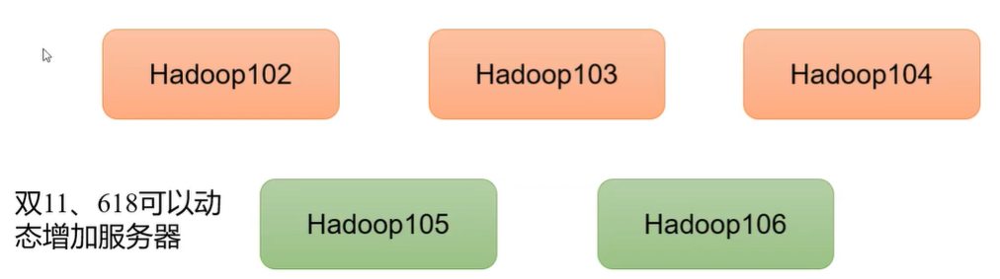
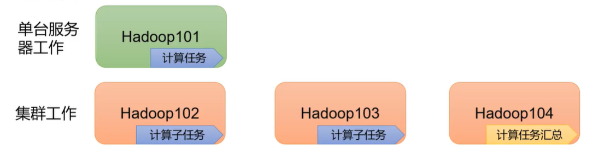
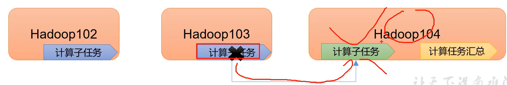
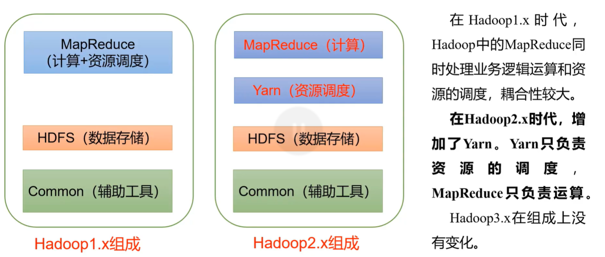
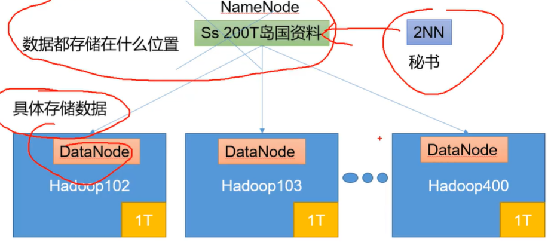
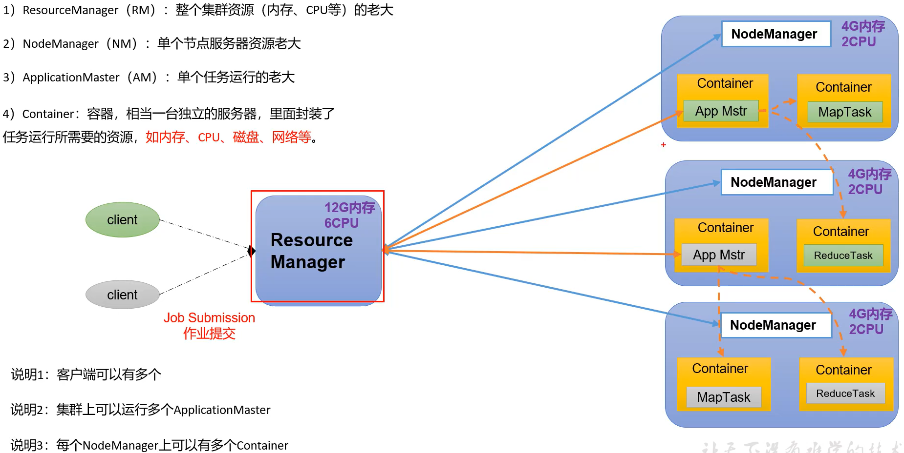
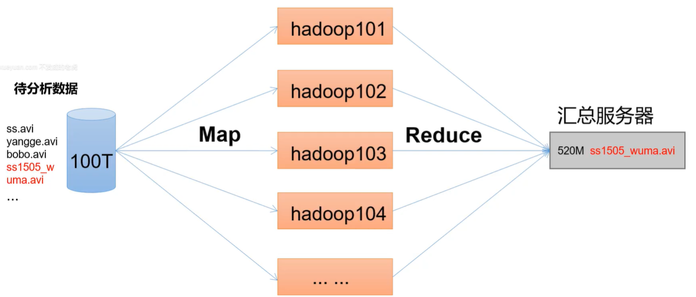
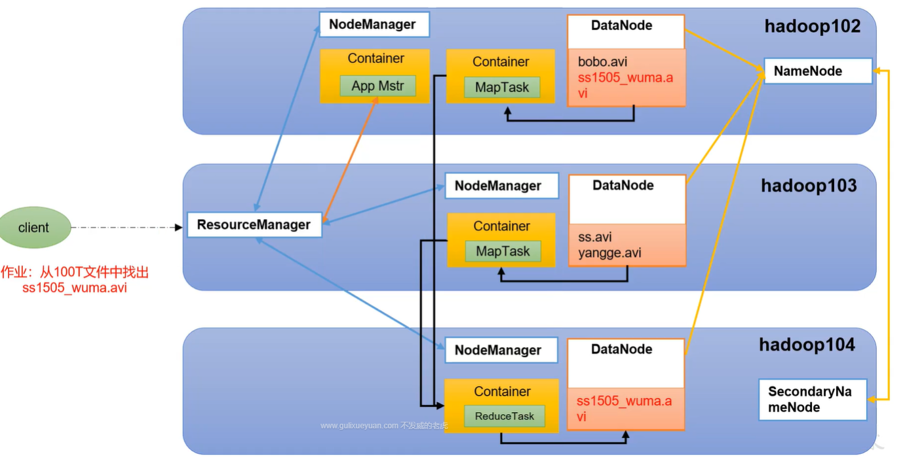

# 1. 大数据的概论

大数据：是指**无法在一定时间**内用常规软件工具对其内容进行抓取、和处理的数据集合，是需要新处理模式才能具有更强的决策力、洞察发现里和流程优化能力的**海量、高增长率**和**多样化**的**信息资产**。

大数据要解决的问题：**海量**数据的**采集**、**存储**和**分析计算**。

大数据的特点（4V)：Volume（大量）、Velocity（高速）、Variety（多样）、Value（低价值密度）

大数据的应用场景：

1. 抖音：推荐的都是你喜欢的视频；

2. 电商推荐

3. 临售：分析消费习惯，提升商品销量：经典案例-纸尿布+啤酒

4. 物流仓储：京东在全国过各地都设有货仓，每个地方仓库里面存储的货物也是根据各地的消费特点存储的，这个特点也少不了大数据的支持，所以京东能做到上午下单下午送达，下午下单次日送达。

5. 人工智能+5G+物联网+虚拟现实

大数据发展前景：

1. 党的十九大提出“推动互联网、大数据、人工智能和实体经济深度融合”
2. 2020年初，中央推出34万亿“新基建”投资计划

# 2. Hadoop入门

## 2.1 Hadoop是什么

1. Hadoop是一个由Apache基金会所研发的**分布式系统**基础架构。

   比如一个**大文件**分散着存储在三个服务器上，三台服务器共同完成一项任务。

2. 主要解决的问题：**海量数据的存储和分析计算**

## 2.2 Hadoop的优势

1. 高可靠性：Hadoop底层维护了多个数据副本，所以即使Hadoop某个计算元素或存储出现故障，也不会导致数据的丢失。

   

2. 高扩展性：在集群间分配任务数据，可方便地扩展数以千计的节点。比如双十一来临之前动态增加服务器

   

3. 高效性：在MapReduce的思想下，Hadoop是并行工作的，以加快任务处理速度。

   

4. 高容错性：能够自动将失败的任务重新分配

   

## 2.3 Hadoop组成

### 2.3.1 HDFS架构概述

NameNode（NN）：存储文件的元素据，如文件名，文件目录结构，文件属性，以及文件的块列表和块所在DataNode等

DataNode（DN）：在本地文件系统存储文件块数据，以及块数据的校验和

Secondary NameNode（2NN)：每隔一段时间对NameNode元数据备份。

### 2.3.2 YARN架构概述

### 2.3.3 MapReduce架构概述

MapReduce将计算过程分为两个阶段：Map和reduce

1. Map阶段并行处理输入数据
2. Reduce阶段对Map结果进行汇总

### 2.3.4 HDFS、YARN和MapReduce三者的关系

1. 首先出现的是HDFS，DataNode负责数据的存储，NameNode负责告诉其他组件，文件存储在哪个节点上。2NN负责辅助NameNode工作，比如NameNode挂了，2NN会负责恢复NameNode的一部分工作，

2. 然后出现的是YARN，负责集群资源的管理
3. 现在有一个客户端向集群提交了一个作业：从100T文件中找出Test001.avi
4. ResourceManager就会找一个节点服务器，开启一个Containner，把这个任务放在containner里，然后App Matser就会向Resource Manager申请资源，申请成功后，就会开启对应的资源，也是在容器中，然后每个maptask负责检索自己节点，这就是Map阶段。
5. 不管MapTask有没有检索到文件都会返回一个结果，如果检索到了，会将结果再次写入磁盘，这就是Reduce阶段，把所有计算结果汇总，写入HDFS。

