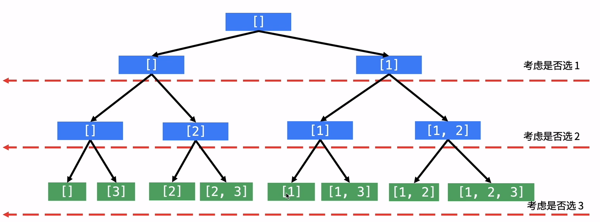
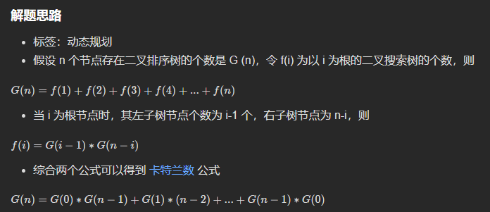

# 一、**链表、栈、队列**

## 0、[时间复杂度与空间复杂度（补充内容）](https://link.zhihu.com/?target=https%3A//www.cxyxiaowu.com/1959.html)

## 1、[删除链表的倒数第 N 个结点(LeetCode 19)](https://leetcode-cn.com/problems/remove-nth-node-from-end-of-list/)

```java
class Solution {
    public ListNode removeNthFromEnd(ListNode head, int n) {
        if(head.next == null) {
            return null;
        }
        int len = n;
        ListNode fast = head; //
        ListNode flow = head;
        ListNode pre = flow;
        while(--len > 0) {
            fast = fast.next;
        }
        while(fast != null && fast.next != null) {
            fast = fast.next;
            pre = flow;
            flow = flow.next;
        }
        pre.next = flow.next;
        if(flow == head) {
            head = head.next;
        }
        flow = null;
        return head;
    }
}
```

## 2、[反转链表（ LeetCode 206 ）](https://leetcode-cn.com/problems/reverse-linked-list/)

```java
class Solution {
    public ListNode reverseList(ListNode head) {
        if(head == null) {
            return null;
        }
        ListNode tail = head;
        ListNode pre = head.next;
        tail.next = null;
        while(pre != null) {
            ListNode temp = pre.next;
            pre.next = tail;
            tail = pre;
            pre = temp;
        }
        return tail;
    }
}
```


## 3、[相交链表（ LeetCode 160 ）](https://leetcode-cn.com/problems/intersection-of-two-linked-lists/)

```java
// 哈希表解法
public class Solution {
    public ListNode getIntersectionNode(ListNode headA, ListNode headB) {
        HashMap<ListNode, Integer> map = new HashMap<>();
        ListNode p = headA, q = headB;
        while(p != null || q != null) {
            if(p != null) {
                if(map.get(p) != null) {
                    return p;
                }else {
                    map.put(p, 0);
                }
                p = p.next;
            }
            if(q != null) {
                if(map.get(q) != null) {
                    return q;
                }else {
                    map.put(q, 0);
                }
                q = q.next;
            }
        }
        return null;
    }
}
// 双指针解法 见题解
```


## 4、[合并两个有序链表 （ LeetCode 21 ）](https://leetcode-cn.com/problems/merge-two-sorted-lists/)

```java
class Solution {
    public ListNode mergeTwoLists(ListNode l1, ListNode l2) {
        ListNode prehead = new ListNode(-1);

        ListNode prev = prehead;
        while (l1 != null && l2 != null) {
            if (l1.val <= l2.val) {
                prev.next = l1;
                l1 = l1.next;
            } else {
                prev.next = l2;
                l2 = l2.next;
            }
            prev = prev.next;
        }
        // 合并后 l1 和 l2 最多只有一个还未被合并完，我们直接将链表末尾指向未合并完的链表即可
        prev.next = l1 == null ? l2 : l1;

        return prehead.next;
    }
}
```

## 5、[分隔链表 （ LeetCode 86 ）](https://leetcode-cn.com/problems/partition-list/)

```java
class Solution {
    public ListNode partition(ListNode head, int x) {
        ListNode sh = new ListNode();
        ListNode s = sh;
        ListNode lh = new ListNode();
        ListNode l = lh;
        while(head != null) {
            if(head.val < x) {
                s.next = head;
                s = s.next;
            }else {
                l.next = head;
                l = l.next;
            }
            head = head.next;
        }
        l.next = null;
        s.next = lh.next;
        return sh.next;
    }
}
```


## 6、[环形链表 II （ LeetCode 142 ）](https://leetcode-cn.com/problems/linked-list-cycle-ii/)

```java
public class Solution {
    public ListNode detectCycle(ListNode head) {
        if(head == null) {
            return null;
        }
        ListNode p1 = head;
        ListNode p2 = head;
        while(p2 !=null) {
            p1 = p1.next;
            if(p2.next == null) {
                return null;
            }
            p2 = p2.next.next;
            if(p1 == p2) {
                ListNode p = head;
                while(p!=p1) {
                    p1 = p1.next;
                    p = p.next;
                }
                return p;
            }
        }
        return null;
    }
}
```

## 7、[反转链表 II （ LeetCode 92 ）](https://leetcode-cn.com/problems/reverse-linked-list-ii/)

```java
class Solution {
    public ListNode reverseBetween(ListNode head, int left, int right) {
        ListNode preHead = new ListNode();
        preHead.next = head;
        ListNode p = head;
        ListNode pre = preHead;
        int l = left;
        while(--l > 0) {
            pre = p;
            p = p.next;
        }
        int n = right - left;
        while(n > 0) {
            ListNode tmp = p.next;
            p.next = tmp.next;
            tmp.next = pre.next;
            pre.next = tmp;
            n--;
        }
        return preHead.next;
    }
}
```


## 8、[复制带随机指针的链表（ LeetCode 138 ）](https://leetcode-cn.com/problems/copy-list-with-random-pointer/)

```java
class Solution {
    public Node copyRandomList(Node head) {
        if(head == null) return null;
        HashMap<Node, Integer> map = new HashMap<>();
        Node p = head;
        int i = 0;
        while(p != null) {  // 统计所有结点的位置
            map.put(p, i++);
            p = p.next;
        }
        p = head;
        int[] arr = new int[i];
        int j = 0;
        while(p != null) { // arr记录第j个节点的random的位置
            if(p.random != null) {
                arr[j++] = map.get(p.random); 
            }else {
                arr[j++] = -1;
            }
            p = p.next;
        }
        Node newHead = new Node(head.val);
        Node p1 = newHead;
        p = head.next;
        int k = 0;
        Node []nodes = new Node[i];
        nodes[k++] = p1; // nodes记录每个新节点的位置
        while(p != null) {  //先复制不带random的节点
            p1.next = new Node(p.val);
            p1 = p1.next;
            nodes[k++] = p1;
            p = p.next;
        }
        p1 = newHead;
        k = 0;
        while(p1 != null) { // 再复制random节点
            int pos = arr[k++]; //random的位置在arr中记录
            if(pos != -1) {
                p1.random = nodes[pos];
            }else {
                p1.random = null;
            }
            p1 = p1.next;
        }
        return newHead;
    }
}
```

## 9、栈

## 10、[有效的括号（ LeetCode 20 ）](https://leetcode-cn.com/problems/valid-parentheses/	)

```java
class Solution {
    public boolean isValid(String s) {
        Stack<Character> stack = new Stack<>();
        char[] chars = s.toCharArray();
        for(char ch : chars) {
            switch(ch) {
                case ')': {
                    if(stack.isEmpty() || stack.pop() != '(') return false;
                } break;
                case ']': {
                    if(stack.isEmpty() || stack.pop() != '[') return false;
                } break;
                case '}': {
                    if(stack.isEmpty() || stack.pop() != '{') return false;
                } break;
                default:
                    stack.push(ch);
                    break;
            }
        }
        return stack.size() == 0;
    }
}
```

## 11、[基本计算器（ LeetCode 224 ）](https://leetcode-cn.com/problems/basic-calculator/)

```java
class Solution {
    //中缀转后缀
    //1）如果遇到操作数，我们就直接将其输出。
    //2）如果遇到操作符，则我们将其放入到栈中，遇到左括号时我们也将其放入栈中。
    //3）如果遇到一个右括号，则将栈元素弹出，将弹出的操作符输出直到遇到左括号为止。注意，左括号只弹出并不输出。
    //4）如果遇到任何其他的操作符，如（“+”， “*”，“（”）等，从栈中弹出元素直到遇到发现更低优先级的元素(或者栈为空)为止。
    // 弹出完这些元素后，才将遇到的操作符压入到栈中。有一点需要注意，只有在遇到" ) "的情况下我们才弹出" ( "，其他情况我们都不会弹出" ( "。
    //5）如果我们读到了输入的末尾，则将栈中所有元素依次弹出。
    public static Deque<String> transfer(String s) {
        s+=' ';
        s = s.replaceAll("\\(-", "(0-");
        char[] chars = s.toCharArray();
        Deque<String> s1 = new LinkedList<>();
        Deque<Character> s2 = new LinkedList<>();
        int num = 0;
        boolean numFlag = false;
        for (char ch: chars) {
            if(ch<='9' && ch >= '0') {
                num = num * 10 + ch - '0';
                numFlag = true;
            }else {
                if (numFlag) {
                    s1.addLast(String.valueOf(num)); // 数字入s1
                }
                num = 0;
                numFlag = false;
                if (ch == ' ') continue;
                if (ch != ')') { // 非数字非')'入s2
                    if (ch != '(') {
                        char c; // ")" s2出栈，压入s1
                        while (!s2.isEmpty() && (c = s2.peekLast()) != '(') {
                            s1.addLast(String.valueOf(c));
                            s2.pollLast();
                        }
                    }
                    s2.addLast(ch);
                }else {
                    char c; // ")" s2出栈，压入s1
                    while(!s2.isEmpty() && (c = s2.pollLast()) != '(') {
                        s1.addLast(String.valueOf(c));
                    }
                }
            }
        }
        while (!s2.isEmpty()) {
            s1.addLast(String.valueOf(s2.pollFirst()));
        }
        return s1;
    }
    public static int calculate(String s) {
        Deque<String> s1 = transfer(s);
        s1.addFirst("0");
        Stack<String> cacSta = new Stack<>();
        while (s1.size() > 0) {
            String pop = s1.pollFirst();
            switch (pop) {
                case "+": {
                    Integer num = Integer.parseInt(cacSta.pop()) + Integer.parseInt(cacSta.pop());
                    cacSta.push(String.valueOf(num));
                } break;
                case "-": {
                    int num1 = Integer.parseInt(cacSta.pop());
                    int num2 = Integer.parseInt(cacSta.pop());
                    cacSta.push(String.valueOf(num2 - num1));
                } break;
                default:{
                    cacSta.push(pop);
                } break;
            }
        }
        return Integer.parseInt(cacSta.pop());
    }
}
```

## 12、[最小栈（ LeetCode 155 ）](https://leetcode-cn.com/problems/min-stack/)

```java
class MinStack {
    Stack<Integer> min;
    Stack<Integer> stack;
    public MinStack() {
        min = new Stack<>();
        stack = new Stack<>();
    }
    public void push(int val) {
        if(min.size() == 0 || min.peek() >= val) {
            min.push(val);
        }
        stack.push(val);
    }
    public void pop() {
        int pop = stack.pop();
        if(pop == min.peek()) {
            min.pop();
        }
    }
    public int top() { 
        return stack.peek();
    }
    public int getMin() {
        return min.peek();
    }
}
```

## 13、[验证栈序列（ LeetCode 946 ）](https://leetcode-cn.com/problems/validate-stack-sequences/submissions/)

```java
class Solution {
    public boolean validateStackSequences(int[] pushed, int[] popped) {
        Stack<Integer> s = new Stack<>();
        int index = 0;
        for(int i=0;i<pushed.length;i++) {
            s.push(pushed[i]);
            while(!s.isEmpty() && s.peek() == popped[index]) {
                s.pop();
                index++;
            }
        }
        return s.isEmpty();
    }
}
```

## 14、[每日温度（ LeetCode 739 ）](https://leetcode-cn.com/problems/daily-temperatures/)

```java
class Solution {
    public int[] dailyTemperatures(int[] temperatures) {
        Stack<Integer> s = new Stack<>();
        int[] ans = new int[temperatures.length];
        for(int i=0;i<temperatures.length;i++ ) {
            while(!s.isEmpty() && temperatures[i] > temperatures[s.peek()]) {
                int peek = s.peek();
                ans[peek] = i - peek;
                s.pop();
            }
            s.push(i);
        }
        return ans;
    }
}
```

## 15、[接雨水（ LeetCode 42 ）](https://leetcode-cn.com/problems/trapping-rain-water/)

```java
// 双指针，计算每个位置上能接的水
class Solution {
    public int trap(int[] height) {
        int l = 0;
        int r = height.length - 1;
        int lm = height[l];
        int rm = height[r];
        int ans = 0;
        while(l < r) {
            if(height[l] < height[r]) {
                ans += lm - height[l];
                l++;
                if(lm < height[l]) lm = height[l];
            }else {
                ans += rm - height[r];
                r--;
                if(rm < height[r]) rm = height[r];
            }
        }
        return ans;
    }
}
```

## 16、队列

17、[用栈实现队列 （ LeetCode 232 ）](https://leetcode-cn.com/problems/implement-queue-using-stacks/)

```java
class MyQueue {
    Stack<Integer> sin ;
    Stack<Integer> sou;
    public MyQueue() {
        sin = new Stack<Integer>();
        sou = new Stack<>();
    }
    public void push(int x) {
        sin.push(x);
    }
    public int pop() {
        if(sou.isEmpty()) {
            while(!sin.isEmpty()) {
                sou.push(sin.pop());
            }
        }
        return sou.pop();
    }
    public int peek() {
        if(sou.isEmpty()) {
            while(!sin.isEmpty()) {
                sou.push(sin.pop());
            }
        }
        return sou.peek();
    }
    public boolean empty() {
        return sin.isEmpty() && sou.isEmpty();
    }
}
```


## 18、[滑动窗口最大值（ LeetCode 239 ）](https://leetcode-cn.com/problems/sliding-window-maximum/)

```java
class Solution {
    public int[] maxSlidingWindow(int[] nums, int k) {
        int n = nums.length;
        int[]res = new int[n-k+1];
        int max = nums[0];
        PriorityQueue<int[]> queue = new PriorityQueue<>(new Comparator<int[]>() {
            @Override
            public int compare(int[] o1, int[] o2) {
                return o1[0] != o2[0] ? o2[0] - o1[0] : o2[1] - o1[1]; // 自定义排序，降序
            }
        });
        for(int i=0;i<k;i++) {
            queue.add(new int[]{nums[i], i});
        }
        int index = 0;
        res[index++] = queue.peek()[0];
        for(int i=k;i<n;i++) {
            queue.add(new int[]{nums[i], i});
            while (queue.peek()[1] <= i - k) { //把队头不是窗口内的元素移出队
                queue.poll();
            }
            res[index++] = queue.peek()[0];
        }
        return res;
    }
}
```


## 19、[设计循环双端队列（ LeetCode 641 ）](https://leetcode-cn.com/problems/design-circular-deque/)

```java
class MyCircularDeque {
    Deque<Integer> deque;
    int capicity = 0;
    public MyCircularDeque(int k) {
        deque = new LinkedList<Integer>();
        capicity = k;
    }
    public boolean insertFront(int value) {
        if (deque.size() >= capicity) {
            return false;
        }
        deque.addFirst(value);
        return true;
    }
    public boolean insertLast(int value) {
        if (deque.size() >= capicity) {
            return false;
        }
        deque.addLast(value);
        return true;
    }
    public boolean deleteFront() {
        if (deque.size() == 0) {
            return false;
        }
        deque.pollFirst();
        return true;
    }
    public boolean deleteLast() {
        if (deque.size() == 0) {
            return false;
        }
        deque.pollLast();
        return true;
    }
    public int getFront() {
        return deque.size() != 0 ? deque.peekFirst() : -1;
    }
    public int getRear() {
        return deque.size() != 0 ? deque.peekLast() : -1;
    }
    public boolean isEmpty() {
        return deque.size() == 0;
    }
    public boolean isFull() {
        return capicity == deque.size();
    }
}
```


## 20、[移除链表元素（ LeetCode 203 ）](https://leetcode-cn.com/problems/remove-linked-list-elements/)

```java
class Solution {
    public ListNode removeElements(ListNode head, int val) {
        ListNode preHead = new ListNode();
        preHead.next = head;
        ListNode p = head;
        ListNode pre = preHead;
        while(p!=null) {
            if(p.val == val) {
                pre.next = p.next;
                p = p.next;
            }else {
                pre = p;
                p = p.next;
            }
        }
        return preHead.next;
    }
}
```


## 21、[K 个一组翻转链表（ LeetCode 25 ）](https://leetcode-cn.com/problems/reverse-nodes-in-k-group/)

```java
class Solution {
    public ListNode reverseKGroup(ListNode head, int k) {
        if(k == 1) {
            return head;
        }
        int count = 1;
        ListNode newHead = new ListNode(-1);
        newHead.next = head;
        ListNode pre = newHead;
        ListNode p = head;
        ListNode tmp = pre.next;
        while(p != null && p.next != null) {
            tmp = pre.next;
            pre.next = p.next;
            p.next = p.next.next;
            pre.next.next = tmp;
            count ++;
            if(count == k) {
                count = 1;
                pre = p;
                p = p.next;
                int count1 = 1;
                ListNode p1 = p;
                while(p1 != null && count1 < k) { //判断剩余的节点是否有k个
                    p1 = p1.next;
                    if(p1 == null) {
                        return newHead.next;
                    }
                    count1 ++;
                }
            }
        }
        return newHead.next;
    }
}
```


## 22、[回文链表（ LeetCode 234 ）](https://leetcode-cn.com/problems/palindrome-linked-list/)

```java
class Solution {
    public boolean isPalindrome(ListNode head) {
        List<Integer> list = new ArrayList<>();
        while(head != null) {
            list.add(head.val);
            head = head.next;
        }
        int len = list.size();
        for(int i=0;i<len/2;i++) {
            if(list.get(i) != list.get(len - i - 1)) {
                return false;
            }
        }
        return true;
    }
}
```


## 23、[奇偶链表（ LeetCode 328 ）](https://leetcode-cn.com/problems/odd-even-linked-list/)

```java
class Solution {
    public ListNode oddEvenList(ListNode head) {
        if(head == null) return null;
        ListNode lp = head;
        ListNode rp = head.next;
        ListNode rh = head.next; // 偶数的头节点
        while(rp != null && rp.next != null) {
            lp.next = rp.next;
            rp.next = rp.next.next;
            lp = lp.next;
            rp = rp.next;
        }
        lp.next = rh;
        return head;
    }
}
```


## 24、[从尾到头打印链表（ 剑指Offer 06 ）](https://leetcode-cn.com/problems/cong-wei-dao-tou-da-yin-lian-biao-lcof/)

```java
class Solution {
    public int[] reversePrint(ListNode head) {
        Stack<Integer> stack = new Stack<>();
        while (head != null) {
            stack.push(head.val);
            head = head.next;
        }
        int[] resArr = new int[stack.size()];
        int size = stack.size();
        for (int i = 0; i < size; i++) {
            resArr[i] = stack.pop();
        }
        return resArr;
    }
}
```


## 25、[链表中倒数第 k 个节点（ 剑指Offer 22 ）](https://leetcode-cn.com/problems/lian-biao-zhong-dao-shu-di-kge-jie-dian-lcof/)

```java
class Solution {
    public ListNode getKthFromEnd(ListNode head, int k) {
        if(head == null) return null;
        ListNode fast = head;
        ListNode slow = head;
        while(fast.next != null) {
            if((--k) <= 0) {
                slow = slow.next;
            }
            fast = fast.next;
        }
        return slow;
    }
}
```

# 二、**递归、排序、贪心**


**n**：数据规模

**k**：“桶”的个数

**In-place**：占用常数内存，不占用额外内存

**Out-place**：占用额外内存

**稳定性**：排序后 2 个相等键值的顺序和排序之前它们的顺序相同

## 1、[递归基础知识]()

## 2、[冒泡排序](https://www.runoob.com/w3cnote/bubble-sort.html)


```java
// 升序
public int[] bubbleSort(int[] arr) {
    int n = arr.length;
    for(int i=0;i<n-1;i++) { //每趟扫描需要将把最大的往后挪
        for(int j=0;j<n-1-i;j++) {
            if(arr[j] > arr[j+1]) {
                int tmp = arr[j];
                arr[j] = arr[j+1];
                arr[j+1] = tmp;
            }
        }
    }
    return arr;
}
```

原本稳定的排序算法，如果将交换条件换成arr[j] >= arr[j+1]，则两个相等的记录就会交换位置，从而变成不稳定的算法。

## 3、[选择排序](https://www.runoob.com/w3cnote/selection-sort.html)


```java
/*
首先在未排序序列中找到最小（大）元素，存放到排序序列的起始位置。
再从剩余未排序元素中继续寻找最小（大）元素，然后放到已排序序列的末尾。
重复第二步，直到所有元素均排序完毕。
*/
// 升序
public int[] selectionSort(int[] arr) {
    int n = arr.length;
    int minIndex = 0; // 最小值索引位置
    for(int i=0;i<n;i++) {
        minIndex = i;
        for(int j=i;j<n;j++) {
            if(arr[minIndex]<arr[j]) {
                minIndex = j;
            }
        }
        if(minIndex!=i) {
            int tmp = arr[minIndex];
            arr[minIndex] = arr[i];
            arr[i] = tmp;
        }
    }
    return arr;
}
```

## 4、[插入排序](https://www.runoob.com/w3cnote/insertion-sort.html)


```java
public class InsertSort implements IArraySort {
    @Override
    public int[] sort(int[] sourceArray) throws Exception {
        // 对 arr 进行拷贝，不改变参数内容
        int[] arr = Arrays.copyOf(sourceArray, sourceArray.length);
        // 从下标为1的元素开始选择合适的位置插入，因为下标为0的只有一个元素，默认是有序的
        for (int i = 1; i < arr.length; i++) {
            // 记录要插入的数据
            int tmp = arr[i];
            // 从已经排序的序列最右边的开始比较，找到比其小的数
            int j = i;
            while (j > 0 && tmp < arr[j - 1]) {
                arr[j] = arr[j - 1];
                j--;
            }
            // 存在比其小的数，插入
            if (j != i) {
                arr[j] = tmp;
            }
        }
        return arr;
    }
}
```


## 5、[快速排序](https://www.runoob.com/w3cnote/quick-sort-2.html)

## 6、[计数排序]()

## 7、[归并排序]()

## 8、[桶排序（了解即可）]()

## 9、[堆排序]()

## 10、[基数排序（了解即可）]()

## 11、[希尔排序（了解即可）]()

## 12、[合并两个有序数组( LeetCode 88 )](https://link.zhihu.com/?target=https%3A//www.algomooc.com/555.html)

```java
class Solution {
    public void merge(int[] nums1, int m, int[] nums2, int n) {
        int mp = m-1;
        int np = n-1;
        int index = m+n-1;
        while(mp>=0 && np>=0) {
            if(nums1[mp]>=nums2[np]) {
                nums1[index--] = nums1[mp--];
            }else {
                nums1[index--] = nums2[np--];
            }
        }
        while(mp>=0) {
            nums1[index--] = nums1[mp--];
        }
        while(np>=0) {
            nums1[index--] = nums2[np--];
        }
    }
}
```

## 13、[颜色分类( LeetCode 75 )](https://leetcode-cn.com/problems/sort-colors/)

```java
class Solution {
    public void sortColors(int[] nums) {
        int n = nums.length;
        int l = 0;
        int r = n - 1;
        while(l< r) {
            if(nums[r] == 2) {
                r--;
                continue;
            }
            if(nums[l] == 2) {
                int tmp = nums[l];
                nums[l] = nums[r];
                nums[r] = tmp;
                r--;
            }
            l++;
        }
        l = 0;
        if (nums[r] == 2) r--;
        while(l<r) {
            if(nums[r] == 1) {
                r--;
                continue;
            }
            if(nums[l] == 1) {
                int tmp = nums[l];
                nums[l] = nums[r];
                nums[r] = tmp;
                r--;
            }
            l++;
        }
    }
}
```

## 14、[部分排序 （面试题 16）](https://leetcode-cn.com/problems/sub-sort-lcci/)

>    这里没有说升序还是降序，这里假设为升序，思路转换为：
>     找到左右两边需要被移动的l和r，那么它们需要满足什么呢？
>     对于l， 是需要找到它的右侧有元素比它小，那么按照升序排列，这里就需要把最小值排序；就是从右向左遍历，记录当前最小值，和当前点比较，一旦大于，则说明需要移动
>     对于r，类似的道理，就是要找到左侧比它大的元素，则需要把大的元素移动过来；这里采用从左往右的遍历方式，记录最大值，和当前点比较，一旦小于，则说明需要移动

```java
class Solution {
    public int[] subSort(int[] array) {
        int[]res = new int[]{-1, -1};
        int n = array.length;
        if(n==0) return res;
        int h = 0;
        int t = n - 1;
        int min = array[t];
        int max = array[0];
        // 从右往左更新最小值
        for(int i=t;i>=0;i--){
            if(array[i] > min) {
                res[0] = i;
            }else {
                min = array[i];
            }
        }
        // 从左往右更新最大值
        for(int i=0;i<=t;i++) {
            if(array[i] < max) {
                res[1] = i;
            }else {
                max = array[i];
            }
        }
        return res;
    }
}
```


15、[计算右侧小于当前元素的个数 ( LeetCode 315)]()

> 归并排序


16、[合并 K 个升序链表（LeetCode 23）]()

## 17、[有序数组的平方( LeetCode 977 )](https://leetcode-cn.com/problems/squares-of-a-sorted-array/)

```java
class Solution {
    public int[] sortedSquares(int[] nums) {
        int n = nums.length;
        int p1 = 0;
        int p2 = n - 1;
        int []res = new int[n];
        int index = n-1;
        while(p1<=p2) {
            int num1 = nums[p1] * nums[p1];
            int num2 = nums[p2] * nums[p2];
            if(num1 >= num2) {
                res[index--] = num1;
                p1++;
            }else {
                res[index--] = num2;
                p2--;
            }
        }
        return res;
    }
}
```


18、[盛最多水的容器 ( LeetCode 11)]()

## 19、[两数之和（LeetCode 1）](https://leetcode-cn.com/problems/two-sum/)

```java
class Solution {
    public int[] twoSum(int[] nums, int target) {
        HashMap<Integer,Integer> map = new HashMap<>();
        int []res = new int[2];
        for(int i=0;i<nums.length;i++ ) {
            int num = target - nums[i];
            Integer numIndex = map.get(num);
            if(numIndex!=null) {
                res[0] = i;
                res[1] = numIndex;
            }
            map.put(nums[i], i);
        }
        return res;
    }
}
```


## 20、二叉堆基础知识

## 21、[分发饼干（ LeetCode 455 ）](https://leetcode-cn.com/problems/assign-cookies/)

```java
class Solution {
    public int findContentChildren(int[] g, int[] s) {
        Arrays.sort(g);
        Arrays.sort(s);
        int gindex = 0;
        int sindex = 0;
        int count = 0;
        while(gindex<g.length && sindex<s.length) {
            while(sindex < s.length) {
                if(s[sindex] >= g[gindex]) {
                    count++;
                    sindex++;
                    break;
                }
                sindex++;
            }
            gindex++;
        }
        return count;
    }
}
```


## 22、[柠檬水找零（ LeetCode 860 ）](https://leetcode-cn.com/problems/lemonade-change/)

```java
class Solution {
    public boolean lemonadeChange(int[] bills) {
        int[] count = new int[3]; //0-5,1-10,2-20
        for(int i=0;i<bills.length;i++) {
            if(bills[i] == 5) {
                count[0] ++;
            }else if(bills[i] == 10) {
                if(count[0] < 1) return false;
                count[1] ++;
                count[0] --;
            }else if(bills[i] == 20) {
                if(!(count[0] >= 3 || (count[0] >= 1 && count[1] >= 1))) return false;
                if(count[0] >= 1 && count[1] >= 1) {
                    count[0] --;
                    count[1] --;
                }else {
                    count[0]-=3;
                }
            }
        }
        return true;
    }
}
```


## 23、[用最少数量的箭引爆气球（ LeetCode 452 ）](https://leetcode-cn.com/problems/minimum-number-of-arrows-to-burst-balloons/)

```java
class Solution {
    public int findMinArrowShots(int[][] points) {
        // 二维数组排序
        Arrays.sort(points, new Comparator<int[]>() {
            @Override
            public int compare(int[] o1, int[] o2) {
                if (o1[1] < o2[1]) return -1;
                else if (o1[1] > o2[1]) return 1;
                else return o1[0] - o2[0];
                //得考虑int溢出 2^31 -1 = 2147483647
//                return o1[1] != o2[1] ? o1[1] - o2[1] : o1[0] - o2[0];
            }
        });
        // 找重合的即可
        int i = 0;
        int j = i + 1;
        int count = 0;
        while(j < points.length) {
            if(points[i][1] < points[j][0]) {
                count ++;
                i = j;
            }
            j++;
        }
        count ++;
        return count;
    }
}
```


## 24、[移掉 K 位数字（ LeetCode 402 ）](https://leetcode-cn.com/problems/remove-k-digits/)

```java
class Solution {
    public String removeKdigits(String num, int k) {
        if (num.length() == k) return "0";
        Deque<Character> s = new LinkedList<>();
        int count = 0;
        for(int i=0;i<num.length();i++) {
            char ch = num.charAt(i);
            while(!s.isEmpty() && count < k && ch < s.peekLast()) {
                s.pollLast();
                count ++;
            }
            s.addLast(ch);
        }
        while (count<k) {
            s.pollLast();
            count++;
        }
        StringBuilder res = new StringBuilder();
        while(s.size() > 1 && s.peekFirst() == '0') {
            s.pollFirst();
        }
        while(!s.isEmpty()) {
            res.append(s.pollFirst());
        }
        return res.toString();
    }
}
```

## 25、[跳跃游戏（ LeetCode 55 ）](https://leetcode-cn.com/problems/jump-game/)

```java
class Solution {
    public boolean canJump(int[] nums) {
        int max = 0; // 定义当前最远可以到达的位置
        for(int i=0;i<nums.length && max >= i; i++) { //遍历条件得加上：当前位置必须不大于max
            // 根据当前位置可以跳跃的下一个位置决定是否需要更新max的值
            if(max < i + nums[i]) {
                max = i + nums[i];
            }
        }
        // 循环结束时，如果max不小于最后一个位置，则返回true
        if(max >= nums.length - 1) {
            return true;
        }
        return false;
    }
}
```


26、[摆动序列（ LeetCode 376 ）](https://link.zhihu.com/?target=https%3A//www.algomooc.com/1341.html)

27、买卖股票的最佳时机 II（ LeetCode 122 ）

28、[三数之和（LeetCode 15）](https://link.zhihu.com/?target=https%3A//www.algomooc.com/1287.html)

29、[最接近三数之和（LeetCode 16）](https://link.zhihu.com/?target=https%3A//www.algomooc.com/1293.html)

30、加油站（ LeetCode 134 ）

31、合并区间（ LeetCode 56 ）

# 三、**搜索算法、回溯算法、位运算、二分查找**

## 1、[二分查找基础知识]()

## 2、[二分查找（ LeetCode 704 ）](https://leetcode-cn.com/problems/binary-search/)

```java
class Solution {
    public int search(int[] nums, int target) {
        int l = 0;
        int r = nums.length - 1;
        int mid;
        while(l <= r) {
            mid = (l + r) / 2;
            if(nums[mid] == target) {
                return mid;
            }
            if(nums[mid] < target) {
                l = mid+1;
            }else {
                r = mid -1;
            }
        }
        return -1;
    }
}
```


## 3、[搜索插入位置（ LeetCode 35 ）](https://leetcode.cn/problems/search-insert-position/)

```java
class Solution {
    public int searchInsert(int[] nums, int target) {
        int l = 0;
        int r = nums.length - 1;
        int m;
        while(l < r) {
            m = (l + r) / 2;
            if(nums[m] == target) return m;
            if(nums[m] < target) l = m + 1;
            if(nums[m] > target) r = m - 1;
        }
        return target > nums[l] ? l+1 : l;
    }
}
```


## 4、[在排序数组中查找元素的第一个和最后一个位置（ LeetCode 34 ）](https://leetcode.cn/problems/find-first-and-last-position-of-element-in-sorted-array/)

```java
// 核心还是二分，只是在找到target之后需要对target左右两侧再进行二分扫描
class Solution {
    int[] res = new int[]{-1, -1};
    public int[] searchRange(int[] nums, int target) {
        func(nums, 0, nums.length - 1, target);
        return res;
    }
    public void func(int[]nums, int l, int r, int target) {
        int m;
        while(l <= r) {
            m = (l + r ) / 2;
            if(nums[m] == target) {
                res[0] = res[0]==-1 ? m : Math.min(res[0], m);
                res[1] = res[1]==-1 ? m : Math.max(res[1], m);
                func(nums, l, m - 1, target); // 对target左侧扫描
                func(nums, m + 1, r, target); // 对target右侧扫描
                return;
            }
            if(nums[m] < target) l = m + 1;
            if(nums[m] > target) r = m - 1;
        }
    }
}
```


## 5、[搜索旋转排序数组（ LeetCode 33 ）](https://leetcode.cn/problems/search-in-rotated-sorted-array/)

```java
class Solution {
    public int search(int[] nums, int target) {
        int l = 0;
        int r = nums.length - 1;
        int m;
        while(l <= r) {
            m = (l + r) / 2;
            if(target == nums[m]) {
                return m;
            }
            int a = nums[l];
            int b = nums[r];
            int nm = nums[m];
            //二分法比较target和nm，然后使用折线图辅助分析讨论target和nm在不同线段上的情况
            if(target < nm) { 
                if(target  < a && nm >= a) {
                    l = m + 1;
                }else {
                    r = m - 1;
                }
            }else {
                if(nm < a && target >= a) {
                    r = m - 1;
                }else {
                    l = m + 1;
                }
            }
        }
        return -1;
    }
}
```


## 6、[搜索二维矩阵（ LeetCode 74 ）](https://leetcode.cn/problems/search-a-2d-matrix/)

```java
/**
等于[i,j]的值返回，大于或等于[i+1,j]向下走，否则向右走
 */
class Solution {
    public boolean searchMatrix(int[][] matrix, int target) {
        int i=0;
        int j = 0;
        int m = matrix.length;
        int n = matrix[0].length;
        while(i<m && j<n && matrix[i][j]<=target) {
            if(matrix[i][j] == target) return true;
            if(i< m-1 && target >= matrix[i + 1][j]) i++; //向右走
            else j++;
        }
        return false;
    }
}
```


7、[寻找两个正序数组的中位数（ LeetCode 4 ）]()

## 8、[有效三角形的个数（ LeetCode 611 ）](https://leetcode.cn/problems/valid-triangle-number/)

```java
class Solution {
	public int triangleNumber(int[] nums) {
        Arrays.sort(nums);
        int n = nums.length;
        int count = 0;
        for(int i=0;i<n;i++) {
            int a = nums[i];
            for(int j=i+1;j<n-1;j++) {
                int b = nums[j];
                //升序，若nums[k]<a+b成立，则nums[k] - a < b && nums[k]-b < a一定成立
                for(int k=j+1;k<n && nums[k]<a+b ;k++) {
                    count++;
                }
            }
        }
        return count;
    }
}
```

## 9、[剑指 Offer 53 – II. 0～n-1中缺失的数字](https://leetcode.cn/problems/que-shi-de-shu-zi-lcof/)

```java
class Solution {
    public int missingNumber(int[] nums) {
        int l = 0;
        int r = nums.length-1;
        if(nums[r] == r) return r+1;
        if(nums[0] != 0) return 0;
        int m;
        while(l <= r) {
            m = (l + r) / 2;
            if(m== nums[m]) {  //相等，则右边缺失
                l = m+1;
            }else { // 不可能小于m,所以num > m 则左边缺失
                r = m - 1;
            }
        }
        return l>=r?l:r;
    }
}
```


## 10、[剑指 Offer 53 – I. 在排序数组中查找数字 I](https://leetcode.cn/problems/zai-pai-xu-shu-zu-zhong-cha-zhao-shu-zi-lcof/)

```java
class Solution {
    int[] res = new int[]{-1,-1};
    public int search(int[] nums, int target) {
        func(nums, target, 0, nums.length-1);
        return res[0]==-1?0:res[1] - res[0] + 1;
    }

    public void func(int []nums,int target,int l, int r) {
        int m;
        while(l<=r) {
            m = (l + r) /2;
            if(nums[m] == target) {
                res[0] = res[0]==-1?m:Math.min(res[0],m);
                res[1] = res[1]==-1?m:Math.max(res[1],m);
                func(nums, target, l, m-1);
                func(nums, target, m+1, r);
                return;
            }
            if(nums[m] > target) {
                r = m-1;
            }else {
                l = m+1;
            }
        }
    }
}
```


11、[剑指 Offer 51. 数组中的逆序对]()

## 12、[寻找峰值（ LeetCode 162 ）](https://leetcode.cn/problems/find-peak-element/)

```java
class Solution {
    int res = -1;
    public int findPeakElement(int[] nums) {
        if(nums.length == 1) return 0;
        func(nums, 0, nums.length-1, 0);
        if(res==-1) func(nums, 0, nums.length-1, 1);
        return res;
    }
    /**
    每次二分的位置判断其是否满足条件，如果满足终止循环和递归，如果不满足继续扫描其左右两侧
     */
    public void func(int[] nums, int l, int r, int flag) {
        int m;
        while(l<=r) {
            m = (l + r) / 2;
            if((m == 0 && nums[m] > nums[m+1]) 
            || (m>0 && m == nums.length-1 && nums[m]>nums[m-1])
            || (m>0&& m<nums.length-1 && nums[m] > nums[m-1] && nums[m] > nums[m+1])) {
                res = m;
                return;
            }
            func(nums, l, m-1,flag);
            func(nums, m+1, r,flag);
            if(flag==0) r=m-1;
            else l=m+1;
        }
    }
}
```


## 13、[第一个错误的版本（ LeetCode 278 ）]()

```java
/* The isBadVersion API is defined in the parent class VersionControl.
      boolean isBadVersion(int version); */

public class Solution extends VersionControl {
    public int firstBadVersion(int n) {
        int l = 1;
        int r = n;
        while(l<r) {
            // m = (l+r)/2; //溢出
            int m =l+(r-l)/2; //防止溢出（溢出超时）
            if(isBadVersion(m)) {
                r=m;
            }else {
                l=m+1;
            }
        }
        return l;
    }
}
```

## 14、[山脉数组的峰顶索引（ LeetCode 852 ）](https://leetcode.cn/problems/peak-index-in-a-mountain-array/)

```java
class Solution {
    public int peakIndexInMountainArray(int[] arr) {
        int l=0;
        int r=arr.length-1;
        int m;
        while(l<r) {
            m=(l+r)/2;
            if(m==arr.length-1) {r=m-1;continue;}
            if(m==0) {l=m+1;continue;}
            if(arr[m]>arr[m-1] && arr[m]>arr[m+1]) {
                return m;
            }
            if(arr[m] > arr[m-1]) l = m+1;
            else r = m-1;
        }
        return l;
    }
}
```

## 15、[有效的完全平方数（ LeetCode 367 ）](https://leetcode.cn/problems/valid-perfect-square/)

```java
/**
此题要注意int溢出问题
int的最大值是2^31 - 1，超出会变成负数
 */
class Solution {
    public boolean isPerfectSquare(int num) {
        long l=1;
        long r=num;
        long m;
        while(l<=r) {
            m = l + (r - l)/2;
            long s = m * m; //强转long
            if(s == num) return true;
            if(s < num) l = m+1;
            else r = m-1; 
        }
        return false;
    }
}
```


## 16、[位运算基础知识](https://link.zhihu.com/?target=https%3A//www.algomooc.com/1158.html)

## 17、[丢失的数字（ LeetCode 268 ）](https://leetcode.cn/problems/missing-number/)

```java
class Solution {
    // 
    public int missingNumber(int[] nums) {
        int n = nums.length;
        int xor = 0;
        for(int i=0;i<n;i++) 
            xor ^= nums[i];
        for(int i=0;i<=n;i++) 
            xor ^= i;
        return xor;
    }
    // 二分法
    // public int missingNumber(int[] nums) {
        // Arrays.sort(nums);
        // int n = nums.length;
        // if(nums[0] != 0) return 0;
        // if(nums[n - 1] != n) return n;
        // int l=0;
        // int r = n-1;
        // int m;
        // while(l<r) {
        //     m =(l+r)/2;
        //     if(nums[m] > m && nums[m-1] <m) return m;
        //     if(nums[m] == m) l=m+1;
        //     else if(nums[m] > m) r = m-1;
        // }
        // return l;
    // }
}
```


## 18、[2 的幂（ LeetCode 231 ）](https://leetcode.cn/problems/power-of-two/submissions/)

```java
class Solution {
    // 判断n是否是2^30的约数
    public boolean isPowerOfTwo(int n) {
        int m = 1<<30;
        return n>0 && m %n==0;
    }
    // 传统方式
    // public boolean isPowerOfTwo(int n) {
    //     if(n==1) return true;
    //     int s=1;
    //     for(int i=1;i<31;i++) {
    //         s*=2;
    //         if(n == s) return true;
    //         if(n< s) return false;
    //     }
    //     return false;
    // }
}
```


## 19、[比特位计数（ LeetCode 338 ）](https://leetcode.cn/problems/counting-bits/)

```java
class Solution {

    // 官解牛逼
    public int[]  countBits(int n) {
        int[] ans = new int[n + 1];
        for(int i=0;i<=n;i++ ) {
            ans[i] = ans[i>>1] + (i & 1);
        }
        return ans;
    }

    // 我的笨方法
    // public int[] countBits(int n) {
    //     int [] ans = new int[n+1];
    //     for(int i=0;i<=n;i++ ) {
    //         int k = i;
    //         int sum = 0;
    //         while(k>0) {
    //             sum += k%2;
    //             k>>=1;
    //         }
    //         ans[i] = sum;
    //     }
    //     return ans;
    // }
}
```


## 20、[位 1 的个数（ LeetCode 191 ）](https://leetcode.cn/problems/number-of-1-bits/)

```java
public class Solution {
    // you need to treat n as an unsigned value
    public int hammingWeight(int n) {
        int sum = 0;
        for(int i=0;i<32;i++) {
            sum += n&1;
            n>>=1;
        }
        return sum;
    }
}
```


## 21、[只出现一次的数字 II（ LeetCode 137 ）](https://leetcode.cn/problems/single-number-ii/)

```java
class Solution {
    public int singleNumber(int[] nums) {
        int n = nums.length;
        HashMap<Integer, Integer> map = new HashMap<>(n);
        for (int i = 0; i < n; i++) {
            map.put(nums[i], map.getOrDefault(nums[i], 0) + 1);
        }
        Set<Integer> keys = map.keySet();
        for (Integer key : keys) {
            if (map.get(key) == 1) return key;
        }
        return 0;

    }
}
```


## 22、[只出现一次的数字 III（ LeetCode 260 ）](https://leetcode.cn/problems/single-number-iii/)

```java
class Solution {
    public int[] singleNumber(int[] nums) {
        int xorsum = 0;
        for (int num : nums) {
            xorsum ^= num;
        }
        // 为什么要取最低有效位？
        // 因为它是我们对两个数字划分的一种方式，当两个数字的异或某位值为1时，必然存在两个数字在此位上的值不相同
        // 我们取最低有效位，其实是一种划分，其实取任意一位都可以
        // 因为位运算中，取最低位的1比较方便，所以可选的情况下通常选取最低位
        
        // 举例：5（100）B 2(10)B 3（11）B 3（11）B 
        // 答案[5,2],异或是：(110)B
        
        // 最低有效位对应的值是 2（10）B
        // 对于5 此位是0，对于2 此位是1，就可以把两个数分开 
        
        // 然后我们就想，这个方式有没有不成立的情况呢？
        // 1. 当这两个数相等的时候，不成立，找不到最低有效位。但是他们相等是违背“出现一次”的题目要求的
        
        // 2. 当剩余数字出现两次在两个分类中各一种的情况下不成立。
        // 但这个是不可能的，对于同一个数字，它的某个数位是不会变化的，所以最终只能归为一类
        
        // 因为该数字总体上会出现偶数次，所以它的每个数位的1也会出现两次，又只能归为一类
        // 最终必然抵消，不会对结果产生影响
        
        // 上述例子中， 3 因为和  2（10）B 与 2（10）B 非0，和2划分为一类
        //3(11)B 与 2（10）B 是0，划分为另一类
        // type1=[2,3,3] type2=[5]
        // 第一部分异或得到2，第二部分异或得到5，从而返回结果
        
        // 综上，可以通过获取最低有效位把两个数分开

        // 防止溢出
        // 因为二进制有正负0，负零用于多表示一位负数，这个负数如果取相反数，会产生溢出，所以不能用 a & (-a) 取最低有效位
        // 负0的特点是第一位是1，其余位是0，所以它的最低有效位就是自己
        int lsb = (xorsum == Integer.MIN_VALUE ? xorsum : xorsum & (-xorsum));
        int type1 = 0, type2 = 0;
        for (int num : nums) {
            if ((num & lsb) != 0) {
                type1 ^= num;
            } else {
                type2 ^= num;
            }
        }
        return new int[]{type1, type2};
    }
}
```


## 23、[最大单词长度乘积（ LeetCode 318 ）]()

```java
class Solution {
    public int maxProduct(String[] words) {
        int n = words.length;
        // masks[i] 是个26bit的int，每个位置上的1代表i单词在这个位置上有字母（从右往左是a-z）
        int []masks = new int[n]; 
        String str;
        for(int i=0;i<n;i++) {
            str = words[i];
            for(int j=0;j<str.length();j++)  {
                // 把单词中的字母填充到26bit的masks[i]对应的位置上
                masks[i] |= 1 << (str.charAt(j) - 'a'); 
            }
        }
        int res = 0;
        for(int i=0;i<n-1;i++) {
            for(int j=i+1;j<n;j++) {
                if((masks[i] & masks[j]) == 0) {  // masks[i,j]的1错位，表示两个单词没有重复字母
                    res = Math.max(res, words[i].length() * words[j].length());
                }
            }
        }
        return res;
    }
}
```


## 24、[汉明距离（ LeetCode 461 ）](https://leetcode.cn/problems/hamming-distance/)

```java
class Solution {
    public int hammingDistance(int x, int y) {
        int res = 0;
        int n =  x ^ y;
        while(n>0 ) {
            res += n & 1;
            n >>= 1;
        }
        return res;
    }
}
```


## 25、[回溯基础知识]()

## 26、[岛屿数量（ LeetCode 200 ）](https://leetcode.cn/problems/number-of-islands/)

```java
class Solution {
    public void dfs(char[][] grid, int r, int c) {
        int nr = grid.length;
        int nc = grid[0].length;
        if(r<0 || c<0 || r>=nr || c>=nc || grid[r][c]=='0') return;

        // 把该岛屿中每个网格变成0
        grid[r][c] = '0';
        dfs(grid, r-1, c); // 上
        dfs(grid, r+1, c); // 下
        dfs(grid, r, c-1); // 左
        dfs(grid, r, c+1); // 右
    }
    public int numIslands(char[][] grid) {
        int nr = grid.length;
        int nc = grid[0].length;
        int res = 0;
        for(int i=0; i<nr; i++) {
            for(int j=0;j<nc;j++) {
                if(grid[i][j]=='1') {
                    ++res; // 遇到1 岛屿数量加1
                    dfs(grid, i, j);  // 把该岛屿上所有网格变成0
                }
            }
        }
        return res;
    }
}
```


## 27、[N 皇后（ LeetCode 51 ）](https://leetcode.cn/problems/n-queens/)

```java
class Solution {
    static int [][] matrix;
    public static List<List<String>> solveNQueens(int n) {
        List<List<String>> res = new ArrayList<>();
        matrix = new int[n][n];
        dfs(n, 0, res);
        return res;
    }
    public static void dfs(int n, int idx, List<List<String>> res) {
        if(idx == n) {
//            System.out.println(Arrays.deepToString(matrix));
            List<String> ress = new ArrayList<>();
            for(int i=0;i<n;i++) {
                StringBuilder sb = new StringBuilder();
                for(int j=0;j<n;j++) {
                    sb.append(matrix[i][j]==1?"Q":".");
                }
                ress.add(sb.toString());
            }
            res.add(ress);
            return;
        }
        for(int i=0;i<n;i++) {
            if(idx > 0 && isDen(idx, i)) continue; // 危险，此位置不能落子
            matrix[idx][i] = 1;
            dfs(n, idx+1, res);
            matrix[idx][i] = 0;
        }
    }
    // 判断已经存在的是否能相互攻击
    public static boolean isDen(int r, int c) {
        int cha = r-c;
        int sum = r+c;
        for(int i=0;i<=r;i++) {
            for(int j=0;j<matrix.length;j++) {
                if(matrix[i][j] == 1) {
                    if(i==r || j==c) return true;
                    if(i-j == cha || i+j==sum) return true;
                }
            }
        }
        return false;
    }
}
```


## 28、[子集（ LeetCode 78 ）](https://leetcode.cn/problems/subsets/)



左边不加入当前元素到Path中，右边考虑将当前元素加入到Path中

```java
class Solution {
    public List<List<Integer>> subsets(int[] nums) {
        int n = nums.length;
        Deque<Integer> path = new LinkedList<>();
        List<List<Integer>> res = new ArrayList<>();
        int index=0; // nums的索引下标
        dfs(nums, n, index, path, res);
        return res;
    }
    public void dfs(int[] nums, int n, int index, Deque<Integer> path, List<List<Integer>> res) {
        // 递归终止条件
        if(index == n) {
            res.add(new ArrayList<>(path));
            return;
        }
        // 考虑路径中不加入当前元素，则直接将index后移
        dfs(nums, n, index+1, path, res);

        //考虑路径中加入当前元素
        path.addLast(nums[index]);
        dfs(nums, n, index+1, path, res);
        // 回溯，移除添加的元素，清理现场
        path.pollLast();
    }
}
```


## 29、[组合总和 II（ LeetCode 40 ）](https://leetcode.cn/problems/combination-sum-ii/)

```java
// 考虑与39题对比
// 借用树形结构思考题目
class Solution {
    public static int pathSum = 0;

    public static List<List<Integer>> combinationSum2(int[] candidates, int target) {
        Arrays.sort(candidates);
        List<List<Integer>> res = new ArrayList<>();
        Deque<Integer> path = new LinkedList<>();
        int idx = 0;
        dfs(candidates, idx, path, res, target);
        return res;
    }

    public static void dfs(int[] candidates, int idx, Deque<Integer> path, List<List<Integer>> res, int target) {
        if(pathSum == target) {
            res.add(new ArrayList<>(path));
            return;
        }
        if(pathSum > target) return;

        for (int i = idx; i < candidates.length; i++) {
            // if(i > idx && candidates[i] == candidates[i-1]) continue;
            path.addLast(candidates[i]);
            pathSum += candidates[i];
            dfs(candidates, i + 1, path, res, target);
            pathSum -= path.pollLast();
            // 遇到连续的就跳过，这种写法比上面的if写法更容易理解
            while(i < candidates.length-1 && candidates[i] == candidates[i+1]) 
                i++;
        }
    }

}
```


## 30、[括号生成（ LeetCode 22 ）](https://leetcode.cn/problems/generate-parentheses/)

```java
class Solution {
    public List<String> generateParenthesis(int n) {
        List<String> res = new ArrayList<>();
        dfs(new StringBuilder(), 0, 0, res, n);
        return res;
    }
    public void dfs(StringBuilder path, int l, int r, List<String> res, int n) {
        if(l == n && r == n) {
            res.add(path.toString());
            return;
        }
        if(l < n) {
            path.append('(');
            dfs(path, l+1, r, res, n);
            path.deleteCharAt(path.length()-1);
        }
        if(r < l) {
            path.append(')');
            dfs(path, l, r+1, res, n);
            path.deleteCharAt(path.length()-1);
        }
    }
}
```


## 31、[火柴拼正方形（ LeetCode 473 ）](https://leetcode.cn/problems/matchsticks-to-square/)

```java
class Solution {
    public static boolean makesquare(int[] matchsticks) {
        Arrays.sort(matchsticks);
        int n = matchsticks.length;
        int sum = 0;
        for(int i=0;i<n;i++) sum += matchsticks[i];
        int target = sum / 4;
        if((sum & 3) != 0 || matchsticks[n-1] > target) return false;
        //回溯，从最长的火柴开始
        return dfs(matchsticks, n - 1, new int[4], target);
    }
    /*
    idx表示访问到当前火柴的位置，target表示正方形的边长，edges是长度为4的数组，
    分别保存正方形4个边的长度
     */
    static Boolean dfs(int[] matchsticks, int idx, int[] edges, int target)
    {
        if (idx == -1){
            return edges[0] == edges[1] && edges[1] == edges[2] && edges[2] == edges[3];
        }
        for(int i=0;i<4;i++) {
            /*
            如果把当前火柴放到edges[i]这个边上，他的长度大于target，我们直接跳过。或者
            edges[i] == edges[i - 1]即上一个分支的值和当前分支的一样，上一个分支没有成功，
            说明这个分支也不会成功，直接跳过即可。
             */
            if (edges[i] + matchsticks[idx] > target || (i > 0 && edges[i] == edges[i-1])) continue;
            //如果当前火柴放到edges[i]这个边上，长度不大于target，我们就放上面
            edges[i] += matchsticks[idx];
            //然后在放下一个火柴，如果最终能变成正方形，直接返回true
            if (dfs(matchsticks, idx - 1, edges, target)) return true;
            //如果当前火柴放到edges[i]这个边上，最终不能构成正方形，我们就把他从
            //edges[i]这个边上给移除，然后在试其他的边
            edges[i] -= matchsticks[idx];
        }
        //如果不能构成正方形，直接返回false
        return false;
    }
}
```


32、[接雨水 II（ LeetCode 407 ）]()

## 33、[组合（ LeetCode 77 ）]()

```java
// 我第一遍的写法
class Solution {
    public List<List<Integer>> combine(int n, int k) {
        List<List<Integer>> res = new ArrayList<>();
        Deque<Integer> path = new LinkedList<>();
        dfs(n, k, 1, path, res);
        return res;
    }
    public void dfs(int n, int k, int idx, Deque<Integer> path, List<List<Integer>> res) 	{
        if(path.size() == k) {
            res.add(new ArrayList<>(path));
            return;
        }
        for(int i=idx;i<=n;i++) {
            if(path.size()>0 && i<=(int)path.peekLast()) continue;
            path.addLast(i);
            dfs(n, k, idx+1, path, res);
            path.pollLast();
        }
    }
}
// 改进后
class Solution {
    public List<List<Integer>> combine(int n, int k) {
        List<List<Integer>> res = new ArrayList<>();
        Deque<Integer> path = new LinkedList<>();
        dfs(n, k, 1, path, res);
        return res;
    }
    public void dfs(int n, int k, int idx, Deque<Integer> path, List<List<Integer>> res) 	{
        // 剪枝：temp 长度加上区间 [cur, n] 的长度小于 k，不可能构造出长度为 k 的 temp
        if(path.size() + (n-idx+1) < k) return;
        if(path.size() == k) {
            res.add(new ArrayList<>(path));
            return;
        }
        // 不考虑当前元素
        dfs(n, k, idx+1, path, res);

        // if(path.size()>0 && idx<=(int)path.peekLast()) return;
        path.addLast(idx);
        dfs(n, k , idx + 1, path, res);
        path.pollLast();
    }
}
```


## 34、[组合总和 Ⅲ（ LeetCode 216 ）]()

```java
// 使用循环
class Solution {
    public List<List<Integer>> combinationSum3(int k, int n) {
        List<List<Integer>> res = new ArrayList<>();
        Deque<Integer> path = new LinkedList<>();
        Integer sum = 0;
        dfs(k, n, 1, path, res, sum);
        return res;
    }
    void dfs(int k, int n, int idx, Deque<Integer> path, List<List<Integer>> res, Integer sum) {
        if (path.size() < k && sum > n) return;
        if(sum == n && path.size() == k) {
            res.add(new ArrayList<>(path));
            return ;
        }

        for (int i = idx; i < 10; i++) {
            path.addLast(i);
            sum += i;
            dfs(k, n, i+1, path, res, sum);
            sum -= i;
            path.pollLast();
        }
    }
}
// 不要循环的写法
class Solution {
    public List<List<Integer>> combinationSum3(int k, int n) {
        List<List<Integer>> res = new ArrayList<>();
        Deque<Integer> path = new LinkedList<>();
        Integer sum = 0;
        dfs(k, n, 1, path, res, sum);
        return res;
    }
    void dfs(int k, int n, int idx, Deque<Integer> path, List<List<Integer>> res, Integer sum) {
        if (path.size() < k && sum > n) return;
        if(sum == n && path.size() == k) {
            res.add(new ArrayList<>(path));
            return ;
        }
        if (idx > 9) return;
        dfs(k, n, idx+1, path, res, sum);
        // 考虑当前元素
        path.addLast(idx);
        sum += idx;
        dfs(k, n, idx+1, path, res, sum);
        sum -= idx;
        path.pollLast();
    }
}
```


## 35、[分割回文串（ LeetCode 131 ）](https://leetcode.cn/problems/palindrome-partitioning/)

```java
class Solution {
    public List<List<String>> partition(String s) {
        int len = s.length();
        Deque<String> path = new ArrayDeque<>();
        List<List<String>> res = new ArrayList<>();
        dfs(s.toCharArray(), 0, len, path, res);
        return res;
    }
    public void dfs(char[] chs, int idx, int len, Deque<String> path, List<List<String>> res) {
        if(idx == len) {
            res.add(new ArrayList<>(path));
        }
        for(int i=idx;i<len;i++) {
            if(!isRnn(chs, idx, i)) continue;
            path.addLast(new String(chs, idx, i - idx + 1));
            dfs(chs, i+1, len, path, res);
            path.removeLast();
        }
    }
    public Boolean isRnn(char[] chs, int l, int r) {
        while(l < r) {
            if(chs[l] != chs[r]) return false;
            l++;
            r--;
        }
        return true;
    }
}
```


## 36、[全排列（ LeetCode 46 ）]()

```java
class Solution {
    public List<List<Integer>> permute(int[] nums) {
        Deque<Integer> path = new ArrayDeque<>();
        List<List<Integer>> res = new ArrayList<>();
        int n = nums.length;
        dfs(nums, 0, n, path, res);
        return res;
    }
    void dfs(int[] nums, int idx, int n, Deque<Integer> path, List<List<Integer>> res) {
        if(idx == n) {
            res.add(new ArrayList(path));
            return;
        }
        for(int i=0;i<n;i++) {
            if(path.contains(nums[i])) continue;
            path.addLast(nums[i]);
            dfs(nums, idx+1, n, path, res);
            path.pollLast();
        }
    }
}
```

# 四、**二叉树**

## 1、[二叉树基础知识]()

## 2、[二叉树的前序遍历（ LeetCode 144 ）](https://leetcode.cn/problems/binary-tree-preorder-traversal/)

```java
class Solution {
    public List<Integer> preorderTraversal(TreeNode root) {
        List<Integer> res = new ArrayList<>();
        preTra(root, res);
        return res;
    }
    public void preTra(TreeNode root, List<Integer> res) {
        if(root == null) return;
        res.add(root.val);
        preTra(root.left, res);
        preTra(root.right, res);
    }
}
```


## 3、[二叉树的中序遍历（ LeetCode 94 ）]()

```java
/**
 * Definition for a binary tree node.
 * public class TreeNode {
 *     int val;
 *     TreeNode left;
 *     TreeNode right;
 *     TreeNode() {}
 *     TreeNode(int val) { this.val = val; }
 *     TreeNode(int val, TreeNode left, TreeNode right) {
 *         this.val = val;
 *         this.left = left;
 *         this.right = right;
 *     }
 * }
 */
class Solution {
    public List<Integer> inorderTraversal(TreeNode root) {
        List<Integer> list = new ArrayList<>();
        Deque<TreeNode> s = new LinkedList<>();
        if (root != null) {
            while(s.size() != 0 || root != null) {
                while(root!= null) {
                    s.addLast(root);
                    root = root.left;
                }
                root = s.pollLast();
                list.add(root.val);
                root = root.right;
            }
        }
        return list;
    }
}

```


## 4、[二叉树的后序遍历（ LeetCode 145 ）]()

```java
/**
 * Definition for a binary tree node.
 * public class TreeNode {
 *     int val;
 *     TreeNode left;
 *     TreeNode right;
 *     TreeNode() {}
 *     TreeNode(int val) { this.val = val; }
 *     TreeNode(int val, TreeNode left, TreeNode right) {
 *         this.val = val;
 *         this.left = left;
 *         this.right = right;
 *     }
 * }
 */
class Solution {
    List<Integer> list = new ArrayList<>();
    //======递归算法=====
    // public List<Integer> postorderTraversal(TreeNode root) {
    //     if(root != null) {
    //         postorderTraversal(root.left);
    //         postorderTraversal(root.right);
    //         list.add(root.val);
    //     }
    //     return list;
    // }
    //=======非递归======
    public List<Integer> postorderTraversal(TreeNode root) {
        List<Integer> res = new ArrayList<Integer>();
        if (root == null) {
            return res;
        }
        Deque<TreeNode> stack = new LinkedList<TreeNode>();
        TreeNode prev = null;
        while (root != null || !stack.isEmpty()) {
            while (root != null) {
                stack.push(root);
                root = root.left;
            }
            root = stack.pop();
            if (root.right == null || root.right == prev) {
                res.add(root.val);
                prev = root;
                root = null;
            } else {
                stack.push(root);
                root = root.right;
            }
        }
        return res;
    }
}
```


## 5、[二叉树的层序遍历（ LeetCode 102 ）]()

```java
/**
 * Definition for a binary tree node.
 * public class TreeNode {
 *     int val;
 *     TreeNode left;
 *     TreeNode right;
 *     TreeNode() {}
 *     TreeNode(int val) { this.val = val; }
 *     TreeNode(int val, TreeNode left, TreeNode right) {
 *         this.val = val;
 *         this.left = left;
 *         this.right = right;
 *     }
 * }
 */
class Solution {
    public List<List<Integer>> levelOrder(TreeNode root) {
        List<List<Integer>> res = new ArrayList<>();
        List<Integer> lev = new ArrayList<>();
        Deque<TreeNode> s = new LinkedList<>();
        if(root == null) return res;
        s.addLast(root);
        while(!s.isEmpty()) {
            int size = s.size();
            for(int i=0;i<size;i++) {
                TreeNode pop = s.pollFirst();
                lev.add(pop.val);
                if(pop.left != null) 
                    s.addLast(pop.left);
                if(pop.right != null)
                    s.addLast(pop.right);
            }
            res.add(lev);
            lev = new ArrayList<>();
        }
        return res;
    }
}
```

## 6、[二叉树的锯齿形层序遍历（ LeetCode 103 ）](https://leetcode.cn/problems/binary-tree-zigzag-level-order-traversal/)

```java
/**
 * Definition for a binary tree node.
 * public class TreeNode {
 *     int val;
 *     TreeNode left;
 *     TreeNode right;
 *     TreeNode() {}
 *     TreeNode(int val) { this.val = val; }
 *     TreeNode(int val, TreeNode left, TreeNode right) {
 *         this.val = val;
 *         this.left = left;
 *         this.right = right;
 *     }
 * }
 */
class Solution {
    public List<List<Integer>> zigzagLevelOrder(TreeNode root) {
        List<List<Integer>> res = new ArrayList<>();
        List<Integer> lev = new ArrayList<>();
        Deque<TreeNode> s = new LinkedList<>();
        if(root == null) return res;
        s.addLast(root);
        boolean flag = true;
        while(!s.isEmpty()) {
            int size = s.size();
            for(int i=0;i<size;i++) {
                TreeNode pop = s.pollFirst();
                if(flag) //比102多一个判断
                    lev.add(pop.val);
                else
                    lev.add(0,pop.val);
                if(pop.left != null) 
                    s.addLast(pop.left);
                if(pop.right != null)
                    s.addLast(pop.right);
            }
            flag = !flag;
            res.add(lev);
            lev = new ArrayList<>();
        }
        return res;
    }
}
```


7、[从前序与中序遍历序列构造二叉树（ LeetCode 105 ）](https://link.zhihu.com/?target=https%3A//www.algomooc.com/800.html)

## 8、[路径总和 II（ LeetCode 113 ）](https://leetcode.cn/problems/path-sum-ii/)

```java
/**
 * Definition for a binary tree node.
 * public class TreeNode {
 *     int val;
 *     TreeNode left;
 *     TreeNode right;
 *     TreeNode() {}
 *     TreeNode(int val) { this.val = val; }
 *     TreeNode(int val, TreeNode left, TreeNode right) {
 *         this.val = val;
 *         this.left = left;
 *         this.right = right;
 *     }
 * }
 */
class Solution {
    public List<List<Integer>> pathSum(TreeNode root, int targetSum) {
        Deque<Integer> path = new ArrayDeque<>();
        List<List<Integer>> res = new ArrayList<>();
        int sum = 0;
        dfs(root, targetSum, sum, path, res);
        return res;
    }
    void dfs(TreeNode root, int targetSum, int sum, Deque<Integer> path, List<List<Integer>> res) {
        if(root == null) return;
        path.addLast(root.val);
        sum += root.val;
        if(root.left==null && root.right == null && sum == targetSum) {
            res.add(new ArrayList<>(path));
        }
        dfs(root.left, targetSum, sum, path, res);
        dfs(root.right, targetSum, sum, path, res);
        path.pollLast();
        sum-=root.val;

    }
}
```


## 9、[二叉树的最近公共祖先（ LeetCode 236 ）]()

```java
/**
 * Definition for a binary tree node.
 * public class TreeNode {
 *     int val;
 *     TreeNode left;
 *     TreeNode right;
 *     TreeNode(int x) { val = x; }
 * }
 */
class Solution {
    public TreeNode lowestCommonAncestor(TreeNode root, TreeNode p, TreeNode q) {
        List<List<Integer>> paths = new ArrayList<>();
        Deque<Integer> path = new ArrayDeque<>();
        dfs(root, p, q, path, paths);
        List<Integer> path1 = paths.get(0);
        List<Integer> path2 = paths.get(1);
        int min = path1.size() < path2.size() ? path1.size() : path2.size();
        int minP = path1.get(0);
        for(int i=0;i<min;i++) {
            if(path1.get(i) == path2.get(i)) 
                minP = path1.get(i);
            else break;
        }
        return new TreeNode(minP);
    }
    void dfs(TreeNode root, TreeNode p, TreeNode q, Deque path, List<List<Integer>> paths) {
        if(root == null || paths.size() == 2) return ;
        path.addLast(root.val);
        if(root.val == p.val) paths.add(new ArrayList<>(path));
        if(root.val == q.val) paths.add(new ArrayList<>(path));
        dfs(root.left, p, q, path, paths);
        dfs(root.right, p, q, path, paths);
        path.pollLast();
    }
}
```


## 10、[二叉树的右视图（ LeetCode 199 ）](https://leetcode.cn/problems/binary-tree-right-side-view/)

```java
/**
 * Definition for a binary tree node.
 * public class TreeNode {
 *     int val;
 *     TreeNode left;
 *     TreeNode right;
 *     TreeNode() {}
 *     TreeNode(int val) { this.val = val; }
 *     TreeNode(int val, TreeNode left, TreeNode right) {
 *         this.val = val;
 *         this.left = left;
 *         this.right = right;
 *     }
 * }
 */
class Solution {
    public List<Integer> rightSideView(TreeNode root) {
        List<Integer> res = new ArrayList<>();
        Deque<TreeNode> q = new ArrayDeque<>();
        if (root!=null) q.addLast(root);
        while(!q.isEmpty()) {
            int size = q.size();
            TreeNode node;
            for(int i=0;i<size;i++) {
                node = q.pollFirst();
                if(i==size-1) {
                    res.add(node.val);
                }
                if(node.left != null)
                    q.addLast(node.left);
                if(node.right != null)
                    q.addLast(node.right);
            }
            
        }
        return res;
    }
}
```


## 11、[二叉树展开为链表（ LeetCode 114 ）]()

```java
/**
 * Definition for a binary tree node.
 * public class TreeNode {
 *     int val;
 *     TreeNode left;
 *     TreeNode right;
 *     TreeNode() {}
 *     TreeNode(int val) { this.val = val; }
 *     TreeNode(int val, TreeNode left, TreeNode right) {
 *         this.val = val;
 *         this.left = left;
 *         this.right = right;
 *     }
 * }
 */
class Solution {
    public void flatten(TreeNode root) {
        dfs(root);
    }
    // 中序遍历
    void dfs(TreeNode root) {
        if(root == null) return;
        dfs(root.left);
        // 若root的左子树不为空，则将root的右子树接到左子树的最右节点的右子树下面
        if(root.left!=null) {
            TreeNode p = root.left; //root的左子树
            while(p!= null && p.right!=null) p = p.right; // 找到左子树的最右节点
            p.right = root.right; // 将root的右子树接到左子树最右节点后面
            root.right = root.left; // 再把左子树转移到右子树
            root.left = null; // 左子树置空
        }
        dfs(root.right);
    }
}
```

## 12、[将有序数组转换为二叉搜索树（ LeetCode 108 ）](https://leetcode.cn/problems/convert-sorted-array-to-binary-search-tree/)

```java
/**
 * Definition for a binary tree node.
 * public class TreeNode {
 *     int val;
 *     TreeNode left;
 *     TreeNode right;
 *     TreeNode() {}
 *     TreeNode(int val) { this.val = val; }
 *     TreeNode(int val, TreeNode left, TreeNode right) {
 *         this.val = val;
 *         this.left = left;
 *         this.right = right;
 *     }
 * }
 */
/*
二分法
*/
class Solution {
    public TreeNode sortedArrayToBST(int[] nums) {
        int l = 0;
        int r = nums.length - 1;
        return inDfs(nums, l, r);
    }
    TreeNode inDfs(int[] nums, int l, int r) {
        if(l > r) {
            return null;
        }
        int m = (l+r) / 2;
        TreeNode root = new TreeNode(nums[m]);
        root.left = inDfs(nums, l, m-1);
        root.right = inDfs(nums, m+1, r);
        return root;
    }
}
```

## 13、[把二叉搜索树转换为累加树（ LeetCode 538 ）]()

```java
/**
 * Definition for a binary tree node.
 * public class TreeNode {
 *     int val;
 *     TreeNode left;
 *     TreeNode right;
 *     TreeNode() {}
 *     TreeNode(int val) { this.val = val; }
 *     TreeNode(int val, TreeNode left, TreeNode right) {
 *         this.val = val;
 *         this.left = left;
 *         this.right = right;
 *     }
 * }
 */
/*
1.从示例的搜索树可以看出root.val+=右子树最大的值 
2.用rightMax记录右边最大的值
3.dfs先遍历右子树
4.更新root.val+=rightMax, rightMax=root.val
5.遍历左子树
*/
class Solution {
    int rightMax = 0;
    public TreeNode bstToGst(TreeNode root) {
        dfs(root);
        return root;
    }
    void dfs(TreeNode root) {
        if(root==null) return;
        dfs(root.right);
        root.val += rightMax;
        rightMax = root.val;
        dfs(root.left);
    }
}
```


## 14、[删除二叉搜索树中的节点（ LeetCode 450 ）](https://leetcode.cn/problems/delete-node-in-a-bst/)

```java
/**
 * Definition for a binary tree node.
 * public class TreeNode {
 *     int val;
 *     TreeNode left;
 *     TreeNode right;
 *     TreeNode() {}
 *     TreeNode(int val) { this.val = val; }
 *     TreeNode(int val, TreeNode left, TreeNode right) {
 *         this.val = val;
 *         this.left = left;
 *         this.right = right;
 *     }
 * }
 */
 /*

 */
class Solution {
    public TreeNode deleteNode(TreeNode root, int key) {
        if(root == null) return null;
        if(root.val==key) {
            if(root.left == null && root.right == null) return null;
            if(root.left == null) return root.right;
            if(root.right == null) return root.left;
            TreeNode p = root.left;
            while (p.right != null) {
                p = p.right;
            }
            root.val = p.val; //root左子树中最大值作为新的root，
            root.left = deleteNode(root.left, p.val); // 删除左子树中p节点
            return root;
        }
        if(key<root.val) root.left = deleteNode(root.left, key);
        if(key>root.val) root.right = deleteNode(root.right, key);
        return root;
    }
}
```

## 15、[二叉树的序列化与反序列化（ LeetCode 297 ）]()

```java
/**
 * Definition for a binary tree node.
 * public class TreeNode {
 *     int val;
 *     TreeNode left;
 *     TreeNode right;
 *     TreeNode(int x) { val = x; }
 * }
 */
public class Codec {

    // Encodes a tree to a single string.
    public String serialize(TreeNode root) {
        return dfs(root, "");
    }
    public String dfs(TreeNode root, String str) {
        if (root == null) str += "null,";
        else {
            str += str.valueOf(root.val) + ",";
            str = dfs(root.left, str);
            str = dfs(root.right, str);
        }
        return str;
    }


    // Decodes your encoded data to tree.
    public TreeNode deserialize(String data) {
        String[] dataArr = data.split(",");
        List<String> dataList = new LinkedList<>(Arrays.asList(dataArr));
        return deDfs(dataList);
    }
    public TreeNode deDfs(List<String> dataList) {
        if (dataList.get(0).equals("null")) {
            dataList.remove(0);
            return null;
        }
        TreeNode root = new TreeNode(Integer.valueOf(dataList.get(0)));
        dataList.remove(0);
        root.left = deDfs(dataList);
        root.right = deDfs(dataList);
        return root;
    }
}

// Your Codec object will be instantiated and called as such:
// Codec ser = new Codec();
// Codec deser = new Codec();
// TreeNode ans = deser.deserialize(ser.serialize(root));
```


## 16、[完全二叉树的节点个数（ LeetCode 222 ）](https://leetcode.cn/problems/count-complete-tree-nodes/)

```java
/**
 * Definition for a binary tree node.
 * public class TreeNode {
 *     int val;
 *     TreeNode left;
 *     TreeNode right;
 *     TreeNode() {}
 *     TreeNode(int val) { this.val = val; }
 *     TreeNode(int val, TreeNode left, TreeNode right) {
 *         this.val = val;
 *         this.left = left;
 *         this.right = right;
 *     }
 * }
 */
class Solution {
    public int countNodes(TreeNode root) {
        int count = 0;
        if(root != null)  count = dfs(root, count);
        return count;
    }
    int dfs(TreeNode root, int count) {
        if(root == null) return count;
        count++;
        count = dfs(root.left, count);
        count = dfs(root.right, count);
        return count;
    }
}
```


## 17、[二叉树的最大深度（ LeetCode 104 ）]()

```java
/**
 * Definition for a binary tree node.
 * public class TreeNode {
 *     int val;
 *     TreeNode left;
 *     TreeNode right;
 *     TreeNode() {}
 *     TreeNode(int val) { this.val = val; }
 *     TreeNode(int val, TreeNode left, TreeNode right) {
 *         this.val = val;
 *         this.left = left;
 *         this.right = right;
 *     }
 * }
 */
class Solution {    
    public int maxDepth(TreeNode root) {
        int deep = 0;
        if(root != null)  deep = dfs(root, deep);
        return deep;
    }
    int dfs(TreeNode root, int deep) {
        if(root == null) return deep;
        deep++;
        int ldeep = dfs(root.left, deep);
        int rdeep = dfs(root.right, deep);
        return ldeep>rdeep?ldeep:rdeep;
    }
}
```


## 18、[二叉树的最小深度（ LeetCode 111 ）](https://leetcode.cn/problems/minimum-depth-of-binary-tree/)

```java
/**
 * Definition for a binary tree node.
 * public class TreeNode {
 *     int val;
 *     TreeNode left;
 *     TreeNode right;
 *     TreeNode() {}
 *     TreeNode(int val) { this.val = val; }
 *     TreeNode(int val, TreeNode left, TreeNode right) {
 *         this.val = val;
 *         this.left = left;
 *         this.right = right;
 *     }
 * }
 */
class Solution {
    public int minDepth(TreeNode root) {
        if(root == null) return 0;
        int minDepth = 10000;
        minDepth = dfs(root, minDepth, 0);
        return minDepth;
    }
    int dfs(TreeNode root, int minDepth, int depth) {
        if(root.left == null && root.right == null) {
            if(minDepth > ++depth) minDepth = depth;
            return minDepth;
        }
        depth ++;
        if(root.left != null) 
            minDepth = dfs(root.left, minDepth, depth);
        if(root.right != null)
            minDepth = dfs(root.right, minDepth, depth);
        depth -- ;
        return minDepth;
    }
}
```


## 19、[二叉树的所有路径（ LeetCode 257 ）](https://leetcode.cn/problems/binary-tree-paths/)

```java
/**
 * Definition for a binary tree node.
 * public class TreeNode {
 *     int val;
 *     TreeNode left;
 *     TreeNode right;
 *     TreeNode() {}
 *     TreeNode(int val) { this.val = val; }
 *     TreeNode(int val, TreeNode left, TreeNode right) {
 *         this.val = val;
 *         this.left = left;
 *         this.right = right;
 *     }
 * }
 */
class Solution {
    public List<String> binaryTreePaths(TreeNode root) {
        List<String> paths = new ArrayList<>();
        Deque<Integer> path = new ArrayDeque<>();
        if(root != null) dfs(root, path, paths);
        return paths;
    }
    void dfs(TreeNode root, Deque<Integer> path, List<String> paths) {
        if(root == null) return ;
        path.addLast(root.val);
        if(root.left == null && root.right == null) {
            StringBuilder sb = new StringBuilder();
            int size = path.size();
            List<Integer> vals = new ArrayList<>(path);
            for(int i=0;i<size;i++) {
                if(i==0) sb.append(vals.get(i));
                else sb.append("->" + vals.get(i));
            }
            paths.add(sb.toString());
        }
        dfs(root.left, path, paths);
        dfs(root.right, path, paths);
        path.pollLast();
    }
}
```


## 20、[平衡二叉树（ LeetCode 110 ）](https://leetcode.cn/problems/balanced-binary-tree/)

```java
/**
 * Definition for a binary tree node.
 * public class TreeNode {
 *     int val;
 *     TreeNode left;
 *     TreeNode right;
 *     TreeNode() {}
 *     TreeNode(int val) { this.val = val; }
 *     TreeNode(int val, TreeNode left, TreeNode right) {
 *         this.val = val;
 *         this.left = left;
 *         this.right = right;
 *     }
 * }
 */
class Solution {
    boolean flag = true;
    public boolean isBalanced(TreeNode root) {
        if(root == null) return true;
        int depth = 0;
        dfs(root, depth);
        return flag;
    }
    int dfs(TreeNode root, int depth) {
        if(!flag) return depth;
        if(root == null) return depth;
        depth ++;
        int ld = dfs(root.left, depth);
        int rd = dfs(root.right, depth);
        if(flag)
            flag = Math.abs(ld - rd) <= 1;
        return Math.max(ld, rd);
    }
}
```


## 21、[左叶子之和（ LeetCode 404 ）](https://leetcode.cn/problems/sum-of-left-leaves/)

```java
/**
 * Definition for a binary tree node.
 * public class TreeNode {
 *     int val;
 *     TreeNode left;
 *     TreeNode right;
 *     TreeNode() {}
 *     TreeNode(int val) { this.val = val; }
 *     TreeNode(int val, TreeNode left, TreeNode right) {
 *         this.val = val;
 *         this.left = left;
 *         this.right = right;
 *     }
 * }
 */
class Solution {
    public int sumOfLeftLeaves(TreeNode root) {
        if(root == null) return 0 ;
        return dfs(root, 0);
    }
    int dfs(TreeNode root, int sum) {
        if(root==null) return sum;
        if(root.left != null && root.left.left == null && root.left.right == null ) 
            sum += root.left.val;
        sum = dfs(root.left, sum);
        sum = dfs(root.right, sum);
        return sum;
    }
}
```


## 22、[找树左下角的值（ LeetCode 513 ）](https://leetcode.cn/problems/find-bottom-left-tree-value/)

```java
/**
 * Definition for a binary tree node.
 * public class TreeNode {
 *     int val;
 *     TreeNode left;
 *     TreeNode right;
 *     TreeNode() {}
 *     TreeNode(int val) { this.val = val; }
 *     TreeNode(int val, TreeNode left, TreeNode right) {
 *         this.val = val;
 *         this.left = left;
 *         this.right = right;
 *     }
 * }
 */
class Solution {
    int maxDepth = 0;
    public int findBottomLeftValue(TreeNode root) {
        int maxDepth = 0;
        int deep = 0;
        int res = root.val;
        return dfs(root, deep, res);
    }
    int dfs(TreeNode root, int deep, int res) {
        if(root == null) return res;
        deep++;
        if(deep > maxDepth) {
            res = root.val;
            maxDepth = deep;
        }
        res = dfs(root.left, deep, res);
        res = dfs(root.right, deep, res);
        deep--;
        return res;
    }
}
```


## 23、[修剪二叉搜索树（ LeetCode 669 ）](https://leetcode.cn/problems/trim-a-binary-search-tree/)

```java
/**
 * Definition for a binary tree node.
 * public class TreeNode {
 *     int val;
 *     TreeNode left;
 *     TreeNode right;
 *     TreeNode() {}
 *     TreeNode(int val) { this.val = val; }
 *     TreeNode(int val, TreeNode left, TreeNode right) {
 *         this.val = val;
 *         this.left = left;
 *         this.right = right;
 *     }
 * }
 */
class Solution {
    public TreeNode trimBST(TreeNode root, int low, int high) {
        return dfs(root, low, high);
    }
    TreeNode dfs(TreeNode root, int low, int high) {
        if(root == null) return null;
        if(root.val < low) return dfs(root.right, low, high);
        if(root.val > high) return dfs(root.left, low, high);
        root.left = dfs(root.left, low, high);
        root.right = dfs(root.right, low, high);
        return root;
    }
}
```


## 24、[二叉搜索树的最近公共祖先（ LeetCode 235 ）]()

```java
/**
 * Definition for a binary tree node.
 * public class TreeNode {
 *     int val;
 *     TreeNode left;
 *     TreeNode right;
 *     TreeNode(int x) { val = x; }
 * }
 */
// 这里我用的是Deque，官方解答用的List，难道List比Deque快一些？
class Solution {
    public TreeNode lowestCommonAncestor(TreeNode root, TreeNode p, TreeNode q) {
        Deque<TreeNode> pp = new ArrayDeque<>();
        Deque<TreeNode> qp = new ArrayDeque<>();
        dfs(root, p, pp);
        dfs(root, q, qp);
        TreeNode resNode = null;
        while(!pp.isEmpty() && !qp.isEmpty()) {
            TreeNode ppop = pp.pollFirst();
            TreeNode qpop = qp.pollFirst();
            if(ppop.val == qpop.val) resNode = ppop;
            else break;
        }
        return resNode;
    }
    void dfs(TreeNode root, TreeNode node, Deque<TreeNode> path) {
        path.addLast(root);
        if(root == null || root.val == node.val) return;
        if(root.val<node.val) dfs(root.right, node, path);
        else dfs(root.left, node, path);
    }
}
```


## 25、[二叉搜索树的最小绝对差（ LeetCode 530 ）]()

```java
/**
 * Definition for a binary tree node.
 * public class TreeNode {
 *     int val;
 *     TreeNode left;
 *     TreeNode right;
 *     TreeNode() {}
 *     TreeNode(int val) { this.val = val; }
 *     TreeNode(int val, TreeNode left, TreeNode right) {
 *         this.val = val;
 *         this.left = left;
 *         this.right = right;
 *     }
 * }
 */
class Solution {
    public int getMinimumDifference(TreeNode root) {
        List<Integer> list = new ArrayList<>();
        inOrder(root, list);
        int min = 100000;
        for(int i=0;i<list.size()-1;i++) {
            int tmp = list.get(i+1) - list.get(i);
            if(min > tmp) min = tmp;
            if(tmp == 0) break;
        }
        return min;
    }
    void inOrder(TreeNode root, List<Integer> list) {
        if(root == null) return;
        inOrder(root.left, list);
        list.add(root.val);
        inOrder(root.right, list);
    }
}
```


## 26、[最大二叉树（ LeetCode 654 ）](https://leetcode.cn/problems/maximum-binary-tree/submissions/)

```java
/**
 * Definition for a binary tree node.
 * public class TreeNode {
 *     int val;
 *     TreeNode left;
 *     TreeNode right;
 *     TreeNode() {}
 *     TreeNode(int val) { this.val = val; }
 *     TreeNode(int val, TreeNode left, TreeNode right) {
 *         this.val = val;
 *         this.left = left;
 *         this.right = right;
 *     }
 * }
 */
class Solution {
    public TreeNode constructMaximumBinaryTree(int[] nums) {
        return buildMaxTree(null, nums, 0, nums.length-1);
    }
    TreeNode buildMaxTree(TreeNode root, int[] nums, int start, int end) {
        if(start > end) return null;
        //找到最大值的下标 idx
        int idx = start;
        int max = -1;

        for(int i=start;i<=end;i++) {
            if(i<nums.length && max < nums[i]) {
                max = nums[i];
                idx = i;
            }
        }

        root = new TreeNode(max);
        root.left = buildMaxTree(root.left, nums, start, idx-1);
        root.right = buildMaxTree(root.right, nums, idx+1, end);
        return root;
    }
}
```


# 五、**动态规划、背包问题**

## 1、[动态规划基础知识和解题步骤]()

## 2、[爬楼梯（ LeetCode 70 ）](https://leetcode.cn/problems/climbing-stairs/)

```java
class Solution {
    public int climbStairs(int n) {
        if(n <= 2) return n;
        int[] arr = new int[n+1];
        arr[0] = 0;
        arr[1] = 1;
        arr[2] = 2;
        for(int i=3;i<=n;i++) {
            arr[i] = arr[i-1] + arr[i-2];
        }
        return arr[n];
    }
}
```


## 3、[斐波那契数（ LeetCode 509 ）](https://leetcode.cn/problems/fibonacci-number/)

```java
class Solution {
    public int fib(int n) {
        if(n <= 1) return n;
        int[] arr = new int[n+1];
        arr[0] = 0;
        arr[1] = 1;
        for(int i=2;i<=n;i++) {
            arr[i] = arr[i-1] + arr[i-2];
        }
        return arr[n];
    }
}
```


## 4、[最大子序和（ LeetCode 53 ）](https://leetcode.cn/problems/maximum-subarray/)

```java
class Solution {
    public int maxSubArray(int[] nums) {
        int pre = 0;
        int res = nums[0];
        for(int i=0;i<nums.length;i++) {
            pre = Math.max(pre+nums[i], nums[i]); // 将前置和与当前元素比较，来决定子数组的起点
            res = Math.max(res, pre);
        }
        return res;
    }
}
```


## 5、[零钱兑换（ LeetCode 322 ）](https://leetcode.cn/problems/coin-change/)

```java
class Solution {
    public int coinChange(int[] coins, int amount) {
        int n = coins.length;
        int[] values = new int[amount + 1];
        for(int i=0;i<=amount;i++) {
            if (i == 0) values[i] = 0;
            else if(i >= coins[0] && i % coins[0] == 0) {
                values[i] = i / coins[0];
            }else {
                values[i] = Integer.MAX_VALUE;
            }
        }
        for(int i=1;i<n;i++) {
            int coin = coins[i];
            for(int j=0;j<=amount;j++) {
                int v1 = values[j];
                int v2 = Integer.MAX_VALUE;
                if(j>=coin && values[j - coin]!=Integer.MAX_VALUE) v2 = values[j - coin] + 1;
                values[j] = Math.min(v2, v1);
            }
        }
        return values[amount] >= Integer.MAX_VALUE ? -1 : values[amount];
    }
}
```


## 6、[零钱兑换 II（ LeetCode 518 ）]()

```java
class Solution {
    public int change(int amount, int[] coins) {
        int n = coins.length;
        int[] values = new int[amount + 1];
        int c0 = coins[0];
        for(int i=0;i<=amount;i++) {
            if(c0 <= i && i % c0 == 0) values[i] = 1;
            else values[i] = 0;
        }
        values[0] = 1;
        for(int i=1;i<n;i++) {
            int coin = coins[i];
            for(int j=coin;j<=amount;j++) {
                int v1 = values[j];  // 不考虑i
                int v2 = values[j - coin]; // 考虑i
                values[j] = v1 + v2;
            }
        }
        return values[amount];
    }
}
```


## 7、[最小路径和（ LeetCode 64 ）](https://leetcode.cn/problems/minimum-path-sum/)

```java
class Solution {
    public int minPathSum(int[][] grid) {
        int r = grid.length-1;
        int c = grid[0].length - 1;
        for(int i=0; i<=r; i++) {
            for(int j=0; j<=c; j++) {
                if(i==0 && j==0) continue;
                if(i==0) grid[i][j] += grid[i][j-1];
                else if(j==0) grid[i][j] += grid[i-1][j];
                else grid[i][j] += grid[i-1][j]<grid[i][j-1]?grid[i-1][j]:grid[i][j-1];
            }
        }
        return grid[r][c];
    }
}
```


8、[编辑距离（ LeetCode 72 ）](https://link.zhihu.com/?target=https%3A//www.algomooc.com/900.html)

## 9、[买卖股票的最佳时机（ LeetCode 121 ）]()

```java
class Solution {
    public int maxProfit(int[] prices) {
        int n = prices.length;
        int maxx = 0;
        int minn = prices[0];
        for(int i=0;i<n;i++) {
            if(maxx < prices[i] - minn) {
                maxx = prices[i] - minn;
            }else if(minn > prices[i]) {
                minn = prices[i];
            }
        }
        return maxx;
    }
}
```


## 10、[买卖股票的最佳时机II（ LeetCode 122 ）](https://leetcode.cn/problems/best-time-to-buy-and-sell-stock-ii/)

```java
class Solution {
    public int maxProfit(int[] prices) {
        int n = prices.length;
        int[][] dp = new int[n][2];
        for(int i=0;i<2;i++) dp[0][i] = - i * prices[0];
        for(int i=1;i<n;i++) {
            dp[i][0] = Math.max(dp[i-1][0], dp[i-1][1] + prices[i]); // 即没有卖出也没买入；上一个状态卖出
            dp[i][1] = Math.max(dp[i-1][1], dp[i-1][0] - prices[i]);
        }
        return dp[n-1][0];
    }
}
```


11、[买卖股票的最佳时机III（ LeetCode 123 ）](https://link.zhihu.com/?target=https%3A//www.algomooc.com/1573.html)

12、[买卖股票的最佳时机IV（ LeetCode 188 ）](https://link.zhihu.com/?target=https%3A//www.algomooc.com/1575.html)

13、[最佳买卖股票时机含冷冻期(LeetCode 309)](https://link.zhihu.com/?target=https%3A//www.algomooc.com/1577.html)

14、[买卖股票的最佳时机含手续费(LeetCode 714)](https://link.zhihu.com/?target=https%3A//www.algomooc.com/1579.html)

## 15、[完全平方数（ LeetCode 279 ）](https://leetcode.cn/problems/perfect-squares/)

```java
class Solution {
    public int numSquares(int n) {
        int len = (int) Math.sqrt(n);
        int[] nums = new int[len];
        for(int i=0;i<len;i++) nums[i] = (i + 1) * (i + 1);
        int[] values = new int[n+1];
        for(int i=0;i<=n;i++) values[i] = i;
        for(int i=1;i<len;i++) {
            int num = nums[i];
            // 这题和其他价值最大化的问题还有点不太一样
            // 对于同一种情况i，c越大values的值越大，即从左到右递增，右侧的值最大，所以适合使用j倒序遍历（如果正序，那么遍历到k>j时，values[j]的值可能已经发生改变了，对values[k]的更新有影响
            // 而本题不一样，这里是要找最小值，对于同一个i，c越大，values值可能越小，所以适合j正序
            for(int j=num;j<=n;j++) {
                int v1 = values[j];
                int v2 = Integer.MAX_VALUE;
                if(j>=num) v2 = values[j - num] + 1;
                values[j] = Math.min(v1, v2);
            }
        }
        return values[n];
    }
}

```


## 16、[三角形最小路径和（ LeetCode 120 ）](https://leetcode.cn/problems/triangle/)

```java
class Solution {
    public int minimumTotal(List<List<Integer>> triangle) {
        int n = triangle.size();
        int[] sum = new int[n];
        sum[0] = triangle.get(0).get(0);
        int min = 10001;
        for(int i=1;i<n;i++) {
            for(int j=i;j>=0;j--) {
                int val = triangle.get(i).get(j);
                if(j==0) sum[j] = val + sum[j];
                else if(j==i) sum[j] = val + sum[j-1];
                else sum[j] = Math.min(val + sum[j], val + sum[j-1]);
            }
        }
        for(int i=0;i<n;i++) {
            min = Math.min(min, sum[i]);
        }
        return min;
    }
}
```


## 17、[不同路径（ LeetCode 62 ）](https://leetcode.cn/problems/unique-paths)

```java
// 「状态转移方程」就是对「最后一步的分情况讨论」
class Solution {
    public int uniquePaths(int m, int n) {
        int[][] arr = new int[m+1][n+1];
        // Arrays.fill(arr, new Integer(0));
        for(int i=1;i<=m;i++) {
            for(int j=1;j<=n;j++) {
                if(i==1 && j==1) arr[i][j] = 1;
                else arr[i][j] = arr[i-1][j] + arr[i][j-1];
            }
        }
        return arr[m][n];
    }
}
```


## 18、[不同路径II（ LeetCode 63 ）](https://leetcode.cn/problems/unique-paths-ii/)

```java
class Solution {
    public int uniquePathsWithObstacles(int[][] obstacleGrid) {
        int m = obstacleGrid.length;
        int n = obstacleGrid[0].length;
        int [][] arr = new int[m+1][n+1];
        for(int i=1;i<=m;i++) {
            for(int j=1;j<=n;j++) {
                if(obstacleGrid[i-1][j-1] == 1) arr[i][j] = 0;
                else if(i==1 && j==1) arr[i][j] = 1;
                else arr[i][j] = arr[i-1][j] + arr[i][j-1];
            }
        }
        return arr[m][n];
    }
}
```


## 19、[整数拆分（ LeetCode 343 ）]()

```java
class Solution {
    public int integerBreak(int n) {
        int[] values = new int[n+1];
        values[0] = 0;
        for(int i=1;i<=n;i++) values[i] = 1;
        for(int i=2; i<=n-1; i++) {
            for(int j=i;j<=n;j++) {
                int v1 = values[j];
                int v2 = Math.max(values[j - i] * i, i * (j - i));  // 从前面继承抑或是两个值相乘
                values[j] = Math.max(v1, v2);
            }
        }
        return values[n];
    }
}
```


## 20、[不同的二叉搜索树（ LeetCode 96 ）]()



```java
class Solution {
    public int numTrees(int n) {
        int[] dp = new int[n+1];
        dp[0] = 1;
        dp[1] = 1;
        for(int i=2;i<=n;i++) {
            for(int j=1;j<i+1;j++) {
                dp[i] += dp[j-1] * dp[i-j];
            }
        }
        return dp[n];
    }
}
```


21、[地下城游戏（ LeetCode 174 ）]()

## 22、[打家劫舍（ LeetCode 198 ）](https://leetcode.cn/problems/house-robber)

```java
class Solution {
    public int rob(int[] nums) {
        if(nums.length == 1) return nums[0];
        int [] dp = new int[nums.length];
        dp[0] = nums[0];
        dp[1] = Math.max(dp[0], nums[1]);
        for(int i=2;i<nums.length;i++) {
            dp[i] = Math.max(dp[i-2] + nums[i], dp[i-1]);
        }
        return dp[nums.length-1];
    }
}
```


## 23、[打家劫舍II（ LeetCode 213 ）](https://leetcode.cn/problems/house-robber-ii/)

```java
class Solution {
    public int rob(int[] nums) {
        if(nums.length == 1) return nums[0];
        int [] dp1 = new int[nums.length];
        dp1[0] = 0;
        dp1[1] = nums[1];
        for(int i=2;i<nums.length;i++) {
            dp1[i] = Math.max(dp1[i-2] + nums[i], dp1[i-1]);
        }
        int [] dp2 = new int[nums.length];
        dp2[0] = nums[0];
        dp2[1] = Math.max(dp2[0], nums[1]);;
        for(int i=2;i<nums.length-1;i++) {
            dp2[i] = Math.max(dp2[i-2] + nums[i], dp2[i-1]);
        }
        return Math.max(dp1[nums.length-1], dp2[nums.length-2]);
    }
}
```

## 24、[打家劫舍III（ LeetCode 337 ）](https://leetcode.cn/problems/house-robber-iii/)

```java
// 方法一：爷爷+孙子 VS 儿子，复杂度太高，无法通过
class Solution {
    HashMap<TreeNode, Integer> mem = new HashMap<>();
    public int rob(TreeNode root) {
        if(root == null) return 0;
        if(mem.containsKey(root)) return mem.get(root);
        if(root.left == null && root.right==null) return root.val;
        // 不考虑根节点
        int v1 = rob(root.left) + rob(root.right);
        /// 考虑根节点
        int v2 = root.val;
        if(root.left!=null) {
            v2 += (rob(root.left.left)+rob(root.left.right));
        }
        if(root.right!=null) {
            v2 += (rob(root.right.left) +rob(root.right.right));
        }
        int res = Math.max(v1, v2);
        mem.put(root, res);
        return res;
    }
}
// 方法二：方法一中计算爷爷节点时还计算了孙子节点，我们可以把孙子节点的数据保存下来，这样当我们计算遍历到孙子节点时就无需再计算一遍了
class Solution {
    HashMap<TreeNode, Integer> mem = new HashMap<>();
    public int rob(TreeNode root) {
        if(root == null) return 0;
        if(mem.containsKey(root)) return mem.get(root);
        if(root.left == null && root.right==null) return root.val;
        // 不考虑根节点
        int v1 = rob(root.left) + rob(root.right);
        /// 考虑根节点
        int v2 = root.val;
        if(root.left!=null) {
            v2 += (rob(root.left.left)+rob(root.left.right));
        }
        if(root.right!=null) {
            v2 += (rob(root.right.left) +rob(root.right.right));
        }
        int res = Math.max(v1, v2);
        mem.put(root, res);
        return res;
    }
}
```


## 25、[最长递增子序列（ LeetCode 300 ）]()

```java
class Solution {
    public int lengthOfLIS(int[] nums) {
        int n = nums.length;
        int[] dp = new int[n];
        Arrays.fill(dp, 1);
        int res = 0;
        for(int i=0;i<n;i++) {
            for(int j=0;j<i;j++) 
                if(nums[j] < nums[i])
                    dp[i] = Math.max(dp[i], dp[j] + 1);
            res = Math.max(res, dp[i]);
        }
        return res;
    }
}
```


## 26、[最长连续递增序列（ LeetCode 674 ）](https://leetcode.cn/problems/longest-continuous-increasing-subsequence/submissions/)

```java
class Solution {
    public int findLengthOfLCIS(int[] nums) {
        int n = nums.length;
        int[] dp = new int[n];
        Arrays.fill(dp, 1);
        int res = 1;
        for(int i=1;i<n;i++) {
            dp[i] = nums[i] > nums[i-1]?dp[i-1] + 1:1;
            res = Math.max(dp[i], res);
        }
        return res;
    }
}
```


## 27、[分割等和子集（ LeetCode 416 ）](https://leetcode.cn/problems/partition-equal-subset-sum/)

```java
class Solution {
    public boolean canPartition(int[] nums) {
        int n = nums.length;
        int sum = 0;
        for (int num : nums) sum += num;
        if(sum % 2 == 1) return false;
        int c = sum / 2;
        int[] values = new int[c+1];
        for(int i=0;i<=c;i++) values[i] = nums[0] <= i ? nums[0] : 0;
        for(int i=1;i<n;i++) {
            int num = nums[i];
            for(int j=c;j>=num;j--) {
                int v1 = values[j]; // 不选当前元素
                int v2 = 0; 
                if(num <= j) v2 = values[j - num] + num; // 选择当前元素
                values[j] = Math.max(v1, v2);
            }
        }
        return values[c] == c;
    }
}
```


28、[最长重复子数组（ LeetCode 718 ）](https://link.zhihu.com/?target=https%3A//www.algomooc.com/1638.html)

29、[最长公共子序列（ LeetCode 1143 ）](https://link.zhihu.com/?target=https%3A//www.algomooc.com/1630.html)

30、[最长回文子序列（ LeetCode 516 ）](https://link.zhihu.com/?target=https%3A//www.algomooc.com/1636.html)

31、[最长回文子串（ LeetCode 5 ）]()

## 31、**[01 背包问题]()

```java
package question_packages;

/*
有N件物品和一个容量是V的背包。每件物品有且只有一件。
第i件物品的体积是v[i]，价值是w[i]。
求解将哪些物品装入背包，可使这些物品的总体积不超过背包容量，且总价值最大。

示例1：
输入: N = 3, V = 4, v = [4,2,3], w = [4,2,3]
输出: 4
解释: 只选第一件物品，可使价值最大。

示例2：
输入: N = 3, V = 5, v = [4,2,3], w = [4,2,3]
输出: 5
解释: 不选第一件物品，选择第二件和第三件物品，可使价值最大。
 */
public class Base1 {
    /*
    dp[n][c+1]解法
     */
    public static int maxValue1(int n, int c, int[] v, int[] w) {
        int[][] values = new int[n][c+1]; // 在剩余容量为c的情况下，考虑第i个物品时的价值
        for(int i=0;i<c+1;i++) {
            values[0][i] = v[0]<=i?w[0]:0; // 如果第0个物品的体积小于容量,则容量为i时考虑第0个物品的价值为values[0][i]
        }
        for (int i = 1; i < n; i++) {
            for (int j = 0; j <= c; j++) {
                int v1 = values[i - 1][j]; //不考虑i
                int v2 = 0;
                if(v[i] <= j) { // 在容量j>=v[i]的前提下考虑i
                    v2 = values[i-1][j - v[i]] + w[i];
                }
                values[i][j] = Math.max(v1, v2);
            }
        }
        return values[n-1][c];
    }
    /*
    dp[2][c+1]解法：计算i的时候，只需考虑i-1，故而values数组可以减少为两行
     */
    public static int maxValue2(int n, int c, int[] v, int[] w) {
        int[][] values = new int[2][c+1]; // 在剩余容量为c的情况下，考虑第i个物品时的价值，将其存入value[1]中，values[0]存i-1的价值
        for(int i=0;i<c+1;i++) {
            values[0][i] = v[0]<=i?w[0]:0; // 如果第0个物品的体积小于容量,则容量为i时考虑第0个物品的价值为values[0][i]
        }
        for (int i = 1; i < n; i++) {
            for (int j = 0; j <= c; j++) {
                int v1 = values[1 & (i-1)][j]; //不考虑i
                int v2 = 0;
                if(v[i] <= j) { // 在容量j>=v[i]的前提下考虑i
                    v2 = values[1 & (i-1)][j - v[i]] + w[i];
                }
                values[1 & i][j] = Math.max(v1, v2); // 保存新状态
            }
        }
        return values[1 & (n-1)][c];
    }
    /*
    dp[c+1]解法:https://mp.weixin.qq.com/s?__biz=MzU4NDE3MTEyMA==&mid=2247485638&idx=1&sn=d7468955c5b121664031fd5c1b5a6f10&scene=21#wechat_redirect
     */
    public static int maxValue3(int n, int c, int[] v, int[] w) {
        int[] values = new int[c+1];
        for (int i = 0; i <= c; i++) {
            values[i] = v[0] <= i ? w[0] : 0;
        }
        for (int i = 1; i < n; i++) {
            // 倒序：如果正序，j遍历到后面的时候需要使用前面的value（这里对应的是考虑当前元素），但前面的value可能已经被改变了
            // 对于同一种情况i，c越大values的值越大，即从左到右递增，右侧的值最大，所以适合使用j倒序遍历（如果正序，那么遍历到k>j时，values[j]的值可能已经发生改变了，对values[k]的更新有影响
            for (int j = c; j >= 0; j--) {
                int v1 = values[j];
                int v2 = values[j - v[i]] + w[i];
                values[j] = Math.max(v1, v2);
            }
        }
        return values[c];
    }
    public static void main(String[] args) {
        System.out.println(maxValue1(3, 4, new int[]{4, 2, 3}, new int[]{4, 2, 3}));
        System.out.println(maxValue2(3, 5, new int[]{4, 2, 3}, new int[]{4, 2, 3}));
        System.out.println(maxValue3(3, 5, new int[]{4, 2, 3}, new int[]{4, 2, 3}));
    }
}
```


## 32、[目标和（ LeetCode 494 ）](https://leetcode.cn/problems/target-sum/)

```java
class Solution {
    // 数组和sum,目标和s, 正数和x,负数和y,则x+y=sum,x-y=s,那么x=(s+sum)/2=target
    public int findTargetSumWays(int[] nums, int target) {
        int n = nums.length;
        int sum = 0;
        for(int i=0;i<n;i++) sum += nums[i];
        if((sum + target) % 2 != 0 || sum < Math.abs(target)) return 0;
        int target2 = (sum + target) / 2;
        int [] values = new int[target2 + 1];
        values[0] = 1;
        for(int i=0;i<n;i++) {
            for(int j=target2;j>=nums[i];j--) {
                values[j] += values[j-nums[i]];
            }
        }
        return values[target2];
    }
}
```


## 33、[最后一块石头的重量 II（ LeetCode 1049 ）]()

```java
class Solution {
    // 转换成01背包问题
    public int lastStoneWeightII(int[] stones) {
        int sum = 0;
        int n = stones.length;
        for(int i=0;i<n;i++) {
            sum += stones[i];
        }
        int target = sum / 2;  // 背包容量量
        int[] values = new int[target+1];  // 重量
        for(int i=0;i<n;i++) {
            int stone = stones[i];
            for(int j=target;j>=stone;j--) {
                int v1 = values[j];
                int v2 = values[j - stone] + stone;
                values[j] = Math.max(v1, v2);
            }
        }
        return (sum-values[target]) - values[target]; // 两堆石头:左边一堆减去右边一堆
    }
}
```

## 34、背包问题总结

[一篇文章吃透背包问题！（细致引入+解题模板+例题分析+代码呈现）](https://leetcode.cn/problems/last-stone-weight-ii/solution/yi-pian-wen-zhang-chi-tou-bei-bao-wen-ti-5lfv/)

# 六、**剑指 Offer 系列**

[剑指 Offer 03. 数组中重复的数字](https://link.zhihu.com/?target=https%3A//blog.algomooc.com/003.html)

[剑指 Offer 04. 二维数组中的查找](https://link.zhihu.com/?target=https%3A//blog.algomooc.com/004.html)

[剑指 Offer 05. 替换空格](https://link.zhihu.com/?target=https%3A//blog.algomooc.com/005.html)

[剑指 Offer 06. 从尾到头打印链表](https://link.zhihu.com/?target=https%3A//blog.algomooc.com/006.html)

[剑指 Offer 09. 用两个栈实现队列](https://link.zhihu.com/?target=https%3A//blog.algomooc.com/009.html)

[剑指 Offer 11. 旋转数组的最小数字](https://link.zhihu.com/?target=https%3A//blog.algomooc.com/011.html)

[剑指 Offer 12. 矩阵中的路径](https://link.zhihu.com/?target=https%3A//blog.algomooc.com/012.html)

[剑指 Offer 18. 删除链表的节点](https://link.zhihu.com/?target=https%3A//blog.algomooc.com/018.html)

[剑指 Offer 21. 调整数组顺序使奇数位于偶数前面](https://link.zhihu.com/?target=https%3A//blog.algomooc.com/021.html)

[剑指 Offer 22. 链表中倒数第k个节点](https://link.zhihu.com/?target=https%3A//blog.algomooc.com/022.html)

[剑指 Offer 24. 反转链表](https://link.zhihu.com/?target=https%3A//blog.algomooc.com/024.html)

[剑指 Offer 25. 合并两个排序的链表](https://link.zhihu.com/?target=https%3A//blog.algomooc.com/025.html)

[剑指 Offer 26. 树的子结构](https://link.zhihu.com/?target=https%3A//blog.algomooc.com/026.html)

[剑指 Offer 30. 包含min函数的栈](https://link.zhihu.com/?target=https%3A//blog.algomooc.com/030.html)

[剑指 Offer 32 - I. 从上到下打印二叉树](https://link.zhihu.com/?target=https%3A//blog.algomooc.com/032.html)

[剑指 Offer 32 - II. 从上到下打印二叉树 II](https://link.zhihu.com/?target=https%3A//blog.algomooc.com/0322.html)

[剑指 Offer 32 - III. 从上到下打印二叉树 III](https://link.zhihu.com/?target=https%3A//blog.algomooc.com/0323.html)

[剑指 Offer 33. 二叉搜索树的后序遍历序列](https://link.zhihu.com/?target=https%3A//blog.algomooc.com/033.html)

[剑指 Offer 41. 数据流中的中位数](https://link.zhihu.com/?target=https%3A//blog.algomooc.com/041.html)

[剑指 Offer 42. 连续子数组的最大和](https://link.zhihu.com/?target=https%3A//blog.algomooc.com/042.html)

[剑指 Offer 45. 把数组排成最小的数](https://link.zhihu.com/?target=https%3A//blog.algomooc.com/045.html)

[剑指 Offer 46. 把数字翻译成字符串](https://link.zhihu.com/?target=https%3A//blog.algomooc.com/046.html)

[剑指 Offer 47. 礼物的最大价值](https://link.zhihu.com/?target=https%3A//blog.algomooc.com/047.html)

[剑指 Offer 50. 第一个只出现一次的字符](https://link.zhihu.com/?target=https%3A//blog.algomooc.com/050.html)

[剑指 Offer 51. 数组中的逆序对](https://link.zhihu.com/?target=https%3A//blog.algomooc.com/051.html)

[剑指 Offer 52. 两个链表的第一个公共节点](https://link.zhihu.com/?target=https%3A//blog.algomooc.com/052.html)

[剑指 Offer 53 - I. 在排序数组中查找数字 I](https://link.zhihu.com/?target=https%3A//blog.algomooc.com/053.html)

[剑指 Offer 53 - II. 0～n-1中缺失的数字](https://link.zhihu.com/?target=https%3A//blog.algomooc.com/0532.html)

[剑指 Offer 54. 二叉搜索树的第k大节点](https://link.zhihu.com/?target=https%3A//blog.algomooc.com/054.html)

[剑指 Offer 55 - I. 二叉树的深度](https://link.zhihu.com/?target=https%3A//blog.algomooc.com/055.html)

[https://blog.algomooc.com/055.html](https://link.zhihu.com/?target=https%3A//blog.algomooc.com/055.html)

[https://blog.algomooc.com/0552.html](https://link.zhihu.com/?target=https%3A//blog.algomooc.com/0552.html)

[剑指 Offer 57. 和为s的两个数字](https://link.zhihu.com/?target=https%3A//blog.algomooc.com/057.html)

[剑指 Offer 58 - II. 左旋转字符串](https://link.zhihu.com/?target=https%3A//blog.algomooc.com/058.html)

[剑指 Offer 61. 扑克牌中的顺子](https://link.zhihu.com/?target=https%3A//blog.algomooc.com/061.html)

[剑指 Offer 66. 构建乘积数组](https://link.zhihu.com/?target=https%3A//blog.algomooc.com/066.html)